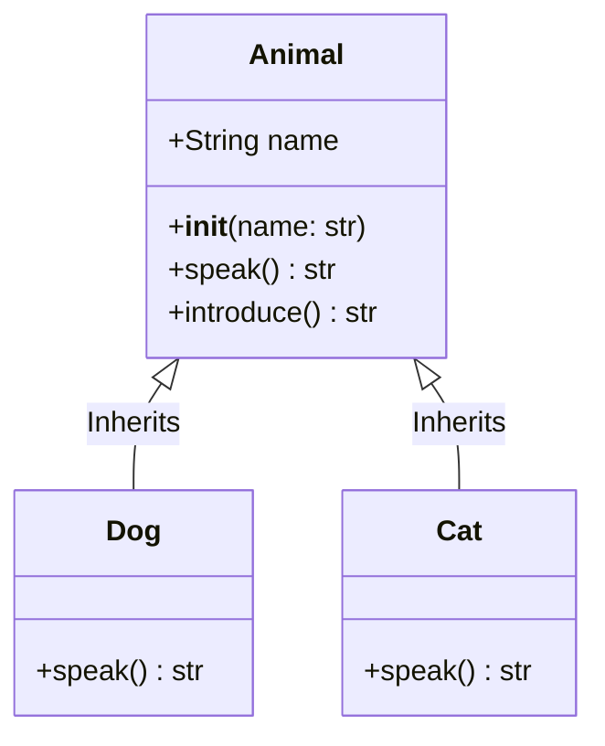
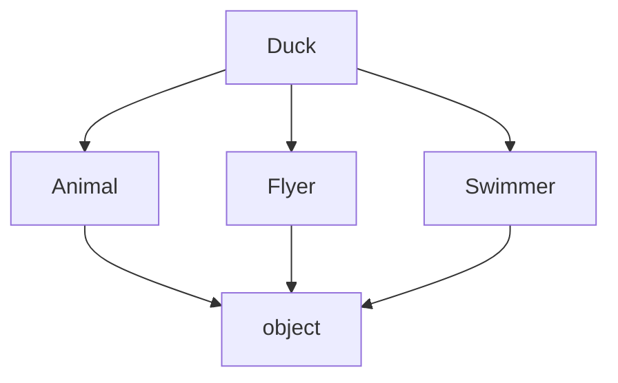

# 05.03 - Inheritance

## 🎯 What You Will Learn
- **Concept of Inheritance**: Creating parent (base) and child (derived) classes.
- **The `super()` Function**: Delegating method calls to parent classes.
- **Method Overriding**: Customizing inherited behaviors.
- **Multiple Inheritance**: Inheriting from more than one class.
- **Method Resolution Order (MRO)**: How Python resolves method calls in complex hierarchies.

---

## 🧠 Comprehensive Notes

Inheritance allows us to define a class that inherits all the methods and properties from another class.
- **Parent class** (Base class): The class being inherited from.
- **Child class** (Derived class): The class that inherits from another class.

### Why use Inheritance?
- **Code Reusability**: Avoid writing the same code multiple times.
- **Logical Hierarchy**: Model real-world relationships (e.g., A Dog *is an* Animal).
- **Extensibility**: Add new features to existing codebases without modifying the original code.

---

## Basic Inheritance

```python
from typing import override

class Animal:
    def __init__(self, name: str) -> None:
        self.name = name

    def speak(self) -> str:
        raise NotImplementedError("Subclass must implement abstract method")

    def introduce(self) -> str:
        return f"I am {self.name}"

class Dog(Animal):
    @override
    def speak(self) -> str:
        return f"{self.name} says Woof!"

class Cat(Animal):
    @override
    def speak(self) -> str:
        return f"{self.name} says Meow!"

dog = Dog("Buddy")
cat = Cat("Whiskers")

print(dog.speak())      # Buddy says Woof!
print(cat.speak())      # Whiskers says Meow!
print(dog.introduce())  # I am Buddy (inherited!)
```

### Memory Allocation & Class Diagram



---

## Using `super()`

The `super()` built-in returns a proxy object that allows you to refer parent class by `super()`. It's essential for initializing parent classes and extending their methods.

```python
from typing import override

class Vehicle:
    def __init__(self, make: str, model: str, year: int) -> None:
        self.make = make
        self.model = model
        self.year = year
        self.odometer = 0

    def describe(self) -> str:
        return f"{self.year} {self.make} {self.model}"

class ElectricCar(Vehicle):
    def __init__(self, make: str, model: str, year: int, battery_size: int = 75) -> None:
        # Initialize parent attributes
        super().__init__(make, model, year)
        self.battery_size = battery_size

    def describe_battery(self) -> str:
        return f"Battery: {self.battery_size} kWh"

    @override
    def describe(self) -> str:
        # Extend parent method
        base_description = super().describe()
        return f"{base_description} (Electric)"

tesla = ElectricCar("Tesla", "Model 3", 2024)
print(tesla.describe())
```

### Code Execution Trace for `super()`
When `tesla = ElectricCar("Tesla", "Model 3", 2024)` is called:
1. `ElectricCar.__init__` is invoked.
2. `super().__init__` delegates the call to `Vehicle.__init__`.
3. `Vehicle.__init__` sets `make`, `model`, `year`, and `odometer`.
4. Control returns to `ElectricCar.__init__` which sets `battery_size`.

---

## Checking Inheritance

Python provides built-in functions to check class relationships dynamically.

```python
print(isinstance(tesla, ElectricCar))  # True: tesla is an ElectricCar
print(isinstance(tesla, Vehicle))      # True: tesla is also a Vehicle
print(issubclass(ElectricCar, Vehicle)) # True: ElectricCar inherits from Vehicle
print(issubclass(Vehicle, ElectricCar)) # False: Vehicle does not inherit from ElectricCar
```

---

## Multiple Inheritance & MRO

Python supports multiple inheritance, meaning a class can inherit from multiple parent classes.

```python
from typing import override

class Flyer:
    def fly(self) -> str:
        return "Flying high!"

class Swimmer:
    def swim(self) -> str:
        return "Swimming fast!"

class Duck(Animal, Flyer, Swimmer):
    @override
    def speak(self) -> str:
        return f"{self.name} says Quack!"

duck = Duck("Donald")
print(duck.speak())  # Quack!
print(duck.fly())    # Flying high!
print(duck.swim())   # Swimming fast!
```

### Method Resolution Order (MRO)
MRO is the order in which Python looks for a method in a hierarchy of classes. It uses the C3 linearization algorithm.

```python
print(Duck.__mro__)
# Output:
# (<class '__main__.Duck'>, <class '__main__.Animal'>, <class '__main__.Flyer'>, <class '__main__.Swimmer'>, <class 'object'>)
```



---

## 🧪 Interactive Practice Exercises

### Exercise 1: Shape Hierarchy
Create a basic `Shape` class, and extend it with `Rectangle` and `Circle` using modern type hints.

**Try it yourself before looking at the solution!**

<details>
<summary>View Solution</summary>

```python
import math
from typing import override

class Shape:
    def __init__(self, color: str) -> None:
        self.color = color

    def area(self) -> float:
        raise NotImplementedError

class Rectangle(Shape):
    def __init__(self, color: str, width: float, height: float) -> None:
        super().__init__(color)
        self.width = width
        self.height = height

    @override
    def area(self) -> float:
        return self.width * self.height

class Circle(Shape):
    def __init__(self, color: str, radius: float) -> None:
        super().__init__(color)
        self.radius = radius

    @override
    def area(self) -> float:
        return math.pi * self.radius ** 2

shapes: list[Shape] = [Rectangle("red", 5.0, 3.0), Circle("blue", 4.0)]
for shape in shapes:
    print(f"{shape.color} shape area: {shape.area():.2f}")
```
</details>

### Exercise 2: Employee Hierarchy
Build an `Employee` base class and a `Manager` derived class. Use `super()` to override the `info()` method.

<details>
<summary>View Solution</summary>

```python
from typing import override

class Employee:
    def __init__(self, name: str, salary: float) -> None:
        self.name = name
        self.salary = salary

    def info(self) -> str:
        return f"{self.name}: ${self.salary:,.2f}"

class Manager(Employee):
    def __init__(self, name: str, salary: float, department: str) -> None:
        super().__init__(name, salary)
        self.department = department

    @override
    def info(self) -> str:
        base_info = super().info()
        return f"{base_info} - Manager of {self.department}"

mgr = Manager("Alice", 85000.50, "Engineering")
print(mgr.info())
```
</details>

---

## ✅ Check Your Understanding

1. **What is inheritance?**
2. **What does `super()` do in Python?**
3. **Can a Python class inherit from multiple classes?**
4. **What is method overriding?**
5. **What is MRO and why is it important in multiple inheritance?**

<details>
<summary>View Answers</summary>

1. **Inheritance** is a mechanism where a new class (child) derives properties and methods from an existing class (parent).
2. `super()` returns a proxy object that delegates method calls to a parent or sibling class, allowing you to access inherited methods that have been overridden in a class.
3. Yes, Python fully supports **multiple inheritance** (e.g., `class Child(Parent1, Parent2):`).
4. **Method overriding** occurs when a child class provides a specific implementation of a method that is already provided by one of its parent classes.
5. **MRO (Method Resolution Order)** is the set of rules that construct the linearization of a class. It dictates the order in which base classes are searched when looking for a method, preventing ambiguity (e.g., the Diamond Problem).
</details>

---

## 🔗 Next Steps

→ [[05.04 - Polymorphism]]
→ [[MOC - Python Master Guide]]
