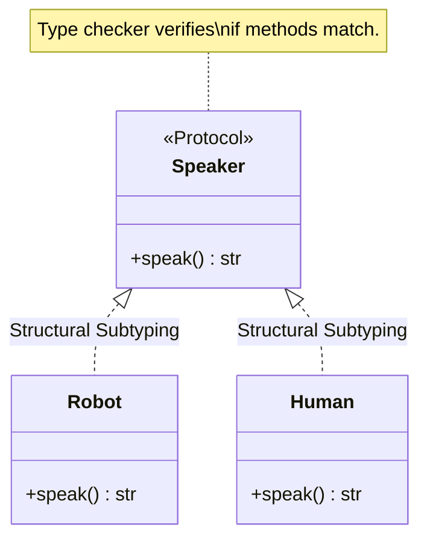
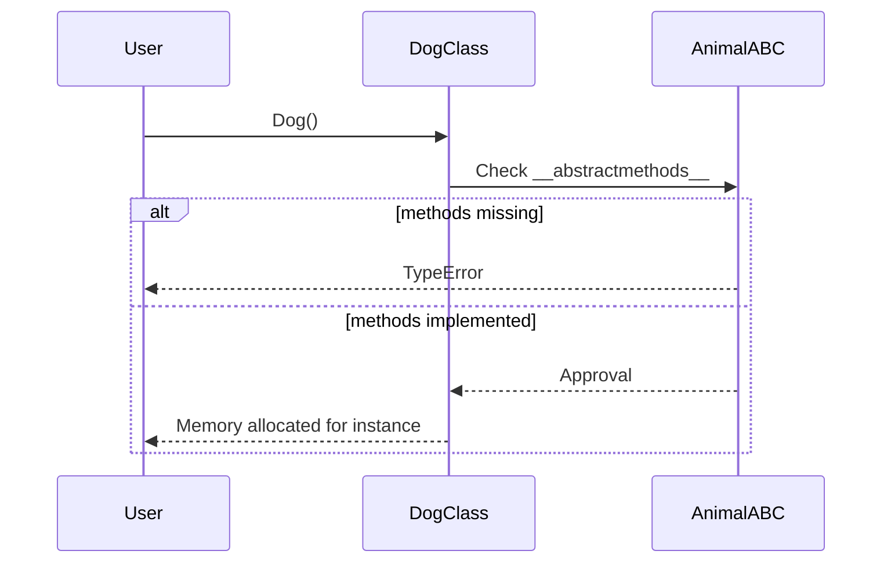

# 05.04 - Polymorphism

## 🎯 What You Will Learn
- **Deep Understanding of Polymorphism**: The concept of "many forms" in object-oriented programming.
- **Duck Typing & Structural Subtyping**: Python's flexible approach to interfaces using modern `typing.Protocol` (Python 3.8+).
- **Method Overriding**: How subclasses provide specific implementations for methods defined in superclasses.
- **Abstract Base Classes (ABCs)**: Using the `abc` module for strict interface enforcement.
- **Modern Python 3.12+ Syntax**: Type hinting, generics, and pattern matching in polymorphic contexts.
- **Memory & Execution Models**: Visualizing how method resolution order (MRO) and memory bindings operate dynamically.

---

## 🧠 What is Polymorphism?

Polymorphism (from Greek *poly* meaning "many" and *morphe* meaning "form") allows objects of different classes to be treated as objects of a common superclass or interface. It provides a single interface to entities of different types.

### The "Animal" Example (Classic OOP)

In Python, you don't always need a formal interface or superclass to achieve polymorphism. As long as objects support the same method, a function can invoke it.

```python
from typing import Iterable

class Dog:
    def speak(self) -> str:
        return "Woof!"

    def __str__(self) -> str:
        return "Dog"

class Cat:
    def speak(self) -> str:
        return "Meow!"

    def __str__(self) -> str:
        return "Cat"

class Duck:
    def speak(self) -> str:
        return "Quack!"

    def __str__(self) -> str:
        return "Duck"

# Polymorphic function using type hinting for readability
def animal_concert(animals: Iterable[Dog | Cat | Duck]) -> None:
    for animal in animals:
        # Dynamic dispatch at runtime determines which `speak` is called
        print(f"{animal}: {animal.speak()}")

zoo = [Dog(), Cat(), Duck()]
animal_concert(zoo)
```

### 🔍 Code Execution Trace
1. `zoo` list is created containing instances of `Dog`, `Cat`, and `Duck`.
2. `animal_concert` is called. It iterates over the list.
3. Iteration 1: `animal` is `Dog`. Python looks up `speak` in `Dog`'s namespace. Returns `"Woof!"`.
4. Iteration 2: `animal` is `Cat`. Python looks up `speak` in `Cat`'s namespace. Returns `"Meow!"`.
5. Iteration 3: `animal` is `Duck`. Python looks up `speak` in `Duck`'s namespace. Returns `"Quack!"`.

---

## 🦆 Duck Typing & Structural Subtyping (Protocols)

*"If it walks like a duck and quacks like a duck, it must be a duck."*

Python determines compatibility by an object's behavior (methods and properties) rather than its inheritance lineage. Modern Python introduces **Protocols** (`typing.Protocol`) to formalize duck typing.

```python
from typing import Protocol

# Formalizing duck typing with Protocol
class Speaker(Protocol):
    def speak(self) -> str:
        ...

class Robot:
    def speak(self) -> str:
        return "Beep boop!"

class Human:
    def speak(self) -> str:
        return "Hello there!"

# make_it_speak accepts ANY object that implements the Speaker protocol
def make_it_speak(entity: Speaker) -> None:
    print(f"Entity says: {entity.speak()}")

# No shared base class, but both satisfy the Protocol!
make_it_speak(Robot())
make_it_speak(Human())
```

### 📊 Memory & Binding Diagram



---

## 🏛️ Polymorphism with Inheritance

When using inheritance, subclasses **override** the methods of their parent class to provide specialized behavior. 

```python
import math

class Shape:
    def area(self) -> float:
        raise NotImplementedError("Subclass must implement abstract method")

    def perimeter(self) -> float:
        raise NotImplementedError("Subclass must implement abstract method")

class Rectangle(Shape):
    def __init__(self, width: float, height: float) -> None:
        self.width = width
        self.height = height

    # Overriding the parent method
    def area(self) -> float:
        return self.width * self.height

    def perimeter(self) -> float:
        return 2 * (self.width + self.height)

class Circle(Shape):
    def __init__(self, radius: float) -> None:
        self.radius = radius

    def area(self) -> float:
        return math.pi * self.radius ** 2

    def perimeter(self) -> float:
        return 2 * math.pi * self.radius

shapes: list[Shape] = [Rectangle(5.0, 3.0), Circle(4.0)]

for shape in shapes:
    print(f"{type(shape).__name__} - Area: {shape.area():.2f}, Perimeter: {shape.perimeter():.2f}")
```

---

## 🛡️ Abstract Base Classes (ABCs)

While `NotImplementedError` is useful, Python provides the `abc` module to strictly enforce interface implementation at instantiation time (rather than runtime execution time).

```python
from abc import ABC, abstractmethod

class Animal(ABC):
    @abstractmethod
    def speak(self) -> str:
        pass

    @abstractmethod
    def move(self) -> str:
        pass

class Dog(Animal):
    def speak(self) -> str:
        return "Woof!"

    def move(self) -> str:
        return "Running on 4 legs"

# animal = Animal()  # TypeError: Can't instantiate abstract class Animal
dog = Dog()  # OK, because all abstract methods are implemented.
```

### 🧠 Behind the Scenes: Memory Allocation & MRO



---

## 🪄 Modern Pattern Matching (Python 3.10+)

Polymorphism pairs beautifully with structural pattern matching, allowing elegant conditional routing based on object types.

```python
def process_shape(shape: Shape) -> None:
    match shape:
        case Circle(radius=r):
            print(f"Circle with radius {r}")
        case Rectangle(width=w, height=h):
            print(f"Rectangle {w}x{h}")
        case _:
            print("Unknown Shape")
```

---

## 🧪 Practice & Exercises

### Exercise 1: Payment Processor (Duck Typing / Protocol)

Create a system that processes payments. 
**Task**: Define a `PaymentProcessor` protocol with a `pay(amount: float)` method. Implement `CreditCard`, `PayPal`, and `Crypto` classes matching this protocol.

<details>
<summary>💡 Click to reveal solution</summary>

```python
from typing import Protocol

class PaymentMethod(Protocol):
    def pay(self, amount: float) -> str:
        ...

class CreditCard:
    def pay(self, amount: float) -> str:
        return f"Paid ${amount:.2f} using Credit Card"

class PayPal:
    def pay(self, amount: float) -> str:
        return f"Paid ${amount:.2f} using PayPal"

class Crypto:
    def pay(self, amount: float) -> str:
        return f"Paid ${amount:.2f} using Bitcoin"

def process_payment(method: PaymentMethod, amount: float) -> None:
    print(method.pay(amount))

process_payment(CreditCard(), 100.0)
process_payment(Crypto(), 50.0)
```
</details>

### Exercise 2: File Handler (Abstract Base Classes)

**Task**: Create an abstract class `FileHandler` with abstract methods `read` and `write`. Create subclasses `TextFile` and `CSVFile` that implement these methods strictly.

<details>
<summary>💡 Click to reveal solution</summary>

```python
from abc import ABC, abstractmethod
import csv

class FileHandler(ABC):
    def __init__(self, filename: str) -> None:
        self.filename = filename

    @abstractmethod
    def read(self) -> str | list[list[str]]:
        pass

    @abstractmethod
    def write(self, data: str | list[list[str]]) -> None:
        pass

class TextFile(FileHandler):
    def read(self) -> str:
        with open(self.filename, 'r') as f:
            return f.read()

    def write(self, data: str) -> None:
        with open(self.filename, 'w') as f:
            f.write(data)

class CSVFile(FileHandler):
    def read(self) -> list[list[str]]:
        with open(self.filename, 'r') as f:
            return list(csv.reader(f))

    def write(self, data: list[list[str]]) -> None:
        with open(self.filename, 'w', newline='') as f:
            writer = csv.writer(f)
            writer.writerows(data)
```
</details>

---

## ✅ Check Your Understanding

1. **What is polymorphism?**
2. **What is duck typing?**
3. **How does Python 3.8+ formalize duck typing?**
4. **What is the difference between raising `NotImplementedError` and using the `abc` module?**
5. **How does dynamic dispatch work in Python when a polymorphic method is called?**

<details>
<summary>Answers</summary>

1. Ability to use different classes interchangeably through a common interface or shared behavior.
2. Type determined by behavior (methods/properties present), not inheritance.
3. Using `typing.Protocol` (Structural Subtyping), allowing static type checkers (like mypy) to enforce duck typing.
4. `NotImplementedError` fails at **runtime** when the method is called. `abc` fails at **instantiation time** if the class doesn't implement all abstract methods, preventing invalid objects from existing.
5. Python resolves method names at runtime by searching the object's class namespace (and parent classes via MRO). Even if variables are untyped, the runtime invokes the specific method attached to the actual instance object in memory.
</details>

---

## 🔗 Next Steps

→ [[05.05 - Encapsulation]]
→ [[MOC - Python Master Guide]]
