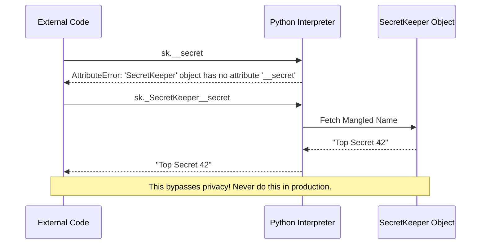

# 05.05 - Encapsulation in Python

## 🎯 What You Will Learn
- The core concept of Data Hiding and Encapsulation
- Public, protected (`_`), and private (`__`) attributes
- Python's name mangling mechanism
- Modern Python 3.12+ getters and setters using `@property`
- Best practices for designing robust APIs

---

## 🧠 The Concept of Encapsulation

Encapsulation is the bundling of data (attributes) and methods that operate on that data into a single unit (a class), while restricting direct access to some of the object's components. 

This is crucial because:
1. **Data Integrity:** Prevents invalid state (e.g., negative age or balance).
2. **Implementation Hiding:** Allows developers to change internal implementation without breaking the external API.

### Memory & State Diagram

```mermaid
stateDiagram-v2
    classDef public fill:#d4edda,stroke:#28a745
    classDef protected fill:#fff3cd,stroke:#ffc107
    classDef private fill:#f8d7da,stroke:#dc3545
    
    State "Object boundary (Encapsulation)" as Object {
        PublicData:::public
        ProtectedData:::protected
        PrivateData:::private
        
        Methods:::public --> PublicData : Access
        Methods:::public --> ProtectedData : Access
        Methods:::public --> PrivateData : Access
    }
    
    ExternalCode --> Methods : Allowed
    ExternalCode --> PublicData : Allowed
    ExternalCode -.-> ProtectedData : Discouraged (Convention)
    ExternalCode --x PrivateData : Blocked (Name Mangling)
```

---

## 🔓 Access Modifiers in Python

Unlike languages such as Java or C++, Python does not have strict, compiler-enforced access modifiers. Instead, it relies heavily on **naming conventions** and a mechanism called **name mangling**.

### 1. Public Attributes (Default)
Attributes are public by default. They can be accessed and modified from anywhere.

```python
class Car:
    def __init__(self, make: str, model: str) -> None:
        self.make = make      # Public
        self.model = model    # Public
        self.year = 2024      # Public

car = Car("Toyota", "Camry")
print(car.make)     # Valid: Toyota
car.year = 2025     # Valid modification
```

### 2. Protected Attributes (`_` prefix)
Prefixing an attribute with a single underscore `_` signals to other developers: *"This is for internal use. Please don't touch it from the outside."* However, Python **does not prevent** access.

```python
class Employee:
    def __init__(self, name: str, salary: float) -> None:
        self.name = name
        self._salary = salary  # Protected by convention

emp = Employee("Alice", 50000.0)
print(emp._salary)  # Works, but highly discouraged!
```

### 3. Private Attributes (`__` prefix)
Prefixing with a double underscore `__` triggers **name mangling**. The Python interpreter renames the attribute to make it harder to access accidentally.

```python
class SecretKeeper:
    def __init__(self) -> None:
        self.__secret = "Top Secret 42"

    def reveal(self) -> str:
        return f"The secret is: {self.__secret}"

sk = SecretKeeper()

# ❌ print(sk.__secret)  # Raises AttributeError!
print(sk.reveal())       # ✅ Output: The secret is: Top Secret 42
```

#### Under the Hood: Name Mangling Trace

When Python sees `self.__secret` inside `SecretKeeper`, it internally renames it to `_SecretKeeper__secret`.



---

## 🛠️ Modern Python Properties (`@property`)

Instead of writing verbose `get_age()` and `set_age()` methods like in Java, Python uses the `@property` decorator to create "managed attributes". This allows you to write clean attribute-access syntax while running hidden logic (like validation).

```python
class Temperature:
    def __init__(self, celsius: float) -> None:
        self._celsius = celsius  # Protected storage

    @property
    def celsius(self) -> float:
        """The celsius property (Getter)."""
        return self._celsius

    @celsius.setter
    def celsius(self, value: float) -> None:
        """Setter with validation."""
        if value < -273.15:
            raise ValueError("Temperature cannot be below absolute zero!")
        self._celsius = value
        
    @property
    def fahrenheit(self) -> float:
        """Computed property (Read-only)."""
        return (self._celsius * 9/5) + 32

temp = Temperature(25.0)
print(temp.celsius)      # 25.0 (Calls getter implicitly)
temp.celsius = 30.0      # (Calls setter implicitly)
# temp.celsius = -300.0  # Raises ValueError!

print(temp.fahrenheit)   # 86.0 (Computed on the fly)
```

---

## 🧪 Interactive Practice

### Exercise 1: The Secure Bank Account
Refactor the following snippet. Implement a `SecureAccount` class using `@property` for `balance` so it cannot be directly set, but can be updated via `deposit()` and `withdraw()` methods.

<details>
<summary><b>💡 Click to reveal solution</b></summary>

```python
class SecureAccount:
    def __init__(self, owner: str, initial_balance: float) -> None:
        self.owner = owner
        self.__balance = initial_balance
        self.__history: list[str] = []

    @property
    def balance(self) -> float:
        return self.__balance
        
    @property
    def history(self) -> list[str]:
        return self.__history.copy() # Return a copy to prevent external modification

    def deposit(self, amount: float) -> None:
        if amount <= 0:
            raise ValueError("Deposit amount must be positive.")
        self.__balance += amount
        self.__history.append(f"Deposited: ${amount:.2f}")

    def withdraw(self, amount: float) -> None:
        if amount <= 0:
            raise ValueError("Withdrawal amount must be positive.")
        if amount > self.__balance:
            raise ValueError("Insufficient funds.")
        self.__balance -= amount
        self.__history.append(f"Withdrew: ${amount:.2f}")

acc = SecureAccount("Alice", 1000.0)
acc.deposit(500.0)
print(acc.balance)  # 1500.0
# acc.balance = 5000.0  # AttributeError: can't set attribute
```
</details>

---

## ✅ Check Your Understanding

1. **What is the difference between `_data` and `__data`?**
2. **Why do we use `@property` instead of explicit getters and setters?**
3. **Can you completely hide data in Python?**
4. **How does Python's name mangling alter `__password` in a class named `User`?**

<details>
<summary><b>Check Answers</b></summary>
    
1. `_data` is a **convention** indicating protected status. `__data` triggers **name mangling** to make the attribute harder to access from the outside.
2. `@property` maintains the clean, readable syntax of direct attribute access (`obj.attr = value`) while still allowing validation logic behind the scenes.
3. **No.** "We are all consenting adults here." Python allows bypassing name mangling via `_ClassName__attribute`. It's designed to prevent *accidental* access, not intentional sabotage.
4. It renames it to `_User__password`.
</details>

---

## 🔗 Next Steps

→ [[05.06 - Dunder Methods]]
→ [[MOC - Python Master Guide]]
