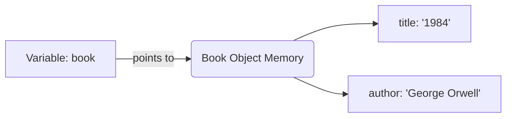

# 05.06 - Dunder Methods (Magic Methods)

## 🎯 What You Will Learn
- **Core Concept**: What dunder (magic) methods are and why they are the secret sauce of Python's elegance.
- **String Representation**: The distinction and use-cases for `__str__` and `__repr__`.
- **Operator Overloading**: Implementing comparison (`__eq__`, `__lt__`) and arithmetic (`__add__`, `__mul__`) methods.
- **Container Protocols**: Building custom collections using `__len__`, `__getitem__`, `__contains__`, and `__iter__`.
- **Callables and Context Managers**: Making objects callable (`__call__`) and supporting the `with` statement (`__enter__`, `__exit__`).

> [!NOTE]
> **What does "Dunder" mean?**
> "Dunder" is short for **Double UNDERscore**. These methods are surrounded by double underscores, like `__init__` or `__str__`. They let you define how custom objects behave with Python's built-in syntax (e.g., `+`, `==`, `len()`).

---

## 🏗️ String Representation: The Object's Identity

In Python, an object has two standard ways to be represented as a string:
1. `__str__`: A readable, user-friendly description. Called by `str(obj)` or `print(obj)`.
2. `__repr__`: An unambiguous, developer-focused representation. Often returns a string that could recreate the object. Called by `repr(obj)` or when inspecting objects in the REPL.

```python
from typing import Self

class Book:
    def __init__(self, title: str, author: str) -> None:
        self.title = title
        self.author = author

    def __str__(self) -> str:
        # User-facing
        return f"'{self.title}' by {self.author}"

    def __repr__(self) -> str:
        # Developer-facing: Ideally looks like a valid Python expression
        return f"Book(title={self.title!r}, author={self.author!r})"

book = Book("1984", "George Orwell")

print(str(book))   # Output: '1984' by George Orwell
print(repr(book))  # Output: Book(title='1984', author='George Orwell')
```

### Memory Allocation & References



---

## ⚖️ Comparison Methods

Python allows you to overload comparison operators like `==`, `<`, and `>` using dunder methods.

```python
class Rectangle:
    def __init__(self, width: float, height: float) -> None:
        self.width = width
        self.height = height

    @property
    def area(self) -> float:
        return self.width * self.height

    def __eq__(self, other: object) -> bool:
        if not isinstance(other, Rectangle):
            return NotImplemented
        return self.area == other.area

    def __lt__(self, other: "Rectangle") -> bool:
        return self.area < other.area

r1 = Rectangle(2, 3)
r2 = Rectangle(3, 2)
r3 = Rectangle(4, 5)

print(r1 == r2)  # True, both areas are 6
print(r1 < r3)   # True, 6 < 20
```

> [!TIP]
> **Best Practice**: Always use `isinstance()` checks inside `__eq__` and return `NotImplemented` if the type isn't supported. This allows Python to try the reverse comparison operation (`other.__eq__(self)`) before raising a `TypeError`.

---

## 🧮 Arithmetic Operators

You can make your custom objects support mathematical operations (`+`, `-`, `*`, `/`, etc.).

```python
class Vector:
    def __init__(self, x: float, y: float) -> None:
        self.x = x
        self.y = y

    def __add__(self, other: Self) -> Self:
        return type(self)(self.x + other.x, self.y + other.y)
        
    def __mul__(self, scalar: float) -> Self:
        return type(self)(self.x * scalar, self.y * scalar)

    def __repr__(self) -> str:
        return f"Vector({self.x}, {self.y})"

v1 = Vector(1, 2)
v2 = Vector(3, 4)

# Execution Trace:
# v1 + v2  =>  v1.__add__(v2)
result_add = v1 + v2
print(result_add)  # Vector(4, 6)

# v1 * 3   =>  v1.__mul__(3)
result_mul = v1 * 3
print(result_mul)  # Vector(3, 6)
```

---

## 📦 Container Protocols

You can make your class behave like built-in lists or dictionaries by implementing container dunder methods.

- `__len__(self)`: Called by `len(obj)`.
- `__getitem__(self, key)`: Called by `obj[key]`.
- `__setitem__(self, key, value)`: Called by `obj[key] = value`.
- `__contains__(self, item)`: Called by `item in obj`.
- `__iter__(self)`: Called when iterating `for x in obj`.

```python
class ShoppingCart:
    def __init__(self) -> None:
        self._items: list[str] = []

    def add(self, item: str) -> None:
        self._items.append(item)

    def __len__(self) -> int:
        return len(self._items)

    def __getitem__(self, index: int) -> str:
        return self._items[index]

    def __contains__(self, item: str) -> bool:
        return item in self._items

cart = ShoppingCart()
cart.add("Apple")
cart.add("Banana")

print(len(cart))          # 2
print(cart[0])            # Apple
print("Apple" in cart)    # True
```

---

## 🚀 Callables

You can make an instance of your class callable, exactly like a function, by implementing `__call__`.

```python
class RequestRateLimiter:
    def __init__(self, limit: int) -> None:
        self.limit = limit
        self.calls = 0

    def __call__(self) -> bool:
        """Returns True if the request is allowed, False otherwise."""
        if self.calls < self.limit:
            self.calls += 1
            return True
        return False

limiter = RequestRateLimiter(limit=2)
print(limiter())  # True (Call 1)
print(limiter())  # True (Call 2)
print(limiter())  # False (Limit exceeded)
```

---

## 🧪 Interactive Practice Exercises

### Exercise 1: The Custom Wallet
Create a `Wallet` class that holds a balance. Implement the following:
- `__add__` to add money to the wallet.
- `__sub__` to take money out.
- `__str__` to print the balance nicely, e.g., `"$50.00"`.

<details>
<summary><b>Click to reveal solution</b></summary>

```python
class Wallet:
    def __init__(self, balance: float = 0.0) -> None:
        self.balance = balance

    def __add__(self, amount: float) -> "Wallet":
        return Wallet(self.balance + amount)

    def __sub__(self, amount: float) -> "Wallet":
        if amount > self.balance:
            raise ValueError("Insufficient funds")
        return Wallet(self.balance - amount)

    def __str__(self) -> str:
        return f"${self.balance:.2f}"

my_wallet = Wallet(100.0)
new_wallet = my_wallet - 25.50
print(new_wallet) # $74.50
```
</details>

### Exercise 2: Custom Collection (Pokedex)
Create a `Pokedex` class that holds a list of caught Pokemon names.
Implement `__len__`, `__getitem__`, and `__contains__`.

<details>
<summary><b>Click to reveal solution</b></summary>

```python
class Pokedex:
    def __init__(self) -> None:
        self._caught: list[str] = []

    def catch(self, pokemon: str) -> None:
        if pokemon not in self._caught:
            self._caught.append(pokemon)

    def __len__(self) -> int:
        return len(self._caught)

    def __getitem__(self, index: int) -> str:
        return self._caught[index]

    def __contains__(self, pokemon: str) -> bool:
        return pokemon in self._caught

dex = Pokedex()
dex.catch("Pikachu")
print(len(dex)) # 1
print("Pikachu" in dex) # True
```
</details>

---

## ✅ Check Your Understanding

1. When I run `print(obj)`, which dunder method is prioritized? (`__str__` or `__repr__`)
2. What method should I implement if I want to support `obj1 <= obj2`?
3. What is the return type of `__len__`?
4. If `obj = MyClass()`, what method is invoked by `obj()`?

**Answers:**
1. `__str__` is prioritized. If it's missing, Python falls back to `__repr__`.
2. `__le__(self, other)` (less than or equal to).
3. Always an integer (`int`).
4. `__call__`.

---

## 🔗 Next Steps

→ [[05.07 - Property Decorators]]
→ [[MOC - Python Master Guide]]
