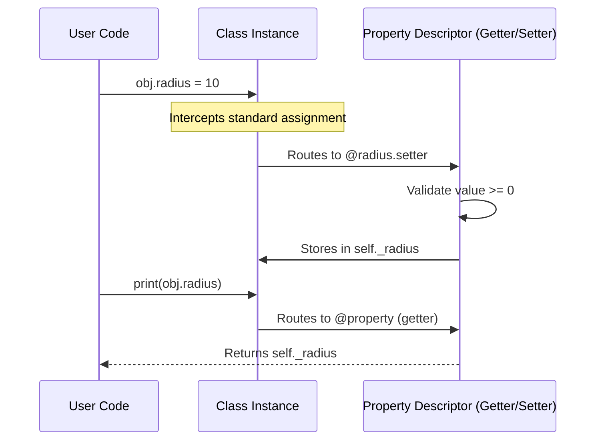

# 05.07 - Property Decorators in Python

## 🎯 What You Will Learn
- **Data Encapsulation:** Protecting internal object state.
- **`@property`:** Creating getter methods that act like attributes.
- **`@name.setter`:** Validating and mutating data cleanly.
- **`@name.deleter`:** Handling attribute deletion gracefully.
- **Computed Properties:** Deriving values on-the-fly.
- **`@cached_property`:** Optimizing expensive computations.
- **Modern Python 3.12+ Syntax:** Utilizing type hints for robust OOP design.

---

## 🧠 Comprehensive Notes: Why Use Properties?

In many object-oriented languages (like Java or C++), it's standard practice to create explicit `get_value()` and `set_value()` methods to encapsulate data. Python takes a more elegant approach: the **Uniform Access Principle**. 

You can start with public attributes. If you later need to add validation or compute the value dynamically, you can convert the attribute to a property *without changing the class interface*. Users of your class can still use `obj.value = 10` instead of `obj.set_value(10)`.

---

## 🏗️ Memory & Execution Flow Diagram

When you use property decorators, Python changes how attribute access works at the memory level via the Descriptor protocol.



---

## 🛠️ Basic Property & Computed Properties

Here is a modern Python 3.12 implementation using type hinting. Notice how properties let us compute `area` dynamically without needing an `area()` method.

```python
import math

class Circle:
    """A circle class demonstrating modern property usage."""
    
    def __init__(self, radius: float) -> None:
        # Note: We assign to the property, which triggers the setter immediately!
        self.radius = radius

    @property
    def radius(self) -> float:
        """The radius of the circle."""
        return self._radius

    @radius.setter
    def radius(self, value: float) -> None:
        if value < 0:
            raise ValueError(f"Radius cannot be negative. Received: {value}")
        self._radius = value

    @property
    def area(self) -> float:
        """Computed property: Area of the circle."""
        return math.pi * self._radius ** 2

    @property
    def diameter(self) -> float:
        """Computed property: Diameter of the circle."""
        return self._radius * 2

# --- Execution Trace ---
c = Circle(5)
# Trace: __init__(5) -> self.radius = 5 -> @radius.setter called -> self._radius = 5

print(c.radius)    
# Trace: @property radius called -> returns 5.0

c.radius = 10      
# Trace: @radius.setter called -> validation passed -> self._radius = 10

print(f"{c.area:.2f}") 
# Trace: @property area called -> returns 314.16
```

> [!TIP]
> Notice in `__init__` we used `self.radius = radius` instead of `self._radius = radius`. This is a best practice because it ensures that validation logic in the setter runs even when the object is first instantiated!

---

## 🔒 Read-Only Properties

If you provide a `@property` but omit the `@name.setter`, the attribute becomes **read-only**. This is excellent for ensuring data immutability.

```python
class Person:
    def __init__(self, first: str, last: str) -> None:
        self._first = first
        self._last = last

    @property
    def full_name(self) -> str:
        """Read-only computed property."""
        return f"{self._first} {self._last}"

    @property
    def first(self) -> str:
        return self._first

    @first.setter
    def first(self, value: str) -> None:
        self._first = value

# --- Execution Trace ---
p = Person("John", "Doe")
print(p.full_name)  # Output: John Doe

try:
    p.full_name = "Jane Doe"
except AttributeError as e:
    print(f"Error caught: {e}") 
    # Error caught: property 'full_name' of 'Person' object has no setter
```

---

## 🗑️ Property with Deleter

You can intercept the `del` keyword using `@name.deleter`. This is useful for memory management, clearing caches, or resetting states.

```python
class TempData:
    def __init__(self) -> None:
        self._data: str | None = None

    @property
    def data(self) -> str | None:
        return self._data

    @data.setter
    def data(self, value: str) -> None:
        self._data = value

    @data.deleter
    def data(self) -> None:
        print("[Trace] Clearing data securely...")
        self._data = None

t = TempData()
t.data = "Sensitive Token"
print(t.data)  # Output: Sensitive Token
del t.data     # Output: [Trace] Clearing data securely...
print(t.data)  # Output: None
```

---

## ⚡ Cached Property (Optimization)

For computationally expensive operations, use `@cached_property` from the `functools` module. It computes the value once and stores it. Subsequent accesses return the stored value instantly.

```python
from functools import cached_property

class DataProcessor:
    def __init__(self, data: list[int]) -> None:
        self.data = data

    @cached_property
    def processed(self) -> set[int]:
        print("[Trace] Processing... (expensive operation)")
        return set(sorted(self.data))

dp = DataProcessor([3, 1, 4, 1, 5, 9, 2, 6])

print("First access:")
print(dp.processed)  
# [Trace] Processing... (expensive operation)
# {1, 2, 3, 4, 5, 6, 9}

print("Second access:")
print(dp.processed)  
# {1, 2, 3, 4, 5, 6, 9} (Instant, no trace printed!)
```

> [!CAUTION]
> A `@cached_property` does NOT auto-update if the underlying data changes. If you append to `dp.data`, `dp.processed` will still hold the old cached value unless you delete it with `del dp.processed`.

---

## 🧪 Interactive Practice

### Exercise 1: Advanced Temperature Converter
Implement a class `Temperature` that tracks temperature in Celsius internally, but allows getting/setting in Fahrenheit and Kelvin. Include validation to prevent temperatures below absolute zero (-273.15 °C).

<details>
<summary><b>💡 Click to view the solution</b></summary>

```python
class Temperature:
    def __init__(self, celsius: float = 0.0) -> None:
        self.celsius = celsius  # Uses setter for validation!

    @property
    def celsius(self) -> float:
        return self._celsius

    @celsius.setter
    def celsius(self, value: float) -> None:
        if value < -273.15:
            raise ValueError("Temperature cannot be below absolute zero!")
        self._celsius = value

    @property
    def fahrenheit(self) -> float:
        return (self._celsius * 9/5) + 32

    @fahrenheit.setter
    def fahrenheit(self, value: float) -> None:
        # Routes through celsius setter to ensure validation
        self.celsius = (value - 32) * 5/9

    @property
    def kelvin(self) -> float:
        return self._celsius + 273.15
        
    @kelvin.setter
    def kelvin(self, value: float) -> None:
        self.celsius = value - 273.15

# Test it
temp = Temperature(25)
print(f"C: {temp.celsius:.1f}, F: {temp.fahrenheit:.1f}, K: {temp.kelvin:.1f}")
temp.fahrenheit = 98.6
print(f"Human body temp in C: {temp.celsius:.1f}")
```
</details>


### Exercise 2: Secure Bank Account
Create a `BankAccount` class where the `balance` is protected. It should only be updated via `deposit()` or `withdraw()` methods, making the `balance` property read-only. However, allow the `owner` name to be updated via a setter.

<details>
<summary><b>💡 Click to view the solution</b></summary>

```python
class BankAccount:
    def __init__(self, owner: str, initial_balance: float = 0.0) -> None:
        self.owner = owner
        self._balance = initial_balance

    @property
    def owner(self) -> str:
        return self._owner

    @owner.setter
    def owner(self, name: str) -> None:
        if not name.strip():
            raise ValueError("Owner name cannot be empty.")
        self._owner = name

    @property
    def balance(self) -> float:
        """Read-only property. Must use methods to change."""
        return self._balance

    def deposit(self, amount: float) -> None:
        if amount <= 0:
            raise ValueError("Deposit amount must be positive.")
        self._balance += amount

    def withdraw(self, amount: float) -> None:
        if amount <= 0:
            raise ValueError("Withdrawal amount must be positive.")
        if amount > self._balance:
            raise ValueError("Insufficient funds.")
        self._balance -= amount

account = BankAccount("Alice", 1000)
print(account.balance)
account.deposit(500)
print(account.balance)
```
</details>

---

## ✅ Check Your Understanding

1. **Why does Python prefer `@property` over explicit `get_x()` and `set_x()` methods?**
2. **If you assign `self.attr = value` inside `__init__`, will the `@attr.setter` be triggered?**
3. **How do you make an attribute read-only?**
4. **What is the primary danger of using `@cached_property`?**

<details>
<summary><b>Answers:</b></summary>
<ol>
    <li>It enforces the Uniform Access Principle, allowing clean syntax (obj.attr) while preserving the ability to add validation logic under the hood without breaking existing code APIs.</li>
    <li>Yes! This is highly recommended to ensure validation logic runs upon object instantiation. (Assuming the property is named 'attr').</li>
    <li>Provide a <code>@property</code> getter, but do not provide a <code>@name.setter</code> decorator.</li>
    <li>The cached value does not automatically invalidate if the underlying data it depends on changes. You must manually delete the cached property to force recalculation.</li>
</ol>
</details>

---

## 🔗 Next Steps

→ [[06.01 - Reading Files]]
→ [[MOC - Python Master Guide]]
