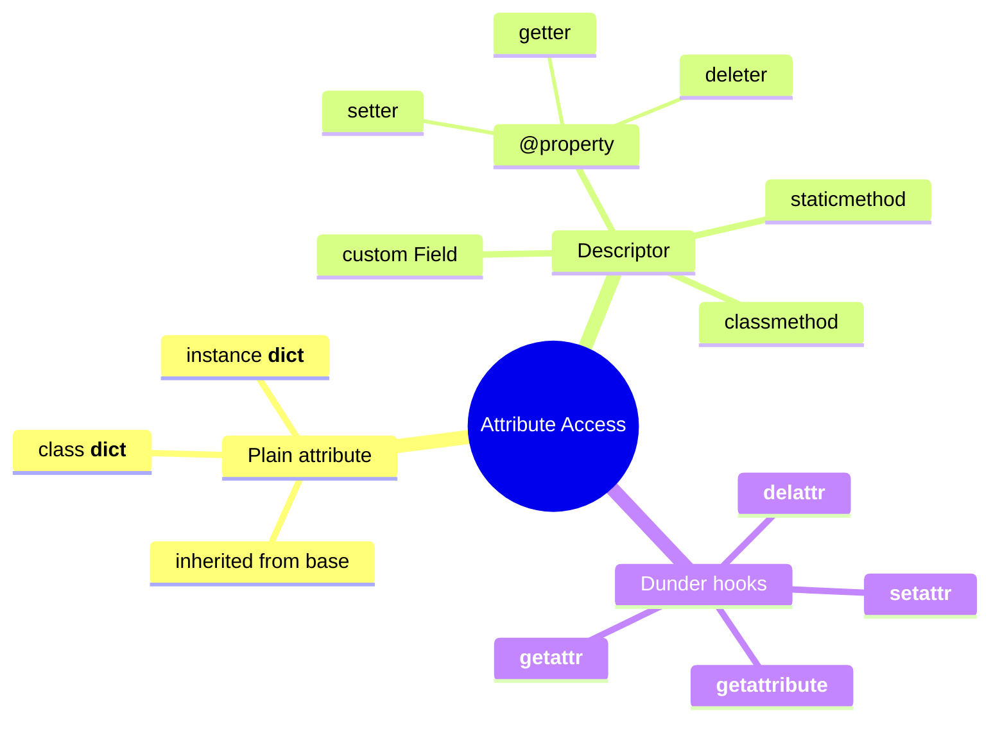
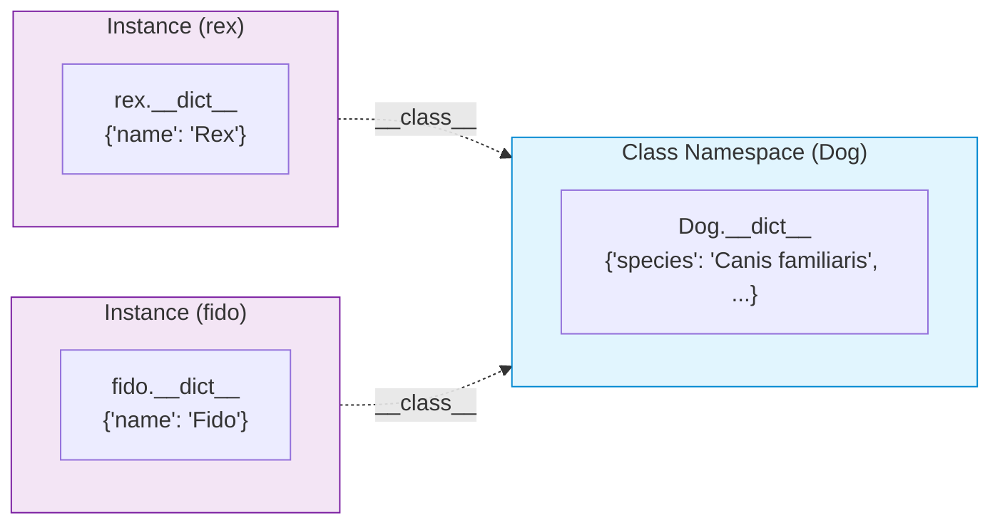
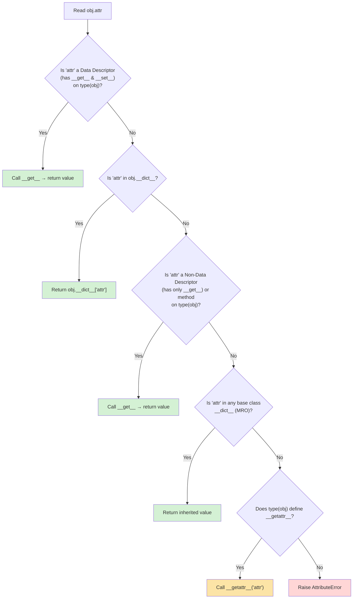
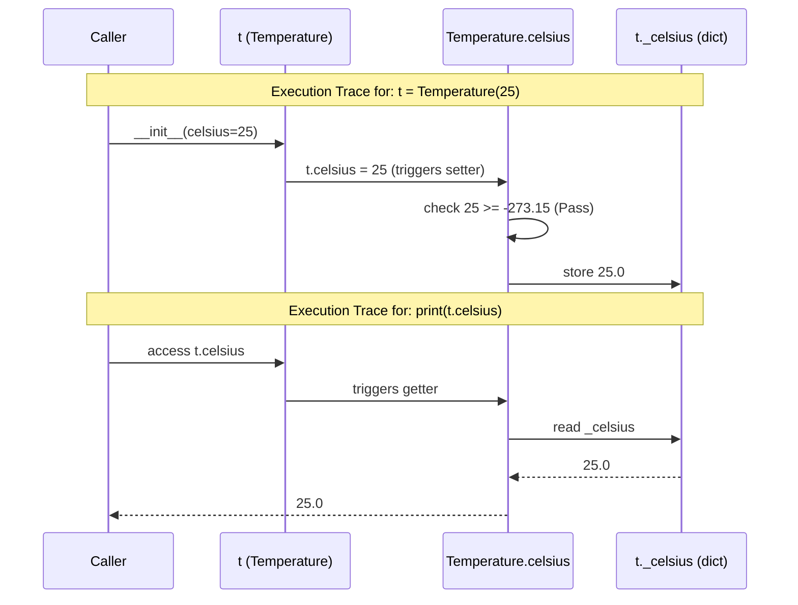
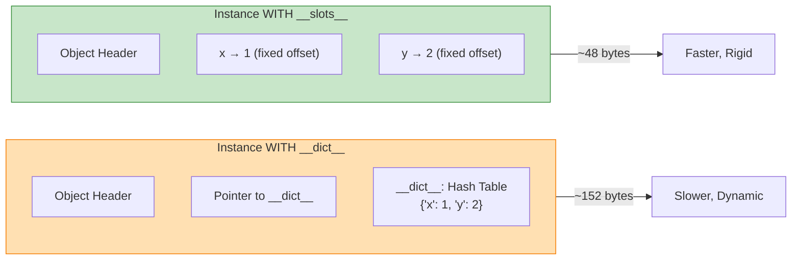

# Attributes and Properties (Python 3.12+)

#oop #fundamentals #attributes #properties #encapsulation #teaching

> [!quote] Raymond Hettinger
> "Properties are how Python does encapsulation without giving up the simple, attribute-style access that makes Python readable."

If a class is the *shape* of an object, then **attributes** are the *slots* in that shape where data lives, and **properties** are the *logic* around those slots — validation, computation, lazy loading, and access control. This note unpacks both, in depth, with a focus on modern Python (3.12+) syntax, memory models, execution traces, and mental models.

Prerequisite: read [[Classes-And-Objects]] first, especially §6 (class vs instance variables) and §7 (`__dict__`).

---

## 1. The Big Picture

Python objects expose three families of "things you can dot-access":

1. **Plain attributes** — `obj.x = 5` writes directly into `obj.__dict__`.
2. **Descriptors** — objects that implement `__get__`/`__set__`/`__delete__` and intercept attribute access. The most common descriptor you'll write is a property.
3. **Dunder hooks** — `__getattr__`, `__getattribute__`, `__setattr__`, which intercept *all* attribute access at the type level.



---

## 2. Instance Attributes vs Class Attributes

### 2.1 The Two Storage Locations

Every Python object stores its dynamic data in a `__dict__` (unless `__slots__` are used). There are *two* distinct `__dict__`s in play:

- `instance.__dict__` — per-object data (instance attributes).
- `Class.__dict__` — shared data (class attributes, methods, descriptors).

```python
class Dog:
    species: str = "Canis familiaris"   # Class attribute (shared)
    
    def __init__(self, name: str) -> None:
        self.name = name                # Instance attribute (unique)

rex = Dog("Rex")
print(rex.__dict__)              # {'name': 'Rex'}      ← only instance data
print(Dog.__dict__['species'])   # 'Canis familiaris'   ← class data
```

### 2.2 Memory Allocation Diagram

When you create instances, Python allocates memory for the instance object and a separate dictionary for its attributes (prior to Python 3.11's inline caching, but conceptually the same).



### 2.3 The Lookup Chain (Critical!)

When you read `rex.species`, Python resolves it via a strict hierarchy:



### 2.4 Execution Trace: The Shadowing Gotcha

Let's trace what happens when we mix instance and class attributes.

```python
class Dog:
    species = "Canis familiaris"

rex = Dog("Rex")

# Trace 1: Reading inherited class attribute
print(rex.species)   
# 1. Not a data descriptor.
# 2. Not in rex.__dict__.
# 3. Found in Dog.__dict__. Returns "Canis familiaris".

# Trace 2: Writing shadows the class attribute
rex.species = "Wolf" 
# Writes "Wolf" into rex.__dict__['species'].

# Trace 3: Reading after shadowing
print(rex.species)
# 1. Not a data descriptor.
# 2. Found in rex.__dict__! Returns "Wolf".

# Trace 4: Deleting instance attribute un-shadows it
del rex.species
print(rex.species)   # "Canis familiaris" again
```

> [!danger] The Mutable Default Trap
> `tricks = []` as a class attribute means *all instances share the same list*. Use `self.tricks = []` in `__init__` instead.

---

## 3. Properties: The Encapsulation Workhorse

### 3.1 What Is a Property?

A **property** is a built-in data descriptor (`@property`) that lets you attach *getter*, *setter*, and *deleter* functions to an attribute name. To the outside world, it looks like a plain attribute.

```python
class Temperature:
    def __init__(self, celsius: float = 0.0) -> None:
        self.celsius = celsius  # Invokes the setter!

    @property
    def celsius(self) -> float:
        return self._celsius

    @celsius.setter
    def celsius(self, value: float) -> None:
        if value < -273.15:
            raise ValueError("Below absolute zero")
        self._celsius = float(value)

    @property
    def fahrenheit(self) -> float:
        return self._celsius * 9 / 5 + 32
```

### 3.2 Property Lifecycle Execution Trace



### 3.3 Lazy Properties (`@cached_property`)

In Python 3.8+, `functools.cached_property` caches expensive computations. It relies on the fact that it is a *non-data descriptor* (no `__set__`).

```python
from functools import cached_property
import time

class DataAnalyzer:
    @cached_property
    def expensive_summary(self) -> int:
        print("Computing...")
        time.sleep(1)
        return 42

a = DataAnalyzer()
# Access 1: 'expensive_summary' not in a.__dict__. Calls cached_property.__get__.
# It computes the value, stores it in a.__dict__['expensive_summary'] = 42, and returns 42.
print(a.expensive_summary)  

# Access 2: 'expensive_summary' IS NOW in a.__dict__. 
# Since cached_property is a non-data descriptor, the instance dict wins!
# Returns 42 immediately without calling the function.
print(a.expensive_summary)  
```

---

## 4. `__slots__` — Memory Efficiency

Every instance normally carries a `__dict__`. For classes with millions of instances, the overhead is huge. `__slots__` bypasses `__dict__` and creates fixed offsets in memory.

### 4.1 Memory Comparison Diagram



### 4.2 Modern Slot Syntax (Python 3.10+ Dataclasses)

If you use `@dataclass`, you can get `__slots__` automatically in Python 3.10+:

```python
from dataclasses import dataclass

@dataclass(slots=True)
class Point:
    x: float
    y: float

p = Point(1, 2)
# p.z = 3  # AttributeError: 'Point' object has no attribute 'z'
```

---

## 5. Private Attributes: Convention and Name Mangling

Python trusts you. It uses naming conventions instead of hard compiler blocks.

| Prefix | Name | Meaning | Enforcement |
|---|---|---|---|
| None | `name` | Public API | None |
| Single `_` | `_name` | Protected/Internal | Linter warnings only |
| Double `__` | `__name` | "Private" (Mangling) | Interpreter renames it to `_ClassName__name` |

```python
class Secret:
    def __init__(self) -> None:
        self.__code = 1234  # Mangled to _Secret__code

s = Secret()
# print(s.__code)        # AttributeError
print(s._Secret__code)   # 1234 (Still accessible if you really try)
```

> [!tip] Best Practice
> Always use `_` for internal state. Reserve `__` ONLY when you are writing a library base class and fear a user subclass might accidentally shadow your attribute name.

---

## 6. Interactive Practice Exercises

> [!example] Exercise 1 — Validated `Email`
> Write a `User` class with an `email` property. The setter must validate that the value contains `@` and a `.`.
> <details>
> <summary><b>Reveal Solution</b></summary>
> 
> ```python
> class User:
>     def __init__(self, email: str) -> None:
>         self.email = email
> 
>     @property
>     def email(self) -> str:
>         return self._email
> 
>     @email.setter
>     def email(self, value: str) -> None:
>         if "@" not in value or "." not in value:
>             raise ValueError("Invalid email format")
>         self._email = value
> ```
> </details>

> [!example] Exercise 2 — Read-only `id`
> Build a `Ticket` class with an auto-incremented `id` assigned in `__init__`. Make `id` a read-only property (no setter).
> <details>
> <summary><b>Reveal Solution</b></summary>
> 
> ```python
> class Ticket:
>     _next_id = 1
> 
>     def __init__(self) -> None:
>         self._id = Ticket._next_id
>         Ticket._next_id += 1
> 
>     @property
>     def id(self) -> int:
>         return self._id
> ```
> </details>

> [!example] Exercise 3 — The Slot Gotcha
> The following class breaks `pickle` and `copy`. Why?
> ```python
> class Point:
>     __slots__ = ('x', 'y')
>     def __init__(self, x, y): self.x, self.y = x, y
> ```
> <details>
> <summary><b>Reveal Solution</b></summary>
> `__slots__` removes `__dict__` and `__weakref__`. Pickling traditionally requires `__getstate__` or a `__dict__`. To fix it, you can add `__dict__` to the slots if needed, or implement `__getstate__`/`__setstate__` (though modern `pickle` protocols can handle basic slots). For weakrefs, you must explicitly add `"__weakref__"` to `__slots__`.
> </details>

---

## 7. Summary

- Attributes are stored in `__dict__` (instance and class dictionaries).
- **Lookup Chain**: Data Descriptors > Instance Dict > Non-Data Descriptors > Class Dict > `__getattr__`.
- **Properties** (`@property`, `@x.setter`) provide validation, computation, and lazy caching without changing the API.
- **Lazy properties** (`@cached_property`) evaluate once and cache the result in the instance `__dict__`.
- **`__slots__`** trades dynamic attribute creation for massive memory savings.
- **Privacy** is by convention (`_`) and name-mangling (`__`).

> [!success] Next stops
> - [[Methods-And-Functions]] — what attributes can *do*.
> - [[Constructors-And-Destructors]] — where attributes get born.
> - [[Encapsulation]] — why we hide state at all.
> - [[Descriptors]] — the protocol that powers `@property` and `@cached_property`.
