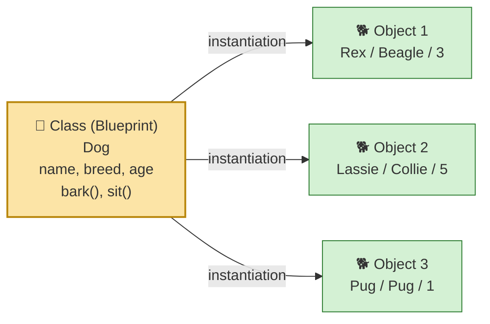
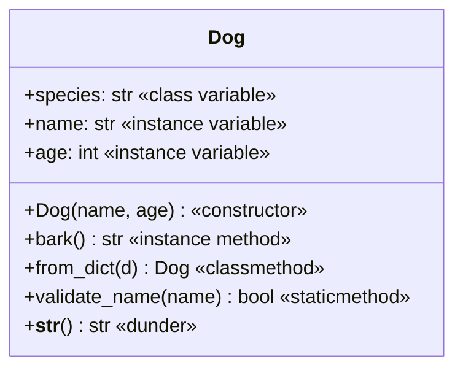
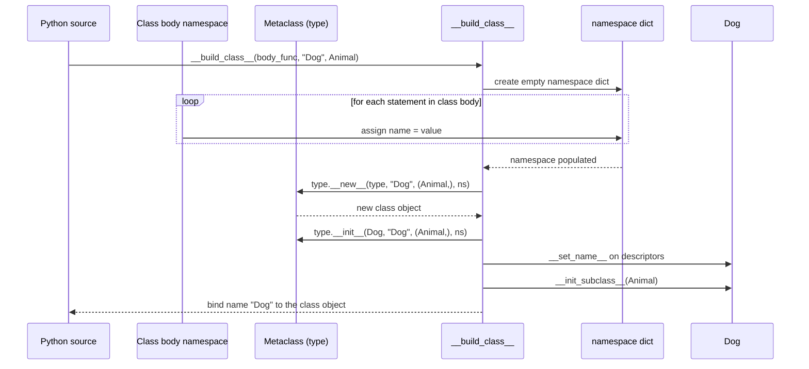
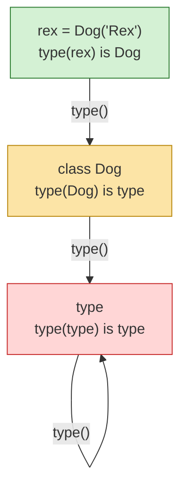
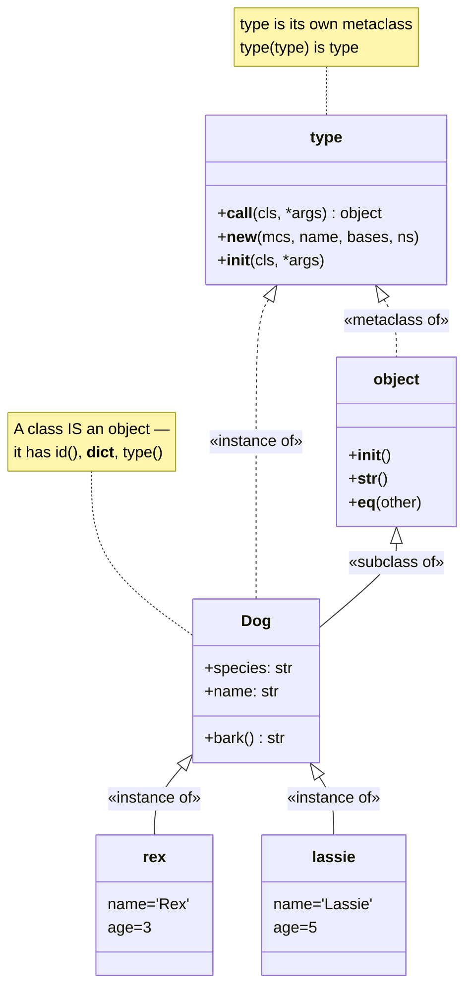
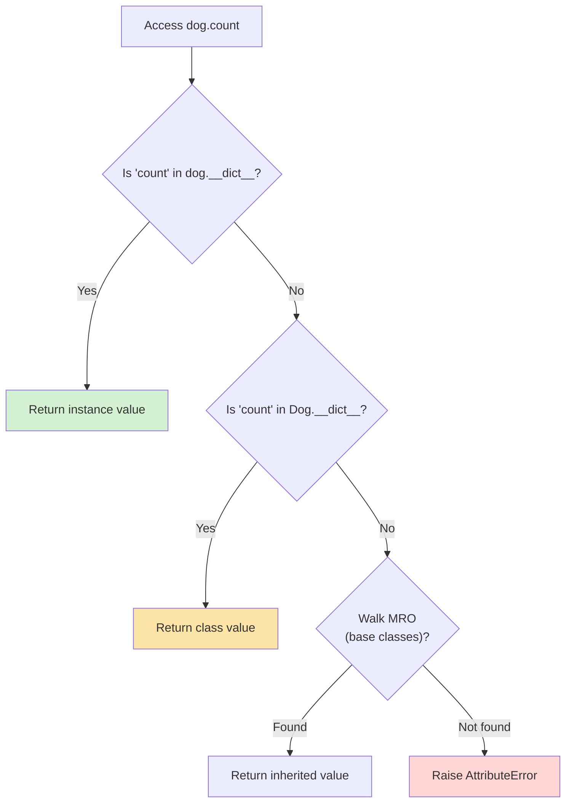
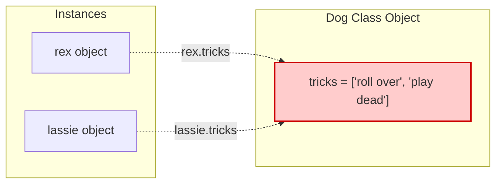
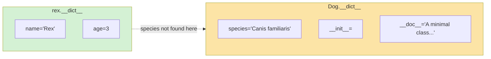
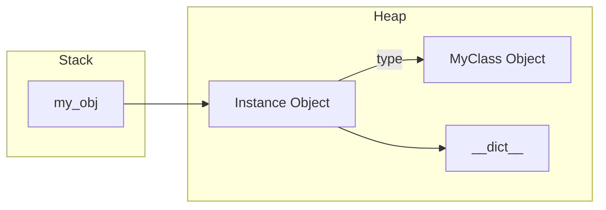

# Classes and Objects

#oop #fundamentals #classes #objects #instances #teaching

> [!quote] Grady Booch
> "An object has state, behavior, and identity. A class is a blueprint from which objects are created."

If there is one idea a student must internalize before leaving an introductory OOP module, it is the distinction — and the relationship — between a **class** and an **object**. Every other concept in this knowledge base (encapsulation, inheritance, polymorphism, design patterns) presumes you have this distinction instinctively correct. This note is the foundation of the foundation.

---

## 1. The Cookie-Cutter Metaphor (and Where It Breaks)

> [!info] The one-sentence intuition
> A **class** is a blueprint (or template, or cookie cutter); an **object** is a thing built from that blueprint (the cookie itself).

The metaphor is old, but it works because it captures three things at once:

1. **One blueprint, many cookies** — you can stamp out as many objects as you want from a single class.
2. **Each cookie is independent** — biting into one cookie does not affect the others.
3. **They share the same shape** — every object of a class has the same *structure* (same attributes, same methods), but each holds its own *values*.



> [!warning] Where the metaphor breaks
> The cookie-cutter picture implies that the cutter is *passive* — it exists only to produce cookies. In Python, **a class is itself an object**. It has an `id()`, a `type()`, attributes, and methods. You can pass a class to a function, store it in a list, and even modify it at runtime. The cutter is also a cookie.

This is the single biggest "aha!" moment students have when moving from Java/C++ thinking to Python thinking. Hold that thought; we return to it in §6.

---

## 2. What Is a Class?

> [!info] Definition
> A **class** is a programmer-defined *type* that bundles together a set of *attributes* (data) and *methods* (behavior) and serves as a template for creating new objects of that type.

A class answers two questions about a category of things:

- **What does it know?** → attributes (`name`, `balance`, `is_open`)
- **What can it do?** → methods (`deposit()`, `withdraw()`, `close()`)

### 2.1 Anatomy of a Class



A class has, in roughly this order:

1. A **docstring** — the first string literal; what `help(Dog)` prints.
2. **Class variables** — shared across all instances.
3. The **constructor** (`__init__`) — initializes each new instance.
4. **Instance methods** — functions defined inside the class that take `self`.
5. **Special/dunder methods** — `__str__`, `__repr__`, `__eq__`, etc. (see [[Magic-Methods]]).
6. **Class methods** (`@classmethod`) and **static methods** (`@staticmethod`) — see [[Methods-And-Functions]].
7. **Properties** (`@property`) — see [[Attributes-And-Properties]].

```mermaid
mindmap
  root((Class Components))
    Data
      Class variables
        Shared by all instances
        Constants, defaults, counters
      Instance variables
        Per-object state
        Set in __init__
      Private attributes
        _single_underscore convention
        __double_underscore name-mangled
    Behavior
      Instance methods
        Take self as first arg
        Operate on instance state
      Class methods
        Take cls as first arg
        Alternative constructors
      Static methods
        No self, no cls
        Namespaced utility functions
      Dunder methods
        Operator overloading
        Protocol implementation
    Access
      Properties
        Getter / setter logic
        Computed attributes
      Descriptors
        __get__, __set__, __delete__
        Reusable attribute logic
    Metadata
      Docstring
        help(Dog) prints this
      __name__, __qualname__
      __mro__ method resolution order
      __bases__ parent classes
```

> [!tip] Teaching Tip
> Write a `Dog` class on the board *before* explaining each piece. Let students predict what each line does. Then label each piece. The act of guessing first primes them to remember the labels.

---

## 3. Defining a Class in Python

### 3.1 The Simplest Possible Class

```python
class Dog:
    """A minimal class. It does nothing — but it is a real class."""
    pass
```

The `pass` keyword is a placeholder. The class exists, has a name, and can be instantiated. This is genuinely useful for **prototyping** — you sketch the type system first, fill in behavior later.

```python
rex = Dog()      # create an instance
print(type(rex)) # <class '__main__.Dog'>
print(rex)        # <__main__.Dog object at 0x7f4c8a3c5e50>
```

### 3.2 Class With a Body

```python
class Dog:
    species: str = "Canis familiaris"   # class variable

    def __init__(self, name: str, age: int) -> None:  # constructor (initializer)
        self.name: str = name            # instance variable
        self.age: int = age

    def bark(self) -> str:                 # instance method
        return f"{self.name} says Woof!"

    def __str__(self) -> str:              # dunder method
        return f"Dog(name={self.name!r}, age={self.age})"
```

### 3.3 Class With a Base Class

```python
class Animal:
    def __init__(self, name):
        self.name = name
    def breathe(self):
        return f"{self.name} breathes."

class Dog(Animal):              # Dog inherits from Animal
    def bark(self):
        return f"{self.name} says Woof!"
```

The parentheses in `class Dog(Animal):` declare inheritance. If omitted, the class implicitly inherits from `object`. See [[Inheritance]] for the full story.



> [!note] Python 2 vs Python 3
> In Python 2 you wrote `class Dog(object):` to get a "new-style" class. In Python 3 *all* classes are new-style, so `class Dog:` and `class Dog(object):` are equivalent. You will still see the explicit form in legacy code.

---

## 4. Creating Instances

```python
rex = Dog("Rex", 3)     # calls Dog.__new__ then Dog.__init__
print(rex.name)         # Rex
print(rex.bark())       # Rex says Woof!
print(rex)              # Dog(name='Rex', age=3)
```

What actually happens when you write `Dog("Rex", 3)`? Three things, in order:

```mermaid
sequenceDiagram
    participant Caller as "Dog(\"Rex\", 3)"
    participant Type as type(Dog)
    participant New as Dog.__new__(Dog, "Rex", 3)
    participant Init as Dog.__init__(self, "Rex", 3)
    participant Mem as Memory Allocator
    Caller->>Type: __call__(Dog, "Rex", 3)
    Type->>New: invoke __new__
    New->>Mem: allocate Dog-sized struct
    Mem-->>New: raw object ref (self)
    New-->>Caller: returns self
    Caller->>Init: __init__(self, "Rex", 3)
    Init->>Init: self.name = "Rex"; self.age = 3
    Init-->>Caller: returns None (self mutated)
    Caller-->>Caller: bind name 'rex' to self
```

1. `type.__call__(Dog, "Rex", 3)` is invoked (because `Dog` is callable).
2. `Dog.__new__(Dog, "Rex", 3)` allocates the new instance and returns it.
3. `Dog.__init__(self, "Rex", 3)` initializes that instance.

Most students conflate `__init__` with "the thing that creates the object." It does not — `__new__` does. See [[Constructors-And-Destructors]] for the full distinction.

> [!warning] Common Student Misconception #1
> "Calling `Dog(...)` returns whatever `__init__` returns." **False.** `__init__` is required to return `None`. The instance created by `__new__` is what comes back, regardless of `__init__`'s return value. If you try `return self.balance` from `__init__`, Python raises `TypeError: __init__() should return None`.

---

## 5. `type()` — The Identity of Types

Every value in Python has a type. You can ask any value for its type with `type()`:

```python
print(type(42))         # <class 'int'>
print(type("hi"))       # <class 'str'>
print(type(Dog))        # <class 'type'>      ← a class is an instance of `type`
print(type(Dog("Rex"))) # <class '__main__.Dog'>
```

This is the moment where Python's model diverges from Java/C++ and students reach for the aspirin. Read these two sentences very slowly:

- The **type of an instance** is its class.
- The **type of a class** is the metaclass `type`.



The cycle terminates because `type` is its own metaclass: `type(type) is type`. This is the bootstrap of Python's object model. (See [[Metaclasses]] for the implications.)



> [!danger] Brain-melter
> Everything in Python is an object. Classes are objects. The `type` metaclass is an object. The word "object" is overloaded: sometimes we mean "instance of a user class", sometimes we mean "any value with an `id()`". When in doubt, ask `isinstance(x, object)` — it returns `True` for *everything*.

---

## 6. Class Variables vs Instance Variables (CRITICAL)

This is the single most-misunderstood distinction in introductory OOP. Get it right, and a lot of subtle bugs disappear.

### 6.1 Definitions

| Aspect | Class Variable | Instance Variable |
|---|---|---|
| Declared in | class body (outside any method) | inside a method, on `self` |
| Stored on | the class object's `__dict__` | each instance's `__dict__` |
| Shared across instances? | **Yes** — one copy per class | **No** — one copy per instance |
| Accessed via | `Dog.species` or `dog.species` | `dog.name` only |
| Typical use | constants, counters, defaults | per-instance state |

### 6.2 Example: A Counter

```python
class Dog:
    species = "Canis familiaris"   # class variable
    count = 0                     # class variable

    def __init__(self, name, age):
        self.name = name          # instance variable
        self.age = age            # instance variable
        Dog.count += 1            # increment CLASS variable

    @classmethod
    def population(cls):
        return cls.count

rex = Dog("Rex", 3)
lassie = Dog("Lassie", 5)
print(Dog.population())   # 2
print(rex.count)          # 2  ← visible via instance too!
print(lassie.count)       # 2
```

Each instance can *read* the class variable via `self.count`. But what happens if an instance assigns to `count`?

```python
rex.count = 99   # creates an INSTANCE variable on rex, shadowing the class var
print(rex.count)         # 99  ← reads instance var
print(lassie.count)      # 2   ← still reads class var
print(Dog.count)         # 2   ← class var untouched
del rex.count            # removes the instance var
print(rex.count)         # 2   ← falls back to class var
```



This is the **attribute lookup chain**: instance `__dict__` first, then the class, then base classes (see [[Attributes-And-Properties]]).

### 6.3 The Mutable Default Trap

```python
class Dog:
    tricks = []                  # MUTABLE class variable — DANGER

    def add_trick(self, trick):
        self.tricks.append(trick)   # mutates the SHARED list!

rex = Dog("Rex")
rex.add_trick("roll over")
lassie = Dog("Lassie")
lassie.add_trick("play dead")

print(rex.tricks)     # ['roll over', 'play dead']  ← BUG!
print(lassie.tricks)  # ['roll over', 'play dead']
```

### 6.3.1 Memory Allocation Trace


*Execution Trace Analysis*: When `rex.add_trick()` is called, Python looks for `tricks` on the `rex` instance, doesn't find it, falls back to the `Dog` class, and appends to the shared class-level list in memory. `lassie` accesses the exact same list.

> [!danger] Common Student Misconception #2
> "The bug is that `tricks = []` is shared." Actually, the bug is **mutating** a shared object. The list itself being shared is fine — it's the *append* that breaks things. The fix is to give each dog its own list in `__init__`:

```python
class Dog:
    def __init__(self, name):
        self.name = name
        self.tricks = []   # instance variable — per-dog list
```

### 6.4 When Class Variables Are Right

- **Constants**: `PI = 3.14159`, `SPECIES = "Canis familiaris"`. Read-only is safe.
- **Counters**: `count = 0`, incremented in `__init__`. Single source of truth.
- **Defaults**: `_default_color = "black"`, looked up only if instance didn't override.
- **Configuration knobs**: `verbose = False` toggled at the class level.

---

## 7. `__dict__` — Every Object Has One

Every Python object carries a `__dict__` — a dictionary mapping attribute names to their values.

```python
class Dog:
    species = "Canis familiaris"
    def __init__(self, name, age):
        self.name = name
        self.age = age

rex = Dog("Rex", 3)
print(rex.__dict__)     # {'name': 'Rex', 'age': 3}
print(Dog.__dict__.keys())
# dict_keys(['__module__', '__doc__', 'species', '__init__', ..., '__dict__', ...])
```

Notice that `rex.__dict__` does *not* contain `species` — `species` lives on `Dog.__dict__`. The lookup chain in §6.2 explains why `rex.species` still works.



> [!tip] Teaching Tip
> Open a Python REPL on a projector, create a `Dog`, and call `dog.__dict__` and `Dog.__dict__` side by side. The visible difference between the two dictionaries *is* the difference between instance state and class state. Students remember pictures more than paragraphs.

> [!note] `__slots__` exceptions
> If a class defines `__slots__`, instances do *not* have a `__dict__` — they store attributes in fixed slots. This saves memory but forbids adding new attributes. See [[Attributes-And-Properties]] §10.

---

## 8. `id()` and Object Identity

Every object in CPython has a unique integer identifier you can read with `id()`. In CPython, this is the memory address of the object.

```python
rex = Dog("Rex", 3)
rex2 = rex
rex3 = Dog("Rex", 3)

print(id(rex))    # 140234876543424
print(id(rex2))   # 140234876543424  ← same object
print(id(rex3))   # 140234876547902  ← different object

print(rex is rex2)   # True   ← identity
print(rex is rex3)   # False
print(rex == rex3)   # False ← unless we define __eq__
```

> [!info] `is` vs `==`
> - `is` checks **identity** — same object, same `id()`.
> - `==` checks **equality** — whatever `__eq__` defines (default: identity).
>
> Use `is` for `None`, `True`, `False`, sentinels. Use `==` for values. See [[Object-Lifecycle]].

---

## 9. Naming Conventions

> [!success] PEP 8 naming rules
> - **Classes** → `PascalCase` (a.k.a. UpperCamelCase): `BankAccount`, `HttpClient`, `Dog`.
> - **Instances / variables** → `snake_case`: `account`, `http_client`, `rex`.
> - **Functions / methods** → `snake_case`: `deposit_money`, `send_request`.
> - **Constants** → `UPPER_SNAKE_CASE`: `MAX_RETRIES`, `DEFAULT_TIMEOUT`.
> - **Private** (convention) → leading underscore: `_internal_helper`.
> - **Name-mangled** → double leading underscore: `__really_private`.
> - **Dunder** → reserved for Python: `__init__`, `__repr__`. Never invent your own.

```python
class HttpClient:                 # PascalCase class
    MAX_RETRIES = 3               # constant
    def __init__(self, base_url):
        self.base_url = base_url
        self._cache = {}          # private-by-convention
    def send_request(self, path): # snake_case method
        ...

client = HttpClient("https://api.example.com")  # snake_case instance
```

> [!warning] Common Student Misconception #3
> "snake_case and camelCase are interchangeable." They are not — PEP 8 is enforced by every major linter (flake8, pylint, ruff) and a `CamelCaseVariable` in Python code will trigger style warnings. Consistency here is part of being a Python professional.

---

## 10. The Empty-Class Pattern

`class Empty: pass` looks useless but has three real uses:

### 10.1 Prototyping

When you sketch a system, you often need *placeholders* before you've designed behavior:

```python
class User: pass
class Order: pass
class Invoice: pass

# Now your type signatures and tests reference real types
def process(order: Order) -> Invoice: ...
```

### 10.2 Lightweight Record / Namespace

```python
config = type("Config", (), {})()  # create an empty instance
config.host = "localhost"
config.port = 8080
config.debug = True
print(config.__dict__)
# {'host': 'localhost', 'port': 8080, 'debug': True}
```

This is the manual version of `types.SimpleNamespace`. Useful when you want attribute access without a class definition.

### 10.3 Mock Objects in Tests

```python
class FakeDatabase: pass
fake = FakeDatabase()
fake.query_result = [{"id": 1}, {"id": 2}]
# Pass `fake` where a real DB connection is expected
```

> [!tip] Teaching Tip
> Show students `SimpleNamespace` *after* they've seen the empty-class pattern. The lesson "this is just a class with no body, plus a friendly `__repr__`" sticks better than "here's a class from `types`".

---

## 11. Building `BankAccount` Step by Step

Let's put it all together. We build a `BankAccount` class in four iterations, each adding one concept.

### 11.1 V1 — Bare Bones

```python
class BankAccount:
    """A simple bank account."""
    def __init__(self, owner: str, balance: float = 0.0) -> None:
        self.owner: str = owner
        self.balance: float = balance

    def deposit(self, amount: float) -> None:
        self.balance += amount

    def withdraw(self, amount: float) -> None:
        if amount > self.balance:
            raise ValueError("Insufficient funds")
        self.balance -= amount
```

```python
acc = BankAccount("Alice", 100)
acc.deposit(50)
acc.withdraw(30)
print(acc.balance)   # 120
```

### 11.2 V2 — Class-Level Counter

```python
class BankAccount:
    _next_account_number = 1000          # class variable

    def __init__(self, owner, balance=0.0):
        self.owner = owner
        self.balance = balance
        self.account_number = BankAccount._next_account_number
        BankAccount._next_account_number += 1   # mutate CLASS var
```

Each new account automatically gets the next number, and the counter is shared.

### 11.3 V3 — Class Methods for Alternative Construction

```python
class BankAccount:
    # ... (as before)
    @classmethod
    def from_csv(cls, line: str):
        owner, balance = line.split(",")
        return cls(owner.strip(), float(balance.strip()))

acc = BankAccount.from_csv("Bob, 250.00")
print(acc.owner, acc.balance)   # Bob 250.0
```

`from_csv` is a **factory method** — an alternative constructor. See [[Methods-And-Functions]] §3.

### 11.4 V4 — Properties and Validation

```python
class BankAccount:
    def __init__(self, owner, balance=0.0):
        self.owner = owner
        self._balance = 0.0
        self.balance = balance    # goes through the setter

    @property
    def balance(self):
        return self._balance

    @balance.setter
    def balance(self, value):
        if value < 0:
            raise ValueError("Balance cannot be negative")
        self._balance = value
```

```python
acc = BankAccount("Carol", 100)
acc.balance = -5   # ValueError: Balance cannot be negative
```

We've now reached the doorstep of [[Encapsulation]] and [[Attributes-And-Properties]] — the next notes in this section.

---

## 12. "A Class Is an Object" — Working Through the Implications

In Python, classes are first-class objects. They can be:

- **Assigned to variables**:
  ```python
  MyClass = Dog
  print(MyClass is Dog)   # True
  ```
- **Passed to functions**:
  ```python
  def make_one(cls):
      return cls()
  rex = make_one(Dog)
  ```
- **Stored in collections**:
  ```python
  registry = {"dog": Dog, "cat": Cat, "bird": Bird}
  pet = registry[user_choice](name="Pet")
  ```
- **Modified at runtime**:
  ```python
  def fetch(self):
      return f"{self.name} fetches the ball"
  Dog.fetch = fetch        # monkey-patch the class
  rex.fetch()              # works on existing instances too!
  ```
- **Created dynamically** with the 3-argument form of `type()`:
  ```python
  Dog = type("Dog", (object,), {"species": "Canis familiaris",
                                  "bark": lambda self: "Woof!"})
  rex = Dog()
  ```

> [!quote] The Zen of Python
> "In Python, everything is an object. Even classes. Even `type`."

This dynamism is Python's gift and curse: it powers metaclasses, decorators, ORMs (Django, SQLAlchemy), and dataclasses; it also lets you write code that no reader can understand. Use it judiciously. See [[Metaclasses]] and [[Descriptors]] for the deeper waters.

---

## 13. Misconceptions Recap

> [!warning] Misconception #1 — "A class creates objects."
> More precisely: **calling a class** invokes `type.__call__`, which calls `__new__` (which creates) and then `__init__` (which initializes). The class itself is a passive template — the *metaclass* `type` does the calling.

> [!warning] Misconception #2 — "Class variables are immutable."
> They are perfectly mutable. The danger only arises when you mutate a *shared mutable object* (list, dict, set) through an instance. Read-only class variables (numbers, strings) are safe.

> [!warning] Misconception #3 — "`__init__` is the constructor."
> In Python, `__new__` is the constructor (it allocates); `__init__` is the initializer (it populates). Most of the time you only write `__init__`, but the distinction matters when subclassing immutable types or implementing the Singleton pattern. See [[Constructors-And-Destructors]].

> [!warning] Misconception #4 — "Each instance carries a copy of the methods."
> Methods live on the *class*, not the instance. Each instance only carries its own data in `__dict__`. When you call `rex.bark()`, Python looks up `bark` on `Dog` and binds it to `rex`. See [[Self-And-Cls]].

> [!warning] Misconception #5 — "Classes in Python are static after definition."
> False. You can add, remove, or replace attributes and methods on a class at runtime, and existing instances will see the changes immediately. This is powerful for prototyping and dangerous for production.

---

## 14. The Class Body Is a Special Scope

A subtle point students often miss: the class body is *not* like a regular function scope. Names defined at class scope are *attributes of the class*, not local variables. This means:

- Functions defined in the body become methods (bound to instances via descriptors).
- Names assigned in the body become class attributes (visible as `ClassName.name`).
- Comprehensions and generator expressions inside the class body do *not* see class-scope variables.

```python
class Counter:
    base = 10
    # This comprehension CANNOT see `base` — it leaks to enclosing scope
    squares = [i * i for i in range(base)]   # NameError: name 'base' is not defined
```

The fix is to pass `base` explicitly or compute the list outside the class body:

```python
_SQUARES = [i * i for i in range(10)]

class Counter:
    base = 10
    squares = _SQUARES
```

> [!warning] Common Student Misconception #6
> "Class scope works like a function scope." It does not. Class scope is *skipped* when nested functions and comprehensions look up names — only the enclosing function/module scopes are searched. This is a deliberate Python design choice to keep method name resolution predictable.

### 14.1 Introspection Toolkit

Python gives you a rich set of tools for inspecting classes at runtime:

| Tool | Returns | Example |
|---|---|---|
| `type(obj)` | The class of `obj` | `type(rex) → Dog` |
| `obj.__class__` | Same as `type(obj)` | `rex.__class__ → Dog` |
| `cls.__name__` | Class name as string | `Dog.__name__ → "Dog"` |
| `cls.__mro__` | Tuple of base classes (method resolution order) | `(Dog, Animal, object)` |
| `cls.__bases__` | Direct parent classes | `(Animal,)` |
| `cls.__dict__` | Mapping of class attributes | `mappingproxy({...})` |
| `vars(obj)` | `obj.__dict__` | `{'name': 'Rex', 'age': 3}` |
| `dir(obj)` | Sorted list of all attribute names | `['__class__', '__doc__', ...]` |
| `hasattr(obj, 'x')` | Whether `obj.x` exists | `True` / `False` |
| `isinstance(obj, cls)` | Whether `obj` is a `cls` instance | `isinstance(rex, Dog) → True` |
| `issubclass(Dog, Animal)` | Whether `Dog` inherits from `Animal` | `True` |

```python
class Animal: pass
class Dog(Animal):
    def bark(self): return "Woof!"

rex = Dog()
print(rex.__class__.__name__)   # Dog
print(Dog.__mro__)              # (<class 'Dog'>, <class 'Animal'>, <class 'object'>)
print(isinstance(rex, Animal))  # True
print(issubclass(Dog, Animal))  # True
print(issubclass(Animal, Dog))  # False
print(hasattr(rex, "bark"))     # True
```

> [!tip] Teaching Tip
> Have students run `dir(Dog)` and `dir(rex)` and circle the differences. The exercise teaches them that an instance's "interface" includes everything it inherits — which is the basis of [[Polymorphism]] and [[Abstraction]].

---

## 15. Worked Example — A Tiny Type Registry

Putting it all together: a registry that maps string names to classes, then instantiates the right one at runtime. This is the foundation of plugin systems, ORMs, and JSON deserializers.

```python
class Animal:
    registry = {}

    def __init_subclass__(cls, **kwargs):
        super().__init_subclass__(**kwargs)
        Animal.registry[cls.__name__.lower()] = cls

    def speak(self):
        raise NotImplementedError

class Dog(Animal):
    def speak(self): return "Woof!"

class Cat(Animal):
    def speak(self): return "Meow!"

class Duck(Animal):
    def speak(self): return "Quack!"

# Build animals from a config file
config = ["dog", "cat", "duck", "dog"]
zoo = [Animal.registry[name]() for name in config]
for animal in zoo:
    print(animal.speak())
# Woof!
# Meow!
# Quack!
# Woof!
```

`__init_subclass__` is a hook that runs every time a subclass is defined. It's the modern, simpler alternative to a metaclass for this kind of registration pattern.

---

## 16. Practice Exercises

> [!example] Exercise 1 — Class vs Instance Variable
> Write a `Lightbulb` class with a class variable `default_wattage = 60` and an instance variable `wattage`. When you create a `Lightbulb` without arguments, `wattage` should equal `default_wattage`. Then change `Lightbulb.default_wattage = 40` and create a new bulb — what's its wattage?
> 
> <details>
> <summary><b>Reveal Solution & Execution Trace</b></summary>
> 
> ```python
> class Lightbulb:
>     default_wattage: int = 60
>     
>     def __init__(self, wattage: int | None = None) -> None:
>         self.wattage: int = wattage if wattage is not None else Lightbulb.default_wattage
> 
> b1 = Lightbulb()
> Lightbulb.default_wattage = 40
> b2 = Lightbulb()
> print(b1.wattage, b2.wattage) # Output: 60 40
> ```
> *Trace*: `b1` captures `60` at initialization. Changing `Lightbulb.default_wattage` to `40` doesn't retroactively alter `b1.wattage` since it's now an instance variable.
> </details>

> [!example] Exercise 2 — Counter Pattern
> Build a `Ticket` class that auto-increments an `id` field for every new ticket, starting at 1. Add a class method `total_issued()` that returns the count.
>
> <details>
> <summary><b>Reveal Solution</b></summary>
> 
> ```python
> class Ticket:
>     _count: int = 0
>     
>     def __init__(self) -> None:
>         Ticket._count += 1
>         self.id: int = Ticket._count
>         
>     @classmethod
>     def total_issued(cls) -> int:
>         return cls._count
> ```
> </details>

> [!example] Exercise 3 — Diagnose the Bug
> The following class has a bug. Find it without running the code, then explain *why* it happens, then fix it.
> ```python
> class Notebook:
>     pages = []
>     def __init__(self, owner: str) -> None:
>         self.owner = owner
>     def add_page(self, text: str) -> None:
>         self.pages.append(text)
> ```
>
> <details>
> <summary><b>Reveal Solution</b></summary>
> 
> **Bug**: `pages` is a mutable class variable. All `Notebook` instances share the same list!
> **Fix**: Move `pages` to `__init__`.
> ```python
> class Notebook:
>     def __init__(self, owner: str) -> None:
>         self.owner: str = owner
>         self.pages: list[str] = []
>     def add_page(self, text: str) -> None:
>         self.pages.append(text)
> ```
> </details>

> [!example] Exercise 4 — Dynamic Class
> Use `type()` to dynamically create a `Point` class with `x` and `y` attributes set in `__init__`, and a `__repr__` that returns `"Point(x=..., y=...)"`.
>
> <details>
> <summary><b>Reveal Solution</b></summary>
> 
> ```python
> def init(self, x: int, y: int) -> None:
>     self.x = x
>     self.y = y
> 
> def repr_method(self) -> str:
>     return f"Point(x={self.x}, y={self.y})"
> 
> Point = type("Point", (object,), {
>     "__init__": init,
>     "__repr__": repr_method
> })
> 
> p = Point(10, 20)
> print(p) # Point(x=10, y=20)
> ```
> </details>

---

## 17. Summary

- A **class** is a programmer-defined type; an **object** is an instance of that type.
- Python classes are themselves objects (instances of `type`).
- A class bundles **class variables** (shared), **instance variables** (per-object), and **methods**.
- Creating an instance calls `type.__call__`, which invokes `__new__` then `__init__`.
- Every object has an `__dict__` (unless `__slots__` is used) and an `id()`.
- The **attribute lookup chain** walks instance → class → base classes.
- Use **PascalCase** for classes, **snake_case** for instances.
- An empty `class X: pass` is useful for prototyping, namespaces, and mocks.
- The class body is a *special scope* — nested functions and comprehensions cannot see class-level names directly.

### 17.1 Cross-Language Quick Comparison

| Feature | Python | Java | C++ | JavaScript (ES6) |
|---|---|---|---|---|
| Class keyword | `class X:` | `class X { }` | `class X { };` | `class X { }` |
| Classes are objects? | Yes (instances of `type`) | No (loaded by JVM) | No (compile-time entities) | Yes (functions under the hood) |
| Instance variable declaration | Implicit in `__init__` | Declared in class body | Declared in class body | Implicit in `constructor` |
| Multiple inheritance | Yes (with MRO) | No (interfaces only) | Yes | No (mixins via `class X extends Y`) |
| `self` / `this` | `self` (explicit) | `this` (implicit) | `this` (implicit) | `this` (implicit, sometimes quirky) |
| Can modify class at runtime? | Yes | No | No | Yes |

> [!info] Why this table matters
> Students coming from Java or C++ often assume Python's `class` works the same way. It does syntactically — but Python's classes are *runtime values*, which changes everything downstream. This single difference explains why metaclasses, decorators, and dataclasses exist in Python but have no direct equivalent in Java/C++.

> [!success] Next stops
> - [[Attributes-And-Properties]] — go deeper on the lookup chain, `@property`, and private attributes.
> - [[Methods-And-Functions]] — instance, class, and static methods.
> - [[Constructors-And-Destructors]] — `__new__` vs `__init__`, singletons, and cleanup.
> - [[Self-And-Cls]] — why Python makes `self` explicit.
> - [[Encapsulation]] — why we hide state in the first place.


## Deep Dive: Python OOP Basics

### Memory Allocation Diagram (`self` and `__init__`)


### Code Execution Trace
1. `obj = MyClass(10)`
2. Python calls `MyClass.__new__` to allocate memory for the object.
3. Python calls `MyClass.__init__(self, 10)` passing the newly allocated object as `self`.
4. `self.value = 10` is executed, storing it in the instance's `__dict__`.
5. The memory reference is returned and bound to `obj`.

### Interactive Practice Exercise
**Exercise:** Create a `Student` class. Implement `__init__` and a custom `__del__` method. Instantiate it, explicitly `del` it, and observe the lifecycle hook being triggered.
