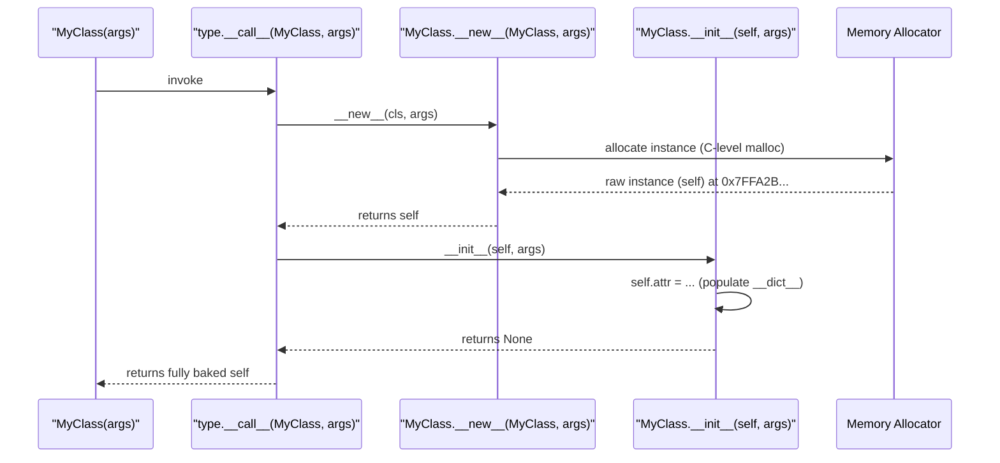
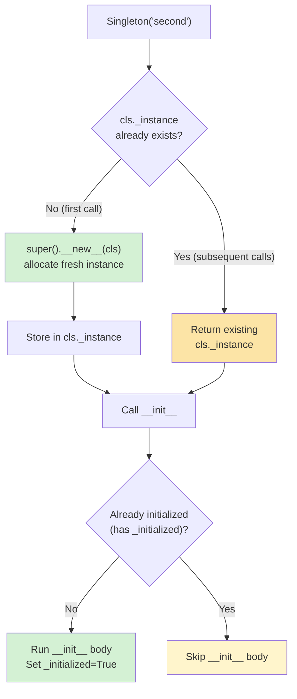
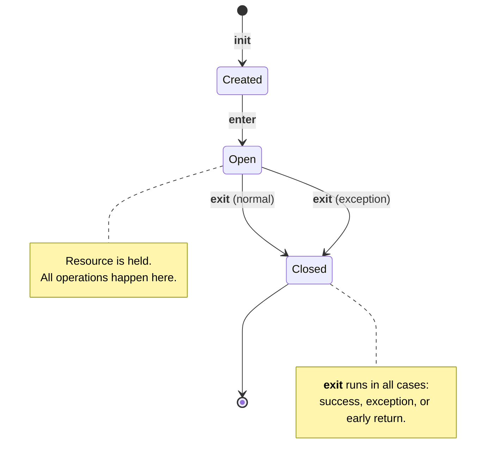

# Constructors and Destructors

#oop #fundamentals #constructors #destructors #teaching

> [!quote] The Zen of Python, applied
> "If the implementation is hard to explain, it's a bad idea." — Python's two-step construction (`__new__` then `__init__`) is awkward to explain, but it's *the* mechanism that makes immutable types, singletons, and metaclass-controlled construction possible.

When you write `Dog("Rex")`, three things happen — and most students think only one does. This note unpacks the full machinery of object construction in Python, the rarely-overridden `__new__`, the often-misunderstood `__init__`, the unreliable `__del__`, and the modern alternatives (context managers, `weakref.finalize`) that you should usually prefer. We will also incorporate modern Python 3.11+ type hinting (like `typing.Self`) and memory execution traces.

Prerequisites: [[Classes-And-Objects]], [[Self-And-Cls]], [[Object-Lifecycle]].

---

## 1. The Two-Step Construction Model

When you call `MyClass(args)`, Python executes:



| Step | Method | What it does | Returns |
|---|---|---|---|
| 1 | `type.__call__` | Orchestrates the call (C level) | The new instance |
| 2 | `__new__` | Allocates a new instance in memory | The new instance (or subclass instance) |
| 3 | `__init__` | Initializes instance attributes (mutates) | `None` (must!) |

### 1.1 The Crucial Distinction

> [!danger] The #1 misconception in all of Python OOP
> **`__init__` does not create the object. `__new__` creates the object; `__init__` initializes it.**

#### Code Execution Trace

```python
class Example:
    def __new__(cls, *args, **kwargs):
        print(f"[Trace 1] __new__: Allocating memory for {cls.__name__}")
        instance = super().__new__(cls)   # actually allocate
        print(f"[Trace 2] __new__: Allocated at {hex(id(instance))}")
        return instance

    def __init__(self, x):
        print(f"[Trace 3] __init__: Setting x={x} on {hex(id(self))}")
        self.x = x

e = Example(42)
# Output:
# [Trace 1] __new__: Allocating memory for Example
# [Trace 2] __new__: Allocated at 0x10a2f4c10
# [Trace 3] __init__: Setting x=42 on 0x10a2f4c10
```

If `__new__` returns an instance of `cls` (or a subclass), Python calls `__init__` on it. If `__new__` returns *anything else* (or nothing), `__init__` is **skipped** — a quiet gotcha.

### 1.2 Why Two Steps?

The two-step design supports four cases that one-step construction cannot:

1. **Immutable types** (`int`, `str`, `tuple`) — they must be fully constructed *before* `__init__`, because their state cannot be mutated afterward. So `__new__` builds them, and `__init__` is a no-op.
2. **Singletons and caches** — `__new__` can return an existing instance instead of allocating a new one.
3. **Metaclass-controlled construction** — metaclasses can intercept `__call__` to customize creation of the class itself.
4. **Subclassing built-ins** — to make `class MyInt(int)`, you must override `__new__` because `int.__init__` ignores its arguments.

> [!tip] Teaching Tip
> Write a class with print statements in both `__new__` and `__init__`. Have students call it once, then twice — the print order will *always* be `__new__` then `__init__`. The order is fixed by `type.__call__`, not by you.

---

## 2. `__new__` in Depth

### 2.1 Signature

```python
from typing import Any

def __new__(cls, *args: Any, **kwargs: Any) -> Any:
    instance = super().__new__(cls)   # delegate to parent's __new__
    # ... custom creation logic ...
    return instance
```

`__new__` is a **static method** (logically, though not decorated — Python treats it specially). It receives the class as its first argument (`cls`), not an instance.

### 2.2 Worked Example — Immutable `Point` (Modern Syntax)

```python
from typing import Self

class Point:
    """An immutable 2D point."""

    def __new__(cls, x: float, y: float) -> Self:
        # Pre-validate before construction (impossible in __init__)
        if not (isinstance(x, (int, float)) and isinstance(y, (int, float))):
            raise TypeError("Coordinates must be numbers")
        instance = super().__new__(cls)
        # We can set attributes here via object.__setattr__ to bypass __setattr__
        object.__setattr__(instance, '_x', float(x))
        object.__setattr__(instance, '_y', float(y))
        return instance

    def __init__(self, x: float, y: float) -> None:
        # __init__ runs AFTER __new__, but state is already set.
        # For an immutable type, __init__ is essentially a no-op.
        pass

    @property
    def x(self) -> float: return self._x
    @property
    def y(self) -> float: return self._y

    def __setattr__(self, name: str, value: Any) -> None:
        raise AttributeError(f"{self.__class__.__name__} is immutable")

    def __repr__(self) -> str:
        return f"Point({self._x}, {self._y})"

p = Point(3, 4)
print(p)           # Point(3.0, 4.0)
# p.x = 5          # AttributeError: Point is immutable
```

> [!info] Modern alternative — `@dataclass(frozen=True)`
> Python 3.7+ gives you a much cleaner way to get immutability:
> ```python
> from dataclasses import dataclass
> @dataclass(frozen=True)
> class Point:
>     x: float
>     y: float
> ```
> See [[Dataclasses]]. Override `__new__` only when you need custom validation that can't fit in `__post_init__`.

### 2.3 Worked Example — Singleton Memory Trace

A **singleton** is a class of which only one instance ever exists. 

```python
class Singleton:
    _instance = None

    def __new__(cls, *args, **kwargs):
        if cls._instance is None:
            print("[Memory] Allocating Singleton instance...")
            cls._instance = super().__new__(cls)
        else:
            print("[Memory] Returning cached Singleton instance...")
        return cls._instance

    def __init__(self, value=None):
        # WARNING: __init__ runs every time, even on the cached instance!
        if not hasattr(self, '_initialized'):
            print(f"[{id(self)}] Initializing state with {value}")
            self.value = value
            self._initialized = True
        else:
            print(f"[{id(self)}] Already initialized! Skipping setup.")

a = Singleton("first")
# [Memory] Allocating Singleton instance...
# [4345513232] Initializing state with first

b = Singleton("second")
# [Memory] Returning cached Singleton instance...
# [4345513232] Already initialized! Skipping setup.
```



> [!warning] The Singleton `__init__` Trap
> Because `type.__call__` always calls `__init__` after `__new__`, every `Singleton(...)` call reruns `__init__` on the *same* instance. The `_initialized` flag pattern above is the standard workaround.

---

## 3. `__init__` in Depth

### 3.1 The Honest Constructor

For 95% of classes, `__init__` is the only constructor you write. It's where you:

- Set instance attributes.
- Validate arguments.
- Open resources (files, sockets, DB connections).
- Call `super().__init__(...)` if you have a parent.

### 3.2 Constructor Overloading Patterns (Python 3.11+)

Python doesn't have native method overloading. We use `classmethod` as alternative constructors, combined with modern `typing.Self`:

```python
from typing import Self

class Rectangle:
    def __init__(self, width: float, height: float) -> None:
        self.width = width
        self.height = height

    @classmethod
    def square(cls, side: float) -> Self:
        """Alternative constructor for a square."""
        # cls(...) automatically passes arguments to __new__ and __init__
        return cls(side, side)

    @classmethod
    def from_string(cls, s: str) -> Self:
        w, h = map(float, s.split("x"))
        return cls(w, h)

r1 = Rectangle(3, 4)
r2 = Rectangle.square(5)       # Return type is properly inferred as Rectangle
r3 = Rectangle.from_string("6x8")
```

> [!tip] Prefer classmethods over defaults
> When you have multiple *conceptually distinct* ways to construct (a square vs a rectangle, from a string vs from numbers), classmethods are clearer than overloaded defaults. They give each construction path a name.

### 3.3 Constructor Injection (Dependency Injection)

A constructor's job is also to receive the object's **collaborators** — the other objects it works with. This pattern is called **dependency injection** and is the foundation of testable OOP. If you hardcode `StripeGateway()` in your `__init__`, you can't test without hitting Stripe!

---

## 4. `__del__` — The Destructor (and Why It's Unreliable)

### 4.1 What `__del__` Is

`__del__` is called when an object is about to be garbage-collected — i.e., when its reference count drops to zero (in CPython) or when the cyclic GC detects it's unreachable (in cycles).

### 4.2 When `__del__` Does NOT Run

`__del__` is unreliable for the following reasons:

1. **Reference cycles**: if `a.b = b` and `b.a = a`, neither's refcount reaches zero — only the cyclic GC can collect them, and that runs *eventually*.
2. **Interpreter shutdown**: at exit, Python tears down modules; objects still alive may have their `__del__` called when their class's module is gone, causing `NameError` or `AttributeError`.
3. **Exceptions in `__del__`**: any exception inside `__del__` is printed to stderr but otherwise ignored.
4. **C extensions holding refs**: a C extension can hold a reference indefinitely.
5. **`__del__` raises the object back to life**: if `__del__` stores `self` somewhere, refcount goes back above zero and the object survives — a "resurrection" bug.

### 4.3 The Right Tool: Context Managers

For deterministic cleanup, use `with` and implement `__enter__` / `__exit__`:

```python
class FileWrapper:
    def __init__(self, path: str):
        self.path = path
        self.f = open(path, "w")

    def __enter__(self) -> Self:
        return self

    def __exit__(self, exc_type, exc_val, exc_tb) -> bool:
        self.f.close()
        # Return False (or None) to propagate exceptions
        return False

    def write(self, data: str) -> None:
        self.f.write(data)

# Deterministic cleanup — happens at the end of the `with` block!
with FileWrapper("/tmp/test.txt") as fw:
    fw.write("hello")
# File closed here, guaranteed, even if write() raised.
```



### 4.4 Modern Alternative — `weakref.finalize`

If you don't want to (or can't) override `__del__`, use `weakref.finalize` to register a callback that runs when an object is collected. It is highly robust against interpreter shutdown.

```python
import weakref

class Resource:
    def __init__(self, name: str):
        self.name = name
        # Register a callback to run when self is collected
        weakref.finalize(self, self._cleanup, name)

    @staticmethod
    def _cleanup(name: str):
        print(f"Cleaning up {name}")

r = Resource("X")
del r   # Cleaning up X  (eventually)
```

---

## 5. Destructors Across Languages — Comparison

| Language | Destructor mechanism | Deterministic? | Reliable? |
|---|---|---|---|
| **C++** | `~ClassName()` | Yes (RAII, scope exit) | Yes |
| **Rust** | `Drop::drop()` | Yes (RAII) | Yes |
| **Python** | `__del__` | No (GC) | No |
| **Java** | `finalize()` (deprecated in Java 9) | No (GC) | No |
| **C#** | `~ClassName()` (finalizer) + `IDisposable` | Finalizer: no. `Dispose()`: yes | Finalizer: no. `Dispose()`: yes |
| **Go** | `defer` (not a destructor) | Yes (function scope) | Yes |

> [!info] Why Python isn't like C++
> C++ uses **RAII** (Resource Acquisition Is Initialization). Python uses garbage collection, which trades determinism for flexibility — but means *you* must manage resource lifetimes explicitly (via `with`).

---

## 6. Interactive Practice Exercises

> [!example] Exercise 1 — Trace the Calls
> Write a class `Tracer` with `__new__` and `__init__` that each print a message and a timestamp. Then create two instances.
> **Challenge:** Modify `__new__` to return a raw `object()` instead of `super().__new__(cls)`. Does `__init__` still run? Why or why not?

> [!example] Exercise 2 — Singleton with Counter
> Implement a `Logger` singleton using `__new__`. Add a `log_count` integer variable that increments on each `log()` call. 
> **Challenge:** Ensure `log_count` is initialized to 0 *only once*, despite `__init__` running on every `Logger()` call. Verify that two `Logger()` instances share the exact same `log_count`.

> [!example] Exercise 3 — The File Resource Trap
> Write a `TempFile` class that creates a file in `/tmp/` in `__init__`.
> 1. Try cleaning it up using `__del__`. Can you deliberately cause a scenario where the file is left behind on disk when the script ends? (Hint: try circular references).
> 2. Rewrite it using `__enter__` and `__exit__`. Confirm it is always deleted.

> [!example] Exercise 4 — `typing.Self` Classmethod
> Build a `Color` class that stores `(r, g, b)`. Use `typing.Self` and `@classmethod` to create alternative constructors: `Color.red()`, `Color.green()`, and `Color.from_hex("#FF0000")`.

---

## 7. Summary

- Calling `MyClass(args)` invokes `type.__call__`, which calls `__new__` (creates) then `__init__` (initializes).
- **`__new__`** is overridden for immutable types, singletons, interning, and refusing/redirecting construction. It must return an instance of `cls` (or subclass) for `__init__` to run.
- **`__init__`** is the everyday constructor. It must return `None`. Always call `super().__init__(...)` for cooperative inheritance.
- **Constructor injection** (passing collaborators through `__init__`) is the foundation of testable, decoupled code.
- **`__del__`** is unreliable — it may run late, never, or fail silently. Use it only as a safety net.
- **Context managers** (`__enter__` / `__exit__`) are the right tool for deterministic resource cleanup.
- **`weakref.finalize`** is a modern alternative to `__del__` for library code.
- Python is *not* RAII — object lifetime and resource lifetime are separate concerns; the `with` statement bridges them.

> [!success] Next stops
> - [[Object-Lifecycle]] — the full birth-to-death story, including GC and references.
> - [[Magic-Methods]] — `__enter__`, `__exit__`, and the rest of the dunder zoo.
> - [[Self-And-Cls]] — what `self` actually is during `__init__`.
> - [[Singleton-Pattern]] — the design pattern (and its caveats).
