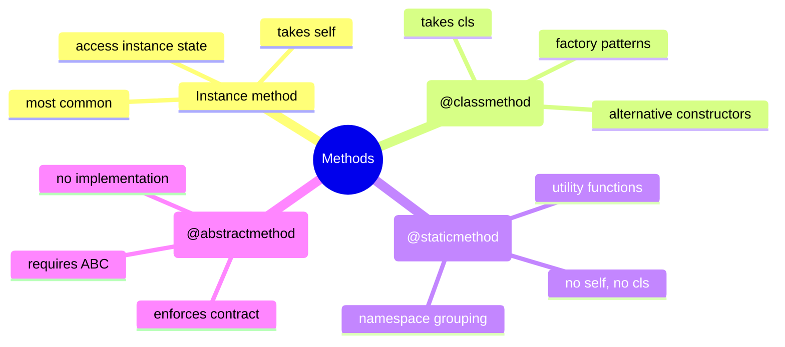
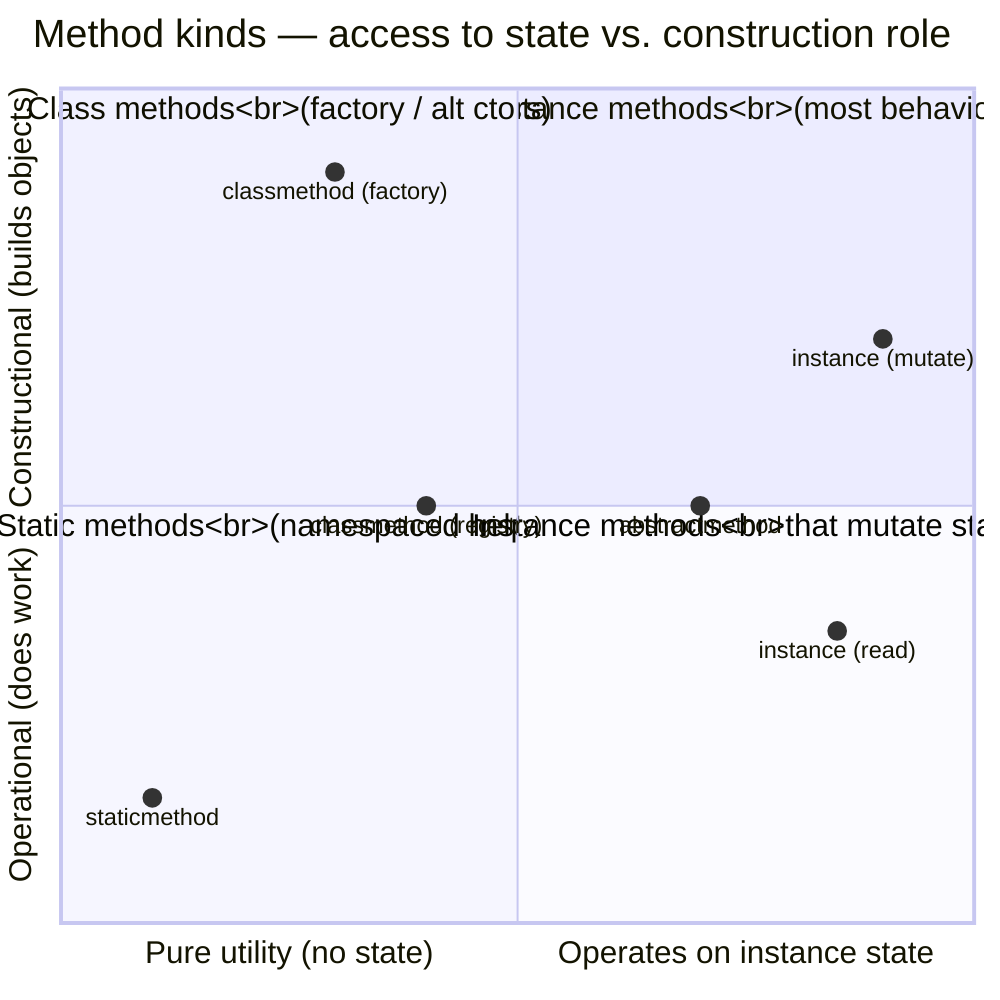
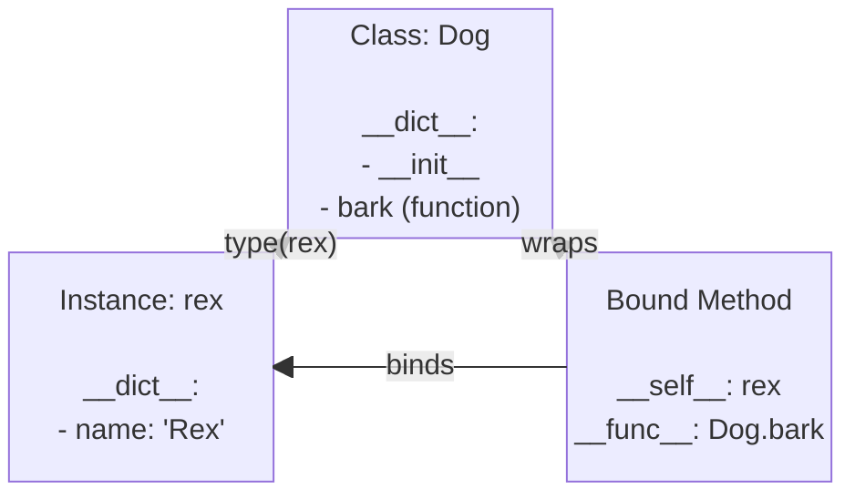
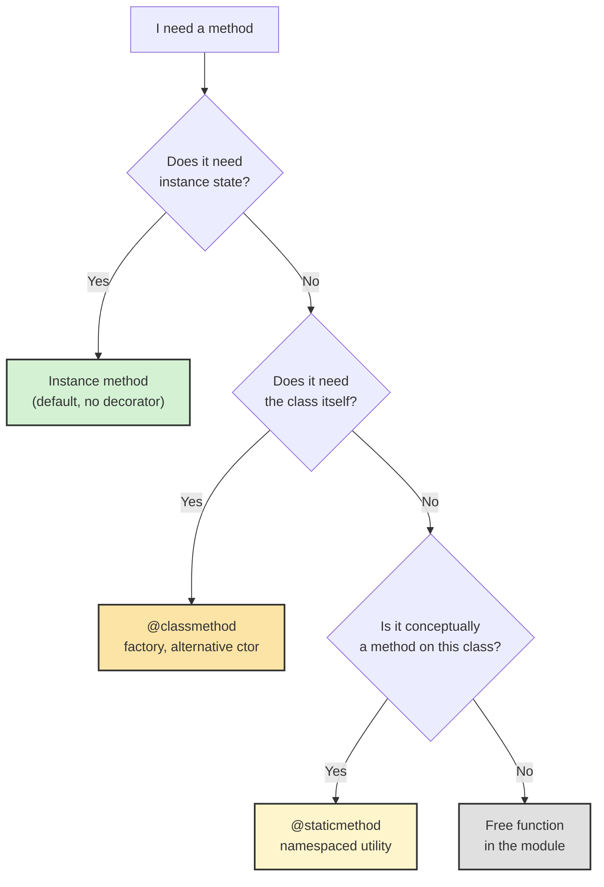
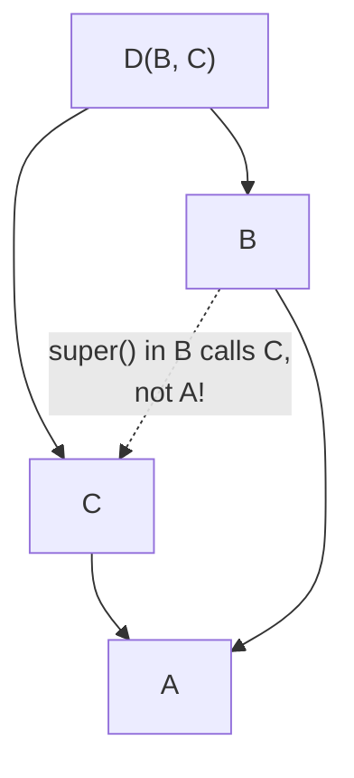
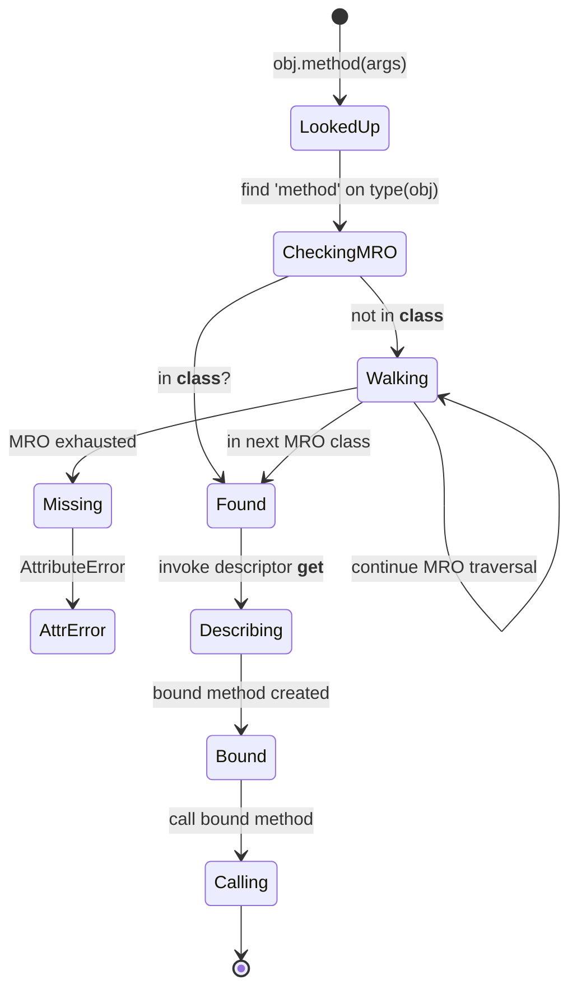

# Methods and Functions

#oop #fundamentals #methods #classmethod #staticmethod #teaching #python3.12

> [!quote] Alan Kay
> "The big idea is messaging." — but in Python, the messaging takes the form of **method calls**, and there are several flavors of method, each with a distinct purpose.

A method is a function defined inside a class. That's the simple definition. The interesting part is that Python has *four kinds* of method — instance, class, static, and abstract — plus two related concepts (overloading and overriding) that students routinely confuse. This note unpacks each, shows you when to reach for which, explains the underlying descriptor magic that makes it all work, and incorporates **modern Python 3.12+ syntax**.

Prerequisites: [[Classes-And-Objects]] and [[Self-And-Cls]].

---

## 1. The Four Kinds of Method



| Method kind | First arg | Decorator | Sees instance? | Sees class? | Typical use |
|---|---|---|---|---|---|
| Instance | `self` | (none) | ✅ | ✅ (via `self.__class__`) | Most behavior |
| Class | `cls` | `@classmethod` | ❌ | ✅ | Factory methods, alternative constructors |
| Static | (none) | `@staticmethod` | ❌ | ❌ | Namespaced utilities |
| Abstract | `self` (declared) | `@abstractmethod` | ✅ (when implemented) | ✅ | Defining a contract |



---

## 2. Instance Methods

### 2.1 Definition and Use

An instance method is the default — just a function defined in the class body whose first parameter is conventionally `self`. 

```python
class Dog:
    def __init__(self, name: str) -> None:
        self.name = name

    def bark(self) -> str:                 # instance method
        return f"{self.name} says Woof!"

rex = Dog("Rex")
print(rex.bark())     # Rex says Woof!    ← calling
print(Dog.bark(rex))  # Rex says Woof!    ← equivalent unbound call
```

### 2.2 Memory Allocation & Execution Trace

When you call an instance method, what exactly happens in memory?



**Code Execution Trace (`rex.bark()`):**
1. Python evaluates `rex.bark`.
2. It checks `rex.__dict__` for `'bark'`. Not found.
3. It checks `type(rex).__dict__` (which is `Dog.__dict__`) for `'bark'`. Found!
4. The object found is a function, which acts as a descriptor. Python calls its `__get__` method: `Dog.bark.__get__(rex, Dog)`.
5. This returns a **bound method** wrapper object linking the function to the `rex` instance.
6. The `()` operator invokes this bound method.
7. The bound method executes the original function, automatically injecting `rex` as the first argument (`self`).

### 2.3 Bound vs Unbound

```python
m = rex.bark
print(type(m))      # <class 'method'>
print(m.__self__)   # <__main__.Dog object at 0x...>  ← the bound instance
print(m.__func__)   # <function Dog.bark at 0x...>     ← the raw function
m()                  # Rex says Woof!  ← no argument needed
```

> [!info] Python 2 vs Python 3
> In Python 2, `Dog.bark` returned an "unbound method". In Python 3, `Dog.bark` is just the raw function. `Dog.bark(rex)` is equivalent to `rex.bark()`.

### 2.4 Calling Other Methods

Inside an instance method, call other methods via `self`:

```python
class Calculator:
    def __init__(self, value: float) -> None:
        self.value = value
        
    def double(self) -> float:
        return self.value * 2
        
    def quadruple(self) -> float:
        return self.double() * 2     # ← calls self.double
```

---

## 3. Class Methods (`@classmethod`)

### 3.1 What They Are

A class method receives **the class itself** as its first argument (`cls`), not an instance. Use it when:
- You need an **alternative constructor** (factory method).
- You want behavior that operates on the class state.

```python
import datetime
from typing import Self

class Date:
    def __init__(self, year: int, month: int, day: int) -> None:
        self.year, self.month, self.day = year, month, day

    @classmethod
    def from_iso(cls, iso_string: str) -> Self:  # Python 3.11+ Self
        y, m, d = iso_string.split("-")
        return cls(int(y), int(m), int(d))   # ← cls, not Date

    @classmethod
    def today(cls) -> Self:
        t = datetime.date.today()
        return cls(t.year, t.month, t.day)
```

### 3.2 Why `cls` and Not `Date`?

Using `cls(...)` preserves polymorphism. If subclasses inherit the classmethod, they get *their own type* back:

```python
class HolidayDate(Date):
    def __init__(self, year: int, month: int, day: int, name: str = "Unknown") -> None:
        super().__init__(year, month, day)
        self.name = name

h = HolidayDate.today() 
print(type(h)) # <class '__main__.HolidayDate'>
```

### 3.3 Factory Method Pattern (Modern Python 3.12+)

Class methods are the canonical Python implementation of the **Factory Method** pattern. We can use modern `match/case` structural pattern matching to build clean factories:

```python
class Payment:
    @classmethod
    def from_type(cls, kind: str, amount: float) -> "Payment":
        match kind.lower():
            case "credit":
                return CreditCardPayment(amount)
            case "paypal":
                return PayPalPayment(amount)
            case "crypto":
                return CryptoPayment(amount)
            case _:
                raise ValueError(f"Unknown payment type: {kind}")

class CreditCardPayment(Payment): ...
class PayPalPayment(Payment): ...
class CryptoPayment(Payment): ...

p = Payment.from_type("paypal", 99.00)
```

---

## 4. Static Methods (`@staticmethod`)

### 4.1 What They Are

A static method takes neither `self` nor `cls`. It's a plain function that happens to live inside a class space.

```python
class MathUtils:
    @staticmethod
    def is_even(n: int) -> bool:
        return n % 2 == 0

print(MathUtils.is_even(4))   # True
```

### 4.2 When to Use Static Methods

| Use static when... | Use class method when... |
|---|---|
| The function is a utility for the class's domain. | The function constructs or returns instances. |
| You don't need instance or class state. | You need to know the class (for `cls(...)` or class attributes). |
| You want to namespace a function under the class. | Subclassing should change which class is used. |

> [!warning] Common Student Misconception #1
> "Static methods are useless — you could just use a module-level function." 
> The primary argument for `@staticmethod` is *namespacing*. Putting it inside the class keeps related utility logic strictly coupled conceptually, avoiding polluting the module namespace.

---

## 5. Decision Tree: Which Method Kind?



---

## 6. Method Overloading (Python Doesn't Have It — But You Can Fake It)

In languages like Java, you can define multiple methods with the same name but different signatures. **In Python, the last definition wins.**

### 6.1 Workaround 1 — Modern Pattern Matching

In Python 3.10+, structural pattern matching is a robust way to handle dynamic inputs:

```python
class Printer:
    def print(self, *args):
        match args:
            case (int(x), int(y)):
                print(f"ints: {x},{y}")
            case (int(x),):
                print(f"int: {x}")
            case (str(s),):
                print(f"String: {s}")
            case _:
                print("Unknown arguments")
```

### 6.2 Workaround 2 — `functools.singledispatchmethod`

Let Python handle the type checking for the *first* argument:

```python
from functools import singledispatchmethod

class Processor:
    @singledispatchmethod
    def process(self, x):
        raise TypeError(f"Cannot process {type(x)}")

    @process.register
    def _(self, x: int):
        return x * 2

    @process.register
    def _(self, x: str):
        return x.upper()

p = Processor()
print(p.process(5))      # 10
print(p.process("hi"))   # HI
```
*(Notice how Python 3 infers the registration type from the type hint!)*

### 6.3 Workaround 3 — `@overload` Type Hints (Static Only)

```python
from typing import overload

class Processor:
    @overload
    def process(self, x: int) -> int: ...
    
    @overload
    def process(self, x: str) -> str: ...
    
    def process(self, x: int | str) -> int | str:
        if isinstance(x, int): return x * 2
        if isinstance(x, str): return x.upper()
        raise TypeError
```

> [!warning] Common Student Misconception #2
> `@overload` does *not* create multiple implementations at runtime. It is strictly a static type checker hint for `mypy`/`pyright`. You still have to write one master method to handle all cases dynamically.

---

## 7. Method Overriding & `@override`

### 7.1 The Basic Idea

```python
from typing import override  # Python 3.12+

class Animal:
    def speak(self) -> str:
        return "..."

class Dog(Animal):
    @override
    def speak(self) -> str:
        return "Woof!"
```
Using the `@override` decorator (introduced in Python 3.12) tells type checkers to ensure you are actually overriding a parent method, preventing typos (e.g. `spak()` instead of `speak()`).

### 7.2 Calling the Parent: `super()`

`super()` delegates to the parent class dynamically.

```python
class Dog(Animal):
    def __init__(self, name: str, breed: str):
        super().__init__(name)     # ← call parent __init__
        self.breed = breed
```

### 7.3 `super()` Is Not "The Parent"

`super()` actually returns the **next class in the MRO** (Method Resolution Order). In multiple inheritance, this might be a sibling!



If `B` used `A.hi(self)` instead of `super().hi()`, `C` would be skipped entirely. `super()` guarantees **cooperative multiple inheritance**. See [[Inheritance]].

---

## 8. Abstract Methods (`@abstractmethod`)

An abstract method forces subclasses to implement it.

```python
from abc import ABC, abstractmethod
from typing import override

class Shape(ABC):
    @abstractmethod
    def area(self) -> float:
        ...

class Square(Shape):
    def __init__(self, side: float):
        self.side = side
        
    @override
    def area(self) -> float:
        return self.side ** 2
```

> [!tip] 
> You cannot instantiate an ABC if it has unfulfilled abstract methods. `Shape()` will throw a `TypeError`.

---

## 9. Method Resolution — How Python Finds Methods



---

## 10. Interactive Practice Exercises

> [!example] Exercise 1 — Vector Class
> Implement a `Vector` class with `__init__(x, y, z)`, instance methods `magnitude()` and `dot(other)`, a classmethod `from_tuple(t)`, a staticmethod `zero()`.
> <details>
> <summary><b>View Solution</b></summary>
> 
> ```python
> import math
> from typing import Self
> 
> class Vector:
>     def __init__(self, x: float, y: float, z: float):
>         self.x, self.y, self.z = x, y, z
>         
>     def magnitude(self) -> float:
>         return math.sqrt(self.x**2 + self.y**2 + self.z**2)
>         
>     def dot(self, other: Self) -> float:
>         return self.x * other.x + self.y * other.y + self.z * other.z
>         
>     @classmethod
>     def from_tuple(cls, t: tuple[float, float, float]) -> Self:
>         return cls(*t)
>         
>     @staticmethod
>     def zero() -> "Vector":
>         return Vector(0, 0, 0)
> ```
> </details>

> [!example] Exercise 2 — Diagnose the Bug
> The following code raises `TypeError: Can't instantiate abstract class Sub`. Why? Fix it.
> ```python
> from abc import ABC, abstractmethod
> class Base(ABC):
>     @abstractmethod
>     def go(self): ...
> class Sub(Base):
>     def run(self):
>         return super().go()
> Sub().run()
> ```
> <details>
> <summary><b>View Solution</b></summary>
> 
> The `Sub` class failed to override the exact method name `go`. It defined `run` instead. Because `go` is still abstract, `Sub` cannot be instantiated.
> Fix: Rename `run` to `go` inside `Sub`.
> </details>

---

## 11. Summary

- **Instance methods** (default) take `self` and operate on instance state — 90% of methods.
- **Class methods** (`@classmethod`) take `cls` and are best for alternative constructors and factory patterns.
- **Static methods** (`@staticmethod`) take neither — namespaced utilities.
- **Abstract methods** (`@abstractmethod` on an `ABC`) declare a contract that subclasses must fulfill.
- **Overloading** (multiple methods, same name) is *not native* — use `singledispatch`, pattern matching, or default args.
- **Overriding** (subclass replaces parent method) is native. Use `@override` (Python 3.12+) to enforce it safely.
- `super()` calls the *next class in the MRO*, not strictly the parent — critical for cooperative multiple inheritance.
- **Dunder methods** (`__init__`, `__str__`, etc.) are how Python wires your class into syntax operators.

> [!success] Next stops
> - [[Self-And-Cls]] — what `self` and `cls` really are.
> - [[Constructors-And-Destructors]] — `__new__`, `__init__`, `__del__`.
> - [[Polymorphism]] — overriding taken to its logical conclusion.
> - [[Inheritance]] — the MRO and `super()` in depth.
> - [[Magic-Methods]] — every dunder, exhaustively.
> - [[Abstraction]] — why abstract methods exist.
