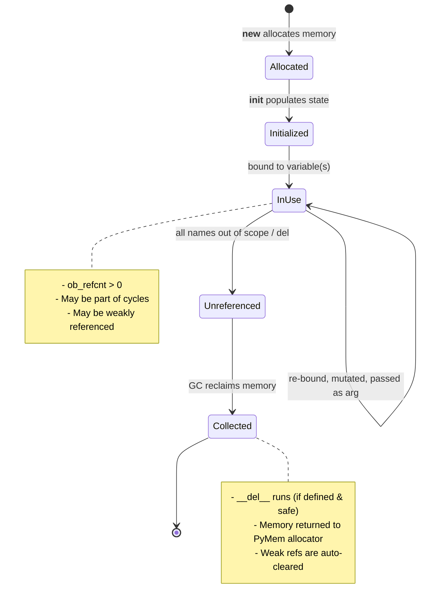
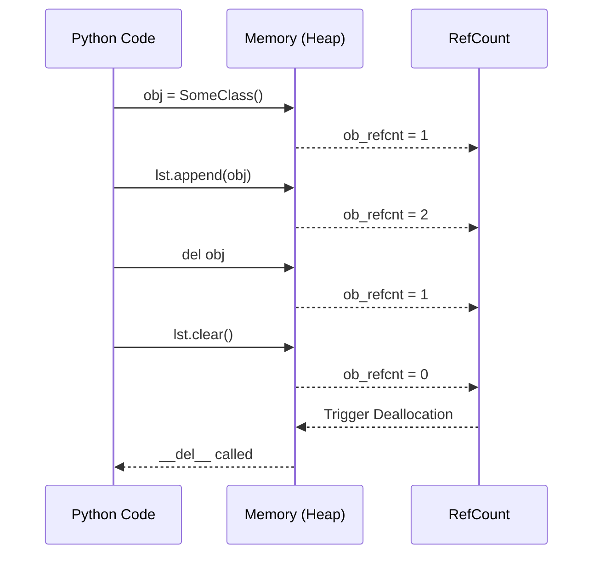
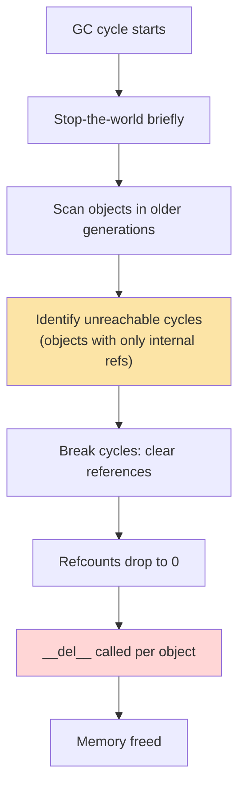
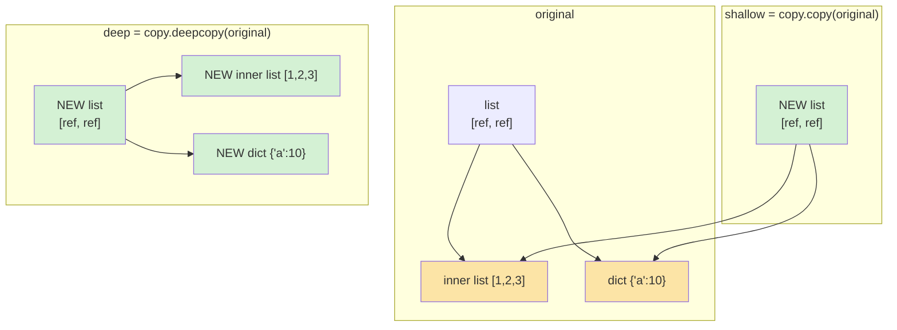
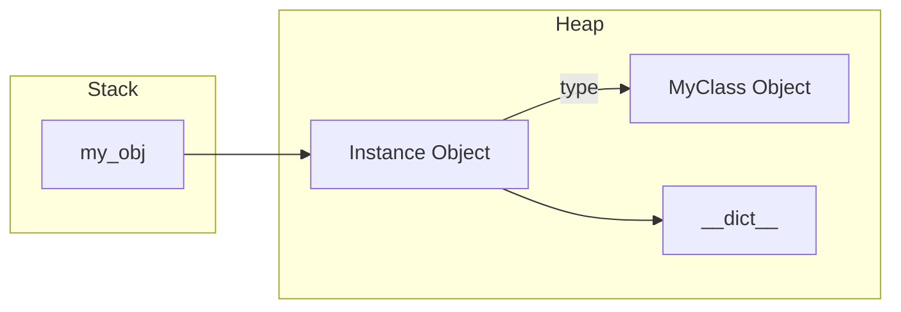

# Object Lifecycle

#oop #fundamentals #lifecycle #garbage-collection #teaching

> [!quote] Tim Peters — The Zen of Python
> "If the implementation is hard to explain, it may be a bad idea. If the implementation is easy to explain, it may be a good idea." — Python's memory model is mostly easy to explain: refcounting plus a cyclic GC. But the consequences (cycles, `__del__` flakiness, copy semantics) are subtle enough to fill a whole note.

Every Python object has a life: it is **born** (allocated), **initialized** (populated), **used** (called, mutated, passed around), and **destroyed** (reclaimed by the garbage collector). This note walks through every stage, the mechanisms underneath each, and the practical consequences for writing correct, leak-free code, incorporating modern Python 3.12+ features.

Prerequisites: [[Classes-And-Objects]] and [[Constructors-And-Destructors]].

---

## 1. The Lifecycle at a Glance



The five stages:

1. **Allocated** — `__new__` requests memory from CPython's allocator.
2. **Initialized** — `__init__` populates `__dict__` (or slots).
3. **In use** — at least one name or container references the object.
4. **Unreferenced** — all references gone; refcount drops to 0 (or only cycles remain).
5. **Collected** — `__del__` (if any) runs, memory is freed.

Between stages 3 and 4, the object can be **mutated**, **copied**, **passed to functions**, **stored in containers**, and **weakly referenced**. Each of those has its own subtleties — unpacked below.

---

## 2. Reference Counting — The Primary GC

### 2.1 How It Works

CPython (the standard Python implementation) uses **reference counting** as its primary garbage-collection mechanism. Every object has a C struct header containing `ob_refcnt` — an integer counting how many references point to it.

```python
import sys

s: str = "hello_world_lifecycle"
print(sys.getrefcount(s))   # 2  (s + the temporary argument to getrefcount)

t: str = s
print(sys.getrefcount(s))   # 3 (s + t + temp)

del t
print(sys.getrefcount(s))   # 2 (s + temp)
```

When `ob_refcnt` reaches 0, the object is **immediately** deallocated (and `__del__` runs, if defined). This is *deterministic*: you can predict when an object dies, as long as no cycles are involved.

### 2.2 What Increments and Decrements Refcount?

| Action | Effect on refcount |
|---|---|
| `x = obj` (assignment) | +1 |
| `lst.append(obj)` (added to container) | +1 |
| `func(obj)` (argument passing) | +1 during the call |
| `return obj` from a function | +1 (caller receives it) |
| `del x` (remove name) | -1 |
| `lst.pop()` (removed from container) | -1 |
| Function returns | -1 for each local variable |
| Re-binding a name | -1 for old value, +1 for new |

#### Memory Execution Trace


> [!info] Why refcounting is great
> It's *deterministic* (you can predict when objects die) and *immediate* (memory is reclaimed as soon as it's not needed). This is why Python doesn't have the "GC pauses" that Java has, and why `__del__` is even a thing.

### 2.3 The Problem With Reference Counting: Cycles

If `a` references `b` and `b` references `a`, both refcounts stay above 0 — even if no one else references them. They'll never be collected by refcounting alone.

```python
from typing import Optional

class Node:
    def __init__(self, name: str) -> None:
        self.name = name
        self.peer: Optional['Node'] = None
        
    def __del__(self) -> None:
        print(f"  ~ {self.name} dying")

def create_cycle() -> None:
    a = Node("A")
    b = Node("B")
    a.peer = b     # A → B
    b.peer = a     # B → A   ← cycle!
    # Function ends, local refs 'a' and 'b' destroyed.
    # Refcounts drop by 1, but stay at 1 because they point to each other.

create_cycle()
# Nothing printed immediately! a and b are unreachable but still alive.
```

This is where the **cyclic garbage collector** comes in.

---

## 3. The Cyclic Garbage Collector

### 3.1 How It Works

CPython's `gc` module runs a separate collector that periodically scans for groups of objects that reference each other but are unreachable from any root (module globals, stack frames, etc.). When it finds such a group, it breaks the cycle and frees the objects.



### 3.2 Three Generations

Python's cyclic GC uses a **generational** scheme with three generations, based on the weak generational hypothesis (most objects die young):

- **Generation 0**: newly created objects. Scanned frequently.
- **Generation 1**: objects that survived one Gen-0 scan. Scanned less often.
- **Generation 2**: long-lived objects. Scanned rarely.

```python
import gc
print(gc.get_threshold())   # (700, 10, 10)
# Gen 0 scanned after 700 net allocations
# Gen 1 scanned after 10 Gen-0 scans
# Gen 2 scanned after 10 Gen-1 scans
```

### 3.3 Manual Control and Introspection (Python 3.12+)

```python
import gc

gc.collect()              # force full collection — returns # of collected objects
gc.disable()              # turn off cyclic GC (refcounting still works)
gc.enable()
gc.get_referrers(obj)     # list objects that reference obj
gc.get_referents(obj)     # list objects that obj references

# Python 3.12+ introspection improvements allow better debugging of gc stats
print(gc.get_stats())     # Shows collections and collected objects per generation
```

> [!warning] Common Student Misconception #1
> "`del x` deletes the object." It does not. It removes the *name* `x` from the namespace, decrementing the object's refcount. If other names or containers still reference the object, it lives on.

### 3.4 Tracking Object Lifetimes & Memory Leaks

```python
import gc

class Tracked:
    instances: list['Tracked'] = []
    
    def __init__(self, name: str) -> None:
        self.name = name
        Tracked.instances.append(self)
        print(f"+ created {self.name}")

    def __del__(self) -> None:
        print(f"- destroyed {self.name}")

a = Tracked("a")    # + created a
del a               # (nothing yet — Tracked.instances still holds it)
gc.collect()        # still nothing, class list holds a hard reference!
```

This pattern (stashing instances in a class-level list) is a common source of memory leaks — the class keeps them alive forever. The fix is to use a `weakref.WeakSet`.

---

## 4. Weak References — When You Need Them

A **weak reference** lets you refer to an object *without* incrementing its refcount. When the object is collected, the weak ref is automatically cleared.

```python
import weakref

class ExpensiveImage:
    def __init__(self, path: str) -> None:
        self.path = path

img = ExpensiveImage("/tmp/big.png")
ref = weakref.ref(img)

print(ref() is img)  # True

del img              # frees img immediately
print(ref())         # None  ← weak ref auto-cleared
```

### 4.1 Variations

- `weakref.ref(obj)` — bare weak reference; call it to get the object (or `None`).
- `weakref.proxy(obj)` — transparent proxy; accessing attributes goes to the object, raises `ReferenceError` if dead.
- `weakref.WeakValueDictionary` — dict that holds weak refs to values; entries vanish when values are collected.
- `weakref.WeakSet` — set of weak refs.
- `weakref.finalize(obj, callback, *args)` — modern alternative to `__del__`, guarantees callback execution when `obj` is collected.

> [!tip] Best Practice: `weakref.finalize` over `__del__`
> In modern Python, using `weakref.finalize` is safer than `__del__` because it avoids resurrection issues and executes reliably even during interpreter shutdown.

---

## 5. Identity vs Equality — `is` vs `==`

### 5.1 The Distinction

- **`is`** tests *identity* — are `a` and `b` the same object (same memory address, `id()`)?
- **`==`** tests *equality* — do `a` and `b` have the same value (per `__eq__`)?

```python
a = [1, 2, 3]
b = [1, 2, 3]
print(a == b)   # True  — same contents
print(a is b)   # False — different objects
```

### 5.2 Implementing `__eq__` and `__hash__`

If you override `__eq__`, Python sets `__hash__` to `None` (making instances unhashable). The two **must be consistent**: equal objects must have equal hashes.

```python
from dataclasses import dataclass

# Modern Python approach: use dataclasses for automatic __eq__ and __hash__
@dataclass(frozen=True)
class Point:
    x: int
    y: int

p1 = Point(1, 2)
p2 = Point(1, 2)
print(p1 == p2)            # True
print(p1 is p2)            # False
print(hash(p1) == hash(p2))  # True
```

> [!danger] Common Student Misconception #2
> "I defined `__eq__` so my objects compare equal." Yes, but without `__hash__`, they're unusable in sets or as dict keys. **Equal objects must have equal hashes**.

---

## 6. Copying Objects

### 6.1 Shallow vs Deep Copy

```python
import copy

original = [[1, 2, 3], {"a": 10}]
shallow  = copy.copy(original)       # new outer container, same inner objects
deep     = copy.deepcopy(original)   # new outer AND new inner objects

original[0].append(99)
print(shallow[0])   # [1, 2, 3, 99]  ← shared!
print(deep[0])      # [1, 2, 3]       ← independent
```



---

## 7. Interning and Object Pooling

### 7.1 Small Integer Caching

CPython caches integers in the range `[-5, 256]`.

```python
a = 256; b = 256
print(a is b)   # True

a = 1000; b = 1000
print(a is b)   # Usually False (in REPL, though script execution might optimize it)
```

### 7.2 String Interning

Short, identifier-like strings are interned automatically.

```python
import sys
a = sys.intern("a moderately long string")
b = sys.intern("a moderately long string")
print(a is b)   # True
```

---

## 8. Interactive Practice Exercises

> [!example] Exercise 1 — Memory Execution Trace
> **Task**: Write down the refcount of `obj` after each line.
> ```python
> obj = {"key": "value"} # 1. refcount = ?
> x = obj                # 2. refcount = ?
> my_list = [x, obj]     # 3. refcount = ?
> del x                  # 4. refcount = ?
> ```
> <details><summary><b>Solution</b></summary>
> 1. 1 (bound to `obj`)<br>
> 2. 2 (bound to `x`)<br>
> 3. 4 (added twice to `my_list`)<br>
> 4. 3 (name `x` removed)
> </details>

> [!example] Exercise 2 — Cycle Detection Lab
> **Task**: Run this code. Does it print "Cleaned"? Then uncomment `gc.collect()` and see what happens.
> ```python
> import gc
> class Node:
>     def __del__(self): print("Cleaned")
> 
> def run():
>     a = Node(); b = Node()
>     a.ref = b; b.ref = a
> run()
> # gc.collect()
> ```

> [!example] Exercise 3 — Weak Cache Implementation
> **Task**: Fix the memory leak using `weakref`.
> ```python
> class ImageCache:
>     def __init__(self):
>         self.cache = {} # Fix me!
> ```
> <details><summary><b>Solution</b></summary>
> Use `self.cache = weakref.WeakValueDictionary()`
> </details>

---

## 9. Summary & Modern Takeaways

- Lifecycle: **allocate (`__new__`) → initialize (`__init__`) → use → unreferenced → collect (`__del__` / `finalize`)**.
- **Refcounting** is deterministic and immediate. **Cyclic GC** handles the messy leftovers.
- **`del`** deletes names, not objects.
- **Weak references** (`weakref.WeakValueDictionary`, `weakref.finalize`) are crucial for modern Python caching and cleanup without memory leaks.
- Always use `==` for value comparison; `is` for identity (`None`, singletons).
- For safe object hashing in modern Python 3.12+, prefer `@dataclass(frozen=True)`.

> [!success] Next stops
> - [[Constructors-And-Destructors]] — birth and death, in detail.
> - [[Magic-Methods]] — `__eq__`, `__hash__`, `__copy__`, `__deepcopy__`, and more.
> - [[Self-And-Cls]] — what `self` actually is during the "use" phase.


## Deep Dive: Python OOP Basics

### Memory Allocation Diagram (`self` and `__init__`)


### Code Execution Trace
1. `obj = MyClass(10)`
2. Python calls `MyClass.__new__` to allocate memory for the object.
3. Python calls `MyClass.__init__(self, 10)` passing the newly allocated object as `self`.
4. `self.value = 10` is executed, storing it in the instance's `__dict__`.
5. The memory reference is returned and bound to `obj`.

### Interactive Practice Exercise
**Exercise:** Create a `Student` class. Implement `__init__` and a custom `__del__` method. Instantiate it, explicitly `del` it, and observe the lifecycle hook being triggered.
