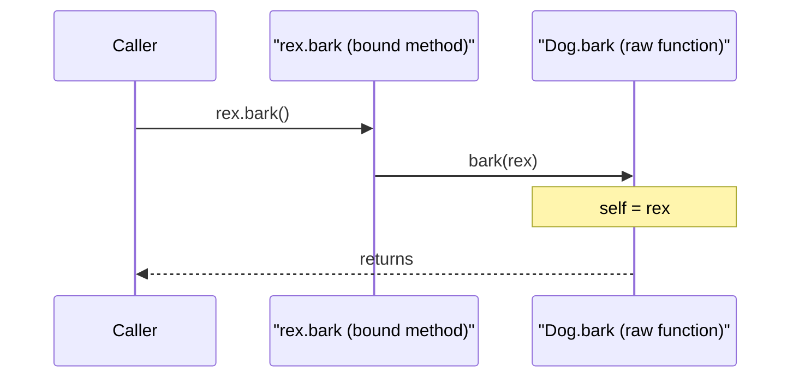
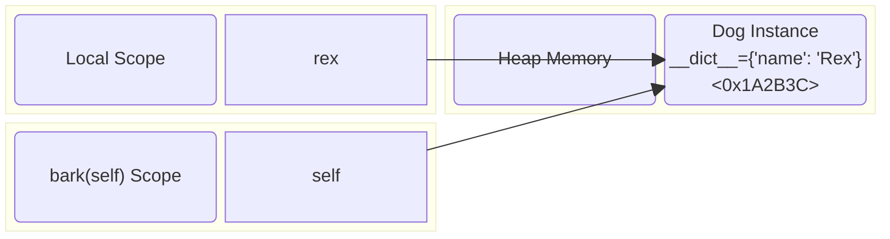
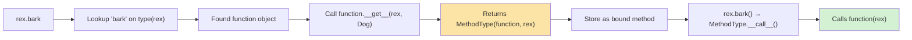

# Self and Cls

#oop #fundamentals #self #cls #teaching

> [!quote] The Zen of Python
> "Explicit is better than implicit." — This is the entire justification for Python requiring you to write `self` in every method signature. Java and C++ hide `this` from you; Python refuses to.

If you ask a Java developer why Python methods need to write `self` everywhere, you'll get a frown. If you ask a Python developer, you'll get a sentence about the Zen of Python. This note explains *why* Python makes `self` explicit, *what* `self` actually is (and isn't), how `cls` differs, and how method binding works under the hood.

Prerequisites: [[Classes-And-Objects]] and [[Methods-And-Functions]].

---

## 1. The Two-Second Version

```python
from typing import Self

class Dog:
    def __init__(self, name: str) -> None:   # `self` is the instance being constructed
        self.name = name                     # set attribute on that instance
        
    def bark(self) -> str:                   # `self` is the instance calling bark
        return f"{self.name} says Woof!"
        
    @classmethod
    def from_csv(cls, line: str) -> Self:    # `cls` is the class itself (Dog, or subclass)
        name = line.split(",")[0]
        return cls(name)                     # returns an instance of the class
        
    @staticmethod
    def species() -> str:                    # neither self nor cls — just a function
        return "Canis familiaris"
```

| Symbol | What it is | Required? | When you see it |
|---|---|---|---|
| `self` | The instance | Convention only (any name works) | First arg of instance methods |
| `cls` | The class | Convention only (any name works) | First arg of classmethods |
| (neither) | Nothing special | — | Static methods |

`self` is **not a keyword**. It is **not magic**. It's just the name Python programmers agreed to use for the first parameter of an instance method — the parameter that receives the instance.

---

## 2. What Is `self`, Really?

### 2.1 `self` Is a Parameter

When Python translates `rex.bark()` into a function call, it does **not** call `Dog.bark()` with no arguments. It calls `Dog.bark(rex)` — passing `rex` as the first argument, which gets bound to the parameter named `self`.

```python
class Dog:
    def bark(self):
        print(f"self is {self!r}")

rex = Dog()
rex.bark()        # self is <Dog object at 0x000001>
Dog.bark(rex)     # exactly the same — explicit pass
```

#### Code Execution Trace



### 2.2 Memory Allocation Diagram

When `self` is passed, it acts as a pointer reference to the instance allocated in memory. Let's visualize this using a memory diagram:


*Notice how both the variable `rex` in the outer scope and `self` inside the method point to the exact same memory address.*

### 2.3 You Can Rename It (But Don't)

Because `self` is just a parameter name, you can rename it — and the code will work:

```python
class Dog:
    def bark(this):
        return f"{this} barks"
    def __init__(me, name):
        me.name = name

rex = Dog("Rex")
print(rex.bark())   # <Dog ...> barks
```

> [!danger] Don't actually do this
> Every Python tool — linters, IDEs, documentation generators, code reviewers — assumes the first parameter of an instance method is named `self`. Renaming it works at runtime but breaks the entire ecosystem's expectations. The convention is enforced socially, not syntactically.

---

## 3. Why Python Makes `self` Explicit

### 3.1 The Design Reasons

Python's choice to require explicit `self` is not arbitrary. It supports:

1. **No special syntax for adding methods after class definition.**
   You can take a regular function and assign it to a class:
   ```python
   def fetch(self):
       return f"{self.name} fetches"
   Dog.fetch = fetch
   rex.fetch()   # works — `fetch` is now a method
   ```

2. **Explicit scoping.**
   In Java, `name = "Rex"` inside a method might refer to a local, a field, or a static field — and the compiler decides. In Python, you always write `self.name = "Rex"` to set an instance attribute. There's no ambiguity.

3. **Decorators and metaprogramming work cleanly.**
   `@classmethod` and `@staticmethod` are just decorators that change what the first argument is.

4. **Consistency with the rest of Python.**
   Python doesn't have implicit variables. Every name must come from somewhere — a parameter, an enclosing scope, a global, a built-in. Treating `self` as a parameter fits this philosophy.

> [!info] A famous April Fools' PEP
> PEP 3099 (rejected) jokingly proposed removing explicit `self`. The rejection rationale lists 14 reasons it can't work — most boil down to "the rest of Python's design assumes explicit parameters."

---

## 4. `cls` — The Class as the First Argument

### 4.1 What `cls` Receives

Classmethods receive the **class** (not an instance) as their first argument:

```python
class Dog:
    species = "Canis familiaris"

    @classmethod
    def show_species(cls):
        print(f"cls is {cls}")
        print(f"cls.species is {cls.species}")

Dog.show_species()
# cls is <class '__main__.Dog'>
# cls.species is Canis familiaris
```

### 4.2 Modern Python Type Hinting: `typing.Self`

In modern Python (3.11+), you should annotate methods returning an instance of the class using `typing.Self`. This is especially useful for alternative constructors:

```python
from typing import Self

class Animal:
    @classmethod
    def create(cls) -> Self:
        print(f"cls is {cls.__name__}")
        return cls()

class Dog(Animal): pass

# Type checkers know this returns a Dog!
d = Dog.create() 
```

### 4.3 `cls` vs `self.__class__`

Inside an instance method, you can get the class via `self.__class__` or `type(self)`:

| Approach | Works in instance methods? | Works in classmethods? | Polymorphic? |
|---|---|---|---|
| `self.__class__` | Yes | No (no `self`) | Yes |
| `type(self)` | Yes | No | Yes |
| `cls` | No | Yes | Yes |

Use `cls` in classmethods; use `self.__class__` or `type(self)` in instance methods. Don't hard-code class names internally.

---

## 5. Method Binding — How `self` Gets There

### 5.1 The Descriptor Protocol

When you write `rex.bark`, Python doesn't just return the function `Dog.bark` — it returns a **bound method** object that has `rex` pre-filled as the first argument.

```python
class Dog:
    def bark(self):
        return "Woof!"

rex = Dog()

print(type(Dog.bark))    # <class 'function'>
print(type(rex.bark))    # <class 'method'>

# The bound method stores the function and the instance:
m = rex.bark
print(m.__func__)        # <function Dog.bark at 0x...>
print(m.__self__)        # <Dog object at 0x...>
m()                      # Woof!  — no argument needed
```



---

## 6. Interactive Practice Exercises

> [!example] Exercise 1 — Self Is Just a Parameter
> Define `Dog.bark(self)` and call it three ways: `rex.bark()`, `Dog.bark(rex)`, and via `types.MethodType(Dog.bark, rex)()`. Confirm all three produce the same result.

> [!example] Exercise 2 — Diagnose the Bug
> The following code raises `TypeError`. Why? Fix it using modern type hints and decorators.
> ```python
> class Logger:
>     def log(message: str) -> None:
>         print(message)
> Logger.log("hello")
> ```
> *Hint: Should this be a staticmethod or a classmethod? Does `Logger` have any state?*

> [!example] Exercise 3 — Method Chaining with `Self`
> Write a `QueryBuilder` class with methods `select()` and `where()` that return `self`. Annotate them using Python 3.12 `from typing import Self`. Prove that you can chain them: `QueryBuilder().select("*").where("id = 1")`.

---

## 7. Summary

- **`self`** receives the instance. It's a convention, not a keyword.
- **`cls`** receives the class, commonly used in `@classmethod` alternative constructors.
- **`typing.Self`** (Python 3.11+) is the modern way to type hint methods returning `self` or instances created via `cls`.
- Python makes `self` explicit for clarity, explicit scoping, and consistent object models.
- **Bound methods** (`rex.bark`) are created lazily by the descriptor protocol — they wrap a function and an instance.

> [!success] Next stops
> - [[Methods-And-Functions]] — every method kind in detail.
> - [[How-OOP-Works]] — the descriptor protocol that powers binding.
> - [[Constructors-And-Destructors]] — `self` during `__init__` and `__new__`.
