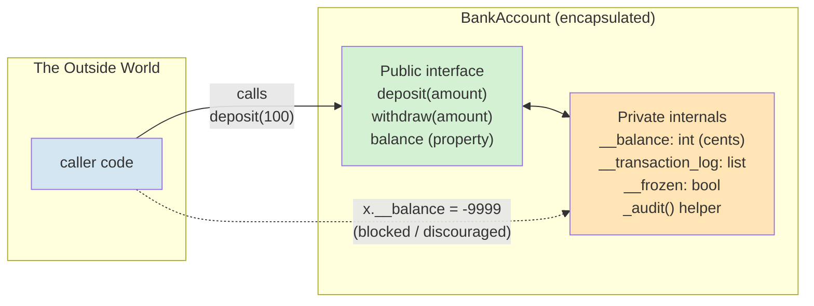
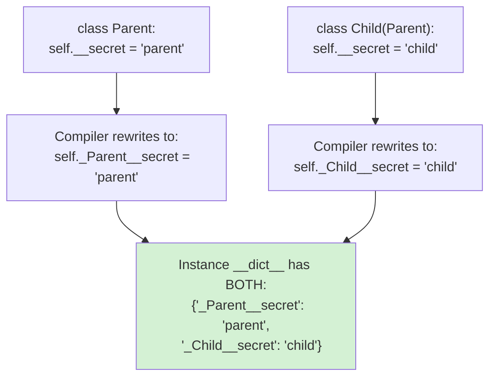
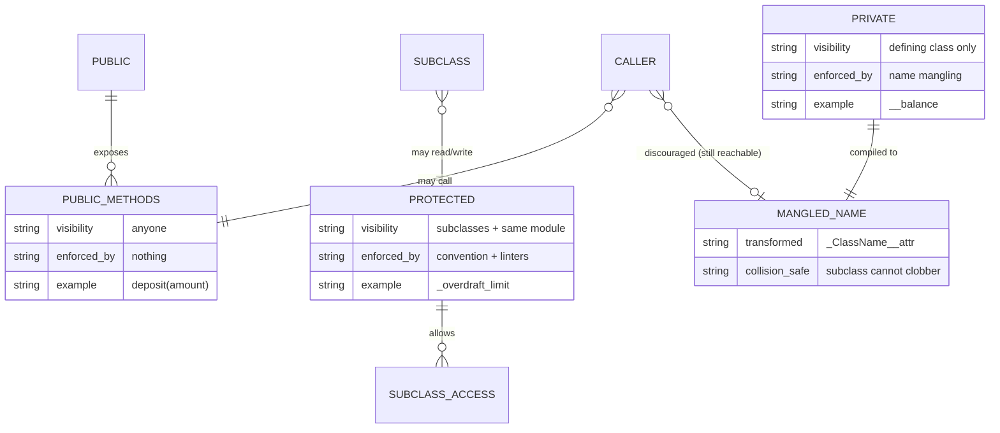
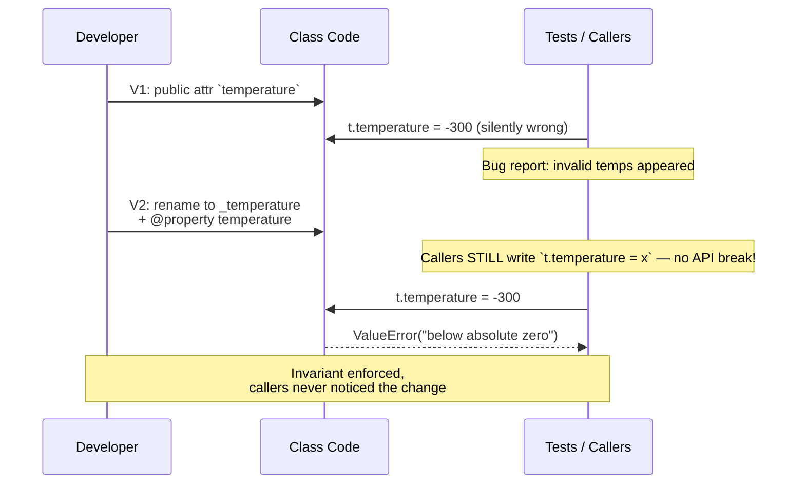
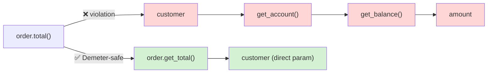
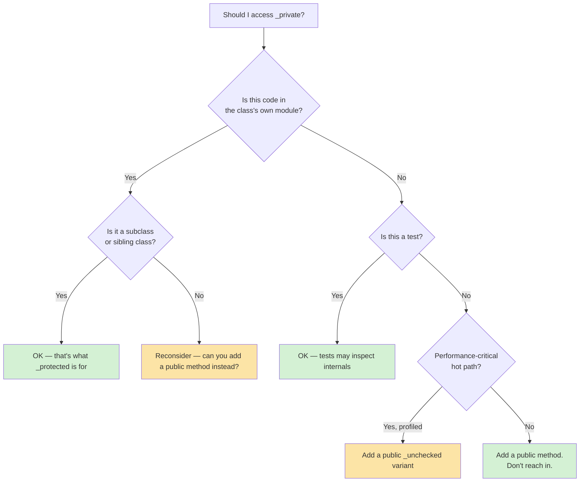
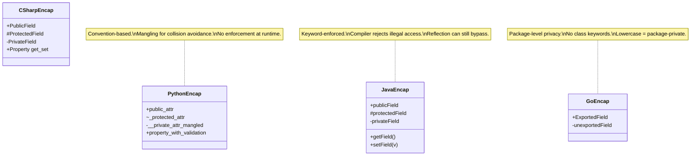
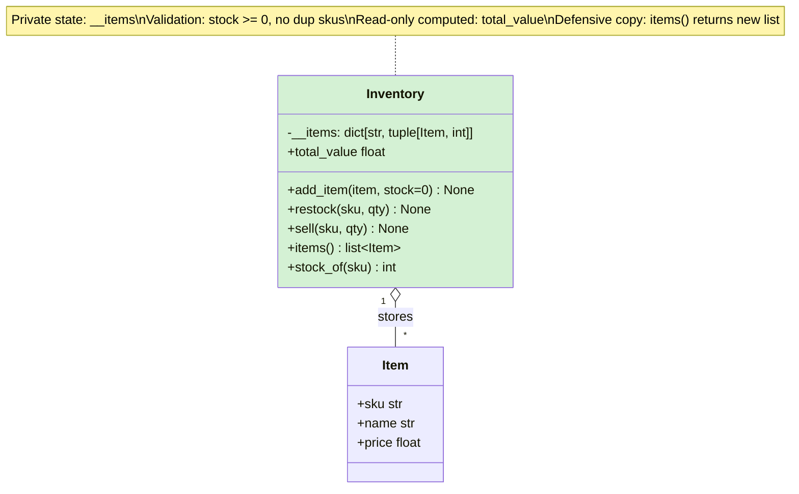
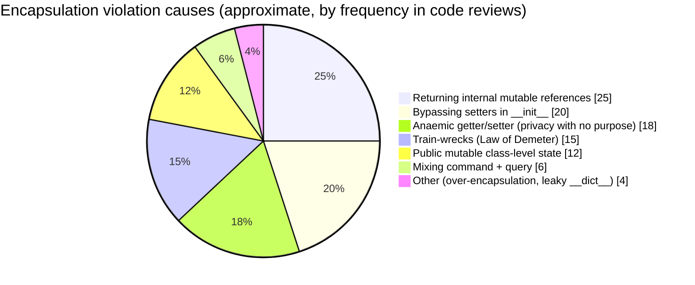
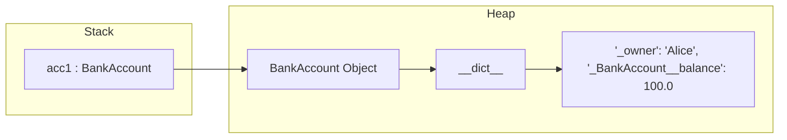

# Encapsulation — The First Pillar of OOP

#oop #four-pillars #encapsulation #information-hiding #teaching #deep-dive

> [!quote] Grady Booch
> "Encapsulation is the process of compartmentalizing the elements of an abstraction that constitute its structure and behavior; encapsulation serves to separate the contractual interface of an abstraction and its implementation."

Encapsulation is the quiet, structural workhorse of object-oriented programming. Polymorphism gets the spotlight because it makes code feel magical; inheritance gets the controversies because it's easy to misuse; abstraction gets the prestige because it sounds clever. But **encapsulation is what actually keeps a codebase from rotting**. Every other pillar depends on it. When encapsulation fails, the others cannot save you.

This note is a deep dive: definitions, mechanisms, conventions, properties, design principles, anti-patterns, and cross-language comparisons — all grounded in Python with runnable code.

Prerequisite: [[Classes-And-Objects]] and [[Attributes-And-Properties]].

---

## 1. What Is Encapsulation?

Encapsulation is the practice of **bundling data and the behavior that operates on that data together inside a class**, and **controlling how the outside world accesses that bundle**. The two halves of that sentence matter equally.

### 1.1 The Two Aspects

Encapsulation is often collapsed to "private fields" — that's only half the story. It is two distinct things:

1. **Bundling** — putting state (data) and the methods that read, mutate, validate, and protect that state into the same unit (a class). The data does not float around loose in global variables; the methods that depend on a particular piece of state live next to it.
2. **Information hiding** — exposing only what callers *need* to see and hiding everything they *should not* depend on. Implementation details — internal field names, caching strategy, validation order, data representation — become invisible to external code.



The capsule keeps the caller on the green side. The yellow side can change shape freely as long as the green interface stays stable.

### 1.2 Why It Matters — Three Pillars of Justification

| Reason | What breaks without it | What encapsulation gives you |
|---|---|---|
| **Protect invariants** | Anyone can set `account.balance = -1_000_000` | Validation in setters refuses illegal values |
| **Reduce coupling** | Callers depend on internal field names; rename one and a dozen tests break | Callers depend on a stable public interface; internals can be refactored |
| **Enable change** | Switching from list to deque touches every caller | Internal change is invisible behind the property/method boundary |

> [!info] The invariant argument
> An **invariant** is a property of an object that must always hold true between method calls. For a `BankAccount`, an invariant might be `balance >= -overdraft_limit`. Without encapsulation, you cannot enforce this — any line of code anywhere can mutate `balance` to anything. With encapsulation, every mutation goes through `deposit()` / `withdraw()`, which can enforce the rule centrally.

> [!tip] Teaching Tip #1 — Start with the broken version
> Show students a class with public mutable attributes and let them break it (`account.balance = "lol"`). *Then* show encapsulated version refusing the same operation. The pain has to come first; otherwise the cure looks like ceremony.

---

## 2. The Two Aspects in Code

### 2.1 Without Encapsulation (Bad)

```python
class BankAccountBad:
    """No encapsulation. Anyone can break the invariants."""

    def __init__(self, owner):
        self.owner = owner
        self.balance = 0          # public, mutable
        self.transactions = []    # public, mutable


acct = BankAccountBad("Ada")
acct.balance = -1_000_000          # silently corrupts state
acct.balance = "now a string"      # type confusion
acct.transactions.append(-9999)    # bypasses any accounting logic
acct.transactions = "removed"      # now even iteration breaks
```

Every line above is *legal Python*. None of them would be caught by a type checker that only sees `balance: int` because the type checker doesn't run at runtime. This is the failure mode encapsulation exists to prevent.

### 2.2 With Encapsulation (Good)

```python
class BankAccount:
    """Encapsulated: state is private, mutation goes through methods."""

    def __init__(self, owner: str, *, overdraft_limit: int = 0):
        self.owner = owner
        self._overdraft_limit = overdraft_limit   # protected (convention)
        self.__balance = 0                        # private (name-mangled)
        self.__transactions: list[tuple[str, int]] = []

    # --- public interface -------------------------------------------------
    def deposit(self, amount: int) -> None:
        if amount <= 0:
            raise ValueError("deposit must be positive")
        self.__balance += amount
        self.__transactions.append(("deposit", amount))

    def withdraw(self, amount: int) -> int:
        if amount <= 0:
            raise ValueError("withdraw must be positive")
        if amount > self.__balance + self._overdraft_limit:
            raise InsufficientFunds(self.__balance, amount)
        self.__balance -= amount
        self.__transactions.append(("withdraw", amount))
        return amount

    @property
    def balance(self) -> int:
        return self.__balance

    @property
    def transactions(self) -> list[tuple[str, int]]:
        # return a *copy* so callers can't mutate the internal list
        return list(self.__transactions)


class InsufficientFunds(Exception):
    def __init__(self, balance: int, attempted: int):
        super().__init__(f"have {balance}, tried to withdraw {attempted}")
```

```python
acct = BankAccount("Ada", overdraft_limit=100)
acct.deposit(500)
acct.withdraw(550)              # OK, within overdraft
print(acct.balance)             # → -50 (read via property)
acct.balance = 1_000_000        # AttributeError — no setter
acct.__balance = 1_000_000      # creates a NEW unrelated attr (does NOT change balance!)
print(acct.balance)             # still -50
```

> [!example] The `acct.__balance = ...` gotcha
> The last line above does **not** corrupt the real balance. It silently creates a *new* attribute named `__balance` on the instance (without name mangling, because you typed it literally). The real internal attribute is `_BankAccount__balance`. This is the most common student confusion about Python privacy: the *syntax* looks like it should work, but it does something harmless — and students then conclude "encapsulation is fake in Python." It isn't fake; it's *convention + tooling*, not security.

---

## 3. Access Control in Python — The Three Levels

Unlike Java's `private`/`protected`/`public` keywords, Python uses **naming conventions** and one **syntactic transform** (name mangling). Three levels exist:

| Convention | Syntax | Visibility | Enforced by | Typical use |
|---|---|---|---|---|
| **Public** | `name` | Anyone | Nothing | Stable API |
| **Protected** | `_name` | "Internal" — subclasses & same module | Convention only | Hooks for subclasses, implementation shared with children |
| **Private** | `__name` (≥2 leading, ≤1 trailing underscore) | "Class-private" | Name mangling to `_ClassName__name` | Avoid name collisions in subclasses; signal "do not touch" |

```mermaid
mindmap
  root((Access Levels))
    Public
      syntax: name
      enforced by: nothing
      audience: everyone
      example: account.deposit()
    Protected
      syntax: _name
      enforced by: convention + linters
      audience: subclasses, package internals
      example: self._audit_hook()
    Private
      syntax: __name
      enforced by: name mangling
        transforms to _ClassName__name
      audience: the defining class only
      example: self.__balance
      not security — still accessible as acct._BankAccount__balance
```

### 3.1 Public — the Default

Plain names like `name`, `balance`, `deposit()`. Anyone can read, anyone can write. This is what you should *use by default*. Most attributes are fine as public; the instinct to make everything private is one of the most common beginner over-corrections (see §10.3).

### 3.2 Protected — the Single Underscore

`_name` is a *gentleman's agreement*: "this is internal, don't touch it from outside the class hierarchy." Python itself does not enforce it. `from module import *` will skip names beginning with `_` unless they're in `__all__`, and that's about the extent of the language's involvement.

```python
class Shape:
    def __init__(self):
        self._color = "black"     # subclasses may read/write; outsiders shouldn't

class Circle(Shape):
    def describe(self):
        return f"A {self._color} circle"   # acceptable: subclass touching protected
```

> [!warning] Teaching Tip #2 — Protected is a *request*, not a rule
> Students often expect `_x` to throw `AttributeError` when accessed externally. It won't. Demonstrate this in the first class: `obj._x` works fine. The convention is for *humans reading the code*, not the interpreter. The protection is social: reviewers will reject your PR if you reach into another module's `_private` bits without reason.

### 3.3 Private — Name Mangling

A name like `__balance` (exactly two leading underscores, at most one trailing) is *transformed at compile time* by the Python parser. Inside `class BankAccount`, every occurrence of `__balance` is rewritten to `_BankAccount__balance`. This means:

- Code *inside* the class body sees `self.__balance` and just works.
- Code *outside* the class cannot see `self.__balance` — there's no such attribute; only `self._BankAccount__balance` exists.
- A **subclass cannot accidentally clobber** a parent's private attribute by defining its own `__balance`. The child's version mangles to `_Child__balance`, which is a different attribute.

```python
class Parent:
    def __init__(self):
        self.__secret = "parent"   # becomes _Parent__secret

class Child(Parent):
    def __init__(self):
        super().__init__()
        self.__secret = "child"    # becomes _Child__secret — DIFFERENT attribute

c = Child()
print(c._Parent__secret)   # 'parent'  ← still there, untouched
print(c._Child__secret)    # 'child'   ← a separate field
print(c.__secret)          # AttributeError
```



> [!danger] Common Student Misconception #1 — "Private means inaccessible"
> It does not. `obj._ClassName__attr` works from anywhere. Name mangling is a **collision-avoidance** mechanism, not a **security** mechanism. It exists so that a subclass can't accidentally overwrite a parent's internal attribute. If you want real privacy, you need module-level closures, `__slots__` plus `__setattr__` checks, or C extensions. Most of the time, you don't need real privacy — you need *discipline*.

> [!danger] Common Student Misconception #2 — "Python has no encapsulation"
> False. Python has *different* encapsulation — convention-based and tooling-enforced, not keyword-enforced. With `@property`, `__mangled` fields, type checkers, linters, and code review, Python code can be just as encapsulated as Java. The *style* is different: Python trusts the programmer more, in exchange for less ceremony. See §9 for the cross-language comparison.



---

## 4. Properties — The Encapsulation Tool

Python's killer feature for encapsulation is the **`@property` descriptor**. It lets you start with a plain public attribute and *later* add validation, computation, or access control **without changing the call site**. In Java, going from `public int x;` to `private int x; int getX() {...}` is a breaking API change. In Python, it's invisible.

See [[Attributes-And-Properties]] and [[Descriptors]] for the full descriptor mechanics. Here we focus on encapsulation patterns.

### 4.1 The Basic Property

```python
class CelsiusThermometer:
    def __init__(self, temp: float):
        self._celsius = temp         # backing field

    @property
    def celsius(self) -> float:
        return self._celsius

    @celsius.setter
    def celsius(self, value: float) -> None:
        if value < -273.15:
            raise ValueError(f"{value}°C is below absolute zero")
        self._celsius = value
```

```python
t = CelsiusThermometer(20)
t.celsius = 25          # calls setter — validates
t.celsius = -300        # raises ValueError
print(t.celsius)        # 25 — calls getter
```

The caller writes `t.celsius = 25` exactly as if `celsius` were a plain attribute. The validation is *invisible* at the call site, but enforced.

### 4.2 Read-Only Properties

Define a getter, no setter. Any attempt to assign raises `AttributeError: can't set attribute`.

```python
class Counter:
    def __init__(self):
        self._n = 0

    def increment(self) -> None:
        self._n += 1

    @property
    def count(self) -> int:
        return self._n

c = Counter()
c.increment(); c.increment()
print(c.count)    # 2
c.count = 10      # AttributeError — read-only
```

### 4.3 Computed Properties

A property's getter can compute on the fly instead of returning a stored field.

```python
import math

class Circle:
    def __init__(self, radius: float):
        self.radius = radius

    @property
    def area(self) -> float:
        return math.pi * self.radius ** 2

    @property
    def perimeter(self) -> float:
        return 2 * math.pi * self.radius
```

No backing field for `area` or `perimeter` — they're derived from `radius`. Callers don't need to know that.

### 4.4 Lazy / Cached Computed Properties

If a computation is expensive and the inputs don't change often, cache on first access.

```python
from functools import cached_property

class Document:
    def __init__(self, text: str):
        self.text = text

    @cached_property
    def word_count(self) -> int:
        print("computing...")          # runs once
        return len(self.text.split())

doc = Document("the quick brown fox")
print(doc.word_count)   # "computing..." → 4
print(doc.word_count)   # 4  (no print — cached)
```

> [!warning] Teaching Tip #3 — `cached_property` requires `__dict__`
> If your class uses `__slots__` (no `__dict__`), `@cached_property` cannot store its result and will silently recompute every call — or raise `AttributeError` if no slot is reserved. Use `functools.cached_property` only on regular classes, or implement a manual cache slot for slotted classes.

### 4.5 Property Lifecycle — From Plain Attribute to Validated Property



This is the **encapsulation payoff**: the cost of changing the implementation from "plain attribute" to "validated property" is *zero* at the call site. That's why Python's design encourages starting simple and encapsulating later — you never pay a switching cost.

---

## 5. Enforcing Invariants — Real-World Examples

### 5.1 BankAccount (full version)

Already shown in §2.2 — see there. The invariants enforced: balance ≥ −overdraft_limit, all transactions logged, balance is always consistent with the sum of transactions.

### 5.2 Temperature with Bidirectional Unit Conversion

A nice property trick: expose the same physical quantity through two properties that stay in sync.

```python
class Temperature:
    """Internal representation: kelvin (the SI unit).
       Exposed: celsius, fahrenheit, kelvin — all kept in sync."""

    _ABSOLUTE_ZERO_K = 0.0

    def __init__(self, celsius: float = 0.0):
        self.celsius = celsius   # routes through the setter for validation

    @property
    def kelvin(self) -> float:
        return self._kelvin

    @kelvin.setter
    def kelvin(self, value: float) -> None:
        if value < self._ABSOLUTE_ZERO_K:
            raise ValueError("below absolute zero")
        self._kelvin = value

    @property
    def celsius(self) -> float:
        return self._kelvin - 273.15

    @celsius.setter
    def celsius(self, value: float) -> None:
        self.kelvin = value + 273.15

    @property
    def fahrenheit(self) -> float:
        return self.celsius * 9 / 5 + 32

    @fahrenheit.setter
    def fahrenheit(self, value: float) -> None:
        self.celsius = (value - 32) * 5 / 9
```

```python
t = Temperature(celsius=25)
print(t.fahrenheit)         # 77.0
t.fahrenheit = 32           # routes through fahrenheit setter → celsius → kelvin
print(t.celsius)            # 0.0
t.celsius = -300            # ValueError
```

> [!tip] Teaching Tip #4 — Show students a *single* source of truth
> Note that only `_kelvin` is stored. `celsius` and `fahrenheit` are computed from it. This avoids the classic bug of storing both `celsius` and `fahrenheit` and having them drift out of sync. The principle generalizes: **store one canonical representation; expose derived views as properties.**

### 5.3 User with Email Validation

```python
import re

EMAIL_RE = re.compile(r"^[a-zA-Z0-9._%+-]+@[a-zA-Z0-9.-]+\.[a-zA-Z]{2,}$")

class User:
    def __init__(self, name: str, email: str):
        self.name = name
        self.email = email         # routes through setter

    @property
    def email(self) -> str:
        return self._email

    @email.setter
    def email(self, value: str) -> None:
        if not isinstance(value, str):
            raise TypeError("email must be a string")
        if not EMAIL_RE.match(value):
            raise ValueError(f"not a valid email: {value!r}")
        self._email = value.lower()   # normalize on the way in

u = User("Ada", "Ada@Example.com")
print(u.email)              # 'ada@example.com' — normalized
User("x", "not-an-email")  # ValueError
```

> [!success] Why normalize in the setter?
> By lowercasing email on assignment, every later comparison is case-insensitive *for free*. You can never accidentally store two users with `Ada@x.com` and `ada@x.com` thinking they're different. Centralized normalization is one of the highest-leverage uses of property setters.

---

## 6. Encapsulation vs Abstraction — Clarify This Early

These two concepts are constantly confused. They are *related* but *distinct*. The confusion is so common that you should plan to spend a full lecture disentangling them.

| | **Encapsulation** | **Abstraction** |
|---|---|---|
| Question it answers | **How** do I hide things? | **What** should I hide? |
| Mechanism | Private fields, properties, access control | Abstract classes, interfaces, Protocols |
| Concern | Implementation protection | Interface design |
| Failure mode if missing | Internals leak; callers depend on field names | Interface bloat; leaky abstractions; wrong concepts modeled |
| Symbolic question | "Can outsiders touch this?" | "Does this interface capture the essential concept?" |

> [!info] The one-liner
> **Encapsulation is the mechanism; abstraction is the goal.** Or, more vividly: encapsulation is the *wall*; abstraction is the *blueprint* that decides where the wall goes and what doors to put in it. See [[Abstraction]] for the deep dive on the second pillar-pair.

> [!danger] Common Student Misconception #3 — "Encapsulation = private attributes"
> No — private attributes are *one tool* for encapsulation. Encapsulation also includes bundling (data + behavior together), the choice of *what* to expose as methods vs properties, and the discipline of returning defensive copies. A class with all-public attributes can still be well-encapsulated if its *methods* form a coherent interface and external code only uses those methods.

---

## 7. Design Principles Related to Encapsulation

### 7.1 Tell, Don't Ask

> [!quote] The Pragmatic Programmers
> "Don't ask objects about their state, make decisions based on that state, and then tell them what to do. *Tell* them what to do — let them manage their own state."

Bad (asking):

```python
# Anti-pattern: pulling state out, deciding externally, pushing back
if account.balance >= amount:
    account.balance -= amount
    log_transaction(account, -amount)
```

Good (telling):

```python
account.withdraw(amount)   # account decides whether to allow it
```

The "tell" version keeps the invariant enforcement *inside* the object. The "ask" version puts every caller in charge of correctness — and inevitably one caller forgets the `log_transaction` line.

### 7.2 The Law of Demeter ("Don't Talk to Strangers")

> [!quote] Karl Lieberherr
> "Each unit should have only limited knowledge about other units: only units closely related to the current unit. Each unit should only talk to its friends; don't talk to strangers. Only talk to immediate friends."

A method `m` of object `o` may only call methods of:

1. `o` itself
2. parameters passed to `m`
3. objects created within `m`
4. direct component objects of `o`

Violations look like *train wrecks*: `customer.bank.account.balance`. Each dot is a hop deeper into someone else's internals.



```python
# Violation: order reaches through customer, through account, to balance
class Order:
    def total(self) -> float:
        return self.customer.get_account().get_balance() * self.qty  # 🚂🚂🚂
```

```python
# Demeter-safe: order asks customer directly for the relevant value
class Order:
    def total(self) -> float:
        return self.customer.billing_balance() * self.qty

class Customer:
    def billing_balance(self) -> float:
        return self._account.balance   # internal — Customer is allowed
```

> [!warning] Teaching Tip #5 — Don't be a Demeter absolutist
> Fluent APIs (method chaining: `df.filter(...).map(...).sort(...)`) technically violate Demeter, but they're idiomatic and well-tested. Demeter is a *smell*, not a *rule*. The real question is: "if this internal structure changes, how many call sites break?" Train-wrecks on your *own* internal objects are usually fine; train-wrecks across module boundaries are usually bad.

### 7.3 Command-Query Separation (CQS)

Closely related. **Asking** a question should not change the answer. **Telling** an object to do something should not also return the new state. The two roles — query and command — should be separate methods.

```python
# Bad: mutates AND returns
class Stack:
    def pop_and_return(self):   # command + query in one
        return self._items.pop()

# Better: separate, when you can afford it
class Stack:
    def peek(self):             # query — no mutation
        return self._items[-1]
    def pop(self) -> None:      # command — no return value
        self._items.pop()
```

CQS is *aspirational* in Python — `list.pop()` famously violates it, and that's fine. But knowing the principle helps you *see* the tradeoff you're making.

---

## 8. When to Break Enculation

Encapsulation is a default, not a religion. Legitimate reasons to break it:

1. **Testing internal state.** Tests sometimes need to inspect `_internal` directly to assert that an invariant holds. This is acceptable *inside the test suite of the class* — and only there. Use `# noqa: SLF001` on the relevant lines so linters don't yell.
2. **Friend classes / package-private access.** Some languages have a `friend` keyword (C++) or `internal` (C#). Python has no equivalent — you just access `_protected` from a sibling class in the same package, with a comment explaining why.
3. **Performance hot paths.** If a property setter costs measurable time and you have profiled proof, you may expose a `set_balance_unchecked()` fast path — *clearly named* as unsafe, used only by trusted callers.
4. **Serialization / ORM boundaries.** Frameworks like SQLAlchemy or Pydantic need to set fields without going through setters. Use `model_config = ConfigDict(...)` or `PrivateAttr` to cooperate gracefully.
5. **Debugging.** REPL exploration of `_private` is fine.



> [!danger] Common Student Misconception #4 — "Always make everything private"
> Over-encapsulation is a real anti-pattern. If every field is `__private` with a getter and setter that just `return self.__x` / `self.__x = v` (no validation, no logic), you've added ceremony without value. The right rule: **encapsulate the moment there's a reason to** — validation, computed derivation, logging, future-proofing an unstable interface. For trivial internal data, plain public attributes are fine. See Raymond Hettinger's talk "Beyond PEP 8" for the canonical articulation.

---

## 9. Encapsulation Across Languages

| Language | Public | Protected | Private | Enforced by | Notes |
|---|---|---|---|---|---|
| **Python** | `name` | `_name` | `__name` (mangled) | Convention + name mangling | `@property` for accessor logic |
| **Java** | `public` | `protected` | `private` (default = package-private) | Compiler + JVM | Getters/setters are conventional (`getX()`/`setX()`) |
| **C++** | `public:` | `protected:` | `private:` (default for classes) | Compiler | `friend` keyword grants access |
| **C#** | `public` | `protected` | `private` (default) | Compiler | Real properties: `int X { get; set; }` |
| **Ruby** | `attr_accessor` | `@x` (instance var) | `@x` (private by default) | Convention + `private` keyword | All instance vars are private; methods are public by default |
| **TypeScript** | `public` | `protected` | `private` / `#x` | Compiler (erasable) | `#x` is *runtime* private (ES2022); `private` is compile-time only |
| **Go** | `Name` (capitalized) | — | `name` (lowercase) | Compiler + package visibility | No classes; visibility is *per package*, not per type |
| **Rust** | `pub` | `pub(crate)` | default private | Compiler | Privacy is at the *module* level, not the type |



> [!info] Why Python's approach works
> Java-style keyword privacy is *enforced by the compiler*, but in practice Java code is full of trivial `getX()`/`setX()` methods that just return the private field — privacy without *purpose*. Python's approach (convention + properties) makes the *intent* visible: if you see `self._x`, the author *intentionally* marked it internal. If you see `@property def x` with a setter, validation is happening. The signal-to-noise ratio is higher because the language doesn't force boilerplate.

> [!danger] Common Student Misconception #5 — "Stronger privacy = better code"
> Java's `private` keyword does not, by itself, produce better-encapsulated code. Plenty of Java classes expose every internal field via IDE-generated getters/setters — privacy in name, leakage in fact. Conversely, well-written Python with thoughtful `@property` boundaries is more encapsulated than that Java class, even though Python has no `private` keyword. **Encapsulation is a design property, not a language feature.**

---

## 10. Encapsulation in Action — A Larger Example

Let's build a small `Inventory` class that ties together everything: private state, validation, read-only computed properties, defensive copies, and the Law of Demeter.

```python
from dataclasses import dataclass
from typing import Iterable

@dataclass(frozen=True)
class Item:
    sku: str
    name: str
    price: float          # in cents would be better; here just floats

class Inventory:
    """An inventory of items with stock levels.

    Invariants:
        - every sku in __items has stock >= 0
        - no duplicate skus
        - total_value is always consistent with items × prices × stock
    """

    def __init__(self):
        self.__items: dict[str, tuple[Item, int]] = {}

    # --- commands (mutate state, no return value) -------------------------
    def add_item(self, item: Item, stock: int = 0) -> None:
        if stock < 0:
            raise ValueError("stock must be non-negative")
        if item.sku in self.__items:
            raise KeyError(f"sku {item.sku} already in inventory")
        self.__items[item.sku] = (item, stock)

    def restock(self, sku: str, qty: int) -> None:
        if qty <= 0:
            raise ValueError("restock qty must be positive")
        item, stock = self.__items[sku]   # KeyError if absent — fine
        self.__items[sku] = (item, stock + qty)

    def sell(self, sku: str, qty: int) -> None:
        if qty <= 0:
            raise ValueError("sell qty must be positive")
        item, stock = self.__items[sku]
        if stock < qty:
            raise ValueError(f"only {stock} of {sku} in stock")
        self.__items[sku] = (item, stock - qty)

    # --- queries (no mutation) --------------------------------------------
    @property
    def total_value(self) -> float:
        return sum(item.price * stock for item, stock in self.__items.values())

    def items(self) -> Iterable[Item]:
        """Return a *snapshot* of the items. Mutating it doesn't affect us."""
        return [item for item, _ in self.__items.values()]

    def stock_of(self, sku: str) -> int:
        return self.__items[sku][1] if sku in self.__items else 0
```

```python
inv = Inventory()
inv.add_item(Item("A1", "Widget", 9.99), 10)
inv.add_item(Item("B2", "Gadget", 19.99), 5)
inv.sell("A1", 3)
print(inv.total_value)        # (9.99 * 7) + (19.99 * 5) = 169.88
inv.sell("A1", 100)           # ValueError
inv.add_item(Item("A1", "Dup", 0))   # KeyError — duplicate sku
```

Notice:

- **`__items` is private.** Callers cannot reach in and add stock directly.
- **`items()` returns a fresh list.** Callers can sort, mutate, or delete from it without affecting `Inventory`'s state. This is *defensive copying*, an encapsulation technique often forgotten.
- **Commands return `None`; queries return values.** CQS is obeyed.
- **Invariants are enforced centrally** — `sell()` cannot drive stock negative, `add_item()` cannot create duplicates. No caller can break these rules without modifying the class.
- **The `total_value` property is computed**, never stored, so it can never go stale.



> [!success] Teaching Tip #6 — Build the example incrementally in class
> Don't show the full version first. Start with a public-dict version (`self.items = {}`) and let students find the bugs (negative stock, duplicate skus, stale cached totals). Then add each layer of encapsulation: rename to `__items`, add validation, add `total_value` property, add defensive copy. Each step *fixes a bug you actually saw*, which makes the encapsulation feel motivated rather than ceremonial.

```mermaid
journey
    title Refactoring a class toward encapsulation
    section Step 1: The broken start
      Public attrs everywhere: 1: Dev
      "balance = 'lol'" corrupts state: 1: Dev
      Bug report from QA: 1: Dev
    section Step 2: Hide internals
      Rename balance to __balance: 3: Dev
      Add @property balance getter: 4: Dev
      Callers still write acct.balance: 5: Dev
    section Step 3: Enforce invariants
      Add setter that validates >= -overdraft: 4: Dev
      Test with -1_000_000 raises ValueError: 5: Dev
      Refactor __init__ to use the setter: 4: Dev
    section Step 4: Defensive copying
      Return list(self.__transactions): 4: Dev
      Callers can mutate snapshot freely: 5: Dev
    section Step 5: Tell-Don't-Ask
      Push withdraw() logic into BankAccount: 5: Dev
      Remove external if balance >= amount: 5: Dev
      Code review passes without comments: 5: Dev
```

---

## 11. Encapsulation Anti-Patterns

### 11.1 The Anaemic Getter/Setter Class

```python
# Worthless encapsulation — privacy with no purpose
class Person:
    def __init__(self):
        self.__name = ""
        self.__age = 0

    def get_name(self): return self.__name
    def set_name(self, v): self.__name = v
    def get_age(self): return self.__age
    def set_age(self, v): self.__age = v
```

This is Java-in-Python. There's no validation, no logic, no invariant. Just use public attributes. If you later need validation, *then* upgrade to a property — the call site won't change.

### 11.2 The Leaky Validation

```python
class User:
    def __init__(self, email):
        self.__email = email   # ← bypasses setter! No validation!

    @property
    def email(self):
        return self.__email

    @email.setter
    def email(self, value):
        if "@" not in value:
            raise ValueError("bad email")
        self.__email = value
```

The `__init__` writes directly to `self.__email`, skipping the setter — so `User("not-an-email")` succeeds. Fix: have `__init__` assign via the property (`self.email = email`), as in §5.3.

> [!warning] Teaching Tip #7 — Always route `__init__` through your setters
> A property setter that's bypassed by `__init__` is a *silent hole* in your invariant enforcement. The rule is simple: `__init__` assigns via `self.x = value` (the property), never `self.__x = value` (the backing field). The exception is when the backing field is being initialized to a state the setter would reject (e.g. `_initialized = False`).

### 11.3 Returning Internal Mutable References

```python
class Team:
    def __init__(self):
        self.__members: list[str] = []

    def add(self, member: str) -> None:
        self.__members.append(member)

    def members(self) -> list[str]:
        return self.__members   # 🚨 returns the actual list!
```

```python
t = Team()
t.add("Alice")
t.add("Bob")
t.members().append("Eve")   # bypasses add() — Eve is now on the team!
print(t.members())          # ['Alice', 'Bob', 'Eve'] — invariant broken
```

Fix: return a copy (`return list(self.__members)`) or a tuple (`return tuple(self.__members)`), or return an iterator (`return iter(self.__members)`) — depending on whether callers need to mutate, index, or just iterate.

### 11.4 Class-Level Mutable Defaults

```python
class Cart:
    items: list = []   # 🚨 SHARED across all instances

    def add(self, item):
        self.items.append(item)   # every Cart sees every item ever added
```

Not strictly an encapsulation issue, but a *related* state-management bug: the class attribute `items` is shared, so all instances see the same list. See [[Attributes-And-Properties]] §"The mutable default trap".



---

## 12. Properties, Descriptors, and `__slots__` — A Quick Map

| Mechanism | What it gives you | When to use | See |
|---|---|---|---|
| `@property` | Validation, computation, read-only fields on a single attribute | Single attribute on a single class | [[Attributes-And-Properties]] |
| Custom descriptor | Reusable property logic across many attributes/classes | Database fields, ORM columns, config schemas | [[Descriptors]] |
| `__slots__` | Prevent adding new attributes; save memory | Many instances, fixed schema, perf-sensitive | [[Attributes-And-Properties]] |
| `@dataclass(frozen=True)` | Immutable value object with auto-generated `__init__`, `__eq__`, `__hash__` | Value objects, DTOs, records | [[Dataclasses]] |
| `__setattr__` override | Intercept *all* attribute assignments | Strict mode, freezing, audit logging | [[How-OOP-Works]] |

> [!tip] Teaching Tip #8 — Move up the ladder only when forced
> Order of preference for encapsulation mechanisms: (1) plain public attribute, (2) `@property` when you need validation or computation, (3) `@dataclass` when you have many value-like fields, (4) custom descriptor when you need *the same* property logic on many fields, (5) `__setattr__` override for global policy. Each step adds power and complexity; only take a step when the previous one is insufficient.

---

## 13. Summary

Encapsulation is the practice of **bundling state with the methods that protect it** and **controlling access through a stable public interface**. In Python it rests on four pillars:

1. **Conventions** (`_protected`, `__private`) — the social contract.
2. **Name mangling** — collision avoidance for `__private` names.
3. **Properties** (`@property`, `@x.setter`) — validation, computation, read-only fields with attribute-style access.
4. **Discipline** — defensive copying, routing `__init__` through setters, CQS, Law of Demeter, tell-don't-ask.

The reward is **code that can change its internals without breaking its callers** — the single most important property of maintainable software. Every other pillar (inheritance, polymorphism, abstraction) *depends* on encapsulation being in place first. Break encapsulation, and the others become liabilities instead of assets.

> [!quote] Alan Kay
> "The big idea is 'messaging'… The key in making great and growable systems is much more to design how its modules communicate rather than what their internal properties and behaviors should be."

Messaging requires a clean interface — and a clean interface requires encapsulation. They are two sides of the same coin.

---

## 14. Practice Exercises

1. **Encapsulate a `Password` class.** Store the password hashed (use `hashlib.sha256`). Expose only `password` as a write-only property (getter raises `PermissionError`). Add a `verify(plain) -> bool` method.
2. **Fix the leaky `Team.members()`.** Return an immutable view. Test that `team.members().append("x")` raises `AttributeError` (or returns a new list, your choice — justify the trade-off).
3. **Build a `Rectangle` with invariant `width >= 0 and height >= 0`** using `@property`. Add a computed `area` and a `resize(factor)` method that preserves the aspect ratio.
4. **Refactor for Demeter.** Given `order.customer.account.balance`, design a new interface where `Order` asks `Customer` for `billing_balance()` and `Customer` asks its own `Account`. Write both versions.
5. **Build a `TransactionLog`** that exposes a read-only `entries` property returning a tuple, and a `add(entry)` method that validates `entry.amount != 0`. Demonstrate that external code cannot append to the log.

---

## 15. Common Misconceptions Recap

| # | Misconception | Reality |
|---|---|---|
| 1 | "Private means inaccessible" | Name mangling ≠ security; `obj._Class__attr` works |
| 2 | "Python has no encapsulation" | Convention + properties + name mangling — different style, same goal |
| 3 | "Encapsulation = private attributes" | Bundling and access-control are both encapsulation; even public-attr classes can be well-encapsulated |
| 4 | "Always make everything private" | Over-encapsulation is anti-pattern; encapsulate when there's a reason |
| 5 | "Stronger privacy = better code" | Java boilerplate getters/setters ≠ encapsulation; design > keywords |

## 16. Teaching Tips Recap

| # | Tip |
|---|---|
| 1 | Start with the broken version — let students feel the pain before the cure |
| 2 | Show that `_protected` is a *request*, not a rule — demonstrate `obj._x` works |
| 3 | `cached_property` requires `__dict__`; slotted classes need a manual cache slot |
| 4 | Show a *single* source of truth (e.g. Temperature storing only kelvin) |
| 5 | Don't be a Demeter absolutist — fluent APIs are fine; cross-module trains are bad |
| 6 | Build the Inventory example incrementally — each layer fixes a real bug |
| 7 | Always route `__init__` through your setters; otherwise you have a silent hole |
| 8 | Move up the encapsulation ladder only when forced (plain → property → dataclass → descriptor → `__setattr__`) |

---

## 17. What's Next

- [[Inheritance]] — the second pillar, depends on encapsulation to be safe.
- [[Polymorphism]] — the third pillar, depends on encapsulated interfaces.
- [[Abstraction]] — the fourth pillar, the *goal* that encapsulation serves.
- [[Attributes-And-Properties]] — deep dive on `@property` mechanics.
- [[Descriptors]] — what `@property` is built on.
- [[SRP]] — single responsibility is what makes encapsulation boundaries *stable*.
- [[Composition-Over-Inheritance]] — when to compose encapsulated units instead of inheriting.


## Deep Dive: Encapsulation in Python 3.12+

### Modern Python Syntax (PEP 695 & PEP 698)
Python 3.12 introduces new typing features that enhance how we define classes. Although encapsulation in Python is largely by convention (using `_` and `__`), type hints make these boundaries clearer.
Using `typing.Self` allows methods to return an instance of their own class dynamically.

```python
from typing import Self

class BankAccount:
    def __init__(self, owner: str, balance: float):
        self._owner = owner
        self.__balance = balance  # Name-mangled

    def deposit(self, amount: float) -> Self:
        if amount > 0:
            self.__balance += amount
        return self
```

### Memory Allocation Diagram


### Code Execution Trace
1. `acc1 = BankAccount('Alice', 100.0)` is called.
2. `__new__` allocates memory for the `BankAccount` object.
3. `__init__` is called with `owner='Alice'` and `balance=100.0`.
4. `self._owner` is stored normally in `self.__dict__`.
5. `self.__balance` is name-mangled to `_BankAccount__balance` and stored.

### Interactive Practice Exercise
**Exercise:** Create a `SecureVault` class using Python 3.12+ syntax. It should have a private `__pin` and a private `__contents`. Implement a method `unlock(self, pin: str) -> list | None` that returns the contents if the pin matches, and `None` otherwise. Use `typing.Self` for a `add_item` method.
