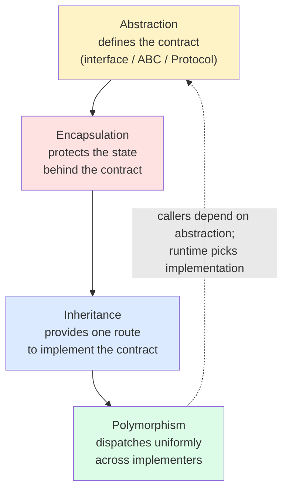
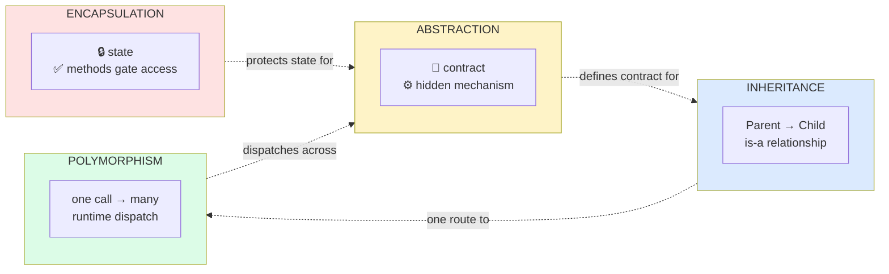
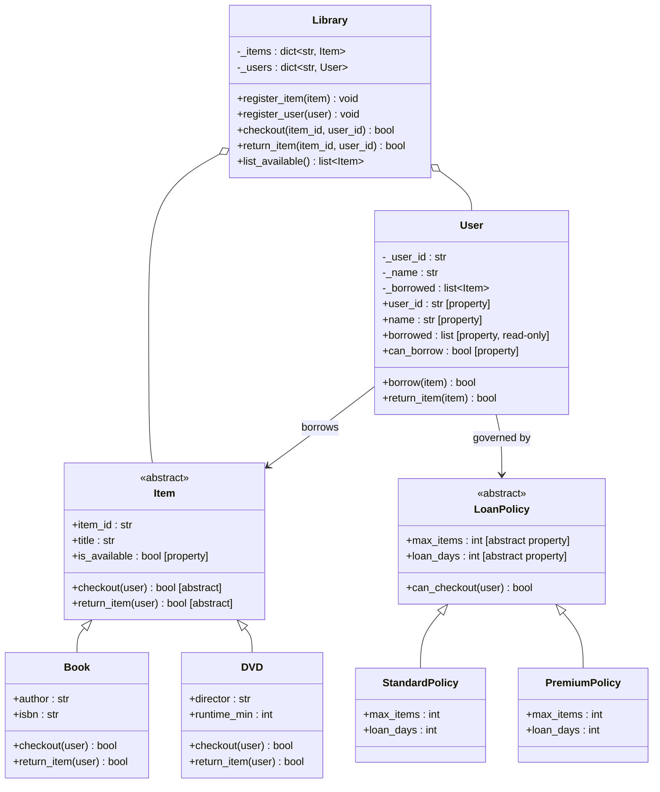
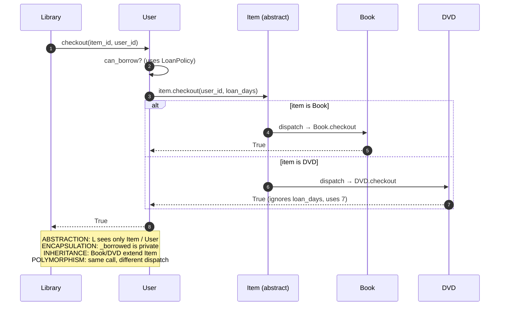
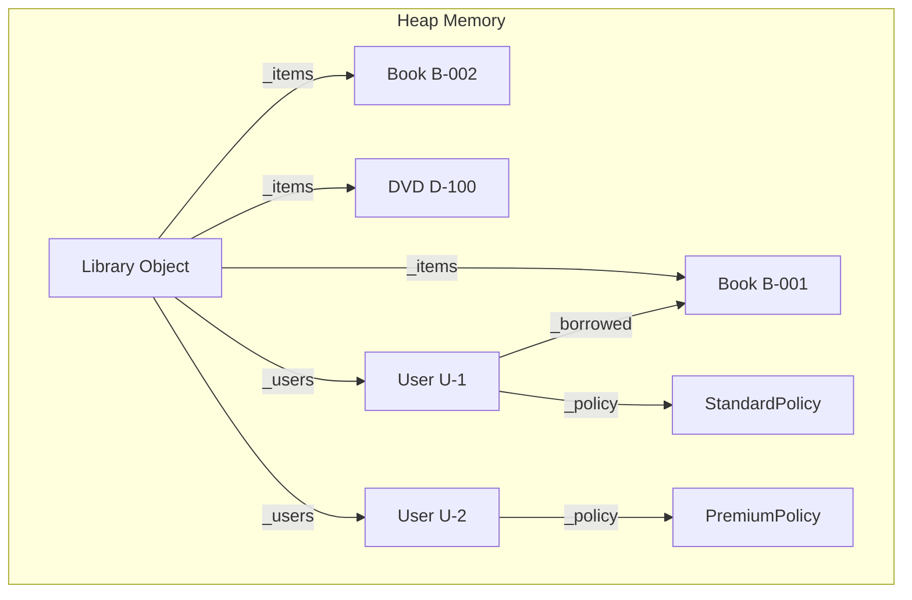
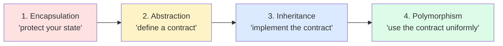

# The Four Pillars — Integrated Summary

> [!note] The whole picture in one place
> This note ties together [[encapsulation]], [[abstraction]], [[inheritance]], and [[polymorphism]] into a single mental model — then proves the integration with one runnable Python example that exercises all four pillars at once.

---

## 1. The Four Pillars at a Glance

| Pillar          | Core question it answers     | One-line definition                                                |
| --------------- | ---------------------------- | ----------------------------------------------------------------- |
| **Encapsulation** | How do I protect an object's state?         | Bundle data with the methods that operate on it; gate access.       |
| **Abstraction** | What should callers *see*?                 | Expose essential features; hide implementation complexity.          |
| **Inheritance** | How do I reuse and specialize code?        | Derive a new class from an existing one; express "is-a."            |
| **Polymorphism**| How do I treat different objects uniformly?| One interface, many forms — dispatch on the runtime type.           |

---

## 2. Master Mind-Map

```mermaid
mindmap
  root((OOP Four Pillars))
    Encapsulation
      bundle state + behavior
      control access
      Python tools
        _protected convention
        __private name mangling
        @property getter/setter
        @cached_property
      protects
        invariants
        internal representation
    Abstraction
      expose essentials
      hide mechanism
      Python tools
        abc.ABC + @abstractmethod
        typing.Protocol
        Template Method
      enables
        loose coupling
        testability
        plugin systems
    Inheritance
      is-a relationship
      code reuse + specialization
      types
        single
        multiple
        multilevel
        hierarchical
        hybrid
      mechanism
        MRO / C3 linearization
        super() cooperative
      pitfalls
        deep trees
        fragile base class
        Liskov violation
    Polymorphism
      one interface, many forms
      forms in Python
        duck typing
        ABC / Protocol dispatch
        dunder / operator overloading
      payoff
        open/closed principle
        strategy pattern
        plugin architectures
    How they fit
      Abstraction defines contract
      Encapsulation protects state behind contract
      Inheritance provides one route to implement contract
      Polymorphism dispatches uniformly across implementers
```

---

## 3. How the Pillars Work Together

The four pillars are not independent; they form a **stack**, each enabling the next.



### 3.1 The Layered Story

1. **[[abstraction]]** says *"here is the contract"* — the methods a caller may rely on, no more.
2. **[[encapsulation]]** says *"the state behind that contract is mine to manage; you may not touch it directly."*
3. **[[inheritance]]** says *"here is one way to produce an object that fulfills the contract: derive from an existing class."*
4. **[[polymorphism]]** says *"and because all such objects share the contract, I can treat them uniformly — the same call site works for any of them."*

Each pillar without the others is weakened:

- Abstraction without encapsulation is a contract with no enforcement.
- Encapsulation without abstraction is a sealed box with no interface.
- Inheritance without abstraction is just code-copying with extra coupling.
- Polymorphism without inheritance or duck typing has nothing to dispatch on.

---

## 4. Comparison Table

| Pillar          | Intent                                       | Mechanism                                   | Benefit                                              | Primary Python feature(s)                              |
| --------------- | -------------------------------------------- | ------------------------------------------- | ---------------------------------------------------- | ---------------------------------------------------- |
| **Encapsulation** | Protect invariants; hide state               | Private fields, accessors                   | Invariant safety; refactoring freedom               | `_x`, `__x`, `@property`, `@cached_property`         |
| **Abstraction** | Expose only essentials; hide complexity      | Abstract types, interfaces                  | Loose coupling; testability; plugin systems         | `abc.ABC`, `@abstractmethod`, `typing.Protocol`      |
| **Inheritance** | Reuse + specialize; express "is-a"           | Subclassing, MRO                            | Code reuse; hierarchical modeling; substitution    | `class Child(Parent)`, `super()`, `__mro__`          |
| **Polymorphism**| Treat different types uniformly              | Dynamic dispatch on method/operator         | Open/closed; strategy/plugin patterns               | Duck typing, dunder methods, `singledispatch`        |

### 4.1 A Single-Sentence Definition of Each

- **Encapsulation:** "Bundle state and behavior; control access so invariants hold."
- **Abstraction:** "Show the what, hide the how."
- **Inheritance:** "B is an A, plus maybe more or different."
- **Polymorphism:** "Same call, different behavior, depending on the object."

### 4.2 Quick Visual



---

## 5. Integrated Python Example — A Small Library Management System

This single example exercises **all four pillars**. Each pillar is annotated inline with comments so you can see exactly where and why it shows up.

### 5.1 Design Sketch



### 5.2 The Code

```python
from __future__ import annotations
from abc import ABC, abstractmethod
from dataclasses import dataclass, field
from datetime import datetime, timedelta
from typing import Optional, override, Self


# ───────────────────────────────────────────────────────────────────
# ABSTRACTION  ──  define contracts the rest of the system depends on
# ───────────────────────────────────────────────────────────────────

class Item(ABC):
    """Abstract base for anything that can be borrowed from the library.

    ABSTRACTION: callers depend on `checkout / return_item / is_available`,
    never on whatever concrete state Book or DVD stores internally.
    """

    def __init__(self, item_id: str, title: str) -> None:
        self.item_id = item_id
        self.title = title
        self._borrowed_by: Optional[str] = None    # ENCAPSULATION: private
        self._due_date: Optional[datetime] = None

    @property
    def is_available(self) -> bool:                 # ENCAPSULATION: read-only
        return self._borrowed_by is None

    @property
    def due_date(self) -> Optional[datetime]:
        return self._due_date

    @abstractmethod
    @override
    def checkout(self, user_id: str, loan_days: int) -> bool: ...

    @abstractmethod
    @override
    def return_item(self, user_id: str) -> bool: ...

    def __repr__(self) -> str:
        status = "available" if self.is_available else f"borrowed by {self._borrowed_by}"
        return f"<{type(self).__name__} {self.item_id}: {self.title!r} [{status}]>"


class LoanPolicy(ABC):
    """Abstract policy governing who can borrow how much for how long.

    ABSTRACTION + (later) POLYMORPHISM: a User can hold any LoanPolicy,
    and the Library doesn't need to know which one.
    """

    @property
    @abstractmethod
    @override
    def max_items(self) -> int: ...

    @property
    @abstractmethod
    @override
    def loan_days(self) -> int: ...

    def can_checkout(self, current_borrowed: int) -> bool:
        # Concrete method using abstract properties — Template Method
        return current_borrowed < self.max_items


# ───────────────────────────────────────────────────────────────────
# INHERITANCE  ──  implement the abstract contracts concretely
# ───────────────────────────────────────────────────────────────────

class Book(Item):
    """A concrete Item: a book. Inherits the protected state and adds
    book-specific data."""

    def __init__(self, item_id: str, title: str, author: str, isbn: str) -> None:
        super().__init__(item_id, title)            # INHERITANCE: reuse parent __init__
        self.author = author
        self.isbn = isbn

    # POLYMORPHISM: each Item subclass implements checkout its own way
    @override
    def checkout(self, user_id: str, loan_days: int) -> bool:
        if not self.is_available:
            return False
        self._borrowed_by = user_id
        self._due_date = datetime.now() + timedelta(days=loan_days)
        return True

    @override

    def return_item(self, user_id: str) -> bool:
        if self._borrowed_by != user_id:
            return False
        self._borrowed_by = None
        self._due_date = None
        return True


class DVD(Item):
    """Another concrete Item. Same interface, different policy:
    DVDs can't be renewed, etc. (Here kept simple.)"""

    def __init__(self, item_id: str, title: str, director: str, runtime_min: int) -> None:
        super().__init__(item_id, title)
        self.director = director
        self.runtime_min = runtime_min

    @override

    def checkout(self, user_id: str, loan_days: int) -> bool:
        # DVDs always check out for a fixed 7 days, ignoring the argument
        if not self.is_available:
            return False
        self._borrowed_by = user_id
        self._due_date = datetime.now() + timedelta(days=7)
        return True

    @override

    def return_item(self, user_id: str) -> bool:
        if self._borrowed_by != user_id:
            return False
        self._borrowed_by = None
        self._due_date = None
        return True


class StandardPolicy(LoanPolicy):
    @property
    @override
    def max_items(self) -> int: return 3
    @property
    @override
    def loan_days(self) -> int: return 14


class PremiumPolicy(LoanPolicy):
    @property
    @override
    def max_items(self) -> int: return 10
    @property
    @override
    def loan_days(self) -> int: return 30


# ───────────────────────────────────────────────────────────────────
# ENCAPSULATION  ──  User keeps its borrowed list private and validated
# ───────────────────────────────────────────────────────────────────

class User:
    """A library patron. State is private; access is via properties."""

    def __init__(self, user_id: str, name: str, policy: LoanPolicy) -> None:
        if not user_id or not name:
            raise ValueError("user_id and name are required")
        self._user_id = user_id
        self._name = name
        self._policy = policy
        self._borrowed: list[Item] = []

    # ── read-only properties ──
    @property
    def user_id(self) -> str: return self._user_id
    @property
    def name(self) -> str: return self._name
    @property
    def policy(self) -> LoanPolicy: return self._policy
    @property
    def borrowed(self) -> tuple[Item, ...]:        # ENCAPSULATION: copy out
        return tuple(self._borrowed)

    @property
    def can_borrow(self) -> bool:
        return self._policy.can_checkout(len(self._borrowed))

    def borrow(self, item: Item) -> bool:
        # Delegates to the polymorphic `checkout` on the Item
        if not self.can_borrow:
            return False
        if item.checkout(self._user_id, self._policy.loan_days):
            self._borrowed.append(item)
            return True
        return False

    def return_item(self, item: Item) -> bool:
        if item not in self._borrowed:
            return False
        if item.return_item(self._user_id):
            self._borrowed.remove(item)
            return True
        return False

    def __repr__(self) -> str:
        return f"<User {self._user_id}: {self._name!r}, borrowed={len(self._borrowed)}>"


# ───────────────────────────────────────────────────────────────────
# POLYMORPHISM  ──  the Library operates on the abstract types only
# ───────────────────────────────────────────────────────────────────

class Library:
    """The orchestrator. Knows about `Item` and `User`, not about Books,
    DVDs, StandardPolicy, PremiumPolicy, etc. — those are plugged in."""

    def __init__(self) -> None:
        self._items: dict[str, Item] = {}
        self._users: dict[str, User] = {}

    def register_item(self, item: Item) -> None:
        self._items[item.item_id] = item

    def register_user(self, user: User) -> None:
        self._users[user.user_id] = user

    def checkout(self, item_id: str, user_id: str) -> bool:
        item = self._items.get(item_id)
        user = self._users.get(user_id)
        if item is None or user is None:
            return False
        # POLYMORPHISM: user.borrow(item) → item.checkout(...) dispatches to
        # Book.checkout or DVD.checkout depending on the concrete type.
        return user.borrow(item)

    def return_item(self, item_id: str, user_id: str) -> bool:
        item = self._items.get(item_id)
        user = self._users.get(user_id)
        if item is None or user is None:
            return False
        return user.return_item(item)

    def list_available(self) -> list[Item]:
        # POLYMORPHISM: `is_available` works uniformly on any Item.
        return [item for item in self._items.values() if item.is_available]


# ───────────────────────────────────────────────────────────────────
# Demo: all four pillars, one script
# ───────────────────────────────────────────────────────────────────

def main() -> None:
    lib = Library()

    # INHERITANCE: Book and DVD both inherit from Item
    lib.register_item(Book("B-001", "The Pragmatic Programmer", "Hunt & Thomas", "978-0201616224"))
    lib.register_item(Book("B-002", "Clean Code", "Robert Martin", "978-0132350884"))
    lib.register_item(DVD("D-100", "The Matrix", "Wachowskis", 136))

    # ABSTRACTION: Library doesn't know which LoanPolicy each User has
    ada = User("U-1", "Ada Lovelace", StandardPolicy())
    alan = User("U-2", "Alan Turing", PremiumPolicy())
    lib.register_user(ada)
    lib.register_user(alan)

    # POLYMORPHISM: same checkout() call, different Item subclasses
    assert lib.checkout("B-001", "U-1")    # Ada borrows a Book
    assert lib.checkout("D-100", "U-2")    # Alan borrows a DVD (7-day rule!)

    # ENCAPSULATION: external code cannot corrupt private state
    # ada._borrowed.append("garbage")   # works only by reaching past encapsulation
    print("Ada's borrowed:", ada.borrowed)         # read-only copy ✅
    print("Available:", lib.list_available())

    # ABSTRACTION: policy swap is invisible to the Library
    ada._policy = PremiumPolicy()                   # upgrade Ada
    print("Ada can borrow more now:", ada.can_borrow)

    assert lib.return_item("B-001", "U-1")
    print("After return, available:", lib.list_available())


if __name__ == "__main__":
    main()
```

### 5.3 Tracing the Pillars Through the Example




### 5.5 Memory Allocation Diagram



### 5.4 Where Each Pillar Lives

| Pillar          | Where in the example                                                          |
| --------------- | ---------------------------------------------------------------------------- |
| **Encapsulation** | `Item._borrowed_by`, `User._borrowed`, read-only properties, validated `__init__` |
| **Abstraction** | `Item(ABC)`, `LoanPolicy(ABC)`, abstract methods, Template Method in `LoanPolicy.can_checkout` |
| **Inheritance** | `Book(Item)`, `DVD(Item)`, `StandardPolicy(LoanPolicy)`, `PremiumPolicy(LoanPolicy)` |
| **Polymorphism**| `lib.checkout()` → `user.borrow()` → `item.checkout()` dispatches to `Book` or `DVD` uniformly; `is_available` works on any `Item` |

---


### 5.6 Code Execution Trace

When `lib.checkout("B-001", "U-1")` is called:
1. `Library` looks up `"B-001"` in `_items` (gets `Book`) and `"U-1"` in `_users` (gets `User`).
2. `Library` calls `user.borrow(item)`.
3. `User` calls `self.can_borrow`, which calls `_policy.can_checkout(len(self._borrowed))`.
4. `StandardPolicy` returns `True` since `0 < 3`.
5. `User` calls `item.checkout(self._user_id, self._policy.loan_days)`.
6. Dynamic dispatch routes this to `Book.checkout("U-1", 14)`.
7. `Book` sets `_borrowed_by` and `_due_date`, then returns `True`.
8. `User` appends `item` to `_borrowed` and returns `True`.
9. `Library` receives `True` and returns it to the caller.

## 6. Real-World Design: How the Pillars Cooperate

### 6.1 Adding a New Item Type — Open/Closed

Want to add `Audiobook`? You write one new class:

```python
class Audiobook(Item):
    def __init__(self, item_id, title, narrator, duration_min):
        super().__init__(item_id, title)
        self.narrator = narrator
        self.duration_min = duration_min

    def checkout(self, user_id, loan_days):
        # Audiobooks "stream" — no fixed due date; always available
        if not self.is_available:
            return False
        self._borrowed_by = user_id
        self._due_date = datetime.now() + timedelta(days=loan_days)
        return True

    def return_item(self, user_id):
        if self._borrowed_by != user_id:
            return False
        self._borrowed_by = None
        self._due_date = None
        return True
```

`Library`, `User`, and `LoanPolicy` are **untouched**. This is the open/closed principle in action, made possible by **all four pillars working together**:

- **Abstraction** defined the `Item` contract.
- **Inheritance** gives you the boilerplate (`__init__`, `is_available`) for free.
- **Encapsulation** keeps the new class's state correct.
- **Polymorphism** means `Library.checkout` already knows how to handle `Audiobook`.

### 6.2 Adding a New Policy — Strategy

```python
class ChildPolicy(LoanPolicy):
    @property
    @override
    def max_items(self) -> int: return 2
    @property
    @override
    def loan_days(self) -> int: return 7
```

No changes anywhere else. Plug it into a `User` and the system adapts.

### 6.3 Testing — Abstraction Pays Off

Because the Library depends on abstract `Item`/`User`, you can drop in **fakes** for tests:

```python
class FakeItem(Item):
    def __init__(self, item_id="X", title="t"):
        super().__init__(item_id, title)
        self.checked_out = False
    def checkout(self, user_id, loan_days):
        if self.checked_out: return False
        self.checked_out = True
        return True
    def return_item(self, user_id):
        self.checked_out = False
        return True

def test_library_checkout_marks_item_unavailable():
    lib = Library()
    lib.register_item(FakeItem("X", "fake"))
    lib.register_user(User("U", "Test", StandardPolicy()))
    assert lib.checkout("X", "U") is True
    assert lib.list_available() == []
```

No real `Book`, no real `DVD`, no I/O — the test runs in microseconds.

---


### 6.4 Python 3.12+ Generics Example

With Python 3.12 (PEP 695), you can define generic classes elegantly. This is useful for building data structures like a `Stack` that enforce encapsulation and abstraction for any type `T`:

```python
class Stack[T]:
    def __init__(self) -> None:
        self._elements: list[T] = []

    def push(self, element: T) -> None:
        self._elements.append(element)

    def pop(self) -> T:
        return self._elements.pop()
```

## 7. Teaching Progression — In What Order to Teach the Pillars (and Why)

> [!tip] Recommended order
> 1. **Encapsulation** → 2. **Abstraction** → 3. **Inheritance** → 4. **Polymorphism**

### 7.1 Why This Order?



| Step | Pillar          | Why this order?                                                                                |
| ---- | --------------- | ---------------------------------------------------------------------------------------------- |
| 1    | Encapsulation   | Smallest, most concrete unit. Students can see invariants breaking and healing in one class.   |
| 2    | Abstraction     | Builds directly on encapsulation: now we hide *mechanism*, not just *state*.                   |
| 3    | Inheritance     | Now that contracts exist, inheritance is one way to fill them in. MRO and `super()` follow.    |
| 4    | Polymorphism    | The *payoff*. With contracts + implementations + dispatch, students finally see why bother.    |

### 7.2 Pedagogical Pitfalls to Avoid

> [!warning] Don't teach inheritance first
> The classic mistake is to teach `Animal → Dog → Cat` as the *first* OOP example. Students learn to overuse inheritance before they understand encapsulation or abstraction, then write deep hierarchies everywhere. Start with encapsulation (one class, real invariants), then abstraction (a contract), then inheritance (one way to implement), then polymorphism (the reward).

> [!warning] Don't conflate encapsulation with abstraction
> Pause and teach the distinction explicitly. See [[abstraction]] §2 for the canonical coffee-machine analogy.

> [!tip] Anchor each pillar with one invariant
> For each pillar, give students one *compelling* invariant it protects:
> - Encapsulation: "the bank balance can never go negative."
> - Abstraction: "any payment processor can be swapped without touching the checkout code."
> - Inheritance: "a `Manager` *is an* `Employee` and inherits its validation."
> - Polymorphism: "the `for s in shapes: s.area` loop never changes when you add a new shape."

### 7.3 A 4-Week Curriculum Sketch

| Week | Pillar          | Anchor example                            | Capstone exercise                       |
| ---- | --------------- | ---------------------------------------- | --------------------------------------- |
| 1    | Encapsulation   | `BankAccount` with protected balance     | `Temperature` with unit conversions     |
| 2    | Abstraction     | `Shape(ABC)` with `area`/`perimeter`     | `PaymentProcessor` plugin system        |
| 3    | Inheritance     | `Employee → Manager` with `super()`      | Cooperative diamond with `super()`      |
| 4    | Polymorphism    | `Vector` with operator overloading       | The integrated Library example (this file) |

---

## 8. Common Cross-Pillar Misconceptions

> [!danger] Misconceptions to actively debunk

### 8.1 "Inheritance is the main way to reuse code."

It's *one* way. Composition ("has-a") is usually better. See `04-advanced` (composition over inheritance). Inheritance is best for **subtyping** (is-a), not for **implementation sharing alone**.

### 8.2 "Abstraction requires abstract classes."

No — duck typing is abstraction. ABCs are *one* tool, not the definition.

### 8.3 "Private fields are secure."

In Python, `_x` and `__x` are conventions/mangling — not security. See [[encapsulation]] §3.3.

### 8.4 "Polymorphism requires inheritance."

No — Python's duck typing gives polymorphism without inheritance. See [[polymorphism]] §3.

### 8.5 "Encapsulation = data hiding."

Only one third of it. Encapsulation = **bundling + hiding + controlled access**. Miss any one and you've weakened the pillar.

---

## 9. Cross-Reference Map

| Pillar          | Definition file                  | Key Python tools                                         |
| --------------- | -------------------------------- | -------------------------------------------------------- |
| Encapsulation   | [[encapsulation]]                | `_x`, `__x`, `@property`, `@cached_property`            |
| Abstraction     | [[abstraction]]                  | `abc.ABC`, `@abstractmethod`, `typing.Protocol`         |
| Inheritance     | [[inheritance]]                  | `class Child(Parent)`, `super()`, `__mro__`             |
| Polymorphism    | [[polymorphism]]                 | Duck typing, dunders, `singledispatch`                  |

Related notes elsewhere in the vault:

- [[what-is-oop]] — the paradigm context
- [[core-concepts-overview]] — classes, objects, methods
- `04-advanced/` — SOLID, design patterns, composition over inheritance
- `06-teaching/` — full learning path, common pitfalls, real-world examples

---

## 10. Key Takeaways (Integrated)

1. **The four pillars are a stack, not a list.** Abstraction defines contracts; encapsulation protects state behind them; inheritance provides one route to implement them; polymorphism lets callers treat all implementations uniformly.
2. **Each pillar enables the next.** Teaching them out of order (e.g., inheritance before encapsulation) produces students who reach for the wrong tool.
3. **Python's flavor of each pillar is unique.** Conventions over enforcement (`_x`), duck typing over nominal subtyping, MRO over single-inheritance languages' restrictions.
4. **Real designs use all four at once.** The Library example in §5 exercises all four pillars in a few hundred lines; adding a new item type or policy touches exactly one class.
5. **The pillars exist to serve maintainability, not purity.** Use them when they reduce coupling and protect invariants; skip them when they add ceremony without payoff.
6. **Composition is the fifth, secret pillar.** In production code, "has-a" often beats "is-a." See `04-advanced/`.
7. **Open/closed is the practical goal.** Code that is open for extension (new types plug in) and closed for modification (existing code untouched) is the dividend of well-applied pillars.
8. **Teach encapsulation first, polymorphism last.** That's the order in which they make sense — and the order in which they pay off.

---


## 11. Practice Exercises (Integrated)

> [!example] Capstone exercises that span all four pillars

### Medium
1. **Extend the Library.** Add a `Magazine(Item)` subclass that can only be borrowed for 3 days. Add a `LateFeePolicy` that, when attached to a `User`, computes fees for overdue items. Run the demo and verify nothing else in `Library` changes.
   *Problem Statement:* Magazines cannot be renewed and are strictly for 3 days.
   *Template:*
   ```python
   class Magazine(Item):
       def __init__(self, item_id: str, title: str, issue_number: int) -> None:
           super().__init__(item_id, title)
           self.issue_number = issue_number
           
       @override
       def checkout(self, user_id: str, loan_days: int) -> bool:
           # Your code here
           pass
           
       @override
       def return_item(self, user_id: str) -> bool:
           # Your code here
           pass
   ```

2. **Pillar audit.** Take any 200-line class from your own codebase or the stdlib (e.g., `collections.OrderedDict`). Identify one example of each pillar in action. Write a short paragraph on which pillar is weakest and why.

### Hard
3. **Build a tiny event system.** Design an `EventBus` that demonstrates all four pillars:
   *Template:*
   ```python
   class Subscriber(ABC):
       @abstractmethod
       def handle(self, event: str) -> None: ...

   class LogSubscriber(Subscriber):
       @override
       def handle(self, event: str) -> None:
           print(f"Logging: {event}")
           
   class EventBus:
       def __init__(self) -> None:
           self._subscribers: list[Subscriber] = []
           
       def subscribe(self, subscriber: Subscriber) -> Self:
           self._subscribers.append(subscriber)
           return self
           
       def publish(self, event: str) -> None:
           for sub in self._subscribers:
               sub.handle(event)
   ```

4. **Refactor a procedural script.** Take a 100-line procedural Python script. Refactor it into a small class hierarchy using all 4 pillars.

5. **Liskov audit.** Take the integrated Library example. Imagine adding a `ReferenceOnly(Item)` subclass. Discuss: is this a Liskov violation?

---

You now have the integrated view. Each individual pillar is explored in depth in its own note:

- [[encapsulation]]
- [[abstraction]]
- [[inheritance]]
- [[polymorphism]]

Return to [[what-is-oop]] or [[core-concepts-overview]] for the broader context, or proceed to `03-python-mechanics/` for the language-level details.
