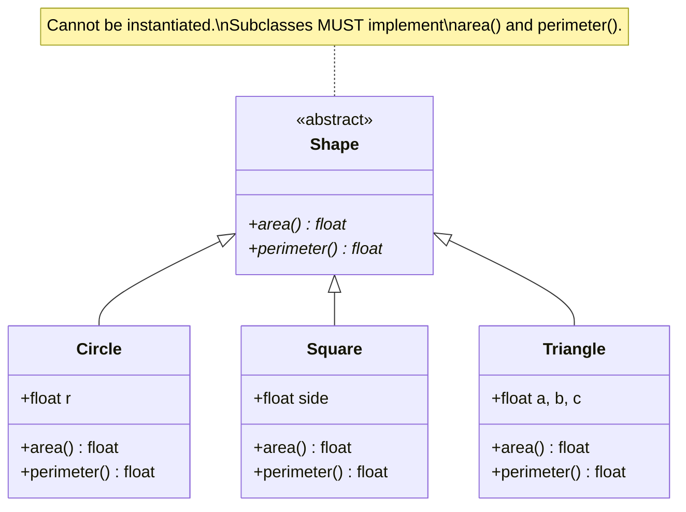
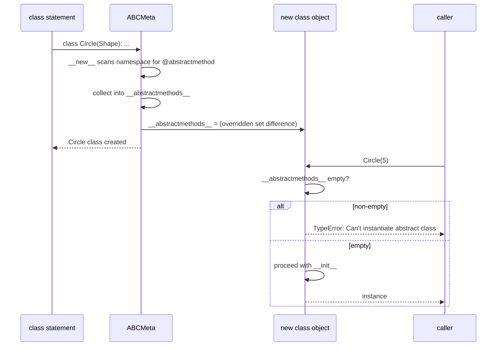
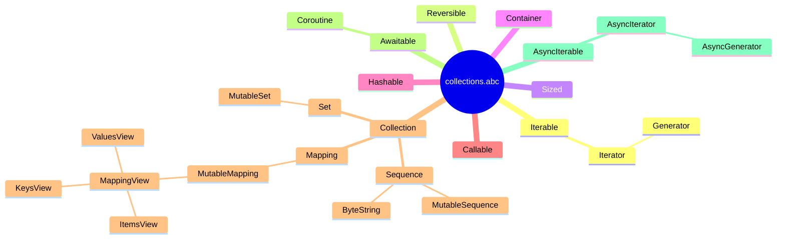
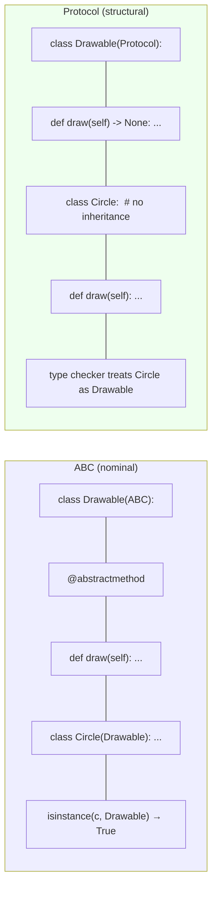

# Abstract Base Classes — Enforcing Interfaces in Python

#python #abc #interfaces #abstraction #teaching #deep-dive

> [!quote] ABC PEP 3119
> "ABCs provide a way to define interfaces in Python, in a way that is more expressive and powerful than just using `isinstance` checks."

An **Abstract Base Class (ABC)** is a class that cannot be instantiated directly and that declares one or more **abstract methods** that subclasses must implement. ABCs let you express "any object that has these methods" as a type — Python's answer to Java's `interface` and C++'s pure virtual functions, but with Python's characteristic flexibility (including "virtual subclassing"!).

This note covers the `abc` module, the metaclass behind it (`ABCMeta`), abstract methods with implementations, virtual subclasses, the `collections.abc` hierarchy, and how ABCs compare to `typing.Protocol`.

Prerequisites: [[Abstraction]], [[Metaclasses]], [[Polymorphism]], [[Magic-Methods]].

---

## 1. Why ABCs?

Python is dynamically typed — you can call `obj.draw()` on anything that has a `draw` method, no interface declaration needed ("duck typing"). But duck typing has gaps:

- **No documentation of intent.** There's no place to say "every Shape must implement `area` and `perimeter`."
- **No early failure.** If you forget to implement `area`, you find out at runtime, possibly far from the bug.
- **No `isinstance` support.** Duck typing can't tell you "is this thing *some kind of* Sequence?" without trying operations.

ABCs fill these gaps:

```python
from abc import ABC, abstractmethod

class Shape(ABC):
    @abstractmethod
    def area(self) -> float: ...
    @abstractmethod
    def perimeter(self) -> float: ...

# Shape()          # TypeError: Can't instantiate abstract class Shape with abstract methods area, perimeter

class Circle(Shape):
    def __init__(self, r): self.r = r
    def area(self):        return 3.14159 * self.r ** 2
    def perimeter(self):   return 2 * 3.14159 * self.r

c = Circle(5)             # OK — abstract methods implemented
print(isinstance(c, Shape))   # True
```

The base class declares the interface; subclasses implement it; Python blocks instantiation of any class that still has unimplemented abstract methods.



> [!tip] Teaching Tip
> Tell students: "An ABC is a *contract*. You can't buy a Shape — you can only buy a Circle, Square, or Triangle. But every Circle *is a* Shape." The "you can't buy a Shape" line is a memorable handle for "ABCs can't be instantiated."

---

## 2. The `abc` Module

| Name | Purpose |
|---|---|
| `ABC` | Convenience base class. Equivalent to `metaclass=ABCMeta`. |
| `ABCMeta` | The metaclass that powers ABCs. Use this when you need a custom metaclass that's also an ABC. |
| `@abstractmethod` | Marks a method as abstract. Subclasses must override it. |
| `@abstractproperty` | Deprecated — use `@property` + `@abstractmethod` instead. |
| `@abstractclassmethod` | Deprecated — use `@classmethod` + `@abstractmethod`. |
| `@abstractstaticmethod` | Deprecated — use `@staticmethod` + `@abstractmethod`. |
| `ABC.register(cls)` | Register `cls` as a *virtual* subclass (no inheritance required). |
| `ABCMeta.__subclasshook__` | Customize `issubclass` for "structural" checks. |

### 2.1 The Two Ways to Make an ABC

```python
# Way 1: inherit from ABC (simple, common)
class MyABC(ABC):
    @abstractmethod
    def do(self): ...

# Way 2: use ABCMeta as the metaclass (when you need metaclass customization)
from abc import ABCMeta
class MyABC(metaclass=ABCMeta):
    @abstractmethod
    def do(self): ...
```

Both are equivalent in behavior. Use `ABC` unless you're mixing with another metaclass.

---

## 3. How ABCs Actually Work

The magic is in `ABCMeta` (which is itself a subclass of `type`):

1. When a class with `metaclass=ABCMeta` is created, the metaclass scans the namespace for methods marked `@abstractmethod` and collects them into the class's `__abstractmethods__` set.
2. The set is **inherited** — subclasses inherit any abstract methods they haven't overridden.
3. `ABCMeta.__call__` (which runs when you do `MyClass(...)`) checks `__abstractmethods__`. If non-empty, it raises `TypeError: Can't instantiate abstract class ... with abstract methods ...`.



You can inspect `__abstractmethods__` directly:

```python
print(Shape.__abstractmethods__)      # frozenset({'area', 'perimeter'})
print(Circle.__abstractmethods__)     # frozenset() — all implemented
```

---

## 4. Abstract Methods Can Have Implementations

Unlike Java's pure interfaces, an abstract method in Python can have a body. The body provides a **default implementation** that subclasses can call via `super()`:

```python
class Logger(ABC):
    @abstractmethod
    def emit(self, message: str) -> None:
        """Subclasses must override, but can call super().emit() for prefix."""
        print(f"[{self.__class__.__name__}] ", end="")

class ConsoleLogger(Logger):
    def emit(self, message: str) -> None:
        super().emit(message)        # default behavior
        print(message)

class FileLogger(Logger):
    def __init__(self, path): self.path = path
    def emit(self, message: str) -> None:
        with open(self.path, "a") as f:
            f.write(message + "\n")  # doesn't call super — full override

ConsoleLogger().emit("hello")        # [ConsoleLogger] hello
```

This is great for "template method"-style abstractions where the base provides common scaffolding and subclasses fill in the gaps.

> [!warning] Common Student Misconception
> "If an abstract method has a body, can I instantiate the class?" No. `@abstractmethod` says *subclasses must override* — whether or not the base provides a body is irrelevant. The body is just a convenience for subclasses.

---

## 5. Abstract Properties, ClassMethods, StaticMethods

Stack `@property` (or `@classmethod` / `@staticmethod`) on top of `@abstractmethod`:

```python
from abc import ABC, abstractmethod

class Plugin(ABC):
    @property
    @abstractmethod
    def name(self) -> str: ...

    @property
    @abstractmethod
    def version(self) -> str: ...

    @classmethod
    @abstractmethod
    def from_config(cls, config: dict) -> "Plugin": ...

    @staticmethod
    @abstractmethod
    def default_config() -> dict: ...

class GreetPlugin(Plugin):
    @property
    def name(self):    return "greet"
    @property
    def version(self): return "1.0.0"
    @classmethod
    def from_config(cls, config): return cls()
    @staticmethod
    def default_config(): return {"greeting": "Hello"}

p = GreetPlugin()
print(p.name)                  # greet
print(GreetPlugin.default_config())   # {'greeting': 'Hello'}
```

> [!warning] Decorator Order Matters
> `@property` must be the **outermost** decorator (applied last), so the result is a property object — `@abstractmethod` is applied to the function *before* `@property` wraps it. Reverse the order and the property won't be recognized as abstract. Use `@property` then `@abstractmethod` (top to bottom).

---

## 6. Virtual Subclasses — `register()`

ABCs support **virtual subclassing**: a class can be registered as a subclass of an ABC *without inheriting from it*. `isinstance` and `issubclass` then return `True`, but no methods are inherited.

```python
class MyListLike:
    def __getitem__(self, i): return ...
    def __len__(self): return ...

# Register — no inheritance!
from collections.abc import Sequence
Sequence.register(MyListLike)

print(issubclass(MyListLike, Sequence))   # True
print(isinstance(MyListLike(), Sequence)) # True
```

This is how built-in types like `list`, `tuple`, `str`, and `bytes` are registered as virtual subclasses of `collections.abc.Sequence`, `MutableSequence`, etc. — without those built-ins inheriting from the ABC (which would be impossible for C-level types).

### 6.1 `__subclasshook__` — Structural ABCs

For *fully* structural checks ("anything with a `__len__` is a Sized"), implement `__subclasshook__` on the ABC:

```python
from abc import ABCMeta

class Sized(metaclass=ABCMeta):
    @abstractmethod
    def __len__(self): ...

    @classmethod
    def __subclasshook__(cls, subclass):
        if cls is Sized:
            return hasattr(subclass, "__len__") and not inspect.isabstract(subclass.__len__)
        return NotImplemented

# Now anything with __len__ is "a Sized", no registration needed
class MyContainer:
    def __len__(self): return 42

print(isinstance(MyContainer(), Sized))   # True
```

This is how `collections.abc` types like `Iterable`, `Sized`, and `Container` work — they duck-type at the `isinstance` level.

---

## 7. The `collections.abc` Module

Python ships with a rich hierarchy of ABCs for collection-like objects:



| ABC | Required methods | Free methods |
|---|---|---|
| `Iterable` | `__iter__` | — |
| `Iterator` | `__next__` | `__iter__` (returns self) |
| `Generator` | `send`, `throw` | `__iter__`, `__next__`, `close` |
| `Sized` | `__len__` | — |
| `Container` | `__contains__` | — |
| `Collection` | `__iter__`, `__len__`, `__contains__` | — |
| `Sequence` | `__getitem__`, `__len__` | `__contains__`, `__iter__`, `__reversed__`, `index`, `count` |
| `MutableSequence` | Sequence + `__setitem__`, `__delitem__`, `insert` | `append`, `extend`, `pop`, `remove`, etc. |
| `Mapping` | `__getitem__`, `__len__`, `__iter__` | `__contains__`, `keys`, `values`, `items`, `get` |
| `MutableMapping` | Mapping + `__setitem__`, `__delitem__` | `pop`, `popitem`, `clear`, `update`, `setdefault` |
| `Set` | Collection + `__le__`, `__lt__`, `__eq__`, etc. | Set operators |
| `Hashable` | `__hash__` | — |

Inheriting from a `collections.abc` class gives you the "free" mixin methods for free — implement only the abstract ones.

### 7.1 Building a Custom Sequence

```python
from collections.abc import Sequence

class Range(Sequence):
    def __init__(self, start, stop, step=1):
        self.start, self.stop, self.step = start, stop, step
    def __len__(self):
        return max(0, (self.stop - self.start + self.step - 1) // self.step)
    def __getitem__(self, i):
        if isinstance(i, slice):
            return Range(self.start + i.start * self.step,
                         self.start + i.stop * self.step, self.step)
        if i < 0: i += len(self)
        if 0 <= i < len(self):
            return self.start + i * self.step
        raise IndexError(i)

r = Range(0, 10, 2)
print(len(r))         # 5
print(r[2])           # 4
print(6 in r)         # True (free __contains__!)
print(list(r))        # [0, 2, 4, 6, 8]
print(r.index(4))     # 2 (free index!)
```

The ABC gave us `__contains__`, `__iter__`, `index`, `count`, and `__reversed__` for free — all derived from `__getitem__` and `__len__`.

---

## 8. Three Realistic Examples

### 8.1 Shape ABC

```python
from abc import ABC, abstractmethod
from math import pi

class Shape(ABC):
    @abstractmethod
    def area(self) -> float: ...
    @abstractmethod
    def perimeter(self) -> float: ...

    def describe(self) -> str:
        return f"{type(self).__name__}: area={self.area():.2f}, perimeter={self.perimeter():.2f}"

class Circle(Shape):
    def __init__(self, r): self.r = r
    def area(self):      return pi * self.r ** 2
    def perimeter(self): return 2 * pi * self.r

class Rectangle(Shape):
    def __init__(self, w, h): self.w, self.h = w, h
    def area(self):      return self.w * self.h
    def perimeter(self): return 2 * (self.w + self.h)

for s in [Circle(3), Rectangle(2, 5)]:
    print(s.describe())
```

The base `Shape` provides a *concrete* `describe` method that uses the abstract `area` and `perimeter`. This is the **template method** pattern: the base defines the algorithm skeleton; subclasses fill in the steps.

### 8.2 Repository ABC (Dependency Inversion)

```python
from abc import ABC, abstractmethod
from typing import TypeVar, Generic, Optional

T = TypeVar("T")

class Repository(ABC, Generic[T]):
    @abstractmethod
    def get(self, id: int) -> Optional[T]: ...
    @abstractmethod
    def add(self, entity: T) -> int: ...
    @abstractmethod
    def update(self, entity: T) -> None: ...
    @abstractmethod
    def delete(self, id: int) -> None: ...

class InMemoryUserRepo(Repository[User]):
    def __init__(self): self._data = {}; self._next_id = 1
    def get(self, id): return self._data.get(id)
    def add(self, user):
        uid = self._next_id; self._next_id += 1
        self._data[uid] = user; return uid
    def update(self, user): ...   # omitted
    def delete(self, id): self._data.pop(id, None)
```

See [[Dependency-Inversion]] — depend on the abstract Repository, not the concrete InMemoryUserRepo.

### 8.3 Plugin ABC

```python
class Plugin(ABC):
    @property
    @abstractmethod
    def name(self) -> str: ...

    @abstractmethod
    def run(self, ctx: dict) -> dict: ...

    @classmethod
    @abstractmethod
    def from_config(cls, cfg: dict) -> "Plugin": ...

class HelloWorldPlugin(Plugin):
    @property
    def name(self): return "hello"
    def run(self, ctx): return {"message": f"Hello, {ctx.get('user', 'world')}!"}
    @classmethod
    def from_config(cls, cfg): return cls()
```

### 8.4 Observer ABC

```python
from abc import ABC, abstractmethod

class Observer(ABC):
    @abstractmethod
    def update(self, event: dict) -> None: ...

class Subject:
    def __init__(self):
        self._observers: list[Observer] = []
    def subscribe(self, obs: Observer) -> None:
        self._observers.append(obs)
    def notify(self, event: dict) -> None:
        for obs in self._observers:
            obs.update(event)

class Logger(Observer):
    def update(self, event): print(f"[LOG] {event}")

class Emailer(Observer):
    def update(self, event): print(f"[EMAIL] about {event}")

s = Subject()
s.subscribe(Logger())
s.subscribe(Emailer())
s.notify({"type": "user_signup", "user": "alice"})
# [LOG] {'type': 'user_signup', 'user': 'alice'}
# [EMAIL] about {'type': 'user_signup', 'user': 'alice'}
```

The `Observer` ABC documents the contract: any object that wants to subscribe to a `Subject` must implement `update(event)`. Subscribers don't have to inherit from `Observer` if you'd rather use a Protocol — but the ABC makes the relationship explicit and gives you `isinstance` checks for free.

---

## 9. ABCs vs Protocols (Structural Typing)

Python 3.8 introduced `typing.Protocol`, which gives you "duck typing that the type checker can see" — see [[Type-Hints-And-OOP]] for the full story. The two approaches address overlapping but distinct needs: ABCs enforce nominal subtyping (you must inherit to be a subclass), while Protocols express structural typing (you just need to have the right methods). Choosing between them is one of the most common design decisions in modern Python code.



| Aspect | ABC | Protocol |
|---|---|---|
| **Typing style** | Nominal (subclass must inherit) | Structural (just have the methods) |
| **Runtime `isinstance`** | Yes | Only with `@runtime_checkable` |
| **Forces inheritance** | Yes | No |
| **Default method bodies** | Yes (template method) | No (just a signature) |
| **Use when** | You want to share code + enforce interface | You want to express "anything shaped like X" without coupling |
| **Example** | `collections.abc.Sequence` | `typing.Iterable` |

> [!tip] Teaching Tip
> "Use ABCs when you have a *family* of related classes and want to share code. Use Protocols when you want to declare the shape of something across unrelated code you don't control." That's the rule of thumb.

---

## 10. Common Pitfalls

### 10.1 Forgetting `@abstractmethod`

```python
class BadABC(ABC):
    def must_implement(self): ...      # no @abstractmethod → NOT abstract!
# Anyone can instantiate BadABC subclasses that don't override.
```

The decorator is *required* — otherwise it's just a regular method that returns `None`.

### 10.2 ABCs Don't Validate Method *Bodies*

An ABC only checks that the method name exists. A subclass that defines `def area(self): pass` satisfies the ABC even though it returns `None`. If you need *behavioral* validation, write tests or use `attrs`/Pydantic validators.

### 10.3 Multiple Inheritance of ABCs

```python
class A(ABC):
    @abstractmethod
    def foo(self): ...
class B(ABC):
    @abstractmethod
    def bar(self): ...
class C(A, B):
    def foo(self): ...
    def bar(self): ...
```

This works fine — `C.__abstractmethods__` is the union of inherited abstract methods minus those overridden. But if two ABCs both declare `foo` as abstract with *different* signatures, you're on your own — Python doesn't check.

### 10.4 `__init__` on ABCs

You can define `__init__` on an ABC. It runs when a concrete subclass is instantiated. Useful for setting common state — but be careful: it runs *before* the subclass's `__init__` (unless the subclass calls `super().__init__()` explicitly).

---

## 11. Best Practices

1. **Inherit from `ABC`** (or `collections.abc.X`) directly — don't bother with `metaclass=ABCMeta` unless you need a custom metaclass.
2. **Mark every required method with `@abstractmethod`.** No decorator = not abstract.
3. **Provide default implementations** in abstract methods when sensible — enables template-method patterns.
4. **Use `collections.abc` types** instead of rolling your own `Iterable`, `Sequence`, etc.
5. **Register virtual subclasses** (`register()`) when integrating with types you don't control (built-ins, third-party).
6. **Prefer Protocols** for purely structural typing — see [[Type-Hints-And-OOP]].
7. **Don't over-abstract.** A single concrete class that does the job is better than a premature ABC hierarchy. See [[Interface-Segregation]].
8. **Document the contract** in the abstract method's docstring — what does the method promise? What can callers rely on?

> [!success] Final Teaching Tip
> Have students build a small plugin system: an ABC `Plugin` with abstract `name`, `run`, and `from_config`, then three concrete plugins and a `PluginRegistry` that loads them. The exercise shows them how ABCs make polymorphism explicit — and how `@abstractmethod` *prevents* the bug of "I forgot to implement `run`" at instantiation, not at call time.

---

## See Also

- [[Abstraction]] — the conceptual pillar; ABCs are Python's primary tool for it.
- [[Polymorphism]] — ABCs make polymorphism explicit and enforced.
- [[Metaclasses]] — `ABCMeta` is the canonical "useful metaclass".
- [[Type-Hints-And-OOP]] — Protocols, `@final`, `@override`.
- [[Dependency-Inversion]] — depend on ABCs, not concrete classes.
- [[Interface-Segregation]] — keep ABCs small and focused.

## Appendix A: ABCs in the Standard Library

Beyond `collections.abc`, Python ships ABCs in several modules:

| Module | Notable ABCs |
|---|---|
| `collections.abc` | `Iterable`, `Iterator`, `Sequence`, `Mapping`, `Set`, `Container`, `Hashable`, `Callable`, `Awaitable`, `Coroutine`, `AsyncIterable` |
| `numbers` | `Number`, `Complex`, `Real`, `Rational`, `Integral` |
| `io` | `IOBase`, `RawIOBase`, `BufferedIOBase`, `TextIOBase` |
| `asyncio` | reuses `collections.abc` async ABCs; `Future`-like protocols |

### A.1 The `numbers` Hierarchy

```python
from numbers import Number, Complex, Real, Rational, Integral

# Integral is a subclass of Rational is a subclass of Real
# is a subclass of Complex is a subclass of Number.
# int is registered as Integral; float as Real; complex as Complex.
print(isinstance(42, Integral))    # True
print(isinstance(3.14, Real))      # True
print(isinstance(1+2j, Complex))   # True
```

This hierarchy lets you write `def f(x: Real) -> Real:` to mean "any real number — int, float, Decimal, Fraction, etc." — much richer than `float`.

### A.2 The `io` Hierarchy

```python
from io import IOBase, TextIOBase, BufferedIOBase

# Built-in file objects are instances of TextIOBase or BufferedIOBase
# Both are subclasses of IOBase, which defines the common close()/seek()/tell() API.

# Want to type-hint "anything file-like for text I/O"?
def process(f: TextIOBase) -> None:
    for line in f:
        ...
```

## Appendix B: A Larger Worked Example — A Payment Processor

```python
from abc import ABC, abstractmethod
from dataclasses import dataclass
from typing import Optional

class PaymentMethod(ABC):
    @property
    @abstractmethod
    def name(self) -> str: ...

    @abstractmethod
    def authorize(self, amount: float) -> bool: ...

    @abstractmethod
    def capture(self, amount: float) -> str: ...    # returns transaction ID

    @abstractmethod
    def refund(self, tx_id: str) -> bool: ...

class CreditCard(PaymentMethod):
    def __init__(self, number: str, exp: str, cvv: str):
        self.number, self.exp, self.cvv = number, exp, cvv
    @property
    def name(self) -> str: return "credit_card"
    def authorize(self, amount: float) -> bool:
        # pretend to call a payment gateway
        return amount < 1000
    def capture(self, amount: float) -> str:
        return f"cc-{self.number[-4:]}-{amount}"
    def refund(self, tx_id: str) -> bool:
        return True

class BankTransfer(PaymentMethod):
    @property
    def name(self) -> str: return "bank_transfer"
    def authorize(self, amount: float) -> bool:
        return True   # bank transfers are pre-authorized
    def capture(self, amount: float) -> str:
        return f"bt-{amount}"
    def refund(self, tx_id: str) -> bool:
        # bank transfers can't be reversed instantly
        return False

@dataclass
class PaymentResult:
    success: bool
    tx_id: Optional[str] = None
    error: Optional[str] = None

class PaymentProcessor:
    def charge(self, method: PaymentMethod, amount: float) -> PaymentResult:
        if not method.authorize(amount):
            return PaymentResult(False, error="authorization failed")
        tx_id = method.capture(amount)
        return PaymentResult(True, tx_id=tx_id)

processor = PaymentProcessor()
print(processor.charge(CreditCard("1234567890123456", "12/25", "123"), 99.99))
# PaymentResult(success=True, tx_id='cc-3456-99.99', error=None)
print(processor.charge(BankTransfer(), 250.00))
# PaymentResult(success=True, tx_id='bt-250.0', error=None)
```

The processor depends on the **abstract** `PaymentMethod`, not on `CreditCard` or `BankTransfer` concretely. Adding a new payment method (PayPal, Apple Pay, crypto) doesn't require touching the processor — classic dependency inversion.

## Appendix C: ABCs and `isinstance` Performance

`isinstance(x, SomeABC)` is fast for ordinary ABCs (single dict lookup on `type(x).__mro__`). But for ABCs that use `__subclasshook__` (like `collections.abc.Iterable`), the check can be slower because it introspects attributes. Avoid putting `isinstance(x, Iterable)` in tight inner loops; prefer `try: iter(x)` if performance matters.

## Appendix D: Common Pitfalls — Summary

| Pitfall | Symptom | Fix |
|---|---|---|
| Forgot `@abstractmethod` | Subclass instantiable without overriding | Always decorate required methods |
| Wrong decorator order on `@property` | Property not recognized as abstract | `@property` outermost, `@abstractmethod` inner |
| Multiple inheritance of conflicting ABCs | MRO conflicts | Carefully design the hierarchy |
| `__subclasshook__` too permissive | `isinstance` lies | Restrict to checking the right attributes |
| ABC with concrete `__init__` that doesn't call super | Subclass `__init__` doesn't get base setup | Use `super().__init__(...)` |
| Overusing ABCs for trivial interfaces | Brittle, hard to extend | Prefer Protocols for structural cases |
| Treating ABC as interface AND implementation | Coupling grows | Split into ABC (interface) + Mixin (implementation) |

> [!success] Final Teaching Tip
> Have students build a small plugin system: an ABC `Plugin` with abstract `name`, `run`, and `from_config`, then three concrete plugins and a `PluginRegistry` that loads them. The exercise shows them how ABCs make polymorphism explicit — and how `@abstractmethod` *prevents* the bug of "I forgot to implement `run`" at instantiation, not at call time.

## References

- PEP 3119 — Introducing Abstract Base Classes
- `abc` module documentation
- `collections.abc` module documentation
- "Fluent Python" (Ramalho), Chapter 13 — "Interfaces, Protocols, and ABCs"
- PEP 544 — Protocols (structural subtyping)
