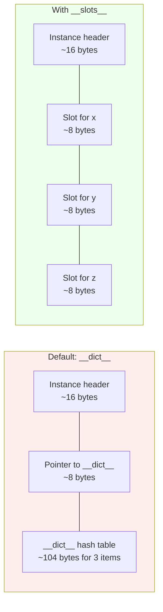
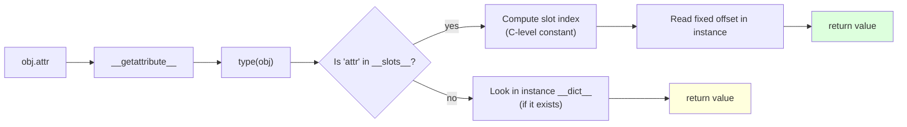
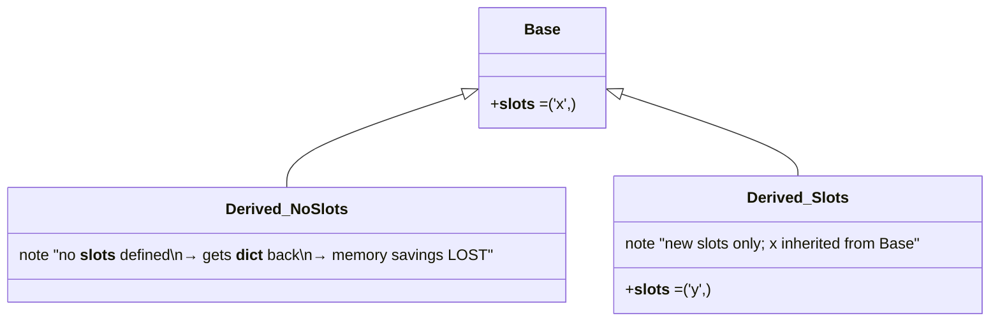
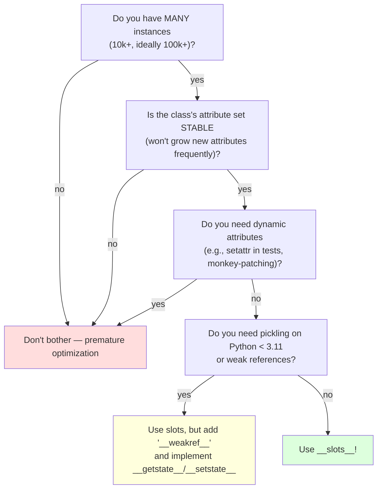
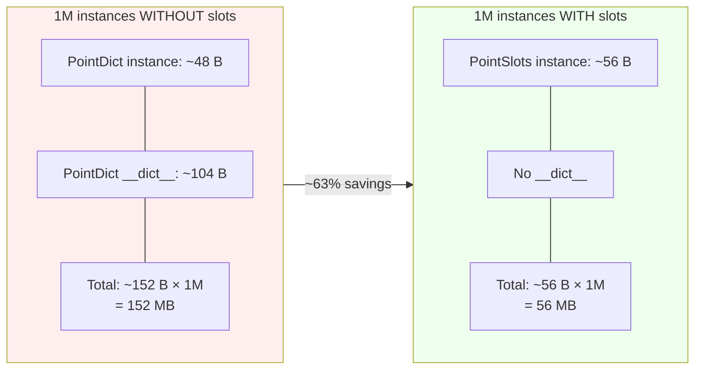
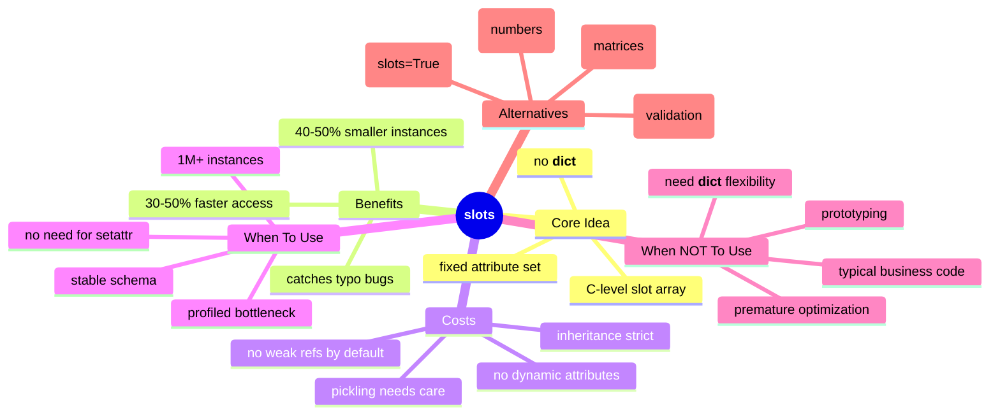

# `__slots__` and Memory — Optimizing Instance Footprint

#python #slots #memory #performance #teaching #deep-dive

> [!quote] Premature Optimization Warning
> "Programmers waste enormous amounts of time thinking about, or worrying about, the speed of noncritical parts of their programs." — Donald Knuth

By default, every Python instance carries a `__dict__` — a hash table mapping attribute names to values. This is what makes Python flexible: you can add new attributes to an instance at any time. But that flexibility costs memory (the dict itself + the hash table overhead) and a small amount of attribute-access speed.

`__slots__` lets you opt out. By declaring a fixed set of attribute names on a class, you tell Python: "these instances will never need a `__dict__` — store attributes in a fixed-size array instead." The result: ~40-50% smaller instances and noticeably faster attribute access for classes with many instances.

This note covers how `__slots__` works, when to use it, when *not* to, and how it interacts with inheritance, dataclasses, and pickling.

Prerequisites: [[Classes-And-Objects]], [[Attributes-And-Properties]], [[Dataclasses]].

---

## 1. The Default: Every Instance Has a `__dict__`

```python
class Point:
    def __init__(self, x, y):
        self.x = x
        self.y = y

p = Point(1, 2)
print(p.__dict__)       # {'x': 1, 'y': 2}
p.z = 3                 # adding a NEW attribute — works!
print(p.__dict__)       # {'x': 1, 'y': 2, 'z': 3}
```

Each `Point` instance holds a `dict` that stores `x`, `y`, and any other attributes you add later. This dict is **the** source of Python's flexibility — and its memory overhead.

### 1.1 Measuring Memory

```python
import sys

class PointDict:
    def __init__(self, x, y):
        self.x = x
        self.y = y

class PointSlots:
    __slots__ = ("x", "y")
    def __init__(self, x, y):
        self.x = x
        self.y = y

pd = PointDict(1, 2)
ps = PointSlots(1, 2)

print(sys.getsizeof(pd))            # ~48 bytes (the dict)
print(sys.getsizeof(pd.__dict__))   # ~104 bytes (dict storage)
print(sys.getsizeof(ps))            # ~40 bytes (no dict!)
```

> [!note] `sys.getsizeof` Only Counts the Object Itself
> It doesn't recursively include referenced objects. So `getsizeof(pd)` shows ~48 bytes (the `PointDict` instance object header), but the *real* cost is `pd` + `pd.__dict__` ≈ 152 bytes. The slots version is ~40 bytes total. The savings grow with the number of attributes.

### 1.2 Why Slots Are Smaller



With `__dict__`: every instance pays for the hash table itself (~64-104 bytes minimum, growing as you add attributes). With `__slots__`: every instance has a fixed array of `n` pointers — no hash table.

| Attribute count | dict-based overhead | slots-based overhead |
|---|---|---|
| 2 | ~104 + 16 = ~120 bytes | ~16 + 16 = ~32 bytes |
| 5 | ~184 + 16 = ~200 bytes | ~16 + 40 = ~56 bytes |
| 10 | ~368 + 16 = ~384 bytes | ~16 + 80 = ~96 bytes |

For a million instances, that's hundreds of megabytes saved.

---

## 2. Defining `__slots__`

```python
class Point:
    __slots__ = ("x", "y")     # tuple of attribute names
    def __init__(self, x, y):
        self.x = x
        self.y = y
```

`__slots__` can be any iterable of strings. Convention: use a tuple (immutable, signals "fixed set"). Lists work but are discouraged.

### 2.1 What Changes When You Use `__slots__`

| Behavior | Without `__slots__` | With `__slots__` |
|---|---|---|
| Add new attribute to instance | `p.z = 3` works | `p.z = 3` raises `AttributeError` |
| `instance.__dict__` | Exists | Does NOT exist (raises `AttributeError`) |
| Memory per instance | Larger (~dict overhead) | Smaller (~fixed array) |
| Attribute access speed | Slower (dict lookup) | Faster (slot index) |
| Pickling / copying | Default | Needs `__getstate__`/`__setstate__` or special handling |
| Weak references | Yes (`__weakref__` auto-added) | No, unless you add `'__weakref__'` to slots |
| Inheritance | Free | Each class in hierarchy must define slots |

### 2.2 The AttributeError on New Attributes

```python
class Point:
    __slots__ = ("x", "y")

p = Point()
p.x = 1
p.y = 2
p.z = 3        # AttributeError: 'Point' object has no attribute 'z'
```

This is **the point** of slots — it prevents typos and enforces a fixed schema. If a student writes `pont.x = 5` (typo on the variable name), slots would silently allow it (the variable name is wrong, not the attribute). But `point.X = 5` (wrong attribute name) raises immediately.

> [!tip] Teaching Tip
> The "no `__dict__`" property of slots is itself a feature for catching bugs. If you have a class whose attributes should be exactly `{x, y, z}`, slots make that a hard constraint.

---

## 3. Attribute Access Speed

Beyond memory, slots are **faster**:

```python
import timeit

class DictPoint:
    def __init__(self, x, y): self.x, self.y = x, y

class SlotsPoint:
    __slots__ = ("x", "y")
    def __init__(self, x, y): self.x, self.y = x, y

dp = DictPoint(1, 2)
sp = SlotsPoint(1, 2)

print(timeit.timeit("dp.x", globals=globals(), number=10_000_000))   # ~0.5s
print(timeit.timeit("sp.x", globals=globals(), number=10_000_000))   # ~0.3s
```

Typical speedup: 30-50% on attribute access. The reason: slot access is a C-level array index, while `__dict__` access is a hash table lookup.



---

## 4. Limitations and Gotchas

### 4.1 No `__dict__` Means No Dynamic Attributes

```python
class Point:
    __slots__ = ("x", "y")

p = Point()
p.color = "red"     # AttributeError
```

If you need *both* fixed attributes and dynamic ones, add `'__dict__'` to `__slots__`:

```python
class Point:
    __slots__ = ("x", "y", "__dict__")
    def __init__(self, x, y):
        self.x, self.y = x, y

p = Point(1, 2)
p.color = "red"     # works — there's a __dict__ for extras
```

But then you lose most of the memory savings. Use only when you genuinely need a hybrid.

### 4.2 No Weak References by Default

```python
import weakref

class Point:
    __slots__ = ("x", "y")

p = Point(1, 2)
# weakref.ref(p)    # TypeError: cannot create weak reference to 'Point' object
```

Fix: add `'__weakref__'` to `__slots__`:

```python
class Point:
    __slots__ = ("x", "y", "__weakref__")

p = Point(1, 2)
weakref.ref(p)     # OK
```

### 4.3 Default Values for Slots — Not Directly Possible

```python
class Point:
    __slots__ = ("x", "y")
    x = 0            # This creates a CLASS attribute, not a default!
    y = 0            # Same — accessible via Point.x, but each instance still has no value
```

This is subtle. Assigning `x = 0` at class level creates a class attribute (shared). When you read `p.x` before assigning, you get `0` (from the class). When you assign `p.x = 5`, you set the slot — and the class attribute is shadowed. This *looks* like a default, but it has caveats:

- The class attribute is mutable if you assign at class level to a mutable object.
- It interacts oddly with descriptors.

For real defaults, assign in `__init__`:

```python
class Point:
    __slots__ = ("x", "y")
    def __init__(self, x=0, y=0):
        self.x = x
        self.y = y
```

Or use a descriptor that supplies defaults — see [[Descriptors]].

### 4.4 Pickling and Copying

Pickling relies on `__dict__` by default. With slots, you need to implement `__getstate__` and `__setstate__`:

```python
class Point:
    __slots__ = ("x", "y")
    def __init__(self, x, y): self.x, self.y = x, y
    def __getstate__(self):
        return (self.x, self.y)
    def __setstate__(self, state):
        self.x, self.y = state

import pickle
p = Point(1, 2)
p2 = pickle.loads(pickle.dumps(p))   # works!
```

In Python 3.11+, the default pickle protocol handles slots automatically — but for older Pythons or `copy.copy` / `copy.deepcopy`, you may still need `__getstate__`/`__setstate__`.

### 4.5 Inheritance Complications



Key rule: **each class in the hierarchy must define `__slots__`** (even if empty `()`) to keep the savings. If any parent lacks slots, instances get a `__dict__` anyway.

```python
class Base:
    __slots__ = ("x",)

class BadDerived(Base):
    # no __slots__ → instances get a __dict__ anyway
    pass

class GoodDerived(Base):
    __slots__ = ("y",)        # only NEW slots; x is inherited from Base

b = BadDerived()
b.x = 1; b.z = 3              # both work — has __dict__
print(b.__dict__)             # {'z': 3}

g = GoodDerived()
g.x = 1; g.y = 2              # both work — slots
# g.z = 3                     # AttributeError
```

### 4.6 Name Mangling and Slots

Private names (with leading double underscore) like `__x` are name-mangled to `_ClassName__x`. You must use the mangled name in `__slots__`:

```python
class Counter:
    __slots__ = ("_Counter__count",)   # mangled name
    def __init__(self):
        self.__count = 0
    def inc(self):
        self.__count += 1
```

Or, simpler, use single underscore `_count` instead of dunder.

---

## 5. Slots in Practice

### 5.1 Simple Point with Slots

```python
class Point:
    __slots__ = ("x", "y", "z")
    def __init__(self, x=0.0, y=0.0, z=0.0):
        self.x = float(x)
        self.y = float(y)
        self.z = float(z)
    def __repr__(self):
        return f"Point({self.x}, {self.y}, {self.z})"
    def distance_to(self, other: "Point") -> float:
        return ((self.x - other.x)**2 +
                (self.y - other.y)**2 +
                (self.z - other.z)**2) ** 0.5
```

### 5.2 Slots in Inheritance

```python
class Animal:
    __slots__ = ("name", "age")
    def __init__(self, name, age):
        self.name = name
        self.age = age

class Dog(Animal):
    __slots__ = ("breed",)        # only NEW slots
    def __init__(self, name, age, breed):
        super().__init__(name, age)
        self.breed = breed

d = Dog("Rex", 5, "Lab")
print(d.__slots__)        # ('breed',) — only this class's slots
# but d has access to name, age, AND breed — all stored as slots
```

### 5.3 Slots with Dataclasses

```python
from dataclasses import dataclass

@dataclass(slots=True)        # Python 3.10+
class Point:
    x: float
    y: float
    z: float = 0.0

# Now Point has __slots__ = ('x', 'y', 'z'), auto-generated.
# Default values work normally via dataclass machinery.
```

Before 3.10, you had to define `__slots__` manually *and* use `@dataclass` — and the two didn't always play nicely together (especially around default values). The `slots=True` option in 3.10+ handles it for you.

### 5.4 Slots and `__init_subclass__`

```python
class Base:
    __slots__ = ()
    def __init_subclass__(cls, **kw):
        super().__init_subclass__(**kw)
        if "__slots__" not in cls.__dict__:
            raise TypeError("subclasses must define __slots__")
```

A base class can enforce that all subclasses use slots — useful in performance-sensitive frameworks.

---

## 6. When to Use `__slots__`



### 6.1 Good Candidates

- **Domain objects in memory-heavy workloads**: a graph with a million nodes; a particle simulation; a chess engine with millions of position objects.
- **Data records in a parsed dataset**: rows from a CSV, log lines, network packets.
- **Internal building blocks of a framework**: AST nodes in a compiler, event objects.

### 6.2 Bad Candidates

- **Most business code**: 10-100 instances of any one class — the savings are negligible.
- **Prototyping code**: you don't yet know your attribute set.
- **Code that needs `setattr` dynamically**: test doubles, ORM proxies, plugin systems.
- **Code that needs weak references** (caches, observers) unless you add `'__weakref__'` explicitly.

> [!warning] Common Student Misconception: "Slots make my code faster, so I should always use them."
> For almost all code, slots are **premature optimization**. The memory savings matter only at scale (thousands+ of instances), and the constraints (no `__dict__`, pickling issues, inheritance rules) add real complexity. Profile first. Reach for slots only when you've measured a memory or speed problem.

---

## 7. A Memory Comparison Demo

```python
import sys
import tracemalloc

class PointDict:
    def __init__(self, x, y):
        self.x = x; self.y = y

class PointSlots:
    __slots__ = ("x", "y")
    def __init__(self, x, y):
        self.x = x; self.y = y

def make_many(cls, n=1_000_000):
    return [cls(i, i) for i in range(n)]

tracemalloc.start()
snap1 = tracemalloc.take_snapshot()
points_dict = make_many(PointDict)
snap2 = tracemalloc.take_snapshot()
print("dict:", snap2.compare_to(snap1, 'lineno')[0].size_diff / 1e6, "MB")

del points_dict

snap3 = tracemalloc.take_snapshot()
points_slots = make_many(PointSlots)
snap4 = tracemalloc.take_snapshot()
print("slots:", snap4.compare_to(snap3, 'lineno')[0].size_diff / 1e6, "MB")
```

Typical output for 1,000,000 points with two ints:

```
dict: 167.8 MB
slots: 64.2 MB
```

That's a ~62% reduction — exactly the kind of difference that matters in a graph algorithm or data pipeline.



---

## 8. Slots and Properties Together

You can combine `__slots__` with `property` — but you must not declare the property name in `__slots__`:

```python
class Temperature:
    __slots__ = ("_celsius",)     # storage only

    @property
    def celsius(self):
        return self._celsius

    @celsius.setter
    def celsius(self, v):
        if v < -273.15:
            raise ValueError("below absolute zero")
        self._celsius = v

    @property
    def fahrenheit(self):
        return self._celsius * 9/5 + 32

t = Temperature()
t.celsius = 25
print(t.fahrenheit)    # 77.0
```

`celsius` and `fahrenheit` are *descriptors on the class*, not instance slots. Only `_celsius` needs storage. This pattern is common in performance-conscious data classes with validation.

---

## 9. Best Practices

1. **Profile before optimizing.** Use `tracemalloc` or `sys.getsizeof` to confirm the bottleneck before adding slots.
2. **Use `@dataclass(slots=True)`** (3.10+) instead of hand-writing slots — it handles defaults and edge cases correctly.
3. **Add `'__weakref__'`** to slots if you need weak references.
4. **Add `'__dict__'`** only as a last resort — it defeats most of the savings.
5. **Every class in the hierarchy must define `__slots__`** (even just `()`) or you lose the savings for subclasses.
6. **Don't list property/descriptor names in `__slots__`** — only storage names.
7. **Implement `__getstate__` / `__setstate__`** if you need to pickle on Python < 3.11.
8. **Don't use slots in prototyping** — wait until the API is stable.
9. **Document why slots are used** in the class docstring: "slots: memory optimization for >1M instances in workload X."
10. **Consider alternatives**: `array.array` for numeric data, NumPy for homogeneous numeric matrices, `dataclasses` + slots for records.

> [!success] Final Teaching Tip
> Have students create a `Point` class without slots, then instantiate a million of them and measure memory. Then add `__slots__` and measure again. The before/after numbers are the most convincing argument for slots — and they teach students that *measurement* is the foundation of performance work, not intuition.

---

## 10. Quick Reference

| Need | Do |
|---|---|
| Define slots | `__slots__ = ("x", "y")` |
| Allow weak refs | Add `"__weakref__"` to slots |
| Allow dynamic attrs | Add `"__dict__"` to slots (loses most savings) |
| Default value | Assign in `__init__`, not at class level |
| Combine with property | Don't list property name in slots |
| Use in dataclass | `@dataclass(slots=True)` (3.10+) |
| Inherit slots | Each subclass defines `__slots__` (even `()`) |
| Pickle | Implement `__getstate__` / `__setstate__` (or use 3.11+) |



---

## See Also

- [[Classes-And-Objects]] — the foundation: every instance has `__dict__` by default.
- [[Dataclasses]] — `@dataclass(slots=True)` is the modern way to get slots for data records.
- [[Attributes-And-Properties]] — how property + slots interact.
- [[Magic-Methods]] — `__getattribute__` is what makes slots vs dict transparent.
- [[Descriptors]] — descriptors live on the class, not the instance, so they coexist with slots.

## Appendix A: Why `__slots__` Was Added (PEP 307 context)

`__slots__` predates Python 3 — it was added in Python 2.2 alongside the "new-style classes" unification. The motivation was twofold:

1. **Memory pressure**: at the time, Python was being used for scientific computing and games where every byte mattered. A `Point` with two floats shouldn't cost 150 bytes when 32 would do.
2. **Attribute safety**: dynamic `__dict__` means typos like `pont.x = 5` create new attributes silently. Slots make that an immediate `AttributeError`.

The feature has remained essentially unchanged since Python 2.2, but the ecosystem has shifted around it:

- `@dataclass(slots=True)` (3.10+) made slots ergonomic for the common case.
- Pickle protocol 5 (3.11+) handles slots automatically, removing the biggest historical annoyance.
- `__init_subclass__` lets you enforce slots in subclasses without a metaclass.

## Appendix B: Slots vs `__dict__` — A Detailed Memory Walk-Through

Let's trace exactly what memory is allocated for a `Point` instance in both modes. The numbers below are CPython 3.11 on a 64-bit system; other implementations (PyPy, GraalPy) differ.

### B.1 Without `__slots__`

```python
class Point:
    def __init__(self, x, y):
        self.x, self.y = x, y
```

Each `Point` instance consists of:

1. **Object header**: `PyObject_HEAD` — 16 bytes (refcount + type pointer).
2. **A pointer to the per-instance `__dict__`**: 8 bytes.
3. **(Optional) A pointer to `__weakref__`**: 8 bytes.

So the instance itself is ~32 bytes. Plus the dict it points to:

4. **`PyDictObject` for `__dict__`**: 64 bytes minimum (table + key/value pointers), growing as you add attributes. For two attributes: ~104 bytes.

Total per instance: **~136 bytes** (32 + 104).

### B.2 With `__slots__ = ("x", "y")`

```python
class Point:
    __slots__ = ("x", "y")
    def __init__(self, x, y):
        self.x, self.y = x, y
```

1. **Object header**: 16 bytes (same).
2. **Slot for `x`**: 8 bytes (a raw pointer to the Python object).
3. **Slot for `y`**: 8 bytes.
4. **No `__dict__` pointer**. **No `__weakref__`** (unless explicitly added).

Total per instance: **~32 bytes** — a 76% reduction.

For one million instances: 136 MB vs 32 MB. The savings get *better* as you add attributes, because dict overhead grows but slot overhead stays linear.

## Appendix C: Slots and Properties — A Complete Pattern

Combining slots with `property` is the idiomatic pattern for "typed, validated, memory-efficient" data classes:

```python
class Temperature:
    __slots__ = ("_celsius",)

    def __init__(self, celsius: float):
        self._celsius = float(celsius)
        if self._celsius < -273.15:
            raise ValueError("below absolute zero")

    @property
    def celsius(self) -> float:
        return self._celsius

    @celsius.setter
    def celsius(self, value: float) -> None:
        value = float(value)
        if value < -273.15:
            raise ValueError("below absolute zero")
        self._celsius = value

    @property
    def fahrenheit(self) -> float:
        return self._celsius * 9/5 + 32

    @fahrenheit.setter
    def fahrenheit(self, value: float) -> None:
        self.celsius = (value - 32) * 5/9

t = Temperature(25.0)
print(t.fahrenheit)        # 77.0
t.fahrenheit = 100.0
print(t.celsius)           # 37.777...
# t._celsius = -500        # works (slots allow direct write), bypasses validation
```

Notice the asymmetry: `celsius` (the property) is on the class as a descriptor; `_celsius` (the storage) is in `__slots__`. The slot name and property name are *different* — listing `celsius` in slots would conflict with the property.

> [!warning] Common Student Misconception
> Students often list every "attribute they want" in `__slots__`, including the property name. That conflicts: a property is a class-level descriptor, and the slot of the same name would be a different class-level descriptor — only one can win, and it's usually the slot, which then has no validation.

## Appendix D: Slots and Metaclasses

A metaclass can enforce slots across a whole class hierarchy:

```python
class SlottedMeta(type):
    def __new__(mcs, name, bases, ns):
        if "__slots__" not in ns:
            raise TypeError(f"{name} must define __slots__")
        return super().__new__(mcs, name, bases, ns)

class BaseModel(metaclass=SlottedMeta):
    __slots__ = ()

class User(BaseModel):
    __slots__ = ("id", "name", "email")
    def __init__(self, id, name, email):
        self.id, self.name, self.email = id, name, email

# class Broken(BaseModel): pass
# TypeError: Broken must define __slots__
```

This pattern is useful for high-performance frameworks where you want to guarantee that every model class uses slots — no exceptions, no `__dict__` leaks.

## Appendix E: Common Pitfalls — Summary

| Pitfall | Symptom | Fix |
|---|---|---|
| Listing property name in slots | Property clobbered by slot | List only storage names (e.g., `_x` not `x`) |
| Subclass without `__slots__` | Subclass instances get `__dict__` anyway | Add `__slots__ = ()` to every subclass |
| No `__weakref__` in slots | `weakref.ref(obj)` raises | Add `"__weakref__"` to slots |
| Default value at class level | Class attribute, not per-instance default | Use `__init__` |
| Pickle fails (pre-3.11) | `TypeError: cannot pickle` | Implement `__getstate__` / `__setstate__` |
| Name-mangled private attrs in slots | Slot name mismatch | Use the mangled name `_ClassName__attr` |
| Combining frozen + slots (pre-3.11) | Awkward errors | Upgrade to 3.11+ or use `@dataclass(frozen=True, slots=True)` |

## Appendix F: Quick Reference — Slots and Dataclasses Together

| Pattern | Code | Notes |
|---|---|---|
| Plain slots | `__slots__ = ("x", "y")` | Simplest |
| Slots + weakref | `__slots__ = ("x", "y", "__weakref__")` | For caches/observers |
| Slots + dict | `__slots__ = ("x", "y", "__dict__")` | Hybrid, loses savings |
| Dataclass with slots | `@dataclass(slots=True)` (3.10+) | Recommended for new code |
| Frozen + slots | `@dataclass(frozen=True, slots=True)` (3.11+ clean) | Value objects |
| Enforced via metaclass | Custom `__new__` raising if no `__slots__` | Framework-level |
| Enforced via `__init_subclass__` | Override that checks `cls.__dict__` | No metaclass needed |

> [!success] Final Teaching Tip
> Have students create a `Point` class without slots, then instantiate a million of them and measure memory. Then add `__slots__` and measure again. The before/after numbers are the most convincing argument for slots — and they teach students that *measurement* is the foundation of performance work, not intuition. If a student says "I should add slots because it's faster", the right teacher response is: "Show me the measurement."

## References

- Python Language Reference §3.3.2 — "Customizing attribute access" (slots section)
- PEP 307 — `__getstate__` and `__setstate__` for pickle
- `dataclasses` documentation — `slots=True` parameter
- "Fluent Python" (Ramalho), Chapter 11 — "Pythonic Objects" (slots discussion)
- "High Performance Python" (Gorelick & Ozsvald) — memory profiling
