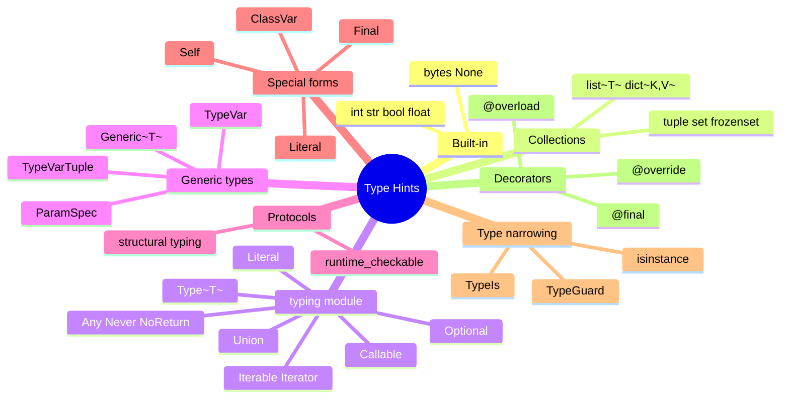
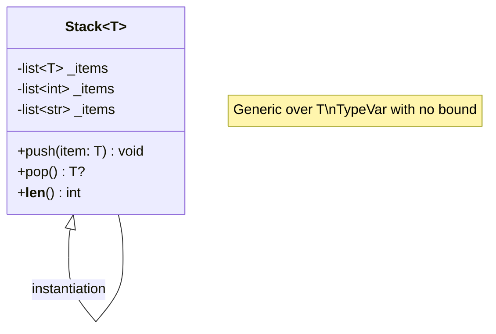
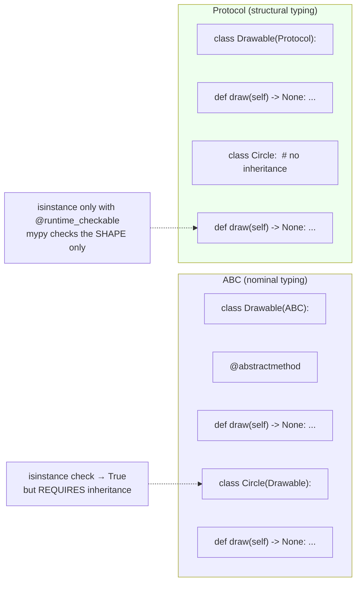
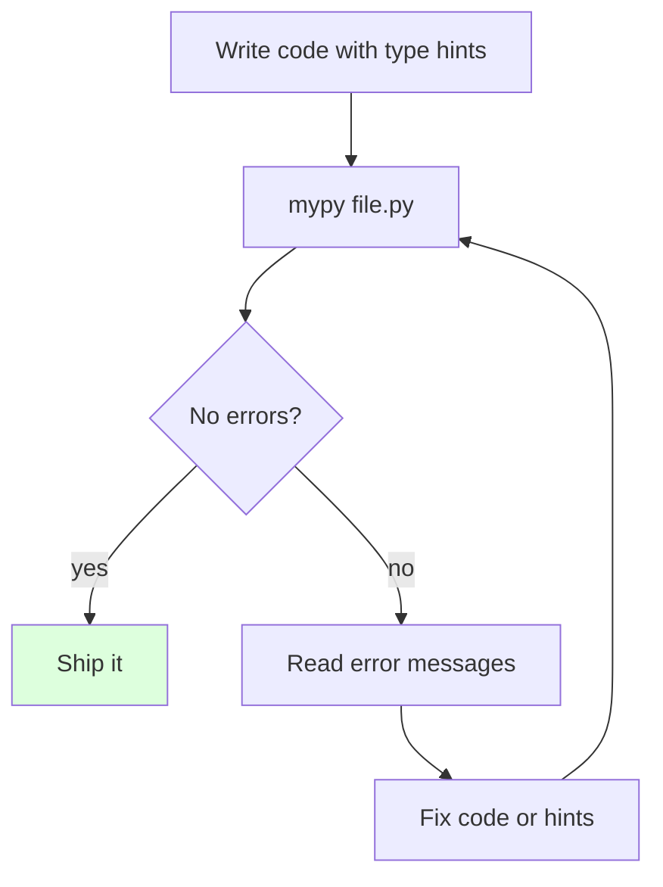
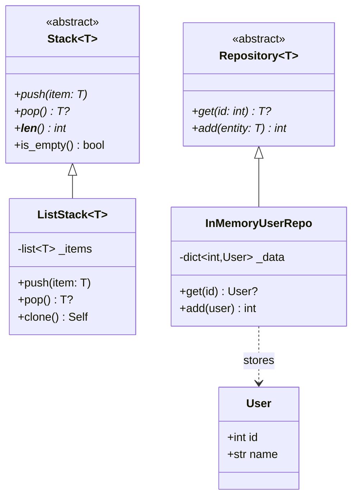

# Type Hints and OOP — Optional, Static, Structural Typing

#python #type-hints #typing #mypy #protocol #generics #teaching #deep-dive

> [!quote] PEP 484
> "Type hints are *optional*. The Python runtime does not enforce them. But they are useful to third-party tools such as type checkers, IDEs, and linters."

Type hints (PEP 484, Python 3.5+) let you annotate your code with type information that **static analysis tools** (mypy, pyright, pytype) can check — without changing Python's runtime semantics. The runtime ignores hints; the type checker reads them. This gives you gradual typing: add hints where they help, leave them off where they don't.

For OOP, type hints are transformative. They make polymorphism explicit, enable generics (`Stack[T]`), let you express structural interfaces (Protocols), mark methods `@final` or `@override`, and let you write a `clone() -> Self` that returns the same subclass. This note covers everything you need to type-hint a modern Python OOP codebase.

Prerequisites: [[Classes-And-Objects]], [[Methods-And-Functions]], [[Abstract-Base-Classes]].

---

## 1. The Type System at a Glance



| What you want | Tool |
|---|---|
| "a function that takes an int and returns a str" | `def f(x: int) -> str:` |
| "maybe None" | `Optional[X]` or `X \| None` |
| "one of these types" | `Union[X, Y]` or `X \| Y` |
| "a list of ints" | `list[int]` (3.9+) or `List[int]` |
| "a generic class" | `TypeVar`, `Generic[T]` |
| "anything with a `close` method" | `Protocol` |
| "don't subclass this" | `@final` |
| "I'm overriding a parent method" | `@override` (3.12+) |
| "returns an instance of my own subclass" | `Self` (3.11+) |
| "narrow type inside a function" | `TypeGuard` / `TypeIs` |

---

## 2. Annotating Classes and Methods

```python
class User:
    # Class-level annotations (with or without values)
    name: str
    email: str
    age: int = 0                       # default value

    def __init__(self, name: str, email: str, age: int = 0) -> None:
        self.name = name
        self.email = email
        self.age = age

    def greet(self, other: "User") -> str:    # forward reference
        return f"Hi {other.name}, I'm {self.name}!"

    @classmethod
    def anonymous(cls) -> "User":
        return cls("anonymous", "anon@example.com")
```

### 2.1 Forward References

If you need to refer to a class inside its own body, use a string: `"User"`. Or add `from __future__ import annotations` at the top of the file (PEP 563) to make *all* annotations lazy strings by default.

### 2.2 Class Variables vs Instance Variables

```python
class Counter:
    total: int = 0            # ClassVar by default — shared!
    instance_count: ClassVar[int] = 0    # explicit ClassVar

    def __init__(self):
        self.value: int = 0   # instance variable
        Counter.instance_count += 1
```

Use `typing.ClassVar` to mark attributes that live on the class, not instances. Without it, type checkers may treat `total: int = 0` ambiguously.

> [!warning] Common Student Misconception
> "If I annotate `self.x: int` inside `__init__`, the attribute is *created* at class level." No — annotations on `self.x` inside methods are *just hints*; the attribute is created when `__init__` runs and assigns it. The hint tells mypy "this attribute exists on instances, and it's an `int`."

---

## 3. The `typing` Module Essentials

```python
from typing import Optional, Union, Literal, Callable, Any, TypeAlias

# Optional[X] is shorthand for Union[X, None]
def find_user(user_id: int) -> Optional[User]: ...

# Union (or X | Y in 3.10+)
def parse(value: Union[int, str]) -> int: ...

# Literal — a specific value
def set_mode(mode: Literal["read", "write", "append"]) -> None: ...

# Callable
Handler = Callable[[str, int], bool]   # takes (str, int), returns bool
def on_event(handler: Handler) -> None: ...

# Any — escape hatch (use sparingly!)
def legacy(x: Any) -> Any: ...

# TypeAlias (3.10+) — explicit alias declaration
UserID: TypeAlias = int
```

### 3.1 Modern Syntax (3.9+/3.10+)

Python 3.9+ lets you use built-in generics directly (`list[int]` instead of `List[int]`). Python 3.10+ adds the `|` operator for unions:

```python
# Old
from typing import List, Dict, Optional, Union
def f(xs: List[int], m: Dict[str, int], v: Optional[Union[int, str]]) -> None: ...

# New (3.10+)
def f(xs: list[int], m: dict[str, int], v: int | str | None) -> None: ...
```

Both work; the new style is preferred for new code.

---

## 4. Generics: `TypeVar` and `Generic[T]`

A generic class is parameterized by a type variable. The classic example: a `Stack` that holds items of any single type.

```python
from typing import TypeVar, Generic, Optional, List

T = TypeVar("T")

class Stack(Generic[T]):
    def __init__(self) -> None:
        self._items: list[T] = []

    def push(self, item: T) -> None:
        self._items.append(item)

    def pop(self) -> Optional[T]:
        return self._items.pop() if self._items else None

    def __len__(self) -> int:
        return len(self._items)

# Type inference at construction:
s = Stack[int]()                # explicitly int
s.push(1)
s.push("two")                   # mypy error: str is not int
nums: Stack[int] = Stack()
nums.push(42)
n = nums.pop()                  # mypy knows n is Optional[int]
```



### 4.1 Bounded TypeVars

```python
from typing import TypeVar

class Animal:
    def speak(self) -> str: ...

T = TypeVar("T", bound=Animal)   # T must be Animal or a subclass

def clone(a: T) -> T:
    return a       # caller's type preserved

class Dog(Animal): ...
d: Dog = Dog()
d2 = clone(d)      # mypy infers d2: Dog, not just Animal
```

`bound=Animal` means "T is Animal or a subtype of Animal". Without `bound`, T can be anything.

### 4.2 Constrained TypeVars

```python
T = TypeVar("T", int, float)    # T must be int or float (no others)

def add(a: T, b: T) -> T:
    return a + b
```

The result type follows the input — `add(1, 2)` returns `int`, `add(1.0, 2.0)` returns `float`, but `add(1, 2.0)` is a type error.

### 4.3 Generic Repository Example

```python
from typing import TypeVar, Generic, Optional, Type
from abc import ABC, abstractmethod

T = TypeVar("T")

class Repository(ABC, Generic[T]):
    @abstractmethod
    def get(self, id: int) -> Optional[T]: ...
    @abstractmethod
    def add(self, entity: T) -> int: ...

class User: ...
class Order: ...

class UserRepo(Repository[User]):
    def get(self, id: int) -> Optional[User]: ...
    def add(self, entity: User) -> int: ...

class OrderRepo(Repository[Order]):
    def get(self, id: int) -> Optional[Order]: ...
    def add(self, entity: Order) -> int: ...
```

The `Repository[User]` vs `Repository[Order]` distinction is checked at the type level — you can't pass an `Order` to a `UserRepo.add` without mypy complaining.

---

## 5. Protocols — Structural Typing

A `Protocol` describes the *shape* of an object. Any object with the right methods satisfies the protocol — no inheritance required.

```python
from typing import Protocol, runtime_checkable

@runtime_checkable
class SupportsClose(Protocol):
    def close(self) -> None: ...

class FileLike:
    def close(self) -> None: ...      # no inheritance from SupportsClose!

class Database:
    def close(self) -> None: ...

def safely_close(thing: SupportsClose) -> None:
    thing.close()

safely_close(FileLike())    # OK
safely_close(Database())    # OK

# With @runtime_checkable, isinstance works too:
print(isinstance(FileLike(), SupportsClose))   # True
```

### 5.1 ABC vs Protocol



| Aspect | ABC | Protocol |
|---|---|---|
| Subclass must inherit? | Yes | No |
| Sharing code in base? | Yes | No (just signatures) |
| `isinstance` at runtime? | Yes (always) | Only if `@runtime_checkable` |
| Best for | Families of related classes | Cross-cutting shapes ("anything with `close`") |
| Example | `collections.abc.Sequence` | `typing.SupportsClose` |

> [!tip] Teaching Tip
> "A Protocol is what duck typing looks like to a type checker. If you'd write `# takes anything with a `close` method` as a comment, write it as a Protocol instead."

### 5.2 JSON-Serializable Protocol

```python
from typing import Protocol

class JSONSerializable(Protocol):
    def to_json(self) -> str: ...

def send_to_api(obj: JSONSerializable) -> None:
    payload = obj.to_json()
    # ... HTTP POST ...

class User:
    def to_json(self) -> str: return '{"name":"alice"}'

class Order:
    def to_json(self) -> str: return '{"id":1}'

send_to_api(User())     # OK
send_to_api(Order())    # OK
# send_to_api(42)       # mypy error: int has no to_json
```

---

## 6. `@final` and `@override`

### 6.1 `@final` — Prevent Inheritance / Override

```python
from typing import final

@final
class Account:                # cannot be subclassed
    ...

class Base:
    @final
    def verify(self) -> bool:    # cannot be overridden in subclasses
        ...

class Sub(Base):
    def verify(self) -> bool: ...    # mypy error: cannot override final method
```

### 6.2 `@override` (Python 3.12+, or `typing_extensions`)

```python
from typing import override

class Base:
    def greet(self, name: str) -> str: return f"Hi {name}"

class Sub(Base):
    @override
    def greet(self, name: str) -> str:
        return f"Hey {name}!"

    @override
    def great(self, name: str) -> str:    # mypy error: not overriding anything
        ...
```

`@override` documents intent: "I think I'm overriding a parent method." mypy will catch typos (`great` instead of `greet`) and signature drift.

> [!warning] Common Student Misconception
> "Does `@final` enforce at runtime?" No. Python doesn't enforce `@final` or `@override` at runtime — they're purely static hints. (You *could* enforce with a metaclass, but that's not the standard.) The guarantee comes from your type checker.

---

## 7. The `Self` Type

When a method returns "an instance of the same class as `self`" (especially with subclasses), `Self` (PEP 673, Python 3.11+) is the right tool:

```python
from typing import Self

class Shape:
    def scale(self, factor: float) -> Self:
        # Returns the same type as self — even for subclasses
        ...

class Circle(Shape):
    def scale(self, factor: float) -> Self:
        ...
        return self

c = Circle().scale(2)      # mypy: c is Circle, not just Shape
```

Without `Self`, you'd use `TypeVar("T", bound=Shape)` and `T` everywhere — workable but clunky. `Self` is the modern, ergonomic option.

### 7.1 `Self` for Classmethods

```python
class Foo:
    @classmethod
    def from_string(cls, s: str) -> Self:
        return cls()    # cls() preserves the subclass
```

If `FooSub` calls `FooSub.from_string(...)`, the return type is `FooSub`, not `Foo`.

---

## 8. Type Narrowing

A type checker narrows types within conditional branches:

```python
def handle(x: int | str) -> int:
    if isinstance(x, int):
        return x + 1           # x is int here
    else:
        return len(x)          # x is str here
```

### 8.1 `TypeGuard` and `TypeIs` (3.10+ / 3.13+)

For custom narrowing functions:

```python
from typing import TypeGuard

def is_str_list(x: list[object]) -> TypeGuard[list[str]]:
    return all(isinstance(i, str) for i in x)

def process(items: list[object]) -> None:
    if is_str_list(items):
        for s in items:        # mypy knows items is list[str] here
            print(s.upper())
```

`TypeIs` (PEP 742, Python 3.13+) is stricter: it also narrows the *else* branch (knowing the items are NOT `list[str]`).

---

## 9. Static Analysis Tools

| Tool | Vendor | Notes |
|---|---|---|
| **mypy** | Python | The original, most widely used. Strict mode available. |
| **pyright** | Microsoft | Powers VSCode's Pylance. Very fast, very strict. |
| **pytype** | Google | Infers types even for un-annotated code. |
| **pyre** | Meta | Used at Meta; very fast on large codebases. |
| **Ruff** | Astral | Linter; some type checks (more coming). |

### 9.1 Running mypy

```bash
pip install mypy
mypy mypackage/                # check the whole package
mypy --strict mymodule.py      # be aggressive
mypy --disallow-untyped-defs   # require type hints on all functions
```



### 9.2 Gradual Typing in Practice

Type hints are optional. You can:
- Annotate new code only.
- Use `Any` to opt out where the type is unknown.
- Run mypy only on a subset of files.
- Tighten over time.

Don't try to annotate everything at once. Start with public APIs, then critical paths, then expand outward.

---

## 10. A Complete Example: Typed Stack and Repository

```python
from __future__ import annotations
from abc import ABC, abstractmethod
from dataclasses import dataclass
from typing import Generic, TypeVar, Optional, Protocol, Self, override

T = TypeVar("T")

class Stack(ABC, Generic[T]):
    @abstractmethod
    def push(self, item: T) -> None: ...
    @abstractmethod
    def pop(self) -> Optional[T]: ...
    @abstractmethod
    def __len__(self) -> int: ...
    def is_empty(self) -> bool:
        return len(self) == 0

class ListStack(Stack[T], Generic[T]):
    def __init__(self) -> None:
        self._items: list[T] = []
    @override
    def push(self, item: T) -> None:
        self._items.append(item)
    @override
    def pop(self) -> Optional[T]:
        if not self._items:
            return None
        return self._items.pop()
    @override
    def __len__(self) -> int:
        return len(self._items)
    def clone(self) -> Self:
        new = ListStack[T]()
        new._items = list(self._items)
        return new

@dataclass(frozen=True)
class User:
    id: int
    name: str

class Repository(ABC, Generic[T]):
    @abstractmethod
    def get(self, id: int) -> Optional[T]: ...
    @abstractmethod
    def add(self, entity: T) -> int: ...

class InMemoryUserRepo(Repository[User]):
    def __init__(self) -> None:
        self._data: dict[int, User] = {}
        self._next_id: int = 1
    @override
    def get(self, id: int) -> Optional[User]:
        return self._data.get(id)
    @override
    def add(self, entity: User) -> int:
        uid = self._next_id
        self._next_id += 1
        self._data[uid] = entity
        return uid

# Typed factory
class SupportsClose(Protocol):
    def close(self) -> None: ...

def close_all(items: list[SupportsClose]) -> None:
    for item in items:
        item.close()

# Usage
stack: Stack[int] = ListStack[int]()
stack.push(1); stack.push(2); stack.push(3)
print(stack.pop())   # 3
clone = stack.clone() if isinstance(stack, ListStack) else None
```



---

## 11. Pitfalls

### 11.1 `Optional[X]` Doesn't Mean "Optional Argument"

```python
def f(x: Optional[int] = None) -> None: ...
```

`Optional[int]` means the *type* is `int | None`. The `= None` is what makes the *argument* optional. They're independent. Common confusion.

### 11.2 Mutable Defaults + Hints

```python
def f(items: list[int] = []): ...    # BAD: mutable default
def f(items: list[int] | None = None):
    if items is None: items = []     # GOOD
```

Type hints don't prevent the classic mutable-default bug. Still your job.

### 11.3 Forward References in 3.9 and Earlier

Without `from __future__ import annotations`, you must quote forward refs:

```python
class Tree:
    def add_child(self, child: "Tree") -> None: ...
```

Forgetting the quotes triggers `NameError` at class definition time.

### 11.4 Type Checkers Disagree

mypy and pyright occasionally disagree on edge cases (variance, overload resolution). Pick one as your source of truth and configure CI to use it.

### 11.5 Hints Don't Run at Runtime

```python
def add(a: int, b: int) -> int: return a + b
add("one", "two")    # runs at runtime, returns "onetwo" — no error
```

Type hints are *not* runtime checks. If you need runtime validation, use Pydantic, attrs validators, or `beartype`.

### 11.6 Treating `bool` as `int`

`bool` is a subtype of `int` in Python (historical: `True == 1`, `False == 0`). mypy accepts `bool` anywhere `int` is required, which can cause surprising behavior if you're using `int` as a count and accidentally pass a flag.

### 11.7 Over-Annotation

Don't annotate every local variable — let inference handle obvious cases. Annotating `i: int = 0` in a `for` loop adds noise without value. Reserve annotations for function signatures, class attributes, and module-level constants.

---

## 12. Best Practices

1. **Add `from __future__ import annotations`** at the top of every module — makes all annotations strings, eliminating forward-ref headaches.
2. **Prefer modern syntax** (`list[int]`, `X | None`) when supporting 3.10+.
3. **Use `Protocol`** for structural interfaces, `ABC` for nominal hierarchies with shared code.
4. **Mark public API methods `@final`** to prevent accidental overrides.
5. **Use `@override`** on every method that overrides a parent — catches typos.
6. **Use `Self`** for methods that return `cls()` or `self`.
7. **Run mypy in CI** with at least `--disallow-untyped-defs` on new code.
8. **Don't lie.** `def f(x: int) -> int: return "hello"` will not be caught unless mypy is run — but if it is, you've broken trust.
9. **Use `TypeGuard` / `TypeIs`** to encapsulate complex narrowing logic.
10. **Document generics** — explain what `T` represents in the class docstring.
11. **Annotate at the boundary** — function signatures and public APIs first; internal locals can rely on inference.
12. **Keep `Any` out of public APIs** — it's a contract leak. Use `object` or a Protocol instead.
13. **Treat type hints like tests** — they're guarantees your future self and your callers will rely on.

> [!success] Final Teaching Tip
> Have students add type hints to a small existing project, then run mypy. The errors are an instant lesson: "Oh, I said `int` but I'm actually passing `None` here." Each fix teaches a type-system concept — and the result is a more reliable codebase, for free.

---

## See Also

- [[Abstract-Base-Classes]] — nominal interfaces; ABCs vs Protocols.
- [[Dataclasses]] — type annotations are required for fields.
- [[Classes-And-Objects]] — class basics.
- [[Methods-And-Functions]] — function annotation syntax.
- [[Polymorphism]] — type hints make polymorphism explicit.

## Appendix A: Variance — Covariant, Contravariant, Invariant

When you parameterize a generic type, the question of subtype relationships arises: if `Dog` is a subtype of `Animal`, is `list[Dog]` a subtype of `list[Animal]`? The answer depends on **variance**:

| Variance | Rule | Example |
|---|---|---|
| Covariant | `Dog <: Animal` ⇒ `C[Dog] <: C[Animal]` | `tuple` (immutable) |
| Contravariant | `Dog <: Animal` ⇒ `C[Animal] <: C[Dog]` | Function arguments |
| Invariant | No subtype relationship | `list`, `dict` (mutable) |

Python's `list` is **invariant** by design — `list[Dog]` is *not* a subtype of `list[Animal]`, because if it were, you could append a `Cat` to a "list of Dogs" through a `list[Animal]` reference. Immutability removes this risk, which is why `tuple` is covariant.

You can declare variance explicitly with `TypeVar`:

```python
from typing import TypeVar

T_co = TypeVar("T_co", covariant=True)
T_contra = TypeVar("T_contra", contravariant=True)

class Producer(Generic[T_co]):        # produces T_co
    def get(self) -> T_co: ...

class Consumer(Generic[T_contra]):    # consumes T_contra
    def put(self, x: T_contra) -> None: ...
```

In practice, you rarely need to think about variance — most type checkers infer it correctly. It comes up mainly when designing generic libraries.

## Appendix B: `@overload` — Multiple Signatures

A function may have multiple calling conventions. Use `@overload` to declare them for the type checker, then implement the actual function separately:

```python
from typing import overload

@overload
def parse(x: int) -> float: ...
@overload
def parse(x: str) -> list[str]: ...
@overload
def parse(x: bytes) -> list[bytes]: ...

def parse(x):
    # Actual implementation — runtime, no type check
    if isinstance(x, int): return float(x)
    if isinstance(x, str): return x.split(",")
    if isinstance(x, bytes): return x.split(b",")
    raise TypeError

# mypy knows:
# parse(5) → float
# parse("a,b") → list[str]
# parse(b"a,b") → list[bytes]
```

The `@overload` declarations are erased at runtime — they exist only for type checkers. The actual function does the runtime dispatch (typically via `isinstance`).

## Appendix C: Variadic Generics (3.11+)

PEP 646 added variadic generics — `TypeVarTuple` and `ParamSpec` — for things like `Array[*Shape]`:

```python
from typing import TypeVarTuple, Generic, Unpack

Shape = TypeVarTuple("Shape")

class Array(Generic[Unpack[Shape]]):
    def __init__(self, *dims: int):
        self.dims = dims

# 2D array (rows, cols)
a: Array[int, int] = Array(3, 4)
# 3D array
b: Array[int, int, int] = Array(3, 4, 5)
```

This is mainly useful for libraries that do heavy generic programming — NumPy-style arrays, tensor libraries, RPC frameworks. Most application code never needs it.

## Appendix D: A Typed Plugin System

Combining everything: a typed plugin loader using ABC, Protocol, generics, and `Self`.

```python
from __future__ import annotations
from abc import ABC, abstractmethod
from typing import Protocol, Type, TypeVar, Optional, Self, override

T = TypeVar("T", bound="Plugin")

class Plugin(ABC):
    """Base class for all plugins."""
    name: str          # subclasses set this

    @abstractmethod
    def run(self, ctx: dict) -> dict: ...

    @classmethod
    @abstractmethod
    def from_config(cls: type[T], cfg: dict) -> T: ...

class PluginRegistry:
    def __init__(self) -> None:
        self._plugins: dict[str, type[Plugin]] = {}

    def register(self, plugin_cls: type[Plugin]) -> type[Plugin]:
        if not hasattr(plugin_cls, "name") or not isinstance(plugin_cls.name, str):
            raise TypeError("plugin must have a string 'name'")
        self._plugins[plugin_cls.name] = plugin_cls
        return plugin_cls

    def get(self, name: str) -> Optional[type[Plugin]]:
        return self._plugins.get(name)

    def load(self, name: str, cfg: dict) -> Optional[Plugin]:
        plugin_cls = self.get(name)
        if plugin_cls is None:
            return None
        return plugin_cls.from_config(cfg)

registry = PluginRegistry()

@registry.register
class GreetPlugin(Plugin):
    name = "greet"
    @override
    def run(self, ctx: dict) -> dict:
        return {"message": f"Hello, {ctx.get('user', 'world')}!"}
    @classmethod
    def from_config(cls, cfg: dict) -> "GreetPlugin":
        return cls()

# Load by name from config
plugin = registry.load("greet", {})
if plugin:
    print(plugin.run({"user": "Alice"}))   # {'message': 'Hello, Alice!'}
```

This combines nominal typing (the `Plugin` ABC), generic return types (`type[T]`), `@override` for clarity, and runtime registration. Real plugin systems like Flask's extensions or pytest's plugins look like this.

## Appendix E: Common Pitfalls — Summary

| Pitfall | Symptom | Fix |
|---|---|---|
| `Optional[X]` confused with optional argument | Wrong type or wrong default semantics | `Optional[X]` = type; `= None` = optional arg |
| Mutable default with type hint | Runtime bug, no type error | Use `= None` + check |
| Forward reference not quoted (pre-3.10) | `NameError` at class def | Quote it: `"ClassName"`, or `from __future__ import annotations` |
| Treating `int` as subtype of `float` | mypy error | Use `float` everywhere, or `int \| float` |
| `Any` spreads | Type-checker loses track | Use `object` (more constrained) where possible |
| Forgetting `@override` | Typos silently slip through | Add `@override` to every method that overrides |
| Using `List`, `Dict` instead of `list`, `dict` (3.9+) | Works but outdated | Use built-in generics |
| Hints lie | mypy passes but runtime fails | Don't lie. Use runtime checks if behavior depends on type |

## Appendix F: Type Checkers Comparison

| Feature | mypy | pyright | pytype | pyre |
|---|---|---|---|---|
| Vendor | Python (community) | Microsoft | Google | Meta |
| Speed | Slow | Fast | Medium | Fast |
| Strictness | Configurable | High | Medium | High |
| Inference | Minimal | Excellent | Excellent | Good |
| Used by | Most projects | VSCode/Pylance | Google internal | Meta internal |
| Plugin system | Yes | Yes | Limited | Yes |
| First-class Protocol support | Yes | Yes | Yes | Yes |

For new projects, **mypy** is the safe default (most ecosystem support) and **pyright** (via Pylance in VSCode) is the best real-time IDE experience. Many teams use both: pyright for editing, mypy for CI.

> [!success] Final Teaching Tip
> Have students add type hints to a small existing project, then run mypy. The errors are an instant lesson: "Oh, I said `int` but I'm actually passing `None` here." Each fix teaches a type-system concept — and the result is a more reliable codebase, for free.

## References

- PEP 484 — Type Hints
- PEP 544 — Protocols (structural subtyping)
- PEP 673 — `Self` type
- PEP 646 — Variadic generics
- PEP 698 — `@override` decorator
- `typing` module documentation
- mypy: https://mypy-lang.org
- pyright: https://github.com/microsoft/pyright
