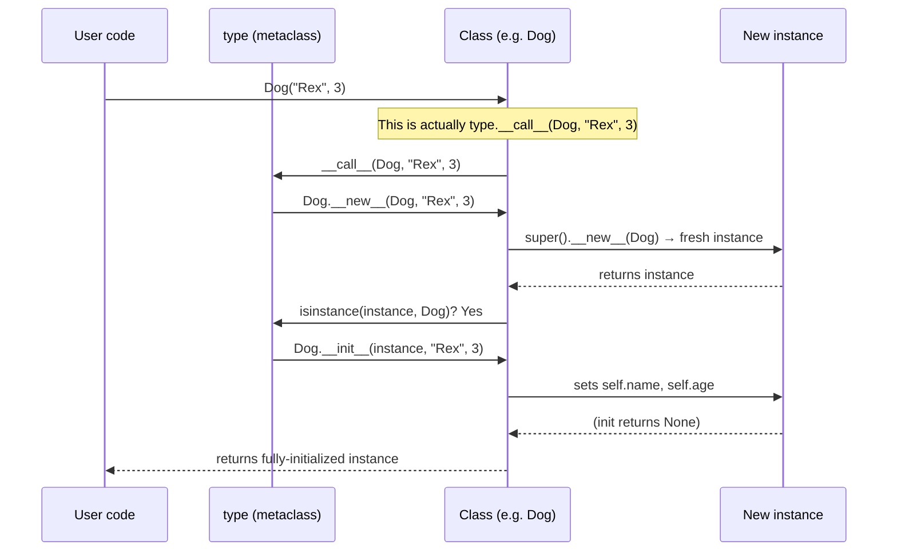

> [!tip] Prerequisite
> This note assumes you've read [[what-is-oop]] and understand the difference between a *class* (blueprint) and an *instance* (a thing built from that blueprint). Here we go under the hood: **how** Python actually creates classes and instances.

## 1. The Anatomy of a Python Class

A Python class is, at its simplest, a block of code introduced by the `class` keyword. Inside, you typically find:

1. **Class attributes** — names assigned at class scope.
2. **Methods** — functions defined inside the class.
3. **Special (dunder) methods** — like `__init__`, `__repr__`, etc.
4. **Docstring** — the first string literal, accessible via `Class.__doc__`.

```python
from __future__ import annotations

class Dog:
    """A minimal but realistic Dog class."""

    species = "Canis familiaris"   # <-- class attribute

    def __init__(self, name: str, age: int) -> None:
        self.name = name           # <-- instance attribute
        self.age = age             # <-- instance attribute

    def bark(self) -> str:
        return f"{self.name} says woof!"

# --- Use it ---
rex = Dog("Rex", 3)
print(rex.bark())       # Rex says woof!
print(rex.species)      # Canis familiaris  (found via the class)
print(Dog.species)      # Canis familiaris  (also accessible on the class)
```

> [!note] The `class` statement is executable
> Unlike Java/C# where class declarations are static, Python's `class` is an *executable statement*. The body runs top-to-bottom in a fresh namespace, and the resulting namespace becomes the class's `__dict__`. That's why you can write `if` statements or loops *inside* a class body (though it's unusual).

## 2. Class Attributes vs. Instance Attributes

This is **the** classic source of bugs for newcomers. Let's be precise.

| Aspect              | Class attribute                     | Instance attribute                    |
| ------------------- | ----------------------------------- | ------------------------------------- |
| Where it lives      | In `Class.__dict__`                 | In `instance.__dict__`                |
| When created        | At class definition time            | When `__init__` (or other code) runs  |
| Shared by instances | ✅ Yes                              | ❌ No (each instance has its own copy) |
| Accessed via        | `Class.attr` *or* `instance.attr`   | `instance.attr` only                  |

### 2.1 The mutable-default trap

```python
class Config:
    defaults: dict = {}      # ⚠️ This dict is SHARED by all instances

    def set(self, key: str, value: object) -> None:
        self.defaults[key] = value     # mutates the SHARED class dict!

a = Config()
a.set("debug", True)

b = Config()
print(b.defaults)    # {'debug': True}  ❌ surprising!
```

### 2.2 The read-then-write subtlety

Reading `self.defaults` finds the class attribute (fallback). But **assignment** creates a new *instance* attribute:

```python
class Config:
    defaults: dict = {}

a = Config()
a.defaults = {"x": 1}     # creates instance attribute, shadows class attr
print(a.defaults)          # {'x': 1}
print(Config.defaults)     # {}  (untouched)
```

> [!warning] Rule of thumb
> Class attributes are great for **constants** and **immutable defaults**. For mutable per-instance data, always set it on `self` inside `__init__`.

### 2.3 Counting instances (a legitimate class attribute use)

```python
class User:
    _count: int = 0          # class-level counter

    def __init__(self, username: str) -> None:
        self.username = username
        User._count += 1     # always assign to the class, not self

    @classmethod
    def population(cls) -> int:
        return cls._count

User("alice")
User("bob")
print(User.population())     # 2
```

## 3. `self` Explained Deeply

> [!danger] `self` is NOT a keyword
> `self` is just a *parameter name*. Python requires the first parameter of an instance method to receive the instance, but you could legally name it `this`, `me`, or `potato`. **Don't.** The community convention is `self`, and deviating from it makes your code unreadable.

### 3.1 The explicit-`self` contract

When you write:

```python
rex = Dog("Rex", 3)
rex.bark()
```

Python translates the last line into:

```python
Dog.bark(rex)
```

So `bark(self)` receives `rex` as its first argument. This is why methods must declare `self` even though it's never passed explicitly at the call site.

### 3.2 Bound vs. unbound methods

```python
rex = Dog("Rex", 3)
f = rex.bark        # f is a *bound* method: instance already baked in
print(f())           # Rex says woof!

g = Dog.bark        # g is the *function* (unbound)
print(g(rex))        # Rex says woof!  <-- you must pass the instance
```

> [!note] Descriptors are the mechanism
> Functions implement the **descriptor protocol** (`__get__`). When accessed via an instance, `__get__` returns a bound method object that prepends the instance to the call. See [[methods]] for details.

### 3.3 Demonstrating `self` is just a name

```python
class Weird:
    def __init__(potato, value):    # legal but evil
        potato.value = value

    def show(this):                 # also legal, also evil
        return this.value

w = Weird(42)
print(w.show())    # 42
```

> [!warning] Don't actually do this
> It compiles, but reviewers will reject it. Stick with `self`.

### 3.4 When `self` is the *class*: meet `cls`

In a `@classmethod`, the first parameter conventionally named `cls` receives the **class**, not an instance. See [[methods]].

## 4. The Object Lifecycle

Every Python object goes through this pipeline:

```mermaid
flowchart TD
    A["Call `ClassName(...)`"] --> B["`type.__call__(cls, ...)`"]
    B --> C["`cls.__new__(cls, ...)`<br/>allocates & returns instance"]
    C --> D{"`isinstance(result, cls)`?"}
    D -- No --> E["Skip `__init__`<br/>(rare; e.g. int subclasses)"]
    D -- Yes --> F["`cls.__init__(instance, ...)`<br/>populate attributes"]
    F --> G["Instance in use:<br/>attribute access, method calls"]
    E --> G
    G --> H{"Refcount reaches 0?"}
    H -- No --> G
    H -- Yes --> I["CPython calls `__del__`<br/>(if defined)"]
    I --> J["Memory freed / GC handles cycles"]
```

### 4.1 `__new__`: the allocator

`__new__` is a **static method** (sort of — it's actually a classmethod-like special method) that returns a *new* instance. The default `object.__new__` allocates an empty object. You rarely override it — but when you do, it's usually for:

- **Immutables** (you must create the object *with* its value already set, since `__init__` cannot mutate it). Think `str`, `int`, `tuple` subclasses.
- **Singletons** and **flyweights**.
- **Caching** instances by key (interning).

```python
class CachedString(str):
    _pool: dict[str, "CachedString"] = {}

    def __new__(cls, value: str) -> "CachedString":
        if value in cls._pool:
            return cls._pool[value]
        obj = super().__new__(cls, value)
        cls._pool[value] = obj
        return obj

a = CachedString("hello")
b = CachedString("hello")
print(a is b)        # True — same object from the pool
```

### 4.2 `__init__`: the initializer

`__init__` receives the freshly-allocated instance and configures it. It returns `None`; Python enforces this:

```python
class Bad:
    def __init__(self):
        return 42        # TypeError: __init__() should return None
```

> [!note] Two-phase construction
> Splitting allocation (`__new__`) from initialization (`__init__`) is what makes Python's immutables possible. `tuple("abc")` *must* return a fully-formed tuple; you can't "fill it in" afterwards.

### 4.3 `__del__`: the finalizer (use with care)

`__del__` is called when an object's reference count drops to zero **or** when the garbage collector collects it as part of a cycle. It's not a destructor in the C++ sense:

- It may run *much* later than you expect.
- It may run *not at all* during interpreter shutdown.
- Exceptions inside `__del__` are printed to stderr but suppressed.
- It can resurrect the object (e.g., by storing `self` somewhere).

```python
class Connection:
    def __init__(self, url: str) -> None:
        self.url = url
        print(f"Opening connection to {url}")

    def __del__(self) -> None:
        # Best-effort cleanup; do NOT rely on this for critical resources!
        print(f"Best-effort close of {self.url}")
```

> [!danger] Don't use `__del__` for resource management
> Use a context manager (`with` block) instead — see [[magic-methods]] for `__enter__` / `__exit__`. `__del__` timing is unpredictable across implementations.

## 5. Memory Model: Everything Is an Object

In Python, *everything* you can bind to a name is an object — including integers, functions, modules, and **classes themselves**.

```python
print(type(42))            # <class 'int'>
print(type(len))           # <class 'builtin_function_or_method'>
import math
print(type(math))          # <class 'module'>
print(type(int))           # <class 'type'>  <-- the class 'int' is a type
print(type(type))          # <class 'type'>  <-- 'type' is its own type!
```

### 5.1 The metaclass ↔ class ↔ instance triangle

```mermaid
graph TB
    subgraph Meta["Metaclass level"]
        T["`type`<br/>(the default metaclass)"]
    end
    subgraph Class["Class level"]
        D["`Dog`<br/>(a class)"]
        I["`int`<br/>(a class)"]
    end
    subgraph Inst["Instance level"]
        rex["`rex`<br/>(an instance of Dog)"]
        n["`42`<br/>(an instance of int)"]
    end
    T -- "is instance of" --> T
    D -- "is instance of" --> T
    I -- "is instance of" --> T
    rex -- "is instance of" --> D
    n -- "is instance of" --> I
```

Reading this diagram:

- `rex` is an instance of `Dog`. ✅
- `Dog` is an instance of `type` (its *metaclass*). ✅
- `type` is an instance of itself. ✅ (Yes, really.)
- Everything ultimately inherits from `object`. `type` is a subclass of `object`.

```python
print(isinstance(rex, Dog))        # True
print(isinstance(Dog, type))       # True
print(isinstance(type, type))      # True
print(issubclass(type, object))    # True
print(issubclass(Dog, object))     # True
```

### 5.2 `__class__` and `__dict__`

Every object carries:

- `obj.__class__` — a reference to its class.
- `obj.__dict__` — a mapping of *instance* attributes (for most objects).

```python
rex = Dog("Rex", 3)
print(rex.__class__)           # <class '__main__.Dog'>
print(rex.__dict__)            # {'name': 'Rex', 'age': 3}
print(Dog.__dict__.keys())     # dict_keys([..., 'species', '__init__', 'bark', ...])
```

> [!note] Some objects have no `__dict__`
> Built-in types like `int`, `str`, and `tuple` don't allow arbitrary instance attributes. Classes with `__slots__` (see [[dataclasses-and-attrs]]) also skip the per-instance `__dict__`, saving memory.

## 6. `id()`, `type()`, `is` vs. `==`

### 6.1 `id()` — object identity

`id(obj)` returns a unique integer for an object during its lifetime. In CPython, this is the object's memory address (an implementation detail — don't depend on that).

```python
x = "hello"
y = "hello"
print(id(x))      # e.g. 140734567891632
print(id(y))      # often the same — string interning!
print(x is y)     # True  (interned)
```

### 6.2 `is` — identity operator

`a is b` is true iff `id(a) == id(b)`. It does **not** call `__eq__`. Use it for:

- Sentinel checks: `if x is None`.
- Caching correctness: `if a is b`.
- Singleton checks: `if obj is THE_INSTANCE`.

### 6.3 `==` — equality operator

`a == b` calls `a.__eq__(b)` (or falls back to `a is b`). You can override it.

```python
class Money:
    def __init__(self, amount: int, currency: str) -> None:
        self.amount = amount
        self.currency = currency

    def __eq__(self, other: object) -> bool:
        if not isinstance(other, Money):
            return NotImplemented
        return self.amount == other.amount and self.currency == other.currency

a = Money(100, "USD")
b = Money(100, "USD")
c = a

print(a == b)    # True   (value equality)
print(a is b)    # False  (different objects)
print(a is c)    # True   (same object)
```

> [!warning] The `is None` rule
> Always compare to `None` with `is`, never `==`. `==` can be overridden and may behave unexpectedly; `is None` cannot.

### 6.4 Small-integer and string interning

CPython interns small integers (typically -5 to 256) and short, identifier-like strings. This is why these *appear* to be the same object even though they're constructed independently:

```python
a, b = 256, 256
print(a is b)    # True (interned)

c, d = 257, 257
print(c is d)    # False (not interned) — or True depending on REPL/compiler mode
```

> [!tip] Never rely on interning
> Use `==` for value comparison. Use `is` only when you genuinely mean *identity*.

## 7. Worked Example: A `BankAccount`

Putting it all together:

```python
from __future__ import annotations
from decimal import Decimal


class BankAccount:
    """A simple bank account demonstrating class vs instance attributes."""

    # Class attributes (constants shared across instances)
    MIN_OPENING_BALANCE = Decimal("0.00")
    _next_account_number = 1000          # auto-increment source

    def __init__(self, owner: str, opening_balance: Decimal | None = None) -> None:
        self.owner = owner
        self._balance = opening_balance or self.MIN_OPENING_BALANCE
        self.account_number = BankAccount._next_account_number
        BankAccount._next_account_number += 1

    def deposit(self, amount: Decimal) -> None:
        if amount <= 0:
            raise ValueError("Deposit must be positive")
        self._balance += amount

    def withdraw(self, amount: Decimal) -> None:
        if amount <= 0 or amount > self._balance:
            raise ValueError("Invalid withdrawal")
        self._balance -= amount

    @property
    def balance(self) -> Decimal:
        return self._balance

    def __repr__(self) -> str:
        return f"BankAccount(owner={self.owner!r}, balance={self._balance})"


acc = BankAccount("Alice", Decimal("500"))
acc.deposit(Decimal("250"))
print(acc)                       # BankAccount(owner='Alice', balance=750)
print(acc.account_number)        # 1000

acc2 = BankAccount("Bob")
print(acc2.account_number)       # 1001  (class attribute counter incremented)
```

## 8. Worked Example: The Object Lifecycle, Traced

```python
class Traced:
    def __new__(cls, *args, **kwargs):
        print(f"  __new__({cls.__name__}, {args}, {kwargs})")
        instance = super().__new__(cls)
        print(f"  __new__ returned {instance!r}")
        return instance

    def __init__(self, value: int) -> None:
        print(f"  __init__({self!r}, {value})")
        self.value = value

    def __del__(self) -> None:
        print(f"  __del__({self!r})")


print("Creating obj...")
obj = Traced(42)
print(f"Using obj: {obj.value}")
print("Deleting obj...")
del obj
print("Done.")
```

Sample output:

```
Creating obj...
  __new__(Traced, (42,), {})
  __new__ returned <Traced object at 0x...>
  __init__(<Traced object at 0x...>, 42)
Using obj: 42
Deleting obj...
  __del__(<Traced object at 0x...>)
Done.
```

## 9. Mermaid: Object Creation Flow (Detailed)



## 10. Key Takeaways

> [!tip] The mental model in five sentences
> 1. A **class** is a callable object whose call produces **instances**.
> 2. **Class attributes** are shared; **instance attributes** live in each object's `__dict__`.
> 3. **`self`** is an explicit first parameter, not a keyword — `instance.method()` is sugar for `Class.method(instance)`.
> 4. Construction is **two-phase**: `__new__` allocates, `__init__` configures.
> 5. Use **`is`** for identity and sentinels; use **`==`** for value equality (and you can customize it via `__eq__`).

## 11. Practice Exercises

> [!example] Easy
> 1. Define a `Book` class with `title`, `author`, and `year` instance attributes, plus a class attribute `library_name = "Central Library"`. Create two books and confirm the class attribute is shared.
> 2. Add a `__repr__` method to `Book` so that `print(b)` shows `Book(title='...', author='...', year=...)`.

> [!example] Medium
> 3. Write a `Counter` class with a class-level `_total_instances` attribute that tracks how many `Counter` objects have ever been created. Add a class method `total_created()` returning the count.
> 4. Implement a `Singleton` class using `__new__`. Verify that `Singleton() is Singleton()` returns `True`.
> 5. Demonstrate the **mutable-default trap**: write a buggy `ShoppingCart` where each cart accidentally shares its `items` list, then fix it.

> [!example] Hard
> 6. Override `__new__` in a `Matrix` class so that two matrices with the same dimensions and data return the *same* object (an interning/flyweight pattern). Verify with `is`.
> 7. Build a `TrackedObject` base class that logs, in order, every `__new__`, `__init__`, and `__del__` call across all subclasses. Subclass it as `Player` and demonstrate the lifecycle messages.
> 8. Implement a `Money` class with `amount` and `currency`. Override `__eq__` and `__hash__` so that equal `Money` objects hash equally — then put several in a `set` to confirm deduplication. (See [[magic-methods]] for the `__hash__`/`__eq__` contract.)

## 12. Related Notes

- [[what-is-oop]] — the conceptual foundation
- [[methods]] — instance/class/static methods, `super()`, MRO
- [[properties]] — turning attribute access into computed behavior
- [[magic-methods]] — the dunder catalog
- [[encapsulation]] — why we use `_balance` instead of `balance`
- [[inheritance]] — subclassing and the `super()` chain
- [[dataclasses-and-attrs]] — a faster way to write many classes
