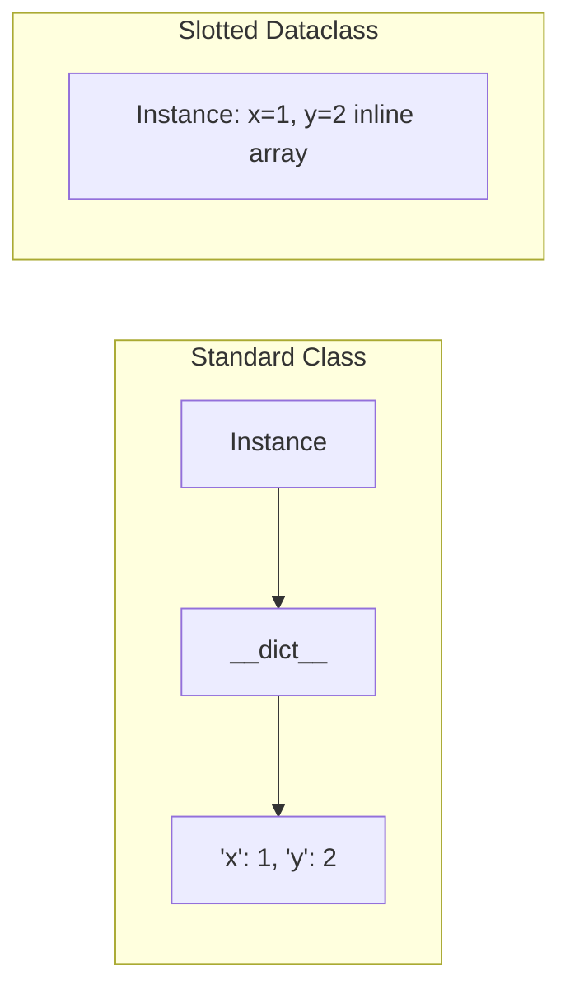

> [!tip] Prerequisite
> Read [[classes-and-objects]] and [[magic-methods]] first. Dataclasses are mostly *code generation*: they auto-write the dunder methods you'd otherwise write by hand.

## 1. The Problem: Boilerplate

Plain Python classes for *data-carrying* objects are verbose:

```python
class Point:
    def __init__(self, x: float, y: float) -> None:
        self.x = x
        self.y = y

    def __repr__(self) -> str:
        return f"Point(x={self.x!r}, y={self.y!r})"

    def __eq__(self, other: object) -> bool:
        if not isinstance(other, Point):
            return NotImplemented
        return self.x == other.x and self.y == other.y

    def __hash__(self) -> int:
        return hash((self.x, self.y))
```

That's ~15 lines for two fields. Add `__lt__`, validation, default values, and it balloons. `@dataclass` writes this boilerplate for you.

## 2. The `@dataclass` Decorator (Python 3.7+)

```python
from dataclasses import dataclass


@dataclass
class Point:
    x: float
    y: float
```

That's it. You get:

- `__init__(self, x: float, y: float)` — generated.
- `__repr__` — looks like `Point(x=1.0, y=2.0)`.
- `__eq__` — field-by-field comparison.
- `__ne__` (default impl), and optionally `__lt__`/`__le__`/`__gt__`/`__ge__` via `order=True`.

```python
p = Point(1.0, 2.0)
q = Point(1.0, 2.0)
print(p)           # Point(x=1.0, y=2.0)
print(p == q)      # True
print(p != Point(3, 4))   # True
```

### 2.1 Decorator options

| Option         | Default | Effect                                                          |
| -------------- | ------- | --------------------------------------------------------------- |
| `init`         | `True`  | Generate `__init__`                                             |
| `repr`         | `True`  | Generate `__repr__`                                             |
| `eq`           | `True`  | Generate `__eq__` (and `__ne__`)                                |
| `order`        | `False` | Generate `__lt__`, `__le__`, `__gt__`, `__ge__` (requires `eq`) |
| `unsafe_hash`  | `False` | Force-generate `__hash__` (even if mutable — risky)            |
| `frozen`       | `False` | Make instances immutable (generates `__hash__` too)             |
| `match_args`   | `True`  | Generate `__match_args__` for structural pattern matching       |
| `slots`        | `False` | (3.10+) Generate `__slots__` — saves memory                     |
| `kw_only`      | `False` | (3.10+) All fields are keyword-only                             |

```python
@dataclass(order=True, frozen=True)
class Version:
    major: int
    minor: int = 0
    patch: int = 0

v1 = Version(1, 0, 0)
v2 = Version(2)
print(v1 < v2)              # True  (order=True)
print(hash(v1))             # works (frozen=True)
try:
    v1.major = 5            # FrozenInstanceError
except Exception as e:
    print(type(e).__name__)  # FrozenInstanceError
```

## 3. Fields, Defaults, `default_factory`, and `field()`

### 3.1 The mutable-default trap

This **does not work** — same trap as in [[classes-and-objects]]:

```python
from dataclasses import dataclass

@dataclass
class BadCart:
    items: list[str] = []      # ❌ ValueError: mutable default for field items is not allowed
```

Python's dataclasses actively reject this. Use `field(default_factory=...)`:

### 3.2 `default_factory`

```python
from dataclasses import dataclass, field


@dataclass
class ShoppingCart:
    customer: str
    items: list[str] = field(default_factory=list)
    discounts: dict[str, float] = field(default_factory=dict)

    def add(self, item: str) -> None:
        self.items.append(item)


c1 = ShoppingCart("alice")
c2 = ShoppingCart("bob")
c1.add("widget")
print(c1.items)         # ['widget']
print(c2.items)         # []   ← separate lists!
```

### 3.3 `field()` options

```python
@dataclass
class User:
    id: int
    username: str
    # Don't include in __repr__ (e.g., sensitive data)
    password_hash: str = field(repr=False)
    # Don't use in __eq__ / __hash__
    last_login: str | None = field(default=None, compare=False)
    # Don't accept as a constructor parameter
    computed: float = field(default=0.0, init=False)

    def __post_init__(self) -> None:
        self.computed = self.id * 1.1


u = User(1, "alice", "hashed")
print(u)               # User(id=1, username='alice', last_login=None)  (password_hash hidden)
print(u.computed)      # 1.1
```

Useful `field()` arguments:

- `default` — static default.
- `default_factory` — callable producing a fresh default each time.
- `init` — if `False`, the field isn't a constructor param (set it in `__post_init__`).
- `repr` — include in `__repr__`?
- `compare` — include in `__eq__`/`__lt__`?
- `hash` — include in `__hash__`? Defaults to `None` (= follow `compare`).
- `metadata` — a free-form mapping for third-party tools (e.g., ORM hints).

## 4. `frozen=True` — Immutable Dataclasses

```python
from dataclasses import dataclass


@dataclass(frozen=True)
class Money:
    amount: int
    currency: str

    def __add__(self, other: "Money") -> "Money":
        if self.currency != other.currency:
            raise ValueError("Cannot add different currencies")
        return Money(self.amount + other.amount, self.currency)


a = Money(100, "USD")
b = Money(50, "USD")
c = a + b
print(c)               # Money(amount=150, currency='USD')
try:
    a.amount = 200     # FrozenInstanceError
except Exception as e:
    print(type(e).__name__)

print(hash(a))         # works — frozen dataclasses are hashable
print(len({a, b, c}))  # 3
```

> [!note] Frozen ≠ deep-immutable
> `frozen=True` prevents *rebinding* attributes. If a field is itself a mutable container (e.g. a `list`), that container can still be mutated. For true immutability, also store immutable types (`tuple`, `frozenset`, `MappingProxyType`).

> [!warning] Frozen + slots + inheritance
> Mixing `frozen` and `slots` with inheritance can produce surprising errors. Test thoroughly. As of 3.10+, both work together for the simple cases.

## 5. `__post_init__`

`__post_init__` runs *after* the generated `__init__` finishes. Use it for:

- **Validation** that depends on multiple fields.
- **Derived fields** that are `init=False`.
- **Side effects** like registering an instance, logging, or normalizing input.

```python
from dataclasses import dataclass, field
from datetime import date


@dataclass
class Customer:
    name: str
    email: str
    signup_date: date = field(default_factory=date.today)
    email_domain: str = field(init=False, repr=False)
    _validated: bool = field(default=False, init=False, repr=False)

    def __post_init__(self) -> None:
        # Validate inputs
        if "@" not in self.email:
            raise ValueError(f"Invalid email: {self.email!r}")
        if not self.name.strip():
            raise ValueError("Name cannot be empty")

        # Derive fields
        self.email_domain = self.email.rsplit("@", 1)[-1].lower()

        # Side effect
        self._validated = True


c = Customer("Alice", "Alice@Example.com")
print(c.email_domain)    # example.com  (normalized to lowercase)
print(c._validated)      # True

try:
    Customer("", "x@y.com")
except ValueError as e:
    print(e)              # Name cannot be empty
```

### 5.1 `InitVar` — extra init-only parameters

Sometimes you want to accept a constructor argument that *isn't* stored as a field. Use `InitVar`:

```python
from dataclasses import dataclass, field, InitVar


@dataclass
class DatabaseConfig:
    host: str
    port: int
    # Accept a DSN string at init, but store individual parts instead:
    dsn: InitVar[str | None] = None

    def __post_init__(self, dsn: str | None) -> None:
        if dsn is not None:
            # Parse "postgres://host:port" → override host/port
            parts = dsn.replace("postgres://", "").split(":")
            self.host = parts[0]
            self.port = int(parts[1]) if len(parts) > 1 else 5432


cfg = DatabaseConfig(host="", port=0, dsn="postgres://db.example.com:6543")
print(cfg.host, cfg.port)   # db.example.com 6543
# cfg.dsn  # AttributeError — InitVar is not stored
```

## 6. `slots=True` (Python 3.10+) — Memory Savings

```python
import sys
from dataclasses import dataclass


@dataclass
class PointDict:
    x: float
    y: float


@dataclass(slots=True)
class PointSlots:
    x: float
    y: float


pd = PointDict(1.0, 2.0)
ps = PointSlots(1.0, 2.0)

print(sys.getsizeof(pd.__dict__))   # ~104 bytes (the per-instance dict)
print(hasattr(ps, "__dict__"))      # False — no per-instance dict!

# Slotted objects reject unknown attributes:
try:
    ps.z = 3
except AttributeError as e:
    print(e)                        # 'PointSlots' object has no attribute 'z'
```

> [!tip] Trade-offs of `slots=True`
> - ✅ Smaller memory footprint (no `__dict__`, often 30–50% smaller).
> - ✅ Faster attribute access (slight).
> - ❌ Cannot add arbitrary attributes.
> - ❌ Slightly complicates inheritance (subclass must also use `slots`).
> - ❌ Default `__weakref__` is removed — can't `weakref.ref()` instances unless you add `__weakref__` to slots manually.

## 7. Inheritance with Dataclasses

Subclassing works, but field ordering rules are strict:

- Fields are collected from base → derived.
- Fields *without* defaults can't follow fields *with* defaults — same rule as function parameters.

```python
from dataclasses import dataclass


@dataclass
class Animal:
    name: str
    sound: str = "..."     # default


@dataclass
class Dog(Animal):
    breed: str             # ❌ this would fail: non-default after default
    sound: str = "woof"    # override default


# Fix: give 'breed' a default, OR use kw_only (3.10+)
@dataclass
class Dog(Animal):
    breed: str = "unknown"
    sound: str = "woof"


d = Dog(name="Rex", breed="Labrador")
print(d)                   # Dog(name='Rex', sound='woof', breed='Labrador')
```

### 7.1 `kw_only` to the rescue (3.10+)

```python
@dataclass(kw_only=True)
class Animal:
    name: str
    sound: str = "..."


@dataclass(kw_only=True)
class Dog(Animal):
    breed: str
    sound: str = "woof"


d = Dog(name="Rex", breed="Labrador")
print(d)                   # Dog(name='Rex', sound='woof', breed='Labrador')
```

With `kw_only`, the "non-default after default" rule disappears because there's no positional ordering.

## 8. Comparison: `dataclass` vs `NamedTuple` vs `attrs`

### 8.1 `typing.NamedTuple`

```python
from typing import NamedTuple


class PointNT(NamedTuple):
    x: float
    y: float

    def distance_to(self, other: "PointNT") -> float:
        return ((self.x - other.x) ** 2 + (self.y - other.y) ** 2) ** 0.5


p = PointNT(1.0, 2.0)
print(p.x)               # 1.0
print(p[0])              # 1.0  ← tuple-style indexing works
print(p._fields)         # ('x', 'y')
print(hash(p))           # works (tuples are hashable)
```

**Pros:** Immutable, hashable, tuple-compatible (unpackable), memory-tiny (like a `tuple`).
**Cons:** No mutable variant (it's a tuple), no `__post_init__`, hard to add fields with defaults cleanly, no inheritance.

### 8.2 `collections.namedtuple`

Older, no type hints:

```python
from collections import namedtuple
Point = namedtuple("Point", ["x", "y"])
```

Prefer `typing.NamedTuple` for new code with type hints.

### 8.3 `attrs` (third-party)

```python
import attrs


@attrs.define
class Point:
    x: float
    y: float = attrs.field(default=0.0)
```

`attrs` predates and inspired `dataclasses`. It's strictly more powerful:

- ✅ Validation (`attrs.field(validator=attrs.validators.instance_of(int))`).
- ✅ Conversion (`attrs.field(converter=int)`).
- ✅ Slots by default (`@attrs.define` is slotted).
- ✅ Works on Python 2.7+ (historically) and 3.4+.
- ❌ Third-party dependency.

If `dataclasses` can't express what you need, reach for `attrs`. The `cattrs` companion library handles (de)serialization.

### 8.4 Decision matrix

| Feature                          | `dataclass` | `NamedTuple` | `attrs`       |
| -------------------------------- | ----------- | ------------ | ------------- |
| Mutable by default               | ✅          | ❌ (tuple)   | ✅            |
| Immutable variant                | `frozen=True` | inherent | `frozen=True` |
| Built-in validation              | ❌ (do it yourself in `__post_init__`) | ❌ | ✅ built-in |
| Built-in converters              | ❌           | ❌           | ✅            |
| Slots                            | `slots=True` (3.10+) | inherent | ✅ by default |
| Inheritance                      | ✅ (with care) | ❌ (limited) | ✅            |
| Hashable                         | when `frozen=True` | always | when `frozen=True` |
| Pack/unpack like tuple           | ❌           | ✅           | ❌            |
| Standard library only            | ✅           | ✅           | ❌ (third-party) |
| Works on Python <3.7             | ❌           | ✅           | ✅            |

### 8.5 Mermaid: When to reach for which

```mermaid
flowchart TD
    Start["Need a data class"] --> Q1{"Should it be<br/>tuple-compatible<br/>(unpacking, indexing)?"}
    Q1 -- Yes --> NT["`typing.NamedTuple`"]
    Q1 -- No --> Q2{"Do you need<br/>built-in validators /<br/>converters?"}
    Q2 -- Yes --> Attrs["`attrs` (third-party)"]
    Q2 -- No --> Q3{"Need standard-library only?"}
    Q3 -- Yes --> DC["`@dataclass`"]
    Q3 -- No --> Q4{"Need slots + frozen +<br/>inheritance + minimal code?"}
    Q4 -- Yes --> Attrs
    Q4 -- No --> DC
```

## 9. Worked Example: An Immutable `Money` Type

```python
from __future__ import annotations
from dataclasses import dataclass
from decimal import Decimal


@dataclass(frozen=True, slots=True)
class Money:
    amount: Decimal
    currency: str

    def __post_init__(self) -> None:
        # Validate (must use object.__setattr__ because frozen!)
        if not isinstance(self.amount, Decimal):
            raise TypeError("amount must be Decimal")
        if not self.currency or len(self.currency) != 3:
            raise ValueError("currency must be a 3-letter ISO code")
        object.__setattr__(self, "currency", self.currency.upper())

    def __add__(self, other: "Money") -> "Money":
        if self.currency != other.currency:
            raise ValueError(f"Cannot add {self.currency} + {other.currency}")
        return Money(self.amount + other.amount, self.currency)

    def __sub__(self, other: "Money") -> "Money":
        return self + Money(-other.amount, other.currency)

    def __mul__(self, factor: int | float | Decimal) -> "Money":
        return Money(self.amount * Decimal(str(factor)), self.currency)

    __rmul__ = __mul__

    def __repr__(self) -> str:
        return f"{self.amount:.2f} {self.currency}"


m1 = Money(Decimal("9.99"), "usd")    # currency normalized to "USD"
m2 = Money(Decimal("0.01"), "USD")
print(m1 + m2)                          # 10.00 USD
print(3 * m1)                           # 29.97 USD
print(hash(m1))                         # works

try:
    m1.amount = Decimal("100")          # FrozenInstanceError
except Exception as e:
    print(type(e).__name__)
```

> [!note] Mutating inside a frozen dataclass
> In a frozen dataclass, you can't write `self.currency = ...`. Use `object.__setattr__(self, "currency", ...)` to bypass the freeze — but only inside `__post_init__`, and only when you know what you're doing.

## 10. Worked Example: A `Customer` with `__post_init__` Validation

```python
from __future__ import annotations
import re
from dataclasses import dataclass, field
from datetime import date, datetime


EMAIL_RE = re.compile(r"^[^@\s]+@[^@\s]+\.[^@\s]+$")


@dataclass
class Customer:
    name: str
    email: str
    birthday: date
    tags: list[str] = field(default_factory=list)
    age: int = field(init=False, repr=False)
    is_adult: bool = field(init=False, repr=False)

    def __post_init__(self) -> None:
        # Normalize
        self.name = self.name.strip().title()
        self.email = self.email.strip().lower()

        # Validate
        if not self.name:
            raise ValueError("Name required")
        if not EMAIL_RE.match(self.email):
            raise ValueError(f"Invalid email: {self.email!r}")

        # Derive
        today = date.today()
        self.age = today.year - self.birthday.year - (
            (today.month, today.day) < (self.birthday.month, self.birthday.day)
        )
        self.is_adult = self.age >= 18


c = Customer(
    name="  alice smith  ",
    email="Alice@Example.COM",
    birthday=date(1990, 5, 12),
)
print(c.name)         # Alice Smith
print(c.email)        # alice@example.com
print(c.age)          # 35 (approx)
print(c.is_adult)     # True

try:
    Customer(name="", email="x@y.com", birthday=date(2000, 1, 1))
except ValueError as e:
    print(e)          # Name required
```

## 11. Worked Example: A `Point` (Simplest Possible)

```python
from dataclasses import dataclass
import math


@dataclass
class Point:
    x: float
    y: float

    def distance_to(self, other: "Point") -> float:
        return math.hypot(self.x - other.x, self.y - other.y)

    def translated(self, dx: float, dy: float) -> "Point":
        return Point(self.x + dx, self.y + dy)


a = Point(0, 0)
b = Point(3, 4)
print(a.distance_to(b))         # 5.0
print(a.translated(1, 1))       # Point(x=1.0, y=1.0)
```

## 12. Common Pitfalls

> [!warning] Pitfall 1: Mutable defaults
> `items: list = []` raises a clear error in dataclasses (one of the great things about them!) — but you must remember to use `field(default_factory=list)`.

> [!warning] Pitfall 2: Inheritance ordering
> A base field *with* a default prevents a subclass field *without* a default from working. Use `kw_only=True` (3.10+) or give every field a default.

> [!warning] Pitfall 3: Frozen + `__post_init__` mutation
> Inside a frozen dataclass, `self.x = ...` raises `FrozenInstanceError`. Use `object.__setattr__(self, "x", ...)`.

> [!warning] Pitfall 4: `__hash__` is dropped when `eq=True, frozen=False`
> Mutable dataclasses are *unhashable* by default. If you need them in a set, freeze them — or accept the risks of `unsafe_hash=True`.

> [!warning] Pitfall 5: `slots=True` + inheritance from non-slotted base
> Mixing slotted and non-slotted classes in the same hierarchy can produce `__dict__` anyway. Ensure every class in the chain uses `slots=True`.

> [!warning] Pitfall 6: Order comparison with mixed types
> `order=True` compares fields in declaration order. If a field isn't orderable (e.g., a function), `__lt__` will raise `TypeError` at call time.

## 13. Key Takeaways

> [!tip] In five sentences
> 1. Use `@dataclass` to eliminate boilerplate for *data-carrying* classes — `__init__`, `__repr__`, `__eq__` are auto-generated.
> 2. Use `field(default_factory=...)` for mutable defaults; never use bare mutable literals.
> 3. `frozen=True` makes instances immutable and hashable; `slots=True` (3.10+) saves memory.
> 4. `__post_init__` is your hook for validation and derived fields; use `InitVar` for constructor-only parameters.
> 5. Choose `dataclass` (stdlib, flexible) for most new code, `NamedTuple` for tuple-like values, and `attrs` when you need validators/converters without a third-party ORM.

## 14. Practice Exercises

> [!example] Easy
> 1. Convert the plain `Point` class from §1 into a `@dataclass`. Verify `__init__`, `__repr__`, and `__eq__` all work.
> 2. Add a `tags: list[str]` field with a sensible default to a `Product` dataclass.

> [!example] Medium
> 3. Make a frozen `Money` class with `__add__`, `__sub__`, `__mul__`, and `__hash__`. Add validation in `__post_init__` that normalizes `currency` to uppercase using `object.__setattr__`.
> 4. Add `slots=True` to a `Point3D(x, y, z)` class and verify that `hasattr(p, "__dict__")` is `False`. Compare `sys.getsizeof` against a non-slotted version.
> 5. Build a `Customer` with `email` validation in `__post_init__`. Test that an invalid email raises `ValueError` at construction.

> [!example] Hard
> 6. Implement an inheritance hierarchy: `Employee` (base, with `name` and `salary`), `Manager(Employee)` (adds `reports: list[str]`). Solve the "non-default after default" issue using `kw_only=True`.
> 7. Write a `DatabaseConfig` dataclass with an `InitVar[str]` `dsn` parameter that, in `__post_init__`, parses the DSN and sets `host`/`port`/`database` fields. Verify the DSN is not stored.
> 8. Build the same `Money` class three times — once as a `dataclass`, once as a `NamedTuple`, once with `attrs`. Compare lines of code, mutability, hashability, and (with `mypy`) type-checking strictness. Write a paragraph explaining which you'd choose for a production codebase.

## 15. Related Notes

- [[classes-and-objects]] — what dataclasses generate for you under the hood
- [[magic-methods]] — `__init__`, `__repr__`, `__eq__`, `__hash__`: the dunders dataclasses auto-write
- [[properties]] — for field validation that's *not* construction-time
- [[methods]] — adding behavior to a dataclass
- [[encapsulation]] — when to use `@dataclass` vs a class with private state
- [[protocols-and-type-hints]] — type-checking dataclasses with `mypy`
- [[metaclasses-and-class-creation]] — how `@dataclass` itself is implemented as a class-transforming decorator


## Deep Dive: Dataclasses vs Pydantic V2

### Modern Dataclasses (`slots=True`, `kw_only=True`)
Python 3.10+ introduced `kw_only=True` and `slots=True` to `dataclasses.dataclass`.
- `slots=True` prevents the creation of `__dict__` and `__weakref__`, drastically reducing memory usage and slightly improving attribute access time.
- `kw_only=True` forces users to pass arguments by keyword, improving code readability.

```python
from dataclasses import dataclass

@dataclass(slots=True, kw_only=True)
class Point:
    x: float
    y: float
```

### Dataclasses vs Pydantic V2
- **Dataclasses**: Standard library, lightweight, no runtime validation. Focuses on boilerplate reduction.
- **Pydantic V2**: Third-party (written in Rust), performs strict runtime type coercion and validation. Ideal for parsing untrusted data (APIs, JSON).

### Memory Allocation Diagram (Slots vs Dict)


### Code Execution Trace (Pydantic V2)
1. `User(id="123", name="Alice")` is instantiated.
2. Pydantic's Rust core parses `"123"`.
3. Coerces `"123"` to `int(123)` if the type hint is `id: int`.
4. If validation fails, raises `ValidationError`.

### Interactive Practice Exercise
**Exercise:** Convert a standard `@dataclass` into a Pydantic `BaseModel`. Define a field with a custom validator using `@field_validator` to ensure an age field is > 0.
