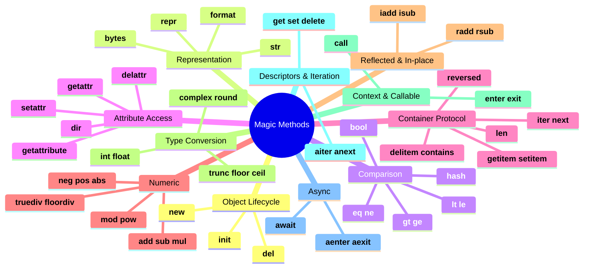
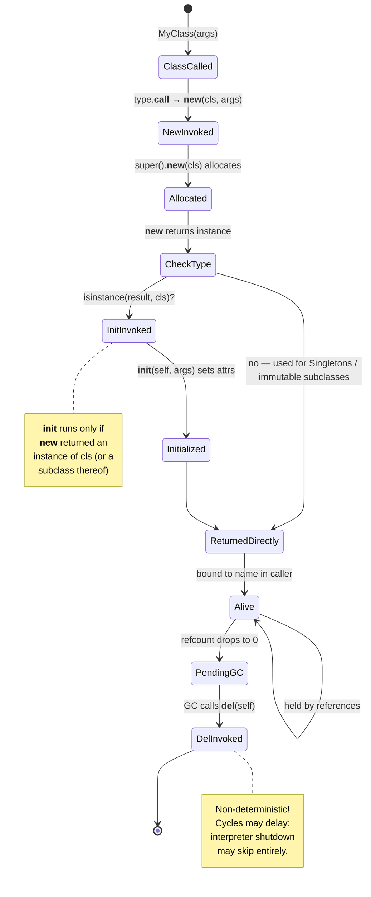
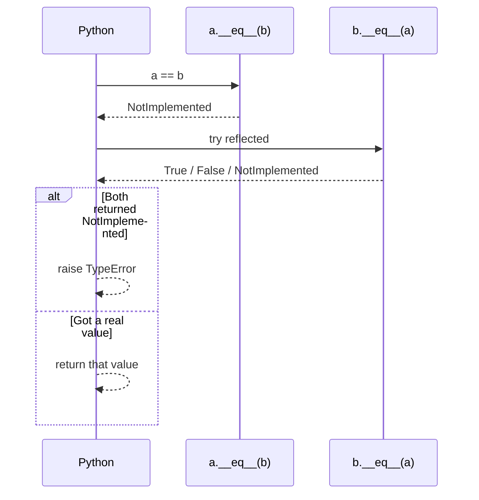
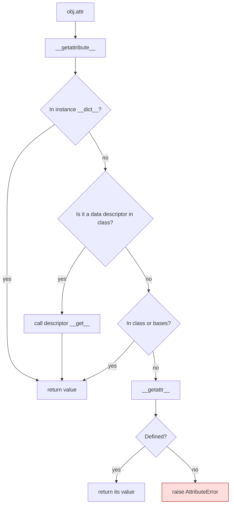
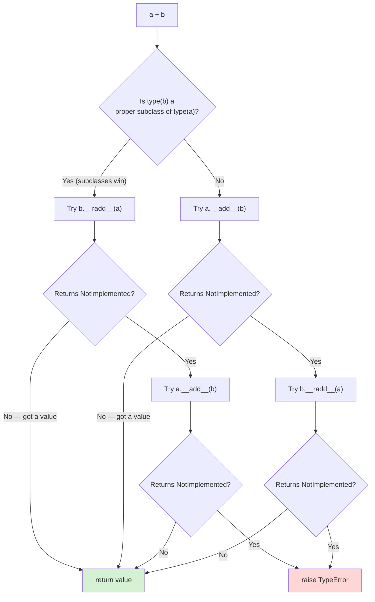
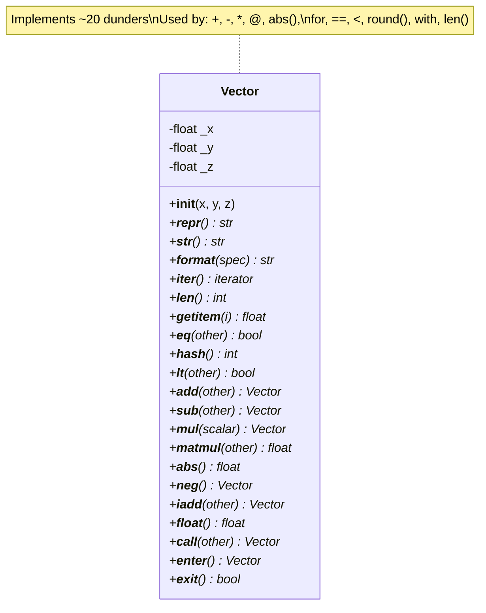
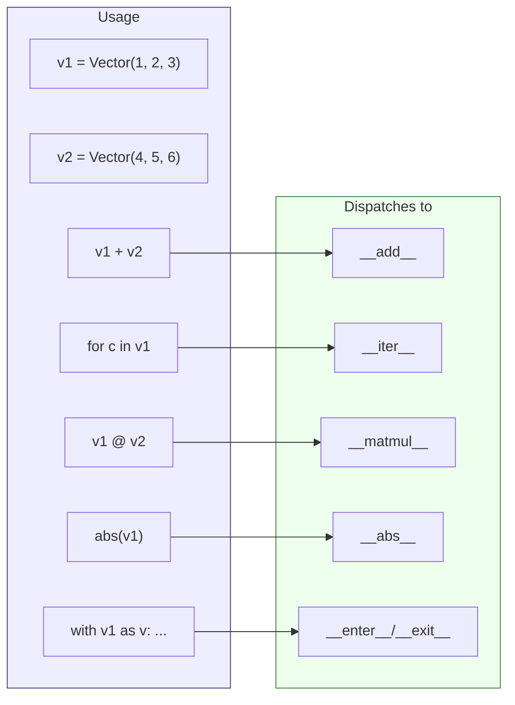
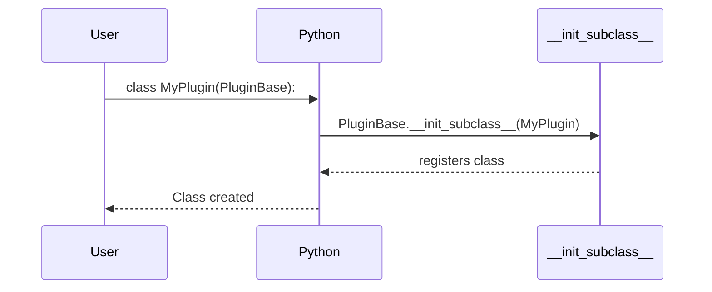
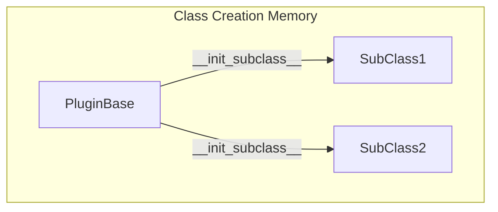

# Magic Methods — Python's Data Model

#python #magic-methods #dunder #data-model #operator-overloading #teaching #deep-dive

> [!quote] Tim Peters, The Zen of Python
> "If the implementation is hard to explain, it's a bad idea. If the implementation is easy to explain, it may be a good idea."

Python's **magic methods** — also called **dunder methods** (double underscore), **special methods**, or **data model methods** — are the hooks that let your user-defined classes integrate seamlessly with Python's built-in syntax and functions. When you write `len(x)`, `x + y`, `for item in x`, `with x as ctx:`, or `repr(x)`, Python is dispatching to a method on `x` whose name starts and ends with double underscores. Master these and your objects stop feeling like awkward strangers and start behaving like first-class citizens of the language.

This note is a complete reference, organized by category, with worked examples for every protocol and a final capstone `Vector` class that ties everything together. Prerequisites: [[Classes-And-Objects]], [[Attributes-And-Properties]], [[Methods-And-Functions]].

---

## 1. What Are Magic Methods?

Magic methods are **reserved method names** that Python looks up automatically when you use certain language constructs. You almost never call them directly — `x.__len__()` works, but the convention is `len(x)`, which calls `type(x).__len__(x)` internally.

### 1.1 The Naming Convention

Names of the form `__name__` are reserved by Python. The leading and trailing double underscores form what the community calls the **dunder** ("**d**ouble **under**score"). Examples: `__init__`, `__repr__`, `__add__`. Some dunders are *not* methods (`__name__`, `__doc__`, `__slots__`) — those are data attributes.

> [!warning] Common Student Misconception: "Dunder means private"
> Many students confuse `__name__` (dunder, public, *reserved by Python*) with `__name` (name-mangled, semi-private). They look similar but mean totally different things. **Dunder names are never private** — `__init__` is just as public as `init` would be, except Python reserves it for a specific protocol.

### 1.2 Why Magic Methods Exist

Without magic methods, Python would need separate syntax for "operations on built-ins" vs "operations on your classes". With them, **the same syntax works everywhere**:

```python
# All of these work on built-ins AND on your classes, if you implement the right dunders:
len(my_obj)            # __len__
repr(my_obj)           # __repr__
for x in my_obj: ...   # __iter__ / __next__
my_obj + other         # __add__
my_obj[key]            # __getitem__
with my_obj as x: ...  # __enter__ / __exit__
my_obj()               # __call__
```

This is the essence of Python's **data model**: protocols instead of syntax.



> [!tip] Teaching Tip
> When introducing magic methods, frame them as **"Python is asking your object a question"**. `len(x)` asks "how big are you?". `x + y` asks "what is the sum of you and y?". Your dunder answers that question. This framing makes the entire data model click instantly for students.

---

## 2. Object Initialization: `__new__`, `__init__`, `__del__`

```python
class Point:
    def __new__(cls, *args, **kwargs):
        print(f"__new__: creating {cls.__name__}")
        instance = super().__new__(cls)        # actually allocates
        return instance

    def __init__(self, x, y):
        print(f"__init__: initializing ({x}, {y})")
        self.x = x
        self.y = y

    def __del__(self):
        print(f"__del__: destroying {self}")
```

| Method | Role | Returns | Called by |
|---|---|---|---|
| `__new__(cls, ...)` | **Creates** the instance (allocates memory) | A new instance of `cls` | `cls(...)` — called *before* `__init__` |
| `__init__(self, ...)` | **Initializes** the instance (sets attributes) | `None` (ignored) | `cls(...)` — only if `__new__` returned an instance of `cls` |
| `__del__(self)` | Finalizer — called when refcount hits zero | `None` | Garbage collector (not deterministic!) |

### 2.1 When to Override `__new__`

Rarely. Common reasons:
- **Subclassing immutable types** (`tuple`, `str`, `int`) — `__init__` can't mutate them, so you must build them in `__new__`.
- **Singletons / interning** — `__new__` returns an existing instance instead of creating a new one.
- **Metaclass-level customization** of instance shape.

```python
class Singleton:
    _instance = None
    def __new__(cls, *args, **kwargs):
        if cls._instance is None:
            cls._instance = super().__new__(cls)
        return cls._instance

a = Singleton(); b = Singleton()
assert a is b   # True — same object
```



> [!warning] Common Student Misconception: `__del__` is a destructor
> In C++, a destructor is *guaranteed* to run when scope exits. **Python is not like that.** `__del__` is called by the garbage collector when refcount drops to zero — which may be never (cycles), may be delayed (PyPy, GIL interactions), and may run during interpreter shutdown when the world is half-torn-down. **Never** put critical cleanup (closing files, releasing locks) in `__del__` — use a context manager (`__enter__`/`__exit__`) instead. See §10.

---

## 3. String Representation: `__str__`, `__repr__`, `__format__`, `__bytes__`

| Method | Purpose | Audience | Fallback |
|---|---|---|---|
| `__repr__` | Unambiguous representation; ideally `eval`-able | Developers (REPL, `repr()`, debugger) | Default: `<ClassName object at 0x...>` |
| `__str__` | Readable, friendly description | End users (`print()`, `str()`) | Falls back to `__repr__` |
| `__format__` | Customizes `format(x, spec)` and f-strings | Both | Falls back to `__str__` |
| `__bytes__` | `bytes(x)` serialization | Byte-level protocols | `TypeError` |

```python
class Color:
    def __init__(self, r, g, b):
        self.r, self.g, self.b = r, g, b

    def __repr__(self):
        return f"Color(r={self.r}, g={self.g}, b={self.b})"

    def __str__(self):
        return f"#{self.r:02x}{self.g:02x}{self.b:02x}"

    def __format__(self, spec):
        if spec == "hex":
            return str(self)
        if spec == "rgb":
            return f"rgb({self.r}, {self.g}, {self.b})"
        return str(self)

    def __bytes__(self):
        return bytes([self.r, self.g, self.b])

c = Color(255, 128, 0)
print(repr(c))        # Color(r=255, g=128, b=0)
print(str(c))         # #ff8000
print(f"{c:rgb}")     # rgb(255, 128, 0)
print(bytes(c))       # b'\xff\x80\x00'
```

> [!tip] Teaching Tip: The `__repr__` Contract
> Tell students: "`__repr__` should look like a constructor call whenever possible — `Color(r=255, g=128, b=0)`. If you can copy-paste it back into Python and recreate the object, you've nailed it." This rule comes from the official Python docs.

---

## 4. Comparison: `__eq__`, `__ne__`, `__lt__`, `__le__`, `__gt__`, `__ge__`, `__hash__`, `__bool__`

Python 3 defines rich comparisons as **six separate methods** rather than a single `__cmp__`. This is more flexible (you can compare by different fields for `<` vs `==`) but more verbose. Use `@functools.total_ordering` to fill in the gaps.

```python
import functools

@functools.total_ordering
class Money:
    def __init__(self, amount, currency="USD"):
        self.amount = amount
        self.currency = currency

    def __eq__(self, other):
        if not isinstance(other, Money):
            return NotImplemented
        return self.amount == other.amount and self.currency == other.currency

    def __lt__(self, other):
        if not isinstance(other, Money):
            return NotImplemented
        if self.currency != other.currency:
            raise ValueError("cannot compare different currencies")
        return self.amount < other.amount

    def __hash__(self):
        return hash((self.amount, self.currency))

    def __bool__(self):
        return self.amount > 0
```

### 4.1 The `__eq__` / `__hash__` Contract

| If you define… | Then… |
|---|---|
| `__eq__` and not `__hash__` | The class becomes **unhashable** — `__hash__` is set to `None`. Cannot be in sets or used as dict keys. |
| `__hash__` and not `__eq__` | Hash works, but equality is identity (`is`). Usually a bug. |
| Both | Object is hashable. **Equal objects MUST have equal hashes** — derive the hash from the same fields used in `__eq__`. |

### 4.2 Returning `NotImplemented`

When a comparison doesn't make sense (e.g., `Money == "hello"`), return **`NotImplemented`** (the singleton, *not* `NotImplementedError`). Python will then try the reflected method on the other operand, and only raise `TypeError` if both sides refuse.

```python
def __eq__(self, other):
    if not isinstance(other, Money):
        return NotImplemented      # lets Python try other.__eq__(self)
    return self.amount == other.amount
```



> [!warning] Common Student Misconception: "I'll just compare by id in `__eq__`"
> If your `__eq__` returns `id(self) == id(other)`, you've reproduced the default behavior at the cost of breaking Liskov substitution, hashing, and dict semantics. If you don't have a domain meaning for equality, **don't define `__eq__`** — leave the default identity comparison alone.

---

## 5. Attribute Access: `__getattr__`, `__setattr__`, `__delattr__`, `__getattribute__`, `__dir__`

| Method | Triggered when… |
|---|---|
| `__getattribute__(name)` | **Every** attribute access (rarely overridden — fragile) |
| `__getattr__(name)` | Normal lookup failed (attribute doesn't exist) |
| `__setattr__(name, value)` | `self.x = value` |
| `__delattr__(name)` | `del self.x` |
| `__dir__()` | `dir(obj)` — used by IDEs for autocomplete |

```python
class Flexible:
    def __init__(self, **kwargs):
        # Bypass our __setattr__ for the initial seed
        object.__setattr__(self, "_data", dict(kwargs))

    def __getattr__(self, name):
        # Only called when normal lookup fails
        try:
            return self._data[name]
        except KeyError:
            raise AttributeError(name)

    def __setattr__(self, name, value):
        self._data[name] = value

    def __delattr__(self, name):
        del self._data[name]

    def __dir__(self):
        return list(super().__dir__()) + list(self._data)
```

### 5.1 The `__setattr__` Recursion Trap

```python
class Broken:
    def __setattr__(self, name, value):
        self.name = value          # INFINITE RECURSION!
        # because self.name = ... calls __setattr__ again
```

Fix it by routing through `object.__setattr__` or `super().__setattr__`:

```python
class Fixed:
    def __setattr__(self, name, value):
        if name == "name":
            raise ValueError("reserved")
        super().__setattr__(name, value)
```



> [!warning] Common Student Misconception: `__getattr__` is called for every access
> It's only called as a **fallback** when normal lookup fails. `__getattribute__` is the one called every time — and overriding it is slow and risky. Use `__getattr__` for "missing attribute" behavior (proxies, dynamic dispatch); reserve `__getattribute__` for serious meta-protocol work.

---

## 6. Container Protocol: `__len__`, `__getitem__`, `__setitem__`, `__delitem__`, `__contains__`, `__iter__`, `__next__`, `__reversed__`

```python
class Matrix:
    def __init__(self, rows):
        self._rows = rows

    def __len__(self):
        return len(self._rows)

    def __getitem__(self, key):
        if isinstance(key, tuple):
            r, c = key
            return self._rows[r][c]
        return self._rows[key]

    def __setitem__(self, key, value):
        if isinstance(key, tuple):
            r, c = key
            self._rows[r][c] = value
        else:
            self._rows[key] = value

    def __delitem__(self, key):
        del self._rows[key]

    def __contains__(self, item):
        return any(item in row for row in self._rows)

    def __iter__(self):
        for row in self._rows:
            yield from row

    def __reversed__(self):
        for row in reversed(self._rows):
            yield from reversed(row)
```

Once these are defined, your object **automatically works with** `len()`, indexing, `in`, `for`, `reversed()`, slicing, and even `zip()` and list unpacking.

### 6.1 Slicing

If you support `__getitem__`, slicing is passed to you as a `slice` object:

```python
def __getitem__(self, key):
    if isinstance(key, slice):
        return self._rows[key.start:key.stop:key.step]
    return self._rows[key]
```

### 6.2 Iteration: The Iterable vs Iterator Distinction

- An **iterable** implements `__iter__` (returns an iterator).
- An **iterator** implements `__next__` (returns the next item or raises `StopIteration`) *and* `__iter__` (returns `self`).

A common pattern: the container is iterable; a separate iterator class handles the state. Or, make `__iter__` a generator (which is its own iterator) — simpler, and the example above uses that approach.

> [!tip] Teaching Tip
> Have students implement a `Range` class that supports `for`, `in`, and `len()` without storing all values. They'll discover why iterable ≠ iterator and why `__contains__` can short-circuit instead of iterating.

---

## 7. Numeric Operations: `__add__`, `__sub__`, `__mul__`, `__truediv__`, `__floordiv__`, `__mod__`, `__pow__`, `__neg__`, `__pos__`, `__abs__`

```python
class Temperature:
    def __init__(self, kelvin):
        self.k = kelvin

    def __add__(self, other):
        if isinstance(other, Temperature):
            return Temperature(self.k + other.k)
        if isinstance(other, (int, float)):
            return Temperature(self.k + other)
        return NotImplemented

    def __sub__(self, other):
        if isinstance(other, Temperature):
            return Temperature(self.k - other.k)
        return NotImplemented

    def __mul__(self, scalar):
        if isinstance(scalar, (int, float)):
            return Temperature(self.k * scalar)
        return NotImplemented

    def __neg__(self):
        return Temperature(-self.k)

    def __abs__(self):
        return Temperature(abs(self.k))

    def __repr__(self):
        return f"Temperature({self.k}K)"
```

### 7.1 Reflected Operations: `__radd__`, `__rsub__`, etc.

When Python evaluates `a + b`:
1. It tries `type(a).__add__(a, b)`.
2. If that returns `NotImplemented` (or `a`'s type doesn't define `__add__`), it tries `type(b).__radd__(b, a)`.

This is how `1 + my_vector` works when `int` doesn't know about your class:

```python
class Vector:
    def __init__(self, *coords): self.coords = coords
    def __add__(self, other):
        if isinstance(other, Vector):
            return Vector(*(a + b for a, b in zip(self.coords, other.coords)))
        if isinstance(other, (int, float)):
            return Vector(*(c + other for c in self.coords))
        return NotImplemented
    __radd__ = __add__    # commutative — same impl works
```

### 7.2 In-Place Operations: `__iadd__`, `__isub__`, etc.

`x += y` first tries `type(x).__iadd__(x, y)`. If absent, it falls back to `x = x + y` (i.e., `__add__` + rebind).

```python
class MutableCounter:
    def __init__(self, n=0): self.n = n
    def __iadd__(self, other):
        self.n += other
        return self       # MUST return self, not None
```



> [!warning] Common Student Misconception: `__iadd__` mutates and that's it
> Whatever `__iadd__` returns is rebound to the name. If you return `None` (forgetting to `return self`), then `c += 1` sets `c = None`. Always return the (mutated) object from in-place operators.

| Operator | Method | Reflected | In-place |
|---|---|---|---|
| `+` | `__add__` | `__radd__` | `__iadd__` |
| `-` | `__sub__` | `__rsub__` | `__isub__` |
| `*` | `__mul__` | `__rmul__` | `__imul__` |
| `/` | `__truediv__` | `__rtruediv__` | `__itruediv__` |
| `//` | `__floordiv__` | `__rfloordiv__` | `__ifloordiv__` |
| `%` | `__mod__` | `__rmod__` | `__imod__` |
| `**` | `__pow__` | `__rpow__` | `__ipow__` |
| `@` | `__matmul__` | `__rmatmul__` | `__imatmul__` |

---

## 8. Type Conversion: `__int__`, `__float__`, `__complex__`, `__round__`, `__trunc__`, `__floor__`, `__ceil__`

```python
import math

class Fraction:
    def __init__(self, num, den=1):
        g = math.gcd(num, den)
        self.num, self.den = num // g, den // g

    def __int__(self):     return self.num // self.den
    def __float__(self):   return self.num / self.den
    def __complex__(self): return complex(self.__float__())
    def __round__(self, n=None):  return round(self.__float__(), n) if n else round(self.__float__())
    def __trunc__(self):   return math.trunc(self.__float__())
    def __floor__(self):   return math.floor(self.__float__())
    def __ceil__(self):    return math.ceil(self.__float__())
```

| Built-in | Method |
|---|---|
| `int(x)` | `__int__` |
| `float(x)` | `__float__` |
| `complex(x)` | `__complex__` |
| `round(x, n)` | `__round__` |
| `math.trunc(x)` | `__trunc__` |
| `math.floor(x)` | `__floor__` |
| `math.ceil(x)` | `__ceil__` |

---

## 9. Context Managers: `__enter__`, `__exit__`

```python
class Timer:
    def __enter__(self):
        import time
        self.start = time.perf_counter()
        return self                       # value bound by `as`

    def __exit__(self, exc_type, exc_val, exc_tb):
        import time
        self.elapsed = time.perf_counter() - self.start
        # Return True to suppress the exception, False/None to propagate
        return False

with Timer() as t:
    sum(range(1_000_000))
print(f"took {t.elapsed:.3f}s")
```

`__exit__` receives exception info if one was raised inside the `with` block. Return `True` to **suppress** the exception (rare — be careful!), `False` or `None` to let it propagate.

> [!tip] Teaching Tip
> For most use cases, `contextlib.contextmanager` is much simpler than writing a class with `__enter__`/`__exit__`:
> ```python
> from contextlib import contextmanager
> @contextmanager
> def timer():
>     import time; start = time.perf_counter()
>     yield
>     print(f"took {time.perf_counter() - start:.3f}s")
> ```
> Reach for the dunder version only when you need a reusable, stateful object or to integrate with a class hierarchy.

---

## 10. Callable Objects: `__call__`

If a class defines `__call__`, its instances can be invoked like functions:

```python
class Polynomial:
    def __init__(self, *coeffs):
        self.coeffs = coeffs
    def __call__(self, x):
        result = 0
        for power, c in enumerate(self.coeffs):
            result += c * (x ** power)
        return result

p = Polynomial(1, 2, 3)        # 1 + 2x + 3x^2
print(p(0))                    # 1
print(p(2))                    # 17
```

Use cases: function-like objects with state (memoizers, neural-net layers), strategy objects, decorators implemented as classes.

---

## 11. Descriptors: `__get__`, `__set__`, `__delete__`

Descriptors customize what happens when an attribute is accessed *through a class*. They are the mechanism behind `property`, `classmethod`, `staticmethod`, and ORM fields. See [[Descriptors]] for the full treatment; here's a teaser:

```python
class TypedField:
    def __init__(self, type_):
        self.type_ = type_
    def __set_name__(self, owner, name):
        self.name = name
    def __get__(self, instance, owner):
        return instance.__dict__.get(self.name)
    def __set__(self, instance, value):
        if not isinstance(value, self.type_):
            raise TypeError(f"{self.name} must be {self.type_.__name__}")
        instance.__dict__[self.name] = value

class User:
    name = TypedField(str)
    age  = TypedField(int)
```

---

## 12. Async Magic Methods

| Method | Used by |
|---|---|
| `__aiter__` / `__anext__` | `async for` |
| `__await__` | `await obj` (makes your object awaitable) |
| `__aenter__` / `__aexit__` | `async with` |

```python
class AsyncCounter:
    def __init__(self, stop): self.stop = stop
    def __aiter__(self): self.i = 0; return self
    async def __anext__(self):
        if self.i >= self.stop: raise StopAsyncIteration
        await asyncio.sleep(0.01)
        self.i += 1
        return self.i

async def main():
    async for n in AsyncCounter(3):
        print(n)        # 1, 2, 3
```

---

## 13. Capstone: A Complete `Vector` Class

Putting it all together — a 3D vector supporting arithmetic, iteration, equality, hashing, formatting, length, and context-managed mutation logging:

```python
import math
from functools import total_ordering

class Vector:
    """A 3D vector demonstrating ~20 dunder methods."""

    __slots__ = ("_x", "_y", "_z")          # see [[Slots-And-Memory]]

    def __init__(self, x=0.0, y=0.0, z=0.0):
        self._x, self._y, self._z = float(x), float(y), float(z)

    # ---- Representation ----
    def __repr__(self):
        return f"Vector({self._x}, {self._y}, {self._z})"

    def __str__(self):
        return f"<{self._x}, {self._y}, {self._z}>"

    def __format__(self, spec):
        if spec == "polar":     # spherical: r, theta, phi
            r = math.sqrt(self._x**2 + self._y**2 + self._z**2)
            theta = math.acos(self._z / r) if r else 0.0
            phi = math.atan2(self._y, self._x)
            return f"r={r:.3f}, θ={theta:.3f}, φ={phi:.3f}"
        return str(self)

    # ---- Iteration & container ----
    def __iter__(self): yield from (self._x, self._y, self._z)
    def __len__(self):  return 3
    def __getitem__(self, i): return (self._x, self._y, self._z)[i]
    def __contains__(self, v): return v in (self._x, self._y, self._z)

    # ---- Equality & hashing ----
    def __eq__(self, other):
        if not isinstance(other, Vector): return NotImplemented
        return (self._x, self._y, self._z) == (other._x, other._y, other._z)
    def __hash__(self):
        return hash((self._x, self._y, self._z))

    # ---- Ordering (by magnitude) ----
    def _mag(self): return math.sqrt(self._x**2 + self._y**2 + self._z**2)
    def __lt__(self, other):
        if not isinstance(other, Vector): return NotImplemented
        return self._mag() < other._mag()

    # ---- Arithmetic ----
    def __add__(self, other):
        if isinstance(other, Vector):
            return Vector(self._x + other._x, self._y + other._y, self._z + other._z)
        return NotImplemented
    __radd__ = __add__

    def __sub__(self, other):
        if isinstance(other, Vector):
            return Vector(self._x - other._x, self._y - other._y, self._z - other._z)
        return NotImplemented

    def __mul__(self, scalar):
        if isinstance(scalar, (int, float)):
            return Vector(self._x * scalar, self._y * scalar, self._z * scalar)
        return NotImplemented
    __rmul__ = __mul__

    def __matmul__(self, other):           # dot product
        if isinstance(other, Vector):
            return self._x*other._x + self._y*other._y + self._z*other._z
        return NotImplemented

    def __abs__(self): return self._mag()
    def __neg__(self): return Vector(-self._x, -self._y, -self._z)
    def __pos__(self): return Vector(+self._x, +self._y, +self._z)

    # ---- In-place ----
    def __iadd__(self, other):
        if isinstance(other, Vector):
            self._x += other._x; self._y += other._y; self._z += other._z
            return self
        return NotImplemented

    # ---- Type conversion ----
    def __float__(self): return float(self._mag())
    def __round__(self, n=None):
        return Vector(round(self._x, n), round(self._y, n), round(self._z, n))

    # ---- Callable: project onto another vector ----
    def __call__(self, other):
        return (self @ other) / (abs(other) ** 2) * other

    # ---- Context manager: temporary scaling ----
    def __enter__(self): return self
    def __exit__(self, *exc): return False
```





---

## 14. The Coercion Protocol — When Two Types Meet

When you write `a + b` where `a` and `b` are different types, Python uses a precise coercion protocol. Understanding it explains otherwise-mysterious behaviors:

1. **If `type(b)` is a *proper subclass* of `type(a)`**, Python tries `b.__radd__(a)` *first* (so subclasses can override parent behavior).
2. Otherwise, Python tries `a.__add__(b)` first.
3. If that returns `NotImplemented`, Python tries `b.__radd__(a)`.
4. If both return `NotImplemented`, Python raises `TypeError`.

This is why your `Vector + np.array(...)` sometimes behaves differently than `np.array(...) + Vector` — NumPy arrays define `__radd__` aggressively and may consume your object before your `__add__` ever runs.

```python
class MyNum:
    def __init__(self, v): self.v = v
    def __add__(self, other):
        print(f"MyNum.__add__({other!r})")
        if isinstance(other, (int, MyNum)):
            return MyNum(self.v + (other.v if isinstance(other, MyNum) else other))
        return NotImplemented
    def __radd__(self, other):
        print(f"MyNum.__radd__({other!r})")
        return self.__add__(other)

MyNum(1) + 2        # calls __add__(2)
2 + MyNum(1)        # int.__add__ returns NotImplemented → calls MyNum.__radd__(2)
```

> [!warning] Common Student Misconception: "I'll just raise TypeError in `__add__`"
> Don't. Returning `NotImplemented` lets Python try the other operand's reflected method, which is critical for cross-type arithmetic. Raising `TypeError` directly bypasses the protocol and breaks legitimate interop.

## 15. The Truthiness Protocol: `__bool__` and `__len__`

When Python evaluates `if x:` or `bool(x)`, it follows a two-step protocol:

1. If `type(x)` defines `__bool__`, use its return value (must be `True` or `False`).
2. Else if `type(x)` defines `__len__`, use `len(x) != 0`.
3. Else, default to `True` (every object is truthy unless it opts out).

```python
class LinkedList:
    def __init__(self): self.head = None
    def __len__(self): return 0 if self.head is None else 1 + len(self.head.rest)
    def __bool__(self): return self.head is not None   # O(1)!

ll = LinkedList()
if not ll: print("empty")    # "empty" — uses __bool__
```

The default `__bool__` from `__len__` would be O(n) for our linked list — traversing the whole list just to check emptiness. Defining `__bool__` directly makes the check O(1). Whenever you implement a container, consider whether `__bool__` should be defined separately from `__len__`.

## 16. Reverse Operators: When Commutativity Matters

For commutative operators (`+`, `*`), you can simply alias `__radd__ = __add__`. But for non-commutative ones (`-`, `/`, `**`), the reflected version must reverse the operand order:

```python
class Vector:
    # ... (other methods)
    def __sub__(self, other):
        if isinstance(other, (int, float)):
            return Vector(self.x - other, self.y - other, self.z - other)
        return NotImplemented

    def __rsub__(self, other):
        # 5 - vector  →  vector with (5-x, 5-y, 5-z)
        if isinstance(other, (int, float)):
            return Vector(other - self.x, other - self.y, other - self.z)
        return NotImplemented
```

Forgetting to reverse the operands in `__rsub__` is one of the most common bugs in numeric class implementations.

## 17. Copying: `__copy__` and `__deepcopy__`

The `copy` module looks for two special methods:

| Method | Called by | Should do |
|---|---|---|
| `__copy__(self)` | `copy.copy(obj)` | Return a *shallow* copy: new instance, same attribute values |
| `__deepcopy__(self, memo)` | `copy.deepcopy(obj)` | Return a *deep* copy: recursively copied attributes |

```python
import copy

class Matrix:
    def __init__(self, rows): self.rows = rows
    def __copy__(self):
        # Shallow: new Matrix, same row lists
        return Matrix(self.rows)
    def __deepcopy__(self, memo):
        # Deep: new Matrix, recursively copied rows
        return Matrix(copy.deepcopy(self.rows, memo))

m = Matrix([[1, 2], [3, 4]])
shallow = copy.copy(m)         # shares row lists
deep = copy.deepcopy(m)        # fully independent
m.rows[0][0] = 99
print(shallow.rows[0][0])      # 99 — shared!
print(deep.rows[0][0])         # 1  — independent
```

The `memo` dict tracks already-copied objects to handle cycles (e.g., a graph node that points to itself). Always pass it through to nested `deepcopy` calls.

## 18. Pickling: `__getstate__`, `__setstate__`, `__reduce__`

Python's `pickle` module uses these to serialize objects:

- `__reduce__()` returns a tuple describing how to reconstruct the object (callable, args, state).
- `__getstate__()` returns a serializable representation of the object's state.
- `__setstate__(state)` restores state from a previously `__getstate__`-d value.

```python
import pickle

class Connection:
    def __init__(self, host, port):
        self.host = host
        self.port = port
        self.sock = self._connect()    # NOT picklable!

    def __getstate__(self):
        # Strip the non-picklable socket
        state = self.__dict__.copy()
        del state["sock"]
        return state

    def __setstate__(self, state):
        self.__dict__.update(state)
        self.sock = self._connect()    # re-establish on unpickle

c = Connection("localhost", 5432)
data = pickle.dumps(c)         # works — socket excluded
c2 = pickle.loads(data)        # reconnects automatically
```

In Python 3.11+, the default pickle protocol (protocol 5) handles `__slots__` automatically. For older protocols, you must manually merge slot state with dict state in `__getstate__`/`__setstate__`.

## 19. Best Practices Cheat Sheet

1. **Don't call dunders directly.** Write `len(x)`, not `x.__len__()`. The built-in functions add safety checks (e.g., `len` requires `__len__` to return a non-negative `int`).
2. **`__eq__` ⇒ `__hash__`** (or explicitly set `__hash__ = None` if unhashable).
3. **`__lt__` ⇒ `@functools.total_ordering`** so you don't write six methods.
4. **`__repr__` first, `__str__` only if the audience is different.** Most classes only need `__repr__`.
5. **`return NotImplemented`** in arithmetic when the operand type is unknown — Python will try the reflected method.
6. **`__del__` is unreliable** — use context managers for cleanup.
7. **Don't override `__getattribute__`** unless you really know why; `__getattr__` is enough for 95% of cases.
8. **`__init__` should not return anything.** If you want to control construction, override `__new__`.
9. **Define `__slots__`** for high-cardinality classes once the API is stable — see [[Slots-And-Memory]].
10. **Use `@dataclass`** to auto-generate the boilerplate dunders for data containers — see [[Dataclasses]].

> [!success] Final Teaching Tip
> Magic methods are Python's way of saying "your objects are not second-class". When students grasp that `len(x)` is *just* sugar for a protocol call, they start seeing the language as a set of composable protocols rather than a pile of built-ins. That mindset shift is the gateway to writing Pythonic libraries.

---

## See Also

- [[Descriptors]] — the mechanism behind `property`, `classmethod`, `staticmethod`.
- [[Metaclasses]] — `type` itself is the class that creates classes; metaclasses customize that.
- [[Dataclasses]] — auto-generates `__init__`, `__repr__`, `__eq__`, `__hash__` for you.
- [[Abstract-Base-Classes]] — `ABCMeta` defines hooks like `__subclasshook__`.
- [[Attributes-And-Properties]] — `property` is a descriptor wrapping `__get__`/`__set__`.
- [[Polymorphism]] — magic methods are how Python expresses ad-hoc polymorphism.

## Appendix: Quick Reference — All Common Dunders

| Category | Methods |
|---|---|
| Lifecycle | `__new__`, `__init__`, `__del__` |
| Representation | `__repr__`, `__str__`, `__format__`, `__bytes__`, `__ascii__` |
| Comparison | `__eq__`, `__ne__`, `__lt__`, `__le__`, `__gt__`, `__ge__`, `__hash__`, `__bool__` |
| Attribute access | `__getattr__`, `__getattribute__`, `__setattr__`, `__delattr__`, `__dir__` |
| Container | `__len__`, `__getitem__`, `__setitem__`, `__delitem__`, `__contains__`, `__iter__`, `__next__`, `__reversed__`, `__missing__` |
| Numeric (binary) | `__add__`, `__sub__`, `__mul__`, `__matmul__`, `__truediv__`, `__floordiv__`, `__mod__`, `__divmod__`, `__pow__`, `__lshift__`, `__rshift__`, `__and__`, `__or__`, `__xor__` |
| Reflected | `__radd__`, `__rsub__`, `__rmul__`, `__rmatmul__`, `__rtruediv__`, `__rfloordiv__`, `__rmod__`, `__rdivmod__`, `__rpow__`, `__rlshift__`, `__rrshift__`, `__rand__`, `__ror__`, `__rxor__` |
| In-place | `__iadd__`, `__isub__`, `__imul__`, `__imatmul__`, `__itruediv__`, `__ifloordiv__`, `__imod__`, `__ipow__`, `__ilshift__`, `__irshift__`, `__iand__`, `__ior__`, `__ixor__` |
| Unary | `__neg__`, `__pos__`, `__abs__`, `__invert__` |
| Conversion | `__int__`, `__float__`, `__complex__`, `__round__`, `__trunc__`, `__floor__`, `__ceil__`, `__index__` |
| Context | `__enter__`, `__exit__` |
| Callable | `__call__` |
| Descriptors | `__get__`, `__set__`, `__delete__`, `__set_name__` |
| Iteration / async | `__iter__`, `__next__`, `__aiter__`, `__anext__`, `__await__`, `__aenter__`, `__aexit__` |
| Copy / pickle | `__copy__`, `__deepcopy__`, `__getstate__`, `__setstate__`, `__reduce__`, `__reduce_ex__` |
| Type metaclass | `__class__`, `__mro__`, `__subclasshook__`, `__instancecheck__`, `__subclasscheck__` |

## Appendix: A Tracing Mixin for Teaching

When teaching, it's incredibly powerful to show students *exactly* which dunder is called when. Here's a mixin that traces every dunder invocation:

```mermaid
mindmap
  root((Dunder Categories))
    Construction
      __new__
        allocates instance
        rare — immutable subclasses, singletons
      __init__
        initializes attributes
        returns None
      __del__
        finalizer
        non-deterministic — avoid for cleanup
    Display
      __repr__
        dev-facing, eval-able
        also used by str as fallback
      __str__
        user-facing
      __format__
        f-strings and format()
      __bytes__
        bytes() conversion
    Equality & Ordering
      __eq__ __ne__ __lt__ __le__ __gt__ __ge__
        rich comparisons
        functools.total_ordering helps
      __hash__
        must agree with __eq__
      __bool__
        truthiness
    Attribute Access
      __getattribute__
        every access — slow, fragile
      __getattr__
        only when missing — proxies
      __setattr__ __delattr__
        assignment hooks
      __dir__
        IDE autocomplete
    Container Protocol
      __len__ __getitem__ __setitem__ __delitem__
      __contains__ __iter__ __next__ __reversed__
      __missing__
    Numeric
      Binary: __add__ __sub__ __mul__ __truediv__ ...
      Reflected: __radd__ __rsub__ ...
      In-place: __iadd__ __isub__ ...
      Unary: __neg__ __pos__ __abs__ __invert__
    Context & Callable
      __enter__ __exit__
        with statement
      __call__
        make instances callable
    Descriptors
      __get__ __set__ __delete__
      __set_name__
        powers property, classmethod, staticmethod
    Async
      __aiter__ __anext__
      __await__ __aenter__ __aexit__
    Copy & Pickle
      __copy__ __deepcopy__
      __getstate__ __setstate__
      __reduce__ __reduce_ex__
```

```python
class TracingMixin:
    """Mix into any class to log dunder calls. For teaching only."""
    def _log(self, name, *args):
        print(f"  → {type(self).__name__}.{name}({', '.join(repr(a) for a in args)})")

    def __repr__(self): self._log("__repr__"); return super().__repr__()
    def __str__(self):  self._log("__str__");  return super().__str__()
    def __len__(self):  self._log("__len__");  return super().__len__()
    def __eq__(self, o):  self._log("__eq__", o);  return super().__eq__(o)
    def __hash__(self):   self._log("__hash__");   return super().__hash__()
    def __getitem__(self, k): self._log("__getitem__", k); return super().__getitem__(k)
    def __iter__(self):   self._log("__iter__");   return super().__iter__()
    # ... add more as needed
```

> [!tip] Teaching Tip
> Project the tracing mixin onto a `list` subclass at the start of a dunder lesson. As you type `len(xs)`, `xs[0]`, `for x in xs:`, `xs == other`, students see the dunder names stream by. The connection between syntax and protocol becomes visceral.

## Appendix: Common Pitfalls Summary

| Pitfall | Symptom | Fix |
|---|---|---|
| `__init__` returns a value | `TypeError: __init__() should return None` | Remove the `return` |
| `__eq__` without `__hash__` | Object unhashable, can't use as dict key | Define `__hash__` from same fields |
| `__lt__` returns `NotImplemented` for unknown type | Sorting raises `TypeError` | Filter unknown types before sort |
| `__getattr__` recurses infinitely | Stack overflow | Use `object.__getattribute__` or check `name.startswith("_")` |
| `__setattr__` recurses infinitely | Stack overflow | Route through `super().__setattr__` |
| `__del__` accesses torn-down globals | `NameError` at shutdown | Don't use `__del__` for cleanup; use context manager |
| Forgot `return self` in `__iadd__` | `x += 1` sets `x = None` | Always return the (mutated) instance |
| `__enter__` returns nothing | `with X() as y:` gives `y = None` | Return `self` (or the resource) from `__enter__` |
| `__next__` doesn't raise `StopIteration` | Infinite loop | Raise `StopIteration` at end |
| `__bool__` returns truthy non-bool | Confusing `if` behavior | Always return a real `bool` |

> [!success] Final Teaching Tip
> Magic methods are Python's way of saying "your objects are not second-class". When students grasp that `len(x)` is *just* sugar for a protocol call, they start seeing the language as a set of composable protocols rather than a pile of built-ins. That mindset shift is the gateway to writing Pythonic libraries.

## References

- Python Language Reference, §3.3 — "Special method names"
- "Python Cookbook" (Beazley & Jones), Chapter 8 — "Classes and Objects"
- "Fluent Python" (Ramalho), Chapter 1, 11, 13 — the data model
- PEP 3119 — Abstract Base Classes (uses several dunders for `__instancecheck__`)
- PEP 3141 — A Type Hierarchy for Numbers (numeric dunders)

## 14. Class Initialization and Indexing: `__init_subclass__`, `__class_getitem__`

### `__init_subclass__`

Introduced to simplify class registration and setup without using metaclasses.

```python
class PluginBase:
    subclasses = []

    def __init_subclass__(cls, **kwargs):
        super().__init_subclass__(**kwargs)
        cls.subclasses.append(cls)

class MyPlugin(PluginBase):
    pass

print(PluginBase.subclasses) # [<class '__main__.MyPlugin'>]
```

### `__class_getitem__`

Used for generic types (PEP 585) in Python 3.9+.

```python
class Box:
    def __class_getitem__(cls, item):
        return f"{cls.__name__}[{item.__name__}]"

print(Box[int]) # Box[int]
```

### Expanded `__repr__`

`__repr__` should be unambiguous and ideally valid Python code.
```python
class Point:
    def __init__(self, x, y):
        self.x = x
        self.y = y
    
    def __repr__(self):
        return f"{self.__class__.__name__}(x={self.x!r}, y={self.y!r})"
```

### Memory Allocation & Code Execution Traces



### Practice Exercises
1. Create a registry using `__init_subclass__` that validates subclasses have a specific attribute.
2. Implement `__class_getitem__` for a custom generic `Stack` class.


## Deep Dive: Advanced Magic Methods

### `__init_subclass__`
Allows a class to customize the initialization of its subclasses. This is a simpler alternative to metaclasses for registering plugins or enforcing subclass constraints.

```python
class PluginBase:
    subclasses = []
    
    def __init_subclass__(cls, **kwargs):
        super().__init_subclass__(**kwargs)
        cls.subclasses.append(cls)
```

### `__class_getitem__`
Used to enable generic types (e.g., `list[int]`). Usually implemented via `classmethod` on the metaclass or using `__class_getitem__` on the class itself to support PEP 585.

```python
class MyContainer:
    def __class_getitem__(cls, item):
        return f"{cls.__name__}[{item}]"
```

### `__repr__` vs `__str__`
`__repr__` is for developers (unambiguous, ideally `eval()`-able), `__str__` is for users (readable).

### Memory Diagram


### Code Execution Trace (`__init_subclass__`)
1. Class `SubClass1(PluginBase):` body is evaluated.
2. `PluginBase.__init_subclass__(SubClass1)` is called by the type system.
3. `SubClass1` is appended to `PluginBase.subclasses`.

### Interactive Practice Exercise
**Exercise:** Create a `ValidatorBase` class that uses `__init_subclass__` to ensure any subclass defines a `validate(self)` method. If it doesn't, raise a `TypeError` during subclass creation.
