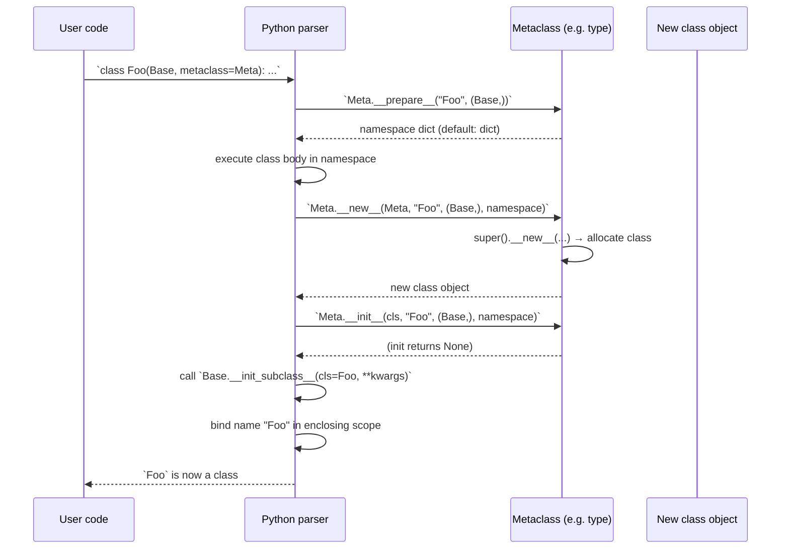

> [!tip] Prerequisite
> Read [[classes-and-objects]] (especially the "everything is an object" section and the class/instance/metaclass triangle) and [[methods]] before tackling this. Metaclasses are deep magic — make sure you understand "normal" classes first.

> [!danger] Metaclasses are deep magic
> Most production code does **not** need a custom metaclass. Read §9 first. The Python docs themselves recommend: *"metaclasses are deeper magic than 99% of users should ever worry about. If you wonder whether you need them, you don't."* — Tim Peters

## 1. "Classes Are Objects Too"

In Python, `class` is an executable statement. When it runs, Python:

1. Collects the class body into a namespace dict.
2. Determines the **metaclass** (usually `type`).
3. Calls the metaclass with `(name, bases, namespace)` to *construct* the class object.
4. Binds the class object to the class name in the enclosing scope.

That's right: a **class is an instance of its metaclass**.

```python
class Dog:
    pass

print(type(Dog))         # <class 'type'>     ← Dog is an instance of type
print(type(Dog()).__class__)   # <class 'Dog'> ← Dog instances are instances of Dog
print(isinstance(Dog, type))    # True
```

## 2. The Metaclass ↔ Class ↔ Instance Triangle

```mermaid
graph TB
    subgraph Meta["Metaclass layer"]
        T["`type`<br/>(default metaclass)"]
        M["`YourMeta`<br/>(optional custom metaclass)"]
    end
    subgraph Class["Class layer"]
        A["`Animal`<br/>instance of `type`"]
        D["`Dog`<br/>instance of `type`"]
    end
    subgraph Inst["Instance layer"]
        r["`rex`<br/>instance of `Dog`"]
    end
    T -- "creates" --> A
    T -- "creates" --> D
    D -. "subclass of" .-> A
    A -- "instantiates" --> r
    D -- "instantiates" --> r
    M -- "would create<br/>if used" --> D
    M -. "subclass of" .-> T
```

Reading this diagram:

- `type` is the **default metaclass**. Every class is an instance of `type` unless you say otherwise.
- `type` is itself an instance of `type` (the loop at the top).
- A custom metaclass `YourMeta` must itself be a subclass of `type` (or callable-compatible).
- `rex` is an instance of `Dog`; `Dog` is an instance of `type`. Two different relationships, but Python uses the same machinery (`__call__` → `__new__` → `__init__`) for both.

## 3. `type(name, bases, dict)` — The Three-Argument Form

The `type()` builtin has two personalities:

1. **One-argument form** — `type(obj)` returns the type of `obj`.
2. **Three-argument form** — `type(name, bases, dict)` *creates a new class*.

These two are equivalent:

```python
# Statement form
class Dog:
    species = "Canis familiaris"
    def bark(self):
        return "woof"

# Functional form (what Python does under the hood)
Dog = type(
    "Dog",                              # name
    (),                                 # base classes
    {
        "species": "Canis familiaris",
        "bark": lambda self: "woof",
        "__qualname__": "Dog",
    },
)

d = Dog()
print(d.bark())          # woof
print(Dog.species)       # Canis familiaris
```

> [!note] This is exactly how `collections.namedtuple` works
> `namedtuple("Point", ["x", "y"])` calls `type("Point", (tuple,), {...})` to construct a brand-new class on the fly. The same trick is used by `dataclasses.make_dataclass`, `typing.NamedTuple`, and many ORMs.

## 4. How Python Determines the Metaclass

When you write `class Foo(Base1, Base2, metaclass=YourMeta): ...`, Python walks this algorithm:

1. If `metaclass=` is given, use it.
2. Otherwise, look at the *metaclasses* of the base classes.
3. If exactly one metaclass is found among the bases (after walking up their `type(...)`), use it.
4. If multiple *incompatible* metaclasses are found (neither is a subclass of the other), raise `TypeError`.
5. If none of the above apply, use `type`.

```python
class MetaA(type): pass
class MetaB(type): pass

class A(metaclass=MetaA): pass
class B(metaclass=MetaB): pass

# class C(A, B): pass   # ❌ metaclass conflict: MetaA and MetaB are incompatible
```

To resolve such conflicts, you create a *combined* metaclass that subclasses both:

```python
class MetaAB(MetaA, MetaB): pass

class C(A, B, metaclass=MetaAB): pass     # ✅ works
```

## 5. What a Metaclass Is

A **metaclass** is simply *a class whose instances are classes*. The default is `type`. A custom metaclass is a subclass of `type` that overrides one or more of:

- `__new__(mcs, name, bases, namespace)` — create the class object.
- `__init__(cls, name, bases, namespace)` — initialize the class object.
- `__call__(mcs, name, bases, namespace)` — runs when `class X(...):` is parsed (advanced; rarely overridden).
- `__prepare__(mcs, name, bases, **kwargs)` — returns the namespace dict to use while the class body executes. Lets you use an `OrderedDict`, `dict` subclass, or a custom mapping that records insertion order, types, etc.

> [!note] Naming convention
> Metaclasses are conventionally named with a `Meta` suffix or with `mcs`/`mcls` as the `cls` parameter name (to distinguish from regular `cls` in classmethods).

## 6. Custom Metaclass: Auto-Registering Plugins

A classic metaclass use case: every subclass of `Plugin` is automatically registered. (Modern Python has a simpler way — `__init_subclass__` — covered in §7.)

```python
from __future__ import annotations


class PluginMeta(type):
    """Metaclass that registers every concrete subclass."""

    def __new__(mcs, name, bases, namespace):
        cls = super().__new__(mcs, name, bases, namespace)
        # Skip the base class itself (which has no Plugin base yet)
        if bases:                                    # only subclasses
            if not getattr(cls, "abstract", False):  # opt-out flag
                PluginMeta.registry[cls.__name__] = cls
        return cls

    # Class-level state on the metaclass
    registry: dict[str, type] = {}


class Plugin(metaclass=PluginMeta):
    abstract = True       # don't register the base itself
    name: str

    def run(self) -> str:
        raise NotImplementedError


class GreetPlugin(Plugin):
    name = "greet"
    def run(self) -> str:
        return "Hello!"

class ByePlugin(Plugin):
    name = "bye"
    def run(self) -> str:
        return "Goodbye!"


print(list(PluginMeta.registry))    # ['GreetPlugin', 'ByePlugin']

# Instantiate by name
for cls in PluginMeta.registry.values():
    print(f"{cls.__name__}: {cls().run()}")
# GreetPlugin: Hello!
# ByePlugin: Goodbye!
```

> [!tip] Why use a metaclass here instead of `__init_subclass__`?
> Historically, this was the only way. Today, `__init_subclass__` (§7) handles 95% of these cases without a metaclass. Reserve metaclasses for when you genuinely need cross-cutting class-level behavior that `__init_subclass__` cannot express (e.g., enforcing that *every* class in a hierarchy has certain attributes, or modifying the class namespace *before* it becomes the class).

## 7. `__init_subclass__` — The Simpler Alternative (Python 3.6+)

`__init_subclass__` is a **classmethod** automatically called on the parent whenever a subclass is created. It gives you most of the power of a metaclass *without* writing one.

```python
from __future__ import annotations


class Plugin:
    registry: dict[str, type["Plugin"]] = {}

    def __init_subclass__(cls, name: str | None = None, **kwargs) -> None:
        super().__init_subclass__(**kwargs)        # cooperative
        key = name or cls.__name__
        Plugin.registry[key] = cls

    def run(self) -> str:
        raise NotImplementedError


class GreetPlugin(Plugin, name="greet"):
    def run(self) -> str:
        return "Hello!"

class ByePlugin(Plugin, name="bye"):
    def run(self) -> str:
        return "Goodbye!"


print(list(Plugin.registry))    # ['greet', 'bye']
for cls in Plugin.registry.values():
    print(cls().run())
```

Notice:

- Subclasses can pass *keyword arguments* in the class declaration: `class Foo(Plugin, name="foo")`. These flow into `__init_subclass__`.
- You **must** call `super().__init_subclass__(**kwargs)` for cooperative multiple inheritance.
- No metaclass required — simpler, easier to debug, easier to type-check.

> [!tip] Default to `__init_subclass__`
> Reach for `__init_subclass__` first. Only fall back to a metaclass when you've exhausted its capabilities.

## 8. `__class_getitem__` — Generics Support

`__class_getitem__` is what makes `list[int]`, `dict[str, int]`, etc. work. It's a classmethod-like special method (technically an implicit classmethod) called when you subscript a class.

```python
from __future__ import annotations
from typing import Generic, TypeVar


T = TypeVar("T")


class Stack(Generic[T]):
    """A stack that supports `Stack[int]`-style subscripting."""

    def __init__(self) -> None:
        self._items: list[T] = []

    def push(self, item: T) -> None:
        self._items.append(item)

    def pop(self) -> T:
        return self._items.pop()


# Subscripting works because Generic[T] defines __class_getitem__:
s: Stack[int] = Stack()
s.push(1)
s.push(2)
print(s.pop())           # 2
```

### 8.1 A custom `__class_getitem__`

You don't need `Generic` — you can define your own:

```python
class Regex:
    """Pretends to be a parameterized regex type, like `Regex["\\d+"]`."""

    def __class_getitem__(cls, pattern: str) -> "_RegexAlias":
        return _RegexAlias(pattern)


class _RegexAlias:
    def __init__(self, pattern: str) -> None:
        self.pattern = pattern

    def __repr__(self) -> str:
        return f"Regex[{self.pattern!r}]"


print(Regex[r"\d+"])    # Regex['\\d+']
```

> [!note] Aliases at type-check time
> `__class_getitem__` returns an *alias object* (typically `types.GenericAlias`), not a new class. It's mostly used by type checkers. At runtime, `list[int] is list` is `False`, but instances of `list[int]` are still just `list` instances.

## 9. ABCs as a Common Metaclass Use Case

`abc.ABC` uses `ABCMeta`, a metaclass, to enforce abstractness:

```python
from abc import ABC, abstractmethod


class Shape(ABC):
    @abstractmethod
    def area(self) -> float: ...

    @abstractmethod
    def perimeter(self) -> float: ...


# Shape()                              # ❌ TypeError: can't instantiate abstract class
# class Bad(Shape): pass               # Bad() also fails — area/perimeter not implemented

class Square(Shape):
    def __init__(self, side: float) -> None:
        self.side = side
    def area(self) -> float:
        return self.side ** 2
    def perimeter(self) -> float:
        return 4 * self.side


s = Square(3)
print(s.area())      # 9.0
```

The `ABCMeta` metaclass intercepts class creation to collect `__abstractmethods__` and refuses to instantiate any class whose set is non-empty. This is one of the most defensible metaclass uses in the standard library — and you don't need to *write* the metaclass; just inherit from `ABC`.

> [!note] `ABC` vs `Protocol`
> `ABC` provides **nominal** abstract base classes (subclasses must explicitly inherit). `typing.Protocol` (PEP 544) provides **structural** subtyping — see [[protocols-and-type-hints]]. They serve different needs.

## 10. `__prepare__` — Controlling the Class Namespace

`__prepare__` returns the mapping used as the namespace while the class body executes. The default is a plain `dict`, which (since Python 3.7) is insertion-ordered. You can return a custom mapping to:

- Track field definition order (older Python).
- Disallow certain names.
- Auto-decorate methods.
- Implement "field" declarations like Django/SQLAlchemy.

```python
class Field:
    def __init__(self, type_: type) -> None:
        self.type_ = type_
        self.name: str = ""

class FieldDict(dict):
    """Namespace that converts typed annotations into Field instances."""
    def __setitem__(self, key, value):
        if isinstance(value, type):
            value = Field(value)
        super().__setitem__(key, value)


class ModelMeta(type):
    @classmethod
    def __prepare__(mcs, name, bases, **kwargs):
        return FieldDict()

    def __new__(mcs, name, bases, namespace, **kwargs):
        cls = super().__new__(mcs, name, bases, dict(namespace))
        # Collect fields
        cls._fields = {k: v for k, v in namespace.items()
                       if isinstance(v, Field)}
        for k, f in cls._fields.items():
            f.name = k
        return cls


class Model(metaclass=ModelMeta):
    pass


class User(Model):
    id: int
    name: str


print([f.name for f in User._fields.values()])   # ['id', 'name']
print(User._fields["id"].type_)                   # <class 'int'>
```

> [!warning] This is the kind of thing that gives metaclasses a reputation
> It's elegant when it works and a nightmare to debug when it doesn't. Reserve `__prepare__` for libraries (ORMs, serializers, validation frameworks) where the payoff is large.

## 11. Mermaid: Class Creation Pipeline



## 12. Worked Example: Enforcing Class Conventions

Suppose every "service" class in your codebase must define a `name` attribute and a `handle` method. A metaclass can enforce this at *class definition time*, before any instance is created.

```python
from __future__ import annotations


class ServiceMeta(type):
    def __new__(mcs, name, bases, namespace):
        cls = super().__new__(mcs, name, bases, namespace)
        # Skip the base class itself
        if bases and not namespace.get("abstract", False):
            if "name" not in namespace:
                raise TypeError(f"Service {name!r} must define a 'name' attribute")
            if "handle" not in namespace and not any(
                hasattr(b, "handle") for b in bases
            ):
                raise TypeError(f"Service {name!r} must define a 'handle' method")
        return cls


class Service(metaclass=ServiceMeta):
    abstract = True

    def handle(self, request: dict) -> dict:
        raise NotImplementedError


class GreetService(Service):
    name = "greet"
    def handle(self, request: dict) -> dict:
        return {"message": f"Hello, {request.get('name', 'world')}!"}


# Try to define a bad service:
try:
    class BadService(Service):
        pass
except TypeError as e:
    print(e)            # Service 'BadService' must define a 'name' attribute
```

> [!tip] Same effect with `__init_subclass__`
> This example can be (and probably should be) implemented with `__init_subclass__`. Use a metaclass only if you also need to *modify* the class namespace, *return a different class* from `__new__`, or share behavior across an unrelated hierarchy.

## 13. When You *Really* Need a Metaclass

> [!warning] The 1% case
> Reach for a custom metaclass only when:

1. You need to **modify the class namespace before the class is created** (e.g., `__prepare__` with a custom mapping, or transforming methods at definition time).
2. You need to **return a different object** from `class X:` than the class itself (rare — used for things like enum metaclasses that return existing members).
3. You're building a **library/framework** where many independent classes need consistent cross-cutting behavior, and decorators + `__init_subclass__` are insufficient.
4. You need a metaclass **for ABCs or framework plug-in systems** that interoperate with other metaclass-based code (e.g., your class must *also* be an `ABC`).

Even then, prefer composition: many "I need a metaclass" needs are better solved by a class decorator or `__init_subclass__`.

## 14. Metaclass Pitfalls

> [!warning] Pitfall 1: Metaclass conflict in multiple inheritance
> If two base classes use different metaclasses (neither subclass of the other), you cannot subclass both — Python raises `TypeError`. Resolve by writing a combined metaclass.

> [!warning] Pitfall 2: Performance and import-time cost
> Metaclass `__new__` runs at *class definition time* (import time). Heavy work there slows startup and complicates testing.

> [!warning] Pitfall 3: Tooling support
> Static type checkers (mypy, pyright) understand metaclasses *less well* than `__init_subclass__`. IDEs may not auto-complete metaclass-injected attributes.

> [!warning] Pitfall 4: Inheritance surprises
> A metaclass is *inherited* by subclasses. Subclassing a metaclass-using class means your subclass is also shaped by the metaclass — sometimes desirable, sometimes surprising.

> [!warning] Pitfall 5: Debugging is harder
> Stack traces through `__new__`/`__init__`/`__call__` on a metaclass are notoriously hard to read. If you can solve a problem without a metaclass, do.

## 15. Key Takeaways

> [!tip] In five sentences
> 1. **Classes are instances of their metaclass**, and the default metaclass is `type`.
> 2. The `type(name, bases, dict)` three-argument form is the *functional* equivalent of the `class` statement — it's how `namedtuple` and friends build classes dynamically.
> 3. **`__init_subclass__`** is the modern, simple alternative for "do something when a subclass is defined" — prefer it over a custom metaclass.
> 4. **`__class_getitem__`** is how `list[int]`-style generic subscription works; you usually get it free by inheriting `typing.Generic`.
> 5. Write a **custom metaclass** only when `__init_subclass__`, class decorators, and ordinary inheritance cannot express what you need — and document it heavily.

## 16. Practice Exercises

> [!example] Easy
> 1. Create a class `Cat` using the **functional** form of `type()` — no `class` statement. Add a `meow(self)` method. Verify `Cat().meow()` returns `"meow"`.
> 2. Use `__init_subclass__` to print a message every time a subclass of `Animal` is created. Subclass it three times and confirm three messages.

> [!example] Medium
> 3. Implement an auto-registering `Plugin` system using `__init_subclass__` and a `name=` keyword in the class declaration. Iterate the registry and call `.run()` on each.
> 4. Build a `SingletonMeta` metaclass that ensures only one instance of any class using it is ever created. Verify `A() is A()` for a class `A(metaclass=SingletonMeta)`.
> 5. Define a class with `__class_getitem__` that returns a "tagged" alias object. Use it as `Tagged["user"]` and verify the alias carries the tag.

> [!example] Hard
> 6. Reimplement the auto-registering-plugin metaclass (§6) using `__init_subclass__` instead. Compare the two implementations: which is shorter? Which has fewer moving parts? Which would you ship?
> 7. Write a metaclass `ValidatedFieldsMeta` that, at class creation time, scans the namespace for `Field` instances, attaches their `name`, and exposes `cls._fields` as a dict. Then build a tiny `Model` base class with `id: int` and `name: str` fields, and verify `_fields` is populated correctly.
> 8. Build a metaclass that **forbids** defining methods whose names start with a double underscore (excluding dunders). Subclass a class using this metaclass and confirm `def __secret(self)` raises `TypeError` at class definition time. (Yes, this overlaps with name-mangling — explain why you might or might not want this.)

## 17. Related Notes

- [[classes-and-objects]] — the class/instance/metaclass triangle, object lifecycle
- [[methods]] — `super()`, MRO; metaclasses use the same machinery
- [[magic-methods]] — `__init_subclass__` and `__class_getitem__` are dunder methods *on classes*, not instances
- [[dataclasses-and-attrs]] — `@dataclass` is a class decorator (alternative to metaclasses for code generation)
- [[protocols-and-type-hints]] — `Generic[T]`, `TypeVar`, and structural vs nominal typing
- [[abstraction]] — `abc.ABC` is the standard-library showcase of metaclasses
- [[inheritance]] — how metaclass inheritance differs from class inheritance


## Deep Dive: Metaclasses

### Understanding Metaclasses
A metaclass is the class of a class. By default, classes are instances of `type`.
Metaclasses allow you to intercept class creation (via `__new__` and `__init__` on the metaclass).

```python
class SingletonMeta(type):
    _instances = {}
    
    def __call__(cls, *args, **kwargs):
        if cls not in cls._instances:
            cls._instances[cls] = super().__call__(*args, **kwargs)
        return cls._instances[cls]

class Database(metaclass=SingletonMeta):
    pass
```

### Memory Allocation Diagram
```mermaid
flowchart TD
    type[type metaclass] --> SingletonMeta
    SingletonMeta -- instantiates --> Database[Database Class]
    Database -- instantiates --> db1[db1 Instance]
    Database -- instantiates --> db2[db2 Instance (same ref)]
```

### Code Execution Trace
1. `class Database(metaclass=SingletonMeta):` is evaluated.
2. `SingletonMeta.__new__` and `__init__` construct the `Database` class object.
3. `Database()` is called. This triggers `SingletonMeta.__call__`.
4. `__call__` intercepts instantiation, returning a cached instance if available.

### Interactive Practice Exercise
**Exercise:** Write a metaclass `NoMixedCaseMeta` that checks all method names defined in a class. If any method name contains uppercase letters, raise a `TypeError` during class creation.
