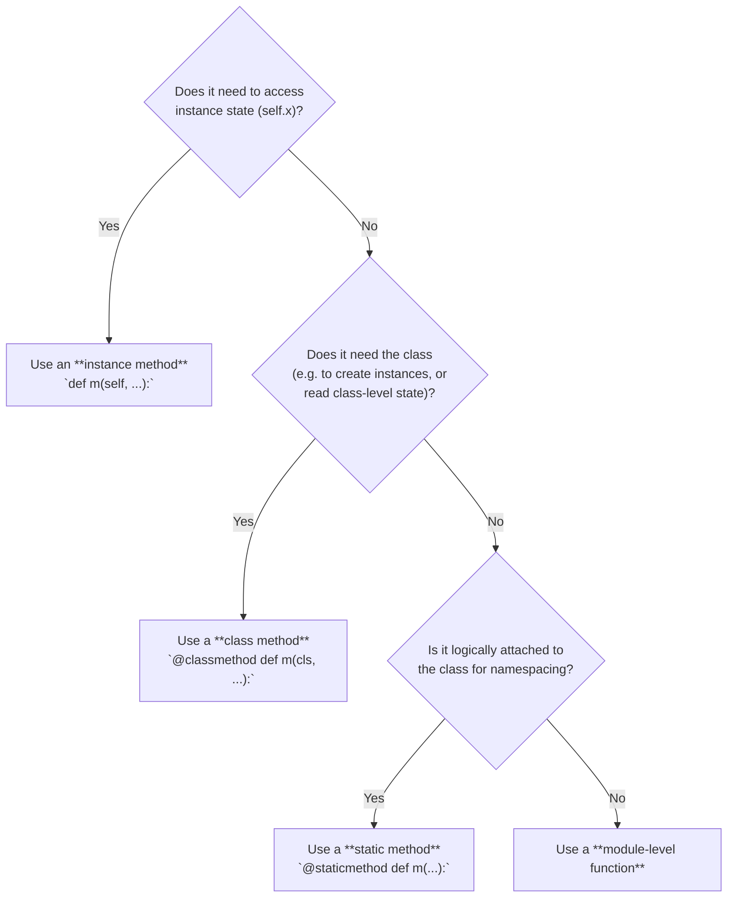
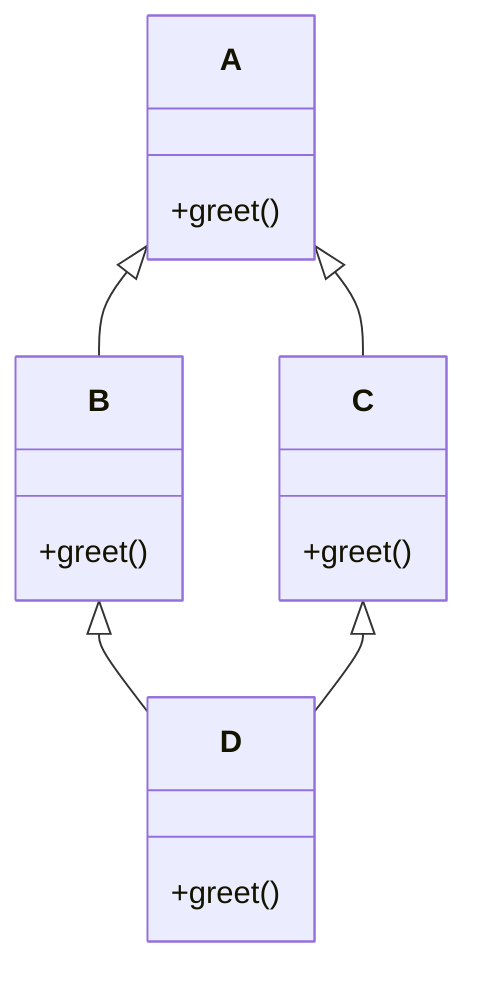
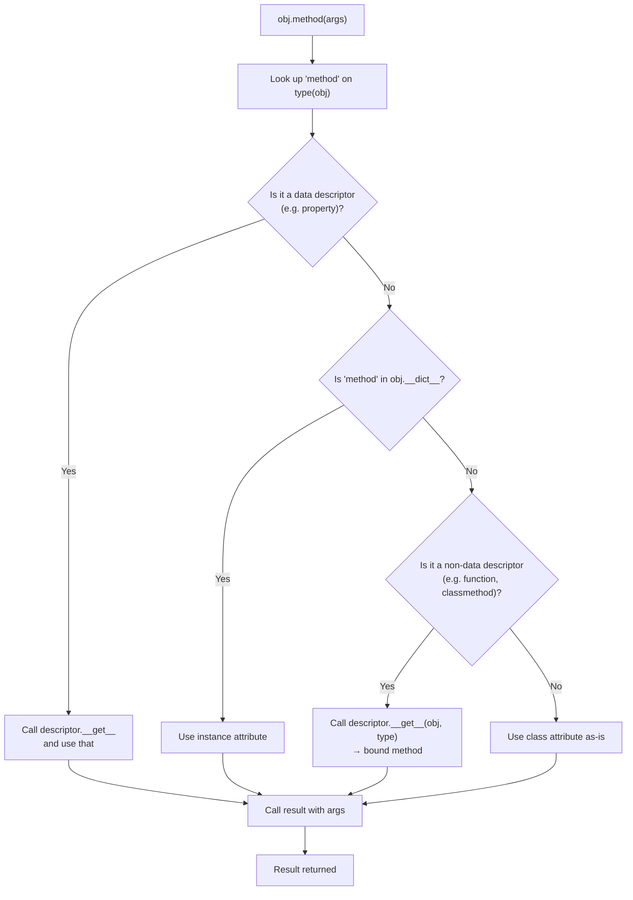

> [!tip] Prerequisite
> Read [[classes-and-objects]] first — especially the part about `self` being an explicit first parameter, not a keyword.

## 1. The Three Flavours of Methods

Python has three distinct kinds of "method" you can attach to a class:

| Kind            | Decorator        | First param | Receives            | Typical use                                |
| --------------- | ---------------- | ----------- | ------------------- | ------------------------------------------ |
| Instance method | *(none)*         | `self`      | the instance        | Read/write instance state, call other methods |
| Class method    | `@classmethod`   | `cls`       | the class           | Alternative constructors, class-level state |
| Static method   | `@staticmethod`  | *(none)*    | nothing             | Helper functions that live in the class's namespace |

```python
from __future__ import annotations


class Widget:
    registry: list[type["Widget"]] = []

    def __init__(self, label: str) -> None:
        self.label = label

    # Instance method
    def render(self) -> str:
        return f"<Widget label={self.label!r}>"

    # Class method — alternative constructor
    @classmethod
    def from_config(cls, config: dict) -> "Widget":
        return cls(label=config["label"])

    # Class method — class-level state
    @classmethod
    def register(cls) -> None:
        Widget.registry.append(cls)

    # Static method — pure helper
    @staticmethod
    def is_valid_label(label: str) -> bool:
        return bool(label) and len(label) <= 64
```

## 2. Instance Methods in Depth

An instance method is just a regular function defined inside a class body. The descriptor protocol (see §6) automatically wraps it so that `instance.method(args)` becomes `Class.method(instance, args)`.

```python
class Counter:
    def __init__(self, start: int = 0) -> None:
        self._n = start

    def increment(self, by: int = 1) -> "Counter":
        self._n += by
        return self            # enable chaining

    def value(self) -> int:
        return self._n

c = Counter()
c.increment().increment(5).increment()
print(c.value())   # 7
```

> [!note] Methods can return `self` for chaining
> This is the *fluent interface* pattern. Common in SQLAlchemy, Pandas (sometimes), and Builder objects.

### 2.1 Methods are looked up at call time

Python does **late binding** — `c.increment` looks up `increment` on `Counter` (and its bases) *each time it's accessed*. You can rebind it:

```python
def loud_increment(self, by: int = 1):
    print(f"adding {by}")
    self._n += by
    return self

Counter.increment = loud_increment   # monkey-patch!
c.increment(10)                       # adding 10
```

## 3. Class Methods

A `@classmethod` receives the class (or subclass) it was called on as its first parameter. The classic use cases:

1. **Alternative constructors** — `dict.fromkeys(...)`, `datetime.fromisoformat(...)`.
2. **Class-level state** — counters, registries, configuration.
3. **Polymorphic constructors** — when subclass `B` calls `cls(...)`, `cls` is `B`, not the base class.

### 3.1 Alternative constructor: `Counter.from_string`

```python
class Counter:
    def __init__(self, start: int = 0) -> None:
        self._n = start

    @classmethod
    def from_string(cls, text: str) -> "Counter":
        """`Counter.from_string("10,20,30")` → Counter(60)."""
        total = sum(int(part) for part in text.split(",") if part.strip())
        return cls(total)        # cls, not Counter — so subclasses work!

    def value(self) -> int:
        return self._n

c = Counter.from_string("10,20,30")
print(c.value())   # 60


class DoubleCounter(Counter):
    pass

d = DoubleCounter.from_string("1,2,3")
print(type(d))     # <class 'DoubleCounter'>  ← polymorphic!
```

> [!tip] Why `cls(total)` instead of `Counter(total)`
> Using `cls` instead of the literal class name means subclasses get instances of *their* type. This is essential for inheritance-friendly code.

### 3.2 Class-level state: counting instances

```python
class Session:
    _active: int = 0

    def __init__(self, user: str) -> None:
        self.user = user
        Session._active += 1

    def close(self) -> None:
        Session._active -= 1

    @classmethod
    def active_count(cls) -> int:
        return cls._active


s1 = Session("alice")
s2 = Session("bob")
print(Session.active_count())   # 2
s1.close()
print(Session.active_count())   # 1
```

## 4. Static Methods

A `@staticmethod` is essentially a function that lives in a class's namespace. It receives neither `self` nor `cls`. Use it when:

- The function is *logically* associated with the class.
- But it doesn't need instance or class state.

```python
class MathUtils:
    @staticmethod
    def is_prime(n: int) -> bool:
        if n < 2:
            return False
        if n % 2 == 0:
            return n == 2
        i = 3
        while i * i <= n:
            if n % i == 0:
                return False
            i += 2
        return True

    @staticmethod
    def gcd(a: int, b: int) -> int:
        while b:
            a, b = b, a % b
        return abs(a)


print(MathUtils.is_prime(17))   # True
print(MathUtils.gcd(54, 24))    # 6
```

> [!warning] Static methods are often a smell
> If your "static method" doesn't reference the class at all, ask whether it should just be a module-level function. Use `@staticmethod` only when the *namespace grouping* itself communicates something useful.

## 5. Decision Guide: Which Method Kind?



## 6. The Descriptor Protocol (Briefly)

When you write:

```python
class C:
    def f(self):
        return 42
```

`f` is a plain function. Functions implement `__get__`, which makes them **descriptors**. Accessing `instance.f` invokes `f.__get__(instance, C)`, returning a *bound method* object:

```python
class C:
    def f(self): return 42

c = C()
print(type(C.f))     # <class 'function'>
print(type(c.f))     # <class 'method'>   ← bound method

m = c.f
print(m.__self__)    # <C object at 0x...>
print(m.__func__)    # <function C.f at 0x...>
print(m())           # 42  (= m.__func__(m.__self__))
```

`@classmethod` and `@staticmethod` are themselves descriptors:

- `classmethod.__get__(instance, cls)` returns a bound method whose first arg is `cls`.
- `staticmethod.__get__(...)` returns the underlying function unchanged.

This is why you can call `Widget.from_config(cfg)` *without* an instance — class methods are usable on both the class and instances.

> [!note] Why this matters
> Understanding descriptors unlocks properties (`@property`), `super()`'s behavior, custom attribute validators, and most of the Python "magic" in the standard library. See [[properties]] and [[magic-methods]].

## 7. `super()` in Depth

`super()` returns a *proxy object* that dispatches method calls to the next class in the **MRO**. It's not "the parent class" — it's "the next class in MRO order from *this* one."

### 7.1 The two calling styles

```python
class Base:
    def greet(self):
        return "Base.greet"

class Derived(Base):
    def greet(self):
        # Old style (Python 2):
        # return super(Derived, self).greet() + " + Derived.greet"
        # New style (Python 3, in a method):
        return super().greet() + " + Derived.greet"

print(Derived().greet())   # Base.greet + Derived.greet
```

### 7.2 Cooperative multiple inheritance

This is where `super()` shines — and where it bites the unwary. Consider the **diamond**:



```python
class A:
    def greet(self) -> str:
        return "A"

class B(A):
    def greet(self) -> str:
        return f"B({super().greet()})"

class C(A):
    def greet(self) -> str:
        return f"C({super().greet()})"

class D(B, C):
    def greet(self) -> str:
        return f"D({super().greet()})"

print(D().greet())   # D(B(C(A)))
```

The order `D → B → C → A` is the **MRO** of `D`. `super()` follows this order, *not* the inheritance arrows directly. This is why `B.greet`'s `super().greet()` actually calls `C.greet` (not `A.greet`) — because `C` comes after `B` in `D`'s MRO.

### 7.3 Cooperative `__init__`

When using multiple inheritance, **every class in the chain must call `super().__init__(...)`** for cooperation to work:

```python
class Base:
    def __init__(self, **kwargs):
        super().__init__()        # forward to object.__init__
        self.base_data = kwargs.pop("base_data", None)

class Mixin1:
    def __init__(self, **kwargs):
        super().__init__(**kwargs)        # pass along
        self.m1_data = kwargs.pop("m1_data", None)

class Mixin2:
    def __init__(self, **kwargs):
        super().__init__(**kwargs)
        self.m2_data = kwargs.pop("m2_data", None)

class Combined(Mixin1, Mixin2, Base):
    def __init__(self, **kwargs):
        super().__init__(**kwargs)

c = Combined(base_data="x", m1_data="y", m2_data="z")
print(c.base_data, c.m1_data, c.m2_data)   # x y z
```

> [!tip] Use `**kwargs` for cooperative hierarchies
> Accept `**kwargs`, pop what you need, and forward the rest. This is the most robust pattern for `super()`-based `__init__` in diamond hierarchies.

### 7.4 `super()` outside methods (the two-arg form)

`super()` without arguments only works inside a class body because the compiler fills in `__class__` and the first local. In other contexts, use the explicit form:

```python
class D(B, C):
    pass

d = D()
# Outside a method, you must pass both arguments:
print(super(D, d).greet())    # B(C(A))
```

## 8. Method Resolution Order (MRO)

Python uses **C3 linearization** to compute the MRO. You can inspect it:

```python
print(D.__mro__)
# (<class 'D'>, <class 'B'>, <class 'C'>, <class 'A'>, <class 'object'>)

print([c.__name__ for c in D.mro()])
# ['D', 'B', 'C', 'A', 'object']

print(D.__bases__)   # direct bases only: (<class 'B'>, <class 'C'>)
```

Or use `help(D)` to see the MRO section.

### 8.1 C3 in one paragraph

The MRO of a class `X(B1, B2, ..., Bn)` is `X` followed by the merge of:

- the MRO of `B1`, the MRO of `B2`, …, the MRO of `Bn`, and
- the list `[B1, B2, ..., Bn]`.

The merge takes the head of the first list that is not in the tail of any other list, repeatedly. If no such head exists, the class definition raises `TypeError: Cannot create a consistent method resolution`.

### 8.2 A failing example

```python
class X: pass
class Y: pass
class A(X, Y): pass
class B(Y, X): pass
# class C(A, B): pass   # TypeError: inconsistent MRO!
```

`A` wants `X` before `Y`; `B` wants `Y` before `X`. Combining them violates both orderings — Python refuses to construct such a class.

## 9. Mermaid: How Python Dispatches a Method Call



> [!note] This is the full attribute lookup order
> 1. Data descriptor on the class (and bases) — `property`, `__slots__`, custom `__set__`.
> 2. Instance `__dict__`.
> 3. Non-data descriptor on the class (functions, classmethods, staticmethods).
> 4. Class `__dict__` plain values.
> 5. `__getattr__` if defined (last-resort hook).

## 10. Worked Example: A `Counter` with Class Method

```python
from __future__ import annotations


class Counter:
    """A counter with both instance and class methods."""

    _global_count: int = 0     # shared across all instances

    def __init__(self, start: int = 0) -> None:
        self._value = start
        Counter._global_count += 1

    def increment(self, by: int = 1) -> "Counter":
        self._value += by
        return self

    def reset(self) -> None:
        self._value = 0

    @property
    def value(self) -> int:
        return self._value

    @classmethod
    def from_string(cls, text: str) -> "Counter":
        """`from_string("10,20,30")` → Counter(60)."""
        total = sum(int(x) for x in text.split(",") if x.strip())
        return cls(total)

    @classmethod
    def global_count(cls) -> int:
        return cls._global_count

    @staticmethod
    def is_valid_increment(by: int) -> bool:
        return isinstance(by, int) and by > 0

    def __repr__(self) -> str:
        return f"Counter(value={self._value})"


c1 = Counter.from_string("10,20,30")
c2 = Counter(5)
c1.increment(3)
print(c1)                            # Counter(value=63)
print(Counter.global_count())        # 2
print(Counter.is_valid_increment(5)) # True
```

## 11. Worked Example: A `super()` Chain in a Plugin System

```python
from __future__ import annotations


class Plugin:
    """Base plugin: subclasses override hooks and call super()."""

    def name(self) -> str:
        return "plugin"

    def load(self) -> None:
        print(f"[{self.name()}] load: base")


class LoggingPlugin(Plugin):
    def name(self) -> str:
        return f"logging({super().name()})"

    def load(self) -> None:
        super().load()
        print(f"[{self.name()}] load: logging enabled")


class CachingPlugin(Plugin):
    def name(self) -> str:
        return f"caching({super().name()})"

    def load(self) -> None:
        super().load()
        print(f"[{self.name()}] load: caching enabled")


class FeaturePlugin(LoggingPlugin, CachingPlugin):
    """Composes logging + caching."""
    def name(self) -> str:
        return f"feature({super().name()})"

    def load(self) -> None:
        super().load()
        print(f"[{self.name()}] load: feature ready")


print("MRO:", [c.__name__ for c in FeaturePlugin.__mro__])
# MRO: ['FeaturePlugin', 'LoggingPlugin', 'CachingPlugin', 'Plugin', 'object']

FeaturePlugin().load()
```

Sample output:

```
MRO: ['FeaturePlugin', 'LoggingPlugin', 'CachingPlugin', 'Plugin', 'object']
[logging(caching(feature(plugin)))] load: base
[logging(caching(feature(plugin)))] load: caching enabled
[logging(caching(feature(plugin)))] load: logging enabled
[feature(logging(caching(feature(plugin))))] load: feature ready
```

Notice how each `super().name()` walks the MRO, accumulating decorators. The order of `load()` calls follows MRO top-to-bottom; the order of `name()` decorators is applied outside-in.

## 12. Pitfalls

> [!warning] Pitfall 1: Forgetting `self` in method definitions
> ```python
> class Bad:
>     def greet():       # missing self
>         return "hi"
> Bad().greet()          # TypeError: greet() takes 0 positional arguments but 1 was given
> ```

> [!warning] Pitfall 2: Calling `super().__init__()` and ignoring return
> `__init__` must return `None`. `super().__init__()` returns `None`, so `return super().__init__()` is harmless — but never *chain* it as `return super().__init__(...).something()`.

> [!warning] Pitfall 3: Assuming `super()` calls "the parent"
> In multiple inheritance, `super()` calls the *next class in MRO*, which may be a sibling, not a parent. Always think in terms of MRO.

> [!warning] Pitfall 4: Calling `@classmethod` via instance
> `instance.class_method()` works, but `cls` will be `type(instance)` — usually what you want, but surprising if you're subclassing.

> [!warning] Pitfall 5: Overriding a method without calling `super()`
> If a base class relies on a method doing setup work (e.g. `__init__`, `__enter__`), forgetting `super()` silently breaks the contract. Use code review and `abc.ABC` to enforce.

## 13. Key Takeaways

> [!tip] In five sentences
> 1. Use **instance methods** for behavior tied to instance state; **class methods** for alternative constructors and class-level concerns; **static methods** only for namespaced helpers.
> 2. **`super()`** dispatches to the *next class in the MRO*, not necessarily the parent — design for cooperative inheritance.
> 3. **MRO** is C3-linearized; inspect it via `Class.__mro__` or `help(Class)`.
> 4. Methods work because **functions are descriptors**; the same machinery powers `@property` and `@classmethod`.
> 5. Use **`cls(...)`** (not `BaseClass(...)`) inside class methods so subclasses get the right type.

## 14. Practice Exercises

> [!example] Easy
> 1. Add a `@classmethod` called `from_csv` to the `Counter` class that builds a counter from a one-line CSV string.
> 2. Add a `@staticmethod` `is_balanced(text)` to a `StringUtils` class that returns whether `text` has balanced parentheses.

> [!example] Medium
> 3. Build a `Shape` base class with a `area()` instance method, a `@classmethod` `unit_circle()` that returns a `Circle` of radius 1, and a `@staticmethod` `pi()` returning `math.pi`.
> 4. Reproduce the diamond-inheritance `super()` example with `greet()` and verify the MRO output matches the diagram.
> 5. Define classes `A`, `B(A)`, `C(A)`, `D(B, C)` and inspect `D.__mro__`. Then define `E(C, B)` and try to create `F(D, E)` — what error do you get, and why?

> [!example] Hard
> 6. Implement a cooperative `__init__` chain for a `Persona` system: `Person`, `Employee(Person)`, `Manager(Employee)`, each accepting `**kwargs` and forwarding extras via `super()`. Create a `Manager` and verify all fields are set.
> 7. Build a plugin registry using `@classmethod` and `__init_subclass__` (see [[metaclasses-and-class-creation]]) so that any subclass of `Plugin` auto-registers itself. Then iterate over the registry and call `.load()` on each.
> 8. Write a `LoggedList(list)` that overrides `append` and `extend` to log the call before delegating to `super()`. Confirm it still behaves like a `list` (passes `isinstance(x, list)`).

## 15. Related Notes

- [[classes-and-objects]] — `self`, instance vs class attributes, lifecycle
- [[properties]] — `@property` is built on the same descriptor machinery
- [[magic-methods]] — dunder methods are a special category of instance methods
- [[inheritance]] — conceptual treatment of inheritance and overriding
- [[polymorphism]] — why `super()` and MRO enable polymorphic dispatch
- [[metaclasses-and-class-creation]] — `__init_subclass__` as a metaclass alternative
- [[dataclasses-and-attrs]] — `@dataclass` generates `__init__` for you
