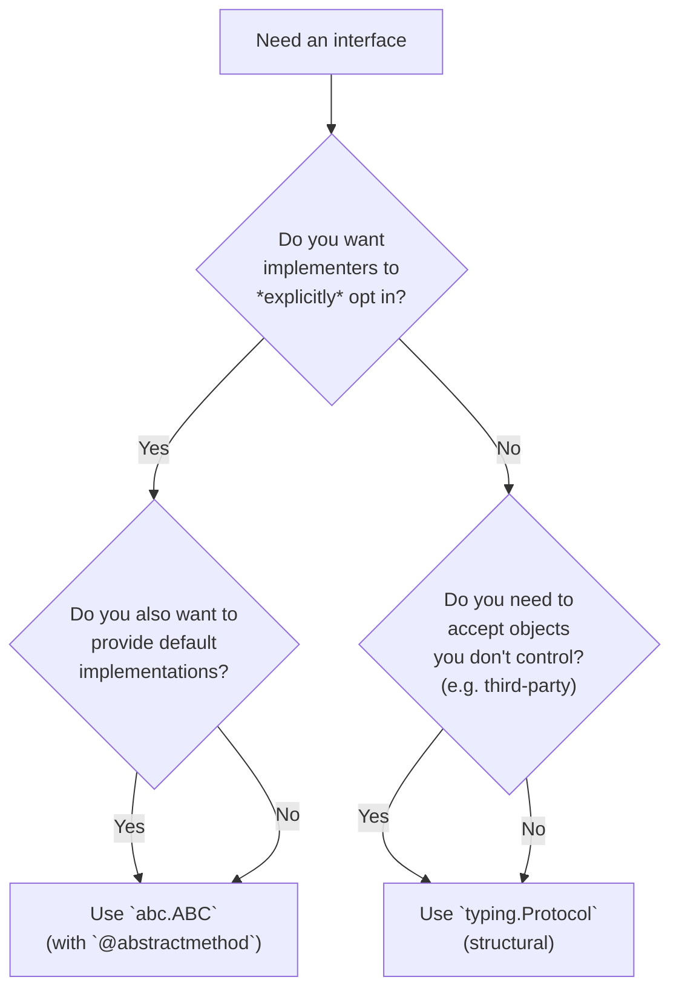
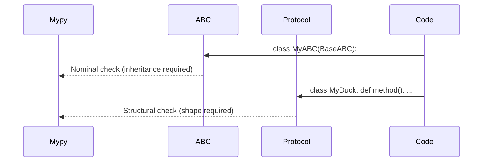
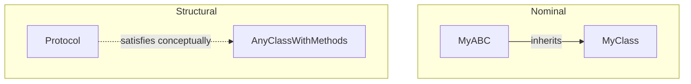

> [!tip] Prerequisite
> Read [[classes-and-objects]] and [[methods]] first. This note is about *static* type-checking on top of Python's *dynamic* object model — `mypy`, `pyright`, and friends.

## 1. Dynamic Duck Typing vs Static Type Hints

Python's runtime philosophy is **duck typing**: "if it walks like a duck and quacks like a duck, it's a duck." Whether an object can be used in a context depends on what *methods* it has, not on what *class* it inherits from.

```python
def quack(thing):
    return thing.quack()        # works for anything with .quack()

class Duck:
    def quack(self): return "quack"

class Toy:
    def quack(self): return "quaaak"

print(quack(Duck()))    # quack
print(quack(Toy()))     # quaaak
```

This is flexible but unchecked: `quack(42)` fails only at *runtime*. **Type hints** (PEP 484) add *static* checking — `mypy`/`pyright` verify types before the code ever runs.

## 2. Nominal vs Structural Subtyping

Type systems generally come in two flavors:

- **Nominal subtyping** — `B` is a subtype of `A` *because it explicitly inherits from `A`*. Java, C#, C++ (mostly), and traditional Python `class B(A)` work this way. The *name* in the inheritance clause is what matters.
- **Structural subtyping** — `B` is a subtype of `A` because it has *all the right attributes/methods with the right types*. The *shape* is what matters. TypeScript interfaces, Go interfaces, and Python's `typing.Protocol` work this way.

### 2.1 Mermaid comparison

```mermaid
graph TB
    subgraph Nominal["Nominal (e.g. ABCs)"]
        direction TB
        A1["`Animal`<br/>(declared base)"]
        D1["`Dog(Animal)`<br/>(explicitly inherits)"]
        C1["`Cat(Animal)`<br/>(explicitly inherits)"]
        X1["`Robot`<br/>(no relation)"]
        D1 -.->|"is-a"| A1
        C1 -.->|"is-a"| A1
        X1 -.->|"NOT is-a"| A1
    end
    subgraph Structural["Structural (e.g. Protocol)"]
        direction TB
        P["`protocol Walker`<br/>`{ walk(): void }`"]
        D2["`Dog`<br/>has walk()"]
        C2["`Cat`<br/>has walk()"]
        X2["`Robot`<br/>has walk()"]
        D2 -.->|"matches shape"| P
        C2 -.->|"matches shape"| P
        X2 -.->|"matches shape"| P
    end
```

In nominal typing, `Robot` is *not* an `Animal` even if it has identical methods. In structural typing, `Robot` *is* a `Walker` because it has `walk()`.

## 3. `typing.Protocol` (PEP 544)

`Protocol` is Python's **structural subtyping** mechanism — sometimes called "static duck typing". You define an interface by *shape*, and any class that matches the shape is considered an instance of the protocol — *without inheriting from it*.

```python
from __future__ import annotations
from typing import Protocol


class Walker(Protocol):
    """Anything with a `walk()` method returning a string."""
    def walk(self) -> str: ...


def go_for_a_walk(w: Walker) -> str:
    return w.walk()


class Dog:
    def walk(self) -> str:
        return "trot trot"


class Robot:
    def walk(self) -> str:
        return "whirr whirr"


# Both pass static type checking — neither inherits from Walker!
print(go_for_a_walk(Dog()))     # trot trot
print(go_for_a_walk(Robot()))   # whirr whirr
```

> [!note] `...` as a body placeholder
> In a `Protocol`, method bodies are typically just `...` (Ellipsis) — the body is never executed; the Protocol just describes a *shape*. You can also use `pass` or `raise NotImplementedError`.

> [!note] Protocols don't run
> A `Protocol` subclass is purely a *type-checker* construct. At runtime, no instances of the protocol exist; no `isinstance` check works unless you opt in (§4).

### 3.1 Non-method members

Protocols can declare attributes, not just methods:

```python
from typing import Protocol


class Named(Protocol):
    name: str


def greet(n: Named) -> str:
    return f"Hello, {n.name}"


class User:
    def __init__(self, name: str) -> None:
        self.name = name


print(greet(User("Alice")))   # Hello, Alice
```

### 3.2 Protocols with Generics

```python
from typing import Protocol, TypeVar

T = TypeVar("T")


class Container(Protocol[T]):
    def get(self) -> T: ...
    def put(self, value: T) -> None: ...


def use_container(c: Container[int]) -> int:
    c.put(42)
    return c.get()


class IntBox:
    def __init__(self) -> None:
        self._v: int = 0
    def get(self) -> int:
        return self._v
    def put(self, value: int) -> None:
        self._v = value


print(use_container(IntBox()))    # 42
```

## 4. `@runtime_checkable`

By default, `isinstance(x, SomeProtocol)` *fails* — protocols are static-only. Add `@runtime_checkable` to enable a **shallow, attributes-only** runtime check:

```python
from typing import Protocol, runtime_checkable


@runtime_checkable
class Walker(Protocol):
    def walk(self) -> str: ...


class Dog:
    def walk(self) -> str:
        return "trot"


class Stone:
    pass


print(isinstance(Dog(), Walker))    # True   (has walk)
print(isinstance(Stone(), Walker))  # False
```

> [!warning] `@runtime_checkable` checks **presence only**
> It verifies that the attribute (or method) *exists*; it does **not** check signatures, types, or return types. A class with `def walk(self, x): ...` would also pass `isinstance(x, Walker)`. Treat it as a quick "does it quack?" check, not a type-system guarantee.

```python
@runtime_checkable
class Named(Protocol):
    name: str

class Fake:
    name = 12345          # wrong type — but isinstance still says True

print(isinstance(Fake(), Named))   # True  (signature not checked!)
```

## 5. `abc.ABC` vs `typing.Protocol` — When to Use Which

| Aspect                       | `abc.ABC` (nominal)              | `typing.Protocol` (structural)              |
| ---------------------------- | -------------------------------- | ------------------------------------------- |
| Subtyping basis              | Explicit inheritance             | Shape (methods/attributes present)          |
| `isinstance(x, T)`           | ✅ Full check                    | ⚠️ Shallow (`@runtime_checkable`)          |
| Can have implementation      | ✅ Yes (default method bodies)   | ⚠️ Limited (mostly signatures)             |
| Forces opt-in                | ✅ Subclass must inherit         | ❌ Any matching type qualifies              |
| Use case                     | "I want subclasses to declare they belong" | "I want to *accept* anything that fits" |

### 5.1 Decision flowchart



### 5.2 When ABCs win

- You want **enforcement**: subclasses *must* implement abstract methods, or instantiation fails.
- You want to provide **default implementations** that subclasses override selectively.
- You want `isinstance` checks to be **semantically meaningful** at runtime.

```python
from abc import ABC, abstractmethod


class Storage(ABC):
    @abstractmethod
    def save(self, key: str, value: bytes) -> None: ...

    @abstractmethod
    def load(self, key: str) -> bytes | None: ...

    # Default method using abstract ones:
    def save_many(self, items: dict[str, bytes]) -> None:
        for k, v in items.items():
            self.save(k, v)


class InMemoryStorage(Storage):
    def __init__(self) -> None:
        self._d: dict[str, bytes] = {}

    def save(self, key: str, value: bytes) -> None:
        self._d[key] = value

    def load(self, key: str) -> bytes | None:
        return self._d.get(key)


# Storage()  # ❌ TypeError: abstract class
s = InMemoryStorage()
s.save_many({"a": b"1", "b": b"2"})
print(s.load("a"))   # b'1'
```

### 5.3 When Protocols win

- You want to **accept anything with the right shape**, including types you didn't write (e.g., `dict`, third-party classes, stdlib types).
- You're writing **library code** and don't want to force users to import your ABC.
- You want **modular, decoupled** interfaces — the duck-typing philosophy made static.

```python
from typing import Protocol


class Closeable(Protocol):
    def close(self) -> None: ...


def safe_use(resource: Closeable) -> None:
    try:
        # ... use resource ...
        pass
    finally:
        resource.close()


class FileLike:
    def close(self) -> None: ...

class DatabaseConn:
    def close(self) -> None: ...

# Both work — no need to inherit from Closeable.
safe_use(FileLike())
safe_use(DatabaseConn())
# Even built-ins: open(...) returns an object with .close()
with open("/tmp/x", "w") as f:
    safe_use(f)
```

## 6. Type Hints for OOP

### 6.1 `ClassVar` — class-level attributes

A class attribute can be marked `ClassVar` so that type checkers know it's shared, not per-instance:

```python
from typing import ClassVar


class Counter:
    total: ClassVar[int] = 0          # class-level, not instance

    def __init__(self) -> None:
        Counter.total += 1
        self.id: int = Counter.total   # instance attribute


c1 = Counter()
c2 = Counter()
print(c1.id, c2.id, Counter.total)    # 1 2 2
```

Without `ClassVar`, type checkers treat annotated class-level attributes as *instance* attributes (because that's the common case).

### 6.2 `Self` (Python 3.11+, or `typing_extensions`)

`Self` represents "the type of the current class" — essential for methods that return `self` or for classmethod alternative constructors:

```python
from __future__ import annotations
from typing import Self


class StringBuilder:
    def __init__(self, parts: list[str] | None = None) -> None:
        self._parts = list(parts) if parts else []

    def add(self, s: str) -> Self:       # ← returns same type as `self`
        self._parts.append(s)
        return self

    def build(self) -> str:
        return "".join(self._parts)


# Crucial for inheritance:
class FancyBuilder(StringBuilder):
    def add_decorated(self, s: str) -> Self:
        return self.add(f"<{s}>")


fb = FancyBuilder().add("x").add_decorated("y")
print(type(fb))           # <class 'FancyBuilder'>   ← preserves subclass!
print(fb.build())         # x<y>
```

Without `Self`, you'd have to write:

```python
from typing import TypeVar
T = TypeVar("T", bound="StringBuilder")

class StringBuilder:
    def add(self: T, s: str) -> T: ...
```

`Self` is much cleaner. (Pre-3.11 code uses the `TypeVar` pattern.)

### 6.3 Generics: `TypeVar` and `Generic`

```python
from __future__ import annotations
from typing import Generic, TypeVar


T = TypeVar("T")


class Stack(Generic[T]):
    """A stack of `T`. `Stack[int]` and `Stack[str]` are different types."""

    def __init__(self) -> None:
        self._items: list[T] = []

    def push(self, item: T) -> None:
        self._items.append(item)

    def pop(self) -> T:
        return self._items.pop()

    def peek(self) -> T:
        return self._items[-1]


s: Stack[int] = Stack()
s.push(1)
s.push(2)
n: int = s.pop()           # mypy knows n is int
```

#### 6.3.1 Bounded `TypeVar`

```python
from typing import TypeVar

Number = TypeVar("Number", bound=int | float)   # or bound="Number"
# Number must be a subtype of (int | float)

def double(x: Number) -> Number:
    return x * 2

print(double(5))         # 10   (int)
print(double(2.5))       # 5.0  (float)
# double("x")            # ❌ mypy error
```

#### 6.3.2 Constrained `TypeVar`

```python
from typing import TypeVar

C = TypeVar("C", int, str)    # must be int or str exactly

def first(a: C, b: C) -> C:
    return a

print(first(1, 2))        # 1
print(first("a", "b"))    # a
# first(1, "a")           # ❌ mypy error (must be same constraint)
```

### 6.4 `@overload`

When a function's return type depends on its argument types in a way `TypeVar` can't capture, use `@overload`:

```python
from __future__ import annotations
from typing import overload


@overload
def parse(value: int) -> int: ...
@overload
def parse(value: str) -> str: ...
@overload
def parse(value: bytes) -> str: ...
def parse(value):
    """Actual implementation — runtime uses this."""
    if isinstance(value, int):
        return value * 2
    if isinstance(value, str):
        return value.upper()
    if isinstance(value, bytes):
        return value.decode().upper()
    raise TypeError


x: int = parse(5)        # mypy knows x: int
y: str = parse("hi")     # mypy knows y: str
```

> [!note] `@overload` is a type-checker hint
> The `@overload` definitions are *only* seen by mypy; at runtime, only the final (non-decorated) implementation exists. Don't put real logic in the `@overload` stubs — just `...`.

### 6.5 `final` classes and methods

```python
from typing import final


@final
class AccountId:
    """Cannot be subclassed."""
    def __init__(self, value: int) -> None:
        self.value = value


class BankAccount:
    @final
    def account_number(self) -> int:
        """Cannot be overridden by subclasses."""
        return self._acct_no


# class Bad(AccountId): ...    # ❌ mypy: cannot inherit from final class
```

## 7. Putting It All Together: A `mypy`-Checkable Plugin System

```python
from __future__ import annotations
from typing import Protocol, runtime_checkable, ClassVar, Self


@runtime_checkable
class Plugin(Protocol):
    """A plugin: has a name and a run() method."""
    name: ClassVar[str]

    def run(self, input_: str) -> str: ...


class UpperPlugin:
    name: ClassVar[str] = "upper"

    def run(self, input_: str) -> str:
        return input_.upper()


class ReversePlugin:
    name: ClassVar[str] = "reverse"

    def run(self, input_: str) -> str:
        return input_[::-1]

    def with_self(self) -> Self:        # Self-typed return
        return self


def dispatch(plugin: Plugin, input_: str) -> str:
    return plugin.run(input_)


# mypy accepts both — they match the Protocol's shape:
print(dispatch(UpperPlugin(), "hello"))       # HELLO
print(dispatch(ReversePlugin(), "hello"))     # olleh

# Runtime check too:
print(isinstance(UpperPlugin(), Plugin))      # True
```

Save this as `plugins.py` and run `mypy plugins.py` — it should report no errors. Try removing `run()` from `ReversePlugin` and observe the mypy error.

## 8. Common Pitfalls

> [!warning] Pitfall 1: Expecting `Protocol` to enforce at runtime
> Without `@runtime_checkable`, `isinstance(x, ProtocolClass)` raises `TypeError`. With it, the check is *shallow* — presence only, no type checking.

> [!warning] Pitfall 2: Forgetting `ClassVar`
> An annotated class attribute defaults to "instance attribute" in type-checker's view. Use `ClassVar[T]` if the attribute is shared.

> [!warning] Pitfall 3: `Self` requires Python 3.11+
> On older versions, install `typing_extensions` and import `Self` from there, or use the `TypeVar`-with-bound pattern.

> [!warning] Pitfall 4: Protocols can be too permissive
> A protocol with too few members matches *too many* types. Be specific: include exactly the members your code requires.

> [!warning] Pitfall 5: Methods vs callable attributes
> ```python
> class P(Protocol):
>     f: Callable[[int], int]      # ← attribute that's a callable
> # vs.
> class P(Protocol):
>     def f(self, x: int) -> int: ...   # ← method
> ```
> These are subtly different. The first matches `obj.f = some_function`; the second only matches actual *methods*. Choose deliberately.

> [!warning] Pitfall 6: `@overload` without final implementation
> Every sequence of `@overload` stubs must be followed by exactly one non-decorated implementation. Forgetting it produces confusing mypy errors.

## 9. Key Takeaways

> [!tip] In five sentences
> 1. Python is dynamically duck-typed at runtime; type hints add *static* checking via tools like `mypy` and `pyright`.
> 2. **Nominal subtyping** (`class B(A)`, `abc.ABC`) requires explicit inheritance; **structural subtyping** (`typing.Protocol`) works by shape alone — "static duck typing".
> 3. Use `@runtime_checkable` to allow `isinstance` checks against a Protocol — but remember it only checks attribute *presence*.
> 4. Modern type hints give you `Self` (current-class type), `ClassVar` (shared attribute), `Generic`/`TypeVar` (parameterized types), and `@overload` (overloaded signatures).
> 5. Default to **Protocols for inputs** (be liberal in what you accept) and **ABCs for outputs/base classes** (be conservative in what you enforce).

## 10. Practice Exercises

> [!example] Easy
> 1. Define a `Drawable` Protocol with a `draw(self) -> str` method. Write two unrelated classes (`Circle`, `Square`) that satisfy it. Confirm `mypy` accepts passing both to a `render(d: Drawable)` function.
> 2. Add `@runtime_checkable` to `Drawable` and verify `isinstance(Circle(), Drawable)` is `True`.

> [!example] Medium
> 3. Define a `class Stack(Generic[T])` with `push`, `pop`, and `peek`, all type-correct. Verify `mypy` accepts `Stack[int]` and rejects pushing a `str` to it.
> 4. Add a `map(self, f: Callable[[T], U]) -> Stack[U]` method to your `Stack[T]` that returns a new stack with `f` applied. Use two `TypeVar`s.
> 5. Write a `Plugin` Protocol with a `name: ClassVar[str]` and a `run(self) -> None` method. Implement two plugins and a `register_all(*plugins: Plugin)` function. Confirm `mypy` enforces the `ClassVar`.

> [!example] Hard
> 6. Build a `Repository[T]` Protocol with `get(id: int) -> T | None` and `save(item: T) -> int`. Implement `UserRepository` (where `T = User`) and `OrderRepository`. Write a generic `service(repo: Repository[T], item: T) -> int` function. Verify with `mypy`.
> 7. Use `@overload` to type a `coerce(value)` function that returns `int` when given `int`, `str` when given `str`, and `bytes` when given `bytes`. Provide the runtime implementation. Confirm `mypy` infers correct return types.
> 8. Define both an `abc.ABC` version and a `typing.Protocol` version of a `Storage` interface (save/load). Compare what happens when you try to pass an unrelated third-party class (e.g. `pathlib.Path`) to a function typed as `Storage`. Explain *why* the behavior differs.

## 11. Related Notes

- [[classes-and-objects]] — what's actually happening at runtime
- [[methods]] — `self`, `cls`, and method typing
- [[magic-methods]] — dunders enable structural typing naturally (e.g. `__iter__` makes anything iterable)
- [[metaclasses-and-class-creation]] — `abc.ABCMeta`, `Generic[T]`, and `__class_getitem__`
- [[dataclasses-and-attrs]] — dataclasses with type-checked fields
- [[polymorphism]] — the conceptual basis for nominal vs structural subtyping
- [[abstraction]] — when to abstract via ABC vs Protocol

## Protocols vs ABCs

### Abstract Base Classes (ABCs)
- **Nominal Subtyping**: Requires explicitly inheriting from the ABC (or `register`).
- Checked at runtime (via `isinstance` if `__subclasshook__` isn't used) and static time.

```python
from abc import ABC, abstractmethod

class Drawable(ABC):
    @abstractmethod
    def draw(self) -> None: pass
```

### Protocols (Duck Typing)
- **Structural Subtyping**: No explicit inheritance needed. If it walks like a duck...
- PEP 544 introduced `typing.Protocol`.

```python
from typing import Protocol

class DrawableProtocol(Protocol):
    def draw(self) -> None: ...

class Circle:
    def draw(self) -> None:
        print("Drawing circle")

# Circle implicitly satisfies DrawableProtocol
```

### Code Execution Traces



### Practice Exercises
1. Define a `Serializable` Protocol and write a function that only accepts objects conforming to it.
2. Compare the runtime overhead of `isinstance(obj, MyABC)` vs `isinstance(obj, MyProtocol)` (using `@runtime_checkable`).


## Deep Dive: Protocols vs ABCs

### Protocols (Structural Subtyping)
Protocols allow you to define an interface based on methods and properties, rather than an explicit inheritance tree. This is "duck typing" but with static type checker support.

```python
from typing import Protocol

class Logger(Protocol):
    def log(self, msg: str) -> None: ...

# No inheritance needed!
class ConsoleLogger:
    def log(self, msg: str) -> None:
        print(msg)
```

### Protocols vs ABCs
- **ABCs (Nominal Subtyping)**: Requires `class MyClass(MyABC):`. Enforced at runtime via `ABCMeta`. Good when you control the entire hierarchy.
- **Protocols (Structural Subtyping)**: Does not require inheritance. Enforced at static analysis time (mypy). Great for decoupling from third-party libraries.

### Memory Diagram


### Code Execution Trace
1. When defining `ConsoleLogger`, no runtime checks occur.
2. A type checker like Pyright parses the code.
3. It checks if `ConsoleLogger` has a `log(self, msg: str)` method.
4. If a function expects a `Logger`, passing `ConsoleLogger` is marked as valid.

### Interactive Practice Exercise
**Exercise:** Define an ABC `ShapeABC` and a Protocol `ShapeProtocol` both requiring an `area()` method. Create a class `Square` that doesn't inherit from anything but implements `area()`. Try to register it with the ABC, and observe how it automatically works with type hints using the Protocol.
