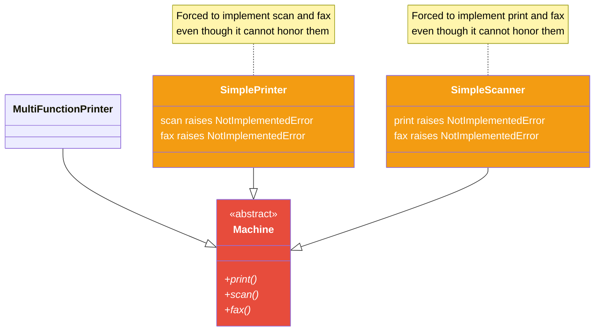
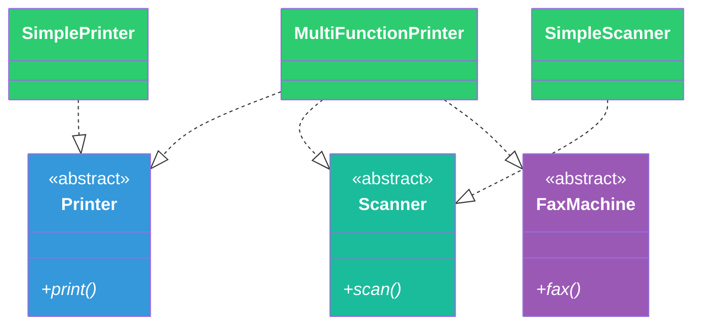
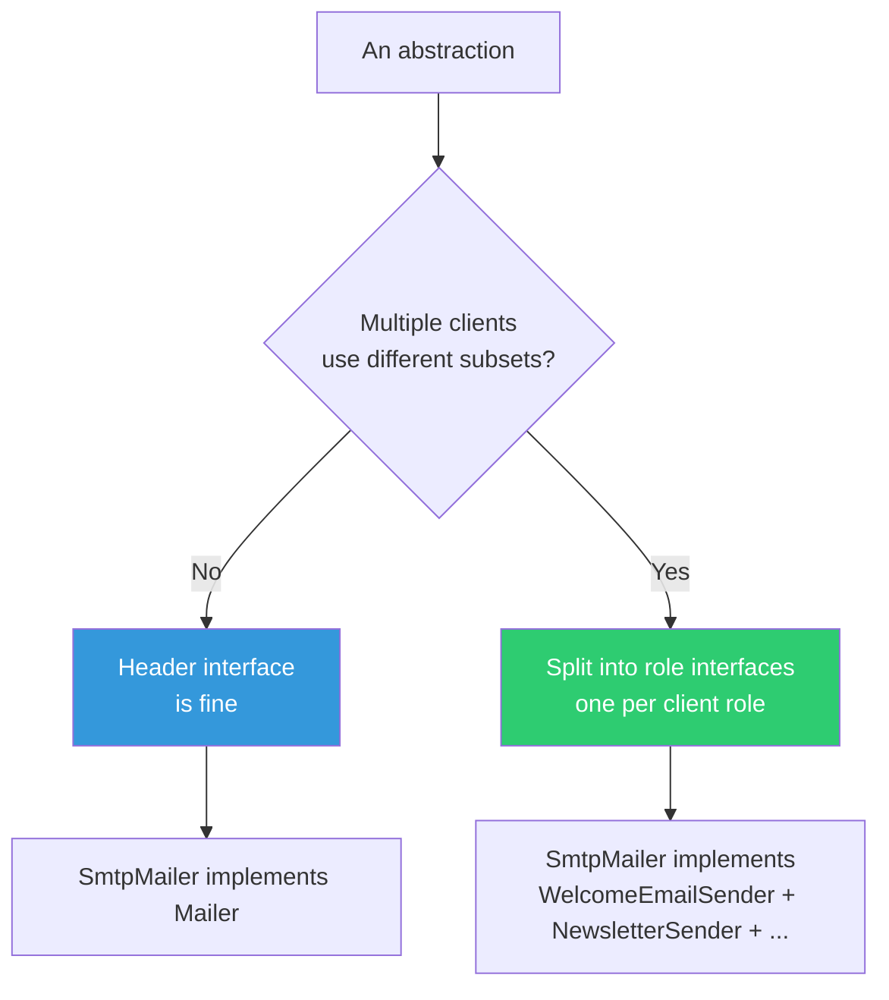
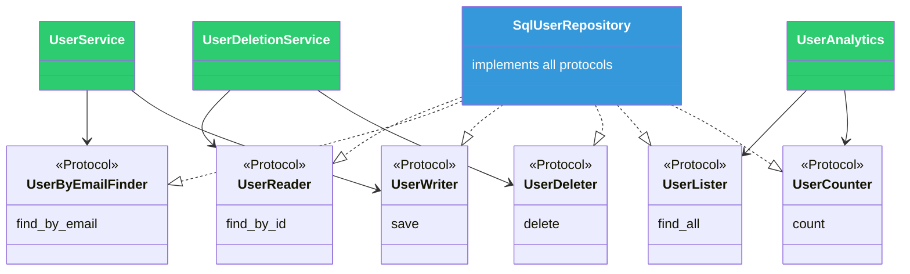
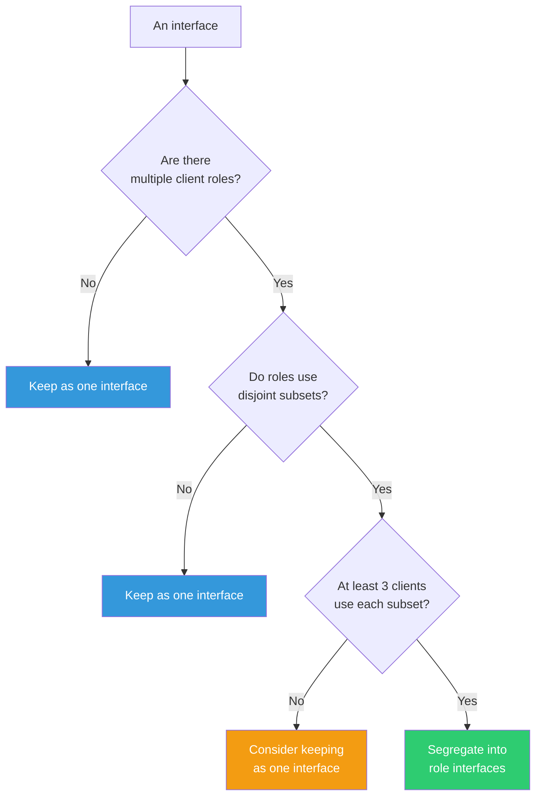
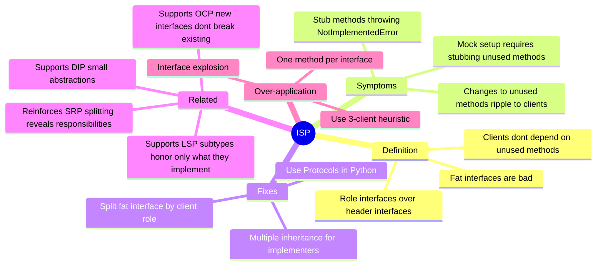

# Interface Segregation Principle (ISP)

#oop #solid #isp #interfaces #abc #protocols #role-interfaces #teaching #deep-dive

> [!quote] Robert C. Martin
> "Clients should not be forced to depend upon interfaces that they do not use."

The **Interface Segregation Principle** is the *I* of [[SOLID-Overview|SOLID]]. It is the most quietly powerful of the five: it does not produce dramatic refactors the way [[Single-Responsibility|SRP]] does, and it does not produce architectural reorganizations the way [[Dependency-Inversion|DIP]] does. What ISP does is keep your abstractions *lean* — and lean abstractions make every other principle easier to apply.

This note unpacks ISP in depth: what a "fat interface" is and why it hurts, the canonical Multi-Function Printer example (with full before/after Python code), the difference between ISP and SRP, the notion of *role interfaces* versus *header interfaces*, Python-specific tools (ABCs, Protocols, multiple inheritance), and the relationship to LSP and DIP.

Prerequisites: [[Abstraction]], [[Classes-And-Objects]], [[Single-Responsibility]]. Read [[SOLID-Overview]] first.

---

## 1. The Principle, In One Sentence

> **Clients should not be forced to depend upon interfaces that they do not use.**

### 1.1 What Is a "Client"?

In ISP terms, a **client** is any code that uses an interface. If `UserService` calls `mailer.send(...)`, then `UserService` is a client of the `Mailer` interface. If `ReportGenerator` calls `repository.fetch(...)`, then `ReportGenerator` is a client of the `Repository` interface.

### 1.2 What Does "Depend Upon" Mean?

A client "depends upon" an interface if it imports the interface, accepts it as a parameter, holds it as a field, or otherwise references it. In statically typed languages, this dependency is enforced by the compiler: if the interface changes, the client must be recompiled. In Python (dynamically typed), the dependency is logical: if the interface changes, the client may break at runtime.

### 1.3 What Does "Do Not Use" Mean?

A client "does not use" parts of an interface if it never calls those methods. If `Mailer` has `send`, `send_bulk`, `send_with_attachment`, and `verify_recipient`, and `UserService` only ever calls `send`, then `UserService` "does not use" the other three methods.

### 1.4 The Principle

ISP says: do not force `UserService` to depend on `send_bulk`, `send_with_attachment`, and `verify_recipient` if it only uses `send`. Split the interface so `UserService` depends on a minimal interface that exposes only what it needs.

```mermaid
flowchart LR
  subgraph Bad["Fat Interface (Violates ISP)"]
    C1[Client A] --> F[Mailer Interface]
    C2[Client B] --> F
    C3[Client C] --> F
    F -- "send()" --> C1
    F -- "send_bulk()" --> C2
    F -- "send_with_attachment()" --> C3
    F -- "verify_recipient() — unused by all"
  end

  subgraph Good["Segregated (ISP-compliant)"]
    C4[Client A] --> S1[Sender Interface<br/>send]
    C5[Client B] --> S2[BulkSender Interface<br/>send_bulk]
    C6[Client C] --> S3[AttachmentSender Interface<br/>send_with_attachment]
  end

  style Bad fill:#2d1b1b,stroke:#e74c3c,color:#fff
  style Good fill:#1b2d1b,stroke:#2ecc71,color:#fff
```

---

## 2. Why ISP Matters

### 2.1 The Stub Problem

In a statically typed language, if `UserService` depends on `Mailer` (which has four methods), and you want to test `UserService`, you must provide a mock `Mailer` that implements all four methods — even if `UserService` only calls one. The other three methods are usually stubbed as no-ops or `raise NotImplementedError`.

```python
# Test for UserService with fat Mailer interface
class FakeMailer:
    def __init__(self):
        self.sent = []

    @override
    def send(self, to, subject, body):
        self.sent.append((to, subject, body))

    @override
    def send_bulk(self, recipients, subject, body):
        raise NotImplementedError("Not used in this test")

    @override
    def send_with_attachment(self, to, subject, body, attachment):
        raise NotImplementedError("Not used in this test")

    @override
    def verify_recipient(self, address):
        raise NotImplementedError("Not used in this test")


def test_user_service_sends_welcome_email():
    mailer = FakeMailer()
    service = UserService(mailer)
    service.register(User("alice@example.com"))
    assert ("alice@example.com", "Welcome", ...) in mailer.sent
```

Three of the four methods are useless stubs. The test is harder to read, harder to write, and easier to break (if `Mailer` gains a fifth method, every fake must be updated — even if no test ever calls it).

### 2.2 The Accidental Coupling Problem

If `UserService` depends on `Mailer` (the fat interface), and someone changes `send_bulk`'s signature, `UserService` must be touched — even though `UserService` never calls `send_bulk`. The change is meaningless for `UserService`, but the dependency is real.

### 2.3 The LSP Pressure Problem

A fat interface makes [[Liskov-Substitution|LSP]] hard. If `Mailer` has `send`, `send_bulk`, and `send_with_attachment`, every implementation must provide all three. Implementations that cannot honor one (e.g., an SMS mailer that cannot send attachments) are forced to throw `NotImplementedError` — an LSP violation. Segregating the interface lets each implementation support only the methods it can genuinely honor.

### 2.4 The Inadvertent Reuse Problem

A fat interface is harder to reuse. If you want to extract a small reusable component that just needs to send an email, you cannot depend on the full `Mailer` interface (it would drag in `send_bulk` and `send_with_attachment`). You either duplicate the interface or accept the unnecessary coupling. A segregated interface (`Sender`) is trivially reusable.

---

## 3. The Canonical Example: Multi-Function Printer

The textbook ISP example is the multi-function printer (MFP). A modern office printer can print, scan, and fax. But not every machine can do all three: a simple printer can only print; a simple scanner can only scan.

### 3.1 The Fat Interface

```python
# bad_machine.py
from abc import ABC, abstractmethod


class Machine(ABC):
    """A 'fat' interface: every machine must print, scan, and fax."""

    @abstractmethod
    @override
    def print(self, document: str) -> Self: ...

    @abstractmethod
    @override
    def scan(self, document: str) -> Self: ...

    @abstractmethod
    @override
    def fax(self, document: str) -> Self: ...


class MultiFunctionPrinter(Machine):
    """A real MFP — can do everything."""

    @override
    def print(self, document: str) -> Self:
        print(f"Printing: {document}")

    @override
    def scan(self, document: str) -> Self:
        print(f"Scanning: {document}")

    @override
    def fax(self, document: str) -> Self:
        print(f"Faxing: {document}")


class SimplePrinter(Machine):
    """A simple printer — can only print."""

    @override
    def print(self, document: str) -> Self:
        print(f"Printing: {document}")

    @override
    def scan(self, document: str) -> Self:
        raise NotImplementedError("This printer cannot scan")

    @override
    def fax(self, document: str) -> Self:
        raise NotImplementedError("This printer cannot fax")


class SimpleScanner(Machine):
    """A simple scanner — can only scan."""

    @override
    def print(self, document: str) -> Self:
        raise NotImplementedError("This scanner cannot print")

    @override
    def scan(self, document: str) -> Self:
        print(f"Scanning: {document}")

    @override
    def fax(self, document: str) -> Self:
        raise NotImplementedError("This scanner cannot fax")
```

### 3.2 The Problems

1. **Stub methods**: `SimplePrinter` and `SimpleScanner` are forced to implement `scan`, `fax`, and `print` even when they cannot honor them. They raise `NotImplementedError` — a clear [[Liskov-Substitution|LSP]] violation.
2. **False advertising**: a client receiving a `Machine` cannot trust that `print`, `scan`, or `fax` will actually work. The interface lies.
3. **Accidental coupling**: a client that only needs to print must accept a `Machine`, which exposes `scan` and `fax` too — even though the client never uses them.
4. **Hard to test**: mocking a `Machine` means stubbing three methods even when the test only exercises one.



### 3.3 The Refactor: Segregate the Interfaces

Split the fat `Machine` interface into three focused interfaces: `Printer`, `Scanner`, `FaxMachine`.

```python
# good_machine.py
from abc import ABC, abstractmethod


class Printer(ABC):
    @abstractmethod
    @override
    def print(self, document: str) -> Self: ...


class Scanner(ABC):
    @abstractmethod
    @override
    def scan(self, document: str) -> Self: ...


class FaxMachine(ABC):
    @abstractmethod
    @override
    def fax(self, document: str) -> Self: ...


class MultiFunctionPrinter(Printer, Scanner, FaxMachine):
    """A real MFP — implements all three interfaces."""

    @override
    def print(self, document: str) -> Self:
        print(f"Printing: {document}")

    @override
    def scan(self, document: str) -> Self:
        print(f"Scanning: {document}")

    @override
    def fax(self, document: str) -> Self:
        print(f"Faxing: {document}")


class SimplePrinter(Printer):
    """A simple printer — only implements Printer."""

    @override
    def print(self, document: str) -> Self:
        print(f"Printing: {document}")


class SimpleScanner(Scanner):
    """A simple scanner — only implements Scanner."""

    @override
    def scan(self, document: str) -> Self:
        print(f"Scanning: {document}")
```

### 3.4 What We Gained

- `SimplePrinter` no longer lies: it implements only `Printer`, and clients can trust that `print` will work.
- No `NotImplementedError` stubs.
- Clients that only need to print depend on `Printer`; clients that only need to scan depend on `Scanner`. No accidental coupling.
- Tests are easy: mock only the interface the client uses.
- Adding a new operation (e.g., `Stapler`) means adding a new interface, not editing the existing ones ([[Open-Closed|OCP]]-compliant).



---

## 4. ISP vs SRP

ISP and [[Single-Responsibility|SRP]] are easy to confuse. Both are about "splitting." The key distinction:

- **SRP** is about **classes** (and their *reasons to change*).
- **ISP** is about **interfaces** (and their *clients*).

A class can violate SRP without violating ISP, and vice versa.

### 4.1 SRP Violation, No ISP Violation

Consider a `UserRepository` that exposes `save`, `find_by_id`, `find_by_email`, and `delete`. This class might serve one actor (the application's data layer), so it satisfies SRP. But if it exposes all four methods through a single interface, and some clients only use `find_by_id`, those clients are over-depending — an ISP violation.

### 4.2 ISP Violation, No SRP Violation

Consider a `Mailer` interface with `send`, `send_bulk`, and `send_with_attachment`. The interface might be implemented by a single class `SmtpMailer` that has one reason to change (SMTP details), so SRP is satisfied. But the interface is fat: clients that only need `send` are forced to depend on the whole thing — an ISP violation.

### 4.3 They Reinforce Each Other

In practice, applying SRP often surfaces ISP violations (splitting a class reveals that different clients use different parts), and applying ISP often surfaces SRP violations (segregating an interface reveals that the implementing class has multiple responsibilities).

> [!tip] Teaching Tip
> When students confuse SRP and ISP, give them this rule: **SRP is about who *implements* the abstraction; ISP is about who *uses* it.** SRP asks "does this class have one reason to change?" ISP asks "does this client use everything in the interface it depends on?"

---

## 5. Role Interfaces vs Header Interfaces

Martin Fowler distinguishes two styles of interface:

### 5.1 Header Interface

A **header interface** is an interface that exactly mirrors the public API of a class. If `SmtpMailer` has `send`, `send_bulk`, and `send_with_attachment`, the `Mailer` header interface has all three. Header interfaces are easy to write (just extract the public methods) but tend to be fat — they reflect the implementer's full API, not the client's needs.

### 5.2 Role Interface

A **role interface** is an interface designed for a specific *role* that an object plays for a specific *client*. A `SmtpMailer` might play the role of `WelcomeEmailSender` (which only needs `send`) for `UserService`, the role of `NewsletterSender` (which needs `send_bulk`) for `NewsletterService`, and the role of `AttachmentMailer` (which needs `send_with_attachment`) for `InvoiceService`. Each role interface is small and focused.

```python
# role_interfaces.py
from abc import ABC, abstractmethod


class WelcomeEmailSender(ABC):
    @abstractmethod
    @override
    def send(self, to: str, subject: str, body: str) -> Self: ...


class NewsletterSender(ABC):
    @abstractmethod
    @override
    def send_bulk(self, recipients: list[str], subject: str, body: str) -> Self: ...


class AttachmentMailer(ABC):
    @abstractmethod
    @override
    def send_with_attachment(self, to: str, subject: str, body: str, attachment: bytes) -> Self: ...


class SmtpMailer(WelcomeEmailSender, NewsletterSender, AttachmentMailer):
    """Concrete mailer — plays all three roles."""

    @override
    def send(self, to, subject, body):
        # SMTP send logic
        ...

    @override
    def send_bulk(self, recipients, subject, body):
        for r in recipients:
            self.send(r, subject, body)

    @override
    def send_with_attachment(self, to, subject, body, attachment):
        # SMTP send with attachment
        ...


# UserService depends ONLY on WelcomeEmailSender — not on the full SmtpMailer.
class UserService:
    def __init__(self, mailer: WelcomeEmailSender):
        self._mailer = mailer

    @override
    def register(self, user) -> Self:
        self._mailer.send(user.email, "Welcome", "Thanks for joining!")


# NewsletterService depends ONLY on NewsletterSender.
class NewsletterService:
    def __init__(self, mailer: NewsletterSender):
        self._mailer = mailer

    @override
    def send_weekly(self, subscribers: list[str]) -> Self:
        self._mailer.send_bulk(subscribers, "Weekly", "Here is your weekly digest.")
```

### 5.3 When to Use Which

- **Header interfaces** are appropriate when the implementer's full API is genuinely useful to most clients (e.g., `Stack` with `push`, `pop`, `peek`, `is_empty` — most clients use all four).
- **Role interfaces** are appropriate when different clients use different subsets of an implementer's API (e.g., a `Mailer` used by both welcome-email-sending and newsletter-sending code).

Most ISP violations are header interfaces that should be split into role interfaces.



---

## 6. Python-Specific Tools

Python offers several mechanisms for interfaces, each with ISP implications.

### 6.1 Abstract Base Classes (ABCs)

The `abc` module lets you define abstract base classes with abstract methods. A subclass cannot be instantiated unless it implements all abstract methods — which means ABCs are *enforced* fat interfaces unless you segregate them.

```python
from abc import ABC, abstractmethod


# Bad: fat ABC forces all implementers to provide all three methods
class Machine(ABC):
    @abstractmethod
    @override
    def print(self, document): ...

    @abstractmethod
    @override
    def scan(self, document): ...

    @abstractmethod
    @override
    def fax(self, document): ...


# Good: segregated ABCs
class Printer(ABC):
    @abstractmethod
    @override
    def print(self, document): ...


class Scanner(ABC):
    @abstractmethod
    @override
    def scan(self, document): ...


class FaxMachine(ABC):
    @abstractmethod
    @override
    def fax(self, document): ...
```

### 6.2 Protocols (Structural Typing)

Python 3.8+ supports `typing.Protocol`, which provides *structural* subtyping. A class is considered a subtype of a `Protocol` if it has the right methods — no inheritance required. Protocols are perfect for ISP because each Protocol can be tiny, and a class can satisfy many Protocols simultaneously.

```python
from typing import Self, Protocol


# Three tiny protocols
class Sender(Protocol):
    @override
    def send(self, to: str, subject: str, body: str) -> Self: ...


class BulkSender(Protocol):
    @override
    def send_bulk(self, recipients: list[str], subject: str, body: str) -> Self: ...


class AttachmentSender(Protocol):
    @override
    def send_with_attachment(self, to: str, subject: str, body: str, attachment: bytes) -> Self: ...


# SmtpMailer satisfies all three protocols — no inheritance required.
class SmtpMailer:
    @override
    def send(self, to, subject, body): ...
    @override
    def send_bulk(self, recipients, subject, body): ...
    @override
    def send_with_attachment(self, to, subject, body, attachment): ...


# UserService depends on Sender (a tiny protocol) — not on SmtpMailer.
class UserService:
    def __init__(self, mailer: Sender):
        self._mailer = mailer

    @override
    def register(self, user) -> Self:
        self._mailer.send(user.email, "Welcome", "...")
```

Protocols are the most Pythonic way to apply ISP: define many tiny Protocols, one per client role, and let classes satisfy them implicitly.

### 6.3 Multiple Inheritance

Python's multiple inheritance makes role interfaces especially ergonomic. A class can implement many small interfaces without any boilerplate:

```python
class SmtpMailer(WelcomeEmailSender, NewsletterSender, AttachmentMailer):
    @override
    def send(self, to, subject, body): ...
    @override
    def send_bulk(self, recipients, subject, body): ...
    @override
    def send_with_attachment(self, to, subject, body, attachment): ...
```

This is exactly the multi-function printer pattern: `MultiFunctionPrinter(Printer, Scanner, FaxMachine)`.

### 6.4 Duck Typing

Python's duck typing means that even without explicit interfaces, the *spirit* of ISP applies: a function should accept only the methods it actually uses. If `register(user, mailer)` only calls `mailer.send`, then any object with a `send` method will do — and `mailer` need not have any other methods.

Type hints with `Protocol` make this explicit; without type hints, the duck-typed contract is implicit but real.

---

## 7. The Repository Example: Fat to Segregated

A common real-world ISP violation is the fat `Repository` interface. Many ORMs encourage a `Repository<T>` interface with `find`, `find_by_id`, `find_by_email`, `save`, `update`, `delete`, `count`, `find_all`, and so on — all in one interface.

### 7.1 The Fat Repository

```python
# bad_repository.py
from abc import ABC, abstractmethod
from typing import Optional


class UserRepository(ABC):
    """A fat repository interface — every client gets every method."""

    @abstractmethod
    @override
    def find_by_id(self, user_id: int) -> Optional[User]: ...

    @abstractmethod
    @override
    def find_by_email(self, email: str) -> Optional[User]: ...

    @abstractmethod
    @override
    def find_all(self) -> list[User]: ...

    @abstractmethod
    @override
    def save(self, user: User) -> Self: ...

    @abstractmethod
    @override
    def update(self, user: User) -> Self: ...

    @abstractmethod
    @override
    def delete(self, user_id: int) -> Self: ...

    @abstractmethod
    @override
    def count(self) -> int: ...
```

Now consider the clients:

- `UserService` (handles login) only needs `find_by_email` and `save`.
- `UserDeletionService` only needs `find_by_id` and `delete`.
- `UserAnalytics` only needs `find_all` and `count`.
- `UserRegistrationService` only needs `find_by_email` and `save`.

Each client is forced to depend on the full fat interface — including methods it never calls. If `count`'s signature changes (e.g., to support filtering), all four clients must be touched, even though only `UserAnalytics` cares.

### 7.2 The Segregated Repository

```python
# good_repository.py
from abc import ABC, abstractmethod
from typing import Optional, Protocol


class UserReader(Protocol):
    @override
    def find_by_id(self, user_id: int) -> Optional[User]: ...


class UserByEmailFinder(Protocol):
    @override
    def find_by_email(self, email: str) -> Optional[User]: ...


class UserWriter(Protocol):
    @override
    def save(self, user: User) -> Self: ...


class UserUpdater(Protocol):
    @override
    def update(self, user: User) -> Self: ...


class UserDeleter(Protocol):
    @override
    def delete(self, user_id: int) -> Self: ...


class UserLister(Protocol):
    @override
    def find_all(self) -> list[User]: ...


class UserCounter(Protocol):
    @override
    def count(self) -> int: ...


# A concrete repository that satisfies all the protocols.
class SqlUserRepository:
    @override
    def find_by_id(self, user_id: int) -> Optional[User]: ...
    @override
    def find_by_email(self, email: str) -> Optional[User]: ...
    @override
    def find_all(self) -> list[User]: ...
    @override
    def save(self, user: User) -> Self: ...
    @override
    def update(self, user: User) -> Self: ...
    @override
    def delete(self, user_id: int) -> Self: ...
    @override
    def count(self) -> int: ...


# Each client depends on ONLY what it uses.
class UserService:
    def __init__(self, finder: UserByEmailFinder, writer: UserWriter):
        self._finder = finder
        self._writer = writer

    @override
    def login(self, email: str, password: str) -> bool:
        user = self._finder.find_by_email(email)
        if user and user.check_password(password):
            return True
        return False

    @override
    def register(self, user: User) -> Self:
        return self._writer.save(user)


class UserDeletionService:
    def __init__(self, reader: UserReader, deleter: UserDeleter):
        self._reader = reader
        self._deleter = deleter

    @override
    def delete_account(self, user_id: int) -> Self:
        user = self._reader.find_by_id(user_id)
        if user:
            self._deleter.delete(user_id)


class UserAnalytics:
    def __init__(self, lister: UserLister, counter: UserCounter):
        self._lister = lister
        self._counter = counter

    @override
    def active_user_count(self) -> int:
        return self._counter.count()

    @override
    def all_users(self) -> list[User]:
        return self._lister.find_all()
```

### 7.3 What We Gained

- Each client depends on a tiny interface (one or two methods).
- Tests are trivial: mock only the methods the client actually uses.
- Adding a new method (e.g., `find_by_username`) does not require touching any existing client.
- Different implementations can support different subsets (e.g., a `ReadOnlyUserRepository` could implement only the read protocols).



---

## 8. When Segregation Goes Too Far

ISP can be over-applied. The failure mode is **interface explosion**: dozens of one-method interfaces, each used by one client, that are hard to discover and hard to navigate.

### 8.1 The One-Method-Per-Interface Anti-Pattern

If you split `UserRepository` into seven one-method Protocols (`UserFinder`, `UserSaver`, `UserDeleter`, `UserCounter`, `UserLister`, `UserUpdater`, `UserFinderByEmail`), you have seven interfaces for seven methods. Each client must declare dependencies on multiple Protocols; the constructor signatures become long; and the conceptual overhead of "which Protocol has which method" becomes significant.

### 8.2 The Right Granularity

The right granularity is *by client role*, not by method. If most clients use `find_by_id` and `find_by_email` together, those two methods belong in one interface (`UserReader`). If most clients use `save` and `update` together, those belong in one interface (`UserWriter`). The goal is *cohesion at the client role level*: each interface should group methods that are typically used together by a particular role.

### 8.3 The Three-Client Heuristic

A practical heuristic: if three or more clients use the same subset of an interface, that subset deserves its own interface. If only one client uses a subset, it may not be worth segregating — just let that one client depend on the larger interface.



---

## 9. Common Student Misconceptions

> [!warning] Misconception 1: "ISP means every method should be its own interface."
> No. ISP is about grouping by *client role*, not minimizing interface size. An interface with four methods that all serve the same role is fine. An interface with two methods that serve different roles should be split.

> [!warning] Misconception 2: "ISP is the same as SRP."
> No. SRP is about classes (and reasons to change); ISP is about interfaces (and clients). They are related but distinct. A class can satisfy SRP while its interface violates ISP, and vice versa.

> [!warning] Misconception 3: "Python doesn't need ISP because it's dynamically typed."
> No. Python codebases still suffer from fat interfaces — clients still depend on more than they use, mock objects still need to stub unused methods, and changes to unused methods still ripple to clients. The cost is smaller than in compiled languages (no recompilation), but it is real.

> [!warning] Misconception 4: "If I use `Protocol`, I'm satisfying ISP."
> Not automatically. A `Protocol` can be fat too. ISP is about the *shape* of the interface (focused on client needs), not about the *mechanism* (ABC vs Protocol).

> [!warning] Misconception 5: "ISP means I must split every interface into many."
> No. ISP means *clients should not depend on what they do not use*. If all clients use the same interface, there is nothing to segregate. Splitting for its own sake produces interface explosion.

> [!warning] Misconception 6: "Header interfaces are always bad."
> No. Header interfaces are fine when the implementer's full API is genuinely useful to most clients. The `Stack` interface with `push`, `pop`, `peek`, `is_empty` is a perfectly good header interface — most clients use all four.

> [!warning] Misconception 7: "ISP applies only to ABCs and Protocols."
> No. ISP applies to any dependency: a function's parameter list, a class's public methods, a module's exports. Wherever a client depends on something, ISP asks: does it use everything it depends on?

---

## 10. The Relationship to Other SOLID Principles

### 10.1 ISP Supports DIP

[[Dependency-Inversion|DIP]] says: depend on abstractions. ISP says: those abstractions should be small and focused. Without ISP, DIP is painful — every dependency is a fat interface that drags in unrelated methods. With ISP, dependencies are tiny and easy to inject.

### 10.2 ISP Supports LSP

[[Liskov-Substitution|LSP]] says: subtypes must honor the parent's contract. A fat interface makes this hard: subtypes must implement every method, including ones they cannot honor. Segregating the interface (ISP) lets each subtype implement only the methods it can genuinely honor — preserving LSP.

### 10.3 ISP Supports OCP

[[Open-Closed|OCP]] says: open for extension, closed for modification. A fat interface is hard to extend without modifying (you must add methods to the interface, breaking all implementers). Segregated interfaces are easy to extend (you add a new interface; existing ones are untouched).

### 10.4 ISP and SRP Reinforce Each Other

As discussed in §4: applying SRP often surfaces ISP violations, and applying ISP often surfaces SRP violations. They are complementary.



---

## 11. A Subtle Example: The Iterable/Iterator Split

Python's standard library has many examples of well-segregated interfaces. Consider `Iterable` and `Iterator`:

```python
from typing import Protocol, Iterator


class Iterable(Protocol):
    @override
    def __iter__(self) -> Self: ...


class Iterator(Protocol):
    @override
    def __next__(self): ...
    @override
    def __iter__(self) -> Self: ...
```

`Iterable` is a one-method interface: anything that can produce an iterator. `Iterator` is a two-method interface: anything that can produce the next element and itself be iterated (so you can pass an iterator where an iterable is expected).

This is a clean ISP design:

- Clients that need to iterate accept `Iterable` — they do not need `__next__`.
- Clients that need to consume elements one at a time accept `Iterator`.
- A `list` is both `Iterable` and `Iterator` (via its `__iter__` method which returns a `list_iterator`).
- A `generator` is both `Iterable` and `Iterator`.

If `Iterable` and `Iterator` were merged into a single fat interface, every `Iterable` would have to implement `__next__` — even if it cannot meaningfully do so (a `list` does not have a single "next" element; you must iterate it). The split is a textbook ISP application.

### 11.1 The `Sequence` Hierarchy

Similarly, Python's `collections.abc` defines a hierarchy of increasingly rich interfaces:

- `Container` — `__contains__`
- `Iterable` — `__iter__`
- `Collection` — `Container`, `Iterable`, `Sized` (adds `__len__`)
- `Sequence` — `Collection` plus `__getitem__`, `__reversed__`, `index`, `count`
- `MutableSequence` — `Sequence` plus `__setitem__`, `__delitem__`, `insert`, `append`, `extend`, `pop`, `remove`

Each level adds capabilities. A `tuple` is a `Sequence` but not a `MutableSequence` — it does not need to implement mutating methods. This is ISP: clients that need only `Collection` operations accept `Collection`; clients that need mutation accept `MutableSequence`.

---

## 12. Real-World Examples of ISP

### 12.1 Java's `List` vs `ReadOnlyList`

Java's `List` interface includes mutating methods (`add`, `remove`, `set`). The `Collections.unmodifiableList()` method returns a `List` whose mutating methods throw `UnsupportedOperationException` — an LSP violation caused by an ISP failure (Java did not segregate `List` into read and write interfaces). Modern Java code often uses `Stream` and `Iterable` instead, partly to avoid this.

### 12.2 .NET's `IReadOnlyList<T>` vs `IList<T>`

.NET learned from Java's mistake and introduced `IReadOnlyList<T>` (which only has `Count` and `Item`) as a separate interface from `IList<T>` (which has mutation). Now methods that only need to read can accept `IReadOnlyList<T>` — a clean ISP application.

### 12.3 Spring's Repository Hierarchy

Spring Data's `Repository` interface is empty (a marker). `CrudRepository` adds `save`, `findById`, `findAll`, `deleteById`. `PagingAndSortingRepository` adds pagination and sorting. `JpaRepository` adds JPA-specific methods. Each level is a separate interface — clients depend on the smallest one that meets their needs.

### 12.4 Python's `typing.IO`

Python's `typing.IO` distinguishes `IO`, `BinaryIO`, and `TextIO`. `IO` is the union; `BinaryIO` has `readline`, `readlines`, `writelines` for binary streams; `TextIO` has `encoding`, `newlines` for text streams. A function that only needs `read` accepts the smallest applicable interface — an ISP-compliant design.

---

## 13. Testing Benefits of ISP

One of the clearest benefits of ISP is **easier testing**. With a fat interface, every test that uses a dependency must stub the entire fat interface. With segregated interfaces, each test stubs only the methods it actually uses.

### 13.1 Before: Fat Interface

```python
class FakeMailer:
    @override
    def send(self, to, subject, body):
        self.sent = [(to, subject, body)]

    @override
    def send_bulk(self, recipients, subject, body):
        raise NotImplementedError  # unused

    @override
    def send_with_attachment(self, to, subject, body, attachment):
        raise NotImplementedError  # unused

    @override
    def verify_recipient(self, address):
        raise NotImplementedError  # unused


def test_user_service_sends_welcome_email():
    mailer = FakeMailer()
    service = UserService(mailer)
    service.register(User("alice@example.com"))
    assert mailer.sent == [("alice@example.com", "Welcome", "...")]
```

The `FakeMailer` has four methods, three of which are useless stubs.

### 13.2 After: Segregated Interface

```python
class FakeWelcomeEmailSender:
    def __init__(self):
        self.sent = []

    @override
    def send(self, to, subject, body):
        self.sent.append((to, subject, body))


def test_user_service_sends_welcome_email():
    mailer = FakeWelcomeEmailSender()
    service = UserService(mailer)  # UserService depends on WelcomeEmailSender
    service.register(User("alice@example.com"))
    assert mailer.sent == [("alice@example.com", "Welcome", "...")]
```

The fake has one method. The test is shorter, clearer, and more focused.

> [!tip] Teaching Tip
> Show students the two test snippets side by side. The contrast — four methods with three stubs versus one method — is the most persuasive argument for ISP.

---

## 14. Refactoring Toward ISP

When you encounter a fat interface, here is a step-by-step refactoring path.

### 14.1 Step 1: Identify the Clients

List every client of the interface. For each client, list which methods it actually calls.

### 14.2 Step 2: Group by Client Role

Cluster the methods by which clients use them together. Methods used by the same set of clients form a role interface.

### 14.3 Step 3: Define Role Interfaces

For each cluster, define a small interface (ABC or Protocol) containing only the methods in that cluster.

### 14.4 Step 4: Update Clients

Change each client to depend on the smallest applicable role interface instead of the fat interface.

### 14.5 Step 5: Update Implementers

The concrete class should implement all the role interfaces it can honor. With Python's multiple inheritance, this is straightforward.

### 14.6 Step 6: Remove or Deprecate the Fat Interface

If no client needs the fat interface anymore, delete it. If some legacy code still depends on it, keep it as a convenience interface that inherits from the role interfaces.

```python
# Legacy compatibility
class Mailer(WelcomeEmailSender, NewsletterSender, AttachmentSender, ABC):
    """The old fat interface, kept for compatibility. Prefer the role interfaces."""
    pass
```

---

## 15. Exercises

> [!exercise] Exercise 1: Spot the ISP Violation
> A `Database` interface has `connect`, `disconnect`, `execute`, `query`, `begin_transaction`, `commit`, `rollback`, `migrate`, `backup`, and `restore`. List the client roles that might use disjoint subsets of this interface. Propose a segregation.

> [!exercise] Exercise 2: Multi-Function Device
> Design an interface hierarchy for office equipment: printers, scanners, fax machines, photocopiers (which can both scan and print), and staplers. Use ISP.

> [!exercise] Exercise 3: Repository Segregation
> Take the fat `UserRepository` from this note. Implement it for an in-memory store. Then write three clients (login service, deletion service, analytics) that depend only on the role interfaces they need.

> [!exercise] Exercise 4: Protocol vs ABC
> Implement the role interfaces for the `Mailer` example using both ABCs and Protocols. Compare the ergonomics.

> [!exercise] Exercise 5: Over-Segregation
> A junior developer has split a 6-method interface into six 1-method interfaces, and the constructor of one client now accepts six dependencies. Is this a good application of ISP? What would you advise?

> [!exercise] Exercise 6: Standard Library
> Browse Python's `collections.abc` module. Pick three interfaces and explain how they apply ISP.

---

## 16. Summary

The Interface Segregation Principle says: **clients should not be forced to depend upon interfaces that they do not use**. Keep interfaces small and focused on the needs of specific client roles.

- The classic violation is the fat interface (e.g., `Machine` with `print`, `scan`, `fax`) that forces every implementer to provide all methods, even those it cannot honor.
- The fix is to segregate the interface into role interfaces (e.g., `Printer`, `Scanner`, `FaxMachine`), each focused on a specific client role.
- ISP is distinct from SRP: SRP is about classes; ISP is about interfaces.
- Python tools: `abc.ABC` for explicit interfaces, `typing.Protocol` for structural typing, multiple inheritance for combining role interfaces.
- The right granularity is by client role, not by method. Avoid one-method-per-interface over-segregation.
- ISP supports [[Dependency-Inversion|DIP]] (small abstractions are easier to inject), [[Liskov-Substitution|LSP]] (subtypes honor only what they implement), [[Open-Closed|OCP]] (new interfaces do not break existing ones), and reinforces [[Single-Responsibility|SRP]].

ISP is the quiet principle: it does not produce dramatic refactors, but it makes every other principle easier to apply. Read [[Dependency-Inversion]] next to see how small abstractions enable flexible, testable architectures.

---

## 17. Further Reading

- Robert C. Martin, *Agile Software Development: Principles, Patterns, and Practices* (2002), Chapter 11 — ISP chapter.
- Martin Fowler, *"Role Interface"* article on martinfowler.com (2004).
- PEP 544 — *Protocols: Structural subtyping* (Python 3.8+).
- Python `collections.abc` documentation.
- [[SOLID-Overview]] — for the broader context.
- [[Single-Responsibility]] — the related principle for classes.
- [[Dependency-Inversion]] — the principle ISP enables.
- [[Liskov-Substitution]] — the principle ISP supports.
- [[Abstraction]] — the language feature ISP refines.

---

**Previous**: [[Liskov-Substitution]]
**Next**: [[Dependency-Inversion]]
