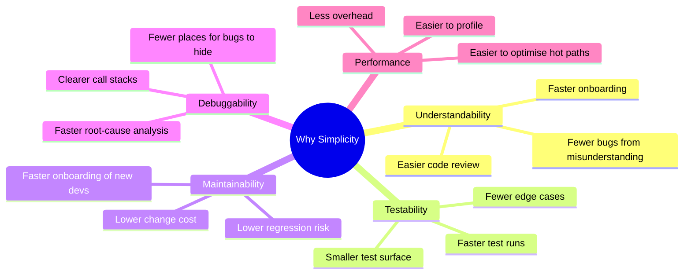
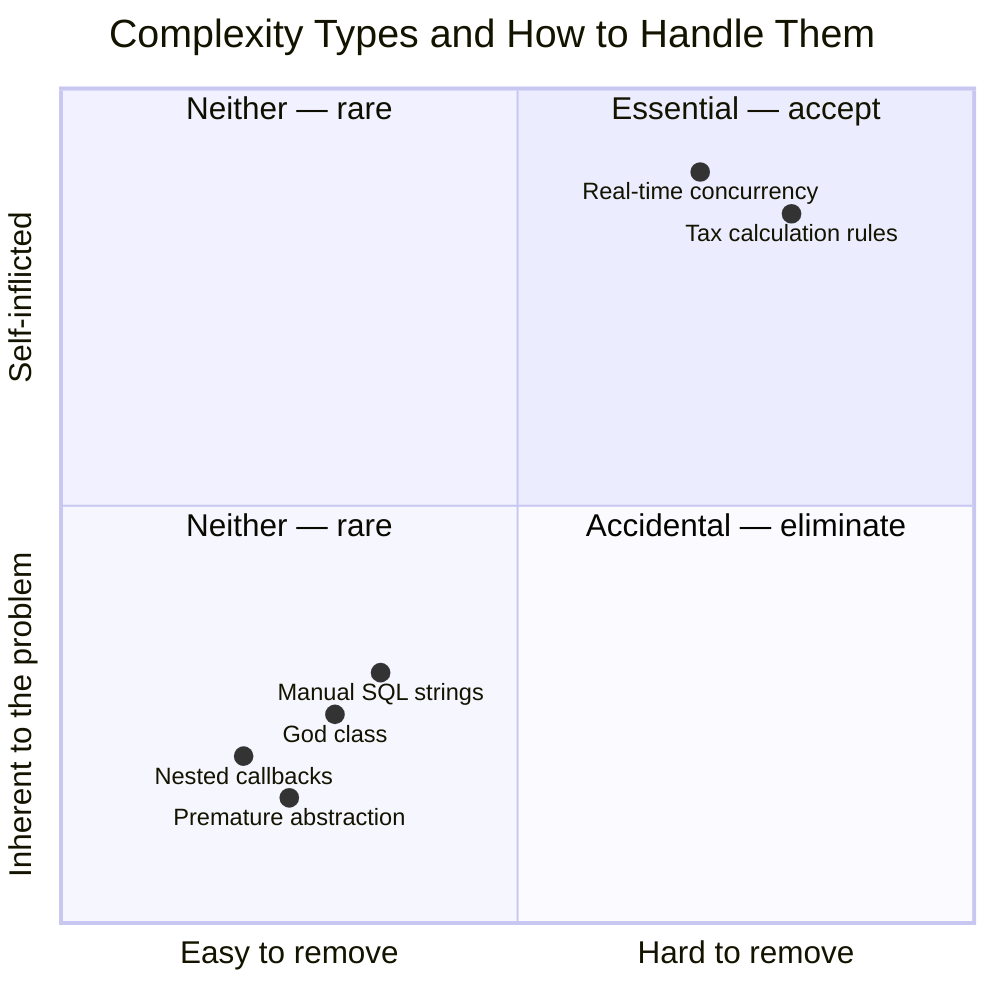
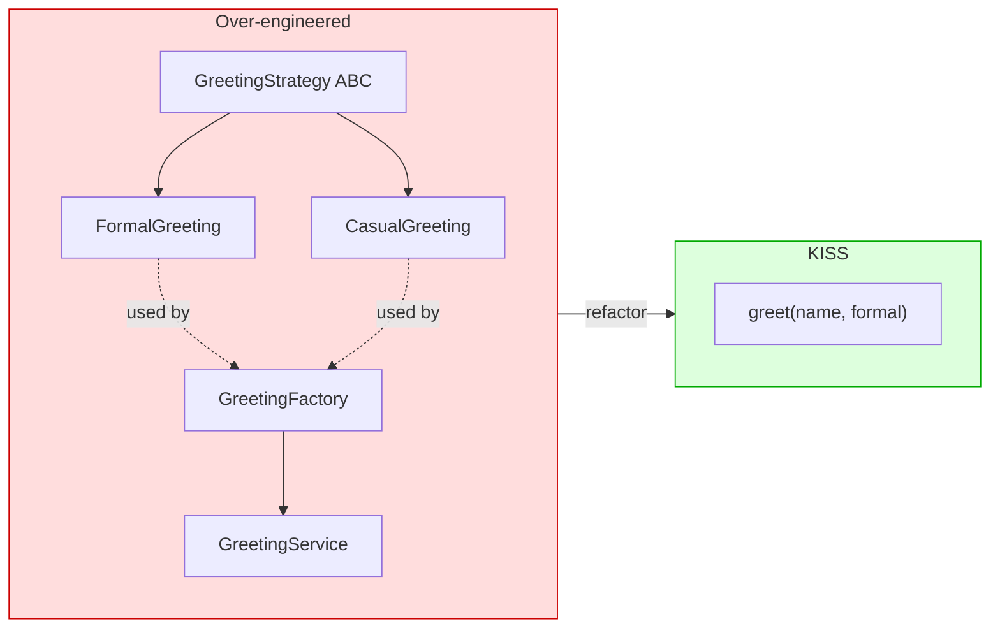
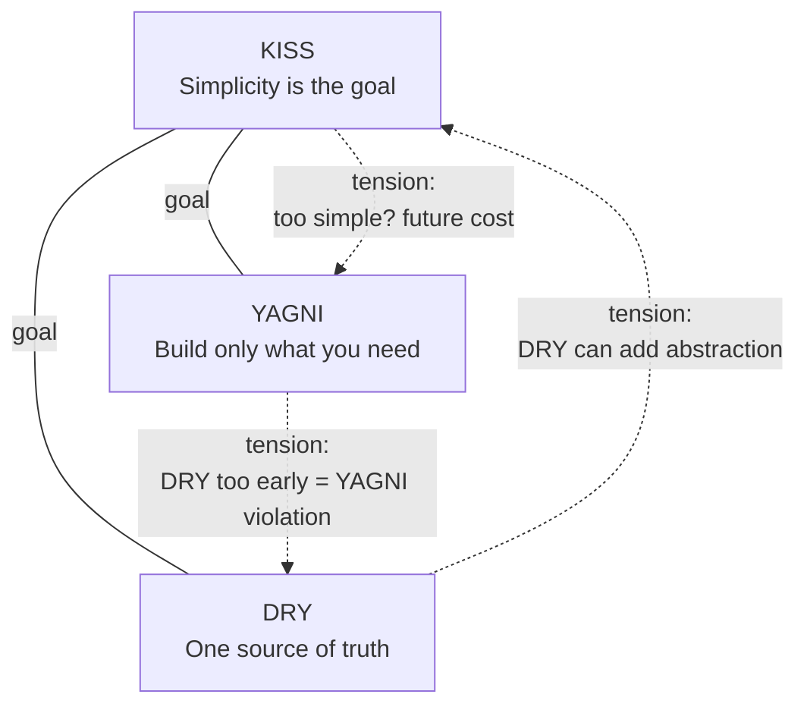
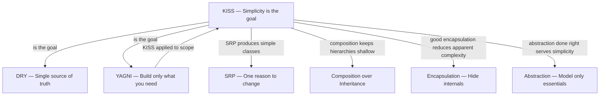

# KISS Principle — Keep It Simple, Stupid

#oop #design-principles #kiss #simplicity #complexity #refactoring #teaching #deep-dive

> [!quote] Kelly Johnson, Lockheed Skunk Works
> "Keep it simple, stupid. Any engineer can design something complex. It takes real skill to design something simple."

The **KISS Principle** is the deceptively simple reminder that **simplicity is a key design goal**. Every other principle in this knowledge base — [[DRY-Principle|DRY]], [[YAGNI-Principle|YAGNI]], [[Single-Responsibility|SRP]], the entire SOLID catalog — exists, in the end, to *serve* simplicity. They are tools; KISS is the goal.

And yet KISS is the principle that engineers violate most often, because the pressure to "look smart," to "future-proof," and to "use the new shiny framework" is constant. This note unpacks what simplicity means, the two kinds of complexity (essential and accidental), how to pursue simplicity in OOP code, and — importantly — when KISS itself goes wrong (oversimplification is a real failure mode).

Prerequisites: [[Classes-And-Objects]], [[Methods-And-Functions]], [[Encapsulation]]. Read alongside [[DRY-Principle]] and [[YAGNI-Principle]].

---

## 1. The Principle, In One Sentence

> **Simplicity is a key design goal. Avoid unnecessary complexity.**

The original phrasing — "Keep It Simple, Stupid" — comes from the US Navy, attributed to **Kelly Johnson**, lead engineer at Lockheed's Skunk Works (the team that built the U-2 and SR-71 spy planes). The "stupid" is affectionate: it means the design should be so simple that even a stupid person could repair it under field conditions. In a Lockheed context, "the field" was a hostile foreign territory with a wrench and twenty minutes.

In software, "the field" is five years from now, at 2 a.m., when the original author has left the company, and the on-call engineer has to fix a production bug.

> [!important] KISS Test
> If a competent engineer who did *not* write the code cannot understand what a function does within 30 seconds of reading it, the function is too complex.

---

## 2. Origin and History

The acronym KISS was used by the US Navy in the 1960s. Kelly Johnson handed his engineers a handful of tools — a wrench, a screwdriver, and similar — and told them that the aircraft they were designing had to be repairable in the field, by an average mechanic, with only those tools, under combat conditions. That constraint forced simplicity into the design.

The principle migrated to software engineering in the 1970s and 1980s. It was popularised in the Unix philosophy ("do one thing and do it well"), in the Agile movement (working software over comprehensive documentation), and in the Extreme Programming community.

The phrase has many backronyms — "Keep It Short and Simple," "Keep It Super Simple" — but the meaning is consistent: **prefer the simplest design that solves the problem**.

---

## 3. Why Simplicity Matters



### 3.1 Understandability

Code is read ten times more often than it is written. A simple design lets the reader understand the system quickly. A clever design — using metaclasses, decorators, dynamic dispatch, and reflection in a single 30-line function — may impress the author but will confuse every reader.

### 3.2 Testability

Simple functions are easy to test: they take inputs, they return outputs, they have few branches. Complex functions have combinatorial numbers of paths; testing them thoroughly is impractical, and the tests themselves become complex (and buggy).

### 3.3 Maintainability

When requirements change, a simple design lets you make the change in one obvious place. A complex design forces you to understand the design before you can change it — and the original author's mental model is gone.

### 3.4 Debuggability

Bugs hide in complexity. A 200-line function with nested loops, conditionals, and side effects has thousands of possible execution states. A 20-line pure function has a handful. The simpler the code, the faster you can locate the bug.

### 3.5 Performance (Counterintuitively)

Complex "optimised" code is often *slower* than simple code, because the optimiser (the JIT, the database planner) understands simple code better. And complex code is harder to profile — you cannot optimise what you cannot reason about.

---

## 4. Two Kinds of Complexity

Fred Brooks, in his 1986 essay *"No Silver Bullet"*, distinguished two kinds of complexity. Understanding the distinction is the heart of KISS.



### 4.1 Essential Complexity

Essential complexity is **inherent in the problem itself**. You cannot remove it; you can only manage it. Examples:

- Computing income tax correctly requires modelling tax brackets, deductions, credits, and exceptions. That is the problem.
- A real-time multiplayer game must reconcile player actions across network latency. The latency is real; the reconciliation logic is essential.
- A distributed system must handle partial failures, network partitions, and clock skew. These are properties of the universe; you cannot wish them away.

KISS does *not* say "ignore essential complexity." It says "do not *add* to it."

### 4.2 Accidental Complexity

Accidental complexity is **self-inflicted**. It arises from choices we make: the wrong tool, the wrong abstraction, the wrong layering, the wrong naming. Examples:

- Using a database ORM that hides query performance, then writing N+1 queries because the abstraction made them invisible.
- Wrapping every primitive in a class hierarchy because "everything must be an object."
- Adding a configuration system with 40 knobs when the system has only 3 actual configuration choices.
- Implementing a custom dependency-injection framework when the application has 6 services.
- Using a microservice architecture for a system that one team could maintain as a monolith.

KISS targets accidental complexity. The goal is to remove every layer, every abstraction, every indirection that does not earn its place.

> [!important] The KISS Question
> "Is this complexity essential to the problem, or did I add it?" If you added it, remove it.

---

## 5. Symptoms of Complexity

How do you know your design has drifted from simple? Watch for these symptoms:

### 5.1 Long Methods

A method that exceeds ~30 lines (a heuristic, not a law) is doing too much. The fix: extract smaller methods.

### 5.2 Deep Inheritance Hierarchies

More than three levels of inheritance is a red flag. Each level adds cognitive load and makes the runtime behaviour harder to predict. See [[Composition-Over-Inheritance]].

### 5.3 "Clever" Code

List comprehensions nested five deep, metaclass magic, decorators that return decorators that return classes — these are signs of an engineer optimising for their own amusement, not for the reader.

### 5.4 Many Configuration Flags

If a class constructor takes 12 parameters, most of which are booleans that toggle behaviour, the class is doing too much. Split it.

### 5.5 Comments Explaining "What"

Comments that explain *what* the code does are admissions that the code is unclear. Fix the code (better names, smaller functions), not the comment.

### 5.6 God Classes

A single class with 50 methods and 2000 lines violates [[Single-Responsibility|SRP]] and KISS simultaneously. See [[God-Object]].

---

## 6. How to Achieve Simplicity

### 6.1 Small Classes and Methods

The most reliable simplification move. Each class should do one thing; each method should do one thing. A method that fits on one screen is easy to hold in your head.

```python
from typing import Self
from typing_extensions import override
# Complex — does too much
def process_user(user):
    # validate
    if not user.email or "@" not in user.email:
        raise ValueError("invalid email")
    if len(user.name) < 2:
        raise ValueError("name too short")
    # normalise
    user.email = user.email.lower().strip()
    user.name = user.name.strip().title()
    # persist
    db.session.add(user)
    db.session.commit()
    # notify
    send_email(user.email, "Welcome!", "Welcome aboard.")
    analytics.track("user_signed_up", {"user_id": user.id})

# Simple — each step is its own function
def validate_user(user):
    if not user.email or "@" not in user.email:
        raise ValueError("invalid email")
    if len(user.name) < 2:
        raise ValueError("name too short")

def normalise_user(user):
    user.email = user.email.lower().strip()
    user.name = user.name.strip().title()

def persist_user(user):
    db.session.add(user)
    db.session.commit()

def notify_signup(user):
    send_email(user.email, "Welcome!", "Welcome aboard.")
    analytics.track("user_signed_up", {"user_id": user.id})

def process_user(user):
    validate_user(user)
    normalise_user(user)
    persist_user(user)
    notify_signup(user)
```

The orchestrator `process_user` is now four lines. Each step is independently testable. The reader can understand the high-level flow in seconds.

### 6.2 Clear Naming

Names are the single most important readability lever. A function called `process_data` is opaque; a function called `parse_csv_to_records` tells you exactly what it does. Names should reveal intent.

```python
# Opaque
def handle(x): ...

# Clear
def send_invoice_email(invoice): ...
```

### 6.3 Avoid Cleverness

Resist the urge to use advanced language features when simple ones work. A `for` loop is fine. A list comprehension is fine. A nested comprehension with `walrus :=` operators, conditional expressions, and `zip` is *clever* — and clever is the enemy of simple.

```python
# Clever — author feels smart, reader feels confused
result = {
    k: v for k, v in
    ((name, sum(s.price * s.qty for s in orders))
     for name, orders in group_by_customer(raw_orders))
    if v > 100
}

# Simple — author feels boring, reader feels grateful
def total_for_orders(orders):
    return sum(order.price * order.quantity for order in orders)

def customers_with_large_orders(raw_orders):
    by_customer = group_by_customer(raw_orders)
    totals = {name: total_for_orders(orders)
              for name, orders in by_customer.items()}
    return {name: total for name, total in totals.items() if total > 100}
```

The "clever" version is one expression. The "simple" version is two functions and a dict comprehension. The simple version is longer in lines but shorter in cognitive load.

### 6.4 YAGNI — Don't Build What You Don't Need

The fastest way to simplify a design is to remove features you don't need yet. See [[YAGNI-Principle]]: speculative generality is the single largest source of accidental complexity in production codebases.

### 6.5 Composition over Deep Hierarchies

Deep inheritance trees are hard to reason about. Each subclass inherits and overrides methods from ancestors several layers up; the reader must hold the entire hierarchy in their head. Composition — small objects collaborating — is easier to understand because each object is independent. See [[Composition-Over-Inheritance]].

### 6.6 Prefer Plain Data Structures

A common OOP over-engineering trap is wrapping everything in classes with getters and setters. Sometimes a `dict`, a `tuple`, or a `dataclass` is the simple, right answer.

```python
# Over-engineered for a 3-field value object
class Point:
    def __init__(self, x, y):
        self._x = x
        self._y = y
    @property
    @override
    def x(self): return self._x
    @property
    @override
    def y(self): return self._y
    @x.setter
    @override
    def x(self, value): self._x = value
    @y.setter
    @override
    def y(self, value): self._y = value
    @override
    def __eq__(self, other): return self._x == other._x and self._y == other._y
    @override
    def __repr__(self): return f"Point({self._x}, {self._y})"

# Simple — Python gives you this for free
from dataclasses import dataclass

@dataclass
class Point:
    x: float
    y: float
```

See [[Dataclasses]] for the modern Python way.

---

## 7. A Before/After Example

### 7.1 Over-Engineered

A junior engineer, fresh from a design-patterns course, designs a "flexible" greeting system:

```python
from abc import ABC, abstractmethod

class GreetingStrategy(ABC):
    @abstractmethod
    @override
    def greet(self, name: str) -> str: ...

class FormalGreeting(GreetingStrategy):
    @override
    def greet(self, name: str) -> str:
        return f"Good day, {name}."

class CasualGreeting(GreetingStrategy):
    @override
    def greet(self, name: str) -> str:
        return f"Hey {name}!"

class GreetingFactory:
    @staticmethod
    def create(formal: bool) -> Self:
        return FormalGreeting() if formal else CasualGreeting()

class GreetingService:
    def __init__(self, factory: GreetingFactory):
        self._factory = factory
    @override
    def greet(self, name: str, formal: bool) -> str:
        strategy = self._factory.create(formal)
        return strategy.greet(name)

# Usage
service = GreetingService(GreetingFactory())
print(service.greet("Alice", formal=True))
```

Four classes, two patterns (Strategy, Factory), one interface, ~25 lines. To greet someone.

### 7.2 KISS

```python
def greet(name: str, formal: bool = False) -> str:
    return f"Good day, {name}." if formal else f"Hey {name}!"

# Usage
print(greet("Alice", formal=True))
```

One function, three lines, identical behaviour. When (and *if*) a third greeting style appears, and *if* the strategy pattern genuinely pays for itself, you can introduce it then. Until then, the function is the simplest thing that works.



---

## 8. The KISS / DRY / YAGNI Triangle

KISS does not exist in isolation. It forms a tension triangle with [[DRY-Principle|DRY]] and [[YAGNI-Principle|YAGNI]].



### 8.1 KISS vs DRY

DRY can *increase* complexity. Extracting an abstraction introduces a new function, a new class, a new file. If the abstraction is genuinely shared, the trade is worth it: the call sites get simpler even as the abstraction adds a thing. If the abstraction is premature (only two call sites) or false (the call sites don't actually share knowledge), the abstraction is pure complexity with no payoff.

The Rule of Three (see [[DRY-Principle]]) is the reconciliation: extract on the third occurrence, when you have enough information to design a *simple* abstraction.

### 8.2 KISS vs YAGNI

YAGNI is essentially KISS applied to *features*. "Don't build it until you need it" is a specialisation of "don't add complexity until you need it." The two principles agree entirely. The slight difference: KISS applies to *how* you build (the design), YAGNI applies to *what* you build (the scope).

### 8.3 Einstein's Razor

> [!quote] Albert Einstein (attributed)
> "Everything should be made as simple as possible, but no simpler."

This is the precise framing. KISS does not mean "simpler than possible." A design that is *too* simple fails to solve the problem. The right design is exactly as simple as it can be while still meeting all the requirements — including the non-functional ones (performance, security, auditability).

---

## 9. When Complexity Is Necessary

KISS is not a license to ignore real complexity. Some problems are inherently complex, and pretending they aren't produces worse code, not better.

### 9.1 Domain Complexity

If the business domain is complex (tax law, financial derivatives, gene sequencing), the code that models it will be complex. Trying to "simplify" the code by hiding domain rules behind a "clean" abstraction produces a system that nobody can audit. The complexity is essential; respect it.

### 9.2 Performance

Sometimes the simple, readable algorithm is too slow. The optimised version may use cache layers, batch processing, or platform-specific intrinsics. This complexity is *essential* given the performance requirement. Document the requirement clearly so future readers know the complexity is intentional.

### 9.3 Security and Compliance

Security code often looks paranoid — input validation in depth, defence in layers, audit logs. This complexity is essential. Removing it for "simplicity" introduces vulnerabilities.

### 9.4 The "Not Simpler" Boundary

> [!warning] Oversimplification Failure Mode
> "It seemed too complex, so I simplified it. Now it doesn't handle the edge cases." — A common story in production post-mortems.

Symptoms that you have oversimplified:
- The code handles the happy path but fails on inputs the real world produces.
- Edge cases are silently dropped or coerced.
- The tests pass, but production users report bugs.
- The "simplified" version has a comment like `# TODO: handle this later`.

The cure: when you simplify, write the test list *first*. If a simplification cannot pass the same tests, it is oversimplified.

---

## 10. Practical Heuristics

> [!tip] Heuristic 1 — The 30-Second Rule
> Show your function to a peer. If they cannot tell you what it does in 30 seconds, the function is too complex. Refactor.

> [!tip] Heuristic 2 — The 7±2 Limit
> A class with more than ~9 public methods probably has more than one responsibility. A function with more than ~9 local variables is doing too much. A parameter list longer than ~5 should probably be a parameter object.

> [!tip] Heuristic 3 — The "Explain It to a New Hire" Test
> If you cannot explain a class's purpose in one sentence to a new hire, the class is too complex. The sentence should not contain the word "and" more than once.

> [!tip] Heuristic 4 — Delete Code
> The simplest code is the code that doesn't exist. If a feature is unused, delete it. If a parameter is always passed the same value, remove it. If a layer adds no value, remove it. Code you remove cannot break.

> [!tip] Heuristic 5 — Read Your Own Code Six Months Later
> Revisit code you wrote six months ago. The parts you can't quickly understand are the parts that need simplifying. This is humbling and instructive.

---

## 11. Teaching Tips

> [!tip] Teaching Tip 1 — The Two-Implementation Drill
> Give students a small problem (e.g., "format a list of orders as a CSV string"). Have them implement it twice: once with as many design patterns as they can fit, once with the simplest possible code. Compare readability, line count, and time-to-implement. The contrast is the lesson.

> [!tip] Teaching Tip 2 — The "Cleverness Audit"
> Have students mark every line in their code that uses an advanced language feature (metaclass, decorator, comprehension-of-comprehensions, `__init_subclass__`, dynamic `getattr`). For each, ask: "Could a simpler feature have done this?" Most of the time, yes. Replace.

> [!tip] Teaching Tip 3 — The Stranger Test
> Have students exchange code with a peer they've never worked with. The peer has 5 minutes to read each function and explain what it does. If they can't, the author owes a refactor. This builds the habit of writing for readers, not for oneself.

---

## 12. Common Student Misconceptions

> [!warning] Misconception 1 — "KISS means writing short code."
> No. KISS means writing *simple* code. A 50-line function that does one clear thing is simpler than a 5-line comprehension that does five things via nested generators.

> [!warning] Misconception 2 — "Using design patterns makes code simpler."
> Sometimes. Patterns introduce abstractions. They pay off when the abstraction replaces genuinely complex code. They hurt when they wrap trivial code. The greeting example above shows a pattern that hurts.

> [!warning] Misconception 3 — "KISS means no abstractions at all."
> No. Abstractions are how humans manage complexity. The right abstraction *simplifies* — it lets you think at a higher level. KISS says "use the *simplest* abstraction that works," not "use no abstraction."

> [!warning] Misconception 4 — "If it works, ship it; we'll simplify later."
> Later never comes. The complexity tax is paid every day from now on. Simplify before merging, not after. (The exception: a one-time spike or experiment. Label it clearly.)

> [!warning] Misconception 5 — "Clever code is impressive."
> Clever code is a liability. Senior engineers are impressed by *clear* code, not clever code. Cleverness is a junior trait; clarity is a senior skill.

> [!warning] Misconception 6 — "Simplicity and performance trade off."
> Often the opposite. Simple code is easier for the JIT/optimiser to reason about, easier to profile, and easier to refactor when a hotspot is found. Complex code is often accidentally slow in ways nobody can diagnose.

---

## 13. Relationship to Other Principles



- **KISS and [[DRY-Principle|DRY]]** — tension: DRY can add abstraction; Rule of Three reconciles.
- **KISS and [[YAGNI-Principle|YAGNI]]** — aligned: YAGNI is KISS applied to scope.
- **KISS and [[Single-Responsibility|SRP]]** — aligned: SRP-shaped classes are simpler.
- **KISS and [[Composition-Over-Inheritance|Composition]]** — aligned: shallow composition beats deep inheritance.
- **KISS and [[Abstraction]]** — aligned when abstraction is done right; opposed when abstraction is overdone.

---

## 14. Summary

| Aspect | Insight |
|---|---|
| **Core claim** | Simplicity is a key design goal. |
| **Origin** | US Navy / Lockheed Skunk Works (Kelly Johnson). |
| **Two complexities** | Essential (inherent) and Accidental (self-inflicted). |
| **Target** | Eliminate accidental complexity; respect essential complexity. |
| **Heuristics** | Small methods, clear names, avoid cleverness, YAGNI, composition. |
| **Failure mode** | Oversimplification — too simple to handle real cases. |
| **Einstein's razor** | "As simple as possible, but no simpler." |
| **Tensions** | DRY can add complexity; YAGNI is fully aligned. |

> [!success] The One-Sentence Takeaway
> The best code is not the code that demonstrates the author's skill; it is the code that the next reader understands in 30 seconds — and that handles every edge case the real world throws at it.

## See Also

- [[DRY-Principle]] — tension partner; sometimes DRY adds complexity.
- [[YAGNI-Principle]] — the scope-flavour of KISS.
- [[Single-Responsibility]] — SRP-shaped classes are simpler.
- [[Composition-Over-Inheritance]] — keep hierarchies shallow.
- [[Abstraction]] — abstraction done right serves simplicity.
- [[Code-Smells]] — long methods, god classes, and other complexity symptoms.
- [[Refactoring-Strategies]] — extract method, extract class, simplify conditionals.
- [[Glossary]] — definitions for related terms.
