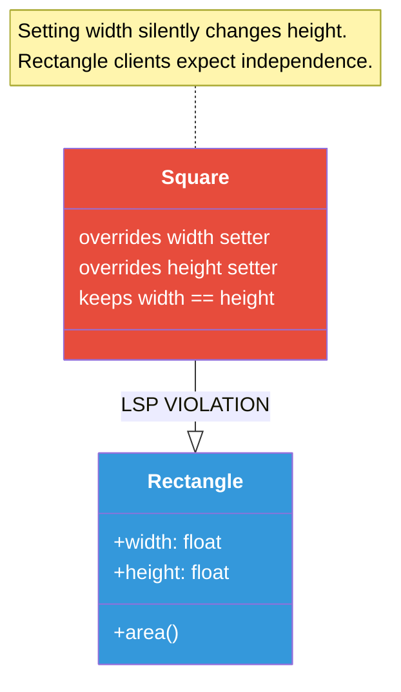
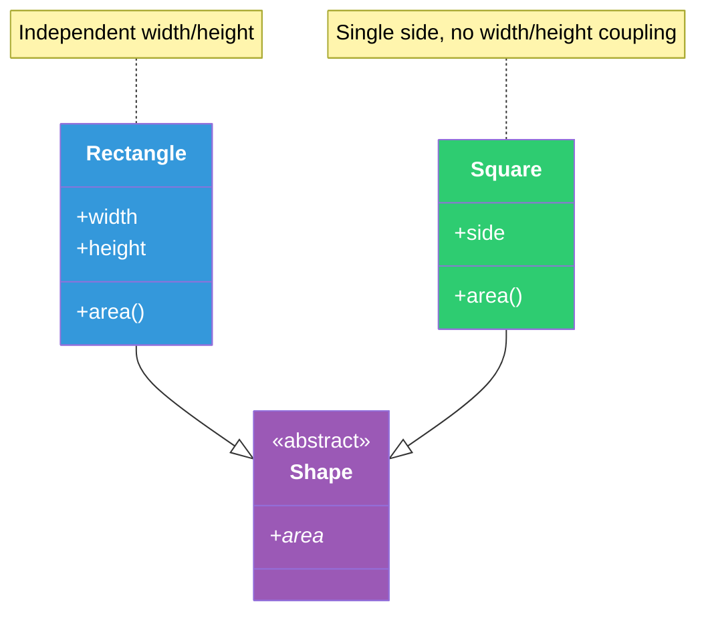
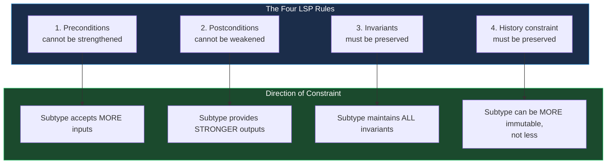
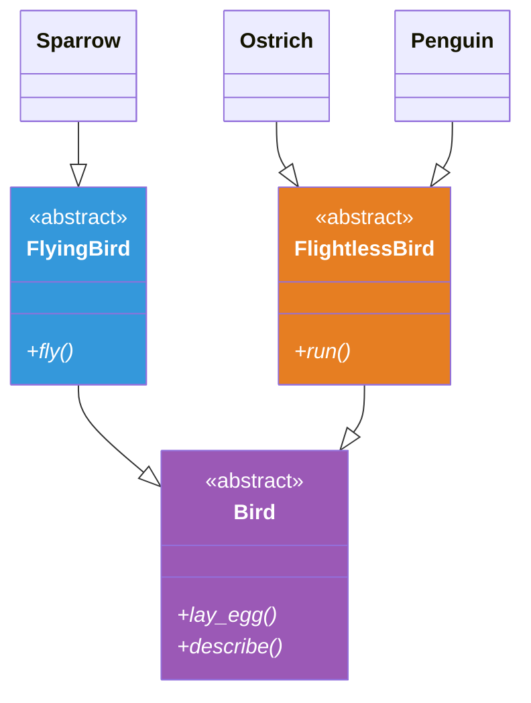
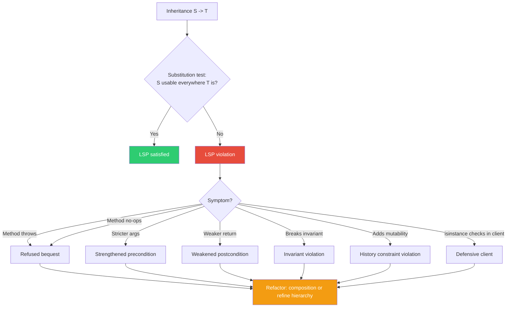
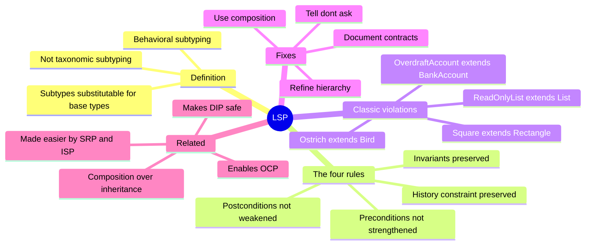

# Liskov Substitution Principle (LSP)

#oop #solid #lsp #subtyping #contracts #inheritance #teaching #deep-dive

> [!quote] Barbara Liskov (1987)
> "If for each object `o1` of type `S` there is an object `o2` of type `T` such that for all programs `P` defined in terms of `T`, the behavior of `P` is unchanged when `o1` is substituted for `o2`, then `S` is a subtype of `T`."

The **Liskov Substitution Principle** is the *L* of [[SOLID-Overview|SOLID]]. It is the most formally stated of the five principles, the most subtle in practice, and the principle most often violated by well-meaning inheritance. Where [[Single-Responsibility|SRP]] is about cohesion and [[Open-Closed|OCP]] is about extension, LSP is about **contracts**: a subtype must honor the contract of its base type, or the inheritance is a lie.

This note unpacks LSP in depth: Barbara Liskov's original definition, the four formal rules (history constraint, postcondition, precondition, invariants), the classic violation examples (Square/Rectangle, Ostrich/Bird, ReadOnlyList/List), how to fix violations by refining hierarchies or using composition, and the relationship to design by contract.

Prerequisites: [[Inheritance]], [[Polymorphism]], [[Abstraction]]. Read [[SOLID-Overview]] and [[Open-Closed]] first.

---

## 1. The Principle, In One Sentence

> **Objects of a superclass shall be replaceable with objects of its subclasses without breaking the program.**

Or, in the negative form:

> **If a subtype cannot stand in for its base type, the inheritance is wrong.**

### 1.1 The "Is-A" Test

Most developers are taught that inheritance models the "is-a" relationship: a `Dog` is an `Animal`, a `Car` is a `Vehicle`, a `Square` is a `Rectangle`. LSP sharpens this:

> The "is-a" relationship is about **behavior**, not **taxonomy**.

A `Square` *is* a rectangle in the mathematical sense — both have four sides, and a square is the special case where all sides are equal. But behaviorally, a `Square` does not behave like a `Rectangle`: setting the width of a square also changes its height (to keep it square), which violates the expectation of a `Rectangle` whose width and height are independent.

If the behavior is wrong, the inheritance is wrong — even if the taxonomy is right. **LSP is about behavioral subtyping, not taxonomic subtyping.**

### 1.2 The Substitution Test

LSP gives you a concrete test:

> If I take any code that uses a `Rectangle`, and I substitute a `Square` everywhere, does the code still work correctly?

If yes — the `Square` honors the `Rectangle` contract — then `Square` is a true subtype. If no — the `Square` breaks the code — then `Square` should not inherit from `Rectangle`, no matter how intuitive the "is-a" feels.

---

## 2. Barbara Liskov and the History

### 2.1 The 1987 Keynote

Barbara Liskov, then a professor at MIT (she would later win the Turing Award in 2008 for her work on data abstraction), delivered the keynote at the OOPSLA *Data Abstraction and Hierarchy* workshop in 1987. Her topic: what does it actually mean for one type to be a "subtype" of another?

Her answer, refined in a 1993 paper with Jeannette Wing (*"Family Values: A Behavioral Notion of Subtyping"*), was the principle that now bears her name. Subtyping, she argued, is not just about sharing an interface — it is about preserving the **behavioral contract**. A subtype must accept the same inputs (or more), produce the same outputs (or stronger), maintain the same invariants, and never make promises it cannot keep.

### 2.2 Why This Was Needed

By 1987, object-oriented programming was mainstream, and inheritance was being used liberally. Developers were discovering that "intuitive" inheritance often broke code: a `Square` that inherited from `Rectangle` behaved surprisingly; a `ReadOnlyList` that inherited from `List` threw exceptions on `add()`. Liskov's principle gave the community a way to *reason* about when inheritance was safe.

### 2.3 In SOLID

Robert C. Martin incorporated LSP into [[SOLID-Overview|SOLID]] as the *L*. He emphasizes that LSP is what makes polymorphism-based [[Open-Closed|OCP]] safe: if subclasses are not substitutable, then "open for extension by subclassing" is a lie, because clients of the base class will break when given a subtype.

---

## 3. The Classic Violation: Square/Rectangle

Let's work through the most famous LSP violation in detail.

### 3.1 The Setup

```python
from typing import Self
from typing_extensions import override
# bad_shapes.py
class Rectangle:
    """A rectangle with independently settable width and height."""

    def __init__(self, width: float, height: float):
        self._width = width
        self._height = height

    @property
    @override
    def width(self) -> float:
        return self._width

    @width.setter
    @override
    def width(self, value: float) -> Self:
        self._width = value

    @property
    @override
    def height(self) -> float:
        return self._height

    @height.setter
    @override
    def height(self, value: float) -> Self:
        self._height = value

    @override
    def area(self) -> float:
        return self._width * self._height


class Square(Rectangle):
    """A square — all sides equal. Inherits from Rectangle because
    'a square is a rectangle.'"""

    @property
    @override
    def width(self) -> float:
        return self._width

    @width.setter
    @override
    def width(self, value: float) -> Self:
        # To keep it a square, setting width also sets height.
        self._width = value
        self._height = value

    @property
    @override
    def height(self) -> float:
        return self._height

    @height.setter
    @override
    def height(self, value: float) -> Self:
        # Same logic: setting height also sets width.
        self._width = value
        self._height = value
```

### 3.2 The Violation

Now consider code that uses a `Rectangle`:

```python
def resize_rectangle(rect: Rectangle, factor: float) -> Self:
    """Doubles the width and triples the height of the rectangle."""
    rect.width *= factor
    rect.height *= factor * 1.5  # let's say we want non-uniform scaling


# Works fine for a Rectangle:
r = Rectangle(2, 3)
resize_rectangle(r, 2)
print(r.area())  # (2*2) * (3*3) = 4 * 9 = 36

# Surprising behavior for a Square:
s = Square(2, 2)  # actually constructed as a square
resize_rectangle(s, 2)
# After `s.width *= 2`:  width=4, height=4 (Square setter keeps both equal)
# After `s.height *= 3`: width=12, height=12 (Square setter keeps both equal)
print(s.area())  # 144 — but a Rectangle with width=4, height=6 would be 24
```

The function `resize_rectangle` worked correctly for `Rectangle` but produced a surprising result for `Square`. The `Square` could not be substituted for a `Rectangle` without changing the program's behavior.

### 3.3 Why This Is an LSP Violation

The `Rectangle` contract (implicit but real) says:

- `width` and `height` are **independent**: setting one does not affect the other.
- After `rect.width = w; rect.height = h`, the rectangle has width `w` and height `h`.

The `Square` subclass **breaks** this contract:

- Setting `Square.width` also changes `height` (and vice versa).
- After `s.width = w; s.height = h`, the square has width `h` and height `h` (the last write wins) — not `w` and `h`.

Any code that relies on the `Rectangle` contract will break when given a `Square`. The `Square` is therefore not a true subtype of `Rectangle`, despite the taxonomic "is-a" relationship.



### 3.4 The Fix: Don't Inherit

The fix is to *not* make `Square` inherit from `Rectangle`. They are sibling types under a common parent that captures only what they genuinely share:

```python
# good_shapes.py
from abc import ABC, abstractmethod


class Shape(ABC):
    """Common interface for all shapes."""

    @property
    @abstractmethod
    @override
    def area(self) -> float: ...


class Rectangle(Shape):
    """A rectangle with independently settable width and height."""

    def __init__(self, width: float, height: float):
        self._width = width
        self._height = height

    @property
    @override
    def width(self) -> float:
        return self._width

    @width.setter
    @override
    def width(self, value: float) -> Self:
        self._width = value

    @property
    @override
    def height(self) -> float:
        return self._height

    @height.setter
    @override
    def height(self, value: float) -> Self:
        self._height = value

    @property
    @override
    def area(self) -> float:
        return self._width * self._height


class Square(Shape):
    """A square — all sides equal. Does NOT inherit from Rectangle,
    because squares do not support independent width/height setting."""

    def __init__(self, side: float):
        self._side = side

    @property
    @override
    def side(self) -> float:
        return self._side

    @side.setter
    @override
    def side(self, value: float) -> Self:
        self._side = value

    @property
    @override
    def area(self) -> float:
        return self._side ** 2
```

Now `Rectangle` and `Square` are siblings, both substitutable for `Shape`. The `resize_rectangle` function can require a `Rectangle` (not a `Shape`) — and it will never receive a `Square`, so its contract is honored.



---

## 4. The Four Formal Rules

Liskov and Wing (1993) formalized LSP as four rules. A subtype must satisfy all four to be a true behavioral subtype.

### 4.1 Rule 1: Preconditions Cannot Be Strengthened

A **precondition** is what a method requires of its callers (e.g., "the argument must be positive"). A subtype's method can have a *weaker* or *equal* precondition (accept more inputs), but not a *stronger* one (accept fewer).

**Intuition**: If a `Rectangle.set_width(value)` accepts any positive float, then `Square.set_width(value)` must also accept any positive float. If `Square` rejected negative widths (which `Rectangle` accepted), clients of `Rectangle` would break when handed a `Square`.

```python
# Violation: strengthened precondition
class Base:
    @override
    def process(self, value: int) -> Self:
        # Accepts any int
        print(value)


class Derived(Base):
    @override
    def process(self, value: int) -> Self:
        # Strengthens precondition: requires positive int
        if value <= 0:
            raise ValueError("Must be positive")
        print(value)


# A client of Base:
def use(b: Base) -> Self:
    b.process(-5)  # works for Base, raises for Derived


use(Base())      # OK
use(Derived())   # raises ValueError — LSP violation
```

### 4.2 Rule 2: Postconditions Cannot Be Weakened

A **postcondition** is what a method guarantees to its callers (e.g., "the return value is non-negative"). A subtype's method can have a *stronger* or *equal* postcondition (promise more), but not a *weaker* one (promise less).

**Intuition**: If `Rectangle.area()` always returns a non-negative float, then `Square.area()` must also always return a non-negative float. If `Square.area()` could return a negative number (somehow), clients of `Rectangle` would break.

```python
# Violation: weakened postcondition
class Base:
    @override
    def calculate_score(self) -> int:
        return 100  # always non-negative


class Derived(Base):
    @override
    def calculate_score(self) -> int:
        return -1  # weaker postcondition — sometimes negative


# A client of Base:
def display_score(b: Base) -> Self:
    score = b.calculate_score()
    print(f"Your score: {score}")  # assumes non-negative
    # If negative, this looks wrong


display_score(Base())      # "Your score: 100"
display_score(Derived())   # "Your score: -1" — surprising
```

### 4.3 Rule 3: Invariants Must Be Preserved

An **invariant** is a property that always holds for instances of a class (e.g., "the balance is always non-negative," "the queue size is always non-negative"). A subtype must preserve all invariants of its base type.

**Intuition**: If `BankAccount` guarantees that the balance never goes negative, then `OverdraftAccount` (a subtype) must also guarantee this — even if it allows overdrafts, the invariant as stated by `BankAccount` must still hold from the client's perspective. (If you need to violate it, you need a different abstraction.)

```python
# Violation: broken invariant
class BankAccount:
    def __init__(self):
        self._balance = 0

    @override
    def deposit(self, amount: float) -> Self:
        if amount <= 0:
            raise ValueError("Must deposit positive amount")
        self._balance += amount

    @override
    def withdraw(self, amount: float) -> Self:
        if amount > self._balance:
            raise ValueError("Insufficient funds")
        self._balance -= amount

    @property
    @override
    def balance(self) -> float:
        return self._balance


class OverdraftAccount(BankAccount):
    """Allows overdrafts up to a limit."""

    def __init__(self, overdraft_limit: float = -1000):
        super().__init__()
        self._overdraft_limit = overdraft_limit

    @override
    def withdraw(self, amount: float) -> Self:
        # Violates the invariant: balance can go negative
        if amount > self._balance - self._overdraft_limit:
            raise ValueError("Exceeds overdraft limit")
        self._balance -= amount
        # Now self._balance can be negative, violating BankAccount's invariant


# A client of BankAccount:
def report_balance(account: BankAccount) -> Self:
    print(f"Your balance is ${account.balance:.2f}")
    # Client assumes balance is always non-negative...


acc = OverdraftAccount()
acc.deposit(100)
acc.withdraw(500)  # balance is now -400
report_balance(acc)  # "Your balance is $-400.00" — invariant broken
```

The fix: do not make `OverdraftAccount` a subtype of `BankAccount`. Either create a common parent `Account` with no balance invariant, or use composition.

### 4.4 Rule 4: History Constraint

A subtype must not allow state changes that the base type does not allow. Specifically, **mutable state in a base type can be made immutable in a subtype, but immutable state in a base type cannot be made mutable in a subtype**.

**Intuition**: If `ImmutablePoint` (a base class) has immutable `x` and `y`, a subtype `MutablePoint` cannot allow setting `x` and `y` — because clients of `ImmutablePoint` rely on the values never changing.

```python
# Violation: history constraint
class ImmutablePoint:
    def __init__(self, x: float, y: float):
        self._x = x
        self._y = y

    @property
    @override
    def x(self) -> float:
        return self._x

    @property
    @override
    def y(self) -> float:
        return self._y


class MutablePoint(ImmutablePoint):
    """Adds setters, making the point mutable."""

    @property
    @override
    def x(self) -> float:
        return self._x

    @x.setter
    @override
    def x(self, value: float) -> Self:
        self._x = value  # history constraint violation

    @property
    @override
    def y(self) -> float:
        return self._y

    @y.setter
    @override
    def y(self, value: float) -> Self:
        self._y = value  # history constraint violation


# A client of ImmutablePoint:
def use_point(p: ImmutablePoint) -> Self:
    initial_x = p.x
    # ... do other work, expecting p.x to never change ...
    assert p.x == initial_x  # client assumes immutability


p = MutablePoint(1, 2)
p.x = 99  # mutates the "immutable" point
use_point(p)  # assertion will fail
```

The fix: do not inherit `MutablePoint` from `ImmutablePoint`. Make them siblings under a common `Point` interface that exposes only getters.



---

## 5. The Second Classic: Ostrich and Bird

A bird can fly, right? So we model:

```python
# bad_birds.py
class Bird:
    @override
    def fly(self) -> Self:
        print("Flying!")


class Ostrich(Bird):
    """An ostrich is a bird, but it can't fly."""

    @override
    def fly(self) -> Self:
        raise NotImplementedError("Ostriches can't fly!")


class Penguin(Bird):
    @override
    def fly(self) -> Self:
        raise NotImplementedError("Penguins can't fly!")
```

### 5.1 The Violation

A client of `Bird`:

```python
def make_birds_fly(birds: list[Bird]) -> Self:
    for bird in birds:
        bird.fly()


make_birds_fly([Bird(), Ostrich(), Penguin()])
# First bird flies.
# Second raises NotImplementedError.
# Third never gets called.
```

The `Bird` contract says "birds can fly." `Ostrich` and `Penguin` violate this contract by raising an exception. They are not true subtypes of `Bird`.

### 5.2 The Fix: Refine the Hierarchy

Introduce a more specific abstraction for birds that can fly:

```python
# good_birds.py
from abc import ABC, abstractmethod


class Bird(ABC):
    """All birds share some behavior (laying eggs, having feathers),
    but flying is not part of the base contract."""

    @abstractmethod
    @override
    def lay_egg(self) -> Self: ...

    @abstractmethod
    @override
    def describe(self) -> str: ...


class FlyingBird(Bird):
    """A bird that can fly."""

    @abstractmethod
    @override
    def fly(self) -> Self: ...


class FlightlessBird(Bird):
    """A bird that cannot fly."""

    @abstractmethod
    @override
    def run(self) -> Self: ...


class Sparrow(FlyingBird):
    @override
    def lay_egg(self) -> Self:
        print("Sparrow lays an egg")

    @override
    def describe(self) -> str:
        return "A small flying bird"

    @override
    def fly(self) -> Self:
        print("Sparrow flies")


class Ostrich(FlightlessBird):
    @override
    def lay_egg(self) -> Self:
        print("Ostrich lays a huge egg")

    @override
    def describe(self) -> str:
        return "A large flightless bird"

    @override
    def run(self) -> Self:
        print("Ostrich runs fast")


class Penguin(FlightlessBird):
    @override
    def lay_egg(self) -> Self:
        print("Penguin lays an egg")

    @override
    def describe(self) -> str:
        return "A swimming flightless bird"

    @override
    def run(self) -> Self:
        print("Penguin waddles")
```

Now clients that need flying birds require `FlyingBird`; clients that need any bird require `Bird`. `Ostrich` is no longer substitutable for `FlyingBird`, but it never claimed to be — the inheritance hierarchy reflects the behavioral truth.



---

## 6. The Third Classic: ReadOnlyList and List

A list supports `add`, `remove`, and indexing. A read-only list supports indexing but not modification. Should `ReadOnlyList` inherit from `List`?

### 6.1 The Violation

```python
# bad_lists.py
class MyList:
    def __init__(self):
        self._items = []

    @override
    def add(self, item) -> Self:
        self._items.append(item)

    @override
    def remove(self, item) -> Self:
        self._items.remove(item)

    @override
    def get(self, index: int):
        return self._items[index]

    @override
    def __len__(self) -> int:
        return len(self._items)


class ReadOnlyList(MyList):
    """A list that cannot be modified."""

    @override
    def add(self, item) -> Self:
        raise PermissionError("Cannot add to a read-only list")

    @override
    def remove(self, item) -> Self:
        raise PermissionError("Cannot remove from a read-only list")
```

A client of `MyList`:

```python
def add_items_to_list(lst: MyList, items: list) -> Self:
    for item in items:
        lst.add(item)


add_items_to_list(ReadOnlyList(), [1, 2, 3])
# Raises PermissionError — but the function signature says it accepts a MyList.
```

`ReadOnlyList` violates LSP: it cannot be substituted for `MyList` without breaking code that relies on `add` and `remove` working.

This is essentially the situation with `tuple` (immutable) vs `list` (mutable) in Python. The standard library *does not* make `tuple` a subtype of `list` — precisely because doing so would violate LSP. They are sibling types under the `Sequence` protocol.

### 6.2 The Fix: Common Read Interface

```python
# good_lists.py
from abc import ABC, abstractmethod


class ReadableSequence(ABC):
    """A sequence that can be read but not necessarily modified."""

    @abstractmethod
    @override
    def get(self, index: int): ...

    @abstractmethod
    @override
    def __len__(self) -> int: ...

    @override
    def __getitem__(self, index: int):
        return self.get(index)


class MutableList(ReadableSequence):
    def __init__(self):
        self._items = []

    @override
    def add(self, item) -> Self:
        self._items.append(item)

    @override
    def remove(self, item) -> Self:
        self._items.remove(item)

    @override
    def get(self, index: int):
        return self._items[index]

    @override
    def __len__(self) -> int:
        return len(self._items)


class ReadOnlyList(ReadableSequence):
    def __init__(self, items: list):
        self._items = list(items)  # copy to ensure immutability

    @override
    def get(self, index: int):
        return self._items[index]

    @override
    def __len__(self) -> int:
        return len(self._items)
```

Now `MutableList` and `ReadOnlyList` are siblings under `ReadableSequence`. Functions that need to read items accept `ReadableSequence`; functions that need to modify items accept `MutableList`. Substitution is safe in both directions.

---

## 7. Recognizing LSP Violations

### 7.1 The Substitution Test

For any inheritance relationship `S` → `T`, ask: *Can I substitute an `S` everywhere the code expects a `T`, without changing the code's correctness?* If no, the inheritance is wrong.

### 7.2 Subclass Throws `NotImplementedError` or `PermissionError`

If a subclass overrides a method to raise an exception (because it cannot fulfill the parent's contract), the subclass is *refusing the bequest* — a clear LSP violation.

### 7.3 Subclass Overrides Method to No-Op

Same situation, quieter: the subclass overrides the method to do nothing (silently). The parent's contract said the method does something; the subclass violates it.

### 7.4 Subclass Changes the Type Signature

If a subclass overrides a method to accept fewer types (stricter argument types) or return weaker types, it violates the precondition or postcondition rules.

### 7.5 Client Code Checks `isinstance` Before Calling

If clients of `T` write code like `if not isinstance(obj, S): obj.method()`, they are protecting themselves against the LSP violation. The `isinstance` check is a smell.

### 7.6 Subclass Adds "Side Effects" the Parent Did Not Have

If the subclass's version of a method does extra work the parent did not (e.g., logging, network calls, modifications to other state), it may be violating the contract — even if it nominally satisfies the postcondition.



---

## 8. How to Fix LSP Violations

There are two main strategies.

### 8.1 Refine the Inheritance Hierarchy

Split the offending parent into more specific abstractions. The Square/Rectangle fix (introduce `Shape` as the common parent) and the Bird/Ostrich fix (introduce `FlyingBird` and `FlightlessBird`) both use this strategy.

When to use: when the parent class genuinely mixes concerns that should be separated (flying and non-flying birds; rectangles and squares; mutable and immutable lists).

### 8.2 Replace Inheritance with Composition

Sometimes there is no clean way to refine the hierarchy. In that case, replace inheritance with composition: `Square` *has a* `Rectangle` (or a `Shape`) rather than *is a* `Rectangle`.

```python
# composition_square.py
class Rectangle:
    def __init__(self, width: float, height: float):
        self._width = width
        self._height = height

    @property
    @override
    def width(self) -> float:
        return self._width

    @property
    @override
    def height(self) -> float:
        return self._height

    @property
    @override
    def area(self) -> float:
        return self._width * self._height


class Square:
    """A square is composed of a rectangle with equal sides."""

    def __init__(self, side: float):
        self._rect = Rectangle(side, side)

    @property
    @override
    def side(self) -> float:
        return self._rect.width

    @side.setter
    @override
    def side(self, value: float) -> Self:
        self._rect = Rectangle(value, value)

    @property
    @override
    def area(self) -> float:
        return self._rect.area
```

Now `Square` and `Rectangle` are unrelated by inheritance. `Square` cannot be passed to functions expecting a `Rectangle` — which is *correct*, because `Square` cannot honor the `Rectangle` contract.

> [!tip] Composition Over Inheritance
> The [[Composition-Over-Inheritance]] heuristic is closely related to LSP. When in doubt about whether inheritance is appropriate, default to composition. Composition cannot violate LSP because there is no inheritance relationship to violate.

### 8.3 Document the Contract

If you must use inheritance and you suspect LSP is fragile, document the contract explicitly. Use docstrings, type hints, and assertions to specify preconditions, postconditions, and invariants. This does not *fix* the violation, but it makes the contract explicit so that subclass authors know what they must preserve.

Python's `abc` module and `typing.Protocol` are tools for this. Design-by-contract libraries (like `icontract` for Python) provide runtime enforcement.

---

## 9. LSP and Design by Contract

**Design by Contract (DbC)** is a methodology pioneered by Bertrand Meyer (the same Meyer who formulated OCP). DbC specifies that:

- Each method has a **precondition** (what it requires from the caller).
- Each method has a **postcondition** (what it guarantees to the caller).
- Each class has **invariants** (properties that always hold).

LSP is essentially DbC applied to inheritance: a subtype must honor the contract of its parent. Python does not have native DbC syntax (Eiffel does), but you can simulate it:

```python
class BankAccount:
    def __init__(self):
        self._balance = 0

    @override
    def withdraw(self, amount: float) -> Self:
        # Precondition
        assert amount > 0, "Must withdraw positive amount"
        assert amount <= self._balance, "Insufficient funds"

        old_balance = self._balance
        self._balance -= amount

        # Postcondition
        assert self._balance == old_balance - amount
        # Invariant
        assert self._balance >= 0, "Balance must stay non-negative"


class OverdraftAccount(BankAccount):
    def __init__(self, overdraft_limit: float = 1000):
        super().__init__()
        self._overdraft_limit = overdraft_limit

    @override
    def withdraw(self, amount: float) -> Self:
        # If we change the precondition (allow more), that's fine.
        # If we strengthen it (allow less), that's an LSP violation.
        assert amount > 0, "Must withdraw positive amount"
        assert amount <= self._balance + self._overdraft_limit, "Exceeds overdraft"

        old_balance = self._balance
        self._balance -= amount

        # Postcondition: same as parent
        assert self._balance == old_balance - amount
        # INVARIANT VIOLATION: balance can now be negative
        # assert self._balance >= 0  # <-- this would fail
```

The `OverdraftAccount` violates the invariant. To make this safe, either:

- Change `BankAccount`'s invariant to allow negative balances (weakening the parent — affects all clients), or
- Do not make `OverdraftAccount` a subtype of `BankAccount` (use composition).

### 9.1 The `icontract` Library

For real DbC in Python, the `icontract` library provides runtime precondition and postcondition checks:

```python
from icontract import require, ensure, invariant


@invariant(lambda self: self._balance >= 0)
class BankAccount:
    def __init__(self):
        self._balance = 0

    @require(lambda amount: amount > 0)
    @require(lambda self, amount: amount <= self._balance)
    @ensure(lambda self, result: self._balance >= 0)
    @override
    def withdraw(self, amount: float) -> Self:
        self._balance -= amount
```

With `icontract`, attempting to subclass `BankAccount` in a way that violates the invariant would fail at runtime — making LSP violations explicit.

---

## 10. LSP and "Tell, Don't Ask"

The **Tell, Don't Ask** principle is related to LSP. It says: tell an object to do something, rather than asking it for its state and then deciding what to do.

```python
# Ask: type-checking then branching — LSP smell
def process_shape(shape):
    if isinstance(shape, Circle):
        radius = shape.radius
        area = 3.14 * radius ** 2
    elif isinstance(shape, Rectangle):
        area = shape.width * shape.height
    elif isinstance(shape, Triangle):
        # ...
        pass
    return area


# Tell: polymorphism — LSP-safe
def process_shape(shape):
    return shape.area()  # each shape knows its own area
```

The "tell" version is LSP-safe because it relies on the contract that every `Shape` has an `area()` method that returns the correct area. The "ask" version is LSP-fragile because adding a new shape requires editing the function.

The relationship: LSP says subtypes must honor the parent's contract; Tell-Don't-Ask says clients should rely on the parent's contract (by calling methods) rather than inspecting the subtype. Together, they make polymorphism safe.

---

## 11. Common Student Misconceptions

> [!warning] Misconception 1: "If it compiles, the inheritance is fine."
> No. Most languages check *structural* subtyping (does the subclass have all the parent's methods?) but not *behavioral* subtyping (does the subclass honor the parent's contract?). LSP is about behavior, which compilers cannot check.

> [!warning] Misconception 2: "If a Square is a Rectangle mathematically, it should inherit."
> No. LSP is about behavior, not taxonomy. If the `Rectangle`'s API exposes `width` and `height` as independent, then `Square` cannot honor that API. Mathematical truth does not override behavioral truth.

> [!warning] Misconception 3: "If a subclass throws NotImplementedError, that's OK — the caller should handle it."
> No. The whole point of LSP is that the caller should not need to handle subtype-specific exceptions. If the caller must handle them, the inheritance is wrong.

> [!warning] Misconception 4: "LSP is only about method signatures."
> No. LSP is about contracts — preconditions, postconditions, invariants, history. Two methods with identical signatures can still violate LSP if their behavior differs in contract-breaking ways.

> [!warning] Misconception 5: "I can fix an LSP violation by adding `isinstance` checks in the caller."
> No. That *works around* the violation but does not fix it. The `isinstance` check is itself a code smell that points to the underlying LSP problem. Fix the inheritance; the `isinstance` checks will disappear.

> [!warning] Misconception 6: "LSP applies only to classes."
> No. LSP applies to any subtype relationship: classes, interfaces, Protocols, generic type parameters. Wherever one type is declared to be substitutable for another, LSP applies.

> [!warning] Misconception 7: "Subclassing is always wrong because of LSP."
> No. Subclassing is fine when the subtype genuinely honors the parent's contract. The point of LSP is not to forbid inheritance, but to make inheritance *safe* by insisting on contract preservation.

---

## 12. The Relationship to Other SOLID Principles

### 12.1 LSP Makes OCP Safe

[[Open-Closed|OCP]] says: extend by adding new subclasses, without modifying existing code. This works only if the new subclasses are substitutable for the parent — which is LSP. Without LSP, "extending by subclassing" is a lie: the new subclass will break the client code that uses the parent.

### 12.2 LSP and SRP

[[Single-Responsibility|SRP]] violations (God classes) make LSP hard to satisfy, because the parent's contract is large and incoherent. Splitting responsibilities (SRP) usually makes the contract smaller and easier for subclasses to honor.

### 12.3 LSP and ISP

[[Interface-Segregation|ISP]]-compliant interfaces are smaller and more focused — making it easier for subtypes to honor the full contract. Fat interfaces (ISP violation) make LSP fragile, because subtypes must implement many methods they may not be able to honor.

### 12.4 LSP and DIP

[[Dependency-Inversion|DIP]] says: depend on abstractions. LSP says: subtypes of those abstractions must be substitutable. Together, they make depending on abstractions *safe* — you can swap any subtype for any other without breaking the depending code.



---

## 13. A Subtle Case: Empty Stack

Consider a `Stack` with methods `push`, `pop`, and `peek`. Should an `EmptyStack` be a subtype of `Stack`?

```python
class Stack:
    @override
    def push(self, item): ...
    @override
    def pop(self): ...
    @override
    def peek(self): ...


class EmptyStack(Stack):
    @override
    def push(self, item):
        # Delegate to a real stack
        ...

    @override
    def pop(self):
        raise IndexError("pop from empty stack")

    @override
    def peek(self):
        raise IndexError("peek from empty stack")
```

Is this an LSP violation?

The answer depends on the contract of `Stack.pop()`. If the contract says "*pop always returns an item*," then `EmptyStack.pop` violates it. If the contract says "*pop returns an item if the stack is non-empty, raises IndexError if empty*," then `EmptyStack.pop` honors it.

The lesson: **LSP is about contracts, and contracts are about specification**. The same code can be LSP-compliant or LSP-violating depending on what the contract says. This is why documenting contracts (in docstrings, type hints, assertions) matters.

Python's standard library handles this consistently: `list.pop()` on an empty list raises `IndexError`. The contract is documented. Any subtype of `list` that overrides `pop` to do something else (return `None`, hang, etc.) would violate LSP.

---

## 14. LSP in the Wild

### 14.1 The Java `Properties` Class

Java's `java.util.Properties` extends `Hashtable`. The `Properties` class is supposed to store only `String` keys and values, but because it inherits from `Hashtable` (which accepts any `Object`), callers can put non-strings into it via the inherited `put` method. This breaks the `Properties` invariant and is a notorious LSP violation in the standard library.

### 14.2 The Java `Stack` Class

Java's `java.util.Stack` extends `Vector`. This means you can insert an element at an arbitrary position in the stack via the inherited `add(int index, Object element)` method — breaking the stack abstraction (LIFO). The `Stack` class is widely considered a design mistake; modern Java code uses `Deque` instead.

### 14.3 The .NET `ReadOnlyCollection<T>`

.NET's `ReadOnlyCollection<T>` implements `IList<T>` but throws `NotSupportedException` on `Add`, `Remove`, and the index setter. This is an LSP violation that the .NET designers acknowledged — they chose to violate LSP in exchange for `ReadOnlyCollection<T>` being usable wherever `IList<T>` is expected (a tradeoff between LSP and convenience).

### 14.4 Python's `tuple` vs `list`

Python correctly does *not* make `tuple` a subtype of `list`. Both are sequences, but `tuple` is immutable. Making `tuple` inherit from `list` (and override mutating methods to throw) would have been a clear LSP violation. Instead, both implement the `Sequence` protocol.

---

## 15. Exercises

> [!exercise] Exercise 1: Spot the Violation
> A `CreditCard` class has methods `charge(amount)` and `refund(amount)`. A `PrepaidCard` subclass overrides `charge` to throw if the balance is insufficient, and overrides `refund` to throw unconditionally ("prepaid cards cannot be refunded"). Is this an LSP violation? Why or why not?

> [!exercise] Exercise 2: Fix Square/Rectangle with Composition
> Refactor the Square/Rectangle example using composition (Square *has a* Rectangle). Verify that the LSP violation is gone.

> [!exercise] Exercise 3: Bird Hierarchy
> Design a `Bird` hierarchy that includes flying birds, flightless birds, and swimming birds (penguins swim but do not fly). Ensure that no LSP violation exists.

> [!exercise] Exercise 4: The Four Rules
> For each of the four LSP rules (precondition, postcondition, invariant, history), write a small Python example that violates it.

> [!exercise] Exercise 5: Document the Contract
> Take the `BankAccount` class from this note. Write a complete contract (preconditions, postconditions, invariants) for `deposit` and `withdraw`. Then write an `OverdraftAccount` subclass. Does it violate the contract? Refactor if so.

> [!exercise] Exercise 6: LSP in the Standard Library
> Investigate Python's `collections.abc`. Why are `Mapping` and `MutableMapping` separate? How does this relate to LSP?

---

## 16. Summary

The Liskov Substitution Principle says: **subtypes must be substitutable for their base types without breaking the program**. LSP is about *behavioral* subtyping, not taxonomic subtyping — the question is not "is S a T in real life?" but "can S stand in for T in code?"

- The four formal rules: preconditions cannot be strengthened, postconditions cannot be weakened, invariants must be preserved, history constraint must be preserved.
- Classic violations: Square/Rectangle (independent setters), Ostrich/Bird (refused bequest on `fly`), ReadOnlyList/List (refused bequest on mutating methods), OverdraftAccount/BankAccount (broken invariant).
- Symptoms: subclass throws `NotImplementedError`, subclass no-ops a method, client code uses `isinstance` checks before calling.
- Fixes: refine the hierarchy (introduce intermediate abstractions), or replace inheritance with composition.
- LSP is closely tied to Design by Contract — contracts make substitution safe.
- LSP is what makes polymorphism-based [[Open-Closed|OCP]] actually work.

Without LSP, inheritance is a trap: it looks like reuse, but every subclass is a potential bug. With LSP, inheritance is a powerful tool for extension. Read [[Interface-Segregation]] next to see how keeping interfaces small makes LSP easier to satisfy.

---

## 17. Further Reading

- Barbara Liskov, *"Data Abstraction and Hierarchy"* (1987 OOPSLA keynote).
- Barbara Liskov and Jeannette Wing, *"Family Values: A Behavioral Notion of Subtyping"* (1993).
- Robert C. Martin, *Agile Software Development: Principles, Patterns, and Practices* (2002), Chapter 10 — LSP chapter.
- Bertrand Meyer, *Object-Oriented Software Construction* (2nd ed., 1997) — Design by Contract.
- [[SOLID-Overview]] — for the broader context.
- [[Open-Closed]] — the principle LSP makes safe.
- [[Inheritance]] — the language feature LSP constrains.
- [[Composition-Over-Inheritance]] — the alternative when LSP is fragile.
- `icontract` library — runtime contract checking in Python.

---

**Previous**: [[Open-Closed]]
**Next**: [[Interface-Segregation]]
