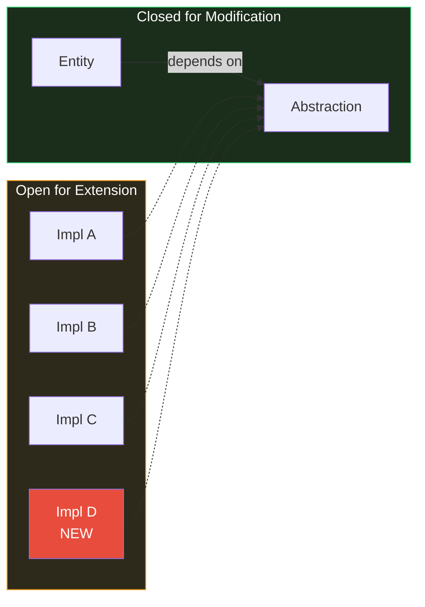
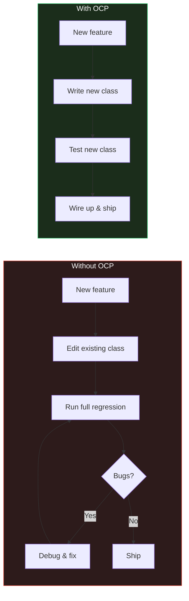
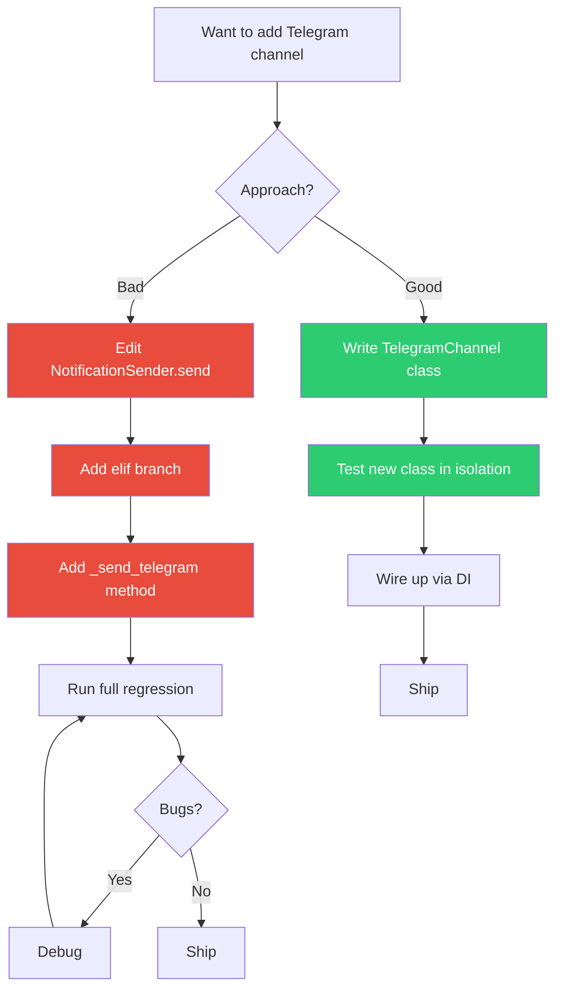
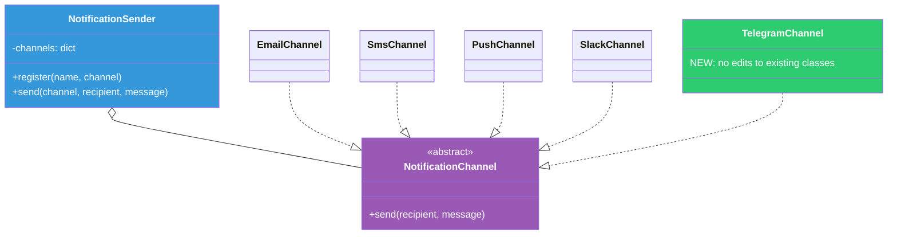
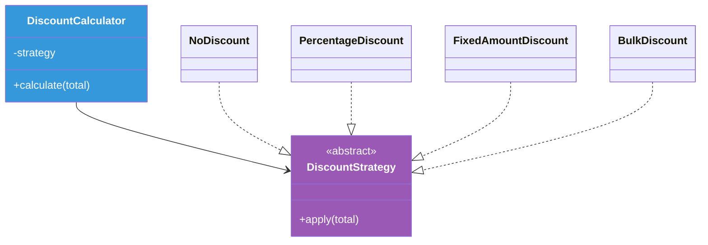
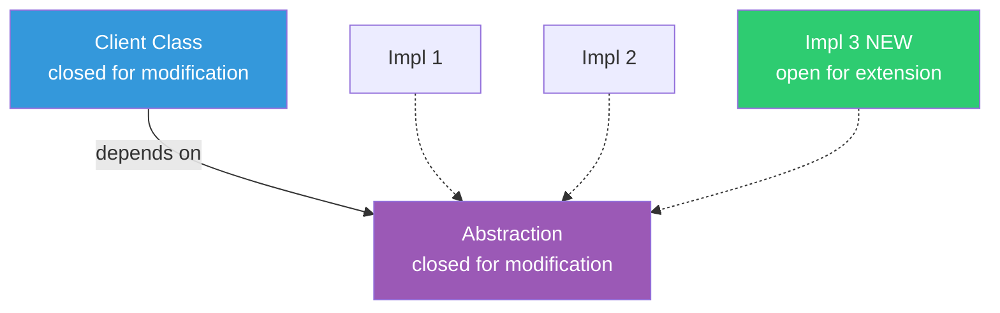
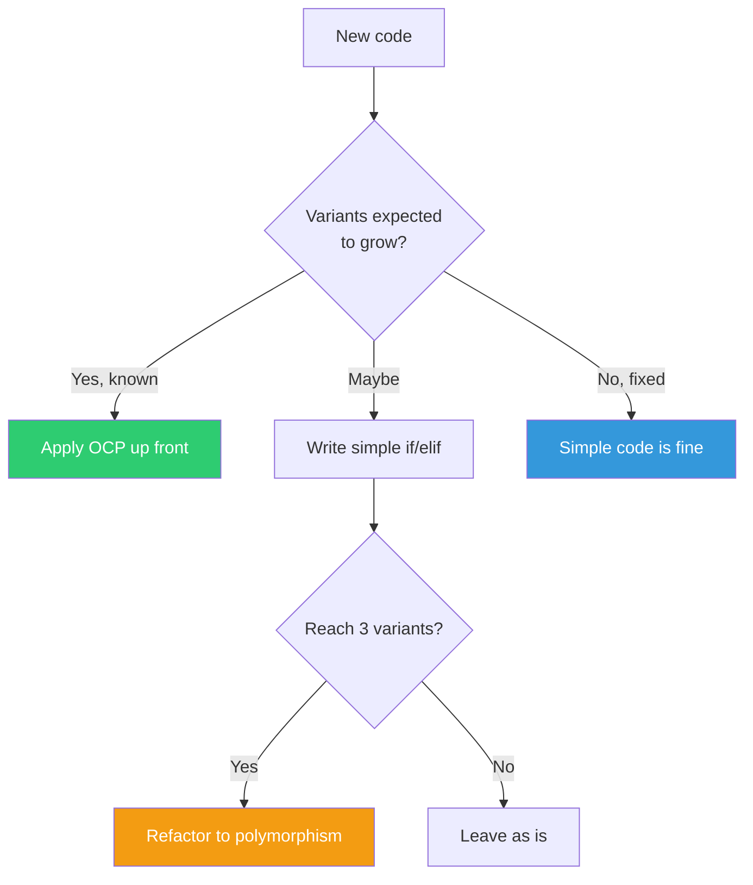
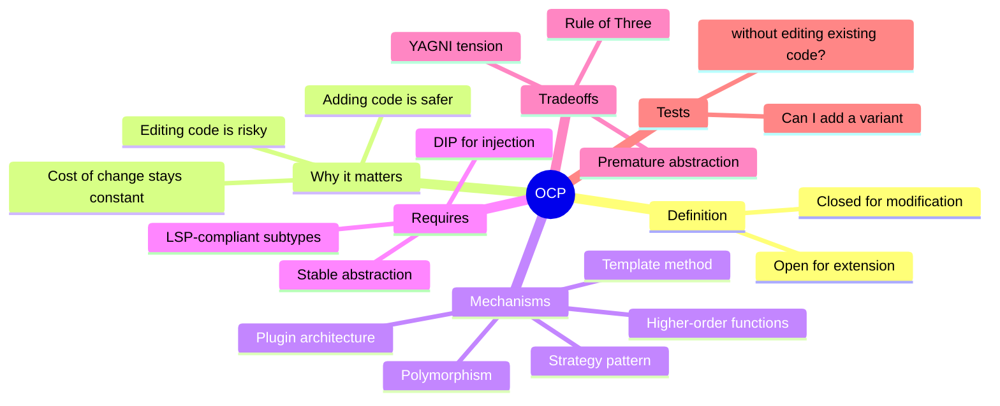

# Open-Closed Principle (OCP)

#oop #solid #ocp #polymorphism #strategy-pattern #teaching #deep-dive

> [!quote] Bertrand Meyer
> "Software entities (classes, modules, functions, etc.) should be **open for extension**, but **closed for modification**."

The **Open-Closed Principle** is the *O* of [[SOLID-Overview|SOLID]]. It was originally formulated by Bertrand Meyer in his 1988 book *Object-Oriented Software Construction*, before SOLID existed as an acronym. Of the five principles, OCP is arguably the *goal* — the other four are largely in service of achieving it. If your codebase is genuinely open for extension and closed for modification, you have arrived at a flexible, maintainable design.

This note unpacks OCP in depth: what "open" and "closed" really mean, why the principle matters, the mechanisms (polymorphism, strategy, template method, plugins) by which it is achieved, before/after refactors in Python, the relationship to abstraction and dependency inversion, and the warnings about over-engineering.

Prerequisites: [[Polymorphism]], [[Abstraction]], [[Inheritance]], [[Single-Responsibility]]. Read [[SOLID-Overview]] first.

---

## 1. The Principle, In One Sentence

> **Software entities should be open for extension, but closed for modification.**

Two words do all the work: **open** and **closed**.

### 1.1 Open for Extension

A software entity is *open for extension* if its behavior can be **extended** — made to do new things — without requiring changes to its source code. New behavior is added by writing *new* code (new classes, new functions, new modules), not by editing the existing entity.

### 1.2 Closed for Modification

A software entity is *closed for modification* if its source code does not need to be **edited** in order to extend its behavior. The existing code, once written and tested, is left alone. Bugs cannot be introduced into existing code if you never edit it.

### 1.3 The Apparent Paradox

The two halves sound contradictory: how can you extend behavior without changing the entity? The resolution is **abstraction**. The entity exposes an abstraction (an interface, an abstract base class, a Protocol) and works in terms of that abstraction. New behavior is added by creating *new implementations* of the abstraction. The entity itself does not change; only its inputs (the implementations it is given) change.



---

## 2. Why OCP Matters

### 2.1 Editing Existing Code Is Risky

When you edit a class that is already deployed, tested, and used by other code, you risk:

- **Breaking existing behavior** — a refactor that looks safe may break a client whose assumptions you did not know about.
- **Introducing subtle bugs** — a new branch in a method may interact with edge cases you forgot.
- **Triggering large test runs** — even if the existing tests pass, you must run them all, and any flaky test is now your problem.
- **Slowing down code review** — reviewers must understand both the old code and the new code, and the diff includes both.

The safest code is code that has not been touched since it was last verified.

### 2.2 Adding Code Is Safer Than Editing Code

When you add a new file with a new class that implements an existing abstraction, you:

- Cannot break the existing implementations (you did not touch them).
- Cannot break the entity that uses the abstraction (you did not touch it either).
- Only need to test the new code (plus a regression check that the entity still works with the new implementation).
- The diff is purely additive — reviewers see only new code.

OCP captures this asymmetry: prefer *additive change* (new files) over *editing change* (modifying existing files).

### 2.3 The Economic Argument

In a system that lives for years, the cost of adding the Nth feature should be roughly the same as adding the 1st feature. Without OCP, the cost grows linearly or worse — each new feature touches more code, each touch risks more regressions, each regression requires more debugging. With OCP, the cost stays roughly constant: write a new class, wire it up, ship.



---

## 3. The Canonical Violation: `if`/`elif` on Type

The most common OCP violation is a method that branches on the type of an object:

```python
# bad_notification.py
class NotificationSender:
    """Sends notifications via various channels."""

    @override
    def send(self, channel: str, recipient: str, message: str) -> Self:
        if channel == "email":
            self._send_email(recipient, message)
        elif channel == "sms":
            self._send_sms(recipient, message)
        elif channel == "push":
            self._send_push(recipient, message)
        elif channel == "slack":
            self._send_slack(recipient, message)
        else:
            raise ValueError(f"Unknown channel: {channel}")

    @override
    def _send_email(self, recipient: str, message: str) -> Self:
        import smtplib
        server = smtplib.SMTP("smtp.example.com")
        server.sendmail("noreply@example.com", recipient, message)
        server.quit()

    @override
    def _send_sms(self, recipient: str, message: str) -> Self:
        # Twilio integration
        print(f"SMS to {recipient}: {message}")

    @override
    def _send_push(self, recipient: str, message: str) -> Self:
        # Firebase Cloud Messaging
        print(f"Push to {recipient}: {message}")

    @override
    def _send_slack(self, recipient: str, message: str) -> Self:
        # Slack Web API
        print(f"Slack message to {recipient}: {message}")
```

### 3.1 Why This Violates OCP

To add a new channel — say, Telegram — you must:

1. Edit `send()` to add another `elif channel == "telegram":`.
2. Add a `_send_telegram()` method.
3. Re-run the entire test suite for `NotificationSender` (because you edited it).
4. Risk breaking the existing channels (because you edited the same method).

The class is **closed for extension** (you cannot add a channel without editing it) and **open for modification** (every new channel is a modification). The exact opposite of OCP.

### 3.2 The Violation Diagram



---

## 4. The Refactor: Polymorphism

The fix is to replace the type branch with polymorphism. Define an abstraction (`NotificationChannel`), implement it for each channel, and let the caller choose.

### 4.1 The Refactored Design

```python
# notification_channels.py
from abc import ABC, abstractmethod


class NotificationChannel(ABC):
    """The abstraction that all channels implement."""

    @abstractmethod
    @override
    def send(self, recipient: str, message: str) -> Self: ...


class EmailChannel(NotificationChannel):
    def __init__(self, smtp_host: str, sender: str):
        self._smtp_host = smtp_host
        self._sender = sender

    @override
    def send(self, recipient: str, message: str) -> Self:
        import smtplib
        server = smtplib.SMTP(self._smtp_host)
        server.sendmail(self._sender, recipient, message)
        server.quit()


class SmsChannel(NotificationChannel):
    def __init__(self, twilio_client):
        self._twilio = twilio_client

    @override
    def send(self, recipient: str, message: str) -> Self:
        self._twilio.messages.create(to=recipient, body=message)


class PushChannel(NotificationChannel):
    def __init__(self, fcm_client):
        self._fcm = fcm_client

    @override
    def send(self, recipient: str, message: str) -> Self:
        self._fcm.send(notification={"title": "Notification", "body": message},
                       token=recipient)


class SlackChannel(NotificationChannel):
    def __init__(self, webhook_url: str):
        self._webhook = webhook_url

    @override
    def send(self, recipient: str, message: str) -> Self:
        import requests
        requests.post(self._webhook, json={"text": f"to {recipient}: {message}"})
```

```python
# notification_sender.py
class NotificationSender:
    """
    Now closed for modification: adding a new channel does not
    require editing this class. New channels are added by registering
    a new NotificationChannel implementation.
    """

    def __init__(self):
        self._channels: dict[str, NotificationChannel] = {}

    @override
    def register(self, name: str, channel: NotificationChannel) -> Self:
        self._channels[name] = channel

    @override
    def send(self, channel: str, recipient: str, message: str) -> Self:
        if channel not in self._channels:
            raise ValueError(f"Unknown channel: {channel}")
        self._channels[channel].send(recipient, message)
```

```python
# usage.py
sender = NotificationSender()
sender.register("email", EmailChannel("smtp.example.com", "noreply@example.com"))
sender.register("sms", SmsChannel(twilio_client))
sender.register("push", PushChannel(fcm_client))
sender.register("slack", SlackChannel("https://hooks.slack.com/..."))

# Adding Telegram — without editing NotificationSender:
class TelegramChannel(NotificationChannel):
    def __init__(self, bot_token: str):
        self._bot_token = bot_token

    @override
    def send(self, recipient: str, message: str) -> Self:
        import requests
        requests.post(
            f"https://api.telegram.org/bot{self._bot_token}/sendMessage",
            json={"chat_id": recipient, "text": message},
        )


sender.register("telegram", TelegramChannel("123:ABC"))
```

### 4.2 The Refactor Diagram



### 4.3 What We Gained

- Adding Telegram requires **zero edits** to existing classes.
- Each channel is independently testable (mock the SMTP/Twilio/FCM/Slack client).
- Each channel is independently deployable (a new file, no merge conflicts with existing channels).
- The `NotificationSender` is now a stable, generic mechanism — it never needs to change again.

### 4.4 What We Paid

- More classes, more files.
- The caller must now choose which channel to use (or accept it via configuration).
- The indirection is one level deeper: `sender.send("email", ...)` calls `NotificationSender.send`, which calls `_channels["email"].send(...)`.

For systems with two channels that never change, this tradeoff is not worth it. For systems where channels are added regularly, the tradeoff pays for itself quickly.

---

## 5. Mechanisms for Achieving OCP

Polymorphism is the most common mechanism, but several others exist. Each is appropriate in a different context.

### 5.1 Polymorphism (Subtyping)

The pattern shown above. Define an abstract base class (or Protocol), implement it for each variant, and dispatch dynamically. Best when you have multiple variants of the same concept.

```python
class PaymentMethod(ABC):
    @abstractmethod
    @override
    def pay(self, amount: Decimal) -> Self: ...


class CreditCardPayment(PaymentMethod):
    @override
    def pay(self, amount: Decimal) -> Self: ...


class PayPalPayment(PaymentMethod):
    @override
    def pay(self, amount: Decimal) -> Self: ...


class CryptoPayment(PaymentMethod):
    @override
    def pay(self, amount: Decimal) -> Self: ...
```

Adding a new payment method = writing a new class. The `Checkout` class that uses `PaymentMethod` does not change.

### 5.2 Strategy Pattern

A specialization of polymorphism where the variant is chosen at runtime and injected. The classic example: a `DiscountCalculator` that uses different discount strategies.

```python
class DiscountStrategy(ABC):
    @abstractmethod
    @override
    def apply(self, total: Decimal) -> Self: ...


class NoDiscount(DiscountStrategy):
    @override
    def apply(self, total: Decimal) -> Self:
        return total


class PercentageDiscount(DiscountStrategy):
    def __init__(self, percent: float):
        self._percent = percent

    @override
    def apply(self, total: Decimal) -> Self:
        return total * (1 - self._percent / 100)


class FixedAmountDiscount(DiscountStrategy):
    def __init__(self, amount: Decimal):
        self._amount = amount

    @override
    def apply(self, total: Decimal) -> Self:
        return max(Decimal("0"), total - self._amount)


class BulkDiscount(DiscountStrategy):
    def __init__(self, threshold: Decimal, percent: float):
        self._threshold = threshold
        self._percent = percent

    @override
    def apply(self, total: Decimal) -> Self:
        if total >= self._threshold:
            return total * (1 - self._percent / 100)
        return total


class DiscountCalculator:
    def __init__(self, strategy: DiscountStrategy):
        self._strategy = strategy

    @override
    def calculate(self, total: Decimal) -> Self:
        return self._strategy.apply(total)
```



### 5.3 Template Method

When the *skeleton* of an algorithm is fixed but individual *steps* vary. The base class defines the algorithm; subclasses override the steps.

```python
from abc import ABC, abstractmethod


class DataPipeline(ABC):
    """Template method: the algorithm skeleton is fixed;
    individual steps are overridden by subclasses."""

    @override
    def run(self, source: str) -> str:
        raw = self.extract(source)
        cleaned = self.transform(raw)
        result = self.load(cleaned)
        return result

    @abstractmethod
    @override
    def extract(self, source: str) -> dict: ...

    @abstractmethod
    @override
    def transform(self, data: dict) -> dict: ...

    @abstractmethod
    @override
    def load(self, data: dict) -> str: ...


class CsvToDatabasePipeline(DataPipeline):
    @override
    def extract(self, source: str) -> dict:
        import csv
        with open(source) as f:
            return {"rows": list(csv.DictReader(f))}

    @override
    def transform(self, data: dict) -> dict:
        # lowercase all keys
        return {
            "rows": [{k.lower(): v for k, v in row.items()} for row in data["rows"]]
        }

    @override
    def load(self, data: dict) -> str:
        # insert into DB
        return f"Loaded {len(data['rows'])} rows"


class ApiToJsonFilePipeline(DataPipeline):
    @override
    def extract(self, source: str) -> dict:
        import requests
        return requests.get(source).json()

    @override
    def transform(self, data: dict) -> dict:
        return data

    @override
    def load(self, data: dict) -> str:
        import json
        path = "/tmp/output.json"
        with open(path, "w") as f:
            json.dump(data, f)
        return path
```

Adding a new pipeline variant = writing a new subclass. The `run` method in `DataPipeline` is **closed for modification** — it is never edited again — but **open for extension** through new subclasses.

### 5.4 Plugin Architecture

For systems that need to load extensions at runtime (without recompiling or even restarting), a plugin registry is the mechanism.

```python
# plugin_registry.py
class PluginRegistry:
    def __init__(self):
        self._plugins: dict[str, type] = {}

    @override
    def register(self, name: str):
        def decorator(cls):
            self._plugins[name] = cls
            return cls
        return decorator

    @override
    def create(self, name: str, **kwargs):
        if name not in self._plugins:
            raise KeyError(f"Unknown plugin: {name}")
        return self._plugins[name](**kwargs)


registry = PluginRegistry()


# In a plugin file (loaded dynamically):
@registry.register("reverse")
class ReverseFormatter:
    @override
    def format(self, text: str) -> str:
        return text[::-1]


@registry.register("upper")
class UpperFormatter:
    @override
    def format(self, text: str) -> str:
        return text.upper()
```

Plugins can be discovered at startup (e.g., by scanning a directory or via Python's entry points). Adding a new plugin does not require touching the core code.

### 5.5 Higher-Order Functions

In a more functional style, OCP is achieved by passing functions:

```python
from typing import Self, Callable

Formatter = Callable[[str], str]


class TextProcessor:
    def __init__(self, formatter: Formatter):
        self._formatter = formatter

    @override
    def process(self, text: str) -> str:
        return self._formatter(text)


# Adding a new formatter = writing a new function:
def snake_case(text: str) -> str:
    return text.lower().replace(" ", "_")


def kebab_case(text: str) -> str:
    return text.lower().replace(" ", "-")


# Usage
processor = TextProcessor(snake_case)
processor.process("Hello World")  # "hello_world"
```

The `TextProcessor` class is closed for modification; new formatters are new functions.

---

## 6. OCP and Abstraction

OCP is impossible without [[Abstraction|abstraction]]. To be closed for modification, an entity must depend on an *abstraction* (an interface, an ABC, a Protocol), not on a *concretion* (a specific class). The abstraction is the contract that does not change; the implementations can vary freely.

### 6.1 The Dependency Direction



The client depends on the abstraction. New implementations of the abstraction do not require editing the client. The client and the abstraction are *closed*; the implementations are *open*.

### 6.2 The Abstraction Must Be Stable

OCP works only if the abstraction itself is stable. If you keep adding methods to your abstract base class every time a new variant appears, you are *editing* the abstraction — which violates OCP. The abstraction should capture the *essential* operations that all variants will support, and should not grow as new variants are added.

This is one reason OCP and [[Interface-Segregation|ISP]] are linked: a fat abstraction that keeps growing is both an OCP and an ISP violation.

### 6.3 Designing Stable Abstractions

A stable abstraction:

- Captures the *what*, not the *how*.
- Has a small, focused set of methods (ISP-compliant).
- Documents its contract clearly (so implementers know what they must guarantee — see [[Liskov-Substitution|LSP]]).
- Does not change as new implementations are added.

If you find yourself wanting to add a method to an abstraction to support a new variant, ask: is the new method *essential* to the concept, or is it specific to one variant? If specific, it does not belong in the shared abstraction — it belongs in a more specialized interface implemented only by that variant.

---

## 7. OCP and Polymorphism

OCP and [[Polymorphism|polymorphism]] are tightly linked. Polymorphism is the *mechanism* by which OCP is most often achieved in object-oriented languages. Without polymorphism, every type branch is an `if`/`elif` chain — and every chain is an OCP violation.

### 7.1 The Type Branch Smell

Whenever you see code of the form:

```python
if isinstance(x, A):
    do_a_thing(x)
elif isinstance(x, B):
    do_b_thing(x)
elif isinstance(x, C):
    do_c_thing(x)
```

you are looking at an OCP violation. Adding a new type `D` requires editing this chain. The polymorphic equivalent:

```python
x.do_thing()  # dispatches to A.do_thing, B.do_thing, or C.do_thing
```

is closed for modification: adding `D` means writing `D.do_thing`, not editing the chain.

### 7.2 When Type Branches Are Acceptable

Not every `if`/`elif` on type is a violation. Two exceptions:

1. **Closed enumerations.** If the set of types is genuinely fixed (e.g., the four compass directions, the two boolean values), an `if`/`elif` is fine. There will never be a fifth direction.
2. **One-off scripts.** If the code is a one-time data migration that will be deleted next week, OCP is overkill.

For any code that will live more than a few weeks and whose type set might grow, prefer polymorphism.

---

## 8. Testing OCP Compliance

How do you know if a class satisfies OCP? Apply this test:

> [!important] The OCP Test
> **Can you add a new variant of X without editing any existing class?**
>
> - If yes, the design is OCP-compliant for X.
> - If no, identify the class that must be edited. That class is the OCP violation.

### 8.1 Worked Example

For the `NotificationSender`:

- *Can I add a Telegram channel without editing `NotificationSender`?*
  - In the bad version: No, I must add an `elif` to `send`.
  - In the good version: Yes, I write a new `TelegramChannel` class and register it.

For the `DiscountCalculator`:

- *Can I add a "buy one get one free" discount without editing `DiscountCalculator`?*
  - Yes, I write a new `BogoDiscount(DiscountStrategy)` and inject it.

For a `Shape` class with `area()`:

- *Can I add a `Triangle` shape without editing the area calculator?*
  - If the calculator just calls `shape.area()`: yes.
  - If the calculator branches on `isinstance(shape, Circle)` and `isinstance(shape, Rectangle)`: no.

### 8.2 The Test as a Code Review Tool

In code review, ask: "If we needed to add a new X tomorrow, what files would we touch?" If the answer includes "we'd have to add a branch to this method," that is an OCP finding. The fix is to refactor toward polymorphism before the new X arrives — not after.

> [!tip] Teaching Tip
> Have students maintain a small codebase for a semester, with new "feature requests" every week. After a few weeks, the OCP-violating code becomes painful (every feature touches the same files). The OCP-compliant code stays pleasant (every feature is a new file). The contrast is the most persuasive argument for OCP.

---

## 9. OCP and YAGNI

OCP is in tension with **YAGNI** ("You Aren't Gonna Need It"). OCP says "design so you can extend without modifying." YAGNI says "do not build for hypothetical future extension."

### 9.1 The Rule of Three

A common heuristic: do not refactor toward OCP until you have **three** variants of something. With one variant, an `if`/`elif` chain is one branch — trivial. With two variants, two branches — still readable. With three variants, the pattern is clear, and the OCP refactor is worth the indirection.

```python
# Version 1: one variant — just write the code
def send_email(recipient, message):
    smtp.send(recipient, message)

# Version 2: two variants — if/elif is still fine
def send(channel, recipient, message):
    if channel == "email":
        smtp.send(recipient, message)
    elif channel == "sms":
        twilio.send(recipient, message)

# Version 3: three variants — time to refactor to polymorphism
class NotificationChannel(ABC): ...
class EmailChannel(NotificationChannel): ...
class SmsChannel(NotificationChannel): ...
class PushChannel(NotificationChannel): ...
```

### 9.2 When to Apply OCP Up Front

Apply OCP from the start when:

- The system is explicitly designed for extension (a plugin system, a strategy library, a public API).
- The set of variants is known to grow (notification channels, payment methods, report formats).
- The cost of refactoring later is much higher than the cost of designing for extension now (deployed libraries, public APIs).

Do not apply OCP up front when:

- The variant set is genuinely fixed (compass directions, days of the week).
- The code is exploratory or prototype.
- The cost of indirection outweighs the benefit (the code is small, simple, and unlikely to grow).



---

## 10. Common Student Misconceptions

> [!warning] Misconception 1: "OCP means I should never edit code."
> No. OCP says you should not need to edit code *to extend behavior*. You may absolutely edit code to *fix bugs*, *refactor*, or *change existing behavior*. The principle is about the *direction of change* — additive change should not require modification.

> [!warning] Misconception 2: "Every class needs an interface for OCP."
> No. OCP is about the relationship between a class and its variants. If a class has no variants (and never will), it does not need an interface. Premature abstraction is a common over-application of OCP.

> [!warning] Misconception 3: "OCP makes code more complex than necessary."
> Sometimes, yes. OCP introduces indirection (an abstraction layer). For trivial, stable code, this indirection is overhead. The principle should be applied where the cost of future change justifies it.

> [!warning] Misconception 4: "If I use inheritance, I have OCP."
> Not necessarily. If the base class keeps growing new methods to support new subclasses, you are modifying the base class — an OCP violation. Inheritance enables OCP only if the base class is stable.

> [!warning] Misconception 5: "OCP means I cannot edit my own code."
> You can edit your own code freely — but you should design so that *other people* (or *future you*) can extend without editing. The principle is about the *contract* between the entity and its extensions, not about freezing your own codebase.

> [!warning] Misconception 6: "OCP requires runtime polymorphism."
> No. OCP can be achieved with compile-time polymorphism (templates in C++, generics in Java/Kotlin), with higher-order functions, with macros, with code generation. The mechanism is polymorphism-like dispatch; the language feature is incidental.

> [!warning] Misconception 7: "If my code has an `if`, it violates OCP."
> No. An `if` on a boolean condition is fine. An `if` on a *type* (especially with `elif` chains extending into many branches) is the smell. The distinction is whether the `if` discriminates between *variants of a concept* (OCP-relevant) or between *states of a single concept* (not OCP-relevant).

---

## 11. The Relationship to Other SOLID Principles

### 11.1 SRP Enables OCP

A class with many responsibilities ([[Single-Responsibility|SRP]] violation) is hard to make open for extension, because extending one responsibility requires modifying the class — which risks the others. Splitting responsibilities (SRP) is usually the first step toward OCP.

### 11.2 LSP is Required for OCP

If subclasses are not substitutable for their base class ([[Liskov-Substitution|LSP]] violation), then "open for extension by subclassing" is a lie: clients of the base class will break when given a subtype. OCP depends on LSP.

### 11.3 ISP Keeps the Abstraction Stable

If the abstraction grows every time a new variant appears ([[Interface-Segregation|ISP]] violation), the abstraction is being modified — which violates OCP for the abstraction. Segregating interfaces (ISP) keeps each abstraction small and stable.

### 11.4 DIP is the Mechanism

[[Dependency-Inversion|DIP]] says: depend on abstractions. OCP says: the entity should be closed for modification. The two are the same principle seen from different angles. DIP is the *mechanism* (depend on the abstraction); OCP is the *consequence* (the entity does not need to change because the abstraction does not change).



---

## 12. A More Subtle Example: OCP at the Module Level

OCP applies to modules and packages, not just classes. A package is OCP-compliant if you can add new functionality to it without editing its existing source files.

### 12.1 The Bad Module

```
reporting/
  __init__.py
  report.py          # contains Report class with all formats
  formatter.py       # contains if/elif on format type
  exporter.py        # contains if/elif on export destination
```

Adding a new format means editing `formatter.py`. Adding a new destination means editing `exporter.py`. The module is closed for extension.

### 12.2 The Good Module

```
reporting/
  __init__.py
  report.py          # contains Report class — stable
  formatters/
    __init__.py      # registry
    html.py          # HtmlFormatter
    csv.py           # CsvFormatter
    pdf.py           # PdfFormatter
    json.py          # JsonFormatter
  exporters/
    __init__.py      # registry
    database.py      # DatabaseExporter
    filesystem.py    # FilesystemExporter
    s3.py            # S3Exporter
```

Adding a new format = adding a new file in `formatters/`. Adding a new destination = adding a new file in `exporters/`. The module is open for extension (new files) and closed for modification (no edits to existing files).

This is the structural form of OCP: **directories of small, focused files rather than large files with `if`/`elif` chains**.

---

## 13. Real-World Examples of OCP

### 13.1 Python's `logging` Module

The `logging` module is OCP-compliant:

- New *handlers* (where logs go) are new `Handler` subclasses — `StreamHandler`, `FileHandler`, `SMTPHandler`, `HTTPHandler`, `QueueHandler`. The `Logger` class never changes.
- New *formatters* (how logs are rendered) are new `Formatter` subclasses.
- New *filters* are new `Filter` subclasses.

This is why the `logging` module has not needed significant API changes in over a decade — it was designed to be extended, not modified.

### 13.2 Django's Middleware

Django middleware is a chain of classes that process requests and responses. Adding a new middleware (e.g., for CORS, CSRF, authentication) means writing a new class and adding it to `MIDDLEWARE` in settings. No existing middleware class is edited.

### 13.3 Flask's Blueprints

Flask's blueprint system allows you to add new groups of routes without editing the main application. Each blueprint is a self-contained module that can be registered with the app.

### 13.4 The Strategy Pattern in Standard Library

`sorted(iterable, key=callable)` is an OCP-compliant API. To sort by a new criterion, you write a new `key` function — you do not edit `sorted`. The same is true of `min`, `max`, `filter`, `map`, and most higher-order functions in the standard library.

---

## 14. Anti-Patterns Related to OCP

### 14.1 Type-Based Switching

The classic OCP violation. `if isinstance(x, A) ... elif isinstance(x, B) ...` is the smell. The fix is polymorphism.

### 14.2 God Class That Keeps Growing

A class that gains a new method every time a new variant is added. Each addition is a modification. The fix is to extract the variants into separate classes behind an abstraction.

### 14.3 Premature Framework

The opposite extreme: building an elaborate plugin system for code that has one variant and is unlikely to grow. The indirection is pure overhead. The fix is to wait until you have three variants, then refactor.

### 14.4 Leaky Abstraction

An abstraction that exposes implementation details (e.g., a `Vehicle` interface with `start_engine()` — but what about electric vehicles?). New variants that do not fit the abstraction force modifications to the abstraction itself. The fix is to redesign the abstraction to be more general (`start()` instead of `start_engine()`), or to segregate (`EngineVehicle` vs `ElectricVehicle`).

---

## 15. Refactoring Toward OCP

When you encounter an OCP violation, here is a step-by-step refactoring path.

### 15.1 Step 1: Identify the Variation Point

Find the place where new variants would require an edit. Usually this is an `if`/`elif` on type, or a method that keeps gaining new branches.

### 15.2 Step 2: Define the Abstraction

Define an abstract base class (or Protocol) that captures the common operation. The abstraction should have one method (or a small set of methods) that all variants implement.

### 15.3 Step 3: Extract Each Variant

For each branch in the `if`/`elif` chain, extract a class that implements the abstraction. The body of the branch becomes the body of the method.

### 15.4 Step 4: Replace the Branch with Dispatch

Replace the `if`/`elif` chain with a single call to the abstraction's method. The caller no longer knows which variant it is dealing with.

### 15.5 Step 5: Inject the Variant

Make sure the variant is *injected* into the caller (constructor parameter, factory, registry). The caller should not instantiate the variant directly — that would re-introduce the dependency on the concretion (a DIP violation).

### 15.6 Worked Example: Refactoring the Bad Notification

Apply the steps to the `NotificationSender`:

1. **Variation point**: the `if channel == "email" / elif channel == "sms" / ...` chain in `send`.
2. **Abstraction**: `NotificationChannel` with a `send(recipient, message)` method.
3. **Extract variants**: `EmailChannel`, `SmsChannel`, `PushChannel`, `SlackChannel` — each with a `send` method.
4. **Replace branch**: `NotificationSender.send` becomes `self._channels[channel].send(recipient, message)`.
5. **Inject**: `NotificationSender.register(name, channel)` allows the caller to inject variants.

The refactored `NotificationSender` is now closed for modification. Adding `TelegramChannel` requires writing a new class and registering it — no edits to existing code.

---

## 16. Exercises

> [!exercise] Exercise 1: Identify the Violation
> Consider a `TaxCalculator` with a method `calculate_tax(country, income)` that branches on `country` (US, UK, DE, FR, ...). What is the OCP violation? How would you refactor?

> [!exercise] Exercise 2: Strategy Pattern
> Design a `ShippingCostCalculator` that supports multiple shipping strategies (standard, express, overnight, international). Make it OCP-compliant so that adding a new strategy does not require editing the calculator.

> [!exercise] Exercise 3: Template Method
> Design a `ReportGenerator` abstract class with a template method `generate()` that calls `fetch_data()`, `process_data()`, and `render_output()`. Implement two subclasses: `SalesReportGenerator` and `InventoryReportGenerator`.

> [!exercise] Exercise 4: Plugin System
> Design a plugin system for a text editor that supports multiple export formats (HTML, Markdown, PDF, LaTeX). Plugins should be discoverable at startup without editing the core editor class.

> [!exercise] Exercise 5: YAGNI vs OCP
> You are building a todo app. Should you design the persistence layer (currently just SQLite) to be OCP-compliant (supporting future PostgreSQL, MongoDB, etc.)? Argue both sides.

> [!exercise] Exercise 6: Refactor
> Find a function in your codebase with a long `if`/`elif` chain on type. Refactor it to polymorphism. Compare the testability before and after.

---

## 17. Summary

The Open-Closed Principle says: **software entities should be open for extension, but closed for modification**. Extension should be additive (new code), not modifying (edits to existing code).

- The mechanism is **abstraction + polymorphism**: depend on an abstraction, implement variants as new classes.
- OCP matters because editing existing code is risky; adding new code is safer.
- The classic violation is the `if`/`elif` on type chain.
- Common OCP mechanisms: polymorphism, strategy pattern, template method, plugin architecture, higher-order functions.
- OCP requires a **stable abstraction** — which means it depends on [[Liskov-Substitution|LSP]] and [[Interface-Segregation|ISP]].
- OCP is in tension with YAGNI; apply the **Rule of Three** to decide when to refactor.
- OCP is the *goal* of SOLID; the other four principles are largely in service of achieving it.

OCP is closely related to [[Dependency-Inversion|DIP]] (the mechanism of depending on abstractions) and is enabled by [[Single-Responsibility|SRP]] (splitting responsibilities is usually the first step toward making a class open for extension). Read [[Liskov-Substitution]] next to learn why polymorphism-based OCP works only when subtypes honor their contracts.

---

## 18. Further Reading

- Bertrand Meyer, *Object-Oriented Software Construction* (1988) — the original source of OCP.
- Robert C. Martin, *Agile Software Development: Principles, Patterns, and Practices* (2002), Chapter 9 — OCP chapter.
- Robert C. Martin, *Clean Architecture* (2017), Chapter 8 — OCP in the context of architecture.
- [[Design Patterns]] — Gang of Four (1994) — Strategy, Template Method, State, and Plugin patterns all implement OCP.
- [[SOLID-Overview]] — for the broader context.
- [[Liskov-Substitution]] — the next principle, which OCP depends on.
- [[Dependency-Inversion]] — the mechanism behind OCP.
- [[Polymorphism]] — the language feature that enables OCP.

---

**Previous**: [[Single-Responsibility]]
**Next**: [[Liskov-Substitution]]
