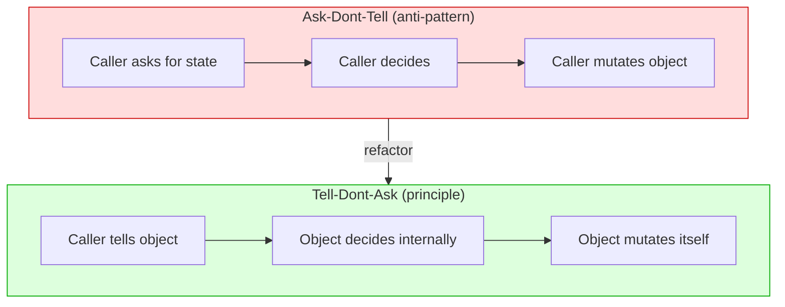
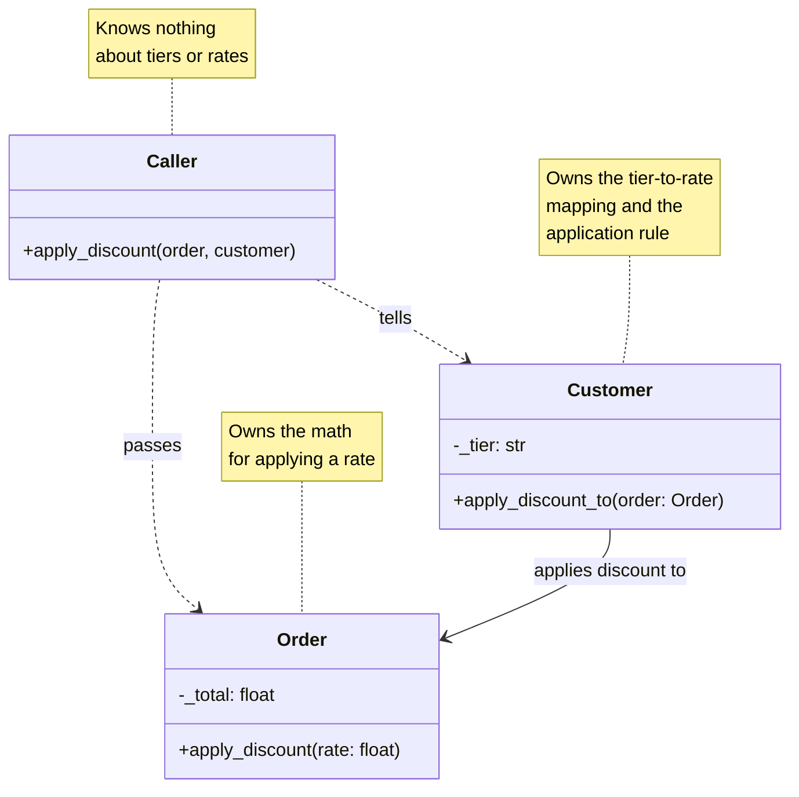
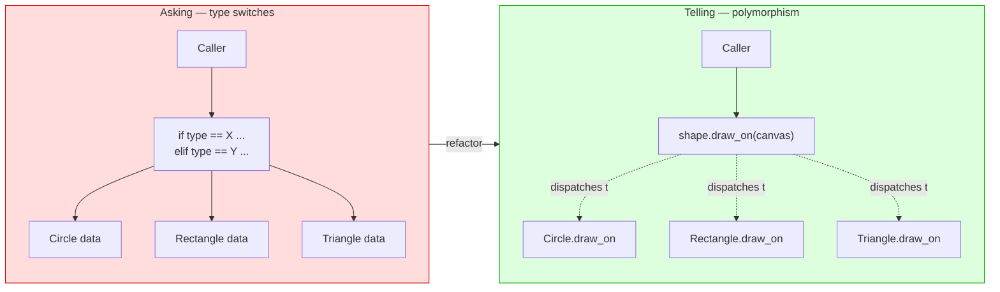
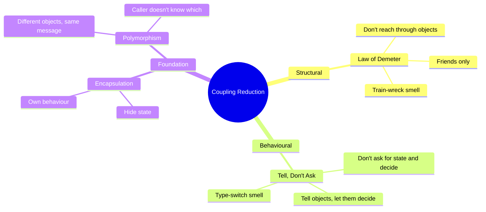
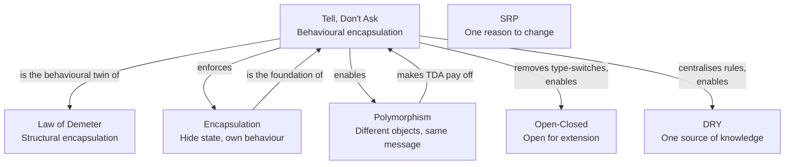

# Tell, Don't Ask — Behavioural Encapsulation Principle

#oop #design-principles #tell-dont-ask #encapsulation #polymorphism #coupling #teaching #deep-dive

> [!quote] The Pragmatic Programmers, paraphrasing Smalltalk culture
> "Don't ask objects for the data you need to make a decision; tell objects what to do, and let them decide."

The **Tell, Don't Ask** principle is the behavioural companion to the [[Law-Of-Demeter]]. Where the Law of Demeter says *"don't reach through objects to grab their internals,"* Tell, Don't Ask says *"don't interrogate objects for their state and then decide for them — tell them what you want done, and let them decide."*

The principle originated in the **Smalltalk** community at Apple in the late 1980s and early 1990s, where it was distilled as a guideline for writing idiomatic object-oriented code. The Smalltalk culture valued objects as *autonomous agents* that collaborate by sending each other messages — not as passive data structures to be queried.

This note unpacks Tell, Don't Ask: the canonical anti-pattern, why the principle matters, its deep connection to polymorphism, when asking is acceptable, and the refactoring moves that take code from "asking" to "telling."

Prerequisites: [[Encapsulation]], [[Polymorphism]], [[Classes-And-Objects]]. Read alongside [[Law-Of-Demeter]] — the two principles reinforce each other.

---

## 1. The Principle, In One Sentence

> **Tell objects what to do. Don't ask them for their state, decide for them, and then act on their behalf.**

The shorthand is: **command, don't query-and-act**. (Strictly, "command-query separation" is a related but distinct principle; the overlap is real but not identical. See [[#10. Tell-Dont-Ask and Command-Query Separation]].)

> [!important] The Tell-Dont-Ask Test
> If your code reads "if (object.get_state()) { object.set_state(other_state); }", you are asking. Refactor to "object.do_the_thing()", where the object decides internally whether and how to do it.

---

## 2. Origin and Context

Tell, Don't Ask emerged in the **Smalltalk** programming community at Apple in the late 1980s and early 1990s. Smalltalk's entire paradigm was *message passing*: objects sent each other messages and the receiver decided how to respond. There was no concept of "calling a method on a passive data structure"; there was only "telling an object something and letting it respond."

When Java and C++ brought OOP to a wider audience in the 1990s, many developers treated objects as fancy C `struct`s: they reached in, read fields, made decisions, and wrote fields back. The Smalltalk community's principle — *tell, don't ask* — was rediscovered and articulated explicitly, most famously by **Andy Hunt** and **Dave Thomas** in *The Pragmatic Programmer* (1999) and by **Martin Fowler** in several essays.

The principle is now part of the standard OOP canon, alongside [[Law-Of-Demeter|LoD]] and [[Encapsulation]].

---

## 3. The Anti-Pattern: Ask, Don't Tell

The canonical violation. The caller asks an object for its state, makes a decision based on that state, then mutates the object (or another object) accordingly.

### 3.1 The Withdrawing Money Example

```python
from typing import Self
from typing_extensions import override
# BAD — asking, deciding, acting
def withdraw(account, amount):
    if account.get_balance() >= amount:
        account.set_balance(account.get_balance() - amount)
        return True
    else:
        return False
```

The caller knows:
- That an account has a balance.
- That the balance is comparable to `amount`.
- That the way to withdraw is to subtract `amount` from the balance.
- That the result of the subtraction is the new balance.
- That insufficient funds means failure.

Five pieces of knowledge about how an account works — and the account itself just sits there, a passive data bag. Every caller that does anything with accounts duplicates this knowledge.

### 3.2 The Tell-Dont-Ask Version

```python
# GOOD — telling; the account decides
def withdraw(account, amount):
    return account.withdraw(amount)
```

The caller tells the account to withdraw `amount`. The account decides internally:

- Whether it has sufficient funds.
- What "sufficient funds" means (a current account might allow overdraft; a savings account might not).
- How to compute the new balance.
- What to do on failure (raise an exception, return a result, log the attempt).

The caller knows nothing about how the account works. The account owns its own behaviour.

> [!note] The Mental Shift
> The shift is from "objects as data" to "objects as agents." An account is not a record of a balance; it is a thing that *can withdraw*. The behaviour is the object's job, not the caller's.

---

## 4. Why Tell, Don't Ask Matters



### 4.1 Keeps Behaviour With Data

The most fundamental reason. In OOP, an object is *data + behaviour*. If the behaviour lives in the caller, the object is just a struct, and the paradigm collapses into procedural programming with classes-as-namespace. Tell, Don't Ask keeps the behaviour where it belongs: next to the data it operates on.

This is the foundation of [[Encapsulation]]: not just *hiding* the data, but *owning* the operations on it.

### 4.2 Reduces Coupling

When the caller asks for state and decides, the caller is coupled to:
- The shape of the state (which fields exist, what types they are).
- The rules that govern the state (e.g., "balance must not go negative").
- The mutations that are valid.

When the caller tells, the caller is coupled only to the *command*: `withdraw(amount)`. The internals — shape, rules, mutations — can change freely.

### 4.3 Enables Polymorphism

This is the deep win. When different kinds of objects can respond to the same *tell*, you can substitute one for another without the caller knowing. Asking prevents this: the caller's `if account.get_balance() >= amount` only works for accounts whose "sufficient funds" rule is `balance >= amount`. An overdraft account, a credit account, a joint account — none of these can substitute, because the caller has hard-coded the rule.

```python
class Account:
    @override
    def withdraw(self, amount):
        if self._balance >= amount:
            self._balance -= amount
            return True
        return False

class OverdraftAccount:
    @override
    def withdraw(self, amount):
        # Allows going negative up to the overdraft limit
        if self._balance - amount >= -self._overdraft_limit:
            self._balance -= amount
            return True
        return False

class CreditAccount:
    @override
    def withdraw(self, amount):
        # Credit accounts always allow withdrawal; they just increase the debt
        self._balance -= amount
        return True
```

The caller is identical for all three:

```python
def withdraw(account, amount):
    return account.withdraw(amount)
```

The caller doesn't know — and doesn't need to know — which kind of account it has. This is [[Polymorphism]] in action, and it is *only possible* because the caller *tells* rather than *asks*.

### 4.4 Simplifies the Caller

The asking version of `withdraw` is six lines and contains a decision tree. The telling version is one line. The caller shrinks, becomes obviously correct, and can be read in a glance.

### 4.5 Localises Rule Changes

When the "sufficient funds" rule changes (e.g., a new regulation requires a minimum balance of $10), only `Account.withdraw` changes. In the asking version, every caller that implemented the rule must be found and updated — a [[DRY-Principle|DRY]] violation as well.

---

## 5. The Full Refactoring Pattern

The shift from Ask to Tell follows a reliable pattern.

### 5.1 Step 1 — Identify the Asking Code

Look for the shape: `if obj.get_X() ... : obj.set_X(...)`. Or: `value = obj.get_X(); if value ...: ...`.

### 5.2 Step 2 — Identify the Decision

What is the caller deciding? Often it is a *rule*: "can this operation proceed?", "which kind of thing is this?", "what should happen next?"

### 5.3 Step 3 — Name the Decision as a Command

Give the decision a verb name: `withdraw`, `can_ship`, `apply_discount`, `upgrade_tier`. The verb becomes a method on the object.

### 5.4 Step 4 — Move the Decision Into the Object

Move the `if` and the mutation into the object's new method. The caller now invokes the method; the object does the work.

### 5.5 A Worked Example

**Asking version:**

```python
def apply_discount(order, customer):
    if customer.get_tier() == "GOLD":
        order.set_total(order.get_total() * 0.90)
    elif customer.get_tier() == "SILVER":
        order.set_total(order.get_total() * 0.95)
    # ... more tiers
```

The caller knows the tier names, the discount rates, and how to apply them.

**Step 3 — name the decision:** "apply the customer's discount to the order."

**Step 4 — move the decision into the object:**

```python
class Customer:
    DISCOUNT_RATES = {"GOLD": 0.10, "SILVER": 0.05, "BRONZE": 0.0}

    @override
    def apply_discount_to(self, order):
        rate = self.DISCOUNT_RATES.get(self._tier, 0.0)
        order.apply_discount(rate)

class Order:
    @override
    def apply_discount(self, rate: float):
        self._total *= (1 - rate)

def apply_discount(order, customer):
    customer.apply_discount_to(order)
```

Now the caller knows nothing about tiers or rates. If marketing adds a new tier, one constant changes. If the discount rule becomes "Gold gets 10% off but only on orders over $100," the change lives in `Customer.apply_discount_to`, not in every caller.



---

## 6. Polymorphism Unlocked by Tell-Dont-Ask

The deep payoff. Once the caller *tells*, polymorphism lets different objects respond differently — and the caller never knows.

### 6.1 The Classic Shape Example

```python
# Asking — type-checks proliferate
class Canvas:
    @override
    def draw(self, shape):
        if shape.type == "circle":
            self._draw_circle(shape)
        elif shape.type == "rectangle":
            self._draw_rectangle(shape)
        elif shape.type == "triangle":
            self._draw_triangle(shape)
        else:
            raise ValueError(f"unknown shape: {shape.type}")
```

The `Canvas` knows every shape type. Adding a new shape (`Hexagon`) requires editing `Canvas`. This is an [[Open-Closed|Open-Closed Principle]] violation as well.

### 6.2 Telling — Let Each Shape Draw Itself

```python
class Shape:
    @override
    def draw_on(self, canvas: "Canvas") -> Self:
        raise NotImplementedError

class Circle(Shape):
    @override
    def draw_on(self, canvas: "Canvas") -> Self:
        canvas.draw_circle(self._x, self._y, self._radius)

class Rectangle(Shape):
    @override
    def draw_on(self, canvas: "Canvas") -> Self:
        canvas.draw_rectangle(self._x, self._y, self._w, self._h)

class Triangle(Shape):
    @override
    def draw_on(self, canvas: "Canvas") -> Self:
        canvas.draw_polygon([self._p1, self._p2, self._p3])

class Canvas:
    @override
    def draw(self, shape: Shape) -> Self:
        shape.draw_on(self)
```

`Canvas.draw` is one line. Adding `Hexagon` requires *no change* to `Canvas`. The shape owns its drawing logic; the canvas just provides primitives.

### 6.3 The Pattern



Every `if isinstance(obj, X)` or `if obj.type == X` is a Tell-Dont-Ask violation in disguise: the caller is asking the object what kind it is, then deciding what to do. The fix is a polymorphic method — each kind of object does its own work.

This is the pattern behind **Strategy**, **State**, **Command**, **Visitor** (with caveats) and most behavioural patterns. See [[Behavioral-Patterns]].

---

## 7. Asking Is Sometimes Correct

Tell, Don't Ask is a default, not an absolute. Asking is appropriate when:

### 7.1 Genuine Queries

When the caller needs information to make a decision that is *legitimately the caller's*, asking is correct.

```python
# Legitimate query — the decision is the caller's
def can_afford(account, amount) -> bool:
    return account.balance() >= amount  # query, no mutation
```

The decision "can I afford this?" is the caller's — the account doesn't know about the caller's budget. Asking `account.balance()` is appropriate.

### 7.2 Reporting and Serialisation

Reporting code inherently asks: it reads data and presents it. A `MonthlyReport` class asks each account for its balance, its transactions, its interest accrued. There is no decision to delegate; the report's job is to *report*.

```python
class MonthlyReport:
    @override
    def generate(self, account) -> str:
        return f"Balance: {account.balance()}\nTransactions: {len(account.transactions())}"
```

This is asking, and it is correct. Forcing a `report_yourself()` method on `Account` would couple `Account` to the reporting format — a worse design.

### 7.3 DTOs and Mappers

DTOs are passive data carriers. Asking them for their fields is the entire point.

### 7.4 The Distinction

> [!tip] When to Ask vs When to Tell
> Ask when the decision belongs to the caller (budgeting, reporting, presentation). Tell when the decision belongs to the object (its own state transitions, its own domain rules). The test: *who would be the right home for this logic if it had to live somewhere permanently?*

---

## 8. The Relationship to Law of Demeter

[[Law-Of-Demeter]] and Tell, Don't Ask are siblings:

- **LoD** is *structural*: don't reach through an object to its collaborator's internals.
- **Tell-Dont-Ask** is *behavioural*: don't ask an object for its state and decide for it.

A train wreck (`a.b().c().d()`) is almost always both: the caller is reaching through (`b`, `c`) *and* asking for state (`.d()`). The fix — delegation — addresses both at once: the caller tells `a` what it wants; `a` decides how to satisfy the request, possibly delegating to `b`, which delegates to `c`.



---

## 9. A Larger Worked Example — The Order Processing Pipeline

### 9.1 Asking Everywhere

```python
def process_order(order, customer, inventory, payment_gateway):
    # Ask whether items are in stock
    for line in order.get_lines():
        product = line.get_product()
        qty = line.get_quantity()
        if inventory.get_stock(product.get_sku()) < qty:
            raise OutOfStockError(product.get_sku())

    # Ask whether customer can be charged
    total = order.get_total()
    if customer.get_credit_limit() < total:
        raise InsufficientCreditError(customer.get_id())

    # Charge the customer
    payment_gateway.charge(customer.get_payment_token(), total)
    customer.set_credit_used(customer.get_credit_used() + total)

    # Decrement inventory
    for line in order.get_lines():
        product = line.get_product()
        qty = line.get_quantity()
        inventory.set_stock(product.get_sku(), inventory.get_stock(product.get_sku()) - qty)

    # Mark order as processed
    order.set_status("PROCESSED")
    order.set_processed_at(datetime.now())
```

This function knows:
- How to check inventory (by SKU).
- How to compute credit availability.
- How to charge via the gateway.
- How to update credit used.
- How to decrement stock.
- How to mark an order as processed.

Six pieces of knowledge — duplicated across every place that processes an order. And every `get_X()` is a query that should be a command.

### 9.2 Telling — Each Object Does Its Own Work

```python
class Order:
    def __init__(self, lines, customer):
        self._lines = lines
        self._customer = customer
        self._status = "NEW"
        self._processed_at = None

    @override
    def total(self) -> float:
        return sum(line.subtotal() for line in self._lines)

    @override
    def reserve_items(self, inventory) -> Self:
        for line in self._lines:
            line.reserve(inventory)

    @override
    def charge_customer(self, payment_gateway) -> Self:
        self._customer.charge(self.total(), payment_gateway)

    @override
    def mark_processed(self) -> Self:
        self._status = "PROCESSED"
        self._processed_at = datetime.now()

class OrderLine:
    def __init__(self, product, quantity):
        self._product = product
        self._quantity = quantity

    @override
    def subtotal(self) -> float:
        return self._product.price() * self._quantity

    @override
    def reserve(self, inventory) -> Self:
        inventory.reserve(self._product.sku(), self._quantity)

class Customer:
    def __init__(self, credit_limit, payment_token):
        self._credit_limit = credit_limit
        self._credit_used = 0.0
        self._payment_token = payment_token

    @override
    def charge(self, amount: float, payment_gateway) -> Self:
        if self._credit_used + amount > self._credit_limit:
            raise InsufficientCreditError(self._id)
        payment_gateway.charge(self._payment_token, amount)
        self._credit_used += amount

class Inventory:
    def __init__(self):
        self._stock = {}

    @override
    def reserve(self, sku: str, quantity: int) -> Self:
        if self._stock.get(sku, 0) < quantity:
            raise OutOfStockError(sku)
        self._stock[sku] -= quantity

def process_order(order, inventory, payment_gateway):
    order.reserve_items(inventory)        # tell order
    order.charge_customer(payment_gateway) # tell order
    order.mark_processed()                # tell order
```

The `process_order` function is three lines. Each line tells `order` what to do; `order` delegates to its collaborators. The function knows nothing about SKUs, credit limits, payment tokens, or stock counts.

### 9.3 The Test Improvement

The asking version required constructing an `order`, `customer`, `inventory`, and `payment_gateway` with a tangle of getters and setters. The telling version's test:

```python
def test_process_order_charges_customer():
    order = Order(lines=[OrderLine(Product("SKU1", 10.0), 2)],
                  customer=Customer(credit_limit=100.0, payment_token="tok_123"))
    inventory = Inventory(stock={"SKU1": 5})
    gateway = FakePaymentGateway()

    process_order(order, inventory, gateway)

    assert gateway.charged_amount == 20.0
    assert order.is_processed()
```

The test reads like a story. No getters chained; no internal-state assertions; just observable outcomes.

---

## 10. Tell-Dont-Ask and Command-Query Separation

A related but distinct principle is **Command-Query Separation (CQS)**, articulated by Bertrand Meyer:

- A **command** mutates state and returns nothing.
- A **query** returns state and mutates nothing.

Tell, Don't Ask overlaps with CQS but is not identical:

- Tell, Don't Ask says: prefer commands to "ask-then-decide-then-act" patterns.
- CQS says: a single method should be *either* a command *or* a query, not both.

A method can satisfy CQS but violate TDA (e.g., a pure query that the caller uses to make a decision that should be the object's). A method can satisfy TDA but violate CQS (e.g., `withdraw` both mutates and returns success).

The two principles are complementary. Together they push toward a design where objects expose small commands and small queries, and the decision logic lives inside the commands.

---

## 11. Teaching Tips

> [!tip] Teaching Tip 1 — The Asking Audit
> Have students highlight every `if obj.get_X() ...` or `if obj.X ...` in a codebase. For each, ask: "Whose decision is this — the caller's or the object's?" Most are the object's. Have students refactor each into a method on the object. The codebase shrinks and clarifies dramatically.

> [!tip] Teaching Tip 2 — The Type-Switch Hunt
> Have students grep for `isinstance(` and `if X.type ==`. Each is a Tell-Dont-Ask violation in disguise: the caller is asking what kind of object this is, then deciding. The fix is a polymorphic method.

> [!tip] Teaching Tip 3 — The "Two Implementations" Drill
> Give students the asking version of `withdraw`. Have them add a new account type (OverdraftAccount) that allows negative balances. They will discover the asking version requires editing the caller. Then have them refactor to the telling version and add the same account type. The polymorphic version requires *zero* changes to the caller. The lesson lands.

> [!tip] Teaching Tip 4 — The "Who Owns This Rule?" Question
> When reviewing a student's code, point to any `if` statement that involves another object's state. Ask: "Who owns this rule?" If the answer is "the object being queried," the rule is in the wrong place. Move it.

> [!tip] Teaching Tip 5 — Legitimate Queries
> Counter-balance the principle. Show students a reporting function and ask whether it should "tell." The answer is no — reporting is inherently a query. This builds the discrimination to apply the principle where it belongs and not where it doesn't.

---

## 12. Common Student Misconceptions

> [!warning] Misconception 1 — "Tell, Don't Ask means no getters, ever."
> Too strict. Getters are appropriate for *legitimate queries* — reporting, presentation, budgeting. The principle forbids using getters to make decisions that should be the object's.

> [!warning] Misconception 2 — "Tell, Don't Ask means objects can't return values."
> No. Objects can return values from queries (`account.balance()`). What they should not do is have callers make *decisions for them* based on those queries. The principle is about *where the decision lives*, not about whether values are returned.

> [!warning] Misconception 3 — "If I add a method for every decision, my classes bloat."
> Sometimes yes. The cure is to ensure the methods you add are *domain-meaningful* (`withdraw`, `apply_discount`, `reserve`) rather than mechanical wrappers. If you find yourself adding `do_the_thing_the_caller_used_to_do`, the abstraction is wrong — name the method at the domain level.

> [!warning] Misconception 4 — "Tell, Don't Ask is incompatible with reporting code."
> False. Reporting code is *legitimately asking*. The principle applies to decision-making code, not to code whose purpose is to read and present data. Know the difference.

> [!warning] Misconception 5 — "Tell, Don't Ask is the same as the Law of Demeter."
> Related but distinct. LoD is structural (don't reach through); Tell-Dont-Ask is behavioural (don't ask and decide). Train wrecks usually violate both; the fixes overlap.

> [!warning] Misconception 6 — "I should never use `if` with object state."
> No. The test is whether the *decision* belongs to the caller or the object. `if order.is_paid(): ship(order)` is fine — the shipping decision belongs to the caller. `if order.get_total() > 100: order.set_total(order.get_total() * 0.9)` is wrong — the discount rule belongs to the order (or the customer).

---

## 13. Relationship to Other Principles



- **Tell, Don't Ask and [[Law-Of-Demeter|LoD]]** — siblings. LoD is structural; TDA is behavioural. Train wrecks violate both.
- **Tell, Don't Ask and [[Encapsulation]]** — TDA is *behavioural* encapsulation: not just hiding fields, but owning the operations on them.
- **Tell, Don't Ask and [[Polymorphism]]** — TDA is what makes polymorphism pay off. Without telling, callers type-check and dispatch; with telling, the runtime dispatches.
- **Tell, Don't Ask and [[Open-Closed|OCP]]** — type-switches are OCP violations. Telling replaces type-switches with polymorphic dispatch, satisfying OCP.
- **Tell, Don't Ask and [[DRY-Principle|DRY]]** — moving decisions into objects gives each rule a single home.
- **Tell, Don't Ask and [[Single-Responsibility|SRP]]** — objects that own their rules tend to have a single responsibility.

---

## 14. Summary

| Aspect | Insight |
|---|---|
| **Core claim** | Tell objects what to do; don't ask for state and decide for them. |
| **Origin** | Smalltalk community at Apple, late 1980s / early 1990s. |
| **Anti-pattern** | Ask-Decide-Act: `if obj.get_X(): obj.set_X(...)`. |
| **Fix** | Move the decision into the object as a domain-named command. |
| **Deep benefit** | Enables polymorphism: different objects respond to the same tell. |
| **Exceptions** | Legitimate queries (reporting, budgeting, presentation). |
| **Siblings** | Law of Demeter (structural), Encapsulation (foundation). |

> [!success] The One-Sentence Takeaway
> Objects are not data structures you interrogate; they are collaborators you give instructions to — and the instruction, not the interrogation, is what unlocks polymorphism.

## See Also

- [[Law-Of-Demeter]] — the structural twin.
- [[Encapsulation]] — the foundation Tell-Dont-Ask builds on.
- [[Polymorphism]] — what Tell-Dont-Ask unlocks.
- [[Open-Closed]] — telling replaces type-switches, satisfying OCP.
- [[DRY-Principle]] — moving decisions into objects centralises rules.
- [[Single-Responsibility]] — objects that own their rules are SRP-shaped.
- [[Code-Smells]] — type-switches and "feature envy" are TDA violations.
- [[Behavioral-Patterns]] — Strategy, State, and Command patterns leverage TDA.
