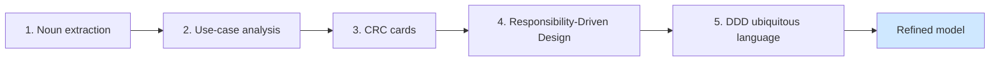
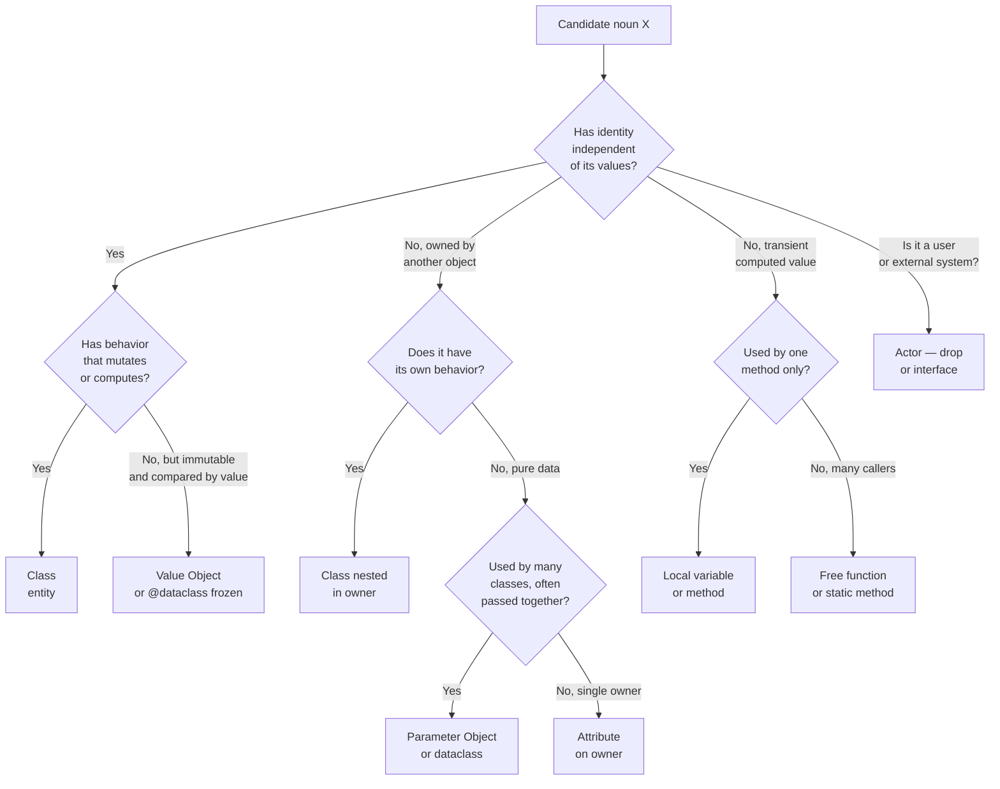
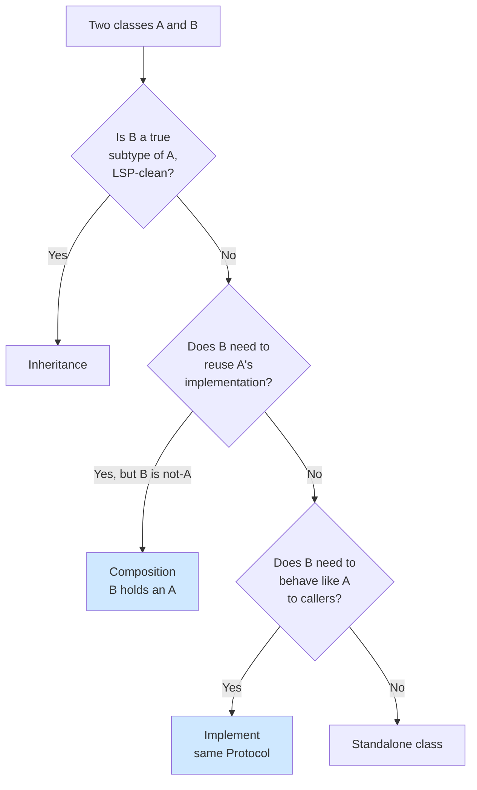
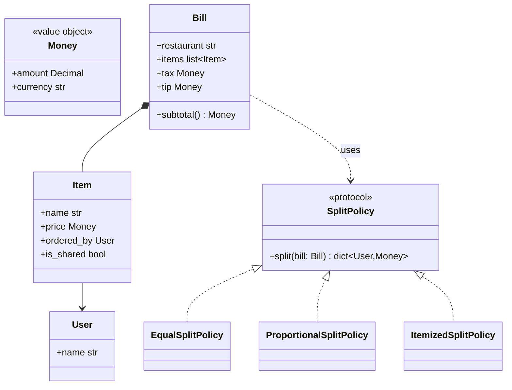

# Identifying Classes & Responsibilities — The Hardest Part of OOP

> [!quote] "The most important part of the design is to figure out what the objects are. Everything else is detail." — Grady Booch

Beginners can write a class. They cannot decide *whether to write a class*. This note is the deep dive on the question that haunts every OOP learner: **"How do I know what classes to make?"**

Related notes: [[oop-design-process]], [[solid-principles]], [[grasp-and-extra-principles]], [[composition-over-inheritance]], [[class-diagrams]], [[common-pitfalls-and-anti-patterns]], [[code-smells-catalog]], [[refactoring-techniques]], [[design-patterns-creational]].

---

## Why This Is Hard

The grammar of OOP gives you no algorithm. You can be told "model the real world" — but real-world maps badly. A `User` is obviously a class, but is `Address`? Is `Email`? Is `Age`? Is `TimeWindow`? Is `InvoiceNumber`? The honest answer is *it depends*, and that's terrifying.

> [!warning] Misconception: "nouns in the spec become classes"
> This is the textbook advice, and it's a useful *first* heuristic — and a *terrible* stopping point. Most nouns are attributes, value objects, or noise. The skill is **filtering**, not listing.

This note gives you the filters.

---

## The Five Techniques



Each technique is a lens. Stack them. The intersection is your design.

### 1. Noun extraction

Read the requirements, list every noun, every verb, every adjective.

| Noun → candidate class | Verb → candidate method | Adjective → candidate attribute / subclass |
|---|---|---|
| Order | place, cancel, ship | express, urgent |
| Customer | register, login | premium, guest |
| Payment | charge, refund | card, cash, crypto |

> [!tip] Use a spreadsheet, not a code editor
> Two columns (noun, decision), then a third column "decision: class / attribute / VO / actor / drop". Sort by decision. You'll be surprised how few survive the "class" filter.

### 2. Use-case analysis

Walk each use case from trigger to outcome. **Anything that participates with its own state is a class.** Anything that is only acted upon is data.

> [!example] Use case: "Customer places an order"
> 1. Customer browses catalog → `Catalog`, `Product` participate (state: products, prices).
> 2. Customer adds items to cart → `Cart` participates (state: items).
> 3. Customer enters shipping address → `Address` is *data* (no behavior yet).
> 4. Customer pays → `Payment` participates (state: status, amount).
> 5. System issues order → `Order` participates (state: items, status).
>
> Notice `Address` started as data. In iteration 2, when you add shipping cost computation, `Address` becomes a class with `zone()` behavior. Iteration matters.

### 3. CRC cards

The classic technique. See [[oop-design-process#CRC cards]] for the deep dive. The quick version:

> [!example] CRC card anatomy
> ```
> +-------------------------------+
> | ShoppingCart                  |
> +-------------------------------+
> | Resp:                         |
> | - hold selected items         |
> | - compute subtotal            |
> | - apply discount codes        |
> +-------------------------------+
> | Collab:                       |
> | - Product (prices)            |
> | - DiscountPolicy (delegates)  |
> +-------------------------------+
> ```

The card forces two questions per class:
- *What does this class do?* (responsibilities)
- *Who does it need to talk to?* (collaborations)

If a card needs more than ~5 lines, it's doing too much (SRP alarm — see [[solid-principles]]). Split it.

### 4. Responsibility-Driven Design (Wirfs-Brock)

RDD says: stop asking "what classes?" — ask **"what responsibilities, and who should own them?"** Classes fall out as *role stereotypes*:

| Stereotype | Description | Examples |
|---|---|---|
| Information holder | Knows facts; answers questions | `User`, `Order`, `Ticket` |
| Structurer | Maintains object relationships | `Catalog`, `ParkingLot` |
| Service provider | Stateless work | `TaxCalculator`, `Hasher` |
| Controller | Use-case coordinator | `CheckoutController` |
| Coordinator | Reacts, delegates, doesn't decide domain | `EventBus` |
| Interfacer | Bridges to other systems | `PaymentGateway`, `EmailSender` |

> [!tip] Stereotype your CRC cards
> Write the stereotype in the top-right corner of each card. If a card has two stereotypes ("Information holder + Controller"), that's a code smell pre-diagnosis. Split it.

### 5. DDD ubiquitous language

Listen to domain experts. They say things like "we put a hold on the seat, then we settle it". The words **hold** and **settle** are not English verbs — they are *domain operations* with precise meaning. Capture them as methods (`Seat.hold()`, `BookingService.settle(hold)`).

If developers and experts use different words, you get a translation layer that breeds bugs. Use the *same* words in code as in conversation.

> [!example] Ubiquitous language wins
> A junior says "set the user's `is_active` flag to false". The expert says "we suspend the user". Make the method `User.suspend()` — not `set_active(False)`. The code now matches the policy manual.

---

## The Big Filter: Class, Method, Attribute, Parameter, or Drop?

This is the heart of the note. Take each candidate noun and walk the decision tree.



### Heuristic cheatsheet

> [!tip] Memorise these four rules; they cover 80% of decisions

1. **Has identity → class.** Two `User`s with the same name are still different users.
2. **Just data, compared by value → value object / `@dataclass(frozen=True)`.** Two `Money(3, "USD")` are the same money.
3. **Behavior only, no state → function (or Strategy if you need to swap it).** `compute_tax(order)` doesn't need to be a class.
4. **Pure communication channel → interface / protocol.** `PaymentGateway` is a role, not a thing.

---

## When Is Something a Class vs. a Method?

The most common beginner question. Two checks:

### Check 1: Identity
> If I made two of these with the same fields, would they be *the same thing* or *two equal copies*?

- `Order(123, [items])` vs `Order(123, [items])` — same order. → entity (class).
- `Money(3, "USD")` vs `Money(3, "USD")` — two equal copies. → value object.
- `place_order(customer, items)` — no identity at all. → method.

### Check 2: Multiple operations
> Does this thing have *one* behavior or *several* that share state?

- `TaxCalculator` with one method `compute(order)` → **free function** (or Strategy if you swap implementations).
- `Order` with `add_item`, `subtotal`, `cancel`, `ship` → **class** (state + behavior + identity).

> [!warning] The "CalculatorTrap"
> Beginners make `TaxCalculator`, `DiscountCalculator`, `ShippingCalculator` — all stateless, all single-method. In Python, prefer free functions. Reserve classes for when you need polymorphism (Strategy pattern), configuration, or shared state.

```python
from typing import Self
from typing_extensions import override
# Bad — CalculatorTrap
class TaxCalculator:
    @override
    def compute(self, order: Order) -> Self: ...

# Good — free function
def compute_tax(order: Order, policy: TaxPolicy) -> Self: ...

# Good — class, because we swap implementations (Strategy)
class TaxPolicy(Protocol):
    @override
    def tax_for(self, order: Order) -> Self: ...

class USASalesTaxPolicy:
    @override
    def tax_for(self, order: Order) -> Self: ...
```

---

## When Is a Class Doing Too Much? (The SRP Test)

> [!danger] The SRP test
> Read every method on the class. Group them by *who would ask for a change*. If two different groups (accounting, ops, UX) would ask for changes to the same class, split it.

Example:

```python
class Order:
    @override
    def add_item(self, item): ...        # domain
    @override
    def subtotal(self) -> Self: ...     # domain
    @override
    def save_to_db(self, conn): ...      # persistence team
    @override
    def to_html(self) -> str: ...        # UI team
    @override
    def send_email(self): ...            # ops team
```

Three stakeholders → three reasons to change → SRP violation. Split into `Order` (domain), `OrderRepository` (persistence), `OrderView` (presentation), `OrderMailer` (delivery).

> [!note] The "one responsibility" line
> Uncle Bob's later formulation of SRP is *not* "does one thing" — it's "serves one stakeholder". See [[solid-principles#S — Single Responsibility Principle (SRP)]].

### Heuristic: the "if I had to rename" test
If you had to give the class a name that fully describes everything it does, would the name be three words joined by "and"? ("Order and Persistence and Emailing" → split it.)

---

## Inheritance vs. Composition — The Decision Tree

The second most common beginner question. **Default to composition**; reach for inheritance only when the substitution contract is clean (LSP).



> [!tip] Three questions to ask before `class B(A)`
> 1. Is every `B` *truly* an `A` in every context? (Square is not a Rectangle.)
> 2. Does `B` want `A`'s *interface* or `A`'s *implementation*? (If only interface, use a Protocol.)
> 3. Will `A`'s future changes break `B`? (If yes, you don't control A; don't inherit.)

See [[composition-over-inheritance]] for the full deep dive.

### Concrete example

```python
# Bad: Stack inherits list to reuse implementation
class Stack(list):
    @override
    def push(self, x): self.append(x)
    @override
    def pop(self): return super().pop()

# Problem: callers can call .insert(0, x) — Stack's contract broken.
# LSP-violation-in-spirit: Stack is NOT a list, even though Python lets it.

# Good: composition
class Stack:
    def __init__(self) -> Self:
        self._items: list = []
    @override
    def push(self, x) -> Self: self._items.append(x)
    @override
    def pop(self): return self._items.pop()
    @override
    def __len__(self) -> int: return len(self._items)
```

---

## Class vs. Free Function — When OOP Is Overkill

OOP has overhead: classes, `self`, instantiation. If a thing has no state and one operation, **use a function**.

> [!example] Right-sizing
> ```python
> # Overkill
> class EmailValidator:
>     def is_valid(self, email: str) -> bool:
>         return "@" in email and "." in email.split("@")[-1]
>
> # Just right
> def is_valid_email(email: str) -> bool:
>     return "@" in email and "." in email.split("@")[-1]
> ```

Reach for a class when **any** of these are true:

- You need **polymorphism** (Strategy / State pattern).
- You need **configuration** that survives across calls (e.g. `EmailValidator(rules=[...])`).
- You need **state** (cache, counters, sessions).
- You need a **Protocol** that other modules depend on.
- You want **dependency injection** of collaborators.

Otherwise, free functions win: easier to test, easier to compose, easier to type.

> [!quote] "I find OOP technically unsound. It attempts to decompose the world in terms of interfaces that vary on a single type." — Dan Ingalls (one of the original Smalltalk team)
> The point is not to disagree, but to remember: not every problem is best solved with a class.

---

## Heuristics Cheat-Sheet

| If it has… | Make it a… | Example |
|---|---|---|
| Identity + state + behavior | Class (entity) | `Order`, `User` |
| Immutable, value-equal | Value object / `@dataclass(frozen=True)` | `Money`, `DateRange` |
| Behavior, no state, no swapping | Free function | `compute_tax(o, policy)` |
| Behavior, no state, swappable | Strategy class implementing a Protocol | `USATaxPolicy` |
| Configuration only | `@dataclass` (no methods) | `SmtpConfig` |
| Communication only | Protocol / interface | `PaymentGateway` |
| Co-occurring parameters | Parameter object | `DateRange(start, end)` |
| A bag of static helpers | A module, not a class | `utils.py` |
| A workflow with many steps | Controller class | `CheckoutController` |
| A bag of related constants | An `Enum` or a module | `HttpStatus` |

> [!tip] When in doubt, write a function
> Functions are easy to turn into classes later. Classes are hard to dissolve into functions later. Start small.

---

## Worked Example: Three Design Iterations

> [!example] Vague requirement: "Build a thing where users can split a restaurant bill."

### Iteration 1 — naive noun extraction

Nouns: User, Restaurant, Bill, Split, Thing.

```python
class Thing: ...
class User: ...
class Restaurant: ...
class Bill: ...
class Split: ...
```

**Critique:** `Thing` is noise. `Split` is a verb, not a noun. `Restaurant` is just an attribute of `Bill`. We ended with three real classes: `User`, `Bill`, `Split` → but `Split` is *the act of splitting*, so it's a method, not a class.

### Iteration 2 — responsibility-driven

| Class | Responsibilities | Collaborations |
|---|---|---|
| `User` | identity | — |
| `Bill` | holds items, subtotal, tax | `Item` |
| `Item` | name, price, who ordered | `User` |
| `Splitter` | divides bill by user | `Bill`, `User` |

```python
@dataclass
class User:
    name: str

@dataclass(frozen=True)
class Money:
    amount: Decimal
    currency: str

@dataclass
class Item:
    name: str
    price: Money
    ordered_by: User

class Bill:
    def __init__(self, restaurant: str) -> Self:
        self.restaurant = restaurant
        self.items: list[Item] = []
    @override
    def add(self, item: Item) -> Self:
        self.items.append(item)
    @override
    def subtotal(self) -> Self: ...

class Splitter:
    @staticmethod
    def split(bill: Bill) -> dict[User, Money]:
        # naive: equal split
        ...
```

**Critique:** `Splitter` is a CalculatorTrap (one method, no state). And equal-split is one of many policies. Time to refactor toward Strategy.

### Iteration 3 — DDD + Strategy

We talk to domain experts. They say: "Some items are shared, some are individual. Tax and tip are split proportionally or equally. Sometimes one user pays for another's item."

This gives us **ubiquitous language**: *shared item*, *individual item*, *tax*, *tip*, *policy*.



```python
class SplitPolicy(Protocol):
    @override
    def split(self, bill: Bill) -> dict[User, Money]: ...

class EqualSplitPolicy:
    @override
    def split(self, bill: Bill) -> dict[User, Money]:
        per_user = bill.subtotal() / len(bill.users())
        return {u: per_user for u in bill.users()}

class ItemizedSplitPolicy:
    """Each user pays for their own items; shared items split equally."""
    @override
    def split(self, bill: Bill) -> dict[User, Money]:
        owed: dict[User, Money] = defaultdict(lambda: Money(0))
        for item in bill.items:
            if item.is_shared:
                share = item.price / len(bill.users())
                for u in bill.users():
                    owed[u] += share
            else:
                owed[item.ordered_by] += item.price
        # distribute tax+tip proportionally
        ...
        return dict(owed)
```

> [!tip] The arc of the example
> Iteration 1 had wrong classes. Iteration 2 had right classes but a CalculatorTrap. Iteration 3 found the *policy* abstraction by listening to experts. Each iteration was driven by a different technique: noun extraction → RDD → DDD.

---

## How to Decide: Class, Attribute, Value Object

A common confusion: should `Email` be a class, an attribute on `User`, or a value object?

| Question | If yes |
|---|---|
| Does it have validation? | Lean toward class/VO |
| Does it have behavior (e.g. domain part)? | Class/VO |
| Is it compared by value? | Value object |
| Is it just a string the system stores and prints? | Attribute |

```python
# Naive: email is a str attribute
@dataclass
class User:
    email: str  # any string passes

# Better: email is a value object with validation
@dataclass(frozen=True)
class Email:
    value: str
    @override
    def __post_init__(self):
        if "@" not in self.value:
            raise ValueError(f"Invalid email: {self.value}")
    @property
    @override
    def domain(self) -> str:
        return self.value.split("@")[-1]

@dataclass
class User:
    email: Email  # now invalid states are unrepresentable
```

> [!warning] Don't make every primitive a value object
> Wrapping `Age` in a class when it's just an `int` that's printed is YAGNI. Wrap primitives when they have **invariants** (email format, money non-negativity, phone number country code) or **behavior** (money arithmetic).

---

## Common Mistakes

1. **Entity per real-world noun.** "Weather" is not a class. "Forecast" might be.
2. **Anemic domain model.** Class with fields, no methods. Behavior leaks into services. Fix: give behavior to the data it operates on (Information Expert — see [[grasp-and-extra-principles]]).
3. **Singletons as globals.** "I need one `Database` so I'll make it a singleton." You almost certainly want [[dependency-injection]].
4. **Static-method bags.** `class MathUtils` with 20 static methods is a module, not a class.
5. **Class per layer.** `UserDTO`, `UserEntity`, `UserModel`, `UserView`, `UserRecord`. Layering is fine, but five classes per concept is a smell — consider whether some are redundant.
6. **Inheritance for code reuse.** `class EmailSender(Logger)` because both open files. Reuse via composition or free functions, not inheritance.
7. **Premature generalization.** `class Repository[T]` before you have a second repository. Generalize on the third use case, not the first.
8. **Forgetting the actor.** "User" as a class when it's actually an external actor — the system models `Account` or `Session`, not the human.

---

## The Decision Process — One Page

```mermaid
flowchart TD
    Start([Candidate concept]) --> Q1{Has identity,<br/>state, behavior?}
    Q1 -->|Yes| Q2{Single stakeholder?}
    Q2 -->|Yes| Entity[Entity class]
    Q2 -->|No| Split[Split — SRP violation]
    Q1 -->|No| Q3{Immutable,<br/>value equality?}
    Q3 -->|Yes| VO[Value object]
    Q3 -->|No| Q4{Behavior only,<br/>no state?}
    Q4 -->|Yes, one impl| Fn[Free function]
    Q4 -->|Yes, many impls| Strategy[Strategy class]
    Q4 -->|No| Q5{Transient,<br/>passed around?}
    Q5 -->|Yes, with state| ParamObj[Parameter object]
    Q5{Just configuration}| Config[Config dataclass]
    Q5 -->|Otherwise| Drop[Drop / attribute]
```

---

## Key Takeaways

> [!note] If you remember nothing else

1. **Nouns are candidates, not classes.** Filter aggressively.
2. **Identity → entity; value equality → value object; behavior only → function or Strategy.**
3. **Responsibilities come first, classes second.** RDD: ask "who does what?", not "what are the things?".
4. **The SRP test is "how many stakeholders?"** More than one → split.
5. **Default to composition; inherit only when LSP holds.**
6. **Prefer free functions for stateless work.** Don't fall into the CalculatorTrap.
7. **Listen for ubiquitous language.** Domain experts give you your method names.
8. **Iterate.** First design is always wrong. The third is usually right.
9. **Tests reveal muddled responsibilities.** If testing is painful, redesign.
10. **When in doubt, start smaller.** Function today, class tomorrow.

---

## Practice Exercises

### Exercise 1 — Filter this noun list

A recipe-management spec mentions: *Recipe, Ingredient, Quantity, Cup, Tablespoon, Step, Timer, Oven, Chef, Pantry, Measurement, Photo, Rating, Review*.

For each, decide: class / value object / attribute / function / drop. Defend each choice in one sentence.

> [!tip] Hints
> - `Cup` and `Tablespoon` are *units* → likely an `Enum` or value object `Quantity(5, Unit.CUP)`.
> - `Oven` and `Chef` are actors → drop.
> - `Photo` is binary data — value object or attribute on `Recipe`.
> - `Measurement` is a generic word → drop or merge into `Quantity`.

### Exercise 2 — Run the SRP test on this class

```python
class Invoice:
    @override
    def add_line(self, line): ...
    @override
    def subtotal(self): ...
    @override
    def apply_tax(self): ...
    @override
    def save(self, db): ...
    @override
    def to_pdf(self): ...
    @override
    def email_to(self, customer): ...
    @override
    def archive(self): ...
```

How many stakeholders? Where would you split? Sketch the resulting classes.

### Exercise 3 — RDD stereotyping

Take this list of candidate classes from a hotel-booking spec and assign each a stereotype (Information holder, Structurer, Service provider, Controller, Coordinator, Interfacer):

`Hotel`, `Room`, `Reservation`, `BookingService`, `PaymentGateway`, `RoomCatalog`, `PricePolicy`, `ConfirmationEmail`, `AvailabilityQuery`, `Customer`.

### Exercise 4 — Class vs. function

For each of these, decide: free function, class, or value object. Defend.

1. Compute the SHA-256 of a string.
2. Represent a 2D point with x, y.
3. Validate a US zip code.
4. A markdown-to-HTML converter with three configurable options.
5. A connection pool to a PostgreSQL database.
6. The "today" date in the user's timezone.
7. A Money type with currency-aware arithmetic.
8. A logger that writes to a rotating file.

### Exercise 5 — Evolution drill

Take the iteration-1 design of the bill-splitter above. Without reading iterations 2 and 3, perform your own iteration 2. Then compare. Did you find the Strategy pattern on your own?

### Exercise 6 — DDD vocabulary hunt

Talk to a domain expert (or imagine one) for a system you know well — a gym membership, a school grading system, a delivery app. List 10 domain words and translate each into code: class name, method name, or value object. The goal is for the code to read like a sentence the expert would say.

> [!tip] Cross-references for further study
> - [[oop-design-process]] — the full 8-step process
> - [[solid-principles]] — the principles that filter your decisions
> - [[grasp-and-extra-principles]] — Information Expert, Creator, Pure Fabrication
> - [[composition-over-inheritance]] — the single biggest design decision
> - [[code-smells-catalog]] — to spot rot in your choices later
> - [[refactoring-techniques]] — to fix the rot
> - [[class-diagrams]] — to express your design
> - [[common-pitfalls-and-anti-patterns]] — the gallery of mistakes

---

> [!quote] "When you sit down to design, the first thing you should do is throw away the spec you were given, write your own in one paragraph, and design from that." — paraphrased from Rebecca Wirfs-Brock

Identifying classes is an act of *authorship*, not extraction. You are not finding classes that exist in the spec — you are *choosing* classes that serve the use cases. Choose well.
