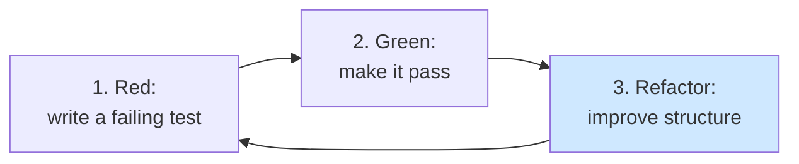
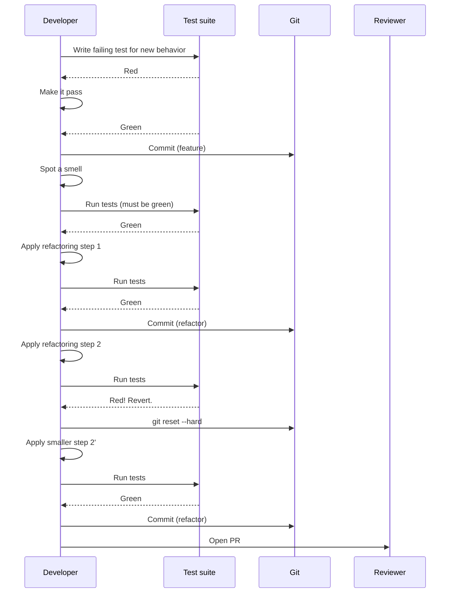

# Refactoring Techniques — Fowler's Recipes for OOP

> [!quote] "Refactoring is the process of changing a software system in such a way that it does not alter the external behavior of the code yet improves its internal structure." — Martin Fowler

A **refactoring** is a small, behavior-preserving transformation of code. Each refactoring has a name, a *when*, a *mechanics*, and a *before/after*. Refactorings are the *cure* for the symptoms catalogued in [[code-smells-catalog]].

Related notes: [[code-smells-catalog]], [[case-study-refactoring]], [[design-smells-and-principles]], [[solid-principles]], [[grasp-and-extra-principles]], [[composition-over-inheritance]], [[dependency-injection]], [[common-pitfalls-and-anti-patterns]].

---

## How to Refactor Safely

> [!danger] The rule that trumps all others
> **Never refactor without tests.** Refactoring is *behavior-preserving* — if you have no tests, you cannot prove behavior was preserved.

### The refactoring cycle (red-green-refactor)



### The micro-step discipline

1. **Pick the smallest possible step.** Even "extract one method" might be too big — split into "extract the first half" and "extract the second half".
2. **Run tests after each step.** They should always be green.
3. **Commit after each step.** Small commits let you `git bisect` later.
4. **Don't mix refactoring and feature work in one commit.** Reviewers cannot tell what changed.
5. **If tests go red, revert.** Don't debug — start over with a smaller step.

> [!tip] Use a linter and type checker
> `ruff`, `mypy`, `pyright` catch most refactor-induced breakage before tests do. Run them in CI on every commit.

---

## The Smell → Refactoring Map

```mermaid
flowchart TD
    Start([Code smell found]) --> S{Which smell?}

    S -->|Long Method| EM[Extract Method]
    S -->|Long Class| EC[Extract Class]
    S -->|Long Parameter List| IPO[Introduce Parameter Object]
    S -->|Primitive Obsession| RDVO[Replace Data Value with Object]
    S -->|Data Clumps| EC2[Extract Class]
    S -->|Switch Statements| RCP[Replace Conditional<br/>with Polymorphism]
    S -->|Temporary Field| EC3[Extract Class]
    S -->|Refused Bequest| RID[Replace Inheritance<br/>with Delegation]
    S -->|Alt Classes Diff Ifaces| EIF[Extract Interface Protocol]
    S -->|Divergent Change| EC4[Extract Class]
    S -->|Shotgun Surgery| MM[Move Method / Move Field]
    S -->|Parallel Inheritance| MM2[Move Method / Move Field]
    S -->|Comments| EM2[Extract Method / Rename]
    S -->|Duplicate Code| EM3[Extract Method / Extract Superclass]
    S -->|Lazy Class| IC[Inline Class]
    S -->|Data Class| MM3[Move Method into it]
    S -->|Dead Code| DEL[Delete]
    S -->|Speculative Generality| IC2[Inline Class]
    S -->|Feature Envy| MM4[Move Method]
    S -->|Inappropriate Intimacy| MM5[Move Method / Hide Delegate]
    S -->|Message Chains| HD[Hide Delegate]
    S -->|Middle Man| RMM[Remove Middle Man]
```



> [!tip] See [[code-smells-catalog]] for the symptom side of this map.

---

## Catalog Index

| # | Refactoring | Smell it cures |
|---|---|---|
| 1 | Extract Method | Long Method, Comments |
| 2 | Extract Class | Long Class, Divergent Change, Temporary Field |
| 3 | Inline Class | Lazy Class, Speculative Generality, Middle Man |
| 4 | Move Method | Feature Envy, Shotgun Surgery |
| 5 | Move Field | Shotgun Surgery, Parallel Inheritance |
| 6 | Replace Conditional with Polymorphism | Switch Statements |
| 7 | Replace Inheritance with Delegation | Refused Bequest |
| 8 | Replace Delegation with Inheritance | (Reverse of 7 — when delegation is just inheritance) |
| 9 | Replace Data Value with Object | Primitive Obsession |
| 10 | Replace Array with Object | Data Clumps, Primitive Obsession |
| 11 | Encapsulate Field | Data Class |
| 12 | Encapsulate Collection | Data Class (collections) |
| 13 | Replace Constructor with Factory Method | Complex construction, type-code branching |
| 14 | Replace Subclass with Fields | Subclasses that differ only in constants |
| 15 | Replace Type Code with Subclasses | Type code with conditional logic |
| 16 | Replace Type Code with Strategy | Type code with swappable behavior |
| 17 | Replace Type Code with State | Type code that changes during lifetime |
| 18 | Introduce Parameter Object | Long Parameter List, Data Clumps |
| 19 | Replace Method with Method Object | Long Method with tangled locals |
| 20 | Extract Subclass | Class with conditional behavior for some instances |
| 21 | Extract Superclass | Duplicate Code |
| 22 | Extract Interface (Protocol) | Alternative Classes with Different Interfaces |
| 23 | Form Template Method | Duplicate Code across subclasses |
| 24 | Replace Exception with Test | Exceptions used for control flow |

---

## 1. Extract Method

**When.** A method is too long, or you need a comment to explain a block.

**Mechanics.**
1. Identify a code block with a single intent.
2. Create a new method named after that intent.
3. Copy the block. Replace local variable reads with parameters; local variable writes with return values.
4. Replace the original block with a call to the new method.
5. Run tests. Commit.

**Before.**
```python
def print_owing(invoice: Invoice) -> Self:
    print("***********************")
    print("**** Customer Owes ****")
    print("***********************")
    outstanding = 0.0
    for item in invoice.items:
        outstanding += item.amount
    # print details
    print(f"name: {invoice.customer}")
    print(f"amount: {outstanding}")
```

**After.**
```python
def print_owing(invoice: Invoice) -> Self:
    print_banner()
    outstanding = calculate_outstanding(invoice)
    print_details(invoice, outstanding)

def print_banner() -> Self:
    print("***********************")
    print("**** Customer Owes ****")
    print("***********************")

def calculate_outstanding(invoice: Invoice) -> float:
    return sum(item.amount for item in invoice.items)

def print_details(invoice: Invoice, outstanding: float) -> Self:
    print(f"name: {invoice.customer}")
    print(f"amount: {outstanding}")
```

> [!tip] Naming is the whole game
> The method name should say *what*, not *how*. `calculate_outstanding` is good. `loop_through_items_and_sum_amounts` is bad.

---

## 2. Extract Class

**When.** A class has too many responsibilities (Long Class, Divergent Change).

**Mechanics.**
1. Decide how to split responsibilities.
2. Create a new class for one responsibility.
3. Add a field of the new class's type on the old class.
4. Move methods and fields one at a time, running tests after each move.
5. Optionally expose the new class to clients.

**Before.**
```python
class Person:
    def __init__(self, name: str, office_area_code: str, office_number: str):
        self.name = name
        self.office_area_code = office_area_code
        self.office_number = office_number

    @override
    def get_office_telephone(self) -> str:
        return f"({self.office_area_code}) {self.office_number}"
```

**After.**
```python
class TelephoneNumber:
    def __init__(self, area_code: str, number: str):
        self.area_code = area_code
        self.number = number

    @override
    def __str__(self) -> str:
        return f"({self.area_code}) {self.number}"

class Person:
    def __init__(self, name: str, office: TelephoneNumber):
        self.name = name
        self.office_telephone = office

    @override
    def get_office_telephone(self) -> str:
        return str(self.office_telephone)
```

---

## 3. Inline Class

**When.** A class does almost nothing. Reverse of Extract Class.

**Mechanics.**
1. Move all members of the small class into the host class.
2. Replace usages of the small class with the host class.
3. Delete the small class.

**Before.**
```python
class TelephoneNumber:
    def __init__(self, area_code: str, number: str):
        self.area_code = area_code
        self.number = number

class Person:
    def __init__(self, name: str, tel: TelephoneNumber):
        self.name = name
        self.tel = tel
```

**After.**
```python
class Person:
    def __init__(self, name: str, area_code: str, number: str):
        self.name = name
        self.area_code = area_code
        self.number = number
```

---

## 4. Move Method

**When.** A method is more interested in another class than its own (Feature Envy).

**Mechanics.**
1. Examine the method's use of the current class and the target class.
2. If it uses fields from the target, decide: pass as params or move the fields too.
3. Define the method on the target class.
4. Replace the body on the source with a delegation call (or delete if no longer needed).

**Before.**
```python
class Account:
    def __init__(self, type_: AccountType, days_overdrawn: int):
        self.type_ = type_
        self.days_overdrawn = days_overdrawn

    @override
    def overdraft_charge(self) -> float:
        if self.type_.is_premium:
            result = 10.0
            if self.days_overdrawn > 7:
                result += (self.days_overdrawn - 7) * 0.85
            return result
        return self.days_overdrawn * 1.75

    @override
    def bank_charge(self) -> float:
        result = 4.5
        if self.days_overdrawn > 0:
            result += self.overdraft_charge()
        return result
```

`overdraft_charge` is envious of `AccountType`.

**After.**
```python
class AccountType:
    @override
    def overdraft_charge(self, days_overdrawn: int) -> float:
        if self.is_premium:
            result = 10.0
            if days_overdrawn > 7:
                result += (days_overdrawn - 7) * 0.85
            return result
        return days_overdrawn * 1.75

class Account:
    def __init__(self, type_: AccountType, days_overdrawn: int):
        self.type_ = type_
        self.days_overdrawn = days_overdrawn

    @override
    def overdraft_charge(self) -> float:
        return self.type_.overdraft_charge(self.days_overdrawn)

    @override
    def bank_charge(self) -> float:
        result = 4.5
        if self.days_overdrawn > 0:
            result += self.overdraft_charge()
        return result
```

---

## 5. Move Field

**When.** A field is used more by another class than its current owner.

**Mechanics.**
1. Encapsulate the field on the source class (so you can intercept).
2. Create the field on the target class.
3. Redirect accessors to the target.
4. Run tests, then remove the source field.

**Before.**
```python
class Account:
    def __init__(self, type_: AccountType, interest_rate: float):
        self.type_ = type_
        self.interest_rate = interest_rate
    @override
    def interest_for(self, days: int) -> float:
        return self.interest_rate * days / 365
```

`interest_rate` belongs to `AccountType`.

**After.**
```python
class AccountType:
    def __init__(self, interest_rate: float):
        self.interest_rate = interest_rate

class Account:
    def __init__(self, type_: AccountType):
        self.type_ = type_
    @override
    def interest_for(self, days: int) -> float:
        return self.type_.interest_rate * days / 365
```

---

## 6. Replace Conditional with Polymorphism

**When.** You have a conditional (`if`/`match`) that chooses behavior based on a type code. Cures Switch Statements.

**Mechanics.**
1. Make the type code a class (or subclass).
2. For each branch of the conditional, create a subclass overriding the method.
3. The original method becomes abstract.
4. Replace conditional calls with polymorphic dispatch.

**Before.**
```python
class Employee:
    def __init__(self, type_code: str, salary: float, bonus: float):
        self.type_code = type_code
        self.salary = salary
        self.bonus = bonus

    @override
    def pay(self) -> float:
        if self.type_code == "engineer":
            return self.salary
        elif self.type_code == "manager":
            return self.salary + self.bonus
        elif self.type_code == "salesman":
            return self.salary + self.bonus * 0.5
        raise ValueError(self.type_code)
```

**After.**
```python
from abc import ABC, abstractmethod

class EmployeeType(ABC):
    @abstractmethod
    @override
    def pay(self, salary: float, bonus: float) -> float: ...

class Engineer(EmployeeType):
    @override
    def pay(self, salary: float, bonus: float) -> float:
        return salary

class Manager(EmployeeType):
    @override
    def pay(self, salary: float, bonus: float) -> float:
        return salary + bonus

class Salesman(EmployeeType):
    @override
    def pay(self, salary: float, bonus: float) -> float:
        return salary + bonus * 0.5

class Employee:
    def __init__(self, type_: EmployeeType, salary: float, bonus: float):
        self.type_ = type_
        self.salary = salary
        self.bonus = bonus
    @override
    def pay(self) -> float:
        return self.type_.pay(self.salary, self.bonus)
```

> [!warning] Don't replace *all* conditionals
> Conditionals on *values* are fine: `if x > 0`. Conditionals on *types* are the smell. Refactor only the latter.

---

## 7. Replace Inheritance with Delegation

**When.** A subclass uses only a small part of its parent's interface (Refused Bequest), or violates LSP.

**Mechanics.**
1. Create a field of the parent's type on the subclass.
2. For each inherited method you actually use, define a forwarding method.
3. Remove inheritance.
4. Run tests.

**Before.**
```python
class Stack(list):  # Refused Bequest: inherits insert, sort, remove...
    @override
    def push(self, x): self.append(x)
    @override
    def pop(self): return super().pop()
    @override
    def peek(self): return self[-1]
```

**After.**
```python
class Stack:
    def __init__(self) -> Self:
        self._items: list = []
    @override
    def push(self, x): self._items.append(x)
    @override
    def pop(self): return self._items.pop()
    @override
    def peek(self): return self._items[-1]
    @override
    def __len__(self) -> int: return len(self._items)
```

---

## 8. Replace Delegation with Inheritance

**When.** A class delegates everything to another class. Reverse of #7.

**Mechanics.**
1. Make the class inherit from the delegate.
2. Remove the delegation methods.
3. Run tests.

> [!warning] Apply rarely
> Most of the time, composition is safer than inheritance. Apply this refactoring only when the delegate is a true subtype and the relationship is permanent.

**Before.**
```python
class MyList:
    def __init__(self): self._impl: list = []
    @override
    def append(self, x): self._impl.append(x)
    @override
    def __getitem__(self, i): return self._impl[i]
    @override
    def __len__(self): return len(self._impl)
    # 20 more forwarding methods
```

**After.**
```python
class MyList(list):
    pass
```

---

## 9. Replace Data Value with Object

**When.** A primitive (`str`, `int`) carries domain meaning and invariants. Cures Primitive Obsession.

**Mechanics.**
1. Create a value class with the primitive.
2. Add validation in `__post_init__` or constructor.
3. Replace the primitive field with the value class.
4. Update usages.

**Before.**
```python
class Order:
    def __init__(self, customer_id: str):  # str
        self.customer_id = customer_id
```

**After.**
```python
from dataclasses import dataclass

@dataclass(frozen=True)
class CustomerId:
    value: str
    @override
    def __post_init__(self):
        if not self.value.startswith("C-"):
            raise ValueError("CustomerId must start with 'C-'")

class Order:
    def __init__(self, customer_id: CustomerId):
        self.customer_id = customer_id
```

---

## 10. Replace Array with Object

**When.** An array/tuple holds heterogeneous fields by position (`row[0]` is name, `row[1]` is age).

**Mechanics.**
1. Create a class with one field per array element.
2. Replace array accesses with field accesses.

**Before.**
```python
row = ("Alice", 30, "engineer")
name = row[0]
age = row[1]
```

**After.**
```python
@dataclass
class Employee:
    name: str
    age: int
    role: str

e = Employee("Alice", 30, "engineer")
name = e.name
age = e.age
```

---

## 11. Encapsulate Field

**When.** A public field is accessed directly.

**Mechanics.**
1. Mark the field private (`_name`).
2. Add a property accessor.
3. Replace external reads/writes with the property.

**Before.**
```python
class Person:
    def __init__(self, name: str):
        self.name = name  # public

p = Person("Alice")
p.name = ""  # anyone can set invalid value
```

**After.**
```python
class Person:
    def __init__(self, name: str):
        self._name = name
    @property
    @override
    def name(self) -> str:
        return self._name
    @name.setter
    @override
    def name(self, value: str) -> Self:
        if not value.strip():
            raise ValueError("name cannot be empty")
        self._name = value
```

See [[properties]].

---

## 12. Encapsulate Collection

**When.** A method returns the raw collection, allowing callers to mutate internals.

**Mechanics.**
1. Return an immutable view (or copy) from the getter.
2. Provide `add`/`remove` methods instead of a setter.

**Before.**
```python
class Course:
    def __init__(self):
        self.students: list[Student] = []

course = Course()
course.students.append(s)  # caller mutates internals directly
```

**After.**
```python
from collections.abc import Sequence

class Course:
    def __init__(self):
        self._students: list[Student] = []
    @override
    def students(self) -> Sequence[Student]:  # read-only view
        return tuple(self._students)
    @override
    def add_student(self, s: Student) -> Self:
        self._students.append(s)
    @override
    def remove_student(self, s: Student) -> Self:
        self._students.remove(s)
```

---

## 13. Replace Constructor with Factory Method

**When.** Construction logic is complex, or the constructor returns different subtypes based on parameters.

**Mechanics.**
1. Add a `@classmethod` factory.
2. Replace constructor calls with factory calls.
3. Optionally hide the constructor.

**Before.**
```python
class Shape:
    def __init__(self, kind: str, **kwargs):
        if kind == "circle":
            self.radius = kwargs["radius"]
        elif kind == "square":
            self.side = kwargs["side"]
```

**After.**
```python
class Shape:
    pass  # base or Protocol

class Circle(Shape):
    def __init__(self, radius: float):
        self.radius = radius

class Square(Shape):
    def __init__(self, side: float):
        self.side = side

class ShapeFactory:
    @staticmethod
    def circle(radius: float) -> Self: return Circle(radius)
    @staticmethod
    def square(side: float) -> Self: return Square(side)
```

See [[design-patterns-creational]].

---

## 14. Replace Subclass with Fields

**When.** Subclasses differ only in constant return values.

**Mechanics.**
1. Add the constant as a field on the parent.
2. Replace subclass constructors with parent-constructor calls passing the constant.
3. Delete subclasses.

**Before.**
```python
class Male(Person):
    @override
    def is_male(self): return True
    @override
    def code(self): return "M"

class Female(Person):
    @override
    def is_male(self): return False
    @override
    def code(self): return "F"
```

**After.**
```python
class Person:
    def __init__(self, is_male: bool, code: str):
        self._is_male = is_male
        self._code = code
    @override
    def is_male(self) -> bool: return self._is_male
    @override
    def code(self) -> str: return self._code

# usage:
Male = lambda: Person(True, "M")
Female = lambda: Person(False, "F")
```

---

## 15. Replace Type Code with Subclasses

**When.** A type code drives behavior, and the type doesn't change during the object's lifetime.

**Mechanics.**
1. Use Replace Conditional with Polymorphism (refactoring #6).

See the Employee example under #6.

---

## 16. Replace Type Code with Strategy

**When.** A type code drives behavior, but the type can change at runtime, or you want to inject the behavior.

**Before.**
```python
class Shipping:
    @override
    def cost(self, type_: str, weight: float) -> float:
        if type_ == "ground": return weight * 1.0
        elif type_ == "air":   return weight * 3.0
        elif type_ == "drone": return weight * 8.0
        raise ValueError(type_)
```

**After.**
```python
from typing import Self, Protocol

class ShippingStrategy(Protocol):
    @override
    def cost(self, weight: float) -> float: ...

class GroundShipping:
    @override
    def cost(self, weight: float) -> float: return weight * 1.0

class AirShipping:
    @override
    def cost(self, weight: float) -> float: return weight * 3.0

class DroneShipping:
    @override
    def cost(self, weight: float) -> float: return weight * 8.0

class Shipping:
    def __init__(self, strategy: ShippingStrategy):
        self._strategy = strategy
    @override
    def cost(self, weight: float) -> float:
        return self._strategy.cost(weight)
```

See [[design-patterns-behavioral#Strategy]].

---

## 17. Replace Type Code with State

**When.** A type code changes during the object's lifetime (e.g. document state: draft → reviewed → published).

**Before.**
```python
class Document:
    def __init__(self):
        self.state = "draft"
    @override
    def publish(self):
        if self.state == "draft":
            self.state = "reviewed"
        elif self.state == "reviewed":
            self.state = "published"
        else:
            raise RuntimeError("cannot publish")
```

**After.**
```python
class DocumentState(ABC):
    @abstractmethod
    @override
    def publish(self, doc: "Document") -> Self: ...

class Draft(DocumentState):
    @override
    def publish(self, doc): return Reviewed()

class Reviewed(DocumentState):
    @override
    def publish(self, doc): return Published()

class Published(DocumentState):
    @override
    def publish(self, doc): raise RuntimeError("already published")

class Document:
    def __init__(self): self._state: DocumentState = Draft()
    @override
    def publish(self) -> Self:
        self._state = self._state.publish(self)
```

See [[design-patterns-behavioral#State]].

---

## 18. Introduce Parameter Object

**When.** The same group of parameters appears in many signatures. Cures Long Parameter List and Data Clumps.

**Before.**
```python
def query(start: datetime, end: datetime, region: str, product: str): ...
def report(start: datetime, end: datetime, region: str, product: str): ...
def chart(start: datetime, end: datetime, region: str, product: str): ...
```

**After.**
```python
@dataclass(frozen=True)
class Query:
    range_: DateRange
    region: Region
    product: Product

def query(q: Query): ...
def report(q: Query): ...
def chart(q: Query): ...
```

---

## 19. Replace Method with Method Object

**When.** A method is too long and has many local variables that make Extract Method painful.

**Mechanics.**
1. Create a new class named after the method.
2. The class holds: the original object (as a field) and every local variable (as a field).
3. The method body becomes a single `compute()` method on the new class.
4. The original method becomes `return MethodObject(self, ...args).compute()`.
5. Now you can apply Extract Method freely — locals are fields.

**Before.**
```python
class Account:
    @override
    def gamma(self, input_val: int, quantity: int, year_to_date: int) -> int:
        important_value1 = (input_val * quantity) + self.delta()
        important_value2 = (input_val * year_to_date) + 100
        if (year_to_date - important_value1) > 100:
            important_value2 -= 20
        important_value3 = important_value2 * 7
        # ... and so on, tangled
        return important_value3 - 2 * important_value1
```

**After.**
```python
class GammaCalculation:
    def __init__(self, account: "Account", input_val: int, quantity: int, year_to_date: int):
        self.account = account
        self.input_val = input_val
        self.quantity = quantity
        self.year_to_date = year_to_date
        self.important_value1 = 0
        self.important_value2 = 0
        self.important_value3 = 0

    @override
    def compute(self) -> int:
        self._step1()
        self._step2()
        self._step3()
        return self.important_value3 - 2 * self.important_value1

    @override
    def _step1(self) -> Self:
        self.important_value1 = (self.input_val * self.quantity) + self.account.delta()
    @override
    def _step2(self) -> Self:
        self.important_value2 = (self.input_val * self.year_to_date) + 100
        if (self.year_to_date - self.important_value1) > 100:
            self.important_value2 -= 20
    @override
    def _step3(self) -> Self:
        self.important_value3 = self.important_value2 * 7

class Account:
    @override
    def gamma(self, input_val: int, quantity: int, year_to_date: int) -> int:
        return GammaCalculation(self, input_val, quantity, year_to_date).compute()
```

---

## 20. Extract Subclass

**When.** A class has behavior that applies only to some instances.

**Before.**
```python
class JobItem:
    def __init__(self, unit_price: float, quantity: int, is_labor: bool):
        self.unit_price = unit_price
        self.quantity = quantity
        self.is_labor = is_labor
    @override
    def total(self) -> float:
        if self.is_labor:
            return self.quantity * LABOR_RATE
        return self.quantity * self.unit_price
```

**After.**
```python
class JobItem:
    def __init__(self, quantity: int):
        self.quantity = quantity
    @override
    def total(self) -> float: ...

class LaborItem(JobItem):
    @override
    def total(self) -> float:
        return self.quantity * LABOR_RATE

class PartsItem(JobItem):
    def __init__(self, quantity: int, unit_price: float):
        super().__init__(quantity)
        self.unit_price = unit_price
    @override
    def total(self) -> float:
        return self.quantity * self.unit_price
```

---

## 21. Extract Superclass

**When.** Two classes have duplicate code.

**Before.**
```python
class Employee:
    def __init__(self, name: str, id: str): ...
    @override
    def name(self): return self._name

class Department:
    def __init__(self, name: str, staff: list): ...
    @override
    def name(self): return self._name
```

**After.**
```python
class Party:
    def __init__(self, name: str):
        self._name = name
    @override
    def name(self) -> str:
        return self._name

class Employee(Party):
    def __init__(self, name: str, id: str):
        super().__init__(name)
        self._id = id

class Department(Party):
    def __init__(self, name: str, staff: list):
        super().__init__(name)
        self._staff = staff
```

---

## 22. Extract Interface (Protocol)

**When.** Multiple classes do the same job with different interfaces (Alternative Classes with Different Interfaces), or you want to invert a dependency.

**Mechanics.**
1. Define a `Protocol` with the methods clients actually use.
2. Make the existing class implement it.
3. Type hints on consumers use the Protocol, not the concrete class.

**Before.**
```python
class OrderRepository:
    @override
    def find_by_id(self, id: str) -> Self: ...
    @override
    def save(self, order: Order) -> Self: ...

def process(order_id: str, repo: OrderRepository) -> Self:  # concrete dep
    order = repo.find_by_id(order_id)
```

**After.**
```python
from typing import Protocol

class OrderRepository(Protocol):
    @override
    def find_by_id(self, id: str) -> Self: ...
    @override
    def save(self, order: Order) -> Self: ...

class SqlOrderRepository:
    @override
    def find_by_id(self, id: str) -> Self: ...
    @override
    def save(self, order: Order) -> Self: ...

class InMemoryOrderRepository:
    @override
    def find_by_id(self, id: str) -> Self: ...
    @override
    def save(self, order: Order) -> Self: ...

def process(order_id: str, repo: OrderRepository) -> Self:  # depends on abstraction
    order = repo.find_by_id(order_id)
```

See [[protocols-and-type-hints]] and [[dependency-injection]].

---

## 23. Form Template Method

**When.** Two subclasses have similar methods that do the same steps in the same order but with different details.

**Mechanics.**
1. Move the steps into methods with the same name on each subclass.
2. Move the *sequence* (the algorithm skeleton) to the parent.
3. Mark the steps as abstract.

**Before.**
```python
class HtmlReport:
    @override
    def generate(self, items: list) -> str:
        result = "<table>"
        for i in items:
            result += f"<tr><td>{i}</td></tr>"
        result += "</table>"
        return result

class CsvReport:
    @override
    def generate(self, items: list) -> str:
        result = ""
        for i in items:
            result += f"{i}\n"
        return result
```

**After.**
```python
from abc import ABC, abstractmethod

class Report(ABC):
    @override
    def generate(self, items: list) -> str:
        return self._header() + self._body(items) + self._footer()
    @abstractmethod
    @override
    def _header(self) -> str: ...
    @abstractmethod
    @override
    def _body(self, items: list) -> str: ...
    @abstractmethod
    @override
    def _footer(self) -> str: ...

class HtmlReport(Report):
    @override
    def _header(self) -> str: return "<table>"
    @override
    def _body(self, items: list) -> str:
        return "".join(f"<tr><td>{i}</td></tr>" for i in items)
    @override
    def _footer(self) -> str: return "</table>"

class CsvReport(Report):
    @override
    def _header(self) -> str: return ""
    @override
    def _body(self, items: list) -> str:
        return "".join(f"{i}\n" for i in items)
    @override
    def _footer(self) -> str: return ""
```

See [[design-patterns-behavioral#Template Method]].

---

## 24. Replace Exception with Test

**When.** Exceptions are used for control flow (`try: x.foo() except AttributeError: ...`).

**Before.**
```python
try:
    value = stack.pop()
except IndexError:
    value = None
```

**After.**
```python
value = stack.pop() if stack else None
```

> [!warning] Exceptions are for *exceptional* cases
> If you're catching an exception as part of normal logic, replace it with a guard. Reserve exceptions for genuine errors.

---

## The Mechanics Discipline — A Worked Micro-Example

Let's refactor a small piece of code with explicit mechanics discipline, committing at each step.

### Start
```python
def price(order: dict) -> float:
    base = order["price"] * order["quantity"]
    discount = max(0, order["quantity"] - 500) * order["price"] * 0.05
    shipping = base * 0.1 if base > 1000 else 10.0
    return base - discount + shipping
```

### Step 1 — Tests first (already green if you've been good)
```python
def test_price_small_order():
    assert price({"price": 5.0, "quantity": 10}) == 50.0 + 10.0  # base 50, no discount, shipping 10
def test_price_large_order():
    assert price({"price": 5.0, "quantity": 600}) == 3000 - 25 + 300  # base 3000, discount 25, shipping 300
```

### Step 2 — Extract `base_price`
```python
def price(order: dict) -> float:
    base_price = order["price"] * order["quantity"]
    discount = max(0, order["quantity"] - 500) * order["price"] * 0.05
    shipping = base_price * 0.1 if base_price > 1000 else 10.0
    return base_price - discount + shipping
```
Tests green. Commit.

### Step 3 — Extract `discount`
```python
def price(order: dict) -> float:
    base_price = order["price"] * order["quantity"]
    discount = compute_discount(order, base_price)
    shipping = base_price * 0.1 if base_price > 1000 else 10.0
    return base_price - discount + shipping

def compute_discount(order: dict, base_price: float) -> float:
    return max(0, order["quantity"] - 500) * order["price"] * 0.05
```
Tests green. Commit.

### Step 4 — Extract `shipping`
```python
def price(order: dict) -> float:
    base_price = order["price"] * order["quantity"]
    discount = compute_discount(order, base_price)
    shipping = compute_shipping(base_price)
    return base_price - discount + shipping

def compute_discount(order: dict, base_price: float) -> float:
    return max(0, order["quantity"] - 500) * order["price"] * 0.05

def compute_shipping(base_price: float) -> float:
    return base_price * 0.1 if base_price > 1000 else 10.0
```
Tests green. Commit.

### Step 5 — Replace primitive `dict` with a value object (Replace Data Value with Object)
```python
@dataclass
class Order:
    price: float
    quantity: int

def price(order: Order) -> float:
    base_price = order.price * order.quantity
    discount = compute_discount(order, base_price)
    shipping = compute_shipping(base_price)
    return base_price - discount + shipping

def compute_discount(order: Order, base_price: float) -> float:
    return max(0, order.quantity - 500) * order.price * 0.05
```
Update tests; tests green. Commit.

> [!tip] Five commits, five minutes
> Each commit is small enough to review in 30 seconds. If step 5 broke something, `git revert HEAD~0` and try a smaller step.

---

## When to Stop Refactoring

> [!danger] Refactoring has diminishing returns
> A perfect design does not exist. Refactor until the *next* change is easy, then stop. Refactor for *change*, not for *elegance*.

Stop signals:
- The next change you anticipate is already easy.
- The code reads like prose.
- New team members understand it in 10 minutes.
- Tests are easy to write for new behavior.

Don't stop signals:
- "It's not pretty." (Subjective.)
- "I'd have done it differently." (Different != better.)
- "There's a pattern that fits." (Pattern, not need.)

See [[design-smells-and-principles]] — design for change, not for reuse.

---

## Refactoring Workflow at Scale



> [!tip] Separate commits for feature and refactor
> Reviewers can review a small refactor in 30 seconds. They cannot review a refactor buried in a feature change. Keep them in separate commits — ideally separate PRs.

---

## Key Takeaways

> [!note] If you remember nothing else

1. **Tests first, always.** No tests, no refactor.
2. **Small steps, run tests after each.** The smaller the step, the safer the refactor.
3. **Commit after each step.** Easy revert.
4. **Don't mix refactoring with feature work.** Different commits, different PRs.
5. **Each smell has a primary refactoring.** Learn the pairing.
6. **Names matter.** `calculate_outstanding` is a refactoring of `# compute outstanding`.
7. **Move behavior to the data it operates on.** Information Expert — see [[grasp-and-extra-principles]].
8. **Replace conditionals on type with polymorphism.** Always. (Unless there's one branch.)
9. **Prefer composition.** Reach for `Replace Inheritance with Delegation` more than its reverse.
10. **Stop when the next change is easy.** Don't refactor for elegance alone.

---

## Practice Exercises

### Exercise 1 — Extract Method
Take this 30-line function and apply Extract Method until each method is ≤ 5 lines:
```python
def process_csv(path: str) -> dict:
    rows = []
    with open(path) as f:
        for line in f:
            parts = line.strip().split(",")
            rows.append(parts)
    headers = rows[0]
    data = rows[1:]
    result = []
    for row in data:
        d = {}
        for i, h in enumerate(headers):
            d[h] = row[i]
        result.append(d)
    # filter
    filtered = [d for d in result if d["status"] == "active"]
    # sort
    filtered.sort(key=lambda d: d["name"])
    # group
    groups = {}
    for d in filtered:
        groups.setdefault(d["category"], []).append(d)
    return groups
```

### Exercise 2 — Replace Conditional with Polymorphism
```python
class Bird:
    def __init__(self, type_: str):
        self.type_ = type_
    @override
    def speed(self) -> float:
        if self.type_ == "european": return 14.0
        elif self.type_ == "african":
            return 14.0 - 0.5 * self._coconuts
        elif self.type_ == "norwegian":
            return 0 if self._nailed else 12.0
        raise ValueError(self.type_)
```
Refactor into a `Bird` base class with `EuropeanBird`, `AfricanBird`, `NorwegianBlueBird` subclasses.

### Exercise 3 — Feature Envy
```python
class Report:
    @override
    def print_user(self, user: User) -> Self:
        print(f"Name: {user.first_name} {user.last_name}")
        print(f"Email: {user.email}")
        print(f"Age: {user.age}")
        print(f"Roles: {', '.join(r.name for r in user.roles)}")
```
Move the right method to the right class.

### Exercise 4 — Encapsulate Collection
```python
class Classroom:
    def __init__(self):
        self.students: list[Student] = []
```
Refactor so callers can read but not mutate the list directly.

### Exercise 5 — Introduce Parameter Object
```python
def create_event(name: str, date: datetime, location: str,
                 capacity: int, organizer: str, category: str): ...
def update_event(event_id: str, name: str, date: datetime, location: str,
                 capacity: int, organizer: str, category: str): ...
def copy_event(event_id: str, new_date: datetime, new_location: str,
               new_capacity: int, new_organizer: str): ...
```
Extract `EventData` and `EventUpdate`.

### Exercise 6 — Replace Data Value with Object
Find every place in a codebase where `email` is passed as a `str`. Introduce an `Email` value object with validation. How many call sites did you change? How many bugs did the validation catch?

### Exercise 7 — The full kata
Take a 100-line file from your own project. Spend 30 minutes:
1. Identify three smells (use [[code-smells-catalog]]).
2. For each smell, pick the matching refactoring from this note.
3. Apply each refactoring with the red-green-refactor discipline.
4. Commit after each step.
5. Open the diff at the end and review the improvement.

> [!tip] Cross-references for further study
> - [[code-smells-catalog]] — the symptoms these refactorings cure
> - [[case-study-refactoring]] — an end-to-end worked example
> - [[design-smells-and-principles]] — higher-level principles
> - [[solid-principles]] — what good design *looks* like
> - [[grasp-and-extra-principles]] — responsibility-driven guidance
> - [[composition-over-inheritance]] — the big design choice
> - [[dependency-injection]] — how to wire up the abstractions you create

---

> [!quote] "Any fool can write code that a computer can understand. Good programmers write code that humans can understand." — Martin Fowler

Refactoring is the practice of writing code that *humans* can understand. The catalog is your toolkit. The discipline — tests, small steps, frequent commits — is your safety net. Together they let you improve code without breaking it. Apply them in good health.
