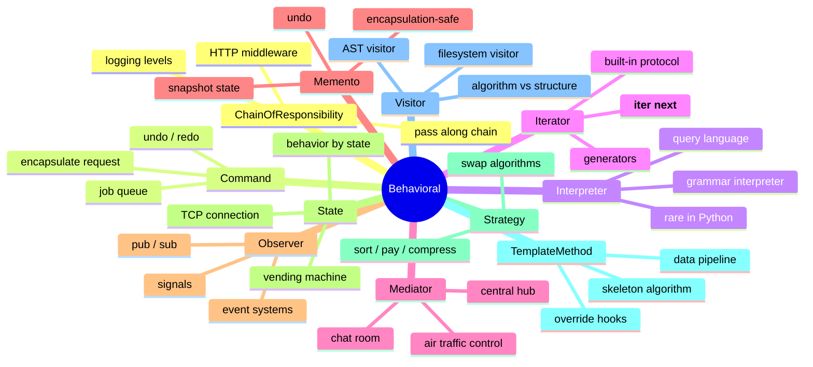
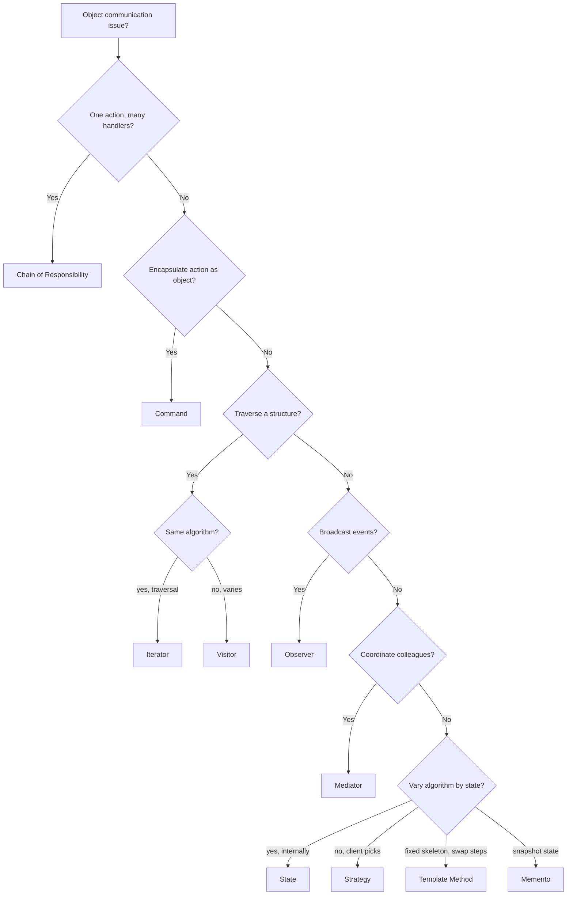

# Behavioral Design Patterns — Object Communication in Python

#oop #design-patterns #behavioral #gof #chain-of-responsibility #command #iterator #observer #strategy #state #visitor #teaching #deep-dive

> [!quote] Gang of Four
> "Behavioral patterns are concerned with algorithms and the assignment of responsibilities between objects. They characterize complex control flow that's difficult to follow at run-time. They shift your focus away from flow of control to let you concentrate just on the way objects are interconnected."

Creational patterns are about *making* objects ([[Creational-Patterns]]). Structural patterns are about *connecting* objects ([[Structural-Patterns]]). **Behavioral patterns are about how objects *talk* to each other** — who sends what message to whom, when, and how.

This note covers all eleven GoF behavioral patterns:

- [[#1. Chain of Responsibility|Chain of Responsibility]] — pass requests along a chain
- [[#2. Command|Command]] — encapsulate a request as an object
- [[#3. Interpreter|Interpreter]] — grammar interpreter
- [[#4. Iterator|Iterator]] — sequential access without exposing internals
- [[#5. Mediator|Mediator]] — central object coordinates colleagues
- [[#6. Memento|Memento]] — capture and restore state
- [[#7. Observer|Observer]] — publish/subscribe
- [[#8. State|State]] — behavior changes with state
- [[#9. Strategy|Strategy]] — interchangeable algorithms
- [[#10. Template Method|Template Method]] — skeleton algorithm with hooks
- [[#11. Visitor|Visitor]] — separate algorithm from structure

Prerequisite reading: [[Polymorphism]], [[Encapsulation]], [[Abstraction]], [[Classes-And-Objects]].

---

## 0. Why Behavioral Patterns Exist

Once your code has more than a handful of objects, the **control flow** between them becomes the bottleneck on clarity. Behavioral patterns answer:

- *Who decides which handler processes this request?* → Chain of Responsibility
- *How do I queue, undo, or log an action?* → Command
- *How do I traverse a structure without knowing its shape?* → Iterator, Visitor
- *How do I broadcast events without coupling sender to receivers?* → Observer
- *How do I change behavior based on internal state?* → State
- *How do I swap an algorithm at runtime?* → Strategy



### 0.1 The Eleven Patterns at a Glance

| Pattern | Core Idea | Pythonic Hint |
|---------|-----------|----------------|
| **Chain of Responsibility** | Pass request until handled | Linked list of handlers |
| **Command** | Object encapsulates an action | Function + state = Command object |
| **Interpreter** | Define a grammar + evaluator | Use `ast`, `ply`, or just functions |
| **Iterator** | Traversal interface | `__iter__` / `__next__`, generators |
| **Mediator** | Central hub coordinates colleagues | Chat room, event bus |
| **Memento** | Snapshot for undo | `dataclass(frozen=True)` snapshots |
| **Observer** | Pub/sub event broadcasting | `signal`/`slot`, `Observable` mixin |
| **State** | Behavior tied to state objects | Replace `if state ==` with state class |
| **Strategy** | Swap algorithms | Pass a callable, or strategy class |
| **Template Method** | Inherited skeleton + hooks | `super().method()` between steps |
| **Visitor** | External algorithms over a structure | Structural pattern matching, `visit_*` |

> [!tip] Teaching Tip
> Behavioral patterns are where students get the most "aha" moments. Many of them turn out to be cousins: Strategy and State are structurally identical; Template Method and Strategy solve related problems; Command and Memento work together for undo.

---

## 1. Chain of Responsibility

### 1.1 Intent

Avoid coupling the sender of a request to its receiver by giving more than one object a chance to handle the request. Chain the receiving objects and pass the request along until an object handles it.

### 1.2 When to Use

- More than one object may handle a request, and the handler isn't known a priori.
- You want to issue a request to one of several objects without specifying the receiver explicitly.
- The set of objects that can handle a request should be specified dynamically.

### 1.3 When NOT to Use

- When the handler is fixed and known — a direct call is clearer.
- When the chain is short and never changes — a switch is fine.
- When each request must be handled by *every* link (that's a **pipeline**, not a chain).

### 1.4 Real-World Examples

- HTTP middleware (Django, Flask, FastAPI): request → auth → CORS → rate-limit → handler.
- Logging: DEBUG → INFO → WARNING → ERROR (each level may decide to handle or pass).
- Exception handlers in nested `try` blocks.
- Customer support escalation: tier 1 → tier 2 → tier 3 → engineering.

### 1.5 Python Implementation — Issue Escalation

Using `match` and modern typing, we can beautifully map out an escalation chain.

```python
from abc import ABC, abstractmethod
from dataclasses import dataclass
from typing import Self, override


@dataclass
class Issue:
    severity: int
    description: str


class SupportHandler(ABC):
    def __init__(self) -> None:
        self._next_handler: SupportHandler | None = None

    def set_next(self, handler: Self) -> Self:
        self._next_handler = handler
        return handler

    @abstractmethod
    def handle(self, issue: Issue) -> str | None:
        if self._next_handler:
            return self._next_handler.handle(issue)
        return None


class Level1Support(SupportHandler):
    @override
    def handle(self, issue: Issue) -> str | None:
        match issue.severity:
            case 1:
                return f"Level 1 fixed: {issue.description}"
            case _:
                return super().handle(issue)


class Level2Support(SupportHandler):
    @override
    def handle(self, issue: Issue) -> str | None:
        match issue.severity:
            case 2:
                return f"Level 2 fixed: {issue.description}"
            case _:
                return super().handle(issue)


class EngineeringSupport(SupportHandler):
    @override
    def handle(self, issue: Issue) -> str | None:
        match issue.severity:
            case severity if severity >= 3:
                return f"Engineering fixed critical issue: {issue.description}"
            case _:
                return super().handle(issue)


# Usage:
chain = Level1Support()
chain.set_next(Level2Support()).set_next(EngineeringSupport())

print(chain.handle(Issue(1, "Password reset")))      # Level 1
print(chain.handle(Issue(2, "Database timeout")))    # Level 2
print(chain.handle(Issue(5, "Server on fire")))      # Engineering
```

---

## 2. Command

### 2.1 Intent

Encapsulate a request as an object, letting you parameterize clients with different requests, queue or log requests, and support undoable operations.

### 2.2 Python Implementation — Smart Home Automation

```python
from abc import ABC, abstractmethod
from typing import override


class Command(ABC):
    @abstractmethod
    def execute(self) -> None: ...

    @abstractmethod
    def undo(self) -> None: ...


class Light:
    def __init__(self, room: str) -> None:
        self.room = room
        self.is_on = False

    def turn_on(self) -> None:
        self.is_on = True
        print(f"{self.room} light is ON")

    def turn_off(self) -> None:
        self.is_on = False
        print(f"{self.room} light is OFF")


class ToggleLightCommand(Command):
    def __init__(self, light: Light) -> None:
        self._light = light

    @override
    def execute(self) -> None:
        if self._light.is_on:
            self._light.turn_off()
        else:
            self._light.turn_on()

    @override
    def undo(self) -> None:
        self.execute()  # Toggle is symmetrical


class SmartRemote:
    def __init__(self) -> None:
        self._history: list[Command] = []

    def press_button(self, command: Command) -> None:
        command.execute()
        self._history.append(command)

    def press_undo(self) -> None:
        if self._history:
            self._history.pop().undo()


# Usage:
living_room = Light("Living Room")
remote = SmartRemote()

remote.press_button(ToggleLightCommand(living_room))  # ON
remote.press_undo()                                   # OFF
```

---

## 3. Interpreter

### 3.1 Intent

Given a language, define a representation for its grammar along with an interpreter.

### 3.2 Python Implementation — Expression Evaluator

Using structural pattern matching, interpreting abstract syntax trees (AST) is extremely elegant.

```python
from dataclasses import dataclass
from typing import Any


@dataclass
class Expr: pass


@dataclass
class Lit(Expr):
    val: int


@dataclass
class Add(Expr):
    left: Expr
    right: Expr


@dataclass
class Mul(Expr):
    left: Expr
    right: Expr


def interpret(expr: Expr) -> int:
    match expr:
        case Lit(val):
            return val
        case Add(left, right):
            return interpret(left) + interpret(right)
        case Mul(left, right):
            return interpret(left) * interpret(right)
        case _:
            raise ValueError(f"Unknown expression: {expr}")


# Evaluate: (2 + 3) * 4
ast = Mul(Add(Lit(2), Lit(3)), Lit(4))
print(interpret(ast))  # 20
```

---

## 4. Iterator

### 4.1 Intent

Provide a way to access the elements of an aggregate object sequentially without exposing its underlying representation. Python handles this elegantly with generators and the iterator protocol (`__iter__`, `__next__`).

### 4.2 Python Implementation — Tree Traversal

```python
from dataclasses import dataclass
from typing import Generator, Self


@dataclass
class TreeNode:
    value: int
    left: Self | None = None
    right: Self | None = None

    def __iter__(self) -> Generator[int, None, None]:
        if self.left:
            yield from self.left
        yield self.value
        if self.right:
            yield from self.right


# Usage:
tree = TreeNode(2, TreeNode(1), TreeNode(3))
print(list(tree))  # [1, 2, 3]
```

---

## 5. Mediator

### 5.1 Intent

Define an object that encapsulates how a set of objects interact, promoting loose coupling.

### 5.2 Python Implementation — Chat Room

```python
from typing import Self, override


class ChatRoom:
    def __init__(self) -> None:
        self._users: list["User"] = []

    def register(self, user: "User") -> None:
        self._users.append(user)
        user.mediator = self

    def broadcast(self, message: str, sender: "User") -> None:
        for user in self._users:
            if user is not sender:
                user.receive(message, sender.name)


class User:
    def __init__(self, name: str) -> None:
        self.name = name
        self.mediator: ChatRoom | None = None

    def send(self, message: str) -> None:
        if self.mediator:
            self.mediator.broadcast(message, self)

    def receive(self, message: str, sender_name: str) -> None:
        print(f"[{self.name}'s inbox] {sender_name}: {message}")


# Usage:
room = ChatRoom()
alice = User("Alice")
bob = User("Bob")

room.register(alice)
room.register(bob)

alice.send("Hello Bob!")
# [Bob's inbox] Alice: Hello Bob!
```

---

## 6. Memento

### 6.1 Intent

Capture and restore an object's internal state without violating encapsulation.

### 6.2 Python Implementation — Game Save System

```python
from dataclasses import dataclass
from typing import Self, override


@dataclass(frozen=True)
class GameMemento:
    level: int
    health: int


class GameState:
    def __init__(self) -> None:
        self.level = 1
        self.health = 100

    def save(self) -> GameMemento:
        return GameMemento(self.level, self.health)

    def restore(self, memento: GameMemento) -> None:
        self.level = memento.level
        self.health = memento.health


class SaveManager:
    def __init__(self) -> None:
        self._saves: list[GameMemento] = []

    def backup(self, state: GameState) -> None:
        self._saves.append(state.save())

    def undo(self, state: GameState) -> None:
        if self._saves:
            state.restore(self._saves.pop())


# Usage:
game = GameState()
manager = SaveManager()

manager.backup(game)
game.health = 50
manager.undo(game)
print(game.health)  # 100
```

---

## 7. Observer

### 7.1 Intent

Define a one-to-many dependency between objects so that when one object changes state, all dependents are notified.

### 7.2 Python Implementation — Weather Station

```python
from abc import ABC, abstractmethod
from typing import Self, override


class Observer(ABC):
    @abstractmethod
    def update(self, temp: float) -> None: ...


class WeatherStation:
    def __init__(self) -> None:
        self._observers: list[Observer] = []
        self._temperature = 0.0

    def attach(self, observer: Observer) -> None:
        self._observers.append(observer)

    @property
    def temperature(self) -> float:
        return self._temperature

    @temperature.setter
    def temperature(self, temp: float) -> None:
        self._temperature = temp
        for observer in self._observers:
            observer.update(self._temperature)


class PhoneDisplay(Observer):
    @override
    def update(self, temp: float) -> None:
        print(f"Phone Display: {temp}°C")


class WindowDisplay(Observer):
    @override
    def update(self, temp: float) -> None:
        print(f"Window Display: {temp}°C")


# Usage:
station = WeatherStation()
station.attach(PhoneDisplay())
station.attach(WindowDisplay())

station.temperature = 25.5
# Phone Display: 25.5°C
# Window Display: 25.5°C
```

---

## 8. State

### 8.1 Intent

Allow an object to alter its behavior when its internal state changes.

### 8.2 Python Implementation — Document Workflow

```python
from abc import ABC, abstractmethod
from typing import Self, override


class DocumentState(ABC):
    @abstractmethod
    def publish(self, doc: "Document") -> None: ...


class DraftState(DocumentState):
    @override
    def publish(self, doc: "Document") -> None:
        print("Draft submitted for review.")
        doc.state = ReviewState()


class ReviewState(DocumentState):
    @override
    def publish(self, doc: "Document") -> None:
        print("Review approved. Document published.")
        doc.state = PublishedState()


class PublishedState(DocumentState):
    @override
    def publish(self, doc: "Document") -> None:
        print("Document is already published.")


class Document:
    def __init__(self) -> None:
        self.state: DocumentState = DraftState()

    def publish(self) -> None:
        self.state.publish(self)


# Usage:
doc = Document()
doc.publish()  # Draft submitted for review.
doc.publish()  # Review approved. Document published.
doc.publish()  # Document is already published.
```

---

## 9. Strategy

### 9.1 Intent

Define a family of algorithms and make them interchangeable.

### 9.2 Python Implementation — Navigation App

```python
from abc import ABC, abstractmethod
from typing import override


class RouteStrategy(ABC):
    @abstractmethod
    def build_route(self, start: str, end: str) -> str: ...


class RoadStrategy(RouteStrategy):
    @override
    def build_route(self, start: str, end: str) -> str:
        return f"Driving from {start} to {end}."


class WalkingStrategy(RouteStrategy):
    @override
    def build_route(self, start: str, end: str) -> str:
        return f"Walking from {start} to {end}."


class Navigator:
    def __init__(self, strategy: RouteStrategy) -> None:
        self._strategy = strategy

    def set_strategy(self, strategy: RouteStrategy) -> None:
        self._strategy = strategy

    def navigate(self, start: str, end: str) -> None:
        print(self._strategy.build_route(start, end))


# Usage:
nav = Navigator(RoadStrategy())
nav.navigate("Home", "Work")  # Driving

nav.set_strategy(WalkingStrategy())
nav.navigate("Home", "Park")  # Walking
```

---

## 10. Template Method

### 10.1 Intent

Define the skeleton of an algorithm, deferring some steps to subclasses.

### 10.2 Python Implementation — Data Miner

```python
from abc import ABC, abstractmethod
from typing import override


class DataMiner(ABC):
    def mine(self, path: str) -> None:
        file = self.open_file(path)
        data = self.extract_data(file)
        self.close_file(file)
        print(f"Mined data: {data}")

    def open_file(self, path: str) -> str:
        return f"File({path})"

    @abstractmethod
    def extract_data(self, file: str) -> str: ...

    def close_file(self, file: str) -> None:
        pass  # hook


class PDFMiner(DataMiner):
    @override
    def extract_data(self, file: str) -> str:
        return "PDF Data"


class CSVMiner(DataMiner):
    @override
    def extract_data(self, file: str) -> str:
        return "CSV Data"


# Usage:
PDFMiner().mine("doc.pdf")
CSVMiner().mine("data.csv")
```

---

## 11. Visitor

### 11.1 Intent

Represent an operation to be performed on the elements of an object structure.

### 11.2 Python Implementation — Shape Exporter

Using pattern matching, we can implement the Visitor pattern without intrusive `accept()` methods on the elements themselves. This perfectly isolates the algorithm from the structure!

```python
from dataclasses import dataclass


@dataclass
class Dot:
    x: int
    y: int


@dataclass
class Circle:
    radius: int


@dataclass
class Rectangle:
    width: int
    height: int


Shape = Dot | Circle | Rectangle


class XMLExporter:
    def export(self, shape: Shape) -> str:
        match shape:
            case Dot(x, y):
                return f"<dot x='{x}' y='{y}'/>"
            case Circle(r):
                return f"<circle radius='{r}'/>"
            case Rectangle(w, h):
                return f"<rectangle width='{w}' height='{h}'/>"
            case _:
                raise ValueError("Unknown shape")


# Usage:
shapes = [Dot(1, 2), Circle(5), Rectangle(10, 20)]
exporter = XMLExporter()

for s in shapes:
    print(exporter.export(s))
```

---

## 12. Comparison Matrix

| Pattern | What it solves | Pythonic alternative |
|---------|----------------|----------------------|
| Chain of Responsibility | Decouple sender from receiver | Function pipeline |
| Command | Encapsulate actions | Function + state |
| Interpreter | Small DSLs | Structural Pattern Matching |
| Iterator | Sequential access | Generators |
| Mediator | Decouple colleagues | Event bus |
| Memento | Snapshot state | `dataclass(frozen=True)` |
| Observer | Pub/sub | `weakref.WeakSet` callbacks |
| State | Behavior by state | State machine libraries |
| Strategy | Swap algorithms | Plain callables |
| Template Method | Skeleton + hooks | `unittest.TestCase` style |
| Visitor | External algorithms | Structural pattern matching |


