# Pattern Selection Guide — Choosing the Right Design Pattern

#oop #design-patterns #selection-guide #anti-patterns #refactoring #rule-of-three #teaching #deep-dive

> [!quote] Erich Gamma (one of the Gang of Four)
> "If you work on a piece of code and you think 'oh, this is a Singleton,' you're already in trouble. The right question is: *what problem am I trying to solve?*"

Design patterns are a **vocabulary for solutions**, not a checklist to apply. This guide walks you through the *questions* that lead to the right pattern — and, equally importantly, the questions that should lead you to **no pattern at all**.

Prerequisite reading: [[Creational-Patterns]], [[Structural-Patterns]], [[Behavioral-Patterns]], [[Single-Responsibility]], [[Open-Closed]].

---

## 0. The First Rule: Don't Pattern (Yet)

> [!warning] The Rule of Three
> Don't introduce a pattern until you've solved the **same problem three times**. The first time, you don't know what varies. The second time, you suspect it varies but you're not sure *how*. The third time, the variation is real and you have evidence — *then* extract the pattern.

Premature patterns are worse than no patterns. They add indirection, boilerplate, and "cleverness" where a plain function would do. Patterns are for **communicating** recurring structures; if a structure isn't recurring, the pattern isn't communicating anything.

### 0.1 The Decision Tree (High Level)

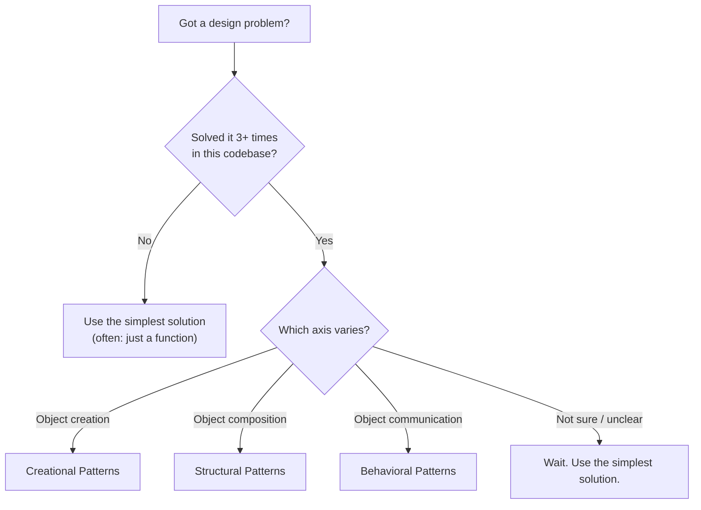

### 0.2 Read Your Smells First

Patterns fix **code smells** (Martin Fowler's term). If you can't name the smell, you can't pick the pattern:

| Smell | Pattern that may help |
|-------|------------------------|
| Constructor explosion | Builder / dataclass |
| `if isinstance(x, T)` everywhere | Visitor / Strategy / `singledispatch` |
| God class with 50 methods | Facade (split) / Mediator (decouple) |
| Hidden global state | Singleton → consider Dependency Injection |
| Million objects, OOM | Flyweight |
| Switch statement on type | Strategy / State / Factory |
| Subclass explosion (N×M) | Bridge |
| Hard-to-reuse tightly-coupled colleagues | Mediator |
| Tight coupling publisher → subscriber | Observer |
| Repeated algorithm skeleton | Template Method |

But note: each pattern is a **candidate** fix, not the only fix. Often the right move is to *delete* code, not to add a pattern.

---

## 1. "I Need to Create Objects"

If your problem is *"how do I make this thing?"*, look at [[Creational-Patterns]].

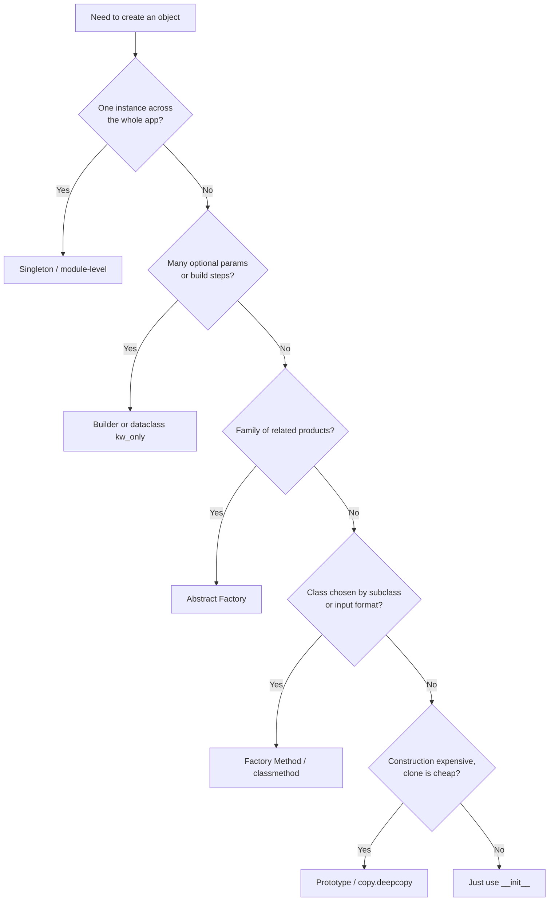

### 1.1 Singleton

- **Pick when**: a single shared resource (logger, config, connection pool) must be globally accessible.
- **Avoid when**: dependencies should be visible in function signatures — use dependency injection instead.
- **Pythonic alternative**: module-level variables, `functools.lru_cache`.
- **Real cost**: hard to test, hidden coupling, refactoring hazard.
- **See**: [[Creational-Patterns#1. Singleton]]

### 1.2 Factory Method

- **Pick when**: a base class needs to create objects but wants subclasses to pick which.
- **Avoid when**: only one concrete product exists.
- **Pythonic alternative**: `@classmethod` `from_*` constructors; plain functions returning instances.
- **See**: [[Creational-Patterns#2. Factory Method]]

### 1.3 Abstract Factory

- **Pick when**: you build *families* of related products (UI themes, DB drivers, game themes) and want them coherent.
- **Avoid when**: only one family, or you add product types often (every new product = N factory changes).
- **See**: [[Creational-Patterns#3. Abstract Factory]]

### 1.4 Builder

- **Pick when**: construction has many optional parts or invariants between steps (HTML building, SQL queries, pizza toppings).
- **Avoid when**: object is simple — a `dataclass(kw_only=True)` is enough.
- **Pythonic alternative**: `dataclasses.replace()` for immutable fluent updates.
- **See**: [[Creational-Patterns#4. Builder]]

### 1.5 Prototype

- **Pick when**: cloning is cheaper than constructing (heavy init, parsed templates, configured game entities).
- **Avoid when**: shallow-vs-deep semantics are unclear, or the object has non-copyable resources (sockets, locks).
- **Pythonic alternative**: `copy.deepcopy()`, `__copy__`, `__deepcopy__`.
- **See**: [[Creational-Patterns#5. Prototype]]

### 1.6 Modern Alternative: Dependency Injection

In modern Python, the most common "creational need" is *wiring up* an object graph at startup. Instead of a Singleton or Factory, use a **dependency injection container** (`dependency-injector`, `punq`, `lagom`). Each class declares its dependencies via `__init__`; the container resolves and constructs them. No pattern needed.

```python
from typing import Self
from typing_extensions import override
class UserService:
    def __init__(self, db: Database, mailer: Mailer):
        self.db = db
        self.mailer = mailer

# Container wires UserService, Database, Mailer together at startup.
container = Container()
container.register(Database, lambda: Database("postgres://..."))
container.register(Mailer, lambda: SmtpMailer(...))
container.register(UserService)

user_service = container.resolve(UserService)
```

This eliminates most Singleton and Factory use cases in application code.

---

## 2. "I Need to Compose Objects"

If your problem is *"how do these objects fit together?"*, look at [[Structural-Patterns]].

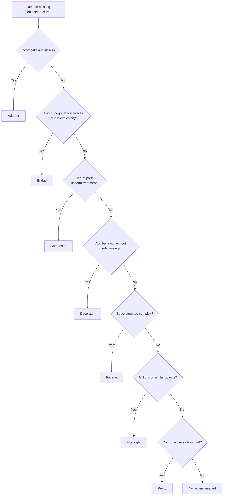

### 2.1 Adapter

- **Pick when**: a class's interface doesn't match what the client needs.
- **Avoid when**: you control both sides — change one.
- **Pythonic alternative**: thin wrapper functions.
- **See**: [[Structural-Patterns#1. Adapter]]

### 2.2 Bridge

- **Pick when**: two hierarchies vary independently (Shape × Renderer, Repository × Storage).
- **Avoid when**: there's only one implementation per abstraction.
- **See**: [[Structural-Patterns#2. Bridge]]

### 2.3 Composite

- **Pick when**: tree structures where leaves and containers share operations (filesystem, UI tree, AST).
- **Avoid when**: only one level deep; just use a list.
- **See**: [[Structural-Patterns#3. Composite]]

### 2.4 Decorator

- **Pick when**: add responsibilities dynamically without subclassing (coffee add-ons, stream wrappers).
- **Avoid when**: a list of features or a plain function would do.
- **Important**: GoF Decorator ≠ Python `@decorator`. Same principle, different mechanism.
- **See**: [[Structural-Patterns#4. Decorator]]

### 2.5 Facade

- **Pick when**: a complex subsystem needs a simple entry point.
- **Avoid when**: the subsystem is already simple, or the Facade becomes a God Object.
- **See**: [[Structural-Patterns#5. Facade]]

### 2.6 Flyweight

- **Pick when**: huge numbers of similar objects exhaust memory.
- **Avoid when**: objects are mostly unique (no intrinsic state to share).
- **Pythonic alternative**: `sys.intern()`, dict-based pooling.
- **See**: [[Structural-Patterns#6. Flyweight]]

### 2.7 Proxy

- **Pick when**: control access (lazy, cache, logging, access control, remote).
- **Avoid when**: direct access is fine.
- **Pythonic alternative**: `__getattr__` forwarding, `weakref.proxy`.
- **See**: [[Structural-Patterns#7. Proxy]]

---

## 3. "I Need Objects to Communicate"

If your problem is *"who sends what to whom?"*, look at [[Behavioral-Patterns]].

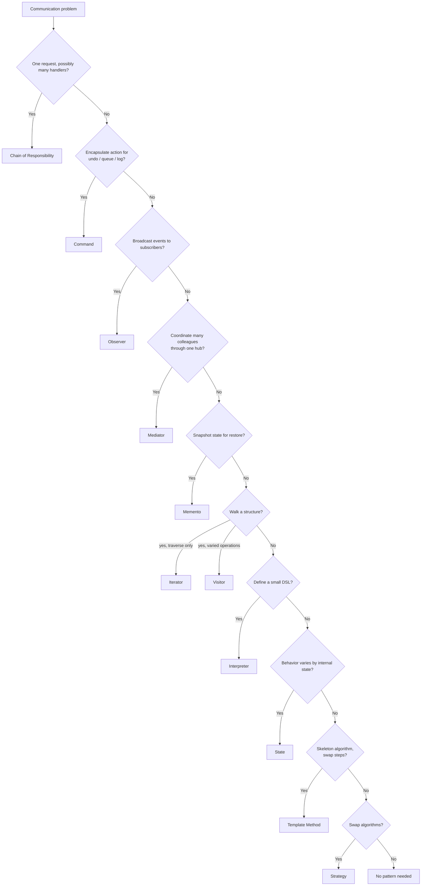

### 3.1 Chain of Responsibility

- **Pick when**: a request may be handled by any of several handlers, decoupled from the sender.
- **Avoid when**: handler is fixed, or every link must process (that's a pipeline).
- **Pythonic alternative**: function pipeline.
- **See**: [[Behavioral-Patterns#1. Chain of Responsibility]]

### 3.2 Command

- **Pick when**: actions need undo, queuing, logging, or scheduling.
- **Avoid when**: action is trivial and one-shot — use a function.
- **Pythonic alternative**: closures, `functools.partial`.
- **See**: [[Behavioral-Patterns#2. Command]]

### 3.3 Mediator

- **Pick when**: many colleagues would otherwise be tightly coupled to each other.
- **Avoid when**: only 2-3 colleagues, or the Mediator becomes a God Object.
- **See**: [[Behavioral-Patterns#5. Mediator]]

### 3.4 Observer

- **Pick when**: one publisher must notify many subscribers it doesn't know about.
- **Avoid when**: only one subscriber, or notification cascades cause loops.
- **Pythonic alternative**: `blinker`, `weakref.WeakSet` callbacks.
- **See**: [[Behavioral-Patterns#7. Observer]]

---

## 4. "I Need to Vary Algorithms"

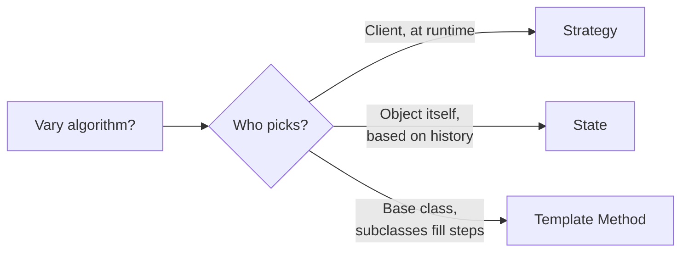

### 4.1 Strategy

- **Pick when**: client picks algorithm; algorithm has no internal state.
- **Avoid when**: one variant; or when a plain callable suffices.
- **See**: [[Behavioral-Patterns#9. Strategy]]

### 4.2 State

- **Pick when**: object's behavior depends on its state, and it transitions between states internally.
- **Avoid when**: only 1-2 branches; use `if`.
- **See**: [[Behavioral-Patterns#8. State]]

### 4.3 Template Method

- **Pick when**: an algorithm has a fixed skeleton with varying steps; inheritance is appropriate.
- **Avoid when**: composition (Strategy) would be cleaner.
- **See**: [[Behavioral-Patterns#10. Template Method]]

---

## 5. "I Need to Traverse Structures"

| Need | Pattern |
|------|---------|
| Just iterate elements in order | Iterator (or `for x in y`) |
| Different operations on a heterogeneous structure | Visitor |
| Walk a tree with `yield` | Generator (Iterator) |
| Type-dispatched function over many classes | `functools.singledispatch` |

### 5.1 Iterator

- **Pick when**: uniform traversal without exposing the structure.
- **Pythonic alternative**: generators.
- **See**: [[Behavioral-Patterns#4. Iterator]]

### 5.2 Visitor

- **Pick when**: many unrelated operations on a stable structure.
- **Avoid when**: the structure changes often (each new element type breaks every Visitor).
- **Pythonic alternative**: `functools.singledispatch` for type-based dispatch.
- **See**: [[Behavioral-Patterns#11. Visitor]]

---

## 6. "I Need Undo/Redo"

Two patterns combine: **Command** + **Memento**.

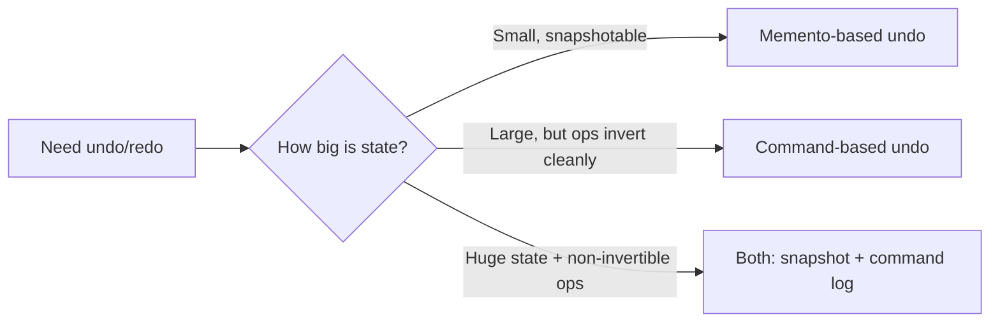

- **Command**: store inverse operations. Memory-light; hard for non-invertible actions.
- **Memento**: store snapshots. Simple; memory-heavy.
- **Hybrid**: snapshot periodically; between snapshots, log commands.

See [[Behavioral-Patterns#2. Command]] and [[Behavioral-Patterns#6. Memento]].

---

## 7. Anti-Pattern Catalog

Anti-patterns are *recurring* mistakes that look like good ideas at first. Spotting them is more valuable than memorizing patterns.

### 7.1 God Class / God Object

A single class that knows too much and does too much. Methods span unrelated concerns. Fields are heterogeneous.

**Symptoms**: 1000+ lines, 50+ methods, dozens of fields, every new feature touches this class.

**Fix**: split by responsibility ([[Single-Responsibility]]). Often: extract a Service, a Repository, a Domain class. Use Facade to keep the old entry point as a thin shim during migration.

### 7.2 Feature Envy

A method that's more interested in another class's data than its own.

```python
# Smell:
class Report:
    @override
    def print_user(self, user):
        print(f"{user.first_name} {user.last_name}, {user.age}, {user.email}")
        # This method uses 4 fields of User and 0 of its own class.
```

**Fix**: move the method to the envied class (`User.display()`).

### 7.3 Primitive Obsession

Using primitives (`str`, `int`, `dict`) where small value-objects would clarify intent.

```python
# Smell:
def create_user(email: str, age: int, country: str): ...

# Better:
@dataclass(frozen=True)
class Email:
    value: str
    @override
    def __post_init__(self):
        if "@" not in self.value: raise ValueError("bad email")

@dataclass(frozen=True)
class Age:
    value: int
    @override
    def __post_init__(self):
        if not 0 < self.value < 150: raise ValueError("bad age")

def create_user(email: Email, age: Age, country: Country): ...
```

**Fix**: introduce small value objects. Validation moves into the type; the function signature documents intent.

### 7.4 Spaghetti Code

Tight coupling, no clear control flow, callbacks everywhere, "spooky action at a distance."

**Fix**: refactor toward Mediator or Event Bus for cross-cutting communication; introduce Facade for entry points; apply [[Single-Responsibility]] ruthlessly.

### 7.5 Golden Hammer

"For every problem, I have a hammer — even if it's a screw."

**Symptoms**: every class is a Singleton; every algorithm is a Strategy; every UI is a Composite.

**Fix**: read this guide. Apply the Rule of Three. Try the simplest thing first.

### 7.6 Not Invented Here

Refusing to use libraries; rebuilding everything.

**Fix**: prefer stdlib; reach for well-maintained third-party libraries; only build your own when the existing options truly don't fit.

### 7.7 Dead Code

Methods, classes, modules that nothing calls. Often left "in case we need it."

**Fix**: delete. Git remembers. (Run coverage tools to confirm.)

### 7.8 Magic Numbers / Strings

Bare `0.21` or `"STRIPE_PROVIDER"` scattered through the code.

**Fix**: named constants, enums, value objects.

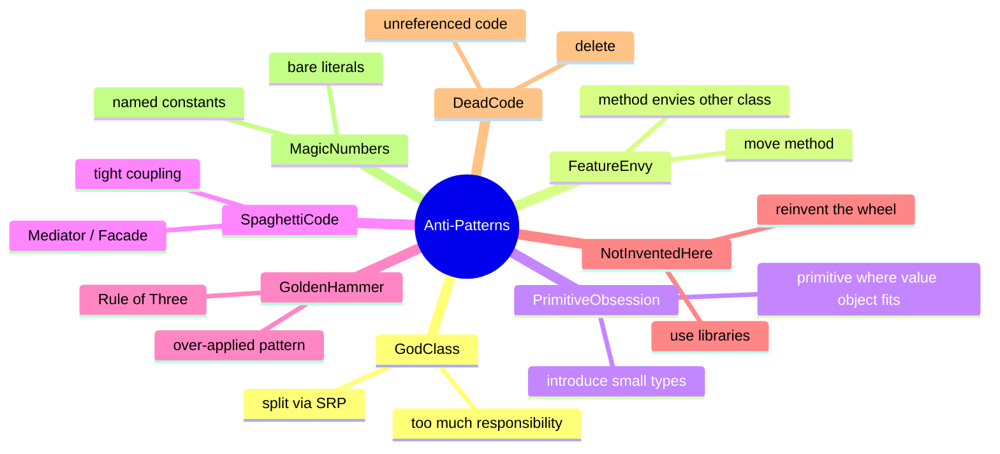

---

## 8. Pattern Smell Catalog

Even *correct* patterns can be misapplied. Watch for these smells:

### 8.1 Pattern Where a Function Would Do

```python
# Smell: Strategy class with one method, no state
class SortByNameStrategy:
    @override
    def sort(self, items):
        return sorted(items, key=lambda x: x.name)

# Better: a function
def sort_by_name(items):
    return sorted(items, key=lambda x: x.name)
```

### 8.2 Pattern Where `dataclass` Would Do

```python
# Smell: 30-line Builder for a 4-field immutable object
# Better:
@dataclass(frozen=True, kw_only=True)
class Config:
    host: str
    port: int = 80
    debug: bool = False
```

### 8.3 Pattern Where `singledispatch` Would Do

```python
# Smell: full Visitor pattern for 3 types and 2 operations
# Better:
from functools import singledispatch

@singledispatch
def to_html(node): raise NotImplementedError

@to_html.register
def _(node: Number): return str(node.value)

@to_html.register
def _(node: Add): return f"({to_html(node.left)} + {to_html(node.right)})"
```

### 8.4 Singleton Used as Fancy Global

If the only justification is "I want one shared instance," use a module. The Singleton pattern's class-based indirection adds complexity for no benefit.

### 8.5 Factory Factory Factory

If `XFactory` produces `XFactoryBuilder` which produces `XFactory` which produces `X`... you have indirection indirection indirection. Cut it.

### 8.6 Observer with One Subscriber

A Subject that always has exactly one Observer should just call the function directly.

### 8.7 Bridge with One Implementation

If only one `Renderer` exists, there's nothing to bridge. Wait until the second appears.

### 8.8 Decorator Pyramid of Doom

```python
coffee = SugarDecorator(MilkDecorator(WhipDecorator(CaramelDecorator(SimpleCoffee())))
```

Five decorators deep, in a fixed order, just to express "coffee with five toppings." Replace with:

```python
coffee = Coffee(base_price=2.0, toppings=["sugar", "milk", "whip", "caramel"])
```

---

## 9. The Rule of Three (Detailed)

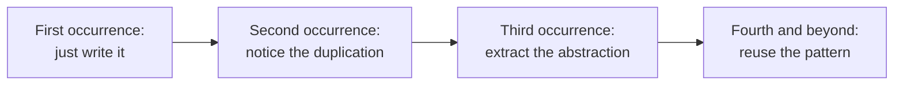

### 9.1 Why Three?

- **First time**: you don't know what varies. A pattern chosen now is a guess.
- **Second time**: you suspect duplication, but the two cases differ in subtle ways. Extracting prematurely may lock in the wrong abstraction.
- **Third time**: the variation is real. Three data points are enough to identify the common shape and the variable parts.

This rule is attributed to Don Roberts and Martin Fowler: *"The first time you do something, you just do it. The second time you do a similar thing, you wince at the duplication, but you do the same thing anyway. The third time you do something similar, you refactor."*

### 9.2 When to Break the Rule

- When the design *obviously* fits a pattern (e.g., a logging subsystem *is* a Singleton by nature).
- When the cost of *not* extracting is concrete (test failures, repeated bugs).
- When teaching — patterns introduced in isolation, before students feel the pain, are not retained.

---

## 10. Modern Alternatives: Functions Often Replace Patterns in Python

Python's first-class functions, generators, `dataclasses`, `functools.singledispatch`, and `__init_subclass__` give you pattern-like behavior with far less ceremony.

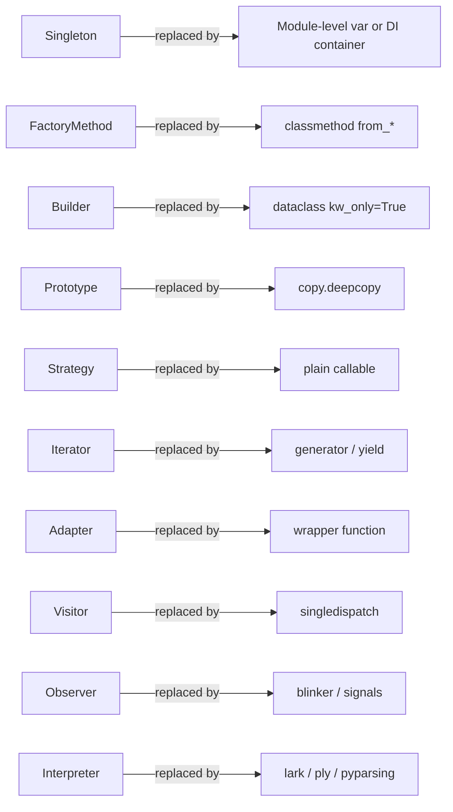

### 10.1 Pattern → Pythonic Alternative Table

| Pattern | Pythonic alternative |
|---------|----------------------|
| Singleton | Module-level variable, `@lru_cache`, DI container |
| Factory Method | `@classmethod` `from_*` |
| Builder | `@dataclass(kw_only=True)`, `dataclasses.replace` |
| Prototype | `copy.deepcopy`, `__deepcopy__` |
| Adapter | Wrapper function |
| Bridge | Plain dependency injection |
| Composite | Recursive `dataclass` (or just classes) |
| Decorator (GoF) | Wrappers + duck typing, or `@decorator` for functions |
| Facade | A simple class with 3-5 methods |
| Flyweight | `sys.intern`, dict-based pooling |
| Proxy | `__getattr__` forwarding, `weakref.proxy` |
| Strategy | Callable, `@dataclass` with a function field |
| State | Class-based state objects, or `transitions` library |
| Template Method | `unittest.TestCase`-style hooks |
| Visitor | `functools.singledispatch`, `ast.NodeVisitor` |
| Iterator | Generators (`yield`) |
| Command | Closure, `functools.partial` |
| Chain of Responsibility | Function pipeline, list of callables |
| Observer | `blinker`, `weakref.WeakSet` callbacks |
| Mediator | Event bus, `blinker.signal` |
| Memento | `dataclass(frozen=True)` snapshots |
| Interpreter | `lark`, `ply`, `pyparsing` |

> [!tip] Teaching Tip
> Show students both versions: the full GoF pattern, and the Pythonic shortcut. Discuss *what each communicates*: the GoF pattern signals "this is a Strategy" loudly; the Pythonic version is terser but requires the reader to know the idiom. Code for the reader.

---

## 11. Refactoring to Patterns

Martin Fowler's approach: **refactor toward patterns, not toward abstractions**. Don't add a pattern because it sounds nice. Add it when refactoring *to* it removes duplication or clarifies intent.

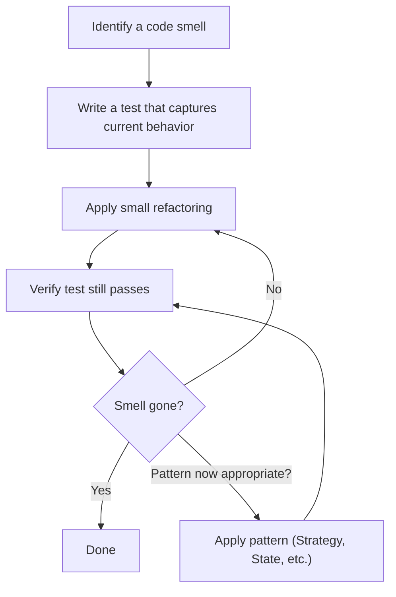

### 11.1 Common Refactorings → Patterns

| Refactoring | Resulting Pattern |
|-------------|-------------------|
| Replace Conditional with Polymorphism | Strategy / State |
| Extract Subclass | Template Method / Strategy |
| Extract Method → Object | Command |
| Move Method | Feature Envy fix → Facade or Mediator |
| Replace Inheritance with Delegation | Bridge / Strategy |
| Replace Method with Method Object | Command |
| Replace Type Code with State/Strategy | State / Strategy |
| Introduce Parameter Object | Builder (eventually) |

### 11.2 A Worked Example: Replacing a Switch

**Before**:

```python
def calculate_fee(account_type, balance):
    if account_type == "standard":
        return max(balance * 0.01, 5.0)
    elif account_type == "premium":
        return balance * 0.005
    elif account_type == "student":
        return 0.0
    else:
        raise ValueError(account_type)
```

**Step 1**: Replace conditional with polymorphism.

```python
class Account:
    @override
    def calculate_fee(self, balance: float) -> float:
        raise NotImplementedError

class StandardAccount(Account):
    @override
    def calculate_fee(self, balance): return max(balance * 0.01, 5.0)

class PremiumAccount(Account):
    @override
    def calculate_fee(self, balance): return balance * 0.005

class StudentAccount(Account):
    @override
    def calculate_fee(self, balance): return 0.0
```

**Step 2**: Notice that the client still picks the type via a string. Add a Factory:

```python
class AccountFactory:
    _registry = {"standard": StandardAccount, "premium": PremiumAccount, "student": StudentAccount}

    @classmethod
    def create(cls, kind: str) -> Self:
        return cls._registry[kind]()
```

**Step 3**: Future accounts are added without touching `calculate_fee` or the factory — only by registering a new class. Open/Closed achieved.

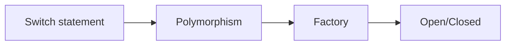

---

## 12. Pattern Relationships (Big Picture)

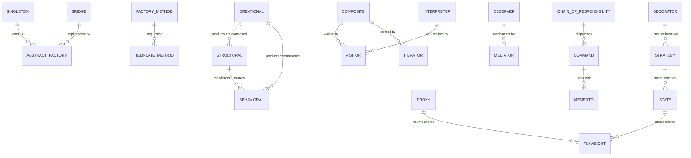

Every pattern connects to others. Most real systems combine 3-5 patterns, not 23.

---

## 13. Decision Mindmap (Big Picture)

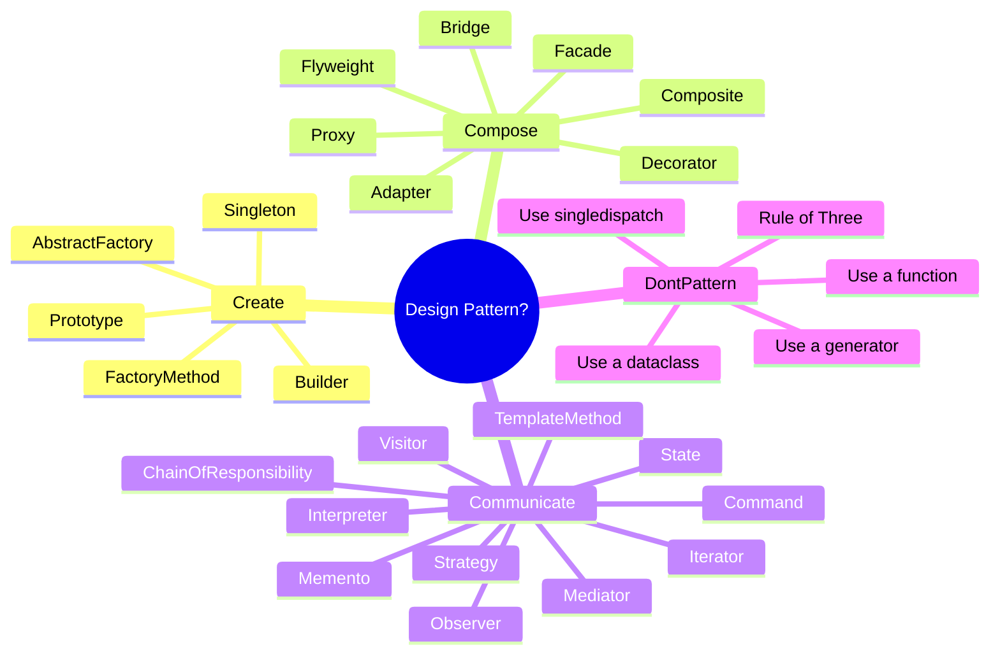

---

## 14. A Decision Workflow (Real-World)

When facing a design problem, walk through this checklist:

1. **Name the smell.** What specifically hurts? "Code is hard to read" is not a smell; "switch statement on type" is.
2. **Try the simplest fix.** Extract a function. Delete dead code. Rename. Often this is enough.
3. **Apply the Rule of Three.** Have I solved this 3+ times? If not, *don't* pattern yet.
4. **Identify the axis of variation.** Is it creation? Composition? Communication? Algorithm?
5. **Consult the decision tree** in this guide.
6. **Check the Pythonic alternative first.** Could a function, dataclass, or `singledispatch` do it?
7. **If a pattern is right, implement it minimally.** No abstract base classes if a Protocol works. No factories if a function does.
8. **Write tests.** Patterns should make tests *easier*. If they make tests harder, you've misapplied them.
9. **Refactor.** Code rarely starts with the right pattern. Refactor *toward* patterns as variation emerges.

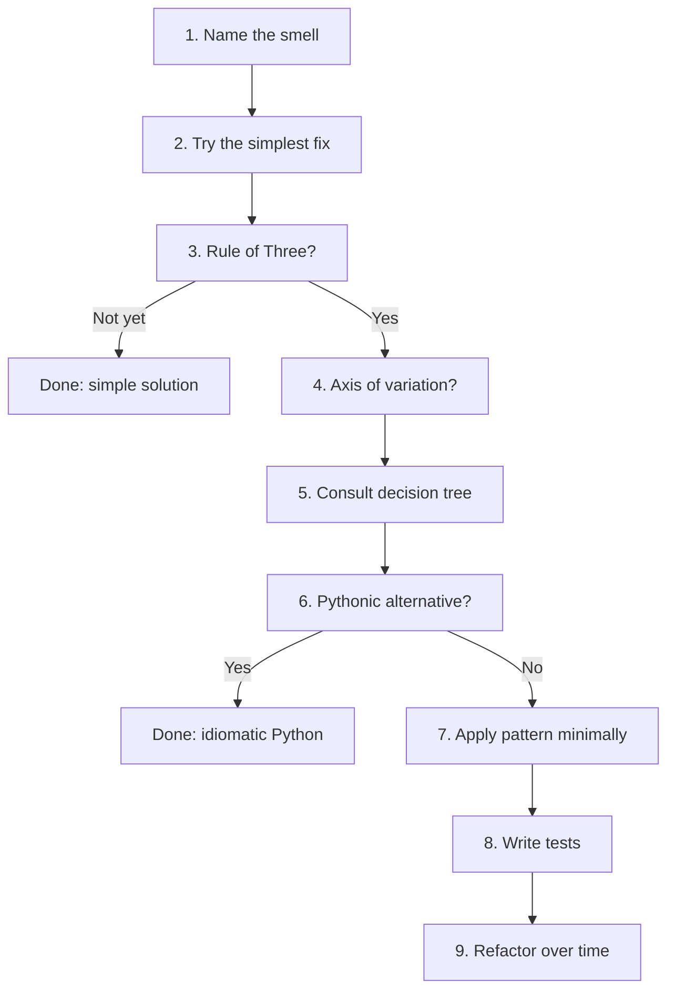

---

## 15. Anti-Checklist: When You Should NOT Apply a Pattern

- [ ] You cannot articulate the *problem* the pattern solves.
- [ ] The pattern's "axis of change" hasn't changed in your codebase yet.
- [ ] A plain function or `dataclass` would be 80% as clear.
- [ ] You can't name a second concrete variant of the abstraction.
- [ ] Adding the pattern makes tests harder to write.
- [ ] Adding the pattern makes the call site more verbose than the original.
- [ ] The team is unfamiliar with the pattern and the docs don't help.
- [ ] You're doing it because a senior engineer told you to "use more patterns."

If three or more boxes are checked, **stop**. Use the simplest solution and revisit later.

---

## 16. Teaching Path for Pattern Selection

When teaching pattern selection to students:

1. **Start with smells, not patterns.** Show them ugly code first; let them articulate *why* it's ugly. Then introduce the pattern as one possible remedy.
2. **Show the anti-checklist early.** Students who learn patterns first over-apply them. Inoculate by showing the *wrong* applications.
3. **Teach the Rule of Three.** Don't let them extract abstractions on the second occurrence.
4. **Always show the Pythonic alternative.** Students should know that Strategy often becomes "just pass a function."
5. **Refactor live.** Take a piece of bad code and refactor it toward a pattern in front of them. Show the tests passing at every step.
6. **Make them defend their choice.** When a student proposes a pattern, ask: "What smell does it fix? What's the simplest alternative? Have you seen this 3 times?"

> [!success] Learning Check
> Given a real code smell, can the student (a) name it, (b) name at least two patterns that *could* fix it, (c) name the Pythonic shortcut for each, and (d) pick one with a defensible reason? If yes, they've mastered pattern selection.

---

## 17. Summary

Patterns are a vocabulary, not a checklist. Choosing the right pattern is a **four-step act**:

1. **Name the smell** you're trying to fix.
2. **Try the simplest solution** first.
3. **Wait for the Rule of Three** before extracting a pattern.
4. **Pick the pattern whose axis of variation matches your problem.**

And the **fifth step**, equally important:

5. **Prefer the Pythonic shortcut** when it's clearer than the GoF pattern.

A great Python codebase uses fewer patterns than you'd expect — because Python's first-class functions, generators, dataclasses, and `singledispatch` absorb most of the patterns' work. The patterns you *do* see should be there because they're **communicating** something real about the structure of the problem.

Continue exploring:
- [[Creational-Patterns]] — how objects are made.
- [[Structural-Patterns]] — how objects compose.
- [[Behavioral-Patterns]] — how objects communicate.
- [[SOLID-Overview]] — the principles that guide pattern choice.
- [[Open-Closed]] — the property most patterns try to deliver.
