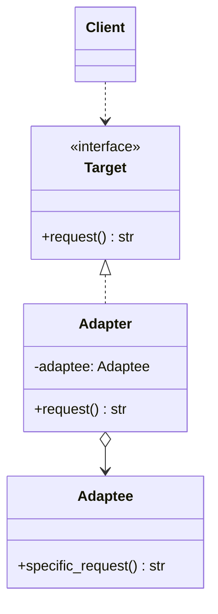
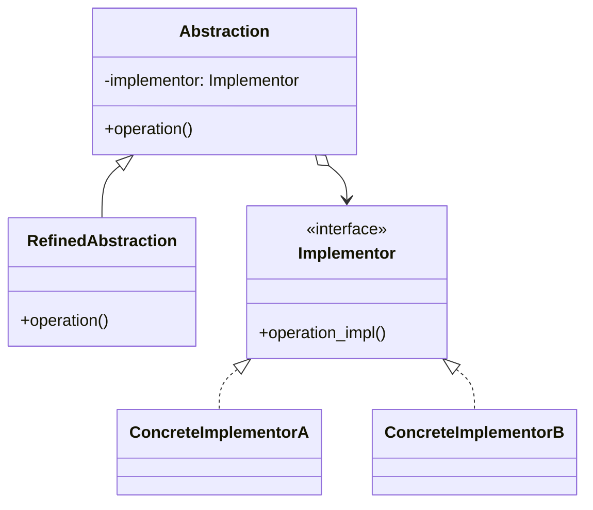
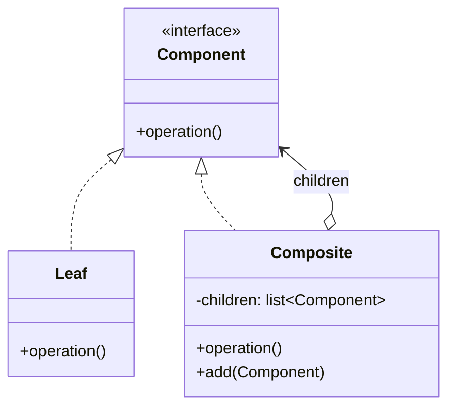
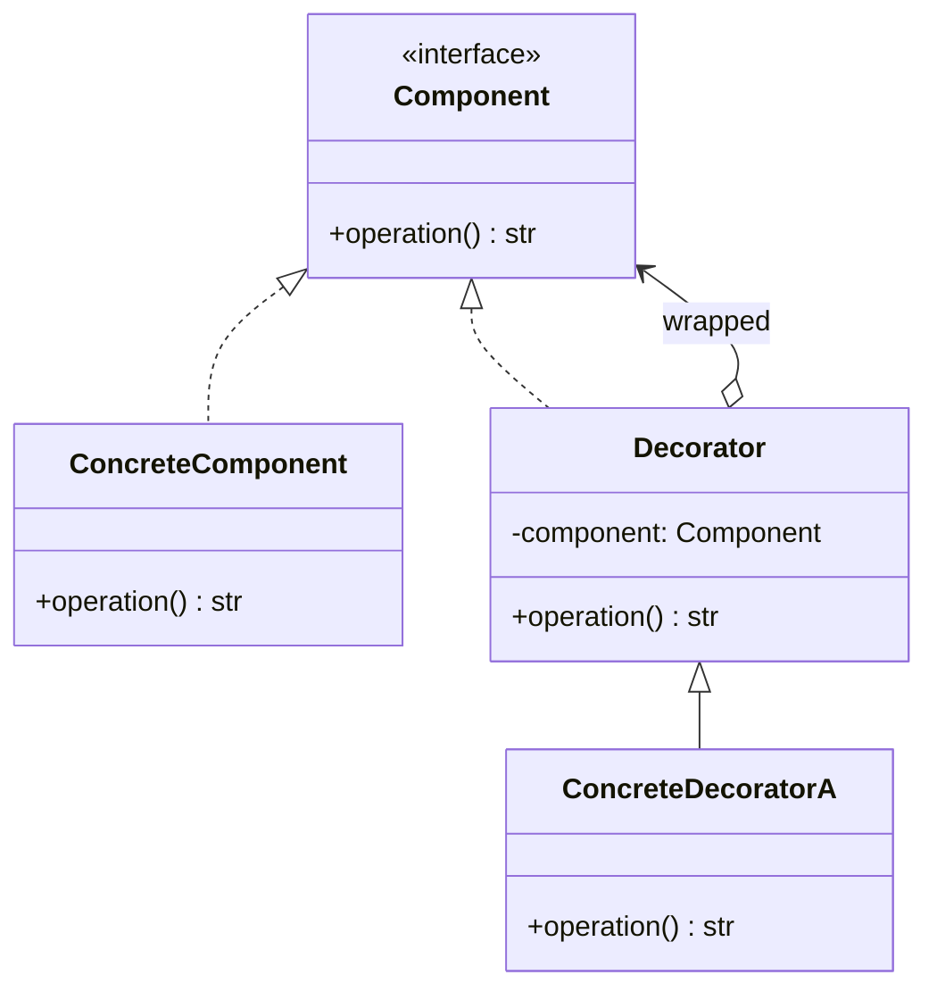

# Structural Design Patterns — Composing Objects in Python

#oop #design-patterns #structural #gof #adapter #bridge #composite #decorator #facade #flyweight #proxy #teaching #deep-dive

> [!quote] Gang of Four
> "Structural patterns are concerned with how classes and objects are composed to form larger structures. Structural class patterns use inheritance to compose interfaces or implementations. Structural object patterns describe ways to compose objects to realize new functionality."

If creational patterns (see [[Creational-Patterns]]) are about *how objects are born*, structural patterns are about **how objects connect and combine**. They let you build bigger structures from smaller parts — without rewriting the parts.

This note covers all seven GoF structural patterns, updated with modern Python 3.10+ features like `match / case` structural pattern matching, PEP 698 `@override`, and `typing.Self`.

- [[#1. Adapter|Adapter]] — make incompatible interfaces work together
- [[#2. Bridge|Bridge]] — decouple abstraction from implementation
- [[#3. Composite|Composite]] — uniform treatment of trees
- [[#4. Decorator|Decorator]] — add behavior without subclassing
- [[#5. Facade|Facade]] — simplify a complex subsystem
- [[#6. Flyweight|Flyweight]] — share fine-grained state
- [[#7. Proxy|Proxy]] — placeholder/surrogate for another object

Prerequisite reading: [[Classes-And-Objects]], [[Polymorphism]], [[Composition-vs-Inheritance]], [[Abstraction]].

---

## 0. Why Structural Patterns Exist

Software grows. As it does, you discover that:

- A useful class exists, but its interface does not match what you need. → **Adapter**
- An abstraction has multiple *orthogonal* variations, and inheritance explodes. → **Bridge**
- A tree-shaped data structure (filesystem, UI, AST) should be treated uniformly. → **Composite**
- You want to add responsibilities to individual objects dynamically. → **Decorator**
- A subsystem is correct but too complex for callers to use directly. → **Facade**
- You have millions of similar objects and memory is exhausted. → **Flyweight**
- You need to control or defer access to an expensive object. → **Proxy**

```mermaid
mindmap
  root((Structural))
    Adapter
      wrap incompatible interface
      USB-to-serial
      XML-to-JSON
    Bridge
      abstraction vs impl
      shape+renderer
      avoid inheritance explosion
    Composite
      tree of parts
      uniform treatment
      filesystem / UI tree
    Decorator
      add behavior at runtime
      NOT python @ decorator
      coffee add-ons
    Facade
      simplified gateway
      hides subsystem
      computer facade
    Flyweight
      shared intrinsic state
      text editor chars
      memory savings
    Proxy
      placeholder / surrogate
      lazy / cache / access / log
```

### 0.1 The Seven Patterns at a Glance

| Pattern | Core Idea | Pythonic Hint |
|---------|-----------|----------------|
| **Adapter** | Wrap object A so it looks like B | Subclass B, hold A as attribute |
| **Bridge** | Two orthogonal hierarchies, linked by composition | Inject `Renderer` into `Shape` |
| **Composite** | Leaf + Container share an interface | Recursive `__iter__`, `render()` |
| **Decorator** | Wrap to add behavior | *Not* Python's `@decorator`! |
| **Facade** | One easy interface over many hard ones | A simple class with 3-5 methods |
| **Flyweight** | Share immutable state | `intern()`, dict-pool of objects |
| **Proxy** | Stand-in that controls access | `__getattr__` forwarding |

> [!info] The Decorator Confusion
> Python has `@decorator` syntax (functions wrapping functions). The GoF Decorator is *similar in spirit* but applies to **objects of a class hierarchy**: a `Coffee` object wrapped by `MilkDecorator(Coffee)` wrapped by `WhipDecorator(...)`. Both decorate by wrapping, but the GoF version preserves an OOP interface. This note is about the GoF version.

---

## 1. Adapter

### 1.1 Intent

Convert the interface of a class into another interface clients expect. Adapter lets classes work together that otherwise couldn't because of incompatible interfaces.

### 1.2 When to Use

- You want to use an existing class, but its interface doesn't match the one you need.
- You want to reuse several existing subclasses but they lack a common interface, and you can't subclass each one.
- You're integrating a third-party library whose API doesn't match your domain.

### 1.3 When NOT to Use

- When you control both sides — just change one of them.
- When a thin wrapper function would do (Python often prefers functions to adapter classes).
- When the adaptation is so heavy that you're really rewriting the class — consider wrapping with a new domain object instead.

### 1.4 Real-World Examples

- `io.StringIO` / `io.BytesIO` adapt between in-memory buffers and file-like interfaces.
- USB-to-serial adapters, plug adapters in foreign countries.
- `requests` adapters for different transports (`HTTPAdapter`, custom transports).
- A payment library that wraps Stripe, PayPal, and Braintree under one `PaymentGateway` interface.

### 1.5 Structure



### 1.6 Python Implementation — Message Format Adapter

In this example, we use structural pattern matching to handle varying incoming payloads from a legacy system.

```python
from abc import ABC, abstractmethod
from typing import override, Any
import json
import xml.etree.ElementTree as ET

# Target interface
class DataProcessor(ABC):
    @abstractmethod
    def process(self, payload: str | bytes) -> dict[str, Any]: ...

# Legacy Adaptee
class LegacyXMLSystem:
    def get_xml_tree(self, data: bytes) -> ET.Element:
        return ET.fromstring(data.decode("utf-8"))

# Adapter
class XMLToDictAdapter(DataProcessor):
    def __init__(self, legacy_system: LegacyXMLSystem):
        self._legacy = legacy_system

    @override
    def process(self, payload: str | bytes) -> dict[str, Any]:
        match payload:
            case str(text):
                data = text.encode("utf-8")
            case bytes(data):
                pass
            case _:
                raise ValueError("Unsupported payload type")
        
        root = self._legacy.get_xml_tree(data)
        return self._convert(root)

    def _convert(self, node: ET.Element) -> dict[str, Any]:
        # Using match / case to traverse and adapt XML cleanly
        result: dict[str, Any] = {node.tag: {}}
        match list(node):
            case []:
                # Leaf node
                result[node.tag] = node.text.strip() if node.text else None
            case children:
                # Composite node
                child_dict: dict[str, Any] = {}
                for child in children:
                    child_data = self._convert(child)
                    for k, v in child_data.items():
                        match child_dict.get(k):
                            case None:
                                child_dict[k] = v
                            case list(l):
                                l.append(v)
                            case existing:
                                child_dict[k] = [existing, v]
                result[node.tag] = child_dict
        
        return result

# Client Code
adapter = XMLToDictAdapter(LegacyXMLSystem())
print(adapter.process("<user><name>Alice</name><role>Admin</role></user>"))
```

### 1.7 Class Adapter (Multiple Inheritance Variant)

In Python (and C++), an Adapter can also subclass *both* Target and Adaptee:

```python
class ClassAdapter(DataProcessor, LegacyXMLSystem):
    @override
    def process(self, payload: str | bytes) -> dict[str, Any]:
        # Uses inherited method directly
        root = self.get_xml_tree(payload if isinstance(payload, bytes) else payload.encode())
        return self._convert(root)
```

This couples the adapter to the Adaptee's hierarchy. The **object adapter** (composition) is preferred in Python.

### 1.8 Related Patterns

- **Bridge** — both connect things, but Bridge separates abstraction from implementation up front; Adapter retrofits.
- **Decorator** — Decorator enhances without changing interface; Adapter changes interface.
- **Facade** — Facade defines a *new* simpler interface; Adapter makes an *existing* interface conform to a target.

---

## 2. Bridge

### 2.1 Intent

Decouple an abstraction from its implementation so the two can vary independently.

### 2.2 When to Use

- You want to avoid a permanent binding between an abstraction and its implementation.
- Both the abstraction *and* its implementation should be extensible by subclassing.
- Changes in the implementation should not impact client code.

### 2.3 Real-World Examples

- GUI shapes (Circle, Square) × renderers (Vector, Raster, OpenGL).
- Persistence: a `Repository` abstraction backed by SQL, NoSQL, or in-memory stores.
- Remote procedure call: high-level `Service` × low-level transport (HTTP, gRPC, in-process).

### 2.4 The Problem Bridge Solves

Without Bridge, you would subclass: `CircleVector`, `CircleRaster`, `SquareVector`, `SquareRaster`. **N × M classes.** With Bridge, you have **N + M classes**.

### 2.5 Structure



### 2.6 Python Implementation — Multi-Channel Notification System

```python
from abc import ABC, abstractmethod
from typing import override

# Implementor Interface
class MessageSender(ABC):
    @abstractmethod
    def send(self, message: str, recipient: str) -> None: ...

# Concrete Implementors
class EmailSender(MessageSender):
    @override
    def send(self, message: str, recipient: str) -> None:
        print(f"[Email to {recipient}] {message}")

class SMSSender(MessageSender):
    @override
    def send(self, message: str, recipient: str) -> None:
        print(f"[SMS to {recipient}] {message}")

# Abstraction
class Notification(ABC):
    def __init__(self, sender: MessageSender):
        self._sender = sender

    @abstractmethod
    def notify(self, context: dict[str, str]) -> None: ...

# Refined Abstractions
class AlertNotification(Notification):
    @override
    def notify(self, context: dict[str, str]) -> None:
        match context:
            case {"user": user, "error": err}:
                msg = f"ALERT: {err} occurred!"
                self._sender.send(msg, user)
            case _:
                self._sender.send("Unknown Alert", "admin")

class PromotionalNotification(Notification):
    @override
    def notify(self, context: dict[str, str]) -> None:
        match context:
            case {"user": user, "promo_code": code}:
                msg = f"Special offer just for you! Use {code}."
                self._sender.send(msg, user)
            case _:
                pass

# Usage
email = EmailSender()
sms = SMSSender()

alert = AlertNotification(sms)
promo = PromotionalNotification(email)

alert.notify({"user": "Bob", "error": "Disk Full"})
promo.notify({"user": "Alice", "promo_code": "SAVE20"})
```

### 2.7 Common Mistakes

1. **Single-implementation Bridge**. If you only have one renderer, you don't have a Bridge — wait until the second implementation actually appears.
2. **Leaking implementation details through the abstraction**. The abstraction should only know the Implementor interface.

---

## 3. Composite

### 3.1 Intent

Compose objects into tree structures to represent part-whole hierarchies. Composite lets clients treat individual objects and compositions of objects uniformly.

### 3.2 When to Use

- You want to represent part-whole hierarchies of objects.
- You want clients to be able to ignore the difference between compositions of objects and individual objects.

### 3.3 Real-World Examples

- Filesystems: `File` (leaf) and `Directory` (composite).
- UI toolkits: `Button` (leaf) and `Panel` (composite).
- AST nodes.

### 3.4 Structure



### 3.5 Python Implementation — Expression Trees

```python
from abc import ABC, abstractmethod
from typing import override, Self

class Expression(ABC):
    @abstractmethod
    def evaluate(self) -> float: ...

    @abstractmethod
    def __str__(self) -> str: ...

class Value(Expression):
    def __init__(self, val: float):
        self._val = val

    @override
    def evaluate(self) -> float:
        return self._val

    @override
    def __str__(self) -> str:
        return str(self._val)

class Operation(Expression):
    def __init__(self, operator: str):
        self.operator = operator
        self.children: list[Expression] = []

    def add(self, expr: Expression) -> Self:
        self.children.append(expr)
        return self

    @override
    def evaluate(self) -> float:
        match (self.operator, self.children):
            case ("+", [left, right]): return left.evaluate() + right.evaluate()
            case ("*", [left, right]): return left.evaluate() * right.evaluate()
            case ("sum", items): return sum(x.evaluate() for x in items)
            case _: raise ValueError(f"Invalid operation: {self.operator}")

    @override
    def __str__(self) -> str:
        return f"({f' {self.operator} '.join(str(c) for c in self.children)})"

# Client Code
expr = Operation("+").add(Value(5)).add(
    Operation("*").add(Value(2)).add(Value(3))
)
print(f"{expr} = {expr.evaluate()}")
# (5 + (2 * 3)) = 11.0
```

### 3.6 Common Mistakes

1. **Forcing every leaf to implement `add`/`remove`**. Python favors the Safe Composite, declaring structural ops only on `Composite`.
2. **Forgetting to handle cycles**. Infinite recursion can happen.

---

## 4. Decorator

### 4.1 Intent

Attach additional responsibilities to an object dynamically. Decorators provide a flexible alternative to subclassing for extending functionality.

### 4.2 When to Use

- To add responsibilities to individual objects dynamically and transparently.
- When subclass extension is impractical due to class explosion.

### 4.3 Structure



### 4.4 Python Implementation — Data Pipeline Modifiers

```python
from abc import ABC, abstractmethod
from typing import override

class DataSource(ABC):
    @abstractmethod
    def read(self) -> str: ...

class FileSource(DataSource):
    def __init__(self, content: str):
        self._content = content
        
    @override
    def read(self) -> str:
        return self._content

class DataSourceDecorator(DataSource):
    def __init__(self, source: DataSource):
        self._source = source

    @override
    def read(self) -> str:
        return self._source.read()

class Base64Decoder(DataSourceDecorator):
    @override
    def read(self) -> str:
        import base64
        data = super().read()
        return base64.b64decode(data).decode('utf-8')

class JSONParser(DataSourceDecorator):
    @override
    def read(self) -> str:
        import json
        data = super().read()
        return str(json.loads(data)) # Simplified for example

# Usage
import base64
encoded_json = base64.b64encode(b'{"key": "value"}').decode('utf-8')
source = JSONParser(Base64Decoder(FileSource(encoded_json)))

print(source.read()) # {'key': 'value'}
```

---

## 5. Facade

### 5.1 Intent

Provide a unified interface to a set of interfaces in a subsystem. Facade defines a higher-level interface that makes the subsystem easier to use.

### 5.2 Python Implementation — Smart Home Hub

```python
class LightingSystem:
    def dim(self, level: int): print(f"Lights dimmed to {level}%")

class AudioSystem:
    def play(self, playlist: str): print(f"Playing {playlist}")

class HVACSystem:
    def set_temp(self, temp: int): print(f"Temperature set to {temp}")

class SmartHomeFacade:
    def __init__(self):
        self.lights = LightingSystem()
        self.audio = AudioSystem()
        self.hvac = HVACSystem()

    def handle_command(self, command: str) -> None:
        """Facade dispatch using pattern matching."""
        match command.split():
            case ["movie", "mode"]:
                self.lights.dim(10)
                self.hvac.set_temp(70)
                self.audio.play("Movie Theme")
            case ["good", "morning"]:
                self.lights.dim(100)
                self.hvac.set_temp(72)
                self.audio.play("Morning Jazz")
            case _:
                print(f"Unknown command: {command}")

# Client
home = SmartHomeFacade()
home.handle_command("movie mode")
```

---

## 6. Flyweight

### 6.1 Intent

Use sharing to support large numbers of fine-grained objects efficiently.

### 6.2 Python Implementation — Map Tile Engine

```python
class TerrainType:
    """Flyweight: Intrinsic, immutable state shared across many tiles."""
    def __init__(self, name: str, texture: bytes, movement_cost: int):
        self.name = name
        self.texture = texture
        self.movement_cost = movement_cost
        
    def render(self, x: int, y: int) -> None:
        """Extrinsic state (x, y) is passed in."""
        print(f"Rendering {self.name} at ({x}, {y}) [Cost: {self.movement_cost}]")

class TerrainFactory:
    _pool: dict[str, TerrainType] = {}

    @classmethod
    def get_terrain(cls, type_name: str) -> TerrainType:
        if type_name not in cls._pool:
            match type_name:
                case "grass": cls._pool[type_name] = TerrainType("Grass", b'\x00', 1)
                case "water": cls._pool[type_name] = TerrainType("Water", b'\x01', 5)
                case "mountain": cls._pool[type_name] = TerrainType("Mountain", b'\x02', 10)
                case _: raise ValueError(f"Unknown terrain: {type_name}")
        return cls._pool[type_name]

# Client
game_map = [
    [TerrainFactory.get_terrain("grass"), TerrainFactory.get_terrain("water")],
    [TerrainFactory.get_terrain("grass"), TerrainFactory.get_terrain("mountain")]
]

for y, row in enumerate(game_map):
    for x, tile in enumerate(row):
        tile.render(x, y)
```

---

## 7. Proxy

### 7.1 Intent

Provide a surrogate or placeholder for another object to control access to it.

### 7.2 Python Implementation — Access Control & Lazy Load

```python
from abc import ABC, abstractmethod
from typing import override
import time

class Database(ABC):
    @abstractmethod
    def execute_query(self, query: str) -> list[str]: ...

class RealDatabase(Database):
    def __init__(self, connection_string: str):
        print(f"Connecting to {connection_string}... (Heavy)")
        time.sleep(0.5)

    @override
    def execute_query(self, query: str) -> list[str]:
        return [f"Result of {query}"]

class DatabaseProxy(Database):
    def __init__(self, connection_string: str, user_role: str):
        self.connection_string = connection_string
        self.user_role = user_role
        self._db: RealDatabase | None = None

    def _get_db(self) -> RealDatabase:
        if self._db is None:
            self._db = RealDatabase(self.connection_string)
        return self._db

    @override
    def execute_query(self, query: str) -> list[str]:
        # Access control using structural pattern matching
        match (self.user_role, query.lower().startswith("drop")):
            case ("guest" | "user", True):
                print(f"[Security] {self.user_role} cannot execute DROP queries.")
                return []
            case ("admin", _):
                print("[Proxy] Admin bypass.")
                return self._get_db().execute_query(query)
            case _:
                print("[Proxy] Executing normal query.")
                return self._get_db().execute_query(query)

# Usage
proxy = DatabaseProxy("postgres://localhost", "guest")
proxy.execute_query("SELECT * FROM users") # Connects and queries
proxy.execute_query("DROP TABLE users") # Blocked, no query executed
```

---

## 8. Summary

Structural patterns all do one thing: **shape the relationships between objects** so that the system is easier to extend and understand. The seven patterns differ in *what* they shape:

- **Adapter** — shapes the *interface*.
- **Bridge** — shapes the *variation axes*.
- **Composite** — shapes the *tree structure*.
- **Decorator** — shapes the *responsibilities*.
- **Facade** — shapes the *entry point*.
- **Flyweight** — shapes the *memory footprint*.
- **Proxy** — shapes the *access*.

Pick the pattern whose *concern* matches your problem. The shapes are similar; the intents are different.

Continue with:
- [[Creational-Patterns]]
- [[Behavioral-Patterns]]
- [[Pattern-Selection-Guide]]
