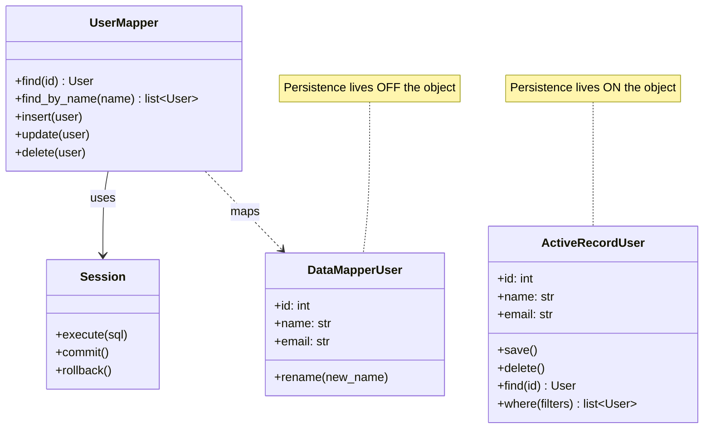
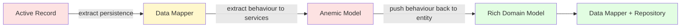
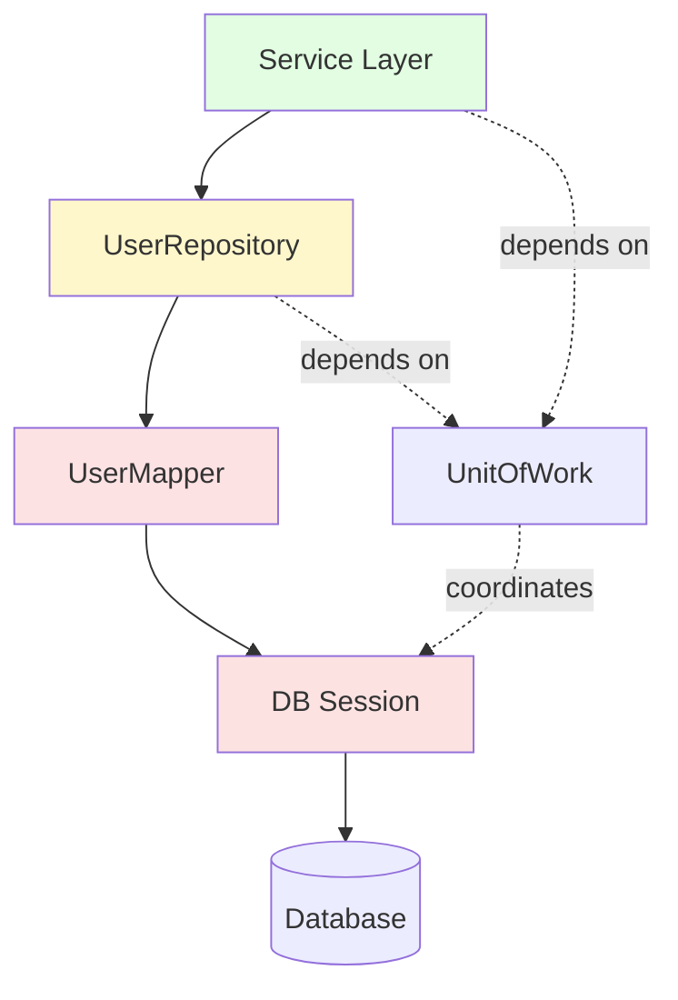
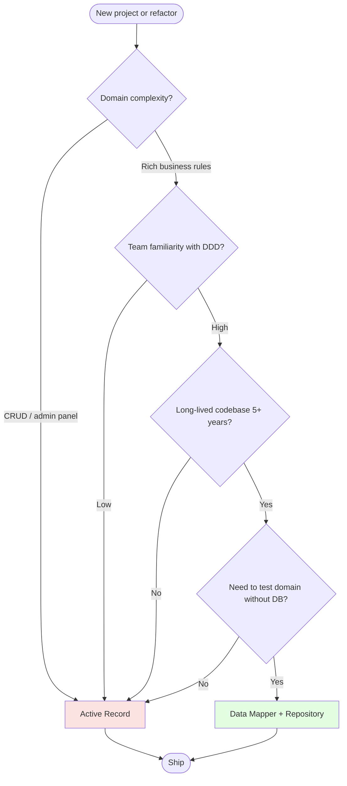

# Active Record vs. Data Mapper — Two ORM Patterns Compared

#oop #architecture #enterprise-patterns #active-record #data-mapper #orm #persistence #repository-pattern #teaching #deep-dive

> [!quote] Martin Fowler, PoEAA
> "The crux of the Active Record pattern is that the object that wraps a row in a table or view, encapsulates the database access, and adds domain logic on that data. The Data Mapper… moves the data between objects and a database, keeping them independent of each other and the mapper itself."

Object-relational mapping (ORM) is the art of pretending that rows in a relational database are objects in your program. It is one of the oldest problems in enterprise software, and it has two dominant answers, both named by Martin Fowler in *Patterns of Enterprise Application Architecture* (2002):

- **Active Record**: an object that *is* a row and knows how to save itself. `user.save()`.
- **Data Mapper**: a separate object that moves data between a domain object and a database. `mapper.save(user)`.

The choice between them feels small — a syntactic preference — but it cascades into every corner of the codebase: how you test, how you layer, how you scale, and how much you can lean on pure OOP. Django and Rails bet on Active Record; SQLAlchemy (classic mode), Hibernate, and Doctrine bet on Data Mapper. Both bets paid off, which tells you the question has no universally right answer — only right answers for particular situations.

This note covers both patterns, their trade-offs, the relationship to the [[Repository-Pattern]], and how to decide between them for a given project.

Prerequisite reading: [[Repository-Pattern]], [[Unit-Of-Work]], [[Domain-Driven-Design]], [[Single-Responsibility]], [[Encapsulation]].

---

## 1. The Problem Both Patterns Solve

Without an ORM, persisting a `User` to a database looks like this:

```python
from typing import Self
from typing_extensions import override
import sqlite3

class User:
    def __init__(self, id, name, email):
        self.id = id
        self.name = name
        self.email = email

def save_user(conn, user):
    conn.execute(
        "INSERT INTO users (id, name, email) VALUES (?, ?, ?)",
        (user.id, user.name, user.email),
    )
    conn.commit()

def load_user(conn, user_id):
    row = conn.execute(
        "SELECT id, name, email FROM users WHERE id = ?", (user_id,)
    ).fetchone()
    return User(*row) if row else None
```

Every domain class needs hand-written `save`, `load`, `update`, `delete` functions, plus SQL string management, type conversions, and connection handling. After the fifth class, this becomes tedious; after the fiftieth, it becomes a maintenance nightmare.

ORMs exist to automate this. The two patterns differ in *where* the automation lives.

---

## 2. Active Record — The Object Saves Itself

In Active Record, the domain object **inherits persistence behaviour**. The class is both a domain model and a data-access object. Typically a base class provides `save`, `delete`, `find`, `where`, etc., and subclasses declare the columns.

```python
# A simplified Django-style Active Record
class ActiveRecord:
    _table: str = ""
    _columns: list[str] = []

    @classmethod
    def _conn(cls):
        return ACTIVE_RECORD_CONNECTION  # global, set at startup

    @classmethod
    def find(cls, id):
        row = cls._conn().execute(
            f"SELECT {', '.join(cls._columns)} FROM {cls._table} WHERE id = ?",
            (id,),
        ).fetchone()
        return cls(*row) if row else None

    @classmethod
    def where(cls, **filters):
        clauses = " AND ".join(f"{k} = ?" for k in filters)
        rows = cls._conn().execute(
            f"SELECT {', '.join(cls._columns)} FROM {cls._table} WHERE {clauses}",
            tuple(filters.values()),
        ).fetchall()
        return [cls(*row) for row in rows]

    @override
    def save(self):
        placeholders = ", ".join("?" for _ in self._columns)
        cols = ", ".join(self._columns)
        self._conn().execute(
            f"INSERT OR REPLACE INTO {self._table} ({cols}) VALUES ({placeholders})",
            tuple(getattr(self, c) for c in self._columns),
        )
        self._conn().commit()

    @override
    def delete(self):
        self._conn().execute(
            f"DELETE FROM {self._table} WHERE id = ?", (self.id,)
        )
        self._conn().commit()


class User(ActiveRecord):
    _table = "users"
    _columns = ["id", "name", "email"]

    def __init__(self, id, name, email):
        self.id = id
        self.name = name
        self.email = email


# Usage — straightforward, no separate mapper
user = User(1, "Alice", "alice@example.com")
user.save()
loaded = User.find(1)
print(loaded.name)  # Alice
admins = User.where(name="Alice")
```

`User` is *one* class doing two jobs: representing a user (domain) and persisting itself (data access). The dual role is what makes Active Record so concise and so controversial.

### 2.1 Real-world Active Record

- **Ruby on Rails ActiveRecord** — the pattern's namesake and most famous implementation.
- **Django ORM** — Python's most popular Active Record. Models inherit from `django.db.models.Model`; `user.save()` writes to the DB; `User.objects.filter(...)` queries.
- **Eloquent** (Laravel, PHP) — `class User extends Model`.
- **SQLAlchemy declarative** (in its "classic" usage with `Base.query`) — partially.

### 2.2 Why Active Record is so popular

The appeal is obvious: minimal code, minimal concepts. A beginner reads `User.objects.filter(name="Alice")` and understands it. There is no mapper to inject, no repository to wrap, no separate layer to learn. For a CRUD app with a thin domain, Active Record is the right amount of machinery.

---

## 3. Data Mapper — A Separate Object Handles Persistence

In Data Mapper, the domain object is **plain** — no persistence methods, no base class, no awareness of the database. A separate **mapper** object moves data between the domain object and the database.

```python
# The domain object is pure
class User:
    def __init__(self, id, name, email):
        self.id = id
        self.name = name
        self.email = email

    @override
    def rename(self, new_name: str) -> Self:
        if not new_name:
            raise ValueError("Name cannot be empty")
        self.name = new_name


# A mapper knows how to load and save Users
class UserMapper:
    def __init__(self, session):
        self._session = session

    @override
    def find(self, id: int) -> User | None:
        row = self._session.execute(
            "SELECT id, name, email FROM users WHERE id = ?", (id,)
        ).fetchone()
        return User(*row) if row else None

    @override
    def find_by_name(self, name: str) -> list[User]:
        rows = self._session.execute(
            "SELECT id, name, email FROM users WHERE name = ?", (name,)
        ).fetchall()
        return [User(*r) for r in rows]

    @override
    def insert(self, user: User) -> Self:
        self._session.execute(
            "INSERT INTO users (id, name, email) VALUES (?, ?, ?)",
            (user.id, user.name, user.email),
        )

    @override
    def update(self, user: User) -> Self:
        self._session.execute(
            "UPDATE users SET name = ?, email = ? WHERE id = ?",
            (user.name, user.email, user.id),
        )

    @override
    def delete(self, user: User) -> Self:
        self._session.execute(
            "DELETE FROM users WHERE id = ?", (user.id,)
        )


# Usage — explicit, requires injecting the mapper
session = create_session()
mapper = UserMapper(session)
user = User(1, "Alice", "alice@example.com")
mapper.insert(user)
loaded = mapper.find(1)
loaded.rename("Alicia")
mapper.update(loaded)
session.commit()
```

Notice `User` has no `.save()`, no `.objects` manager, no knowledge of SQL. It is a plain Python class — you could use it in a script that has no database at all. All persistence knowledge has been moved *out* of the domain object and *into* the mapper.

### 3.1 Real-world Data Mapper

- **SQLAlchemy ORM (classic)** — `mapper(User, users_table)` was the original API; the modern `declarative_base()` blurs the line but the architecture is still Data Mapper with a registry.
- **Hibernate / JPA (Java)** — entities are POJOs; the `EntityManager` is the mapper.
- **Doctrine ORM (PHP)** — entities are plain PHP objects; `EntityManagerInterface` persists them.
- **peewee** — actually Active Record (despite the name).

### 3.2 Why Data Mapper is loved by domain-modelling purists

The domain object is *free*. It can encode business rules (e.g., `rename` validates), be tested without a database, be reused in contexts that have nothing to do with persistence. The mapper can be swapped, mocked, or replaced without touching the domain. For a complex domain ([[Domain-Driven-Design]] territory), this separation is gold.

---

## 4. Side-by-Side Comparison



| Aspect | Active Record | Data Mapper |
|---|---|---|
| Where persistence lives | On the domain object | In a separate mapper object |
| Coupling to DB | Tight (object knows table/columns) | Loose (object is DB-agnostic) |
| Lines of code per entity | Few | More |
| Concept count | One (the model) | Two (entity + mapper) |
| Testability without DB | Hard | Easy |
| Purity of domain model | Mixed with persistence | Pure |
| Beginner friendliness | High | Medium |
| Best fit | CRUD, simple domains | Complex domains, DDD |
| Famous implementations | Rails AR, Django ORM, Eloquent | SQLAlchemy, Hibernate, Doctrine |

---

## 5. The Same User in Both Styles

To make the difference concrete, here is a `User` with a small amount of business logic (rename validation, email normalization) implemented both ways.

### 5.1 Active Record version

```python
# Django-style
from django.db import models

class User(models.Model):
    name = models.CharField(max_length=100)
    email = models.EmailField()
    created_at = models.DateTimeField(auto_now_add=True)

    @override
    def rename(self, new_name: str) -> Self:
        if not new_name.strip():
            raise ValueError("Name cannot be empty")
        self.name = new_name.strip()
        self.save()  # implicit persistence

    @override
    def set_email(self, new_email: str) -> Self:
        normalized = new_email.lower().strip()
        if "@" not in normalized:
            raise ValueError("Invalid email")
        self.email = normalized
        self.save()


# Usage
user = User(name="Alice", email="ALICE@Example.COM")
user.save()
user.rename("Alicia")          # also persists
user.set_email("alicia@x.com") # also persists
```

The good news: 12 lines, persistence "just works". The bad news: `User` inherits from `models.Model`, so it cannot exist without Django. Testing `rename` without a database requires the entire Django ORM machinery, including a test database.

### 5.2 Data Mapper version

```python
# Pure domain object — no framework imports
class User:
    def __init__(self, id, name, email, created_at=None):
        self.id = id
        self.name = name
        self.email = email
        self.created_at = created_at

    @override
    def rename(self, new_name: str) -> Self:
        if not new_name.strip():
            raise ValueError("Name cannot be empty")
        self.name = new_name.strip()

    @override
    def set_email(self, new_email: str) -> Self:
        normalized = new_email.lower().strip()
        if "@" not in normalized:
            raise ValueError("Invalid email")
        self.email = normalized


# Mapper — knows SQL, knows the table, knows nothing about business rules
class UserMapper:
    def __init__(self, session):
        self._s = session

    @override
    def insert(self, user: User) -> Self:
        self._s.execute(
            "INSERT INTO users (id, name, email) VALUES (?, ?, ?)",
            (user.id, user.name, user.email),
        )

    @override
    def get(self, id: int) -> User | None:
        row = self._s.execute(
            "SELECT id, name, email FROM users WHERE id = ?", (id,)
        ).fetchone()
        return User(*row) if row else None

    @override
    def update(self, user: User) -> Self:
        self._s.execute(
            "UPDATE users SET name = ?, email = ? WHERE id = ?",
            (user.name, user.email, user.id),
        )


# Usage — domain changes and persistence are separate steps
session = create_session()
mapper = UserMapper(session)

user = User(id=1, name="Alice", email="ALICE@Example.COM")
mapper.insert(user)
user.rename("Alicia")           # no DB hit
user.set_email("alicia@x.com")  # no DB hit
mapper.update(user)             # one explicit write
session.commit()
```

The good news: `User` is pure Python. It can be imported into a notebook, a CLI tool, a test — anywhere. The mapper is a separate object with a clear job. The bad news: more classes, more code, more concepts for the team to learn.

> [!tip] Teaching Tip
> Have students implement the same simple CRUD app twice — once in Django, once in raw Python with a mapper. Ask them which they preferred and *why*. The answer is usually "Django, because less code" — until you ask them to test the rename logic in isolation. Then they discover the trade-off.

---

## 6. Pros and Cons

### 6.1 Active Record

**Pros**:
- **Less code**. No mapper class, no session management — just `user.save()`.
- **Beginner-friendly**. One concept (the model) covers both domain and persistence.
- **Conventional**. The patterns are so well-established that a new developer on a Rails team knows where to look.
- **Tooling**. Migrations, admin panels, scaffolding are all built around the Active Record assumption.

**Cons**:
- **Violates SRP** (see [[Single-Responsibility]]). The model has two responsibilities: domain logic and persistence. As the domain grows, this becomes painful.
- **Hard to test without a DB**. Tests that touch the model either hit a real database or require extensive mocking.
- **Tight coupling**. The domain logic is bound to the framework. Migrating from Django to FastAPI+SQLAlchemy means rewriting every model.
- **Encourages fat models**. Because persistence is on the model, developers tend to pile business logic on it too. Models balloon into 5000-line god objects.
- **Hides the "save"**. Implicit persistence (`user.rename("x")` calls `save()` under the hood) can surprise callers who didn't expect a DB write.

### 6.2 Data Mapper

**Pros**:
- **Pure domain**. The entity is plain Python; business rules can be tested in milliseconds with no DB.
- **Framework independence**. Switching ORMs (or going ORM-free) touches the mapper, not the domain.
- **Explicit persistence**. Writes are visible: `mapper.update(user)` is a line in the code. No hidden DB calls.
- **Composable**. Multiple mappers can work on the same domain object (e.g., one for SQL, one for Elasticsearch). The domain doesn't know.
- **Better fit for DDD**. Aggregates, value objects, and repositories (see [[Domain-Driven-Design]], [[Repository-Pattern]]) all assume a pure domain.

**Cons**:
- **More code**. Every entity needs an entity class *and* a mapper.
- **More concepts**. The team needs to understand the entity/mapper/session distinction. Onboarding takes longer.
- **Boilerplate**. Mapping fields back and forth is tedious; the temptation to reach for code generation is real.
- **Risk of anemic models**. See §8 below.

> [!warning] Common Student Misconception
> "Active Record is bad because it violates SRP." — That's the textbook critique, but it overstates the case. For a CRUD app where the model *is* a row, the two responsibilities (domain logic + persistence) are essentially the same. SRP is about *reasons to change*; in a CRUD app, the model has one reason to change (the data shape). For a complex domain, SRP matters more. The principle doesn't change; the applicability does.

---

## 7. The Anemic Domain Model Trap

The dark side of Data Mapper is the **anemic domain model**: entities that are just bags of getters and setters, with all the business logic in services. This is technically a Data Mapper setup, but it has thrown away OOP's main benefit — encapsulation of behaviour.

```python
# Anemic — data and behaviour are separated
class User:  # just data
    def __init__(self, id, name, email):
        self.id = id
        self.name = name
        self.email = email

class UserService:  # behaviour lives here
    @staticmethod
    def rename(user, new_name):
        if not new_name.strip():
            raise ValueError("Empty name")
        user.name = new_name.strip()

    @staticmethod
    def set_email(user, new_email):
        ...
```

This is procedural programming dressed up in classes. The `User` is a struct; the `UserService` is a module of functions. There is nothing wrong with procedural programming, but if you've chosen OOP and Data Mapper to *encapsulate* behaviour, anemia defeats the purpose.

The cure: put behaviour on the entity. `User.rename` is a method, not a `UserService.rename(user, ...)` function. The mapper only moves data; the entity owns the rules.



> [!warning] Common Student Misconception
> "If we use Data Mapper, our domain model is automatically rich." — No. Data Mapper makes a rich domain *possible*; it doesn't make it *inevitable*. Many teams adopt Data Mapper and end up with anemic entities plus god services. The richness of the model is a separate discipline, enforced by code review and design conversations, not by the ORM choice.

---

## 8. Data Mapper + Repository

In production, the Data Mapper is rarely exposed directly to the service layer. Instead, the service depends on a **Repository**, which is a collection-like interface that hides the mapper (and possibly the session) behind a domain-friendly API.

```python
class UserRepository:
    """Repository wraps the mapper and exposes domain-style operations."""
    def __init__(self, mapper: UserMapper, uow: UnitOfWork):
        self._m = mapper
        self._uow = uow

    @override
    def get(self, id: int) -> User | None:
        return self._m.get(id)

    @override
    def add(self, user: User) -> Self:
        self._uow.register_new(user)
        # Or: self._m.insert(user) if you bypass UoW

    @override
    def find_by_email(self, email: str) -> User | None:
        # The mapper doesn't have this method; we extend it here.
        ...
```

The layered picture:



Service → Repository → Mapper → Session → DB. Each layer has one job. The service doesn't know there's a mapper; the mapper doesn't know there's a repository; the domain object (`User`) doesn't know there's a session.

> [!info] Why not skip the Repository?
> If you have a mapper, why add a repository on top? Because the repository gives you a domain-shaped interface (`users.with_email("x")`) instead of a persistence-shaped one (`mapper.find_by_email("x")`). When the requirements change ("now find users whose email was verified in the last 7 days"), the repository method's name evolves with the domain; the mapper stays primitive. See [[Repository-Pattern]] for the full argument.

---

## 9. When to Choose Which — A Decision Tree



Heuristics:

- **Start with Active Record** if the domain is simple, the team is small, and time-to-market matters. The 80% case.
- **Choose Data Mapper** if the domain is complex, the codebase is long-lived, testing matters more than speed of feature delivery, and the team can absorb the conceptual overhead.
- **Avoid switching mid-project.** The cost of migrating from Active Record to Data Mapper (or vice versa) is enormous. Make the decision early.

---

## 10. The Hybrid: Modern SQLAlchemy

SQLAlchemy's modern `declarative_base()` (and SQLAlchemy 2.0's `Mapped`/`mapped_column`) is interesting because it *looks* like Active Record but is architecturally Data Mapper.

```python
from sqlalchemy.orm import DeclarativeBase, Mapped, mapped_column, Session

class Base(DeclarativeBase): pass

class User(Base):
    __tablename__ = "users"
    id: Mapped[int] = mapped_column(primary_key=True)
    name: Mapped[str]
    email: Mapped[str]

    @override
    def rename(self, new_name: str) -> Self:
        if not new_name.strip():
            raise ValueError("Empty name")
        self.name = new_name.strip()


# Persistence is via the Session, NOT via User.save()
with Session(engine) as session:
    user = User(name="Alice", email="alice@x.com")
    session.add(user)
    session.commit()
    # The user object has no .save() method — Data Mapper style.
```

`User` *looks* like a Django model (columns declared on the class), but persistence is via `session.add(user)` and `session.commit()` — Data Mapper style. The columns are configuration metadata for the mapper, not persistence methods on the object.

This hybrid is increasingly common: it gives the brevity of Active Record for declaring the mapping while preserving the testability and decoupling of Data Mapper.

> [!tip] Teaching Tip
> Show students Django and SQLAlchemy side-by-side with the same model. They look almost identical. Then ask: "Where is `save()`?" In Django, it's `user.save()`. In SQLAlchemy, it's `session.add(user); session.commit()`. That tiny difference is the entire pattern distinction.

---

## 11. Testability — The Decisive Factor

The strongest argument for Data Mapper is testability. Consider testing `User.rename`:

### 11.1 Active Record test (Django)

```python
from django.test import TestCase
from myapp.models import User

class UserTest(TestCase):
    @override
    def test_rename_validates(self):
        user = User(name="Alice", email="a@x.com")
        user.save()                     # hits the test DB
        with self.assertRaises(ValueError):
            user.rename("")             # also hits the DB
        user.refresh_from_db()          # another DB hit
        self.assertEqual(user.name, "Alice")
```

Every test runs against a (test) database. Setup is slow. Test isolation requires transactional fixtures. The test of a 3-line method takes 50 ms, mostly DB I/O.

### 11.2 Data Mapper test (pure Python)

```python
def test_rename_validates():
    user = User(id=1, name="Alice", email="a@x.com")
    with pytest.raises(ValueError):
        user.rename("")
    assert user.name == "Alice"
```

No DB. No fixtures. 0.1 ms. The test is honest about what it's testing — the rename logic — and nothing else.

For a system with hundreds of business rules, the difference is enormous. Active Record tests are integration tests by default; Data Mapper tests can be unit tests by default. (You still write integration tests; you just write *fewer* of them.)

---

## 12. Pitfalls Specific to Each Pattern

### 12.1 Active Record pitfalls

- **Fat models**: business logic piles onto the model because that's where the data lives. Cure: extract service objects for non-trivial operations.
- **Hidden writes**: methods like `rename` that internally call `save()` surprise callers who didn't expect a DB hit. Cure: separate "compute the new state" from "persist it" — even within Active Record.
- **Cross-model queries in models**: `User.find_active_in_region(r)` reaches across models and couples them. Cure: keep queries scoped to the model's own table; do cross-model logic in services.
- **Global state**: Django's `User.objects` is a class-level attribute, effectively a global. Tests must be careful about test-order dependencies.

### 12.2 Data Mapper pitfalls

- **Anemic models**: see §7. The most common failure mode.
- **Mapper duplication**: every entity needs a mapper; the boilerplate adds up. Cure: a generic `Mapper[T]` or code generation; or use an ORM that provides the mapper for you.
- **Session threading**: passing the session through every call is awkward. Cure: a request-scoped session (Flask's `g`, FastAPI's dependency injection) or a Unit of Work context manager.
- **Premature abstraction**: small teams adopt Data Mapper + Repository + UnitOfWork for a CRUD app and end up with 5 layers of indirection for 5 simple tables. Cure: match the architecture to the problem.

---

## 13. A Note on Performance

A common worry: "Doesn't Data Mapper add overhead vs. Active Record?"

In practice, the overhead is negligible. Both patterns ultimately execute the same SQL. The Data Mapper's indirection is one extra method call per query — invisible next to network and DB time. The real performance differences come from:

- **N+1 queries** — a problem in both patterns; solved by eager loading (`select_related` in Django, `selectinload` in SQLAlchemy).
- **Change tracking overhead** — both patterns track dirty objects; the cost is similar.
- **Connection pooling** — orthogonal to the pattern; depends on the ORM's configuration.

Choose the pattern for design reasons, not performance reasons. Premature optimization at the ORM layer is rarely productive.

---

## 14. Real-World Migration Stories

Many teams start with Active Record (because of the framework's default) and consider migrating to Data Mapper as the domain grows. The migration is rarely painless:

- **Django → SQLAlchemy** means rewriting every model, every query, every admin. Usually not worth it; better to extract a separate bounded context (see [[Domain-Driven-Design]]) with its own stack.
- **Active Record with extracted services** is a middle path: keep the persistence on the model, but move business logic to service objects that operate on the model. This buys some testability without a full rewrite.
- **The "modular monolith"** approach: use Active Record for the boring CRUD parts and Data Mapper for the complex bounded contexts, in the same codebase. Pragmatic and increasingly common.

---

## 15. Summary

| Question | Answer |
|---|---|
| What is Active Record? | An object that wraps a row and knows how to save itself (`user.save()`). |
| What is Data Mapper? | A separate object that moves data between a domain object and the DB (`mapper.save(user)`). |
| Which is more OOP-pure? | Data Mapper — the domain object stays free of persistence concerns. |
| Which is more productive for CRUD? | Active Record — fewer concepts, less code. |
| Does Active Record violate SRP? | Yes, but the violation is harmless in CRUD apps and painful in complex domains. |
| Can Data Mapper lead to anemic models? | Yes — easily. Disciplined design is required to keep behaviour on the entity. |
| Do modern ORMs fit cleanly into one camp? | Not always. SQLAlchemy 2.0 is Data Mapper with Active Record-like syntax. |
| Should I add a Repository on top of Data Mapper? | Usually yes — it gives a domain-shaped interface and decouples services from the ORM. |
| Should I switch from one to the other mid-project? | Almost never. Migrate bounded contexts, not the whole app. |

Active Record and Data Mapper are not competing for the title of "right" — they are tools for different jobs. The mature engineer knows both, recognizes when each is appropriate, and resists the temptation to apply a single pattern universally.

> [!quote] Martin Fowler
> "Active Record is a reasonable choice for a simple application where the domain logic is minimal. For more complex domain logic, Data Mapper is the better choice — but be prepared to invest in the discipline needed to keep the domain model rich."

Continue with [[Unit-Of-Work]] for how either pattern handles transactions, and with [[Repository-Pattern]] for the layer that typically wraps Data Mapper.

---

## See Also

- [[Unit-Of-Work]] — both Active Record and Data Mapper typically include a UoW under the hood.
- [[Repository-Pattern]] — the layer that wraps Data Mapper to give a domain-shaped interface.
- [[Domain-Driven-Design]] — the methodology that argues for Data Mapper + Repository.
- [[Service-Layer]] — where Active Record models are often wrapped when they grow too fat.
- [[Single-Responsibility]] — the principle that clarifies *why* Active Record's dual role is sometimes a problem.
- [[Encapsulation]] — the OOP pillar that Data Mapper protects more carefully.
