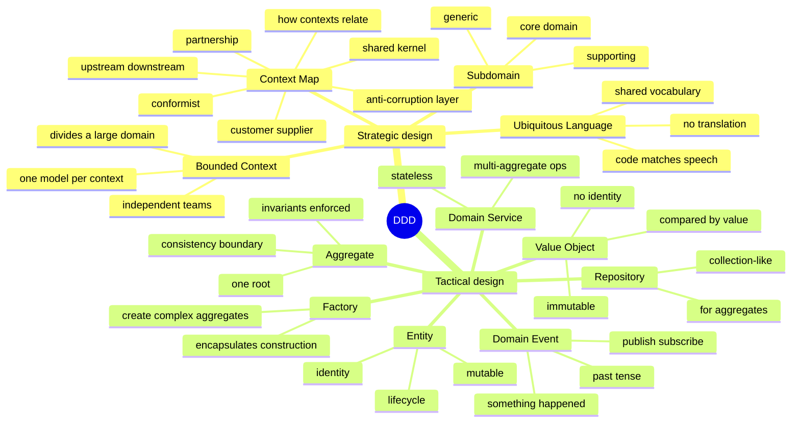
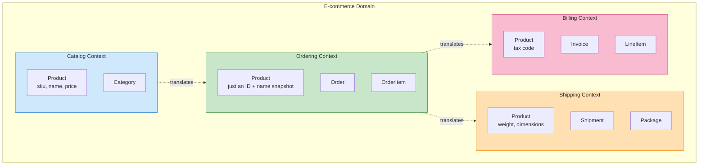
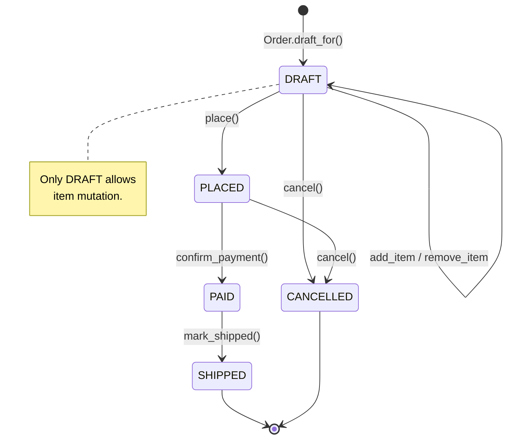

# Domain-Driven Design (DDD) — Modelling Complex Business Domains

#oop #architecture #ddd #domain-model #aggregate #value-object #entity #bounded-context #ubiquitous-language #teaching #deep-dive #refactoring

> [!quote] Eric Evans, 2003
> "Domain-Driven Design is an approach to software development that tackles complexity in the heart of software by connecting the implementation to an evolving model of the core business domain."

Most architectural patterns are about *technology*: how to talk to a database, how to handle an HTTP request, how to layer services. **Domain-Driven Design is about *the business*.** Its central claim is that the source of complexity in serious software is not the framework, the database, or the network — it is the business domain itself, and the only durable way to manage that complexity is to make the **code** match the **mental model** the business experts carry in their heads.

This note covers DDD's strategic design (Bounded Contexts, Ubiquitous Language, Context Maps) and tactical design (Entity, Value Object, Aggregate, Repository, Domain Service, Domain Event, Factory), complete with **step-by-step refactoring walkthroughs** moving from traditional data-centric approaches to rich, behavior-driven DDD paradigms.

Prerequisite reading: [[Encapsulation]], [[Abstraction]], [[Composition-Over-Inheritance]], [[Repository-Pattern]], [[Service-Layer]].

---

## 1. What Is DDD?

DDD is a methodology introduced by **Eric Evans** in his 2003 book *Domain-Driven Design: Tackling Complexity in the Heart of Software*. It has two halves:

- **Strategic design** — how to think about a large domain at the level of *teams*, *models*, and *boundaries*. Used by everyone — architects, product owners, business analysts.
- **Tactical design** — how to write the actual code. The building blocks: Entity, Value Object, Aggregate, Repository, Domain Service, Domain Event, Factory. Used by developers.

The two halves reinforce each other. Strategic design without tactical design produces slide decks; tactical design without strategic design produces a giant pile of entangled entities that *should* have been three bounded contexts.



---

## 2. Strategic Design

### 2.1 The Problem: One Model for Everything

Naïve teams try to build a single, unified model of the entire business. A `User` is the same in Marketing, Billing, and Security, right? It isn't. To Marketing, a User has preferences, segments, and consent flags. To Billing, a User is a customer with a payment method, invoices, and tax residency. To Security, a User is an identity with credentials, MFA, sessions, and audit logs. Forcing these into one class produces a God Object — and worse, every change for Marketing risks breaking Billing.

### 2.2 Bounded Contexts

A **Bounded Context** is a boundary within which a particular model is defined and applicable. Inside the Billing context, `Customer` means "the entity that owes us money". Inside the Marketing context, `Subscriber` means "the entity we can email". They might be backed by the same row in a `users` table — that's an integration concern — but conceptually they are different models with different rules.



### 2.3 Ubiquitous Language

Within a Bounded Context, **developers and domain experts use the same words** — in conversation, in documentation, and in code. If the expert says "When a cart is abandoned for over 30 minutes, release the reserved stock", the code says `Cart.abandon()` and `StockReservation.release()`. There is no translation step.

Symptoms of a broken ubiquitous language:
- Class names like `UserRecord`, `AccountInfo`, `CustomerData` — these are *database-shaped*, not domain-shaped.
- Code says `if user.status == 2` — a magic number, not a domain concept.
- Experts say "subscriber" but code says `User` — there's a translation step, and the model is already drifting.

### 2.4 Context Maps

A **Context Map** describes how Bounded Contexts relate. The common relationships:

| Relationship | Meaning |
|---|---|
| **Partnership** | Two contexts cooperate; teams synchronise. |
| **Shared Kernel** | Two contexts share a small, explicitly-agreed subset of model. Fragile; minimise. |
| **Customer-Supplier** | Upstream serves downstream; downstream's needs influence upstream priorities. |
| **Conformist** | Upstream is unmotivated to help; downstream conforms to upstream's model as-is. |
| **Anti-Corruption Layer (ACL)** | Downstream context builds a translation layer to protect itself from upstream's model. |
| **Open Host Service** | One context exposes a protocol/API for many downstream consumers. |

### 2.5 Subdomains

- **Core domain**: the thing that makes your business money. This is where DDD investment pays off most.
- **Supporting domain**: necessary but not differentiating (e.g., inventory for an e-commerce site). Model it well, but don't over-engineer.
- **Generic domain**: everyone needs it (auth, billing, email). Buy it or use a library; don't build it.

---

## 3. Tactical Design — The Building Blocks

### 3.1 Value Object

A **Value Object** has *no identity*. It is defined entirely by its attributes. Two `Money(10, "USD")` instances are interchangeable. Value Objects are **immutable** — to "change" a Money, you create a new one.

#### Refactoring Walkthrough 1: Overcoming Primitive Obsession
**Step 1: The Problem (Primitive Obsession)**
A method signature takes several primitive types, and rules are scattered.
```python
from typing import Self
from typing_extensions import override
def transfer_funds(source_account, target_account, amount: float, currency: str):
    if amount < 0:
        raise ValueError("Cannot transfer negative amounts")
    # What if source and target have different currencies? We have to scatter checks everywhere.
```

**Step 2: Create a Value Object**
Encapsulate the state and behaviors (rules) inside an immutable object.
```python
from dataclasses import dataclass
from decimal import Decimal

@dataclass(frozen=True)
class Money:
    amount: Decimal
    currency: str

    @override
    def __post_init__(self):
        if self.currency not in {"USD", "EUR", "GBP", "JPY"}:
            raise ValueError(f"unsupported currency: {self.currency}")
        if self.amount < 0:
            raise ValueError("money cannot be negative in this domain")

    @override
    def add(self, other: "Money") -> Self:
        self._require_same_currency(other)
        return Money(self.amount + other.amount, self.currency)

    @override
    def _require_same_currency(self, other: "Money") -> Self:
        if self.currency != other.currency:
            raise ValueError(f"currency mismatch: {self.currency} vs {other.currency}")
```

**Step 3: Update the consumers**
```python
def transfer_funds(source: Account, target: Account, amount: Money):
    # Validation is inherently satisfied by the Money object!
    source.withdraw(amount)
    target.deposit(amount)
```

### 3.2 Entity

An **Entity** has *identity*. Two `User` objects with the same `id` are the same user. Entities are mutable and have a lifecycle: created, modified, archived.

```python
from dataclasses import dataclass

@dataclass
class OrderItem:
    """An OrderItem is an Entity *inside* the Order aggregate.
    It has its own id, but is never loaded independently — only through the Order.
    """
    id: int
    product_id: int
    product_name: str
    unit_price: Money
    quantity: int

    @override
    def increase_quantity(self, by: int) -> Self:
        if by <= 0:
            raise ValueError("must increase by positive amount")
        self.quantity += by
```

### 3.3 Value Object vs Entity — A Decision Rule

| Aspect | Value Object | Entity |
|---|---|---|
| Identity | None | Yes, stable |
| Mutability | Immutable | Mutable |
| Equality | By attributes | By identity |
| Lifecycle | None | Created, modified, deleted |
| Examples | Money, Address, DateRange | User, Order, Invoice, Product |

---

## 4. Aggregates & Step-by-Step Refactoring: Anemic to Rich Models

An **Aggregate** is a *cluster* of related Entities and Value Objects treated as a single unit for data changes. It has a single entry point called the **Aggregate Root**. External code may only hold references to the root, never to internal entities.

### Refactoring Walkthrough 2: Designing an Aggregate (Anemic to Rich)

The **Anemic Domain Model** is the anti-pattern DDD fights most. In an anemic model, Entities are bags of getters/setters and all behavior is pushed into Application Services.

#### Step 1: The Anemic State
Here is our initial Order entity, acting strictly as a data-holder:
```python
# ANEMIC — anti-pattern
@dataclass
class Order:
    id: int
    customer_id: int
    items: list = field(default_factory=list)
    status: str = "draft"
    total: float = 0.0

class OrderService:
    @override
    def add_item_to_order(self, order_id: int, product_id: int, qty: int, price: float):
        order = db.get_order(order_id)
        
        # Rule 1: Can only edit draft orders
        if order.status != "draft":
            raise ValueError("Cannot modify")
            
        # Rule 2: Order size limit
        if len(order.items) >= 50:
            raise ValueError("Too many items")
            
        # Manually updating state from the outside
        order.items.append({"product_id": product_id, "qty": qty, "price": price})
        order.total += (qty * price)
        db.save(order)
```
*Problem:* The logic (`status == "draft"`, max `50` items) lives in the service. Another service (like `APIOrderUpdateService` or a batch processor) might forget to check if the status is "draft", leading to data corruption and invariant violations.

#### Step 2: Push Behavior into the Aggregate Root (Rich Model)
We shift the rules directly into the `Order` class. The `Order` protects its own invariants.
```python
from enum import Enum
from datetime import datetime, timezone
import uuid

class OrderStatus(Enum):
    DRAFT = "draft"
    PLACED = "placed"
    PAID = "paid"
    SHIPPED = "shipped"

@dataclass
class Order:
    id: OrderId
    customer_id: int
    items: list[OrderItem] = field(default_factory=list)
    status: OrderStatus = OrderStatus.DRAFT
    total: Money = field(default_factory=lambda: Money(Decimal("0"), "USD"))

    # Behavior moved INSIDE the aggregate
    @override
    def add_item(self, product_id: int, name: str, price: Money, qty: int) -> Self:
        if self.status != OrderStatus.DRAFT:
            raise ValueError(f"cannot modify order in status {self.status}")
        if qty <= 0:
            raise ValueError("quantity must be positive")
        if len(self.items) >= 50:
            raise ValueError("order cannot exceed 50 distinct items")

        item = OrderItem(id=len(self.items)+1, product_id=product_id, product_name=name, unit_price=price, quantity=qty)
        self.items.append(item)
        self._recalculate_total()
        return item
        
    @override
    def _recalculate_total(self) -> Self:
        total = Money(Decimal("0"), "USD")
        for item in self.items:
            total = total.add(item.unit_price.multiply(Decimal(item.quantity)))
        self.total = total
```

#### Step 3: Clean up the Service Layer
Now the Service layer merely coordinates and delegates to the Aggregate Root, while the Domain models dictate the rules.
```python
class OrderService:
    @override
    def add_item_to_order(self, order_id: str, product_id: int, qty: int):
        # 1. Fetch
        order = self.repository.get(OrderId(uuid.UUID(order_id)))
        product = self.catalog.get(product_id)
        
        # 2. Mutate via Domain methods (Invariants are safely guarded)
        order.add_item(product.id, product.name, product.price, qty)
        
        # 3. Save
        self.repository.save(order)
```
*Result:* The rules are *impossible* to bypass.

### 4.1 Aggregate Design Rules (Vaughn Vernon)

1. **Design small aggregates.** A 50-entity aggregate is too big. Most aggregates have fewer than 5 internal entities.
2. **Reference other aggregates by identity only.** An `Order` holds a `customer_id`, not a `Customer` object. This avoids giant object graphs.
3. **Update one aggregate per transaction.** If a usecase updates two aggregates, use domain events for eventual consistency rather than spanning a huge transaction lock.

---

## 5. Repositories and Domain Services

### 5.1 Repository (for Aggregates)
A Repository is per-aggregate. There is no `OrderItemRepository`; you load the `Order` and reach into it for items.
```python
from abc import ABC, abstractmethod

class OrderRepository(ABC):
    @abstractmethod
    @override
    def add(self, order: Order) -> Self: ...
    @abstractmethod
    @override
    def get(self, order_id: OrderId) -> Order | None: ...
```

### 5.2 Domain Service
A **Domain Service** is a stateless operation spanning multiple aggregates where rules don't naturally fit one entity.
```python
class FundsTransferService:
    @override
    def transfer(self, source: Account, target: Account, amount: Money) -> Self:
        if source.currency != target.currency:
            raise ValueError("cross-currency transfer requires FX service")
        source.withdraw(amount)    
        target.deposit(amount)     
```

---

## 6. Domain Events

A **Domain Event** states that *something happened in the past*. (e.g. `OrderPlaced`). They are published by aggregates and consumed by subscribers, possibly in other bounded contexts.

#### Refactoring Walkthrough 3: Breaking Cross-Aggregate Transactions

**Step 1: The Problem**
```python
class OrderService:
    @override
    def place_order(self, order_id: str):
        with db.transaction():
            order = db.get_order(order_id)
            order.place()
            db.save(order)
            
            # Reaching into another aggregate in the same transaction! Bad practice in DDD.
            customer = db.get_customer(order.customer_id)
            customer.update_loyalty_points(order.total)
            db.save(customer)
```

**Step 2: Introduce Domain Events**
Aggregate roots record events internally as they mutate state.
```python
@dataclass
class Order:
    # ...
    _events: list[DomainEvent] = field(default_factory=list)

    @override
    def place(self) -> Self:
        self.status = OrderStatus.PLACED
        # Record event
        self._events.append(OrderPlaced(order_id=self.id, total=self.total, customer_id=self.customer_id))
        
    @override
    def collect_events(self) -> list[DomainEvent]:
        events = list(self._events)
        self._events.clear()
        return events
```

**Step 3: Publish & React**
The Application Service publishes them after commit:
```python
class OrderService:
    @override
    def place_order(self, order_id: str):
        with uow:
            order = repository.get(order_id)
            order.place()
            repository.save(order)
            
            # Publishes to an EventBus after successful DB commit
            uow.on_commit(lambda: self.event_bus.publish(order.collect_events()))
```
A separate subscriber (e.g., `CustomerLoyaltyHandler`) listens for `OrderPlaced` and updates the customer points eventually.

---

## 7. State of an Aggregate

A useful diagram for teaching the lifecycle of an `Order`:



---

## 8. When to Use DDD

### 8.1 Use DDD when:
- **The domain is complex and central to the business.** Insurance claims, banking, logistics, healthcare, tax — these are DDD sweet spots. The domain has hundreds of rules, decades of history, and a rich vocabulary.
- **The business model is still evolving.** DDD's emphasis on ubiquitous language and bounded contexts means the code can evolve with the business without becoming a tangle.
- **Multiple teams work on the same broader domain.** Bounded contexts let teams work independently with explicit translation points.
- **You can access domain experts.** DDD only works if you can sit with experts and learn their language.

### 8.2 Do NOT use DDD when:
- **The domain is CRUD.** A blog, a CMS for static pages, a contact form — these have no business rules worth modelling. Use the ORM directly.
- **The domain is generic.** Authentication, email sending, payment processing — buy or use a service. Don't model these yourself.
- **The project is short-lived.** DDD's payoff is over years. For a 3-month throwaway, it's overhead.

---

## 9. Common Pitfalls

1. **The Anaemic Aggregate:** You called it an `Order` aggregate, but every method just mutates a field with no invariant. It's just a struct. Ask the domain expert for the rules ("Can an order have zero items?") and encode each as a check inside a method.
2. **The Giant Aggregate:** Modeling a huge tree (e.g., User with Posts, Friends, Preferences, Orders). Loading a user now fetches 30 tables. Fix: split into `User` (identity), `Profile` (display), `Order` (history) and reference by ID.
3. **Cross-Aggregate Transactions:** Updating multiple aggregates synchronously. The DB might support it; the model shouldn't. Use Domain Events for eventual consistency.
4. **Domain Events Published Before Commit:** If a DB commit fails, subscribers have reacted to ghost data. Use an outbox pattern and publish post-commit.
5. **Repository Per Entity:** Having an `OrderItemRepository`. `OrderItem` is internal to the `Order` aggregate. It should only be accessed through the root `Order`.

---

## 10. Key Takeaways

1. **DDD is about the domain, not the technology.** Use it when the business domain is complex, central, and evolving.
2. **Strategic design**: divide the domain into **Bounded Contexts**, agree on a **Ubiquitous Language** per context.
3. **Tactical design**: has seven building blocks: **Entity, Value Object, Aggregate, Repository, Domain Service, Domain Event, Factory**.
4. **Value Objects** are immutable and compared by value; they are the workhorses of DDD. Replace primitives with them.
5. **Aggregates** are consistency boundaries with a single **root**. External code only holds references to the root.
6. **Anaemic domain models are the anti-pattern** — rules live on entities, not in services.
7. **DDD is overkill** for CRUD apps, generic domains, or short-lived projects.

### 10.1 Further Reading

- Eric Evans, *Domain-Driven Design* (2003) — the source text, dense but essential.
- Vaughn Vernon, *Implementing Domain-Driven Design* (2013) — the practical follow-up; the "three rules of aggregate design" come from here.
- [[Repository-Pattern]] — the persistence side of aggregates.
- [[Service-Layer]] — Application Services vs Domain Services.
- [[Hexagonal-Architecture]] — the architectural envelope that holds a DDD domain.
