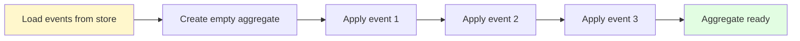
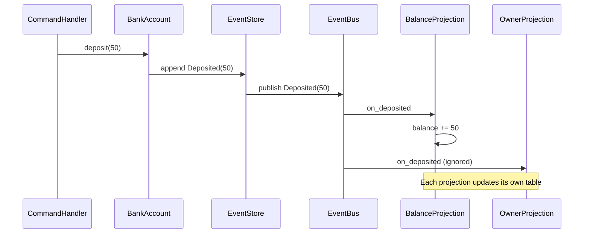
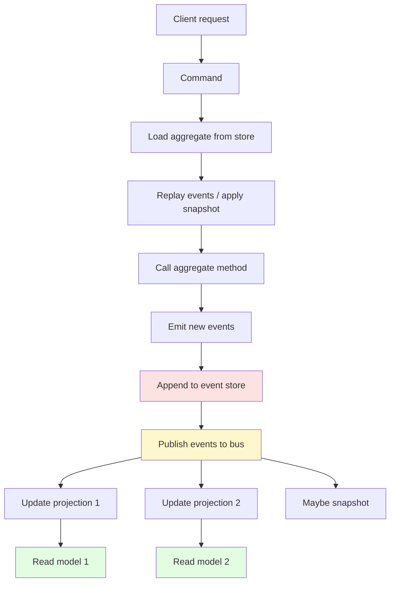
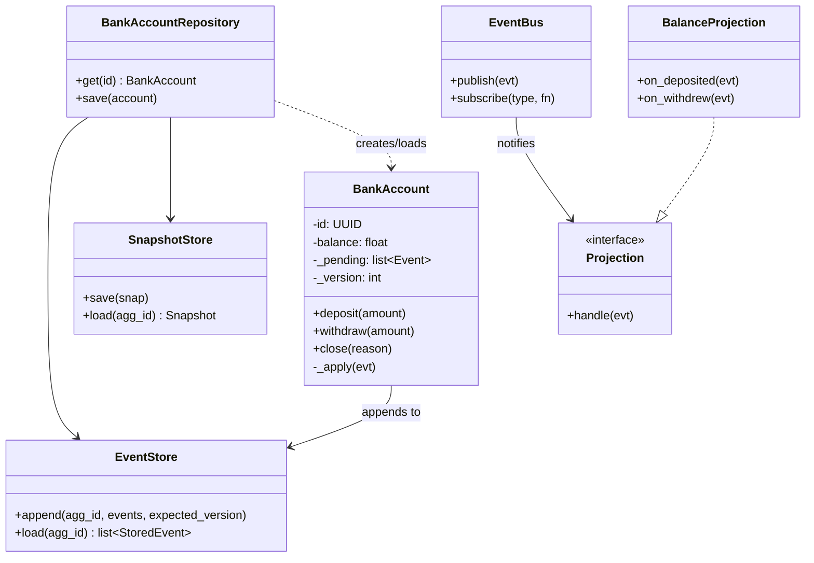

# Event Sourcing — Storing Events Instead of State

#oop #architecture #enterprise-patterns #event-sourcing #cqrs #audit-log #domain-events #immutability #teaching #deep-dive

> [!quote] Martin Fowler, 2005
> "Event Sourcing captures all changes to an application state as a sequence of events. Those events are immutable and can be replayed to reconstruct any past state."

Most applications store **current state**. A bank account is a row in a table with `balance = 100`. When the customer withdraws 30, you overwrite the row: `balance = 70`. The history — the deposit of 150, the earlier withdrawal of 50, the opening deposit of 30 — is gone. The system has amnesia. It knows *what is*, not *how it got here*.

**Event Sourcing (ES)** inverts that choice. Instead of storing the current state, you store the **sequence of events** that produced it. The current state is *derived* by replaying the events. The bank account is not a number; it is the series `AccountOpened(30)`, `Deposited(120)`, `Withdrew(50)` — and from that series, anyone can compute `balance = 100`.

This note explains what event sourcing is, why it is powerful, why it is hard, and how to implement it in Python. It is the natural companion to [[CQRS-Pattern]]: CQRS separates reading from writing; event sourcing decides *what* to write.

Prerequisite reading: [[CQRS-Pattern]], [[Domain-Driven-Design]], [[Repository-Pattern]], [[Unit-Of-Work]].

---

## 1. The Core Idea

A traditional domain object holds state in fields. When you call a method, it mutates those fields and persists them. The new state replaces the old; the old is lost.

```python
# Traditional: state is mutable, history is lost
class BankAccount:
    def __init__(self, balance: float = 0):
        self.balance = balance

    @override
    def deposit(self, amount: float):
        self.balance += amount

    @override
    def withdraw(self, amount: float):
        if amount > self.balance:
            raise InsufficientFunds()
        self.balance -= amount
```

After `deposit(150); withdraw(50)`, the account has `balance = 100`. The two operations are gone.

In event sourcing, methods don't mutate fields. Instead, they **decide** what events should be recorded, append those events to the object's history, and then **apply** the events to update in-memory state. The persisted thing is the event log; the in-memory state is a derived projection of that log.

```python
# Event-sourced: events are the source of truth, state is derived
class BankAccount:
    def __init__(self):
        self._events: list[Event] = []
        self.balance = 0
        self.is_open = False

    @override
    def open(self, initial_deposit: float):
        if self.is_open:
            raise AccountAlreadyOpen()
        self._record(AccountOpened(initial_deposit))

    @override
    def deposit(self, amount: float):
        if not self.is_open:
            raise AccountClosed()
        if amount <= 0:
            raise InvalidAmount()
        self._record(Deposited(amount))

    @override
    def withdraw(self, amount: float):
        if not self.is_open:
            raise AccountClosed()
        if amount > self.balance:
            raise InsufficientFunds()
        self._record(Withdrew(amount))

    @override
    def _record(self, event: Event):
        self._events.append(event)
        self._apply(event)

    @override
    def _apply(self, event: Event):
        # The apply method is what actually changes state.
        if isinstance(event, AccountOpened):
            self.is_open = True
            self.balance = event.initial_deposit
        elif isinstance(event, Deposited):
            self.balance += event.amount
        elif isinstance(event, Withdrew):
            self.balance -= event.amount
```

Notice the **separation** between *deciding* (in the command methods like `deposit`) and *applying* (in `_apply`). The decision logic can refuse an event (`raise InsufficientFunds`); the apply logic just records what happened. This separation is the heart of event sourcing.

---

## 2. Why Event Sourcing?

> [!info] Why bother?
> Storing events instead of state costs more — in storage, in code complexity, in learning curve. The investment pays off only when you need one of the things events give you that state doesn't.

### 2.1 Complete audit log

Every state change is on the record. Auditors, regulators, and debugging engineers can ask "what happened to this account on 12 March at 3:42 PM?" and get an exact answer. There is no "we don't know — the row was overwritten."

### 2.2 Time travel

You can reconstruct the state of any object at any point in time by replaying events up to that point. This is invaluable for debugging ("what did the order look like when the customer clicked submit?") and for regulatory queries ("what was the account balance on the day the tax was calculated?").

```python
def state_at(account_id: UUID, when: datetime) -> Self:
    events = event_store.events_for(account_id, up_to=when)
    return replay(events)
```

### 2.3 Event replay for debugging

When a bug surfaces in production, you can pull the exact event stream that triggered it and replay it locally. "This customer clicked these buttons in this order, and the system crashed." Replaying the events against the current code (or against the code at the time of the crash) reproduces the bug deterministically.

### 2.4 Natural fit with CQRS

Events are an obvious substrate for the [[CQRS-Pattern]] read side. Each event becomes a signal to update one or more read models. New read models can be built by replaying the entire event history — no schema migration, no ETL pipeline, just a new projection.

### 2.5 Temporal queries

"Did this customer ever exceed their credit limit?" is hard to answer from current state (you only see the latest balance). It is trivial from events (scan the `CreditLimitExceeded` events).

### 2.6 Business intelligence

Events are the language of the business. "Deposited", "Withdrew", "OrderPlaced", "ItemShipped" are concepts the business team uses every day. Storing them directly makes the data warehouse match the mental model — no translation layer required.

---

## 3. The Event Store

The **event store** is an **append-only log**. Events are never modified and never deleted. Each event is annotated with:

- An **aggregate ID** (whose events are these?)
- A **sequence number** (which event is this within that aggregate?)
- A **type** (what kind of event is it?)
- A **payload** (the data the event carries)
- A **timestamp** (when did it happen?)
- Optional **metadata** (who triggered it, from which command, correlation ID)

```python
from dataclasses import dataclass
from datetime import datetime, timezone
from uuid import UUID
import json

@dataclass(frozen=True)
class StoredEvent:
    aggregate_id: UUID
    sequence: int           # 1-based, monotonic per aggregate
    event_type: str
    payload: dict           # JSON-serializable
    timestamp: datetime
    metadata: dict          # who, why, correlation_id, etc.
```

Append-only is the soul of the event store. Because nothing is ever modified, you can use storage engines optimized for appends (Kafka topics, append-only files, Postgres tables with no UPDATE permission). Concurrency becomes optimistic: a writer says "I expect sequence 5 to be the latest; if it is, append my event at sequence 6."

```python
class EventStore:
    """Append-only event store with optimistic concurrency."""
    def __init__(self) -> Self:
        self._streams: dict[UUID, list[StoredEvent]] = {}

    @override
    def append(self, aggregate_id: UUID, new_events: list[Event],
               expected_version: int, metadata: dict) -> int:
        stream = self._streams.setdefault(aggregate_id, [])
        if len(stream) != expected_version:
            raise ConcurrencyError(
                f"Expected version {expected_version}, "
                f"actual {len(stream)}"
            )
        seq = expected_version
        now = datetime.now(timezone.utc)
        for evt in new_events:
            seq += 1
            stream.append(StoredEvent(
                aggregate_id=aggregate_id,
                sequence=seq,
                event_type=type(evt).__name__,
                payload=evt.to_dict(),
                timestamp=now,
                metadata=metadata,
            ))
        return seq

    @override
    def load(self, aggregate_id: UUID) -> list[StoredEvent]:
        return list(self._streams.get(aggregate_id, []))
```

> [!warning] Common Student Misconception
> "Events are like a database table — you can UPDATE them if you make a mistake." — No. Events are immutable by definition. If you recorded `Deposited(100)` but the customer actually deposited 50, you do not modify the event; you append a `CompensatingEvent` (`DepositedCorrected(-50)` or `DepositAmountCorrected(50)`). The original mistake stays on the record. This is not a bug; it is the entire point — the audit log is honest.

---

## 4. Replaying Events to Reconstruct State

Given an event stream, you reconstruct an aggregate by:

1. Creating an empty instance.
2. Applying each event in order.

```python
def replay(events: list[StoredEvent]) -> Self:
    account = BankAccount()  # empty, no events
    for stored in events:
        evt = deserialize(stored)
        account._apply(evt)  # NOTE: bypass _record; we don't re-emit
    return account
```

The subtle point: when replaying, you call `_apply`, **not** `_record`. Replaying must not produce new events — that would be infinite recursion. The decision logic (`deposit`, `withdraw`) is only invoked from command handlers; replay goes straight to application.



---

## 5. A Complete Worked Example: Event-Sourced BankAccount

Below is a complete, runnable implementation. It demonstrates events, the aggregate, the store, replay, snapshots, and a projection.

```python
from __future__ import annotations
from dataclasses import dataclass, field
from datetime import datetime, timezone
from typing import Self, Any, Protocol
from uuid import UUID, uuid4

# ---------- Events ----------
@dataclass(frozen=True)
class AccountOpened:
    account_id: UUID
    owner: str
    initial_deposit: float

    @override
    def to_dict(self) -> dict:
        return {"account_id": str(self.account_id),
                "owner": self.owner,
                "initial_deposit": self.initial_deposit}

@dataclass(frozen=True)
class Deposited:
    amount: float

    @override
    def to_dict(self) -> dict:
        return {"amount": self.amount}

@dataclass(frozen=True)
class Withdrew:
    amount: float

    @override
    def to_dict(self) -> dict:
        return {"amount": self.amount}

@dataclass(frozen=True)
class AccountClosed:
    reason: str

    @override
    def to_dict(self) -> dict:
        return {"reason": self.reason}

Event = AccountOpened | Deposited | Withdrew | AccountClosed

def deserialize(stored: "StoredEvent") -> Self:
    p = stored.payload
    t = stored.event_type
    if t == "AccountOpened":
        return AccountOpened(UUID(p["account_id"]), p["owner"],
                             p["initial_deposit"])
    if t == "Deposited":
        return Deposited(p["amount"])
    if t == "Withdrew":
        return Withdrew(p["amount"])
    if t == "AccountClosed":
        return AccountClosed(p["reason"])
    raise ValueError(f"Unknown event type: {t}")

# ---------- Stored event ----------
@dataclass(frozen=True)
class StoredEvent:
    aggregate_id: UUID
    sequence: int
    event_type: str
    payload: dict
    timestamp: datetime
    metadata: dict

# ---------- Event store ----------
class ConcurrencyError(Exception): ...
class AccountNotOpen(Exception): ...
class InsufficientFunds(Exception): ...

class EventStore:
    def __init__(self) -> Self:
        self._streams: dict[UUID, list[StoredEvent]] = {}

    @override
    def append(self, aggregate_id: UUID, new_events: list[Event],
               expected_version: int, metadata: dict | None = None) -> int:
        stream = self._streams.setdefault(aggregate_id, [])
        if len(stream) != expected_version:
            raise ConcurrencyError(
                f"Expected version {expected_version}, got {len(stream)}")
        seq = expected_version
        now = datetime.now(timezone.utc)
        meta = metadata or {}
        for evt in new_events:
            seq += 1
            stream.append(StoredEvent(
                aggregate_id=aggregate_id,
                sequence=seq,
                event_type=type(evt).__name__,
                payload=evt.to_dict(),
                timestamp=now,
                metadata=meta,
            ))
        return seq

    @override
    def load(self, aggregate_id: UUID) -> list[StoredEvent]:
        return list(self._streams.get(aggregate_id, []))

    @override
    def all_events(self) -> list[StoredEvent]:
        return [e for stream in self._streams.values() for e in stream]

# ---------- Aggregate ----------
class BankAccount:
    def __init__(self) -> Self:
        self.id: UUID | None = None
        self.owner: str | None = None
        self.balance: float = 0
        self.is_open: bool = False
        self._pending: list[Event] = []
        self._version: int = 0  # number of committed events

    # --- Commands (decide what events to emit) ---
    @classmethod
    def open(cls, account_id: UUID, owner: str, initial: float) -> Self:
        if initial < 0:
            raise ValueError("Initial deposit cannot be negative")
        acc = cls()
        acc._record(AccountOpened(account_id, owner, initial))
        return acc

    @override
    def deposit(self, amount: float) -> Self:
        if not self.is_open:
            raise AccountNotOpen()
        if amount <= 0:
            raise ValueError("Amount must be positive")
        self._record(Deposited(amount))

    @override
    def withdraw(self, amount: float) -> Self:
        if not self.is_open:
            raise AccountNotOpen()
        if amount <= 0:
            raise ValueError("Amount must be positive")
        if amount > self.balance:
            raise InsufficientFunds()
        self._record(Withdrew(amount))

    @override
    def close(self, reason: str) -> Self:
        if not self.is_open:
            raise AccountNotOpen()
        self._record(AccountClosed(reason))

    # --- Internal machinery ---
    @override
    def _record(self, evt: Event) -> Self:
        self._pending.append(evt)
        self._apply(evt)

    @override
    def _apply(self, evt: Event) -> Self:
        if isinstance(evt, AccountOpened):
            self.id = evt.account_id
            self.owner = evt.owner
            self.balance = evt.initial_deposit
            self.is_open = True
        elif isinstance(evt, Deposited):
            self.balance += evt.amount
        elif isinstance(evt, Withdrew):
            self.balance -= evt.amount
        elif isinstance(evt, AccountClosed):
            self.is_open = False

    # --- Repository-style helpers ---
    @property
    @override
    def pending_events(self) -> list[Event]:
        return list(self._pending)

    @override
    def mark_committed(self, new_version: int) -> Self:
        self._pending.clear()
        self._version = new_version

# ---------- Repository ----------
class BankAccountRepository:
    def __init__(self, store: EventStore):
        self._store = store

    @override
    def get(self, account_id: UUID) -> Self:
        events = self._store.load(account_id)
        if not events:
            raise KeyError(account_id)
        acc = BankAccount()
        for stored in events:
            acc._apply(deserialize(stored))
        acc._version = len(events)
        return acc

    @override
    def save(self, acc: BankAccount, metadata: dict | None = None) -> Self:
        if acc.id is None:
            raise ValueError("Cannot save an account with no id")
        new_version = self._store.append(
            acc.id, acc.pending_events, acc._version, metadata
        )
        acc.mark_committed(new_version)

# ---------- Usage ----------
store = EventStore()
repo = BankAccountRepository(store)

acc_id = uuid4()
acc = BankAccount.open(acc_id, "Alice", 100)
acc.deposit(50)
acc.withdraw(30)
repo.save(acc, metadata={"user": "alice", "ip": "10.0.0.1"})

# Later: load from store
loaded = repo.get(acc_id)
assert loaded.balance == 120  # 100 + 50 - 30
assert loaded.owner == "Alice"
assert loaded.is_open is True
```

---

## 6. Projections: Building Read Models from Events

The event store is optimized for *appends* and *replays*, not for queries. Asking "give me all open accounts owned by Alice" by replaying every account in the store is absurd. Instead, you build **projections** — read-optimized tables that are updated as events flow through the system.

A projection is a small class with one method per event type:

```python
class AccountBalanceProjection:
    """Read model: account_id -> current balance."""
    def __init__(self) -> Self:
        self._balances: dict[UUID, float] = {}

    @override
    def on_account_opened(self, evt: AccountOpened) -> Self:
        self._balances[evt.account_id] = evt.initial_deposit

    @override
    def on_deposited(self, evt: Deposited, agg_id: UUID) -> Self:
        self._balances[agg_id] += evt.amount

    @override
    def on_withdrew(self, evt: Withdrew, agg_id: UUID) -> Self:
        self._balances[agg_id] -= evt.amount

    @override
    def on_account_closed(self, evt: AccountClosed, agg_id: UUID) -> Self:
        del self._balances[agg_id]

    @override
    def balance_of(self, account_id: UUID) -> float | None:
        return self._balances.get(account_id)


class AccountOwnerProjection:
    """Read model: owner -> list of account_ids."""
    def __init__(self) -> Self:
        self._by_owner: dict[str, list[UUID]] = {}

    @override
    def on_account_opened(self, evt: AccountOpened) -> Self:
        self._by_owner.setdefault(evt.owner, []).append(evt.account_id)

    @override
    def accounts_for(self, owner: str) -> list[UUID]:
        return list(self._by_owner.get(owner, []))
```

To populate projections, you subscribe them to the event bus and feed every event to every projection. Each projection decides whether it cares about that event type.



The crucial property of projections: **they are disposable**. If you discover a bug in a projection, you delete its table and replay the entire event history. The current state is rebuilt from the source of truth. You cannot do this with a traditional database, where current state *is* the truth and historical mistakes are gone.

---

## 7. Snapshots: Avoiding Infinite Replays

As an aggregate accumulates thousands of events, replaying them all to load current state becomes slow. A **snapshot** is a periodic checkpoint: every N events, you save the in-memory state. To load the aggregate, you load the latest snapshot and replay only the events after it.

```python
@dataclass
class Snapshot:
    aggregate_id: UUID
    version: int
    state: dict   # serialized aggregate state


class SnapshotStore:
    def __init__(self) -> Self:
        self._snapshots: dict[UUID, Snapshot] = {}

    @override
    def save(self, snap: Snapshot) -> Self:
        self._snapshots[snap.aggregate_id] = snap

    @override
    def load(self, aggregate_id: UUID) -> Snapshot | None:
        return self._snapshots.get(aggregate_id)


class BankAccountRepository:
    SNAPSHOT_EVERY = 50  # snapshot every 50 events

    def __init__(self, store: EventStore, snaps: SnapshotStore):
        self._store = store
        self._snaps = snaps

    @override
    def get(self, account_id: UUID) -> Self:
        events = self._store.load(account_id)
        if not events:
            raise KeyError(account_id)

        snap = self._snaps.load(account_id)
        if snap and snap.version < len(events):
            acc = self._restore_from_snapshot(snap)
            relevant = events[snap.version:]
        else:
            acc = BankAccount()
            relevant = events

        for stored in relevant:
            acc._apply(deserialize(stored))
        acc._version = len(events)
        return acc

    @override
    def save(self, acc: BankAccount, metadata: dict | None = None) -> Self:
        new_version = self._store.append(
            acc.id, acc.pending_events, acc._version, metadata
        )
        acc.mark_committed(new_version)
        if new_version % self.SNAPSHOT_EVERY == 0:
            self._snaps.save(Snapshot(
                aggregate_id=acc.id,
                version=new_version,
                state=self._serialize(acc),
            ))

    @override
    def _restore_from_snapshot(self, snap: Snapshot) -> Self:
        acc = BankAccount()
        s = snap.state
        acc.id = UUID(s["id"])
        acc.owner = s["owner"]
        acc.balance = s["balance"]
        acc.is_open = s["is_open"]
        return acc

    @override
    def _serialize(self, acc: BankAccount) -> dict:
        return {"id": str(acc.id), "owner": acc.owner,
                "balance": acc.balance, "is_open": acc.is_open}
```

Snapshots are an **optimization**, not part of the model. If they are lost, the system still works — it just runs slower while it rebuilds them. Never make business decisions based on snapshot data; always derive from events.

> [!tip] Teaching Tip
> Have students measure how long it takes to load an aggregate with 10, 100, 1000, 10000 events, then introduce snapshotting and measure again. Seeing the curve go from linear to constant is the most convincing argument for snapshots.

---

## 8. Event Schema Evolution

Events are written once and read forever. The schema you used for `Deposited` on day 1 will still need to be readable 10 years later, even after the rest of the codebase has changed beyond recognition.

This is the **single hardest problem** in event sourcing. Three common techniques:

### 8.1 Upcasting

When loading an old event, transform it on the fly into the current shape. An "upcaster" is a function: `old_event -> new_event`.

```python
def upcast_deposited_v1_to_v2(payload: dict) -> dict:
    """v1: {amount: 100}. v2: {amount: 100, currency: 'USD'}."""
    if "currency" not in payload:
        payload["currency"] = "USD"
    return payload
```

Upcasters are pure, named, versioned, and idempotent. The store keeps the original bytes; the upcaster runs on read.

### 8.2 Versioned event types

Use distinct class names: `DepositedV1`, `DepositedV2`. The store keeps both; the projection handles both. Simple but verbose.

### 8.3 Strong serialization with schema registry

Use a serialization format with a schema (Avro, Protobuf) and a schema registry that enforces backward-compatible changes. This is what Kafka-based systems typically do.

> [!warning] Common Student Misconception
> "I'll just edit the old events when the schema changes." — You can't. The event store is append-only and immutable. If you find yourself wanting to "fix" old events, you have misunderstood the model. The correct approach is to leave the old event intact and apply a transformation on read.

---

## 9. The Lifecycle of an Event-Sourced System



The flow is: a command comes in → the aggregate is loaded (via replay or snapshot) → the command method is invoked → new events are emitted → events are appended to the store → events are published to the bus → projections update the read models. Reads then go straight to the read models, never touching the event store.

---

## 10. When to Use Event Sourcing

> [!success] Use event sourcing when…
> - **Audit is a hard requirement** (finance, healthcare, regulated industries). The audit log *is* the system.
> - You need **temporal queries** ("what was the state at time T?").
> - The domain is **naturally event-oriented** (orders are placed, shipped, delivered, returned; accounts are opened, deposited to, withdrawn from, closed).
> - You need **multiple read models** and want to add new ones without touching the write side.
> - You want **deterministic debugging** — replay production events locally.
> - You are already committed to [[CQRS-Pattern]] and need a write store that fits.

> [!failure] Do NOT use event sourcing when…
> - The application is **simple CRUD** with no audit value.
> - The domain is **state-centric, not event-centric** (e.g., a "current weather" service).
> - The team has **no operational maturity** to run an event store, projections, and schema migration.
> - **Privacy regulations** (GDPR "right to be forgotten") require deleting data — events are immutable, so deletion requires special techniques (encryption with destroyable keys, pseudonymization).
> - Read patterns are stable and few — projections add overhead without value.

---

## 11. Drawbacks and Honest Costs

### 11.1 Complexity

The mental model is harder. Developers used to `UPDATE users SET balance=70` must now think in terms of "what event happened?" The learning curve is real.

### 11.2 Eventual consistency on reads

The read model is updated *after* the event is written. Until the projection catches up, the read model is stale. This requires UI patterns to mask the lag (optimistic UI, polling, websockets).

### 11.3 Schema evolution

Old events must be replayable forever. Every event type has a multi-year support horizon. See §8.

### 11.4 Storage growth

Events accumulate. After a few years, an event-sourced system might have terabytes of events. Compression, archival, and snapshotting are mandatory.

### 11.5 Versioning of the apply logic

The `_apply` method changes over time. Replaying an event written 5 years ago against today's `_apply` must still produce the correct state. This requires careful upcasting and testing.

### 11.6 Deletes are hard

You can't delete an event. For GDPR-compliant deletes, you must either (a) encrypt events with a per-customer key and destroy the key, or (b) pseudonymize the customer ID at the event level and remove the mapping. Both add complexity.

---

## 12. Event Sourcing vs. Audit Log

A common confusion: "We already have an audit log table; isn't that event sourcing?"

No. The differences:

| Aspect | Audit log | Event sourcing |
|---|---|---|
| Source of truth | The current-state table | The event log itself |
| Replays from log? | No — current state is independent | Yes — current state is derived |
| Used to reconstruct state? | No | Yes |
| Trusted for business logic? | No — informational only | Yes — authoritative |

An audit log records what happened *alongside* the current state. Event sourcing makes the events *the* state. The current state is a cached projection of the events. If you can delete the audit log and the system still works correctly, it was an audit log. If deleting it breaks everything (because state was derived from it), it was event sourcing.

---

## 13. Class Diagram of an Event-Sourced System



---

## 14. Testing Event-Sourced Aggregates

Event-sourced aggregates are a joy to test. Each test is a `given / when / then` triple:

- **Given** a list of past events
- **When** a command is invoked
- **Then** these new events should be emitted (or this error should be raised)

```python
def test_cannot_overdraw():
    given = [AccountOpened(uuid4(), "Alice", 100), Deposited(50)]
    acc = replay(given)
    with pytest.raises(InsufficientFunds):
        acc.withdraw(200)

def test_deposit_emits_event():
    acc = BankAccount.open(uuid4(), "Alice", 0)
    acc.deposit(100)
    events = acc.pending_events
    assert len(events) == 2  # AccountOpened + Deposited
    assert isinstance(events[-1], Deposited)
    assert events[-1].amount == 100

def test_replay_is_idempotent():
    acc = BankAccount.open(uuid4(), "Alice", 0)
    acc.deposit(100)
    acc.deposit(100)
    events = acc.pending_events
    state1 = replay(events).balance
    state2 = replay(events).balance
    assert state1 == state2 == 200
```

> [!tip] Teaching Tip
> The `given/when/then` form maps perfectly to BDD-style testing. Have students write their tests in this form *before* implementing the aggregate. The events are the specification; the code is the implementation.

---

## 15. Common Pitfalls

### 15.1 Events that aren't really events

An event should describe a business fact: `OrderPlaced`, `PaymentReceived`, `ItemShipped`. A common mistake is to emit technical events like `OrderUpdated` or `BalanceChanged` — these lose information and are useless for auditing. Ask: "Could a business person read this event name and understand what happened?"

### 15.2 Event with too much or too little data

Too much: `OrderPlaced` carrying the entire customer record — you'll have stale data when the customer changes their address. Too little: `OrderPlaced` carrying only `order_id` — you can't replay without loading other data. Aim for "just enough to apply the event without external lookups."

### 15.3 Coupling projections tightly

If every projection knows the structure of every event, schema evolution becomes a nightmare. Keep projection code minimal and decoupled — it should handle the events it cares about and ignore the rest.

### 15.4 Forgetting idempotency in projections

Projections will see the same event twice (retries, replays). They must be idempotent — applying the same event twice must produce the same state as applying it once. The simplest pattern: use the event's `(aggregate_id, sequence)` as a unique key in the projection's table.

### 15.5 Mixing current-state writes with events

If part of your system writes events and another part writes directly to a `balance` table, you have two sources of truth. They will diverge. Pick one model and stick with it across the bounded context. (See [[Domain-Driven-Design]] on bounded contexts.)

---

## 16. Real-World Event Stores

You don't have to build an event store from scratch. Several production-grade options:

- **EventStoreDB** — purpose-built event store with subscriptions, projections, and snapshots built in.
- **Kafka** — distributed log; works as an event store with careful design (use the key as aggregate ID).
- **PostgreSQL** — a single `events` table with `(aggregate_id, sequence)` unique constraint works well for moderate scale.
- **Marten** (Postgres + .NET), **Axon** (Java), **Eventuous** (.NET) — frameworks that wrap a database and provide the event-sourcing primitives.

For Python, libraries like `python-event-sourcing` and `eventsourcing` provide the building blocks.

---

## 17. Summary

| Question | Answer |
|---|---|
| What is event sourcing? | Storing events (immutable facts) instead of current state. State is derived by replay. |
| What problem does it solve? | Audit, time travel, multiple read models, deterministic debugging. |
| What is the cost? | Complexity, eventual consistency, schema evolution, storage growth. |
| How is it different from an audit log? | An audit log is informational; events are *the* source of truth. |
| Does it require CQRS? | No, but the two are usually combined — events become the substrate for read models. |
| How do I handle schema changes? | Upcasting, versioned types, or schema registry. Never modify old events. |
| How do I handle deletes? | Encryption with destroyable keys, or pseudonymization. |

Event sourcing is a powerful pattern for domains where *how you got there* matters as much as *where you are now*. For domains where it doesn't, the cost is paid without benefit. The discipline of deciding which kind of domain you are building is the most important skill an architect can develop.

> [!quote] Greg Young
> "Events are not things that happen in your system. They are things that happen in your business."

Continue with [[Unit-Of-Work]] for transactional coordination on the command side, and [[CQRS-Pattern]] for the architectural pattern most often paired with event sourcing.

---

## See Also

- [[CQRS-Pattern]] — the natural companion pattern.
- [[Unit-Of-Work]] — transactional coordination on the write side.
- [[Repository-Pattern]] — the typical write-side persistence interface.
- [[Domain-Driven-Design]] — aggregates, entities, and domain events.
- [[Service-Layer]] — where command handlers usually live.
- [[Hexagonal-Architecture]] — the architectural pattern that hosts both CQRS and ES.
