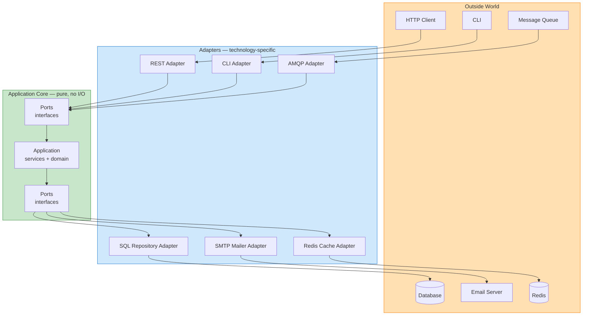
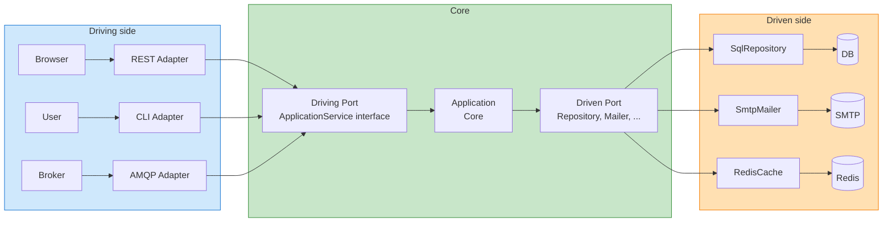
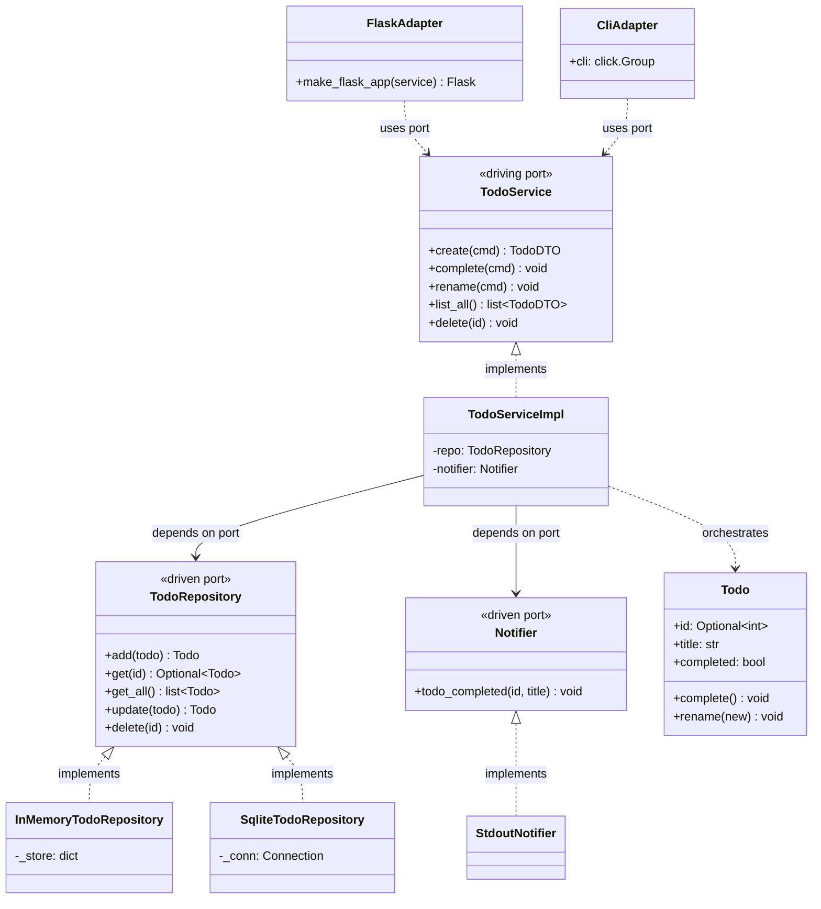
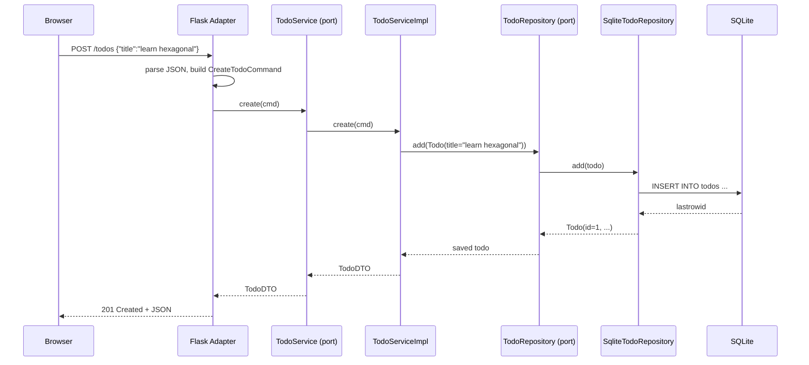

# Hexagonal Architecture (Ports and Adapters) — Isolating the Application Core

#oop #architecture #hexagonal #ports-and-adapters #clean-architecture #onion-architecture #dependency-inversion #testing #teaching #deep-dive

> [!quote] Alistair Cockburn, 2005
> "Allow an application to equally be driven by users, programs, automated test or batch scripts, and to be developed and tested in isolation from its eventual run-time devices and databases."

The Hexagonal Architecture — also called **Ports and Adapters** — is the most disciplined answer to a question every long-lived application faces: *how do I keep my business logic pure when the world around it keeps changing?* Databases get replaced. UIs come and go. Message brokers are swapped. HTTP gives way to gRPC. The Hexagonal Architecture says: build your application core as if **none of those things exist**, and connect them later as interchangeable adapters.

This note covers the original 2005 idea, ports (interfaces) and adapters (implementations), the driving/driven distinction, a complete Python implementation, a **step-by-step refactoring walkthrough** to migrate from a legacy system, and a comparison with the related Clean Architecture (Robert C. Martin) and Onion Architecture (Jeffrey Palermo).

Prerequisite reading: [[Dependency-Inversion]], [[Abstraction]], [[Service-Layer]], [[Repository-Pattern]], [[Domain-Driven-Design]].

---

## 1. The Problem Hexagonal Solves

Most applications look like this in their first month:

```
HTTP → Service → ORM → Database
```

Six months later, the same application looks like:

```
HTTP → Service → ORM → Database
                  ↘ Redis cache
                  ↘ Kafka events
                  ↘ S3 file storage
CLI → (copy of the service) → (copy of the ORM) → Database
```

The service has acquired direct dependencies on Redis, Kafka, S3, the ORM, and the database. Every test drags in the entire stack. Every technology change ripples through the service code. The CLI duplicates the logic because the service can't be called without an HTTP request.

The Hexagonal Architecture proposes a different shape:



The application core (green) has **no** dependencies on HTTP, SQL, Redis, email, or any other technology. It defines *ports* — interfaces — that say "I need a way to send email" or "I need a way to load users". The adapters (blue) implement those ports against specific technologies. The outside world (orange) talks to adapters, never to the core directly.

The payoff: you can replace any adapter without touching the core. You can run the entire core in a unit test by providing fake adapters. You can add a new transport (CLI, gRPC, message consumer) by writing a new adapter — no core changes.

---

## 2. Origin and Vocabulary

The pattern was introduced by **Alistair Cockburn** in 2005. The name "Hexagonal" is not because the architecture has six sides — Cockburn has said the number six is arbitrary; he just needed a shape with enough edges to attach multiple adapters, and "hexagonal" stuck. The technically accurate name is **Ports and Adapters**, which is the name we'll use throughout the code.

Two pieces of vocabulary:

- A **Port** is an *interface* that specifies what the application can do (input/driving port) or what it needs done for it (output/driven port). It is a contract, expressed in the application's own language, with no reference to any technology.
- An **Adapter** is a *class* that implements a port against a specific technology. A `SqlUserRepository` adapter implements the `UserRepository` port using SQL. A `SmtpMailer` adapter implements the `Mailer` port using SMTP.

> [!info] Why "Ports"?
> The metaphor is borrowed from hardware. A computer has USB ports, HDMI ports, power ports. Each port has a *specification* (USB-C, HDMI 2.1) that says nothing about what device is plugged in. Any device that conforms to the spec works. Software ports work the same way: the spec is the interface; the adapter is the "cable" that connects a particular technology.

---

## 3. Driving (Primary) vs Driven (Secondary) Adapters

Cockburn distinguishes two kinds of adapters based on the direction of calls:

| Adapter kind | Direction | Examples | Implements |
|---|---|---|---|
| **Driving** (primary) | Outside → Application | REST controller, CLI command, gRPC handler, message consumer, scheduled job | *Uses* an application port |
| **Driven** (secondary) | Application → Outside | SQL repository, SMTP mailer, S3 file storage, Redis cache, HTTP client to other services | *Provides* an application port |

A driving adapter calls *into* the application. It receives an HTTP request, translates it into a method call on an application service, and translates the result back to an HTTP response. The application doesn't know there's an HTTP request; it just received a method call.

A driven adapter is called *by* the application. When the application says "send a welcome email to user@x", it calls a method on the `Mailer` port. The `SmtpMailer` adapter receives the call, formats an SMTP message, and sends it. The application doesn't know SMTP exists.



The arrows that matter: **driving adapters depend on the core** (they call application services). **The core depends on driven port interfaces** but never on driven adapter implementations. Driven adapters *implement* the port — they depend on the port interface, which lives in the core. This is the [[Dependency-Inversion]] principle in architectural form.

---

## 4. The Core Principle: Dependencies Point Inward

The single inviolable rule of Hexagonal Architecture is:

> [!important] The Dependency Rule
> Source code dependencies must point **inward**. The application core may not depend on any adapter. Adapters may depend on the core (specifically, on port interfaces defined in the core). The outside world may depend on adapters. Nothing depends outward.

Concretely:

- The `application/` package imports nothing from `adapters/`, `infrastructure/`, or anything framework-specific.
- The `adapters/` package imports from `application/` (for port interfaces and DTOs).
- The composition root — `main.py`, `wiring.py`, your DI container — imports both and assembles them.

If you ever find yourself writing `import sqlite3` inside `application/`, you've broken the rule. The fix is to define a `UserRepository` port in `application/`, move the SQLite import into `adapters/sql_user_repository.py`, and have the application depend on the port.

---

## 5. A Complete Hexagonal Example — A Todo Service

Let's build a small Todo application end-to-end. The layout will be:

```text
todo/
├── application/           # the core — pure, no I/O
│   ├── ports.py           # port interfaces (driving + driven)
│   ├── dto.py             # commands and results
│   ├── todo.py            # domain model
│   └── todo_service.py    # application service (driving port impl)
├── adapters/              # technology-specific
│   ├── rest_api.py        # driving: Flask adapter
│   ├── cli.py             # driving: Click adapter
│   ├── sqlite_todo_repo.py# driven: SQL repository
│   ├── inmemory_repo.py   # driven: in-memory repository (tests)
│   └── stdout_notifier.py # driven: prints notifications
└── main.py                # composition root — assembles adapters
```

### 5.1 The Domain Model

```python
# application/todo.py
from dataclasses import dataclass, field
from typing import Self, Optional

@dataclass
class Todo:
    id: Optional[int]
    title: str
    completed: bool = False

    @override
    def complete(self) -> Self:
        if self.completed:
            raise ValueError("already completed")
        self.completed = True

    @override
    def rename(self, new_title: str) -> Self:
        if not new_title.strip():
            raise ValueError("title must not be empty")
        self.title = new_title.strip()
```

Note: no imports of `sqlite3`, no `requests`, no Flask. Pure Python.

### 5.2 The DTOs (Commands and Results)

```python
# application/dto.py
from dataclasses import dataclass

@dataclass(frozen=True)
class CreateTodoCommand:
    title: str

@dataclass(frozen=True)
class CompleteTodoCommand:
    todo_id: int

@dataclass(frozen=True)
class RenameTodoCommand:
    todo_id: int
    new_title: str

@dataclass(frozen=True)
class TodoDTO:
    id: int
    title: str
    completed: bool
```

### 5.3 The Ports (Interfaces)

```python
# application/ports.py
from abc import ABC, abstractmethod
from typing import Optional
from .todo import Todo
from .dto import CreateTodoCommand, CompleteTodoCommand, RenameTodoCommand, TodoDTO

# --- Driven ports: the application needs these provided ---
class TodoRepository(ABC):
    """Persistence port — abstracts where Todos live."""
    @abstractmethod
    @override
    def add(self, todo: Todo) -> Self: ...
    @abstractmethod
    @override
    def get(self, todo_id: int) -> Optional[Todo]: ...
    @abstractmethod
    @override
    def get_all(self) -> list[Todo]: ...
    @abstractmethod
    @override
    def update(self, todo: Todo) -> Self: ...
    @abstractmethod
    @override
    def delete(self, todo_id: int) -> Self: ...

class Notifier(ABC):
    """Notification port — abstracts how we tell the world something happened."""
    @abstractmethod
    @override
    def todo_completed(self, todo_id: int, title: str) -> Self: ...

# --- Driving port: this is what the application DOES ---
class TodoService(ABC):
    """The application's use cases."""
    @abstractmethod
    @override
    def create(self, cmd: CreateTodoCommand) -> Self: ...
    @abstractmethod
    @override
    def complete(self, cmd: CompleteTodoCommand) -> Self: ...
    @abstractmethod
    @override
    def rename(self, cmd: RenameTodoCommand) -> Self: ...
    @abstractmethod
    @override
    def list_all(self) -> list[TodoDTO]: ...
    @abstractmethod
    @override
    def delete(self, todo_id: int) -> Self: ...
```

The `TodoService` interface *is* the driving port — it's the contract the application offers to the outside world. The `TodoRepository` and `Notifier` interfaces are driven ports — contracts the application needs the outside world to provide.

### 5.4 The Application Service (Implements the Driving Port)

```python
# application/todo_service.py
from .ports import TodoService, TodoRepository, Notifier
from .dto import CreateTodoCommand, CompleteTodoCommand, RenameTodoCommand, TodoDTO
from .todo import Todo

class TodoServiceImpl(TodoService):
    """The application core. Depends only on ports, never on adapters."""

    def __init__(self, repo: TodoRepository, notifier: Notifier):
        self._repo = repo
        self._notifier = notifier

    @override
    def create(self, cmd: CreateTodoCommand) -> Self:
        todo = Todo(id=None, title=cmd.title)
        saved = self._repo.add(todo)
        return self._to_dto(saved)

    @override
    def complete(self, cmd: CompleteTodoCommand) -> Self:
        todo = self._repo.get(cmd.todo_id)
        if todo is None:
            raise KeyError(f"todo {cmd.todo_id} not found")
        todo.complete()                    # domain rule on the entity
        self._repo.update(todo)
        self._notifier.todo_completed(todo.id, todo.title)

    @override
    def rename(self, cmd: RenameTodoCommand) -> Self:
        todo = self._repo.get(cmd.todo_id)
        if todo is None:
            raise KeyError(f"todo {cmd.todo_id} not found")
        todo.rename(cmd.new_title)         # domain rule on the entity
        self._repo.update(todo)

    @override
    def list_all(self) -> list[TodoDTO]:
        return [self._to_dto(t) for t in self._repo.get_all()]

    @override
    def delete(self, todo_id: int) -> Self:
        self._repo.delete(todo_id)

    @staticmethod
    def _to_dto(todo: Todo) -> Self:
        return TodoDTO(id=todo.id, title=todo.title, completed=todo.completed)
```

The service knows nothing about SQLite, Flask, stdout, or HTTP. It only knows about its ports. We could ship this code to a junior developer who has never heard of Flask and they could use it directly.

### 5.5 Driven Adapters — Implementations of the Driven Ports

```python
# adapters/inmemory_repo.py
import copy
from application.ports import TodoRepository
from application.todo import Todo
from typing import Optional

class InMemoryTodoRepository(TodoRepository):
    """Test/double implementation — uses a dict, no I/O."""

    def __init__(self):
        self._store: dict[int, Todo] = {}
        self._next_id = 1

    @override
    def add(self, todo: Todo) -> Self:
        todo.id = self._next_id
        self._next_id += 1
        self._store[todo.id] = copy.deepcopy(todo)
        return copy.deepcopy(todo)

    @override
    def get(self, todo_id: int) -> Optional[Todo]:
        t = self._store.get(todo_id)
        return copy.deepcopy(t) if t else None

    @override
    def get_all(self) -> list[Todo]:
        return [copy.deepcopy(t) for t in self._store.values()]

    @override
    def update(self, todo: Todo) -> Self:
        if todo.id not in self._store:
            raise KeyError(f"todo {todo.id} not found")
        self._store[todo.id] = copy.deepcopy(todo)
        return copy.deepcopy(todo)

    @override
    def delete(self, todo_id: int) -> Self:
        self._store.pop(todo_id, None)
```

```python
# adapters/sqlite_todo_repo.py
import sqlite3
from typing import Optional
from application.ports import TodoRepository
from application.todo import Todo

class SqliteTodoRepository(TodoRepository):
    """Production implementation — uses SQLite."""

    def __init__(self, conn: sqlite3.Connection):
        self._conn = conn
        self._conn.execute("""
            CREATE TABLE IF NOT EXISTS todos (
                id INTEGER PRIMARY KEY AUTOINCREMENT,
                title TEXT NOT NULL,
                completed INTEGER NOT NULL DEFAULT 0
            )
        """)
        self._conn.commit()

    @override
    def _row_to_todo(self, row) -> Self:
        return Todo(id=row["id"], title=row["title"], completed=bool(row["completed"]))

    @override
    def add(self, todo: Todo) -> Self:
        cur = self._conn.execute(
            "INSERT INTO todos(title, completed) VALUES (?, ?)",
            (todo.title, int(todo.completed)),
        )
        self._conn.commit()
        todo.id = cur.lastrowid
        return todo

    @override
    def get(self, todo_id: int) -> Optional[Todo]:
        cur = self._conn.execute("SELECT * FROM todos WHERE id = ?", (todo_id,))
        row = cur.fetchone()
        return self._row_to_todo(row) if row else None

    @override
    def get_all(self) -> list[Todo]:
        cur = self._conn.execute("SELECT * FROM todos ORDER BY id")
        return [self._row_to_todo(r) for r in cur.fetchall()]

    @override
    def update(self, todo: Todo) -> Self:
        self._conn.execute(
            "UPDATE todos SET title=?, completed=? WHERE id=?",
            (todo.title, int(todo.completed), todo.id),
        )
        self._conn.commit()
        return todo

    @override
    def delete(self, todo_id: int) -> Self:
        self._conn.execute("DELETE FROM todos WHERE id = ?", (todo_id,))
        self._conn.commit()
```

```python
# adapters/stdout_notifier.py
from application.ports import Notifier

class StdoutNotifier(Notifier):
    """Simplest possible Notifier — prints to stdout."""

    @override
    def todo_completed(self, todo_id: int, title: str) -> Self:
        print(f"[NOTIFY] Todo #{todo_id} completed: {title}")
```

Notice that all three adapters import from `application/` (to access the port interfaces and DTOs), but `application/` imports from none of them. **Dependencies point inward.**

### 5.6 Driving Adapters — Translating the Outside World

```python
# adapters/rest_api.py
from flask import Flask, request, jsonify
from application.ports import TodoService
from application.dto import CreateTodoCommand, CompleteTodoCommand, RenameTodoCommand

def make_flask_app(service: TodoService) -> Self:
    """A driving adapter: receives HTTP, calls into the application."""
    app = Flask(__name__)

    @app.post("/todos")
    def create_todo():
        cmd = CreateTodoCommand(title=request.json["title"])
        try:
            dto = service.create(cmd)
        except ValueError as exc:
            return jsonify({"error": str(exc)}), 400
        return jsonify(dto.__dict__), 201

    @app.post("/todos/<int:tid>/complete")
    def complete_todo(tid: int):
        try:
            service.complete(CompleteTodoCommand(todo_id=tid))
        except KeyError:
            return jsonify({"error": "not found"}), 404
        except ValueError as exc:
            return jsonify({"error": str(exc)}), 400
        return "", 204

    @app.patch("/todos/<int:tid>")
    def rename_todo(tid: int):
        cmd = RenameTodoCommand(todo_id=tid, new_title=request.json["title"])
        try:
            service.rename(cmd)
        except KeyError:
            return jsonify({"error": "not found"}), 404
        except ValueError as exc:
            return jsonify({"error": str(exc)}), 400
        return "", 204

    @app.get("/todos")
    def list_todos():
        todos = service.list_all()
        return jsonify([t.__dict__ for t in todos])

    @app.delete("/todos/<int:tid>")
    def delete_todo(tid: int):
        service.delete(tid)
        return "", 204

    return app
```

```python
# adapters/cli.py
import click
from application.ports import TodoService
from application.dto import CreateTodoCommand, CompleteTodoCommand, RenameTodoCommand

@click.group()
@click.pass_context
def cli(ctx):
    """Todo CLI."""
    # The service is attached via ctx.obj; see main.py for wiring.
    pass

@cli.command()
@click.argument("title")
@click.pass_obj
def add(service: TodoService, title):
    dto = service.create(CreateTodoCommand(title=title))
    click.echo(f"Created todo #{dto.id}: {dto.title}")

@cli.command()
@click.argument("todo_id", type=int)
@click.pass_obj
def done(service: TodoService, todo_id):
    service.complete(CompleteTodoCommand(todo_id=todo_id))
    click.echo(f"Completed todo #{todo_id}")

@cli.command(name="list")
@click.pass_obj
def list_cmd(service: TodoService):
    for dto in service.list_all():
        mark = "x" if dto.completed else " "
        click.echo(f"[{mark}] {dto.id}: {dto.title}")

@cli.command()
@click.argument("todo_id", type=int)
@click.argument("new_title")
@click.pass_obj
def rename(service: TodoService, todo_id, new_title):
    service.rename(RenameTodoCommand(todo_id=todo_id, new_title=new_title))
    click.echo(f"Renamed todo #{todo_id}")
```

The Flask adapter and the CLI adapter both depend on the same `TodoService` port. They translate their respective transports (HTTP, command-line) into the same set of method calls. The application core does not know either exists.

### 5.7 The Composition Root

```python
# main.py — the only place that knows about every concrete adapter.
import sqlite3
from application.todo_service import TodoServiceImpl
from adapters.sqlite_todo_repo import SqliteTodoRepository
from adapters.stdout_notifier import StdoutNotifier
from adapters.rest_api import make_flask_app

def make_web_app():
    """Production wiring."""
    conn = sqlite3.connect("todos.db")
    conn.row_factory = sqlite3.Row
    repo = SqliteTodoRepository(conn)
    notifier = StdoutNotifier()
    service = TodoServiceImpl(repo, notifier)
    return make_flask_app(service)

if __name__ == "__main__":
    make_web_app().run(host="0.0.0.0", port=5000)
```

```python
# test wiring (in conftest.py)
import pytest
from application.todo_service import TodoServiceImpl
from adapters.inmemory_repo import InMemoryTodoRepository
from adapters.stdout_notifier import StdoutNotifier

@pytest.fixture
def todo_service():
    return TodoServiceImpl(InMemoryTodoRepository(), StdoutNotifier())
```

The wiring is the *only* place that knows `SqliteTodoRepository` exists. The tests wire up an `InMemoryTodoRepository` instead. Switch to PostgreSQL tomorrow? Write `PostgresTodoRepository`, change one line in `main.py`. The application core never moves.

---

## 6. Class Diagram — Ports and Adapters



The arrows to notice:

- `TodoServiceImpl` depends on `TodoRepository` and `Notifier` (the interfaces), never on the concrete adapters.
- `InMemoryTodoRepository`, `SqliteTodoRepository`, and `StdoutNotifier` *implement* the ports.
- `FlaskAdapter` and `CliAdapter` use the `TodoService` port.
- Nothing in `application/` points to anything in `adapters/`. The dependency arrows all point *toward* the core.

---

## 7. Request Flow — How an HTTP Request Becomes a Method Call



The browser thinks it's talking to Flask. Flask thinks it's talking to `TodoService`. `TodoServiceImpl` thinks it's talking to `TodoRepository`. Only at the very bottom — `SqliteTodoRepository` — does anything actually know SQL exists. Replace SQLite with PostgreSQL and only the bottom two participants change.

---

## 8. Step-by-Step Refactoring Walkthrough: From Layered to Hexagonal

Migrating a tightly-coupled, traditional layered application to a Hexagonal Architecture is not an overnight task. It requires systematic refactoring. Here is a step-by-step guide on how to untangle the knot.

### Step 1: Identify and Isolate the Core Business Logic
Start by identifying the central use cases of your application.
- **Action**: Look at your controllers or service layer. Extract pure business rules (validation, state changes, domain calculations) into separate domain classes or functions.
- **Goal**: Ensure your domain logic doesn't depend on HTTP request objects or database ORM models. Create Plain Old Python Objects (POPOs) for entities.

### Step 2: Extract Driven Ports (The Outbound Interfaces)
Find where your service layer communicates with the outside world (databases, third-party APIs, message brokers).
- **Action**: For each external dependency, define an interface (Abstract Base Class in Python) that models the operations your application *needs*.
  - *Example*: If your service imports `requests` to fetch user profiles, create an interface `UserProfileFetcher` with a method `get_profile(user_id)`.
- **Goal**: Invert the dependency. The service will now depend on the interface, not the concrete implementation.

### Step 3: Implement Driven Adapters
Write the concrete implementations of the ports you just defined.
- **Action**: Move the old infrastructure code (SQLAlchemy queries, `requests` calls) into new adapter classes that implement the driven ports.
  - *Example*: Create `HttpUserProfileFetcher(UserProfileFetcher)` and `SqlAlchemyUserRepository(UserRepository)`.
- **Goal**: Push infrastructure logic to the edges (adapters layer).

### Step 4: Inject Dependencies (Dependency Injection)
Modify your application core services so they receive their driven ports through their constructor, rather than instantiating them internally.
- **Action**: Update `__init__` methods to accept the port interfaces.
  - *Example*: `def __init__(self, user_repo: UserRepository, profile_fetcher: UserProfileFetcher): ...`
- **Goal**: Your core service is now completely decoupled from infrastructure. It can be tested easily with mock or in-memory adapters.

### Step 5: Extract Driving Ports (The Inbound Interfaces)
Define the boundaries for incoming requests (from UI, CLI, APIs).
- **Action**: Define an interface for your application service (the use cases). This defines exactly what the application *can do*.
- **Goal**: Controllers, CLI commands, and event listeners will program against this driving port.

### Step 6: Refactor Driving Adapters (Controllers, CLI)
Update the entry points to use the new driving ports.
- **Action**: Refactor Flask routes or CLI commands so they parse the incoming request, map it to DTOs/Commands, and pass it to the driving port (the application service). They handle HTTP status codes or CLI formatting on the way out.
- **Goal**: The controllers only handle routing and I/O serialization, nothing more.

### Step 7: Create the Composition Root
Centralize the wiring of all dependencies.
- **Action**: Create a `main.py` or use a DI container to instantiate the driven adapters (SQL repos, HTTP clients), pass them into the application service, and then pass the service into the driving adapters (Flask app).
- **Goal**: You now have a single place in the application that knows about concrete implementations, making the entire system modular and pluggable.

---

## 9. Why Hexagonal? The Benefits

### 9.1 Testability Without Mocking Frameworks

Because every dependency is a port, you test the application core with **plain fake adapters** — no `unittest.mock`, no `pytest-mock`, no monkey-patching. The fakes are real classes that implement the port; they live in your test suite alongside the tests.

```python
class FakeNotifier(Notifier):
    def __init__(self):
        self.events = []
    @override
    def todo_completed(self, todo_id, title):
        self.events.append(("completed", todo_id, title))

class FakeRepo(TodoRepository):
    def __init__(self):
        self._todos = {}
        self._next = 1
    @override
    def add(self, todo):
        todo.id = self._next; self._next += 1
        self._todos[todo.id] = todo
        return todo
    # ... other methods ...

def test_complete_publishes_notification():
    repo = FakeRepo()
    notifier = FakeNotifier()
    service = TodoServiceImpl(repo, notifier)

    todo = service.create(CreateTodoCommand("write tests"))
    service.complete(CompleteTodoCommand(todo.id))

    assert notifier.events == [("completed", todo.id, "write tests")]
```

The test is a unit test in the strictest sense — no I/O, no mocks, milliseconds to run. And it tests the *real* application logic, not a stub.

### 9.2 Technology Independence

Switching databases, message brokers, or UIs becomes an adapter-replacement exercise, not a codebase rewrite. The application core survives every technology churn.

### 9.3 Multiple Transports for Free

The same `TodoServiceImpl` is callable from Flask, Click (CLI), an AMQP consumer, a scheduled job, a gRPC handler — anything. Each is just a new driving adapter. The use case is written once.

### 9.4 Parallel Development

Once ports are agreed, the team can split: one developer writes the application core with fake adapters, another writes the SQL adapter, another writes the Flask adapter. They merge at the composition root.

### 9.5 Delayed Decisions

You don't have to pick a database on day one. Build the core with in-memory adapters, decide on PostgreSQL in month two. The decision is localised.

---

## 10. Hexagonal vs Clean vs Onion

Hexagonal Architecture is one of three closely-related patterns. They share the same core idea — dependencies point inward, business logic is isolated — but differ in vocabulary and emphasis.

```mermaid
flowchart TB
    subgraph Hex[Hexagonal / Ports & Adapters]
        direction LR
        H1[Adapters] --> H2[Ports]
        H2 --> H3[Application Core]
    end
    subgraph Clean[Clean Architecture]
        direction LR
        C1[Frameworks & Drivers] --> C2[Interface Adapters]
        C2 --> C3[Use Cases]
        C3 --> C4[Entities]
    end
    subgraph Onion[Onion Architecture]
        direction LR
        O1[Infrastructure / UI] --> O2[Application Services]
        O2 --> O3[Domain Services]
        O3 --> O4[Domain Model]
    end
```



### 10.1 Clean Architecture (Robert C. Martin, 2012)

Clean Architecture layers the application into four concentric circles:

1. **Entities** — enterprise-wide business rules (domain entities).
2. **Use Cases** — application-specific business rules (application services).
3. **Interface Adapters** — controllers, presenters, gateways.
4. **Frameworks & Drivers** — web, database, UI frameworks.

The dependency rule is identical to Hexagonal: dependencies point inward. The difference is granularity — Clean Architecture separates *entities* (long-lived, enterprise-wide) from *use cases* (application-specific), whereas Hexagonal treats the whole core as one. Clean Architecture also emphasises the use of **Presenters** alongside Controllers, formalising the separation between input and output on the driving side.

### 10.2 Onion Architecture (Jeffrey Palermo, 2008)

Onion Architecture layers the application into four rings:

1. **Domain Model** (centre) — entities, value objects.
2. **Domain Services** — stateless domain operations.
3. **Application Services** — use case orchestration.
4. **Infrastructure / UI / Tests / External** (outermost).

Again, dependencies point inward. Onion Architecture is essentially Hexagonal with the application core explicitly split into Domain + Application Services — closer to DDD's vocabulary.

### 10.3 Comparison Table

| Aspect | Hexagonal | Clean | Onion |
|---|---|---|---|
| Year | 2005 | 2012 | 2008 |
| Author | Cockburn | Martin | Palermo |
| Core shape | One core | Four concentric circles | Four rings |
| Vocabulary | Ports, Adapters, Driving, Driven | Entities, Use Cases, Interface Adapters, Frameworks | Domain Model, Domain Services, Application Services, Infrastructure |
| Emphasis | Symmetry of driving/driven | Layered purity, presenters | Domain at the centre |
| Test focus | Mock adapters | Mock at circle boundaries | Mock infrastructure |
| Best with | DDD tactical patterns | Use-case-heavy apps | .NET stack tradition |

In practice, the three patterns are *isomorphic* — you can implement any one using the others' vocabulary. Most teams that say "we use Clean Architecture" actually mean Hexagonal with extra DDD layering, and vice versa.

> [!info] Which Should You Pick?
> Don't agonise. Pick the vocabulary that resonates with your team. The architectural rule is the same in all three: **dependencies point inward, the core is pure, adapters plug in at the edges.** What matters is that the rule is *enforced* — usually by linting imports, by code review, or by structuring the package layout so a circular dependency is impossible.

---

## 11. When to Use Hexagonal — and When Not

### 11.1 Use Hexagonal when:

- **The application is long-lived.** The payoff is technology churn over years.
- **Multiple transports are likely.** Web + API + CLI + message consumer — Hexagonal makes each a thin adapter.
- **The team values testability above all.** Fake adapters make the core 100% testable without integration infrastructure.
- **The business domain is complex enough to deserve a clean core.** Pair Hexagonal with [[Domain-Driven-Design]].
- **You want to defer technology decisions.** Build with in-memory adapters, swap to PostgreSQL, Redis, Kafka later.
- **You're regulated or audited.** A pure, well-named application core is easier to audit than one tangled with framework calls.

### 11.2 Skip Hexagonal when:

- **The application is a script or short-lived.** The ceremony outweighs the benefit.
- **The domain is pure CRUD.** If every use case is "list/create/edit/delete row", the core has nothing to protect. Use the ORM directly.
- **The team is junior or unfamiliar with abstraction.** Hexagonal demands fluency with interfaces, dependency injection, and the discipline of the dependency rule. Without that fluency, the architecture collapses into a tangled mess of mock interfaces.
- **You're using a framework that imposes its own structure.** Django, Rails, and Spring Boot each have opinions about where things go; fighting them to add Hexagonal adds friction. (You can still apply Hexagonal *within* a Django app by extracting services that don't import Django, but it's effort.)
- **The performance overhead of indirection matters.** Each adapter is one extra layer of method calls. For 99% of apps, this is invisible; for hot paths in latency-critical systems, it isn't.

> [!warning] Common Student Misconception
> "Hexagonal means six adapters." No. The number six is arbitrary — Cockburn has explicitly said he just drew a hexagon to fit multiple adapters on the diagram. You can have 2 adapters or 12. The pattern is *Ports and Adapters*; "Hexagonal" is a memorable name, not a literal constraint.

> [!danger] Common Student Misconception
> "Hexagonal means no framework." No. Flask, Django, SQLAlchemy, Click — they all live in the adapter layer. Hexagonal doesn't ban frameworks; it confines them to the edges. The application core has no framework imports, but the adapters are full of them.

---

## 12. Common Pitfalls

### 12.1 Leaking Technology Types Through Ports

```python
# BAD — port exposes SQLAlchemy type
class UserRepository(ABC):
    @abstractmethod
    @override
    def get(self, id_: int) -> Self: ...
```

Now the application core depends on SQLAlchemy. Fix: the port must use domain types (`User`), not ORM types.

### 12.2 Letting Adapters Call Each Other

```python
# BAD — adapter-to-adapter dependency
class FlaskAdapter:
    @override
    def handle_request(self):
        self._sql_repo.get(...)  # Flask calling SQL directly
```

Driving adapters should *only* call driving ports. Driven adapters should *only* be called through driven ports. Cross-adapter calls bypass the core and recreate the spaghetti Hexagonal was supposed to prevent.

### 12.3 Putting Business Logic in Adapters

```python
# BAD — business rule in the REST adapter
@app.post("/orders")
def place_order():
    order = ...
    if order.total > 1000:
        order.apply_discount(0.1)  # rule!
    service.place(order)
```

The rule belongs on the domain object or in the application service, not in the HTTP adapter. Adapters translate; they don't decide.

### 12.4 Not Having a Composition Root

Without a single `main.py` (or DI container) that wires adapters to ports, the wiring scatters across the codebase. Each adapter ends up constructing its own dependencies. Fix: pick one place — and only one — where concrete adapters are instantiated and injected.

### 12.5 Ports That Mirror the Database Schema

A `UserRepository` with `select_active_users_created_between(start, end)` is leaking SQL concepts. The port should express the application's needs: `find_users_eligible_for_reminder()`.

### 12.6 One Port, One Adapter

If you only ever have one adapter per port and one transport per driving port, Hexagonal may be over-engineered. The pattern pays off when ports have *multiple* adapters (in-memory for tests, SQL for prod) or driving ports have *multiple* adapters (HTTP, CLI, MQ). If neither is true, the indirection is overhead.

---

## 13. Testing Strategy

Hexagonal shines in testing. The typical test pyramid looks like:

| Layer | Test type | Example |
|---|---|---|
| Domain (entities, value objects) | Pure unit tests, no fixtures | "Todo.complete raises if already completed" |
| Application service | Unit tests with fake adapters | "complete() publishes notification" |
| Adapters | Integration tests with real technology | "SqliteTodoRepository.add stores and returns id" |
| Composition (end-to-end) | Few, slow tests against the real app | "POST /todos returns 201" |

Because the application core depends only on ports, the unit tests for it are fast (no I/O), parallel (no shared state), and deterministic (no network). The integration tests are confined to the adapter layer. The end-to-end tests are scarce and slow — and that's fine, because everything risky has already been tested in the unit layer.

```python
# An integration test for the SQL adapter
def test_sqlite_repo_roundtrip():
    conn = sqlite3.connect(":memory:")
    conn.row_factory = sqlite3.Row
    repo = SqliteTodoRepository(conn)
    saved = repo.add(Todo(id=None, title="integration"))
    fetched = repo.get(saved.id)
    assert fetched.title == "integration"
    assert fetched.completed is False

# An end-to-end test through the Flask adapter
def test_flask_create_endpoint():
    service = TodoServiceImpl(InMemoryTodoRepository(), FakeNotifier())
    app = make_flask_app(service)
    client = app.test_client()
    resp = client.post("/todos", json={"title": "via HTTP"})
    assert resp.status_code == 201
    assert resp.json["title"] == "via HTTP"
```

Three test layers, three different confidence levels, all driven by the same architecture.

---

## 14. Key Takeaways

1. **Hexagonal Architecture = Ports and Adapters.** The application core is pure; technology lives in adapters.
2. **Ports are interfaces** written in the application's own language, with no technology references.
3. **Adapters implement ports** against specific technologies (SQL, SMTP, HTTP, CLI).
4. **Driving (primary) adapters call into the application**; **driven (secondary) adapters are called by the application.**
5. **The Dependency Rule**: source code dependencies point *inward*. The core never imports an adapter.
6. **A composition root** (one `main.py` or DI container) is the only place that knows about concrete adapters.
7. **Testing is the killer feature**: fake adapters make the entire core testable in milliseconds without mocks.
8. **Clean Architecture and Onion Architecture are isomorphic to Hexagonal** — same rule, different vocabulary.
9. **Use Hexagonal for long-lived, multi-transport, complex-domain applications.** Skip it for scripts, pure CRUD, or short-lived projects.

> [!success] Teaching Tip
> The most effective Hexagonal demo is the *transport swap*. Run the application via the Flask adapter and exercise it with `curl`. Then, in front of students, change `main.py` to wire the CLI adapter instead and run the same use cases from the shell. The application core is identical — only the driving adapter changed. Students see, in five minutes, what would otherwise take an hour of explanation.

### 14.1 Further Reading

- Alistair Cockburn's original article, "Hexagonal Architecture" (2005), at `alistair.cockburn.us`.
- Robert C. Martin, *Clean Architecture* (2017) — the book-length treatment of the related pattern.
- Jeffrey Palermo, "The Onion Architecture" series (2008) — for the third vocabulary.
- Thomas Pierrain and Jérôme Avoustin, "Hexagonal Architecture Misconceptions" — clarifies common confusions.
- [[Repository-Pattern]] — driven ports are typically repositories.
- [[Service-Layer]] — the application service is the driving port's implementation.
- [[Domain-Driven-Design]] — the natural domain modelling companion to Hexagonal.
- [[Dependency-Inversion]] — the SOLID principle that Hexagonal operationalises at architectural scale.
