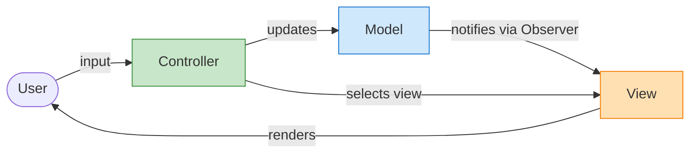
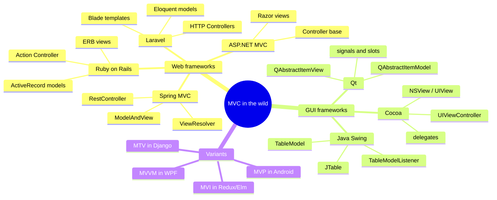
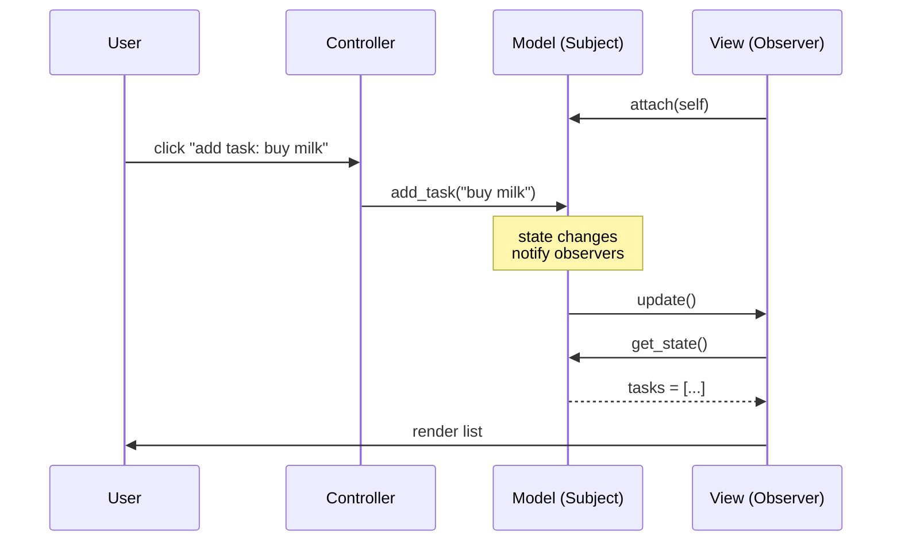
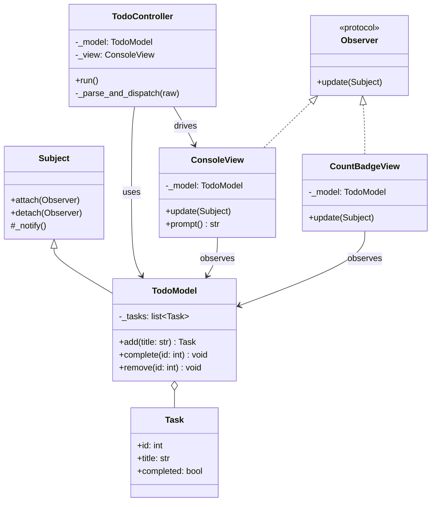
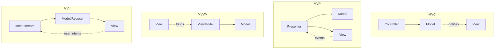
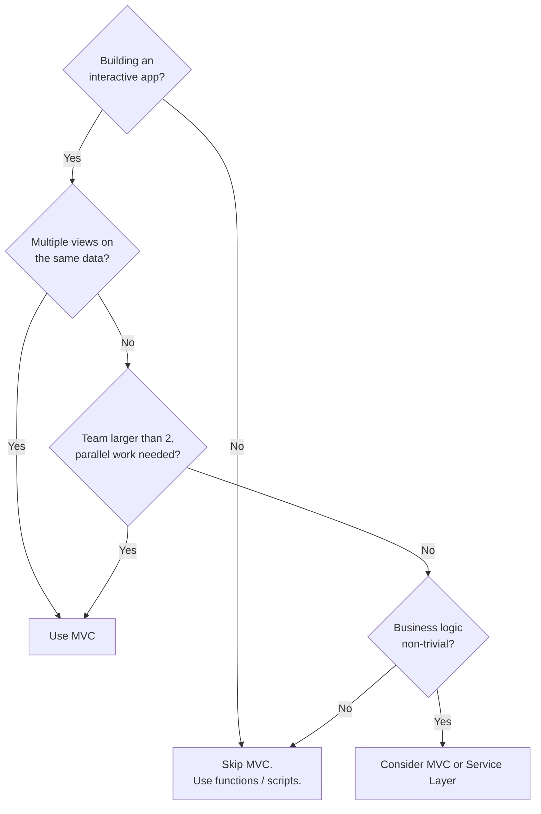
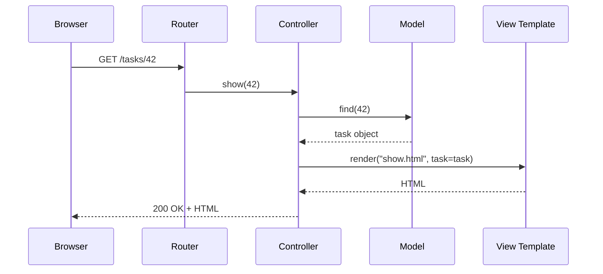

# Model-View-Controller (MVC) — The Architectural Pattern That Shaped the Web

#oop #architecture #mvc #mvp #mvvm #separation-of-concerns #observer-pattern #teaching #deep-dive

> [!quote] Trygve Reenskaug, 1979
> "The Model-View-Controller (MVC) pattern was originally developed in Smalltalk-80 to separate the user interface from the underlying data and the logic that controls it. Its purpose is to make applications more maintainable by separating concerns that change at different rates and for different reasons."

If you have ever built a Django site, written a Ruby on Rails controller, configured a Spring `@RestController`, or scaffolded an ASP.NET MVC view, **you have used MVC**. It is arguably the most influential architectural pattern in software history — and also one of the most misunderstood, because every framework reinterprets it.

This note explains the original MVC, walks through a complete Python implementation, surveys the major variants (MVP, MVVM, MVI), compares MVC to Django's MTV, and gives you the criteria to decide when MVC is the right tool.

Prerequisite reading: [[Encapsulation]], [[Abstraction]], [[Single-Responsibility]], [[Behavioral-Patterns]] (especially the Observer), [[Classes-And-Objects]].

---

## 1. What Is MVC?

**MVC (Model-View-Controller)** is an architectural pattern that divides an interactive application into three distinct roles:

| Role | Responsibility | Knows About | Doesn't Know About |
|---|---|---|---|
| **Model** | Domain data + business rules + state changes | Its own data, its own invariants | View, Controller, UI |
| **View** | Renders the Model to the user; captures input | The Model (observes it); how to display it | How input is handled, business rules |
| **Controller** | Receives user input, translates it into Model operations, selects the View | Model, View | How the Model does its work |

The pattern was created by **Trygve Reenskaug** in **1979** while he was visiting the Xerox Palo Alto Research Center (PARC) and working on **Smalltalk-80**. The original name was *Thing-Model-View-Editor*; it was renamed to MVC later that year. Reenskaug's insight was deceptively simple: **separate the things that change for different reasons**.



### 1.1 The Three Components in Detail

**The Model** is the source of truth. It owns the application's state, enforces its invariants, and emits notifications when state changes. A well-designed Model has *no* knowledge of how it will be displayed or who is calling it. The Model is the longest-lived part of the system — it survives UI redesigns, framework migrations, and transport changes.

**The View** is responsible for visual representation. Crucially, in classical MVC, a View *subscribes to the Model* (via the Observer pattern, see [[Behavioral-Patterns]]) and re-renders itself when the Model changes. Multiple Views can attach to one Model: a spreadsheet Model might have a grid View, a chart View, and a summary View, all updating simultaneously.

**The Controller** is the *input* boundary. It translates raw user gestures (mouse click, keystroke, HTTP request) into method calls on the Model. After the Model updates, the Controller does **not** redraw the View — the View redraws itself in response to the Model's notification. This is the part that most modern frameworks get wrong, because they conflate the Controller with the View.

> [!info] The Original MVC Triangle
> In Smalltalk-80, a Controller had its own event loop. A `ButtonController` would listen for mouse-down events, debounce, and on `mouseUp` send `#press` to the Model. The View was a *passive* renderer — it just observed. Modern web frameworks invert this: the Controller does *both* input handling and view selection.

### 1.2 Where MVC Is Used

MVC is the dominant pattern in **server-side web frameworks** and many **desktop GUIs**:

- **Ruby on Rails** — Rails uses Action Controller (controllers), ActiveRecord (models), and Action View (ERB templates). The rails-generator literally calls them `app/models`, `app/views`, `app/controllers`.
- **Spring MVC (Java)** — `@Controller` classes return `ModelAndView`; Spring resolves the View via `ViewResolver`.
- **ASP.NET MVC** — controllers inherit from `Controller`, models are POCOs, views are Razor `.cshtml`.
- **Django** — uses **MTV** (Model-Template-View), a variant we will discuss in §6.
- **Qt** (C++ desktop) — `QAbstractItemModel` notifies `QAbstractItemView` via the `dataChanged` signal; this is textbook Observer-based MVC.
- **Apple's Cocoa MVC** — `UIViewController` is more of a mediator between `UIView` and the data model.



---

## 2. Why MVC? The Principles It Embodies

### 2.1 Separation of Concerns (SoC)

MVC is a concrete application of [[Single-Responsibility]] at the architectural scale. The Model is responsible for *truth*, the View for *display*, the Controller for *input translation*. A change in how the list is rendered should never ripple into the business rule that says "tasks can't be deleted after they are completed."

### 2.2 Testability

Because the Model knows nothing about Views, you can test business logic without spinning up a UI. Because Controllers are thin translation layers, you can test them with stubbed Models. Because Views are dumb renderers, they typically need only smoke tests.

### 2.3 Parallel Development

Once the Model's API is fixed, three developers can work in parallel: one on the data layer, one on the controller endpoints, one on the views. In larger teams this is the *primary* reason to adopt MVC — not theoretical purity.

### 2.4 Multiple Simultaneous Views

Because Views subscribe to the Model through Observer, you can attach any number of Views to the same Model. This is what makes spreadsheets, dashboards, and IDEs possible. Without decoupling, you'd have to call every renderer manually from every state-change method.

> [!tip] Teaching Tip
> The most convincing demo of MVC is to attach *two* Views to one Model (e.g., a list view and a chart view) and update either one — the other updates for free. Students "get" the pattern the instant they see that the Model has no idea the chart exists.

---

## 3. The Observer Pattern Inside MVC

Classical MVC leans on the [[Behavioral-Patterns|Observer pattern]] for View-to-Model coupling. The Model maintains a list of dependent Views and calls `update()` on each when state changes. This is sometimes called the *passive-Model* style when the Model doesn't actively push, but the original Smalltalk design has the Model broadcasting.



In Python, you can implement this with a tiny subject mixin:

```python
from typing import Self, Callable, Protocol

class Observer(Protocol):
    @override
    def update(self, subject: "Subject") -> Self: ...

class Subject:
    """Minimal Observable mixin used by Models."""

    def __init__(self) -> Self:
        self._observers: list[Observer] = []

    @override
    def attach(self, observer: Observer) -> Self:
        if observer not in self._observers:
            self._observers.append(observer)

    @override
    def detach(self, observer: Observer) -> Self:
        self._observers.remove(observer)

    @override
    def _notify(self) -> Self:
        for obs in list(self._observers):  # copy — observers may detach
            obs.update(self)
```

The View implements `update()`; the Model calls `self._notify()` whenever its state changes. This is the exact mechanism that powers Qt's signals/slots and Java Swing's listener model.

---

## 4. A Complete MVC Application — Todo List

Let's build a small but complete MVC Todo application. It has a command-line view *and* a count badge view attached to the same Model, so you can see the Observer pattern working.

### 4.1 The Model

```python
from __future__ import annotations
from dataclasses import dataclass, field
from typing import Optional

# Subject is the Observable base class defined in §3.

@dataclass
class Task:
    id: int
    title: str
    completed: bool = False

class TodoModel(Subject):
    """The Model: owns tasks and enforces business rules."""

    def __init__(self) -> Self:
        super().__init__()
        self._tasks: list[Task] = []
        self._next_id: int = 1

    # Read side
    @property
    @override
    def tasks(self) -> list[Task]:
        return list(self._tasks)  # defensive copy

    @override
    def get(self, task_id: int) -> Optional[Task]:
        return next((t for t in self._tasks if t.id == task_id), None)

    # Write side — each method enforces an invariant and notifies
    @override
    def add(self, title: str) -> Self:
        if not title.strip():
            raise ValueError("title must not be empty")
        task = Task(id=self._next_id, title=title.strip())
        self._next_id += 1
        self._tasks.append(task)
        self._notify()
        return task

    @override
    def complete(self, task_id: int) -> Self:
        task = self.get(task_id)
        if task is None:
            raise KeyError(f"task {task_id} not found")
        task.completed = True
        self._notify()

    @override
    def remove(self, task_id: int) -> Self:
        task = self.get(task_id)
        if task is None:
            raise KeyError(f"task {task_id} not found")
        if task.completed:
            raise ValueError("cannot delete a completed task until archive")
        self._tasks.remove(task)
        self._notify()
```

Notice three things:

1. The Model knows **nothing** about views, controllers, or printing.
2. Each mutation enforces an invariant (no empty titles, can't delete completed tasks).
3. Each mutation calls `self._notify()`, which keeps every attached View in sync.

### 4.2 The Views

```python
class ConsoleView:
    """A view that prints the task list to stdout."""

    def __init__(self, model: TodoModel) -> Self:
        self._model = model
        model.attach(self)

    @override
    def update(self, subject: Subject) -> Self:
        # called by the Model whenever state changes
        print("\n=== Todo list ===")
        for task in self._model.tasks:
            status = "x" if task.completed else " "
            print(f"  [{status}] {task.id}: {task.title}")
        print("=================\n")

    @override
    def prompt(self) -> str:
        return input("cmd (add <title> | done <id> | rm <id> | quit) > ")


class CountBadgeView:
    """A second view: shows only the count of pending tasks."""

    def __init__(self, model: TodoModel) -> Self:
        self._model = model
        model.attach(self)

    @override
    def update(self, subject: Subject) -> Self:
        pending = sum(1 for t in self._model.tasks if not t.completed)
        print(f"[badge] {pending} task(s) pending")
```

Two views, one Model — that's the whole point.

### 4.3 The Controller

```python
class TodoController:
    """Translates user input into Model operations."""

    def __init__(self, model: TodoModel, view: ConsoleView) -> Self:
        self._model = model
        self._view = view

    @override
    def run(self) -> Self:
        self._view.update(self._model)  # initial render
        while True:
            try:
                raw = self._view.prompt()
            except EOFError:
                break
            if not self._parse_and_dispatch(raw):
                break

    @override
    def _parse_and_dispatch(self, raw: str) -> bool:
        parts = raw.split(maxsplit=1)
        if not parts:
            return True
        cmd = parts[0].lower()
        if cmd == "quit":
            return False
        try:
            if cmd == "add":
                self._model.add(parts[1])
            elif cmd == "done":
                self._model.complete(int(parts[1]))
            elif cmd == "rm":
                self._model.remove(int(parts[1]))
            else:
                print(f"unknown command: {cmd}")
        except (IndexError, ValueError, KeyError) as exc:
            print(f"error: {exc}")
        return True
```

### 4.4 Wiring It Together

```python
if __name__ == "__main__":
    model = TodoModel()
    console = ConsoleView(model)
    badge = CountBadgeView(model)   # second observer on same Model
    TodoController(model, console).run()
```

When the user types `add buy milk`, the Controller calls `model.add("buy milk")`. The Model appends the Task and calls `_notify()`. Both `ConsoleView` and `CountBadgeView` re-render themselves. The Model has no idea either View exists — that's MVC.

> [!example] Try It
> Add a third view — `StatsView` that prints how many tasks were added since the program started. Because it observes the Model, you don't need to touch the Controller or the Model to add this feature. This is *Open-Closed* in action (see [[Open-Closed]]).

### 4.5 Class Diagram



---

## 5. Variants of MVC

The original 1979 MVC has been reinterpreted many times. The most important variants:

### 5.1 MVP — Model-View-Presenter

In **MVP** (Mike Breslav / Mike Potel, 1996, popularised by Taligent), the Presenter replaces the Controller and **acts on behalf of the View**. The View is *passive* — it doesn't observe the Model directly. Instead:

- The View exposes an interface (`IView`).
- The Presenter talks to both the Model and the View through that interface.
- The View fires events *to the Presenter*; the Presenter updates the Model and tells the View what to display.

This makes Views trivially mockable and is why MVP is the default pattern in **Android** (until MVVM took over) and **WinForms**.

### 5.2 MVVM — Model-View-ViewModel

In **MVVM** (John Gossman, 2005, Microsoft WPF), the ViewModel is a *model-for-the-view*. The key innovation is **data binding**: the View binds its widgets to properties on the ViewModel, and changes propagate automatically through a framework-supplied binder (Knockout, Angular, Vue, WPF bindings).

- View → ViewModel via bindings (no manual DOM manipulation).
- ViewModel → Model via normal calls.
- ViewModel never knows the View exists.

MVVM is the dominant pattern for **WPF**, **Angular**, **Vue**, **Knockout**, and modern **SwiftUI** (which is closer to MVVM-without-the-name).

### 5.3 MVI — Model-View-Intent

In **MVI** (André Staltz, popularised by the reactive community), the user's *Intent* is modelled as a stream of events. The entire state is computed by reducing that stream into a single state object, which the View renders. This is the pattern behind **Redux** (React), **Elm**, and the **Cycle.js** framework. MVI is essentially the **unidirectional data flow** version of MVC.

### 5.4 Variants Comparison Table

| Aspect | MVC (1979) | MVP (1996) | MVVM (2005) | MVI (2015) |
|---|---|---|---|---|
| Who updates the View? | View itself, via Observer | Presenter | Data binder | View, via single state |
| View knows about Model? | Yes | No | No | No |
| Testability of View logic | Medium | High | High (binds) | Very high |
| Coupling style | Observer | Interface | Binding | Stream |
| Best for | Desktop GUIs with multiple views | Android, WinForms | WPF, Angular, Vue | Redux, Elm, reactive UIs |



---

## 6. Django's MTV — Is It "Real" MVC?

Django deliberately calls its variant **MTV** (Model-Template-View) and the docs explicitly state "Django appears to be a MVC framework, but … the *view* in Django is the *controller*." Let's unpack that.

- **Model** = Django `models.Model`. Same idea as classical MVC.
- **Template** = the HTML/Django-template that renders. This is what classical MVC calls the View's *visual part*.
- **View** = a Python callable (function or class-based view) that receives an HTTP request, fetches data, and returns a response. This is what classical MVC would call the Controller.

```python
# Django MTV in 12 lines
from django.db import models
from django.views import View
from django.shortcuts import render
from django.urls import path

class Task(models.Model):                 # Model
    title = models.CharField(max_length=200)
    done = models.BooleanField(default=False)

class TaskListView(View):                 # "View" (really a Controller)
    @override
    def get(self, request):
        tasks = Task.objects.all()
        return render(request, "tasks/list.html", {"tasks": tasks})

urlpatterns = [path("tasks/", TaskListView.as_view())]
```

```html
<!-- templates/tasks/list.html — the Template (the actual View) -->
<ul>
  
    <li>{{ t.title }} — donepending</li>
  
</ul>
```

So Django *is* MVC — it just renames the Controller "View" and the View "Template". The architectural separation is the same; the vocabulary is what confuses newcomers.

> [!warning] Common Student Misconception
> "Django is not MVC." — *False.* Django is MVC with renamed roles. The separation of concerns is identical. If a student can articulate *why* Django calls its controllers "views," they understand MVC.

---

## 7. When MVC Is the Right Choice



Reach for MVC when:

- **You have multiple presentations of the same data** (list + chart, web + mobile + API).
- **You want parallel development** across UI, business logic, and input handling.
- **Your UI technology churns** — today it's React, tomorrow it might be something else; the Model should survive.
- **You're using a framework that already assumes it** (Rails, Spring, ASP.NET, Django).

Skip MVC when:

- **The program is a script** — one-shot data munging, ETL step, CLI tool. Adding MVC is overhead.
- **There is no UI at all** — a pure API service may be better served by [[Service-Layer]] + [[Repository-Pattern]].
- **The business logic is trivial CRUD** — directly using the ORM is fine; layers add ceremony.
- **The UI is purely reactive** — frameworks like React with hooks already enforce unidirectional flow, and piling MVC on top adds indirection without benefit.

---

## 8. Common Mistakes and Anti-Patterns

### 8.1 The Fat Controller

The single most common mistake: a Controller that does business logic. Symptoms include SQL queries inside controllers, calls to external APIs, conditional discount logic in the handler. The fix is to extract that logic into the Model (or a [[Service-Layer]]).

```python
# BAD — fat controller
class OrderController:
    @override
    def checkout(self, request):
        cart = Cart.objects.get(user=request.user)
        total = sum(item.price * item.qty for item in cart.items)
        if total > 1000:
            total *= 0.9  # 10% discount — business rule!
        # ... 50 lines of mixed DB and logic ...

# GOOD — thin controller
class OrderController:
    @override
    def checkout(self, request):
        order = OrderService().checkout(request.user)
        return render(request, "order/confirm.html", {"order": order})
```

### 8.2 The Model That Knows About the View

The opposite mistake — the Model imports View code or returns presentation-specific data. If you find yourself writing `model.to_json_for_dashboard()` on the Model, that logic belongs in a View Model, a serializer, or a dedicated presentation layer.

### 8.3 No Observer, Just Controller-Driven Updates

Many web MVC frameworks skip the Observer mechanism because the HTTP cycle is request/response — the View is re-rendered once at the end of the request anyway. That's fine for the web. But if you bring that habit to a desktop or real-time app, you lose the ability to have multiple views stay in sync.

> [!danger] Common Student Misconception
> "MVC requires HTTP requests." It does not. HTTP is one transport. Classical MVC was invented for desktop GUIs and lives on in Qt, Cocoa, and Swing. The HTTP request/response cycle is just one shape the *Controller* can take.

### 8.4 Treating Every Layer as Optional

Sometimes teams collapse View logic into the Controller or Controller logic into the View (single-page apps often do this). That's fine if you are explicit about it — but call it what it is (often "View-Controller" or "Page Object"), not MVC.

---

## 9. Testing MVC Code

Because each role is isolated, testing is pleasant:

```python
# Unit test the Model — no View, no Controller
def test_cannot_remove_completed_task():
    model = TodoModel()
    model.add("write tests")
    model.complete(1)
    with pytest.raises(ValueError):
        model.remove(1)

# Unit test the Controller with a fake view
class SpyView:
    def __init__(self):
        self.calls = []
    @override
    def update(self, subject):
        self.calls.append(list(subject.tasks))
    @override
    def prompt(self):
        return "quit"

def test_controller_quits_on_command():
    model = TodoModel()
    view = SpyView()
    TodoController(model, view).run()
    assert view.calls  # was rendered at least once
```

The Model test doesn't need any I/O; the Controller test uses a spy View. End-to-end tests are reserved for the View rendering itself.

---

## 10. Summary

MVC is a **triangular separation of concerns**: Model owns truth, View renders, Controller translates input. Its superpower is that **Views subscribe to Models via Observer**, so you can attach any number of Views without touching the Model. The pattern has been reinterpreted many times — as MVP, MVVM, MVI, Django's MTV — but the underlying principle is constant: **separate the things that change for different reasons**.

For Python web work, you'll usually meet MVC through Django (as MTV) or Flask (where you decide the structure yourself). For desktop or real-time UIs in Python, you can implement the Observer-based MVC directly as shown in §4. Either way, the mental model you build here transfers to every other framework you'll touch.

> [!success] Teaching Tip
> End an MVC lesson with the *two-view exercise*: give students a working TodoModel and ask them to add a `StatsView` that prints the count of completed tasks. If they have to modify the Model or Controller to do it, they haven't yet internalised the Observer pattern that makes MVC work. Iterate until the only file they edit is the new View.

## 11. Web MVC vs Classical MVC — A Closer Look

A subtlety that bites many students is that **web MVC is structurally different from desktop MVC**, even though both share the name. The web's request/response nature changes which flows are even possible.

### 11.1 Classical MVC (Desktop, Real-Time)

In the original Smalltalk model, the View is *long-lived*: it lives for the entire duration the window is open. The Model is also long-lived. Both stay in memory, and the Observer wire keeps them in sync continuously. When you drag a slider in a desktop MVC app, the Controller fires `model.set_value(x)`, the Model notifies, and the View redraws — all within the same process and the same event loop.

### 11.2 Web MVC (Request/Response)

On the web, **the View is recreated for every request**. The browser sends an HTTP request, the framework routes it to a Controller method, the Controller asks the Model for some data, and then a *fresh* View is rendered to HTML and shipped back. There is no persistent View object observing a persistent Model — the wire is gone.

This is why web frameworks (Rails, Spring, Django) often *don't* use the Observer pattern between Model and View. The cycle is:



The View here is a one-shot template; it never observes anything. The Controller does *both* the input translation **and** the view selection, which classical MVC would say belongs to different objects.

### 11.3 Reconciling the Two

Three approaches are common:

1. **Accept the simplification.** Most web frameworks collapse classical MVC's Controller + view-selection into a single "controller" because the Observer wire isn't useful per-request. This is Rails, Spring, Django.
2. **Push Observer back in via JavaScript.** Modern front-ends (React, Vue) re-introduce a long-lived View on the client that subscribes to model changes via state libraries (Redux, Pinia). This is *web MVC with the classical wire restored* — and it's why front-end engineers reinvent classical MVC.
3. **Use websockets / server-sent events** to push Model changes from server to a long-lived browser View. This recovers the classical triangle fully but adds operational complexity.

> [!info] Web MVC ≈ Model + Controller + Template
> When a web framework says "MVC", read it as: **Model** (ORM-backed domain object), **Controller** (HTTP handler that does input translation *and* view selection), **View** (template rendered once per request). The Observer-based multiple-view feature is gone; if you need it, you need a client-side framework.

### 11.4 Framework Vocabulary Cheat Sheet

| Concept (this note) | Rails | Spring MVC | Django (MTV) | ASP.NET MVC | Flask |
|---|---|---|---|---|---|
| Model | `ActiveRecord` subclass | `@Entity` or POJO | `models.Model` subclass | POCO + EF Core | your class |
| Controller | `ApplicationController` subclass | `@Controller` class | "View" function/CBV | `Controller` subclass | view function |
| View (template) | ERB / Slim | JSP / Thymeleaf | Django template | Razor `.cshtml` | Jinja2 |
| Routing | `config/routes.rb` | `@RequestMapping` | `urls.py` | `Program.cs` map | `@app.route` |
| View selection | implicit by convention | `ViewResolver` | explicit `render(template)` | `return View(model)` | explicit `render_template` |

---

## 12. Enterprise Refactoring Walkthrough: From Spaghetti to MVC

To cement the lesson, let's walk step-by-step through refactoring a tangled Flask endpoint into a clean, enterprise-ready MVC architecture.

### 12.1 The Anti-Pattern: The "God Controller"

Here is a typical Flask app written the **wrong** way (Controller-as-everything):

```python
from flask import Flask, request, jsonify
import sqlite3

app = Flask(__name__)

@app.route("/tasks", methods=["POST"])
def create_task():
    # 1. Input parsing (Controller)
    title = request.json.get("title", "").strip()
    if not title:
        return jsonify({"error": "title required"}), 400
        
    # 2. Persistence / Database connection (Model/Repository)
    conn = sqlite3.connect("tasks.db")
    cur = conn.cursor()
    cur.execute(
        "INSERT INTO tasks(title, completed) VALUES (?, 0)", (title,)
    )
    conn.commit()
    
    # 3. Business logic mixed with persistence
    if cur.lastrowid % 100 == 0:
        cur.execute(
            "INSERT INTO audit_log(msg) VALUES (?)",
            (f"milestone task {cur.lastrowid} created",),
        )
        conn.commit()
    conn.close()
    
    # 4. View Rendering / Response formatting (View/Controller)
    return jsonify({"id": cur.lastrowid, "title": title}), 201
```

**What's wrong here?** 
The endpoint reaches directly into SQLite, embeds a business rule (the audit log milestone), and handles HTTP concerns all in one place. It is untestable without a live database and a mocked HTTP request.

---

### Step 1: Extract the Repository (Data Access)

First, we separate the database access from the rest of the application. This adheres to the [[Repository-Pattern]].

```python
# sqlite_repo.py
import sqlite3

class SqliteTaskRepo:
    def __init__(self, db_path: str = "tasks.db"):
        self.db_path = db_path

    @override
    def insert(self, title: str) -> dict:
        with sqlite3.connect(self.db_path) as conn:
            cur = conn.cursor()
            cur.execute("INSERT INTO tasks(title, completed) VALUES (?, 0)", (title,))
            conn.commit()
            return {"id": cur.lastrowid, "title": title}

    @override
    def audit(self, msg: str) -> Self:
        with sqlite3.connect(self.db_path) as conn:
            cur = conn.cursor()
            cur.execute("INSERT INTO audit_log(msg) VALUES (?)", (msg,))
            conn.commit()
```

---

### Step 2: Extract the Model (Business Logic)

Next, we move the business rules (validation, milestone audit) into a pure Python class. The Model takes a repository as a dependency, so it doesn't care if data lives in SQLite or memory.

```python
# models.py
class TaskModel:
    def __init__(self, repo):
        self._repo = repo

    @override
    def create(self, title: str) -> dict:
        if not title.strip():
            raise ValueError("title required")
            
        task = self._repo.insert(title.strip())
        
        # Pure business rule isolated here
        if task["id"] % 100 == 0:
            self._repo.audit(f"milestone task {task['id']} created")
            
        return task
```

---

### Step 3: Slim Down the Controller

Now, the Controller (the Flask route) only handles HTTP input translation and view selection (JSON formatting).

```python
# controllers.py
from flask import Flask, request, jsonify

def make_app(model: TaskModel) -> Self:
    app = Flask(__name__)

    @app.post("/tasks")
    def create_task():
        # Input translation
        try:
            task = model.create(request.json.get("title", ""))
        except ValueError as exc:
            return jsonify({"error": str(exc)}), 400
            
        # View selection / response
        return jsonify(task), 201

    return app
```

---

### Step 4: Application Wiring (Composition Root)

Finally, we wire the dependencies together at startup. This allows us to use an in-memory repository for unit tests and SQLite for production.

```python
# main.py
def prod_app():
    from sqlite_repo import SqliteTaskRepo
    from models import TaskModel
    from controllers import make_app
    
    repo = SqliteTaskRepo("tasks.db")
    model = TaskModel(repo)
    return make_app(model)

def test_app():
    from inmemory_repo import InMemoryTaskRepo # Used for testing
    from models import TaskModel
    from controllers import make_app
    
    return make_app(TaskModel(InMemoryTaskRepo()))
```

This is the *practical* payoff of MVC: the separation is not just aesthetic. It makes the code testable, swappable, and parallelizable.

> [!tip] Teaching Tip
> Have students start from the Anti-Pattern and refactor through the steps in pairs. The pairs that succeed are the ones who first ask "what does the Model know?" — *nothing about HTTP or SQLite* — and work backwards from there.

## 13. Further Reading

- *Patterns of Enterprise Application Architecture*, Martin Fowler — for MVC variants and the history.
- Trygve Reenskaug's original papers, archived at `heim.ifi.uio.no/~trygver/`.
- [[Repository-Pattern]] and [[Service-Layer]] — the natural companions to MVC on the data and logic sides.
- [[Hexagonal-Architecture]] — a more radical separation that treats the entire application core as oblivious to its adapters.
- [[Single-Responsibility]] — the SOLID principle MVC scales up.

## 14. Key Takeaways

1. **MVC separates Model (truth), View (display), Controller (input).**
2. **Views observe the Model** through the Observer pattern — that's how multiple views stay in sync.
3. **Controllers should be thin.** Business logic lives in the Model or a Service.
4. **MVP, MVVM, MVI are refinements** of the same idea for different UI coupling styles.
5. **Django's MTV is MVC** — only the vocabulary differs.
6. **Use MVC when** you have multiple views, parallel teams, or long-lived apps; **avoid it** for scripts and trivial CRUD.
