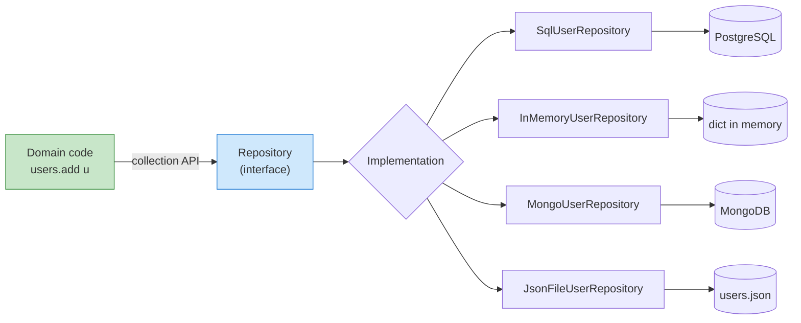
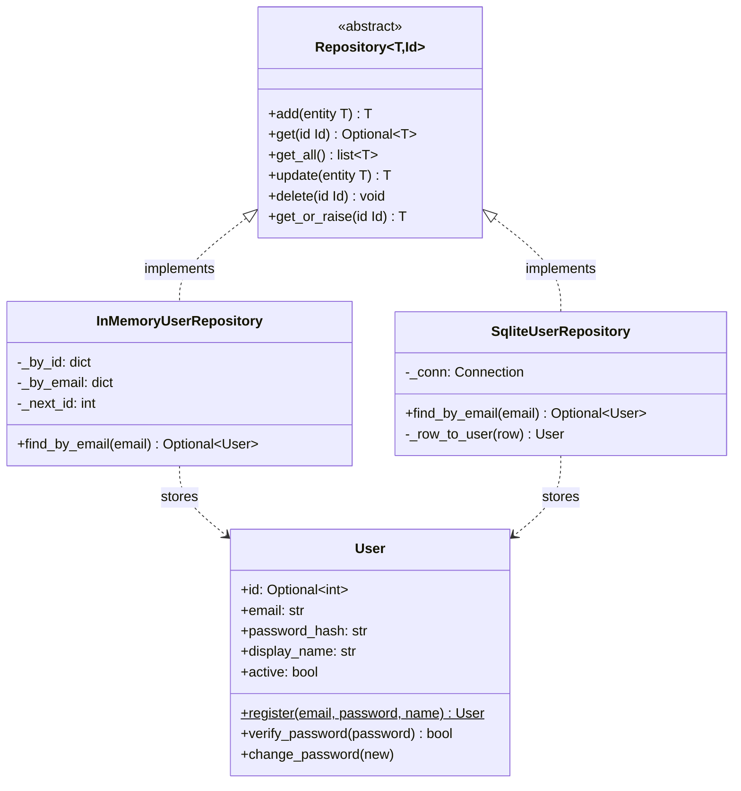
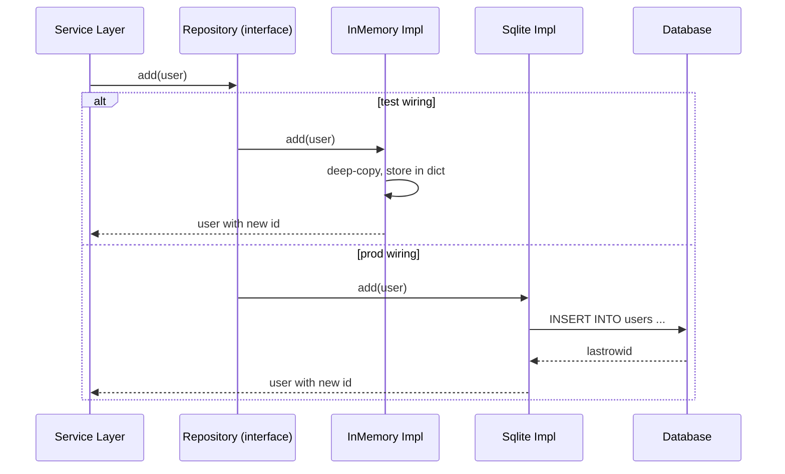
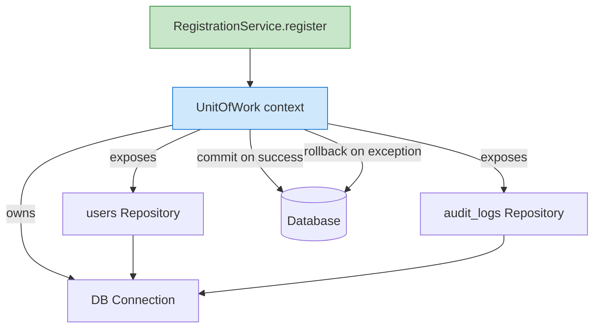
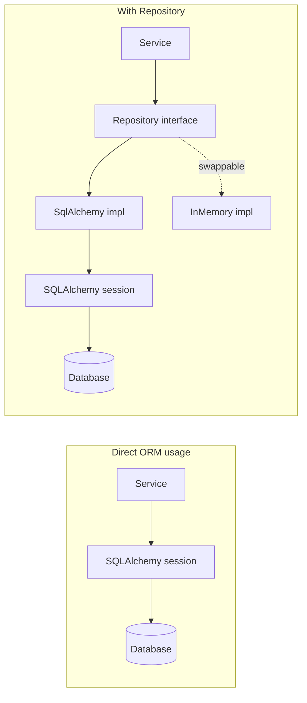
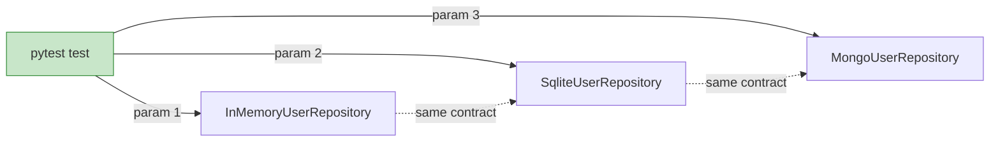

# Repository Pattern — Decoupling Domain Logic from Persistence

#oop #architecture #repository-pattern #persistence #unit-of-work #dependency-inversion #testing #teaching #deep-dive

> [!quote] Martin Fowler, PoEAA
> "Mediates between the domain and data mapping layers using a collection-like interface for accessing domain objects."

If MVC separates *what the app does* from *how it is shown*, the **Repository** separates *what the app does* from *where its data lives*. A repository lets you write `users.add(user)` and forget whether the user is stored in PostgreSQL, MongoDB, a YAML file, or a list in memory. That single act of forgetting is what makes your domain logic testable, portable, and survivable across technology churn.

This note covers the canonical Repository contract, a complete generic `Repository[T]` implementation, concrete SQL and in-memory adapters, the closely related **Unit of Work** pattern, and the honest trade-offs of when the pattern is overkill.

Prerequisite reading: [[Abstraction]], [[Dependency-Inversion]], [[Encapsulation]], [[Domain-Driven-Design]] (for aggregates).

---

## 1. The Problem the Repository Solves

Consider this perfectly readable Python service:

```python
def register_user(email: str, password: str) -> int:
    import sqlite3
    conn = sqlite3.connect("app.db")
    cur = conn.cursor()
    cur.execute("SELECT 1 FROM users WHERE email=?", (email,))
    if cur.fetchone():
        raise ValueError("email already registered")
    cur.execute(
        "INSERT INTO users(email, password_hash) VALUES (?, ?)",
        (email, hash_password(password)),
    )
    conn.commit()
    return cur.lastrowid
```

What's wrong with this? It looks fine — until you try to:

- **Test it.** You need a real `app.db` file or a mock of `sqlite3.connect`, and you have to remember to clean rows between tests.
- **Swap to PostgreSQL.** Every line that touches `sqlite3` must change. There might be hundreds of such functions.
- **Move the check elsewhere.** The "email already registered" rule is a *domain* concern, but it's wedged between SQL strings.
- **Use the function from a notebook or CLI.** It needs a database; you can't just call it.

The Repository pattern fixes all four problems by **interposing a collection-like interface** between the domain and the database. Domain code says `users.find_by_email(email)`; the database is hidden behind that call.



The interface is the **dependency-inversion pivot** (see [[Dependency-Inversion]]): domain depends on an abstraction, the database adapter implements that abstraction. The arrows of *use* and *implementation* point in opposite directions, which is exactly what gives you swappability.

---

## 2. The Canonical Repository Contract

A repository mimics an in-memory collection. The minimum surface is:

| Method | Returns | Semantics |
|---|---|---|
| `add(entity)` | the stored entity (with id assigned) | Insert a new aggregate; raises if already exists |
| `get(id)` | the entity or `None` / raises | Fetch one by identity |
| `get_all()` | `list[entity]` | Fetch all (or a page) |
| `update(entity)` | the updated entity | Save changes to an already-persisted entity |
| `delete(id)` | `None` | Remove by identity |
| `find_by_<field>(value)` | entity or `None` | Optional finder methods per domain need |

Two design choices are baked into this contract:

1. **Identity-based.** Repositories work in terms of aggregates identified by ID. They are *not* generic query engines — if you need ad-hoc queries with arbitrary `WHERE` clauses, you want a query object or an ORM directly, not a Repository.
2. **Collection-like.** `add` and `delete` mimic set operations. There is no `save()` that magically figures out insert-or-update; the caller knows which they mean. (Some implementations do include `save`, but Fowler argues against it.)

> [!info] Why "collection-like"?
> The point of mimicking a `set` is that the domain code shouldn't *feel* like it's using a database. `users.add(u)` reads identically to `set.add(u)`. The Repository is the illusion that your persisted data is just a Python collection — with all the persistence happening behind the curtain.

---

## 3. A Generic `Repository[T]` in Python

A generic repository captures the contract once and reuses it across aggregates. Here is a complete, type-safe implementation using `abc.ABC` and `typing.Generic`.

```python
from __future__ import annotations
from abc import ABC, abstractmethod
from dataclasses import dataclass, field
from typing import Self, Generic, TypeVar, Optional, Iterable
import copy

T = TypeVar("T")
Id = TypeVar("Id")

class Repository(ABC, Generic[T, Id]):
    """The abstract collection-like contract."""

    @abstractmethod
    @override
    def add(self, entity: T) -> Self: ...

    @abstractmethod
    @override
    def get(self, id_: Id) -> Optional[T]: ...

    @abstractmethod
    @override
    def get_all(self) -> list[T]: ...

    @abstractmethod
    @override
    def update(self, entity: T) -> Self: ...

    @abstractmethod
    @override
    def delete(self, id_: Id) -> Self: ...

    # Convenience non-abstract helpers
    @override
    def get_or_raise(self, id_: Id) -> Self:
        entity = self.get(id_)
        if entity is None:
            raise KeyError(f"{id_} not found")
        return entity
```

### 3.1 The Domain Model

The repository works over a domain model. For this example, a `User` aggregate (see [[Domain-Driven-Design]] for the full vocabulary):

```python
import hashlib, secrets

@dataclass
class User:
    id: Optional[int] = None
    email: str = ""
    password_hash: str = ""
    display_name: str = ""
    active: bool = True

    # Factory method enforces invariants at creation time
    @classmethod
    def register(cls, email: str, password: str, display_name: str = "") -> Self:
        if "@" not in email:
            raise ValueError(f"invalid email: {email}")
        if len(password) < 8:
            raise ValueError("password must be at least 8 chars")
        return cls(
            email=email.lower().strip(),
            password_hash=_hash_password(password),
            display_name=display_name or email.split("@")[0],
        )

    @override
    def verify_password(self, password: str) -> bool:
        return _constant_time_eq(self.password_hash, _hash_password(password))

    @override
    def change_password(self, new_password: str) -> Self:
        if len(new_password) < 8:
            raise ValueError("password must be at least 8 chars")
        self.password_hash = _hash_password(new_password)


def _hash_password(password: str) -> str:
    salt = secrets.token_hex(8)
    digest = hashlib.sha256(f"{salt}{password}".encode()).hexdigest()
    return f"{salt}${digest}"

def _constant_time_eq(a: str, b: str) -> bool:
    return secrets.compare_digest(a.encode(), b.encode())
```

Note that `User` has **no** persistence concerns — no `save()`, no SQL. It is pure domain logic. That is the whole point.

### 3.2 An In-Memory Repository

The simplest possible concrete repository, perfect for testing:

```python
class InMemoryUserRepository(Repository[User, int]):
    def __init__(self) -> Self:
        self._by_id: dict[int, User] = {}
        self._by_email: dict[str, int] = {}
        self._next_id: int = 1

    @override
    def add(self, entity: User) -> Self:
        if entity.email in self._by_email:
            raise ValueError(f"email {entity.email} already exists")
        entity.id = self._next_id
        self._next_id += 1
        # store a deep copy so callers can't mutate stored state accidentally
        self._by_id[entity.id] = copy.deepcopy(entity)
        self._by_email[entity.email] = entity.id
        return copy.deepcopy(entity)

    @override
    def get(self, id_: int) -> Optional[User]:
        entity = self._by_id.get(id_)
        return copy.deepcopy(entity) if entity else None

    @override
    def get_all(self) -> list[User]:
        return [copy.deepcopy(u) for u in self._by_id.values()]

    @override
    def update(self, entity: User) -> Self:
        if entity.id not in self._by_id:
            raise KeyError(f"user {entity.id} not found")
        existing = self._by_id[entity.id]
        if existing.email != entity.email and entity.email in self._by_email:
            raise ValueError(f"email {entity.email} already in use")
        # maintain email index if email changed
        if existing.email != entity.email:
            del self._by_email[existing.email]
            self._by_email[entity.email] = entity.id
        self._by_id[entity.id] = copy.deepcopy(entity)
        return copy.deepcopy(entity)

    @override
    def delete(self, id_: int) -> Self:
        entity = self._by_id.pop(id_, None)
        if entity:
            del self._by_email[entity.email]

    # Domain-specific finder — repos usually have a few
    @override
    def find_by_email(self, email: str) -> Optional[User]:
        id_ = self._by_email.get(email.lower().strip())
        return self.get(id_) if id_ else None
```

Three implementation details matter:

1. **Deep copies on the way in and out.** Without this, a caller mutates a User object and silently corrupts the in-memory store — a classic bug. For production SQL repos this isn't needed because the database round-trip serialises the data.
2. **Email uniqueness is enforced as a secondary index.** This is a domain rule that happens to need a uniqueness constraint — the repo is the natural place to enforce it when there's no DB.
3. **Finders are explicit.** `find_by_email` is not part of the generic contract; it's added because the domain needs it. Repos often grow 3–5 such finders.

### 3.3 A SQL Repository

```python
import sqlite3

class SqliteUserRepository(Repository[User, int]):
    def __init__(self, conn: sqlite3.Connection) -> Self:
        self._conn = conn
        self._conn.execute("""
            CREATE TABLE IF NOT EXISTS users (
                id INTEGER PRIMARY KEY AUTOINCREMENT,
                email TEXT UNIQUE NOT NULL,
                password_hash TEXT NOT NULL,
                display_name TEXT NOT NULL,
                active INTEGER NOT NULL DEFAULT 1
            )
        """)
        self._conn.commit()

    @override
    def _row_to_user(self, row) -> Self:
        return User(
            id=row["id"],
            email=row["email"],
            password_hash=row["password_hash"],
            display_name=row["display_name"],
            active=bool(row["active"]),
        )

    @override
    def add(self, entity: User) -> Self:
        cur = self._conn.execute(
            "INSERT INTO users(email, password_hash, display_name, active) "
            "VALUES (?, ?, ?, ?)",
            (entity.email, entity.password_hash, entity.display_name, int(entity.active)),
        )
        self._conn.commit()
        entity.id = cur.lastrowid
        return entity

    @override
    def get(self, id_: int) -> Optional[User]:
        cur = self._conn.execute(
            "SELECT * FROM users WHERE id = ?", (id_,),
        )
        row = cur.fetchone()
        return self._row_to_user(row) if row else None

    @override
    def get_all(self) -> list[User]:
        cur = self._conn.execute("SELECT * FROM users ORDER BY id")
        return [self._row_to_user(r) for r in cur.fetchall()]

    @override
    def update(self, entity: User) -> Self:
        self._conn.execute(
            "UPDATE users SET email=?, password_hash=?, display_name=?, active=? "
            "WHERE id=?",
            (entity.email, entity.password_hash, entity.display_name,
             int(entity.active), entity.id),
        )
        self._conn.commit()
        return entity

    @override
    def delete(self, id_: int) -> Self:
        self._conn.execute("DELETE FROM users WHERE id = ?", (id_,))
        self._conn.commit()

    @override
    def find_by_email(self, email: str) -> Optional[User]:
        cur = self._conn.execute(
            "SELECT * FROM users WHERE email = ?", (email.lower().strip(),),
        )
        row = cur.fetchone()
        return self._row_to_user(row) if row else None
```

The `InMemoryUserRepository` and `SqliteUserRepository` expose **identical** APIs. Domain code that uses one can be pointed at the other by changing a single line of wiring.

---

## 4. Class Diagram



The two arrows from the abstract `Repository` to its implementations are *realisation*; the dotted arrows to `User` are *dependency*. Note that `User` is independent of either repository — the dependency arrows point only one way.

---

## 5. Data Flow Through a Repository



The Service Layer (see [[Service-Layer]]) never knows which implementation it's talking to. The *only* thing that changes between test and prod is the wiring at the top of the program:

```python
# Production wiring
def prod_user_service() -> Self:
    conn = sqlite3.connect("app.db")
    return UserService(SqliteUserRepository(conn))

# Test wiring
def make_test_user_service() -> Self:
    return UserService(InMemoryUserRepository())
```

That two-line difference is the entire point of the pattern.

---

## 6. The Unit of Work Pattern

Repositories solve the *single-aggregate* problem. But many business transactions span several aggregates: "register user, create empty cart, write audit log entry" must succeed or fail atomically. The **Unit of Work** pattern (also from Fowler, PoEAA) wraps a transaction and coordinates multiple repositories within it.

```python
from contextlib import contextmanager

class UnitOfWork:
    """A transactional scope that owns a connection and several repos."""

    def __init__(self, conn: sqlite3.Connection):
        self._conn = conn
        self.users = SqliteUserRepository(conn)
        self.audit_logs = SqliteAuditLogRepository(conn)
        self._snapshot = None

    @override
    def __enter__(self) -> Self:
        # Disable autocommit-style behavior; SQLite needs explicit BEGIN
        self._conn.execute("BEGIN")
        return self

    @override
    def __exit__(self, exc_type, exc, tb) -> Self:
        if exc_type is None:
            self._conn.commit()
        else:
            self._conn.rollback()
```

Usage from a service:

```python
class RegistrationService:
    def __init__(self, uow_factory):
        self._uow_factory = uow_factory

    @override
    def register(self, email: str, password: str) -> Self:
        user = User.register(email, password)
        with self._uow_factory() as uow:        # begins transaction
            if uow.users.find_by_email(user.email):
                raise ValueError("email already registered")
            uow.users.add(user)
            uow.audit_logs.add(f"user {user.email} registered")
            # COMMIT happens at the end of the `with` block, automatically.
            # If any line raised, the whole transaction rolls back.
        return user
```

The Unit of Work gives you:

- **Atomicicity** — either both the user and the audit log entry land, or neither does.
- **Single connection** — shared by all repositories within the transaction.
- **Implicit rollback on exceptions** — no manual `try/except/rollback` boilerplate.



> [!tip] Teaching Tip
> Show students a registration that throws *after* the user has been added but *before* the audit log entry. Without a Unit of Work, the user exists in the DB but the audit row is missing — a real consistency bug. With a Unit of Work, both vanish on rollback. This is the most visceral demonstration of the pattern's value.

---

## 7. Repository vs Direct ORM Usage

The most common pushback against the Repository pattern is: *"SQLAlchemy (or Django ORM, or Hibernate) is already an abstraction — why add another?"* It's a fair question. Let's compare honestly.



### 7.1 When Direct ORM Is Enough

- **Simple CRUD apps.** If your service is `select * from users where id=?` and `insert into users (...)`, the ORM *is* the repository. Adding another layer is ceremony.
- **Single storage technology forever.** If you will never leave PostgreSQL, the ORM's abstraction is sufficient.
- **Rapid prototyping.** Repositories pay off over months; for a weekend hack, they are noise.

### 7.2 When the Repository Wins

- **Multiple data sources.** Read from Redis cache, fall back to PostgreSQL, write to Kafka — all behind one interface.
- **Testability without a database.** In-memory repositories make domain tests lightning-fast (no I/O, no fixtures) and trivially parallel (no shared state).
- **Storage migrations.** Moving from a YAML file to SQLite to PostgreSQL is a one-implementation change, not a sweep of every query in the codebase.
- **DDD aggregates.** When persistence boundaries must align with aggregate boundaries (see [[Domain-Driven-Design]]), the Repository enforces the rule that you fetch and store whole aggregates, never their inner parts.
- **Hexagonal/Clean architecture.** The Repository port is what makes the application core technology-agnostic (see [[Hexagonal-Architecture]]).

### 7.3 Honest Trade-off Table

| Criterion | Direct ORM | Repository |
|---|---|---|
| Lines of code | Fewer | More (an extra layer) |
| Test setup | Needs DB or mocking | In-memory repo, no DB |
| Query flexibility | Full ORM power | Limited to repo methods |
| Migration cost | Touches every query | Touches one class |
| Conceptual overhead | Lower | Higher |
| Best for | CRUD, single-tech, small teams | Domain-heavy, multi-tech, long-lived |

> [!warning] Common Student Misconception
> "The Repository pattern *replaces* the ORM." It does not. In production, your `SqlUserRepository` will *use* SQLAlchemy or Django's ORM internally. The Repository is a *domain-facing abstraction over the ORM*, not a replacement for it.

---

## 8. Testing With Repositories

The Repository pattern's biggest practical win is **fast, deterministic tests**. Because the in-memory repository behaves identically to the SQL one, you can test all of your domain and service code with no database, no fixtures, no Docker, no parallel-test headaches.

### 8.1 A Domain Test

```python
import pytest

@pytest.fixture
def repo():
    return InMemoryUserRepository()

def test_register_then_get_roundtrip(repo):
    user = User.register("alice@example.com", "supersecret")
    saved = repo.add(user)
    fetched = repo.get(saved.id)
    assert fetched is not None
    assert fetched.email == "alice@example.com"
    assert fetched.verify_password("supersecret")

def test_duplicate_email_raises(repo):
    repo.add(User.register("bob@example.com", "hunter2222"))
    with pytest.raises(ValueError, match="already exists"):
        repo.add(User.register("bob@example.com", "anotherpass"))

def test_update_preserves_id_but_changes_email(repo):
    user = repo.add(User.register("carol@example.com", "longpassword"))
    user.email = "carol2@example.com"
    updated = repo.update(user)
    assert updated.id == user.id
    assert updated.email == "carol2@example.com"
    # Old email must be free for re-use
    assert repo.find_by_email("carol@example.com") is None
    assert repo.find_by_email("carol2@example.com") is not None

def test_delete_removes_indexes(repo):
    user = repo.add(User.register("dave@example.com", "longpassword"))
    repo.delete(user.id)
    assert repo.get(user.id) is None
    assert repo.find_by_email(user.email) is None
```

### 8.2 A Service Test That Doesn't Care Which Repository

```python
class UserService:
    def __init__(self, repo: Repository[User, int]):
        self._repo = repo

    @override
    def register(self, email: str, password: str) -> Self:
        if self._repo.find_by_email(email):
            raise ValueError("email already registered")
        return self._repo.add(User.register(email, password))

# The test never mentions SQLite, never opens a file:
def test_service_rejects_duplicate_email():
    service = UserService(InMemoryUserRepository())
    service.register("eve@example.com", "longpassword")
    with pytest.raises(ValueError):
        service.register("eve@example.com", "differentpass")
```

### 8.3 The Same Test Against SQL

If you also want a smoke test that the SQL repository behaves the same way, parameterise the fixture:

```python
@pytest.fixture(params=["memory", "sqlite"])
def repo(request):
    if request.param == "memory":
        return InMemoryUserRepository()
    conn = sqlite3.connect(":memory:")
    conn.row_factory = sqlite3.Row
    return SqliteUserRepository(conn)

# Now every test runs twice — once in memory, once in SQLite.
# If they ever diverge, the SQL implementation has a bug.
```

This is a beautiful property: **the abstract contract is testable independently of the implementation**. You can't do this with raw ORM calls because each call is SQL-shaped.



---

## 9. Real-World Implementations

Several mainstream frameworks embed Repository ideas, sometimes under different names:

| Framework | Repository-like surface | Notes |
|---|---|---|
| **Django ORM** | `Model.objects` (Manager) | `.get()`, `.filter()`, `.create()`, `.delete()` — collection-like, but tied to the model class, not an interface |
| **SQLAlchemy** | `Session.query(...)`, `Session.add(...)` | Generic, but the session is also a Unit of Work |
| **Hibernate (Java)** | `@Repository`-annotated DAOs | Spring's stereotype; conventions wrap `EntityManager` |
| **Entity Framework Core** | `DbSet<T>` | Collection-like; `Add`, `Find`, `Remove` |
| **Spring Data** | `interface UserRepository extends JpaRepository<User, Long>` | Interface-only; Spring generates the implementation at startup — *the closest mainstream thing to the textbook Repository* |
| **MongoEngine** | `Document.objects` | Same pattern as Django's manager |

The most faithful realisation is **Spring Data**: you declare an interface with finder methods named `findByEmail` or `findByActiveTrueOrderByIdDesc`, and Spring generates the SQL at startup. Python's closest equivalent is the `Repository` pattern *manually* implemented, as in this note.

---

## 10. When NOT to Use the Repository Pattern

The Repository is not free. Don't use it when:

1. **The app is pure CRUD.** If every operation is "list rows, edit one row, save row", the ORM already does this. Adding a Repository layer doubles the surface area without adding capability.
2. **You need complex queries that don't map to aggregates.** Reporting queries that join five tables and aggregate counts are not "find an aggregate by id" operations. They belong in a query object or a view layer, not a Repository.
3. **The team is small and the tech stack is stable.** The Repository's payoff is *swap-ability* and *testability*; if neither is at risk, the layer is overhead.
4. **You'd be wrapping the ORM with a 1:1 pass-through.** If your `SqlUserRepository.add(user)` is literally `session.add(user); session.commit()`, and there are no other implementations, the Repository is a ceremony.
5. **Performance is critical and you need DB-specific tricks.** Bulk inserts, window functions, CTEs, and partial updates sometimes need to leak through. A Repository that hides them forces you to either lose them or break the abstraction.

> [!danger] Common Student Misconception
> "Every class needs a Repository." No. Repositories serve **aggregates**, not tables and not individual classes. If you have `Order` and `OrderItem` where `OrderItem` only makes sense inside an `Order`, there is one repository — `OrderRepository` — and `OrderItem` is loaded and saved through it. See [[Domain-Driven-Design]].

---

## 11. Common Implementation Pitfalls

### 11.1 Leaking ORM Types Through the Interface

```python
# BAD — interface returns SQLAlchemy User model
class IUserRepository(ABC):
    @abstractmethod
    @override
    def get(self, id_: int) -> Self: ...
```

Now every caller, including the domain layer, depends on SQLAlchemy. The Repository isn't doing its job. Always return domain types.

### 11.2 Returning Live ORM-Tracked Objects

When you use SQLAlchemy, the returned object is *tracked* by the session — mutating it silently mutates the database. This breaks the collection-like illusion. Either `session.expunge(obj)` before returning, or convert to a separate domain object (DTO).

### 11.3 Mixing Query and Mutation in One Call

```python
# BAD — surprising side effects
def get_or_create_by_email(self, email: str) -> Self: ...
```

A "get" that also creates violates the principle of least surprise. Keep reads and writes clearly separate.

### 11.4 Generic Repository With Too Many Finders

`Repository[T]` is fine for the five core methods. But if every aggregate needs `find_by_email`, `find_by_created_at`, `find_by_status`, you either make the generic interface huge (and lie about being generic) or you make per-aggregate repositories that subclass and add finders. The latter is usually cleaner.

### 11.5 No Transaction Boundary

A Repository per aggregate with no Unit of Work means every `add`/`update` auto-commits. Multi-step operations can leave the database in a half-written state. Always pair Repository with Unit of Work for anything beyond trivial apps.

---

## 12. Putting It All Together — A Minimal Full Example

```python
# domain.py
@dataclass
class User:
    # ... (as in §3.1)

# repositories.py
class Repository(ABC, Generic[T, Id]):
    # ... (as in §3)

class InMemoryUserRepository(Repository[User, int]):
    # ... (as in §3.2)

class SqliteUserRepository(Repository[User, int]):
    # ... (as in §3.3)

# services.py
class UserService:
    def __init__(self, repo: Repository[User, int]):
        self._repo = repo

    @override
    def register(self, email: str, password: str) -> Self:
        if self._repo.find_by_email(email):
            raise ValueError("already registered")
        return self._repo.add(User.register(email, password))

    @override
    def authenticate(self, email: str, password: str) -> Self:
        user = self._repo.find_by_email(email)
        if not user or not user.verify_password(password):
            raise PermissionError("invalid credentials")
        if not user.active:
            raise PermissionError("account disabled")
        return user

    @override
    def change_password(self, user_id: int, new_password: str) -> Self:
        user = self._repo.get_or_raise(user_id)
        user.change_password(new_password)
        self._repo.update(user)

# wiring.py — choose implementation per environment
def make_service(env: str = "prod") -> Self:
    if env == "test":
        return UserService(InMemoryUserRepository())
    conn = sqlite3.connect("app.db")
    conn.row_factory = sqlite3.Row
    return UserService(SqliteUserRepository(conn))

# main.py
if __name__ == "__main__":
    svc = make_service("prod")
    alice = svc.register("alice@example.com", "supersecret")
    print(f"registered alice: id={alice.id}")
```

This is a complete, runnable slice: domain model, abstract repository, two implementations, a service, and wiring that switches between them. The entire domain + service layer can be tested without ever touching SQLite.

---

## 13. Step-by-Step Refactoring Walkthrough

To fully grasp the power of the Repository pattern, it helps to see code evolve from tightly coupled chaos to cleanly separated architecture. Here is a guided walkthrough.

### Phase 1: The Coupled "Big Ball of Mud"

Imagine starting with a simple Flask route. Everything is tangled together: web parsing, domain logic, SQL execution.

```python
@app.route("/users/register", methods=["POST"])
def register_user():
    data = request.json
    email = data.get("email")
    password = data.get("password")
    
    # 1. Domain logic mixed with web logic
    if "@" not in email:
        return {"error": "Invalid email"}, 400
        
    import sqlite3
    conn = sqlite3.connect("app.db")
    cur = conn.cursor()
    
    # 2. SQL logic mixed with domain logic
    cur.execute("SELECT 1 FROM users WHERE email=?", (email,))
    if cur.fetchone():
        return {"error": "Email taken"}, 400
        
    hashed_password = hash_password(password)
    cur.execute(
        "INSERT INTO users(email, password_hash) VALUES (?, ?)",
        (email, hashed_password)
    )
    conn.commit()
    
    return {"id": cur.lastrowid, "email": email}, 201
```

**The Pain Points:** You can't test this without spinning up a Flask test client and a real SQLite database.

### Phase 2: Extracting the Domain

First, extract the domain logic into a `User` entity so that business rules (like email validation and hashing) live independently.

```python
# domain.py
class User:
    def __init__(self, email, password_hash=None):
        if "@" not in email:
            raise ValueError("Invalid email")
        self.email = email
        self.password_hash = password_hash or hash_password("password")
```

Now, the route looks cleaner but still has raw SQL.

### Phase 3: Introducing the Repository Interface

Create the `Repository` contract that abstract away the data access. 

```python
# repositories.py
class UserRepository(ABC):
    @abstractmethod
    @override
    def add(self, user: User) -> Self: ...
    
    @abstractmethod
    @override
    def find_by_email(self, email: str) -> Optional[User]: ...
```

Then create the concrete SQLite implementation.

```python
class SqliteUserRepository(UserRepository):
    def __init__(self, conn):
        self.conn = conn
        
    @override
    def find_by_email(self, email: str) -> Optional[User]:
        cur = self.conn.execute("SELECT * FROM users WHERE email=?", (email,))
        row = cur.fetchone()
        return User(row["email"], row["password_hash"]) if row else None
        
    @override
    def add(self, user: User) -> Self:
        self.conn.execute("INSERT INTO users(email, password_hash) VALUES (?, ?)",
                          (user.email, user.password_hash))
        self.conn.commit()
        return user
```

### Phase 4: The Service Layer and Dependency Injection

We wrap the repository calls in a Service Layer, removing business coordination from the web route.

```python
# services.py
class RegistrationService:
    def __init__(self, repo: UserRepository):
        self.repo = repo
        
    @override
    def register(self, email, password) -> Self:
        user = User(email, hash_password(password))
        if self.repo.find_by_email(email):
            raise ValueError("Email taken")
        return self.repo.add(user)
```

Finally, the web route simply wires these together (or uses a dependency injection container).

```python
# web.py
@app.route("/users/register", methods=["POST"])
def register_user():
    # Wiring (in real apps, done at app startup or via DI)
    conn = sqlite3.connect("app.db")
    repo = SqliteUserRepository(conn)
    service = RegistrationService(repo)
    
    try:
        user = service.register(request.json["email"], request.json["password"])
        return {"email": user.email}, 201
    except ValueError as e:
        return {"error": str(e)}, 400
```

**The Win:** The `RegistrationService` is now 100% database-agnostic. To test it, pass in an `InMemoryUserRepository`. The route is now only responsible for HTTP parsing. You have successfully decoupled your system.

---

## 14. Decorating Repositories — Caching, Logging, Tracing

Because the Repository contract is a plain interface, you can wrap any implementation with a *decorator* that adds cross-cutting behaviour. This is one of the most under-used wins of the pattern — you get caching, metrics, retries, or access control without touching the domain code or the SQL adapter.

```python
import time, logging
from functools import wraps

log = logging.getLogger(__name__)

class CachingUserRepository(Repository[User, int]):
    """Wraps another repository; caches `get` and `find_by_email`."""

    def __init__(self, inner: Repository[User, int], ttl_seconds: float = 30.0):
        self._inner = inner
        self._ttl = ttl_seconds
        self._cache: dict[int, tuple[float, User]] = {}
        self._email_cache: dict[str, tuple[float, User]] = {}

    @override
    def _fresh(self, entry):
        if entry is None:
            return None
        ts, value = entry
        if time.monotonic() - ts > self._ttl:
            return None
        return value

    @override
    def get(self, id_: int):
        cached = self._fresh(self._cache.get(id_))
        if cached is not None:
            return cached
        value = self._inner.get(id_)
        if value is not None:
            self._cache[id_] = (time.monotonic(), value)
        return value

    @override
    def find_by_email(self, email: str):
        cached = self._fresh(self._email_cache.get(email))
        if cached is not None:
            return cached
        value = self._inner.find_by_email(email)
        if value is not None:
            self._email_cache[email] = (time.monotonic(), value)
        return value

    @override
    def add(self, entity: User) -> Self:
        result = self._inner.add(entity)
        self._cache[result.id] = (time.monotonic(), result)
        self._email_cache[result.email] = (time.monotonic(), result)
        return result

    @override
    def update(self, entity: User) -> Self:
        result = self._inner.update(entity)
        # Invalidate stale entries; we could also refresh them.
        self._cache.pop(result.id, None)
        self._email_cache.pop(result.email, None)
        return result

    @override
    def delete(self, id_: int) -> Self:
        existing = self._inner.get(id_)
        self._inner.delete(id_)
        self._cache.pop(id_, None)
        if existing:
            self._email_cache.pop(existing.email, None)

    @override
    def get_all(self) -> list[User]:
        # Don't cache list queries — they're usually cheap and freshness matters
        return self._inner.get_all()
```

Now production wiring becomes a stack:

```python
def make_service(env: str = "prod") -> Self:
    if env == "test":
        return UserService(InMemoryUserRepository())
    conn = sqlite3.connect("app.db")
    conn.row_factory = sqlite3.Row
    base = SqliteUserRepository(conn)
    cached = CachingUserRepository(base, ttl_seconds=30)
    return UserService(cached)
```

The domain service still calls `users.get(id)` — it has no idea a Redis-like cache sits in front. That's the *decorator pattern* (see [[Structural-Patterns]]) applied at the architectural scale. You can stack as many decorators as you need: `LoggingUserRepository(CachingUserRepository(SqliteUserRepository(conn)))`.

> [!tip] Teaching Tip
> After students are comfortable with one Repository implementation, ask them to add a "logging decorator" that prints each method call with its arguments and latency. The exercise reinforces two things at once: the Decorator pattern from [[Structural-Patterns]] and the architectural value of programming to an interface.

---

## 15. A Word on CQRS

A common evolution beyond Repository is **CQRS** (Command Query Responsibility Segregation): split the read side (queries that return data) from the write side (commands that change state). Repositories are inherently *read+write*; CQRS replaces them with a Query object (or read model) for reads and a Command Handler for writes.

| Aspect | Repository | CQRS |
|---|---|---|
| Read path | `get`, `get_all`, `find_by_*` | Dedicated query objects, possibly against a denormalised read model |
| Write path | `add`, `update`, `delete` | Command handlers writing through a Repository or aggregate |
| Best for | Aggregates that fit a collection metaphor | High-read-throughput systems where read and write shapes diverge |
| Complexity | Moderate | Higher — usually needs eventual consistency |

Most applications do not need CQRS. The Repository is sufficient up to a few thousand requests per second, and even then, a caching decorator (§13) often buys more than a full CQRS rewrite. Reach for CQRS when your read shape (denormalised dashboard) and write shape (normalised transactions) genuinely diverge.

---

## 16. Key Takeaways

1. **A Repository is a collection-like interface** that decouples domain logic from persistence. Domain code says `users.add(u)`, never `INSERT INTO users ...`.
2. **The contract is small**: `add`, `get`, `get_all`, `update`, `delete`, plus a few domain-specific finders.
3. **Generic `Repository[T, Id]` captures the contract once**; per-aggregate subclasses add the finders they need.
4. **The Unit of Work pattern coordinates multiple repositories inside a transaction** — atomic, single-connection, auto-rollback on error.
5. **An in-memory implementation is the killer feature**: it makes domain tests fast, deterministic, and parallel-friendly.
6. **The Repository wraps the ORM, it doesn't replace it.** Production repos use SQLAlchemy/Django ORM internally.
7. **Don't use Repositories for** pure CRUD, complex reporting queries, or when the team is small and the tech is stable.

> [!success] Teaching Tip
> The single most powerful exercise for the Repository pattern is *the migration drill*: have students write a service against an `InMemoryUserRepository`, then announce mid-lesson that they need to swap to SQLite. The pairs that built around the Repository interface finish in five minutes; the pairs that used raw `sqlite3` calls spend the rest of the lesson rewriting. The pattern's value is felt, not explained.

### 16.1 Further Reading

- Martin Fowler, *Patterns of Enterprise Application Architecture* — the canonical source for both Repository and Unit of Work.
- Eric Evans, *Domain-Driven Design* — Repositories as the persistence story for aggregates; see [[Domain-Driven-Design]].
- [[Hexagonal-Architecture]] — Repositories as *driven adapters* behind a port.
- [[Service-Layer]] — the natural consumer of Repositories.
- [[Dependency-Inversion]] — the SOLID principle the Repository embodies.
- Spring Data documentation — the most faithful industrial realisation of the pattern.
