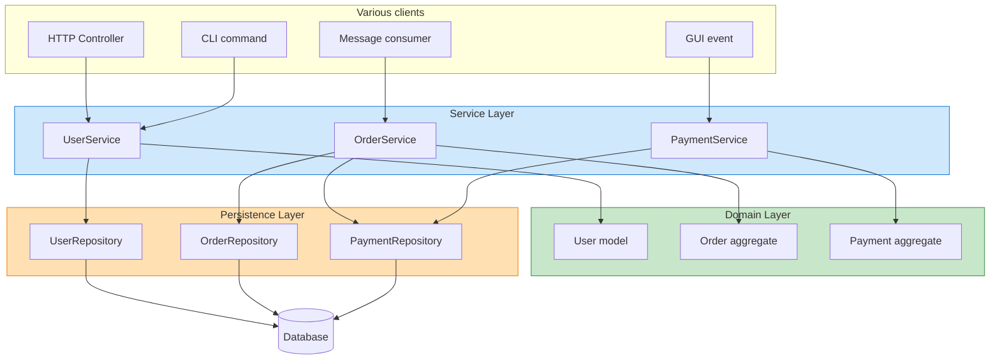
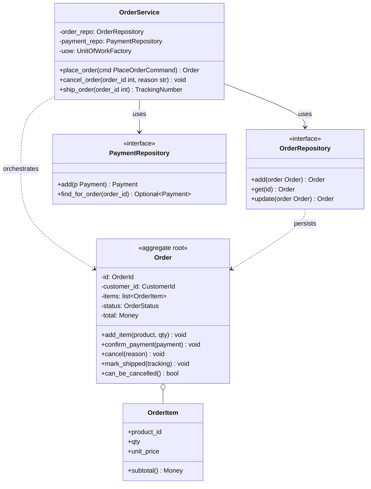
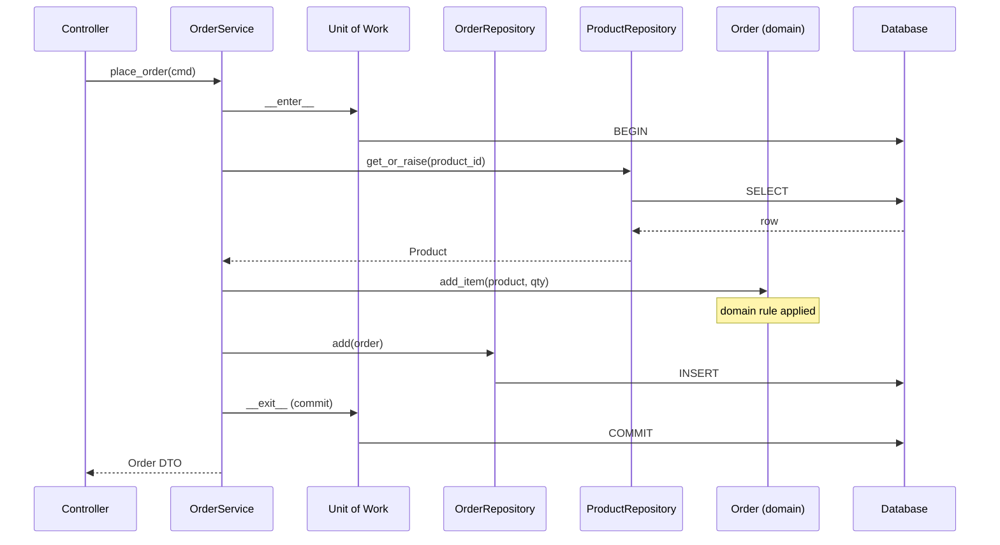
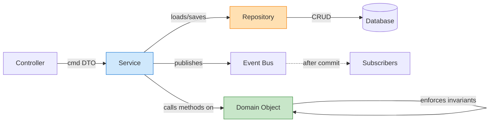
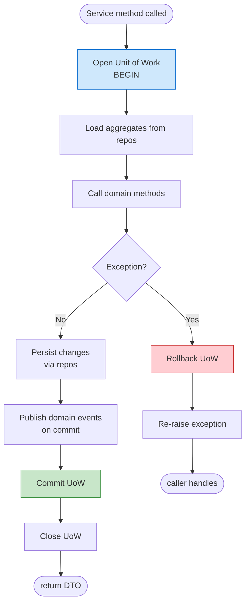
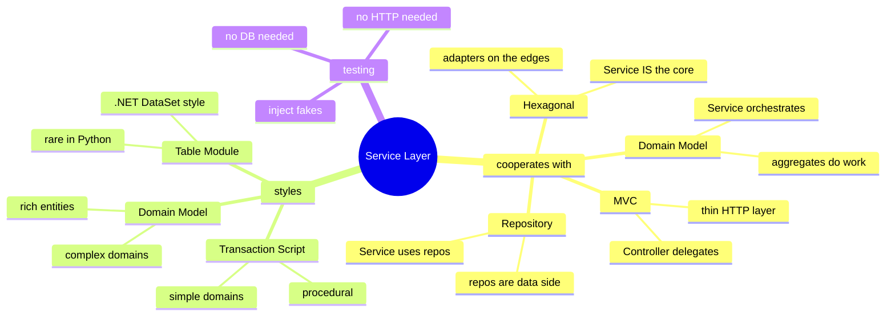

# Service Layer Pattern — The Boundary of Your Application

#oop #architecture #service-layer #transaction-script #domain-model #dto #fowler #teaching #deep-dive

> [!quote] Martin Fowler, PoEAA
> "Defines an application's boundary with a layer of services that establishes a set of available operations and coordinates the application's response in each operation."

When a web controller starts doing business logic, you have a fat controller. When a domain model starts knowing about HTTP, you have a leaky model. When a CLI script re-implements the same rules that your REST API uses, you have duplication. **The Service Layer is the architectural answer to all three problems.** It is the *single* place where use-cases live — a thin, explicit boundary that says "this is what the application *does*", with input translation on one side and persistence on the other.

This note covers what the Service Layer is, how it relates to MVC, Repositories, and the domain model, the two Fowler styles (Transaction Script vs Domain Model), DTOs, transaction boundaries, and the honest criteria for when the layer earns its keep.

Prerequisite reading: [[Repository-Pattern]], [[MVC-Pattern]], [[Domain-Driven-Design]] (aggregates), [[Single-Responsibility]].

---

## 1. What Is the Service Layer?

A **Service Layer** is a set of coarse-grained operations, each representing a *use case* of the application. Each operation:

1. Receives input from a client (HTTP request, CLI args, message queue payload, GUI event).
2. Loads or creates domain objects (using Repositories).
3. Asks those domain objects to do the work — *the service coordinates, the domain executes*.
4. Commits the transaction.
5. Returns output (a domain object, a DTO, or an ID).

The Service Layer is the *only* place in the codebase that knows about both: (a) the set of use-cases the application offers, and (b) the transactional/persistence machinery needed to execute them. Controllers, CLI handlers, and message consumers become *thin* — they translate their transport into a service call and translate the result back.



The crucial arrows are * Clients → Service* (any client, any transport) and *Service → Domain + Repository* (always the same direction). The Service Layer is the pivot that lets one use-case be invoked from N transports without duplication.

### 1.1 Origin

The pattern was named and catalogued by **Martin Fowler** in *Patterns of Enterprise Application Architecture* (2002). The idea, however, is older — it goes back to the **Application Service** concept from the *J2EE Blueprints* (circa 1999) and the *Session Facade* pattern from the same era. The need was always the same: EJB Entity Beans were a mess, and a "session" object was needed to coordinate them per use-case.

---

## 2. Why Service Layer?

### 2.1 Encapsulation of Use Cases

Without a Service Layer, the "register a new user" use-case is scattered across the HTTP controller, the email-sending helper, the audit logger, and the database access code. With a Service Layer, it lives in *one* method: `UserService.register(email, password)`. That method is the canonical, auditable, testable statement of what "register" means.

### 2.2 Multi-Client Support

A use case triggered by an HTTP `POST /register`, a CLI `./app register`, and an AMQP `user.signup` message should run identical logic. The Service Layer is the natural home; each transport provides a thin adapter that translates its input into the service call.

### 2.3 Transaction Boundary

Services are the natural unit of work. The Service method opens a transaction (or a Unit of Work, see [[Repository-Pattern]] §6), does the work, and commits or rolls back. Clients never see a half-applied transaction.

### 2.4 Testability

A service is a plain Python object with dependencies (repositories, clocks, emailers) injected. You can unit-test it with fake dependencies in milliseconds, with no HTTP server, no database, no message broker.

### 2.5 A Single Audit Surface

If you need to log every business operation, throttle by user, or apply role-based authorization, the Service Layer is the single point where those concerns can be applied uniformly — via decorators, middleware, or aspect-oriented hooks.

---

## 3. Service Layer vs Domain Layer

The most common confusion about the Service Layer is: *"Aren't services just where the business logic lives?"* — No. That is the Domain Layer's job. **The Service Layer coordinates; the Domain Layer does the work.**



The shape to internalise: **the Service has no business rules**. If `place_order` contains logic like "if customer is premium, apply 10% discount", that logic belongs on `Order` (as `apply_premium_discount_if_eligible(customer)`) or on a domain service (if the rule spans multiple aggregates). The Service merely calls it.

### 3.1 Where the Rule Goes — A Checklist

- **Rule about one entity's internal consistency?** → Method on the entity. Example: `Order.can_be_cancelled()`.
- **Rule that spans multiple aggregates but is stateless?** → Domain Service. Example: `PricingCalculator.discount_for(order, customer)`.
- **Orchestration of "load A, do something to it, save it, send an email"?** → Application Service. Example: `OrderService.cancel_order(...)`.

A good rule of thumb: if you can describe the rule in the domain's ubiquitous language (see [[Domain-Driven-Design]]) and it would still make sense in a different application (CLI tool, batch job, different transport), it's a domain concern. If it only makes sense as part of "this particular app's use case", it's an application service concern.

---

## 4. Two Fowler Styles: Transaction Script vs Domain Model

In *PoEAA*, Fowler distinguishes two styles of organizing the work inside a Service Layer.

### 4.1 Transaction Script

The service method *is* the procedure. It opens a transaction, runs the steps inline, commits. There is little or no domain object behaviour — entities are often just data holders (anemic).

```python
class RegistrationService:
    def __init__(self, conn):
        self._conn = conn

    @override
    def register(self, email: str, password: str) -> int:
        # 1. validate
        if "@" not in email or len(password) < 8:
            raise ValueError("invalid input")
        # 2. check duplicate
        cur = self._conn.execute(
            "SELECT 1 FROM users WHERE email=?", (email,)
        )
        if cur.fetchone():
            raise ValueError("email already registered")
        # 3. hash
        salt = secrets.token_hex(8)
        digest = hashlib.sha256(f"{salt}{password}".encode()).hexdigest()
        # 4. insert
        cur = self._conn.execute(
            "INSERT INTO users(email, password_hash) VALUES (?, ?)",
            (email, f"{salt}${digest}"),
        )
        self._conn.commit()
        # 5. send email
        send_welcome_email(email)
        return cur.lastrowid
```

**Pros:** obvious, easy to follow, low abstraction overhead. **Cons:** rules duplicated across scripts, hard to test in isolation, becomes a tangle as the app grows.

### 4.2 Domain Model

The service is *thin*. The actual rules live in rich domain objects (entities, value objects, aggregates, domain services). The service loads, calls a method, saves.

```python
class RegistrationService:
    def __init__(self, users: Repository[User, int], mailer: Mailer, uow):
        self._users = users
        self._mailer = mailer
        self._uow = uow

    @override
    def register(self, email: str, password: str) -> Self:
        with self._uow() as tx:
            if self._users.find_by_email(email):
                raise ValueError("email already registered")
            user = User.register(email, password)  # rule lives here
            self._users.add(user)
            self._mailer.send_welcome(user.email)
            # tx commits on exit
        return user
```

**Pros:** rules are reusable and testable, services stay short, the domain is the source of truth. **Cons:** more classes, more upfront design, harder for juniors to follow.

### 4.3 Choosing Between Them

| Criterion | Transaction Script | Domain Model |
|---|---|---|
| Domain complexity | Low (CRUD-like) | High (rich rules) |
| Code lifetime | Short, throwaway | Long-lived |
| Team OOP fluency | Junior | Mixed/senior |
| Number of use cases | Few | Many |
| Rules shared across use cases? | No | Yes |

Fowler's advice: **start with Transaction Script if the rules are simple;** refactor toward Domain Model when you find yourself copying rules between scripts. The third style he identifies — *Table Module* — is rare in Python and common in .NET (DataSets); we'll skip it here.

> [!info] The Anemic Domain Model Anti-Pattern
> Fowler also coined the term *Anemic Domain Model* — entities that have only getters and setters, with all behaviour in services. This is *not* the same as Transaction Script. Transaction Script is a deliberate choice for simple domains; Anemic Domain Model is what happens when you *intended* a rich domain model but ended up with bags of properties. See [[Domain-Driven-Design]] §6.

---

## 5. Service Interfaces and DTOs

### 5.1 Why DTOs?

A **DTO (Data Transfer Object)** is a serialisable structure designed for crossing a boundary — typically the application boundary. The Service Layer accepts and returns DTOs (or domain objects that are safe to expose) so that the transport layer can serialise them to JSON, XML, HTML form data, or whatever it speaks.

Without DTOs, the transport layer reaches into domain objects and accidentally serialises internals (password hashes, internal IDs, lazy-loaded relations). With DTOs, the contract is explicit.

### 5.2 Commands and Results

A common idiom is to model each use case's *input* as a Command object and its *output* as a Result object. Both are DTOs.

```python
from dataclasses import dataclass

@dataclass(frozen=True)
class RegisterUserCommand:
    email: str
    password: str
    display_name: str = ""

@dataclass(frozen=True)
class UserDTO:
    id: int
    email: str
    display_name: str

class UserService:
    def __init__(self, users, mailer, uow):
        self._users = users
        self._mailer = mailer
        self._uow = uow

    @override
    def register(self, cmd: RegisterUserCommand) -> Self:
        with self._uow():
            if self._users.find_by_email(cmd.email):
                raise ValueError("email already registered")
            user = User.register(cmd.email, cmd.password, cmd.display_name)
            self._users.add(user)
            self._mailer.send_welcome(user.email)
        return UserDTO(id=user.id, email=user.email, display_name=user.display_name)
```

The Controller now does almost nothing:

```python
@app.post("/users")
def http_register():
    cmd = RegisterUserCommand(
        email=request.json["email"],
        password=request.json["password"],
        display_name=request.json.get("display_name", ""),
    )
    try:
        user_dto = user_service.register(cmd)
    except ValueError as exc:
        return jsonify({"error": str(exc)}), 400
    return jsonify(user_dto.__dict__), 201
```

The same `user_service.register(cmd)` is callable from a CLI:

```python
def cli_register(args):
    cmd = RegisterUserCommand(email=args.email, password=args.password)
    dto = user_service.register(cmd)
    print(f"created user {dto.id}: {dto.email}")
```

…and from a message consumer:

```python
def on_signup_message(payload):
    cmd = RegisterUserCommand(**payload)
    user_service.register(cmd)
```

Three transports, one use case, zero duplication. That's the Service Layer payoff.

---

## 6. A Complete Example: `UserService`

```python
from __future__ import annotations
from dataclasses import dataclass
from typing import Self, Optional

# ---- DTOs --------------------------------------------------------------
@dataclass(frozen=True)
class RegisterUserCommand:
    email: str
    password: str
    display_name: str = ""

@dataclass(frozen=True)
class LoginCommand:
    email: str
    password: str

@dataclass(frozen=True)
class ChangePasswordCommand:
    user_id: int
    current_password: str
    new_password: str

@dataclass(frozen=True)
class AuthTokenDTO:
    token: str
    user_id: int
    expires_at: float

@dataclass(frozen=True)
class UserDTO:
    id: int
    email: str
    display_name: str
    active: bool

# ---- The service -------------------------------------------------------
class UserService:
    def __init__(self, users, tokens, mailer, clock, uow):
        self._users = users       # Repository[User, int]
        self._tokens = tokens     # Repository[AuthToken, str]
        self._mailer = mailer     # Mailer (port)
        self._clock = clock       # Clock (port) — for testable time
        self._uow = uow           # UnitOfWork factory

    @override
    def register(self, cmd: RegisterUserCommand) -> Self:
        with self._uow():
            if self._users.find_by_email(cmd.email):
                raise ValueError("email already registered")
            user = User.register(cmd.email, cmd.password, cmd.display_name)
            self._users.add(user)
            self._mailer.send_welcome(user.email)
        return self._to_dto(user)

    @override
    def login(self, cmd: LoginCommand) -> Self:
        with self._uow():
            user = self._users.find_by_email(cmd.email)
            if not user or not user.verify_password(cmd.password):
                # Same error for "no such user" and "wrong password" — security
                raise PermissionError("invalid credentials")
            if not user.active:
                raise PermissionError("account disabled")
            token = AuthToken.issue_for(user, expires_in=3600, clock=self._clock)
            self._tokens.add(token)
        return AuthTokenDTO(token.token, token.user_id, token.expires_at)

    @override
    def change_password(self, cmd: ChangePasswordCommand) -> Self:
        with self._uow():
            user = self._users.get_or_raise(cmd.user_id)
            if not user.verify_password(cmd.current_password):
                raise PermissionError("current password incorrect")
            user.change_password(cmd.new_password)   # rule lives on User
            self._users.update(user)
            self._mailer.send_password_changed(user.email)

    @override
    def deactivate(self, user_id: int) -> Self:
        with self._uow():
            user = self._users.get_or_raise(user_id)
            user.deactivate()                         # rule lives on User
            self._users.update(user)

    @staticmethod
    def _to_dto(user) -> Self:
        return UserDTO(
            id=user.id,
            email=user.email,
            display_name=user.display_name,
            active=user.active,
        )
```

Each method has the same skeleton: open a Unit of Work, load/validate, call a method on the domain object, persist, close. The business rules (`User.register`, `User.change_password`, `User.deactivate`) live on the domain object — the service merely orchestrates.

---

## 7. A Complete Example: `OrderService`

```python
@dataclass(frozen=True)
class PlaceOrderCommand:
    customer_id: int
    lines: list[tuple[int, int]]  # [(product_id, qty), ...]

@dataclass(frozen=True)
class CancelOrderCommand:
    order_id: int
    reason: str
    cancelled_by: int

class OrderService:
    def __init__(self, orders, products, customers, payments, uow, events):
        self._orders = orders
        self._products = products
        self._customers = customers
        self._payments = payments
        self._uow = uow
        self._events = events  # an event bus / publisher (port)

    @override
    def place_order(self, cmd: PlaceOrderCommand) -> Self:
        with self._uow() as tx:
            customer = self._customers.get_or_raise(cmd.customer_id)

            # Build the order through the aggregate's own factory
            order = Order.draft_for(customer)

            for product_id, qty in cmd.lines:
                product = self._products.get_or_raise(product_id)
                order.add_item(product, qty)  # domain rule: stock, price

            # Domain rule: minimum order total
            if order.total < Money("10.00"):
                raise ValueError("order below minimum")

            self._orders.add(order)

            # Domain event — published after commit (see DDD)
            tx.on_commit(lambda: self._events.publish(
                OrderPlaced(order.id, customer.id, order.total)
            ))
        return order

    @override
    def cancel_order(self, cmd: CancelOrderCommand) -> Self:
        with self._uow() as tx:
            order = self._orders.get_or_raise(cmd.order_id)
            # Domain rule: order.cancel enforces "can't cancel shipped"
            order.cancel(cmd.reason, cancelled_by=cmd.cancelled_by)
            self._orders.update(order)

            payment = self._payments.find_for_order(order.id)
            if payment is not None:
                payment.refund(reason=cmd.reason)  # domain rule
                self._payments.update(payment)

            tx.on_commit(lambda: self._events.publish(
                OrderCancelled(order.id, cmd.reason)
            ))

    @override
    def ship_order(self, order_id: int, tracking_number: str) -> Self:
        with self._uow():
            order = self._orders.get_or_raise(order_id)
            order.mark_shipped(tracking_number)
            self._orders.update(order)
```

Notice the discipline: every business rule (`add_item` checks stock, `cancel` checks status, `mark_shipped` checks payment) is on the `Order` aggregate (see [[Domain-Driven-Design]]). The Service merely wires repositories together, opens the transaction, and publishes events.

---

## 8. Request Flow Through a Service Layer



The Controller is one round-trip. The Service does several. The database only commits if every step succeeded. The domain rule (`add_item`) runs entirely in memory — it has no idea a database exists.

---

## 9. Service ↔ Repository ↔ Domain Relationship



Three one-way arrows: Controller → Service (use case invocation), Service → Repository (persistence), Service → Domain (business work). And one *outbound* event arrow (after commit) for notification. **The arrows never point the other way.** The domain never calls the service; the repository never calls the service; the database never calls the repository.

> [!warning] Common Student Misconception
> "Services call services which call services." This happens, but a service-to-service call is a *red flag*. It often means a rule spans two aggregates and should be extracted to a **domain service** (stateless, in the domain layer), not glued together in an application service. Endless service-of-service chains are the architectural equivalent of spaghetti code.

---

## 10. The Transaction Boundary



Three principles for transaction boundaries in a Service Layer:

1. **One transaction per use case.** The service method *is* the transaction. Don't open sub-transactions; if you need partial commits, you have two use cases.
2. **Commit at the boundary, never inside domain code.** Domain objects should not know transactions exist. They just mutate state; the service commits.
3. **Publish events after commit, never before.** If you publish `OrderPlaced` before the COMMIT and the commit then fails, subscribers will have reacted to an order that doesn't exist. Use the Unit of Work's `on_commit` hook (or an outbox) to defer publication.

---

## 11. Testing the Service Layer

The Service Layer is one of the easiest parts of a system to test, because all its dependencies are injected ports. Replace each with a fake and you can exercise the full use case in milliseconds.

```python
import pytest
from datetime import timedelta

class FakeMailer:
    def __init__(self):
        self.sent = []
    @override
    def send_welcome(self, email):
        self.sent.append(("welcome", email))
    @override
    def send_password_changed(self, email):
        self.sent.append(("password_changed", email))

class FakeClock:
    def __init__(self, start=0.0):
        self.now = start
    @override
    def advance(self, seconds):
        self.now += seconds

@pytest.fixture
def service():
    users = InMemoryUserRepository()
    tokens = InMemoryTokenRepository()
    mailer = FakeMailer()
    clock = FakeClock()
    uow = InMemoryUnitOfWork()
    return UserService(users, tokens, mailer, clock, uow)

def test_register_sends_welcome_email(service):
    dto = service.register(RegisterUserCommand("a@b.com", "longpassword"))
    assert dto.email == "a@b.com"
    assert service._mailer.sent == [("welcome", "a@b.com")]

def test_login_with_wrong_password_fails(service):
    service.register(RegisterUserCommand("a@b.com", "longpassword"))
    with pytest.raises(PermissionError):
        service.login(LoginCommand("a@b.com", "wrongpassword"))

def test_change_password_requires_current_password(service):
    dto = service.register(RegisterUserCommand("a@b.com", "longpassword"))
    with pytest.raises(PermissionError):
        service.change_password(ChangePasswordCommand(
            dto.id, "wrongcurrent", "newlongpassword"
        ))
    # After failed attempt, the old password still works
    token = service.login(LoginCommand("a@b.com", "longpassword"))
    assert token.user_id == dto.id

def test_deactivated_user_cannot_login(service):
    dto = service.register(RegisterUserCommand("a@b.com", "longpassword"))
    service.deactivate(dto.id)
    with pytest.raises(PermissionError, match="disabled"):
        service.login(LoginCommand("a@b.com", "longpassword"))
```

Notice what is *not* here: no Flask test client, no `pytest-django`, no SQLite fixture, no rabbitmq container. The use case is exercised directly with fakes. Integration tests that *do* spin up the database and HTTP server are reserved for the few cases where the wiring itself might be wrong.

---

## 12. When to Use the Service Layer — and When Not

### 12.1 Use it when:

- **Multiple transports call the same use case** (HTTP + CLI + message consumer + scheduled job). Without a service, you duplicate.
- **Business logic spans multiple aggregates.** A use case that loads a `Customer`, an `Order`, a `Product`, and a `Payment` and orchestrates them is exactly what the service is for.
- **You need a clear transaction boundary.** The service method is the unit of work.
- **You're applying [[Domain-Driven-Design]]** — Application Services are the entry point to aggregates.
- **You're building [[Hexagonal-Architecture]]** — the application core *is* the service layer (plus domain).
- **You want a single audit surface** for logging, metrics, or authorization.

### 12.2 Skip it when:

- **The app is pure CRUD.** If every use case is "create one row, read one row, list rows, update one row, delete one row", the Repository alone is enough; a service that just forwards calls is noise.
- **There's only one transport and the logic is trivial.** A Flask endpoint that does `users.add(User.register(...))` is fine. Add a service when the second use case arrives.
- **You're writing a script.** A `main()` function with inline logic is appropriate; the service layer is for long-lived applications.
- **The "service" would just call the repository.** A `UserService.get(id)` that does `return self._users.get(id)` is a pass-through. Either give it real responsibility or delete it.

> [!danger] Common Student Misconception
> "Every entity needs a service." No. Services are per *use case*, not per entity. A `User` aggregate might have a `UserService` if registration, login, and password change are real use cases. But a `Country` lookup table probably has no service — the repository is enough. Don't create `CountryService.get(id)` just because it feels symmetric.

---

## 13. Common Pitfalls

### 13.1 The Anaemic Service

A service that does all the work and leaves the domain object as a bag of getters/setters. Symptom: `User` has `email` and `password_hash` attributes but no methods; `UserService.register` does the validation, hashing, and email-sending inline. This is the [[Domain-Driven-Design]] anemic anti-pattern wearing a service costume.

### 13.2 The God Service

A `UserService` with 40 methods covering registration, login, password reset, profile edit, avatar upload, friends, follows, blocks, and notifications. Split per concern: `UserService`, `AuthService`, `ProfileService`, `SocialGraphService`. The [[Single-Responsibility]] principle applies at service granularity.

### 13.3 Leaking Domain Internals

Returning a `User` ORM object from a service means the controller can reach into `user.password_hash`. Always return a DTO (or a read-only proxy).

### 13.4 Mixing Transports Into Services

```python
# BAD
class UserService:
    @override
    def register(self, request):           # <-- Flask request
        email = request.json["email"]
        ...
        return jsonify(user), 201           # <-- Flask response
```

Now the service is coupled to Flask. It can't be called from a CLI or a message consumer. The service should accept a Command DTO and return a Result DTO; the controller does the request/response translation.

### 13.5 Calling Services From Domain Objects

If `Order.cancel()` calls `payment_service.refund(...)`, the domain depends on the application layer — the arrows are reversed. Domain objects should publish events (see [[Domain-Driven-Design]]) and let the service (or an event handler) decide what to do next.

### 13.6 No Transaction Boundary

A service that calls `repo.add(...)` and then `mailer.send(...)` without a Unit of Work. If the mailer throws, you've added the user but not sent the email — and you don't even know. Always wrap in a transaction (or an outbox pattern).

---

## 14. Service Layer in Real-World Frameworks

| Framework / Stack | Where the Service Layer lives |
|---|---|
| **Django** | Custom `services.py` module per app — not built-in, but conventional |
| **Flask** | Application factory injects services into routes via closure or `current_app` |
| **Spring (Java)** | `@Service`-annotated classes; Spring wires them into controllers |
| **.NET / ASP.NET** | `ApplicationService` classes registered in the DI container |
| **Rails** | "Service objects" (`app/services/`), often plain Ruby classes with `.call` |
| **NestJS (TS)** | `@Injectable()` providers — explicit service layer is the framework's whole point |
| **FastAPI** | Dependencies (`Depends(...)`) typically resolve to service instances |

Python frameworks generally don't *enforce* a service layer — you have to introduce one. The convention that has emerged (and is recommended by most senior Python developers) is a `services/` package alongside `models/` and `repositories/`, with each service being a plain class that takes its dependencies in `__init__`.

---

## 15. Service Layer and the Larger Architecture

The Service Layer is rarely alone. It sits at the centre of a layered architecture and cooperates with several other patterns:

- **MVC** (see [[MVC-Pattern]]) — the *Controller* delegates to the *Service*. The Service replaces the "fat controller" problem.
- **Repository** (see [[Repository-Pattern]]) — the *Service* uses Repositories for persistence. The Repository is the data side; the Service is the use-case side.
- **Domain Model / DDD** (see [[Domain-Driven-Design]]) — the *Service* orchestrates aggregates; the aggregates enforce invariants.
- **Hexagonal / Ports & Adapters** (see [[Hexagonal-Architecture]]) — the *Service* (plus domain) *is* the application core; everything else is an adapter.



---

## 16. Key Takeaways

1. **A Service Layer is the application's use-case boundary.** Each method is one use case; each use case lives in exactly one method.
2. **Services coordinate; the domain does the work.** If your service has business rules, push them onto the domain object or a domain service.
3. **DTOs (Commands and Results) make the boundary explicit** and keep transport concerns out of the domain.
4. **The service method is the transaction boundary.** Open a Unit of Work, do the work, commit on success, roll back on exception. Publish events *after* commit.
5. **Two Fowler styles**: Transaction Script (procedural, simple) vs Domain Model (rich, complex). Choose based on domain complexity, not fashion.
6. **Test services with fakes** — no HTTP, no DB. This is the single biggest productivity gain the pattern offers.
7. **Skip the Service Layer for pure CRUD or single-transport trivial apps** — it adds ceremony without benefit.

> [!success] Teaching Tip
> Have students implement the *same* registration use case three times: (1) inline in a Flask route, (2) as a Transaction Script service, (3) as a Domain Model service with a rich `User` aggregate. Then ask them to add a CLI command that reuses the logic. The first version forces a rewrite; the second is callable directly; the third is the easiest because the domain rules are already isolated. The exercise makes the value of the Service Layer — and of the Domain Model style — viscerally obvious.

### 16.1 Further Reading

- Martin Fowler, *Patterns of Enterprise Application Architecture* — the canonical source.
- Martin Fowler's blog post *"Anemic Domain Model"* (2003) — a clear statement of the anti-pattern.
- Eric Evans, *Domain-Driven Design* — Application Services and Domain Services are distinguished carefully; see [[Domain-Driven-Design]].
- Vladimir Khorikov, *Unit Testing Principles, Practices, and Patterns* — excellent treatment of testing service layers with fakes.
- [[Repository-Pattern]] — the data-side companion to the Service Layer.
- [[Hexagonal-Architecture]] — the Service Layer as the application core.
- [[MVC-Pattern]] — the Controller delegates to the Service.
