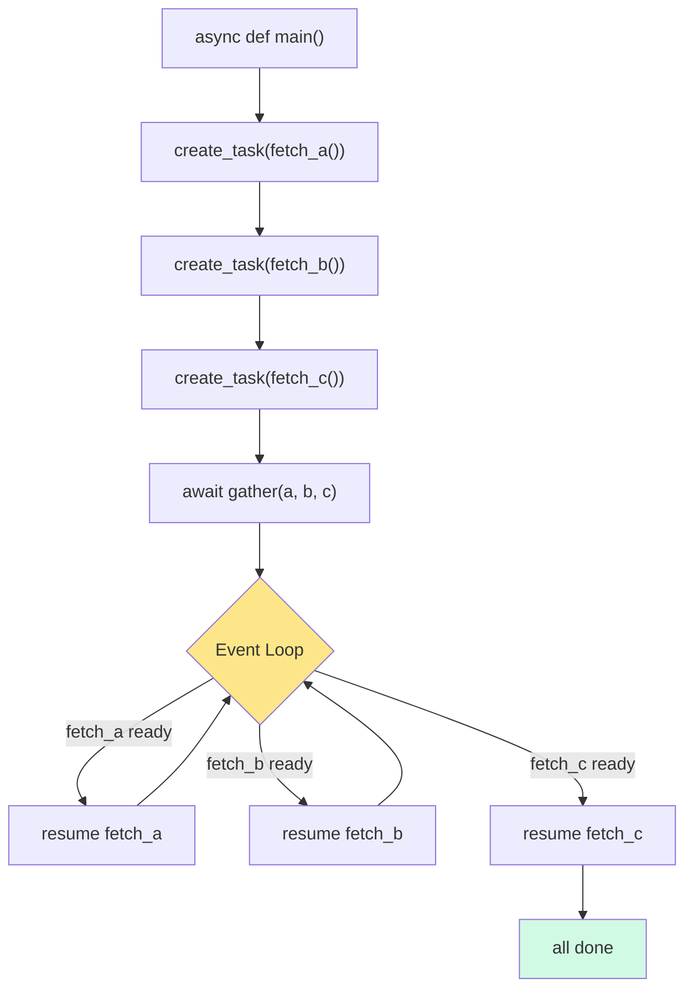
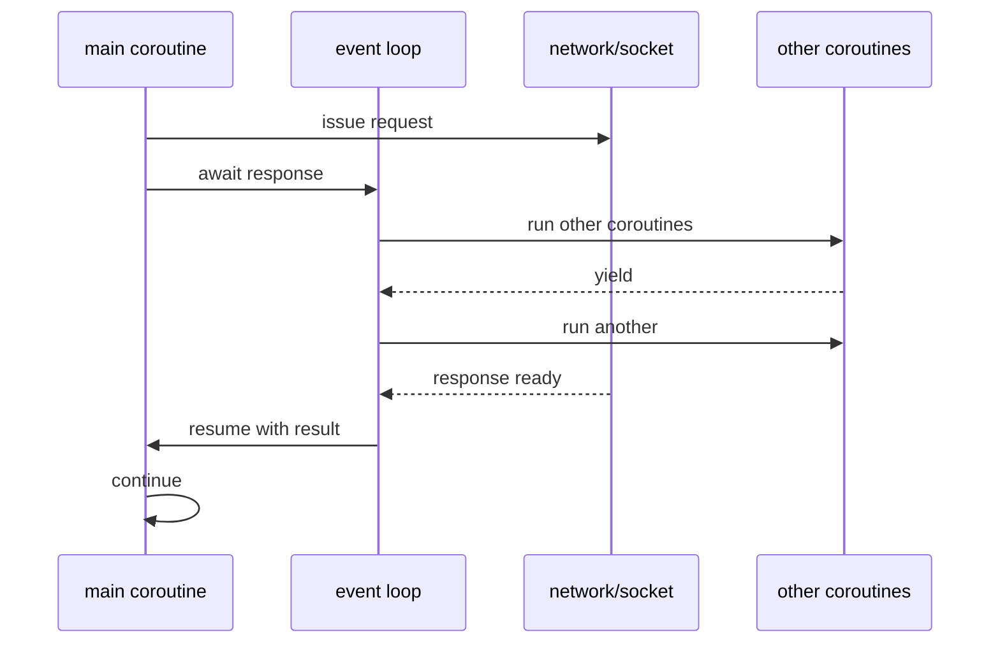
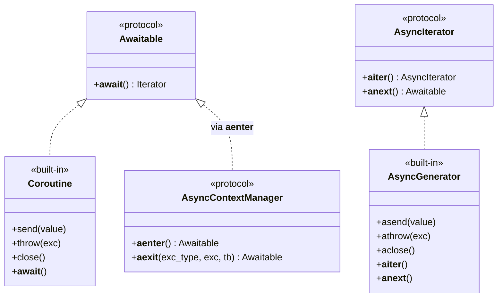
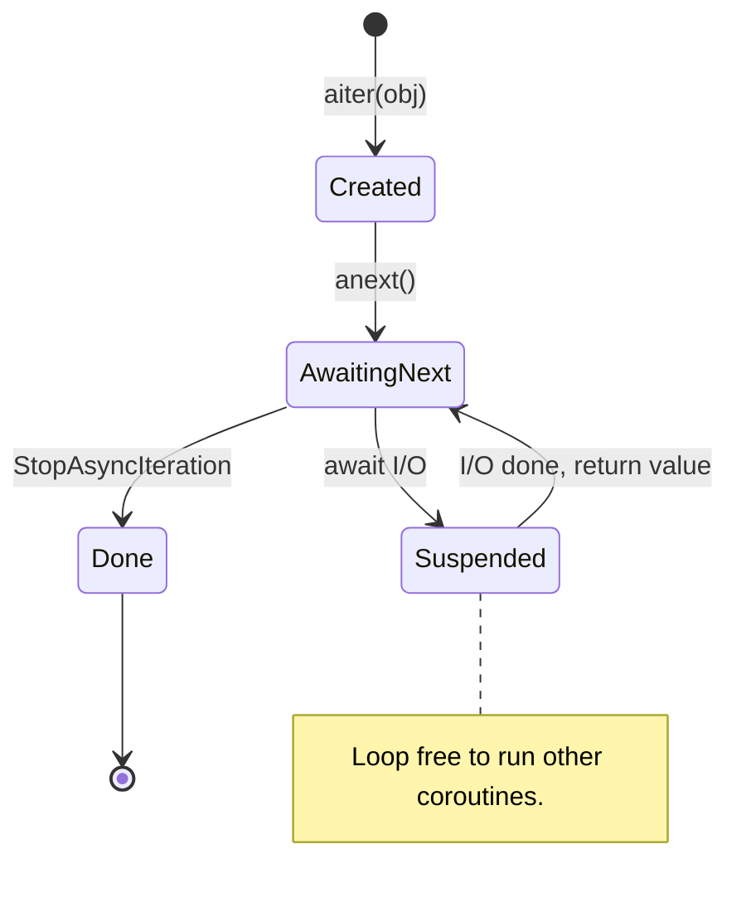
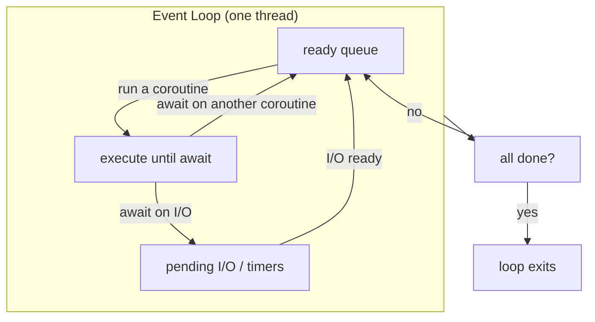
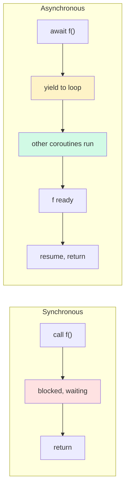
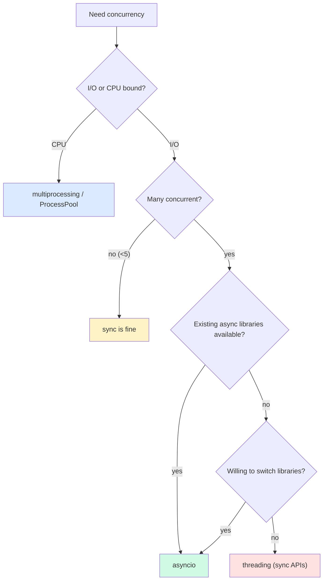

# Async OOP — Objects That Talk to the Event Loop

#python #async #asyncio #coroutines #async-iterators #async-context-managers #teaching #deep-dive

> [!quote] Yury Selivanov (PEP 492 author)
> "Native coroutines and `async`/`await` make asynchronous code look like synchronous code, while preserving its non-blocking nature."

Python's `async`/`await` syntax (PEP 492, Python 3.5) was the largest addition to the language's concurrency model in a decade. It built on generator-based coroutines (see [[Iterators-And-Generators]]) but gave them first-class syntax and a parallel set of dunder methods. Where sync OOP has `__enter__`/`__exit__`, `__iter__`/`__next__`, and `def`, async OOP has `__aenter__`/`__aexit__`, `__aiter__`/`__anext__`, and `async def`. The shapes mirror each other — but the runtime semantics are radically different.

This note covers async syntax, the async magic methods, async context managers, async iterators and generators, async ABCs, asyncio primitives (`gather`, `create_task`, `wait`), OOP design for async code, the event loop's role, the blocking-call pitfall, and complete worked examples: an async web scraper, an async DB pool, and an async streaming iterator.

Prerequisites: [[Iterators-And-Generators]] (especially coroutines), [[Context-Managers]], [[Concurrency-In-OOP]], [[Magic-Methods]].

---

## 1. Why Async?

Sync code is easy to read but wastes the CPU on I/O. When you call `requests.get(url)`, the entire thread blocks until the response arrives — often hundreds of milliseconds. In a web crawler fetching 100 URLs, that's 100 × 200 ms = 20 seconds wall-clock, even though the CPU did almost nothing.

**Async I/O** lets one thread juggle many in-flight operations. While waiting for URL #1's response, the program issues URL #2's request, and so on. The CPU is fully utilized; the wall-clock time approaches the slowest single request, not the sum.

| Model | Concurrency unit | Preemption | Best for |
|---|---|---|---|
| Sync | None — one call at a time | N/A | Simple scripts, CPU-bound work |
| Threading | OS threads | OS preemptive | Legacy blocking I/O, light concurrency |
| Multiprocessing | OS processes | OS preemptive | CPU-bound parallelism |
| **Async (asyncio)** | Coroutines on one thread | **Cooperative** — coroutines yield explicitly | I/O-bound fan-out (web, DB, microservices) |

The catch: async only works if *every* layer is async. One `time.sleep(1)` or `requests.get()` in the middle of an async pipeline blocks the whole event loop — and every other coroutine waits.



---

## 2. `async def` and `await`

A function defined with `async def` is a **coroutine function**. Calling it doesn't run the body — it returns a **coroutine object** that you must `await` (or schedule on the loop).

```python
import asyncio

async def greet(name):
    await asyncio.sleep(0.1)        # non-blocking sleep
    return f"hello, {name}"

# Calling greet() returns a coroutine, NOT a string.
coro = greet("world")
print(coro)   # <coroutine object greet at 0x...>

result = asyncio.run(coro)
print(result)   # hello, world
```

`asyncio.run()` is the standard entry point (Python 3.7+). It creates a fresh event loop, runs the coroutine to completion, then closes the loop. Call it exactly once at the top of your program; never inside another `async def`.

`await` can only appear inside `async def`. It does two things:

1. **Suspends** the current coroutine, returning control to the event loop.
2. **Registers** a callback to resume this coroutine when the awaited awaitable is ready.



### 2.1 What Can You `await`?

Anything that implements `__await__` — collectively, **awaitables**:

| Awaitable | Example |
|---|---|
| Coroutine | `await my_async_func()` |
| Task (a scheduled coroutine) | `task = asyncio.create_task(...); await task` |
| Future | `await some_future` |
| Object with `__await__` | Custom awaitables (rare) |

---

## 3. The Async Magic Methods

Async OOP is built on five dunder methods, each the async twin of a sync method:

| Sync method | Async method | Used by |
|---|---|---|
| `__enter__` | `__aenter__` | `async with` |
| `__exit__` | `__aexit__` | `async with` |
| `__iter__` | `__aiter__` | `async for` |
| `__next__` | `__anext__` | `async for` |
| (none) | `__await__` | `await` |
| (none) | `__anext__` raises `StopAsyncIteration` | `async for` end signal |

Note one important wrinkle: async iteration ends with **`StopAsyncIteration`**, not `StopIteration`. This is partly because PEP 479 made `StopIteration` leaking out of a generator a `RuntimeError`, so async needed its own signal.



---

## 4. Custom Awaitables — `__await__`

You rarely need to write `__await__` directly — `async def` does it for you. But the protocol is simple: `__await__` must return an iterator (often a generator) that the event loop drives. This is how `asyncio.Future` works under the hood.

```python
class Delayed:
    """Awaitable that resolves to `value` after `seconds`."""
    def __init__(self, seconds, value):
        self.seconds = seconds
        self.value = value

    def __await__(self):
        # Yield control to the event loop, then return self.value.
        yield from asyncio.sleep(self.seconds).__await__()
        return self.value

async def main():
    result = await Delayed(0.5, "done")
    print(result)   # done — after 0.5s

asyncio.run(main())
```

> [!warning] Don't Reinvent Futures
> If you're writing `__await__` from scratch, you're probably reinventing `asyncio.Future`. Use that, or wrap your async logic in an `async def`. The custom-awaitable path is for library authors who need fine control over the loop's scheduling primitives.

---

## 5. Async Context Managers

`async with` works exactly like `with`, but the protocol methods are `async def`. The cleanup is awaited — so it can itself do async I/O (closing a network connection, releasing a distributed lock).

```python
class AsyncDBConnection:
    async def __aenter__(self):
        self.conn = await connect_to_db()
        return self.conn

    async def __aexit__(self, exc_type, exc_val, exc_tb):
        await self.conn.close()
        return False

async def main():
    async with AsyncDBConnection() as conn:
        await conn.execute("SELECT 1")
```

### 5.1 Generator-Based: `@asynccontextmanager`

```python
from contextlib import asynccontextmanager

@asynccontextmanager
async def db_session(dsn):
    conn = await connect_to_db(dsn)
    try:
        yield conn
    finally:
        await conn.close()

async with db_session(dsn) as conn:
    await conn.execute("SELECT 1")
```

The shape is identical to the sync `@contextmanager` — setup, `yield`, teardown. Always wrap `yield` in `try/finally` so teardown runs even on exception.

See [[Context-Managers]] for the sync counterpart; the only differences are `async with`/`async def`/`await` and `__aenter__`/`__aexit__` instead of `__enter__`/`__exit__`.

---

## 6. Async Iterators

An **async iterator** produces items asynchronously — perfect for streaming data: paginated APIs, SSE streams, message queues, database cursors.

```python
class AsyncRange:
    def __init__(self, stop):
        self.stop = stop
        self.i = 0

    def __aiter__(self):
        return self

    async def __anext__(self):
        if self.i >= self.stop:
            raise StopAsyncIteration
        await asyncio.sleep(0.01)        # simulate async I/O
        value = self.i
        self.i += 1
        return value

async def main():
    async for n in AsyncRange(5):
        print(n, end=" ")
    # 0 1 2 3 4

asyncio.run(main())
```



### 6.1 Async Generators — `yield` Inside `async def`

A plain `async def` with `yield` (no `return value`) is an **async generator**. It implements `__aiter__` and `__anext__` automatically.

```python
async def async_range(stop):
    i = 0
    while i < stop:
        await asyncio.sleep(0.01)
        yield i
        i += 1

async for n in async_range(5):
    print(n, end=" ")   # 0 1 2 3 4
```

Async generators are dramatically cleaner than writing the class form. Use the class form only when you need extra methods (`aclose`, state inspection) or inheritance.

### 6.2 `async for` Under the Hood

`async for x in obj:` desugars roughly to:

```python
_iter = obj.__aiter__()
while True:
    try:
        x = await _iter.__anext__()
    except StopAsyncIteration:
        break
    # body
```

`__aiter__` is called once; `__anext__` is awaited each iteration. The body of the `async for` runs between yields of control to the loop.

---

## 7. Async Comprehensions

Python 3.6 added async comprehensions — the async cousin of list/set/dict comprehensions and generator expressions:

```python
results = [await f(x) for x in items]                # async list comp
results = [f(x) async for x in async_source]         # async iterating
results = {x: await f(x) async for x in async_source} # async dict comp
gen = (f(x) async for x in async_source)             # async gen expr
```

Combine both — `await` *and* `async for` in one expression:

```python
results = [await fetch(url) async for url in url_stream()]
```

> [!warning] Common Bug
> `[await f(x) for x in items]` runs the awaits **sequentially** — one after another. It does not parallelize them. For parallel fetches, use `asyncio.gather`:
> ```python
> results = await asyncio.gather(*[f(x) for x in items])
> ```
> This is one of the most common async mistakes: assuming comprehensions parallelize the awaits.

---

## 8. `asyncio.gather` and `asyncio.create_task`

`asyncio.create_task(coro)` schedules a coroutine on the loop and returns a `Task` (a subclass of `Future`). It starts running as soon as the loop has a chance — you don't have to `await` it immediately.

```python
async def fetch(url):
    await asyncio.sleep(0.5)
    return f"data from {url}"

async def main():
    # Sequential — 1.5s total
    a = await fetch("a")
    b = await fetch("b")
    c = await fetch("c")

    # Parallel — 0.5s total
    a, b, c = await asyncio.gather(
        fetch("a"), fetch("b"), fetch("c")
    )
```



```mermaid
gantt
    title Sequential vs Parallel Async
    dateFormat ss
    axisFormat %Ss
    section Sequential
    fetch a :0, 1
    fetch b :1, 2
    fetch c :2, 3
    section Parallel (gather)
    fetch a :0, 1
    fetch b :0, 1
    fetch c :0, 1
```

### 8.1 `return_exceptions=True`

By default, `gather` raises on the first exception. With `return_exceptions=True`, exceptions are returned as values in the result list — useful when partial success is acceptable:

```python
results = await asyncio.gather(*tasks, return_exceptions=True)
for r in results:
    if isinstance(r, Exception):
        print(f"failed: {r!r}")
    else:
        process(r)
```

### 8.2 `asyncio.TaskGroup` (Python 3.11+)

The modern, safer replacement for `gather`:

```python
async with asyncio.TaskGroup() as tg:
    t1 = tg.create_task(fetch("a"))
    t2 = tg.create_task(fetch("b"))
    t3 = tg.create_task(fetch("c"))
# All tasks awaited on exit. First exception cancels the others.
a, b, c = t1.result(), t2.result(), t3.result()
```

`TaskGroup` provides **structured concurrency**: every task spawned inside the `async with` is awaited (or cancelled) before exit. If any task raises, the others are cancelled automatically. This is much harder to get wrong than `gather`.

### 8.3 Other `asyncio` Scheduling Primitives

| Function / Class | What it does |
|---|---|
| `asyncio.wait_for(coro, timeout)` | Await `coro` but cancel if it exceeds `timeout` |
| `asyncio.wait(coros)` | Low-level: returns `(done, pending)` sets |
| `asyncio.as_completed(coros)` | Yields results as they finish, in completion order |
| `asyncio.Queue` | Async queue for producer/consumer across coroutines |
| `asyncio.Lock` | Async mutual exclusion (sync `threading.Lock`'s async cousin) |
| `asyncio.Semaphore` | Limit concurrency (used in the scraper above) |
| `asyncio.Event` | Signal "wake up everyone waiting" |
| `asyncio.Condition` | Lock + Event combined |

`asyncio.as_completed` is especially useful when you want results in the order they finish, not the order you submitted:

```python
async def fetch_limited(urls):
    async with httpx.AsyncClient() as client:
        coros = [client.get(u) for u in urls]
        for coro in asyncio.as_completed(coros):
            resp = await coro
            print(f"finished: {resp.url} ({resp.status_code})")
```

### 8.4 Timeouts — `asyncio.timeout` (3.11+)

```python
async with asyncio.timeout(2.0):
    await slow_operation()
# If slow_operation takes >2s, TimeoutError is raised
# and slow_operation is cancelled.
```

This is much cleaner than the older `await asyncio.wait_for(slow_operation(), 2.0)` — it's a context manager, so it composes naturally with `try/except`.

---

## 9. Async ABCs

`collections.abc` provides async equivalents of the sync ABCs:

| Sync ABC | Async ABC | Required methods |
|---|---|---|
| `Iterable` | `AsyncIterable` | `__aiter__` |
| `Iterator` | `AsyncIterator` | `__aiter__`, `__anext__` |
| `Coroutine` | `Coroutine` | `send`, `throw`, `close`, `__await__` |
| `AsyncGenerator` | `AsyncGenerator` | `asend`, `athrow`, `aclose`, `__aiter__`, `__anext__` |

For abstract methods on async classes, just combine `abc.ABC` with `async def`:

```python
from abc import ABC, abstractmethod

class AsyncRepository(ABC):
    @abstractmethod
    async def get(self, key: str): ...

    @abstractmethod
    async def put(self, key: str, value): ...

    @abstractmethod
    async def delete(self, key: str): ...

class RedisRepo(AsyncRepository):
    async def get(self, key):
        return await self.redis.get(key)
    # ...
```

> [!tip] Teaching Tip
> Show students that `@abstractmethod` works exactly the same on `async def` — the decorator doesn't care. The async-ness is in the function, not the decorator. This is a nice reminder that `async def` is "just" a function kind, not a separate language.

---

## 10. The Event Loop — How Objects Participate

The **event loop** is a single-threaded scheduler. It maintains a queue of ready-to-run coroutines and a set of "wait until" handles (file descriptors, timers, futures). When a coroutine awaits, the loop picks up another ready one. When an awaited I/O completes, the loop marks the corresponding coroutine as ready.



Key implications for OOP:

- **No thread safety needed inside the loop.** Only one coroutine runs at a time; you can't be preempted mid-statement. Mutating shared state between `await`s is safe *as long as no `await` happens between the read and the write*.
- **Blocking calls freeze the loop.** `time.sleep(1)`, `requests.get()`, `socket.recv()` without non-blocking flags, CPU-heavy computation — all of these stall every other coroutine. Use `asyncio.sleep`, async HTTP clients (`httpx`, `aiohttp`), and offload CPU work with `run_in_executor`.
- **Async objects "live" on the loop.** A connection pool, for example, must be created *inside* a coroutine (so it knows about the running loop). Storing an event-loop-bound object and using it from another thread is a common bug.

### 10.1 Offloading Blocking Code — `run_in_executor`

```python
import asyncio, time

async def slow_cpu():
    # blocks the loop — BAD
    time.sleep(1)
    return 42

async def good_cpu():
    # offloads to a thread pool — GOOD
    loop = asyncio.get_running_loop()
    return await loop.run_in_executor(None, time.sleep, 1)
```

In Python 3.9+, prefer `asyncio.to_thread`:

```python
result = await asyncio.to_thread(time.sleep, 1)
```

For CPU-bound work, offload to a `ProcessPoolExecutor` so the GIL doesn't serialize you (see [[Concurrency-In-OOP]]).

---

## 11. Complete Example — Async Web Scraper

A class that fetches many URLs in parallel, with a concurrency limit (semaphore) and retries.

```python
import asyncio
import httpx
from typing import List, Dict

class AsyncScraper:
    def __init__(self, max_concurrency=10, retries=3):
        self.semaphore = asyncio.Semaphore(max_concurrency)
        self.retries = retries
        self.client = httpx.AsyncClient(timeout=10.0)

    async def fetch_one(self, url: str) -> Dict:
        async with self.semaphore:
            for attempt in range(self.retries):
                try:
                    resp = await self.client.get(url)
                    resp.raise_for_status()
                    return {"url": url, "status": resp.status_code, "body": resp.text}
                except Exception as e:
                    if attempt == self.retries - 1:
                        return {"url": url, "error": repr(e)}
                    await asyncio.sleep(0.5 * (attempt + 1))

    async def fetch_all(self, urls: List[str]) -> List[Dict]:
        # TaskGroup gives structured concurrency — any failure cancels siblings.
        async with asyncio.TaskGroup() as tg:
            tasks = [tg.create_task(self.fetch_one(u)) for u in urls]
        return [t.result() for t in tasks]

    async def close(self):
        await self.client.aclose()

# Usage
async def main():
    scraper = AsyncScraper(max_concurrency=5)
    try:
        urls = ["https://example.com"] * 20
        results = await scraper.fetch_all(urls)
        for r in results[:3]:
            print(r["url"], r.get("status", r.get("error")))
    finally:
        await scraper.close()

asyncio.run(main())
```

This is the canonical shape of an async OOP service:

- A class owns the async resources (`httpx.AsyncClient`, semaphore).
- Methods are `async def`.
- Resource cleanup happens in `aclose()` (or `__aexit__` if you make it an async context manager).
- Concurrency limits use `asyncio.Semaphore`.
- Failures use `TaskGroup` for structured cleanup.

### 11.1 Make It an Async Context Manager

```python
class AsyncScraper:
    # ... (same as above)

    async def __aenter__(self):
        return self

    async def __aexit__(self, *exc):
        await self.close()

# Usage
async with AsyncScraper(max_concurrency=5) as scraper:
    results = await scraper.fetch_all(urls)
```

The pattern is identical to the sync scraper, except every `def` is `async def` and every cleanup is awaited.

---

## 12. Complete Example — Async DB Connection Pool

```python
import asyncio
from contextlib import asynccontextmanager

class AsyncConnectionPool:
    def __init__(self, factory, size=5):
        self.factory = factory
        self.size = size
        self.semaphore = asyncio.Semaphore(size)
        self.pool: asyncio.Queue = asyncio.Queue(maxsize=size)
        self._initialized = False

    async def _ensure_initialized(self):
        if not self._initialized:
            for _ in range(self.size):
                await self.pool.put(await self.factory())
            self._initialized = True

    @asynccontextmanager
    async def acquire(self):
        await self._ensure_initialized()
        await self.semaphore.acquire()
        try:
            conn = await self.pool.get()
            try:
                yield conn
            finally:
                await self.pool.put(conn)
        finally:
            self.semaphore.release()

    async def close(self):
        while not self.pool.empty():
            conn = await self.pool.get()
            await conn.close()
```

```python
async def fake_db_factory():
    class Conn:
        async def execute(self, q):
            await asyncio.sleep(0.05)
            return f"result of {q}"
        async def close(self):
            pass
    return Conn()

async def main():
    pool = AsyncConnectionPool(fake_db_factory, size=3)
    try:
        async with pool.acquire() as conn:
            print(await conn.execute("SELECT 1"))
    finally:
        await pool.close()

asyncio.run(main())
```

Note: the semaphore plus the bounded queue means at most `size` coroutines can hold a connection at once; everyone else waits in `acquire()`. This is the async equivalent of the sync pool in [[Context-Managers]] §9.1.

---

## 13. Async Iterator for Streaming Data

A paginated API — keep fetching "next page" until there's no `cursor`:

```python
class PaginatedAPI:
    def __init__(self, base_url, page_size=100):
        self.base_url = base_url
        self.page_size = page_size

    def __aiter__(self):
        # State per iteration; fresh each async-for.
        return self._iterator()

    async def _iterator(self):
        cursor = None
        async with httpx.AsyncClient() as client:
            while True:
                params = {"limit": self.page_size}
                if cursor:
                    params["cursor"] = cursor
                resp = await client.get(self.base_url, params=params)
                resp.raise_for_status()
                data = resp.json()
                for item in data["items"]:
                    yield item            # async yield
                cursor = data.get("next_cursor")
                if not cursor:
                    break

# Usage
async def main():
    async for item in PaginatedAPI("https://api.example.com/items"):
        print(item["id"])

asyncio.run(main())
```

The `yield item` inside `async def` makes this an async generator. Each `yield` returns control to the loop, so other coroutines can run while we wait for the next page.

---

## 14. Sync vs Async — A Side-by-Side



| Concept | Sync | Async |
|---|---|---|
| Function definition | `def f():` | `async def f():` |
| Function call | `f()` runs immediately | `f()` returns coroutine |
| Run to completion | `result = f()` | `result = await f()` |
| Sleep | `time.sleep(1)` (blocks) | `await asyncio.sleep(1)` (yields) |
| Context manager | `__enter__` / `__exit__` | `__aenter__` / `__aexit__` |
| Iterator | `__iter__` / `__next__` | `__aiter__` / `__anext__` |
| Loop end signal | `StopIteration` | `StopAsyncIteration` |
| Comprehension | `[x for x in it]` | `[x async for x in it]` |
| With statement | `with x as y:` | `async with x as y:` |
| For statement | `for x in it:` | `async for x in it:` |
| Cleanup helper | `try/finally` | `try/finally` (same) |
| Cancellation | KeyboardInterrupt /w signal | `asyncio.CancelledError` (awaitable) |

---

## 15. Common Pitfalls

> [!danger] Forgetting to `await`
> ```python
> async def fetch(url):
>     return httpx.get(url)   # missing await!
> ```
> This returns a coroutine object (or, in this case, the httpx response since the sync `get` was called), not the result. Always check that every `async def` call inside another `async def` is `await`ed. Enable `asyncio` debug mode (`PYTHONASYNCIODEBUG=1`) to get warnings about un-awaited coroutines.

> [!danger] Blocking Calls Inside `async def`
> ```python
> async def bad():
>     time.sleep(1)              # freezes the whole loop!
>     data = requests.get(url)   # also blocks
>     return data
> ```
> Replace with `await asyncio.sleep(1)` and `await httpx.AsyncClient().get(url)`. If you must call blocking code, use `await asyncio.to_thread(...)`.

> [!danger] Creating Tasks Without Keeping References
> ```python
> async def leaky():
>     asyncio.create_task(background_work())   # may be GC'd mid-flight!
>     return "done"
> ```
> The event loop only holds a *weak* reference to tasks. The task can be garbage-collected before completion. Always store the task reference:
> ```python
> self._background_tasks = set()
> task = asyncio.create_task(background_work())
> self._background_tasks.add(task)
> task.add_done_callback(self._background_tasks.discard)
> ```

> [!warning] Mixing Sync and Async Code
> You can't `await` inside a sync `def` function. If you need to call async code from sync code, use `asyncio.run()` at the top level — never inside an already-running loop. If you need to call sync code from async, use `run_in_executor` or `asyncio.to_thread`.

> [!warning] `asyncio.run()` Called Twice
> Each `asyncio.run()` creates and destroys a fresh event loop. Calling it from inside another loop raises `RuntimeError`. Use it exactly once, at the top of your program.

> [!note] `asyncio.sleep(0)` — Yield Without Waiting
> `await asyncio.sleep(0)` is the canonical way to say "let other coroutines run, but I'm not waiting for anything specific." Useful in long-running CPU-bound coroutines to keep the loop responsive.

> [!note] Cancellation Is Cooperative
> `task.cancel()` schedules a `CancelledError` to be raised at the next `await` inside the task. The task can catch it (to do cleanup) but should re-raise. Don't swallow `CancelledError` — that breaks the cancellation protocol.

### 16.1 Cancellation in Depth

Cancellation in asyncio is **cooperative**: `task.cancel()` doesn't kill the coroutine — it sets a flag and raises `CancelledError` at the next `await`. The coroutine is expected to catch `CancelledError`, do cleanup, and re-raise (or `return` cleanly). If it swallows the error, cancellation silently fails.

```python
async def worker():
    try:
        await long_running_operation()
    except asyncio.CancelledError:
        # Clean up partial state.
        await cleanup()
        raise   # ALWAYS re-raise CancelledError
    finally:
        # Always runs — even on cancellation.
        await release_resources()

async def main():
    task = asyncio.create_task(worker())
    await asyncio.sleep(1)
    task.cancel()
    try:
        await task
    except asyncio.CancelledError:
        print("task was cancelled")
```

| Mistake | Consequence |
|---|---|
| `except Exception: pass` (bare-ish) | Catches `CancelledError` (since 3.8 it's `BaseException`, so this is now safe — but pre-3.8 it broke cancellation) |
| `except asyncio.CancelledError: return` without re-raising | Task appears to complete successfully; caller can't tell it was cancelled |
| Long sync work between `await`s | Cancellation delayed indefinitely — loop can't interrupt |
| Not running cleanup in `finally` | Resources leak on cancellation |

> [!warning] `CancelledError` Is `BaseException`
> Since Python 3.8, `asyncio.CancelledError` inherits from `BaseException`, not `Exception`. So `except Exception:` will **not** catch it — that's the safe default. But if you write `except BaseException:` (or bare `except:`), you'll catch cancellation and need to re-raise explicitly.

### 16.2 Shields — Un-cancellable Sections

Sometimes you need a section of code to be un-cancellable (e.g., a final database commit). Use `asyncio.shield`:

```python
async def safe_save():
    try:
        await asyncio.shield(db.commit())
    except asyncio.CancelledError:
        # The outer task was cancelled, but the commit is still running.
        # Wait for it to finish, then re-raise.
        await db.wait_for_commit()
        raise
```

`shield` doesn't make the inner operation un-cancellable from inside — it just means that if the *outer* task is cancelled, the inner one keeps running. Use sparingly: it's a sign you should restructure your cancellation boundaries.

---

## 17. When to Use Async — A Decision Matrix

| Situation | Use async? |
|---|---|
| I/O-bound, many concurrent connections (web, DB, microservices) | ✅ Yes |
| Streaming data, real-time pipelines | ✅ Yes |
| WebSockets, chat servers | ✅ Yes |
| CPU-bound number crunching | ❌ No — use multiprocessing |
| Simple script, few I/O calls | ❌ Overkill — sync is fine |
| Existing sync codebase with no async libraries | ❌ Migration cost too high |
| Need true parallelism on multi-core | ❌ asyncio is single-threaded |
| Mix of I/O and CPU work | ✅ Use async + `run_in_executor` for CPU bits |



---

## 17. Async and OOP Design Principles

Async changes some OOP design rules:

1. **Async leaks through the call stack.** If you mark a function `async def`, every caller must be `async def` too (or use `asyncio.run`). You can't have a sync wrapper that internally uses async — without breaking the "sync wrapper blocks the loop" rule. Plan your async boundaries deliberately.
2. **Async objects own loop-bound resources.** HTTP clients, DB pools, sockets — these are tied to the event loop. Don't share them across loops or threads.
3. **Prefer composition over inheritance for async services.** A "base async service" class rarely composes well; small collaborator objects (a client, a pool, a queue) do.
4. **Cleanup is mandatory.** Async resources don't always have `__del__` that runs deterministically. Always provide `aclose()` or `__aexit__`.
5. **Cancellation is a first-class concern.** Design every `async def` to handle `CancelledError` gracefully — clean up resources, leave state consistent, re-raise.

> [!tip] Teaching Tip
> Have students port a small sync scraper to async. The moment they realize that *every* function in the call chain had to change — that's when the "async leaks through the stack" lesson lands. It's a real cost, not just a syntax upgrade.

---

## 18. Summary

- `async def` creates a **coroutine function**; calling it returns a **coroutine object** that you must `await`.
- The async dunder protocol mirrors the sync one: `__aenter__`/`__aexit__`, `__aiter__`/`__anext__`, `__await__`.
- Async iteration ends with `StopAsyncIteration`.
- `async with` and `async for` work like their sync counterparts, but on async protocols.
- Async generators (`yield` inside `async def`) are the shortest path to async iterators.
- `asyncio.gather` (or `TaskGroup`) runs coroutines concurrently; `asyncio.create_task` schedules one.
- Async comprehensions **do not parallelize awaits** — use `gather` for that.
- The event loop is single-threaded and cooperative; blocking calls freeze it.
- Use `asyncio.to_thread` / `run_in_executor` to offload blocking code.
- Async leaks through the call stack — pick async boundaries deliberately.
- `TaskGroup` (3.11+) gives structured concurrency: clean cancellation, no leaked tasks.

> [!success] You Understand Async OOP When…
> You can explain why `[await f(x) for x in items]` is sequential, why a `time.sleep` in `async def` is a bug, why `asyncio.run` can only be called once at the top, and why an async scraper class needs an `aclose()` method.

## See Also

- [[Iterators-And-Generators]] — sync iterators and generator-based coroutines (the historical root of async)
- [[Context-Managers]] — sync counterpart; `@asynccontextmanager` mirrors `@contextmanager`
- [[Concurrency-In-OOP]] — threading, multiprocessing, GIL; when async isn't the right tool
- [[Magic-Methods]] — the sync dunders that the async ones mirror
- [[Decorators-As-OOP]] — `@asynccontextmanager` is itself a decorator
- [[Composition-Over-Inheritance]] — async services compose, they don't inherit
