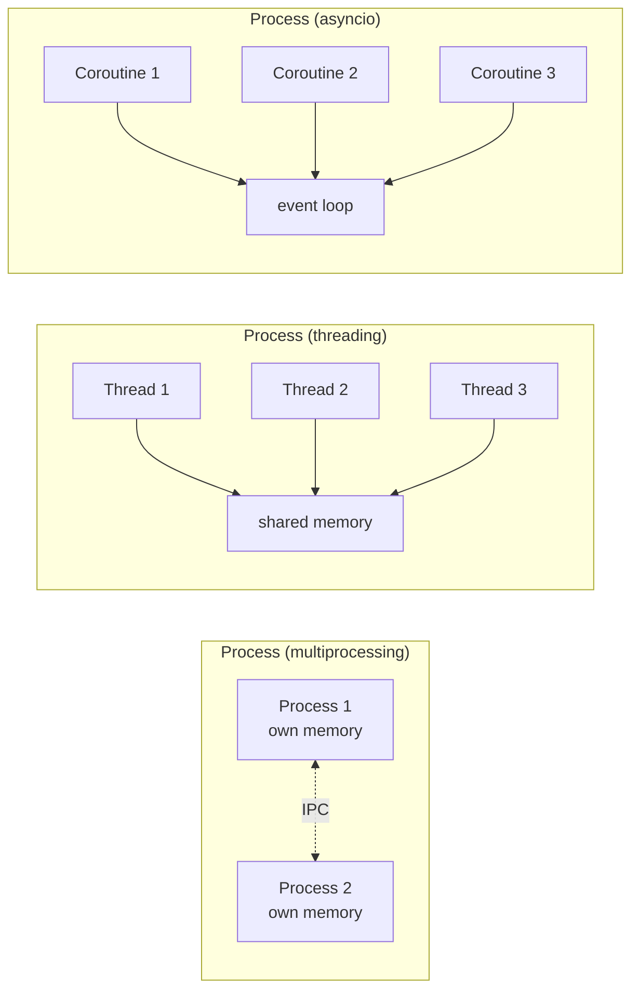
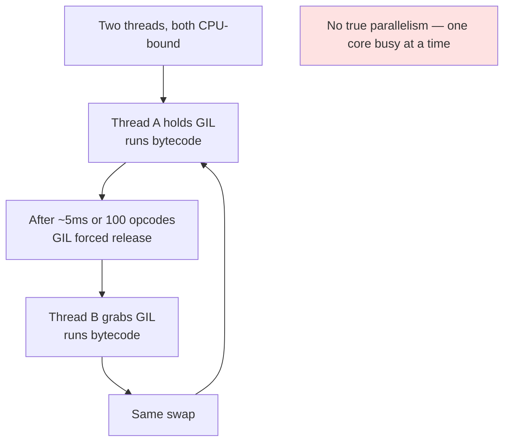
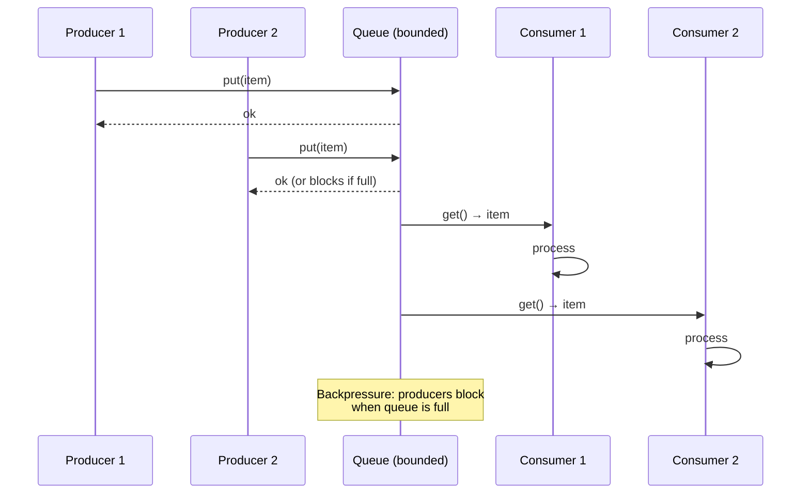
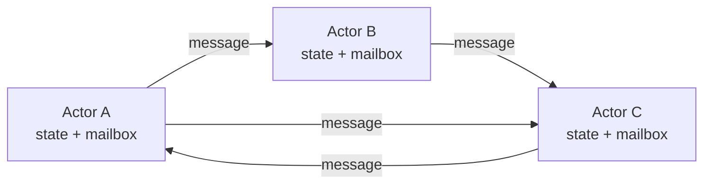
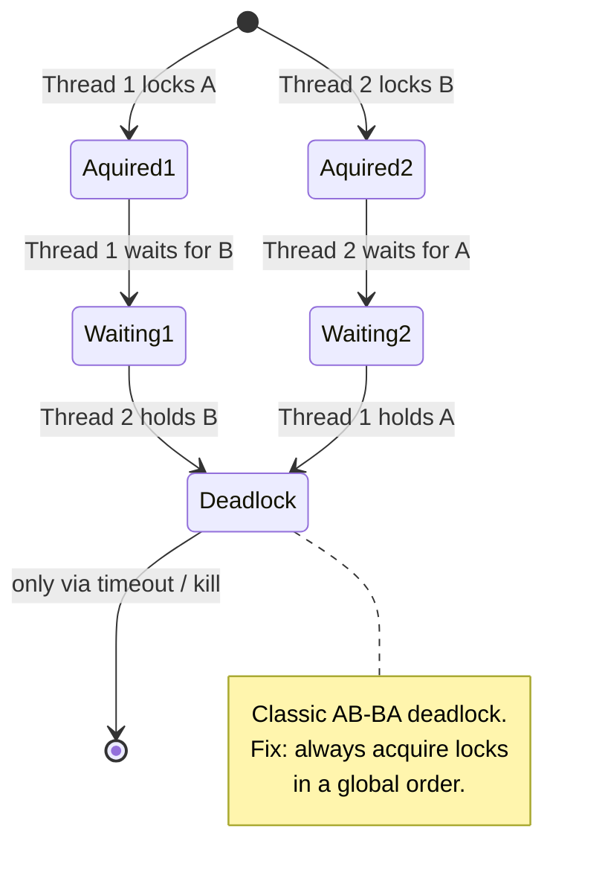
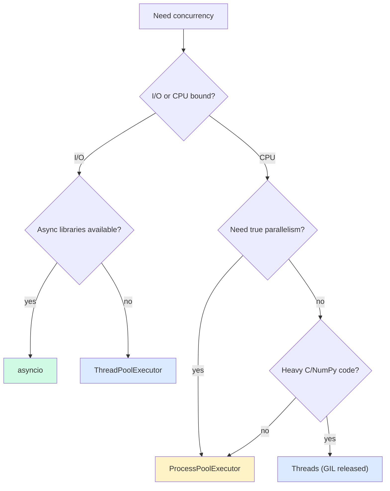
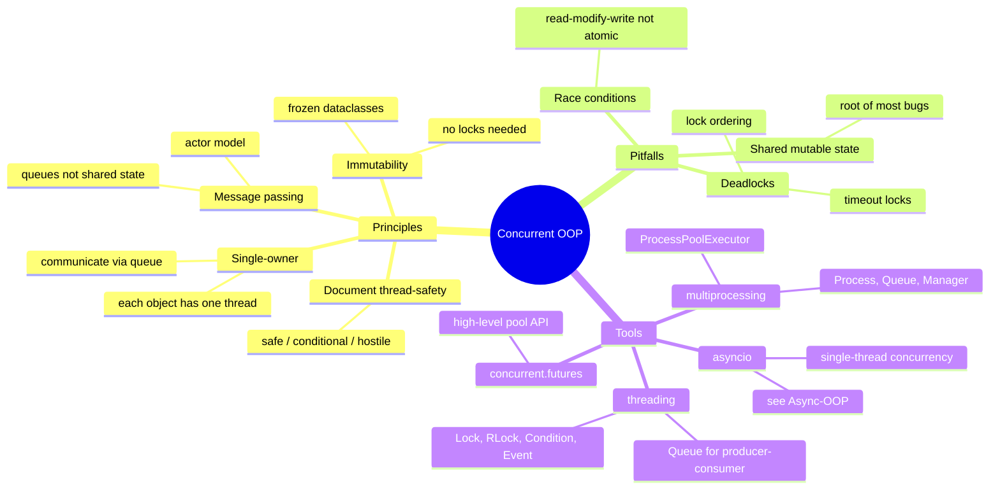

# Concurrency in OOP — Threads, Processes, and Beyond the GIL

#python #concurrency #threading #multiprocessing #gil #producer-consumer #actor-model #teaching #deep-dive

> [!quote] Rob Pike
> "Don't communicate by sharing memory; share memory by communicating."

Concurrency is doing more than one thing at a time. Parallelism is doing them simultaneously on different cores. Python supports both — through threading, multiprocessing, `concurrent.futures`, and asyncio (see [[Async-OOP]]) — but each model has a distinct shape, distinct costs, and a distinct set of OOP design rules.

This note covers threading, multiprocessing, the GIL and what it means for OOP, the synchronization primitives (`Lock`, `RLock`, `Condition`, `Semaphore`, `Event`, `Queue`), thread-safe class design, producer-consumer and reader-writer patterns, a brief tour of the actor model, the asyncio-vs-threading-vs-multiprocessing decision matrix, and design principles for concurrency-aware OOP. Two complete worked examples (a thread-safe `BankAccount` and a parallel data processor) anchor the ideas.

Prerequisites: [[Magic-Methods]], [[Context-Managers]], [[Encapsulation]], [[Async-OOP]].

---

## 1. Three Models of Concurrency

| Model | Unit | Preemption | Memory | Best for |
|---|---|---|---|---|
| **Threading** | OS thread | OS preemptive | Shared (same process) | I/O-bound concurrency with sync libraries |
| **Multiprocessing** | OS process | OS preemptive | Separate (IPC required) | CPU-bound parallelism |
| **asyncio** | Coroutine | Cooperative | Shared (one thread) | I/O-bound fan-out, async libraries |



The key difference: threads share memory (so synchronization is your problem); processes have separate memory (so IPC is your problem); asyncio coroutines share memory but can't be preempted between `await`s (so careful structuring avoids most races).

---

## 2. The GIL — Global Interpreter Lock

CPython's GIL is a single mutex protecting the entire interpreter. Only one thread can execute Python bytecode at a time. The implications are enormous:

- **CPU-bound Python code can't run in parallel on multiple cores**, no matter how many threads you spawn. They take turns.
- **I/O-bound code can run concurrently** because the GIL is released during blocking I/O calls (`socket.recv`, `file.read`, `time.sleep`).
- **C extensions can release the GIL** explicitly (NumPy, NumExpr, etc.), so heavy numerical code can parallelize — but only inside the C code.
- **Multiprocessing sidesteps the GIL** entirely: each process has its own interpreter and its own GIL.



> [!warning] Common Student Misconception
> "I'll just use threads to parallelize my prime sieve." — On CPython, this gives you ~zero speedup (often *slowdown*, due to GIL contention). Use `multiprocessing` for CPU-bound work, or reach for NumPy / Cython / native code that releases the GIL.

> [!note] PEP 703 — No-GIL Python
> A "free-threaded" build of CPython (no GIL) is being developed under PEP 703 and shipped experimentally in Python 3.13. If it matures, much of the threading guidance here will change. For production today (3.12 and earlier), assume the GIL is in effect.

---

## 3. Threading — `threading.Thread`

```python
import threading
import time

def worker(name, n):
    for i in range(n):
        print(f"[{name}] {i}")
        time.sleep(0.01)

t1 = threading.Thread(target=worker, args=("A", 5))
t2 = threading.Thread(target=worker, args=("B", 5))
t1.start()
t2.start()
t1.join()   # wait for t1 to finish
t2.join()
```

| API | What it does |
|---|---|
| `threading.Thread(target, args, kwargs)` | Create a thread (doesn't start it) |
| `t.start()` | Begin execution; calls `target(*args, **kwargs)` |
| `t.join(timeout=None)` | Wait for `t` to finish |
| `t.daemon = True` | Thread won't keep process alive (killed on main exit) |
| `threading.current_thread()` | Get the current Thread object |
| `threading.main_thread()` | Get the main thread |

### 3.1 Subclassing `Thread`

For stateful workers, subclass `Thread`:

```python
class Worker(threading.Thread):
    def __init__(self, name, queue):
        super().__init__(name=name)
        self.queue = queue
        self.results = []

    def run(self):
        while True:
            item = self.queue.get()
            if item is None:    # sentinel
                break
            self.results.append(item * 2)
            self.queue.task_done()
```

The `run` method is what executes when you call `start()`. This is a clean way to attach state to a thread, though composition (a `Thread` calling into a worker object) is often cleaner.

---

## 4. Multiprocessing — `multiprocessing.Process`

Each process is a separate Python interpreter. To pass data, use `Queue`, `Pipe`, or `multiprocessing.Manager` shared objects.

```python
import multiprocessing as mp

def square(x, queue):
    queue.put(x * x)

if __name__ == "__main__":
    queue = mp.Queue()
    procs = [mp.Process(target=square, args=(i, queue)) for i in range(5)]
    for p in procs: p.start()
    for p in procs: p.join()
    results = [queue.get() for _ in range(5)]
    print(results)   # [0, 1, 4, 9, 16]
```

| API | What it does |
|---|---|
| `mp.Process(target, args)` | Create a process |
| `mp.Queue()` | Cross-process FIFO (uses pipes + locks internally) |
| `mp.Pipe()` | Two-ended connection for two processes |
| `mp.Manager()` | Server process holding shared dicts, lists, etc. |
| `mp.Value`, `mp.Array` | Shared ctypes in shared memory |
| `mp.Pool(n)` | Pool of worker processes |

> [!warning] Always Guard with `if __name__ == "__main__":`
> On Windows and macOS, `multiprocessing` uses *spawn* (not `fork`), which re-imports the main module in each child. Without the guard, every child re-runs your main code — leading to infinite process spawning. Make this a reflex.

---

## 5. `concurrent.futures` — The High-Level API

For most use cases, skip raw `Thread`/`Process` and use `concurrent.futures`. It gives you a uniform `submit`/`map` interface, future objects, and clean exception handling.

```python
from concurrent.futures import ThreadPoolExecutor, ProcessPoolExecutor

# Thread pool — for I/O
with ThreadPoolExecutor(max_workers=10) as pool:
    futures = [pool.submit(fetch_url, url) for url in urls]
    results = [f.result() for f in futures]

# Process pool — for CPU
with ProcessPoolExecutor() as pool:   # default: os.cpu_count() workers
    results = list(pool.map(heavy_compute, data_items))
```

| Feature | `ThreadPoolExecutor` | `ProcessPoolExecutor` |
|---|---|---|
| Unit | Thread | Process |
| Memory | Shared | Separate (pickled args) |
| Best for | I/O-bound | CPU-bound |
| Overhead | Low (~ms) | High (~10-100 ms spawn) |
| GIL-limited | Yes (for Python code) | No |
| Argument passing | Direct reference | Pickled (must be picklable) |

```python
# AsComplete pattern — get results as they finish
from concurrent.futures import as_completed

with ThreadPoolExecutor(max_workers=8) as pool:
    futures = {pool.submit(fetch, u): u for u in urls}
    for fut in as_completed(futures):
        url = futures[fut]
        try:
            result = fut.result()
        except Exception as e:
            print(f"{url} failed: {e!r}")
        else:
            print(f"{url} -> {len(result)} bytes")
```

`as_completed` is the right pattern when you have heterogeneous work — some calls finish quickly, some slowly, and you want results in completion order rather than submission order.

---

## 6. Synchronization Primitives

Python's `threading` module mirrors Java's `java.util.concurrent` primitives:

| Primitive | Purpose | Sync equivalent |
|---|---|---|
| `Lock` | Mutual exclusion; one holder at a time | `asyncio.Lock` |
| `RLock` | Reentrant lock — same thread can acquire multiple times | — |
| `Condition` | Wait/notify — pause until another thread signals | `asyncio.Condition` |
| `Semaphore(N)` | Allow up to N holders | `asyncio.Semaphore` |
| `BoundedSemaphore(N)` | Semaphore that errors if released too many times | — |
| `Event` | Boolean flag with wait/set | `asyncio.Event` |
| `Queue` | Thread-safe FIFO; consumer blocks on empty | `asyncio.Queue` |
| `Barrier(N)` | N threads wait; all released together | — |

### 6.1 `Lock` — The Basic Mutex

```python
import threading

class Counter:
    def __init__(self):
        self._value = 0
        self._lock = threading.Lock()

    def increment(self):
        with self._lock:
            self._value += 1

    @property
    def value(self):
        with self._lock:
            return self._value
```

The `with self._lock:` form is critical — it guarantees the lock is released even if an exception fires between acquire and release. **Never use manual `acquire`/`release`** unless you wrap them in `try/finally`.

### 6.2 `RLock` — Reentrant Lock

A regular `Lock` deadlocks if the same thread tries to acquire it twice. `RLock` tracks the owning thread and a count, so re-entry works:

```python
class Account:
    def __init__(self, balance=0):
        self.balance = balance
        self._lock = threading.RLock()

    def transfer_to(self, other, amount):
        with self._lock:                  # acquire once
            self.withdraw(amount)         # calls _lock again — RLock allows
            other.deposit(amount)

    def withdraw(self, amount):
        with self._lock:                  # re-enter
            self.balance -= amount

    def deposit(self, amount):
        with self._lock:
            self.balance += amount
```

If you used a `Lock` here, `transfer_to` would deadlock when it called `withdraw`. `RLock` is the right default for class-internal locking; `Lock` is faster but only safe when you can guarantee no re-entry.

### 6.3 `Condition` — Wait/Notify

A `Condition` lets a thread wait until another thread signals a state change. Under the hood, it's a lock plus a wait set.

```python
import threading, time

class BoundedBuffer:
    def __init__(self, capacity):
        self._buf = []
        self._cap = capacity
        self._cond = threading.Condition()

    def put(self, item):
        with self._cond:
            while len(self._buf) >= self._cap:
                self._cond.wait()       # releases lock, sleeps, reacquires on wake
            self._buf.append(item)
            self._cond.notify_all()     # wake any waiting consumers

    def get(self):
        with self._cond:
            while not self._buf:
                self._cond.wait()
            item = self._buf.pop(0)
            self._cond.notify_all()
            return item
```

> [!warning] Always Loop on `wait()`
> ```python
> with cond:
>     while not ready:        # CORRECT — re-check after wake
>         cond.wait()
> ```
> Don't use `if` instead of `while`. Spurious wakeups are real, and other consumers may grab the item between your wake and your reacquire of the lock. The `while` loop re-checks the predicate.

### 6.4 `Queue` — The Best Synchronization

For most producer-consumer scenarios, skip `Condition` and use `queue.Queue`. It already does the bounded-buffer pattern for you:

```python
import queue, threading

q = queue.Queue(maxsize=10)

def producer():
    for i in range(100):
        q.put(i)
    q.put(None)   # sentinel

def consumer():
    while True:
        item = q.get()
        if item is None:
            q.put(None)   # pass sentinel to other consumers
            break
        process(item)

t1 = threading.Thread(target=producer)
t2 = threading.Thread(target=consumer)
t1.start(); t2.start()
t1.join(); t2.join()
```

`Queue.put` blocks when full; `Queue.get` blocks when empty. All locking is internal. This is *the* recommended way to share work between threads in Python.

---

## 7. Thread-Safe Class Design

A class is **thread-safe** if it can be used from multiple threads without external synchronization. The classic patterns:

### 7.1 Lock-Protected Mutable State

The `Counter` and `Account` examples above. Simple, works, but every method pays the lock cost.

### 7.2 Immutable Objects

If an object can't change after construction, it's automatically thread-safe. Use frozen dataclasses, tuples instead of lists, and "copy on write" semantics:

```python
from dataclasses import dataclass

@dataclass(frozen=True)
class Point:
    x: float
    y: float

    def translated(self, dx, dy):
        return Point(self.x + dx, self.y + dy)   # new instance, no mutation
```

Immutable objects scale better: no locks, no false sharing, easy to reason about. See [[Composition-Over-Inheritance]] — favor immutable value objects.

### 7.3 Single-Threaded Owner

Design a class to be used by exactly one thread. Other threads communicate via queues. This is the **actor model** style — see §9.

### 7.4 Document the Thread-Safety Contract

Every public class should document one of:

- **Thread-safe**: any method may be called concurrently.
- **Conditionally thread-safe**: individual methods are safe, but compound operations need external sync.
- **Thread-compatible**: each instance should be used by only one thread, but separate instances can be on different threads.
- **Thread-hostile**: never use from multiple threads (e.g., a class that mutates a global).

```python
class BankAccount:
    """Thread-safe bank account.

    All public methods may be called from multiple threads.
    Compound operations (read balance, decide, withdraw) require external
    coordination — see `transfer_to` which uses an internal RLock.
    """
```

---

## 8. Producer-Consumer Pattern

The canonical multi-threaded OOP pattern. A producer thread creates work; consumer threads process it; a `Queue` buffers between them.



A complete example with multiple producers and consumers, graceful shutdown via sentinel:

```python
import threading
import queue
import time
import random

class WorkerPool:
    def __init__(self, n_workers=4, queue_size=20):
        self.queue = queue.Queue(maxsize=queue_size)
        self.workers = [
            threading.Thread(target=self._worker, name=f"w{i}", daemon=True)
            for i in range(n_workers)
        ]
        for w in self.workers:
            w.start()

    def _worker(self):
        while True:
            item = self.queue.get()
            if item is None:
                self.queue.task_done()
                break
            try:
                self.process(item)
            except Exception as e:
                print(f"{threading.current_thread().name}: {e!r}")
            finally:
                self.queue.task_done()

    def process(self, item):
        time.sleep(random.uniform(0.01, 0.05))
        print(f"{threading.current_thread().name} processed {item}")

    def submit(self, item):
        self.queue.put(item)

    def shutdown(self):
        for _ in self.workers:
            self.queue.put(None)        # one sentinel per worker
        for w in self.workers:
            w.join()

pool = WorkerPool(n_workers=4)
for i in range(20):
    pool.submit(i)
pool.shutdown()
```

Key design points:
- **Daemon threads** so the program can exit even if a worker is stuck.
- **Sentinel (`None`)** to signal shutdown — one per worker.
- **`task_done()`** in `finally` so the queue's `join()` works even on exception.
- **Exception isolation** — one bad item shouldn't kill the worker.

---

## 9. Reader-Writer Pattern

When a data structure is read far more than written, a simple `Lock` serializes readers unnecessarily. A **reader-writer lock** lets multiple readers in simultaneously; writers get exclusive access.

Python's `threading` doesn't ship a reader-writer lock, but you can build one with a `Condition`:

```python
import threading

class ReadWriteLock:
    def __init__(self):
        self._readers = 0
        self._cond = threading.Condition()

    @contextmanager
    def read(self):
        with self._cond:
            self._readers += 1
        try:
            yield
        finally:
            with self._cond:
                self._readers -= 1
                if self._readers == 0:
                    self._cond.notify_all()

    @contextmanager
    def write(self):
        with self._cond:
            while self._readers > 0:
                self._cond.wait()
        try:
            yield
        finally:
            with self._cond:
                self._cond.notify_all()
```

For most Python code, a plain `Lock` is fine — the GIL already serializes a lot, and the contention is rarely the bottleneck. Reach for reader-writer locks only when profiling shows it matters.

---

## 10. The Actor Model

In the **actor model**, every object is an *actor* with its own private state and a *mailbox* of incoming messages. Actors communicate only by sending messages — they never share memory. There's no need for locks, because no two actors touch the same state.



A minimal Python actor on a thread:

```python
import threading
import queue

class Actor(threading.Thread):
    def __init__(self):
        super().__init__(daemon=True)
        self._mailbox = queue.Queue()

    def send(self, message):
        self._mailbox.put(message)

    def run(self):
        while True:
            msg = self._mailbox.get()
            if msg is None:
                break
            self.receive(msg)

    def receive(self, msg):
        raise NotImplementedError

class CounterActor(Actor):
    def __init__(self):
        super().__init__()
        self.value = 0

    def receive(self, msg):
        if msg[0] == "inc":
            self.value += 1
        elif msg[0] == "get":
            msg[1].put(self.value)   # reply to a queue

counter = CounterActor()
counter.start()
counter.send(("inc", None))
counter.send(("inc", None))
reply = queue.Queue()
counter.send(("get", reply))
print(reply.get())   # 2
counter.send(None)
```

The Python ecosystem has the `pykka` and `thespian` libraries for full actor systems. CSP-style alternatives (channels, not actors) include `python-csp` and (more practically) Go-style channels via `multiprocessing.Queue`.

---

## 11. Common Pitfalls

> [!danger] Race Conditions
> ```python
> if account.balance >= amount:   # read
>     account.balance -= amount   # write
> ```
> Two threads can both pass the `if` check before either writes — both withdraw, but only one's withdrawal "should" have succeeded. The fix: hold a lock across the read-modify-write, or use an atomic operation.

> [!danger] Deadlocks
> ```python
> def transfer(a, b, amount):
>     with a._lock:
>         with b._lock:
>             ...
> # Thread 1: transfer(A, B)
> # Thread 2: transfer(B, A)
> ```
> Thread 1 holds A's lock, waits for B's. Thread 2 holds B's lock, waits for A's. Forever. The fix: impose a global order on lock acquisition (always lock lower-account-id first).



> [!danger] Sharing Mutable State
> The biggest source of concurrency bugs. Two threads mutating a shared dict can corrupt the dict's internal structure (CPython's dict is thread-safe at the bytecode level — a single `d[k] = v` won't corrupt — but a multi-step operation like `if k in d: d[k] += 1` is not). Prefer queues, immutables, or per-thread state.

> [!warning] Daemon Threads Are Killed Mid-Work
> A daemon thread is killed abruptly when the main thread exits — no `finally`, no cleanup. Don't use daemons for work that needs graceful shutdown. Use a shutdown sentinel instead.

> [!warning] Exceptions in Threads Don't Propagate
> An exception raised in a thread is printed to stderr and the thread dies — the parent thread is not notified. Always wrap worker logic in `try/except` and either log, retry, or push the exception to a result queue. With `concurrent.futures`, `future.result()` re-raises the exception in the calling thread.

> [!warning] Joining Threads You Forgot to Start
> `t.join()` on a thread that was never `start()`ed returns immediately without error. The bug is silent. Always start before join.

> [!note] `time.sleep` Releases the GIL
> `time.sleep(0)` is sometimes used as a hack to yield to other threads. It works because `sleep` releases the GIL during the wait. But explicit `threading.Event` or `queue.Queue` are better signaling mechanisms.

---

## 12. Decision Matrix — Which Concurrency Model?



| Situation | Recommended |
|---|---|
| Web scraper, 100s of HTTP requests | `asyncio` + `httpx` |
| Web scraper using `requests` | `ThreadPoolExecutor` |
| Image processing, 8 cores | `ProcessPoolExecutor` |
| NumPy matmul on large arrays | Threads (GIL released in NumPy) |
| Real-time game loop | Single-threaded async |
| Background job queue (Celery-style) | Threads + Queue, or asyncio + asyncio.Queue |
| GUI app with worker thread | Threads + Queue (can't block GUI thread) |
| CPU-bound, must avoid GIL | Multiprocessing or native extension |

---

## 13. Complete Example — Thread-Safe BankAccount

```python
import threading
from contextlib import contextmanager

class BankAccount:
    """Thread-safe bank account with conditional transfer using a global lock order."""

    def __init__(self, owner, balance=0.0):
        self.owner = owner
        self._balance = balance
        self._lock = threading.RLock()

    @property
    def balance(self):
        with self._lock:
            return self._balance

    def deposit(self, amount):
        if amount <= 0:
            raise ValueError("amount must be positive")
        with self._lock:
            self._balance += amount

    def withdraw(self, amount):
        if amount <= 0:
            raise ValueError("amount must be positive")
        with self._lock:
            if amount > self._balance:
                raise ValueError("insufficient funds")
            self._balance -= amount

    @contextmanager
    def _locked_in_order(self, other):
        # Always acquire the lower-id account's lock first to avoid deadlock.
        first, second = sorted([self, other], key=id)
        with first._lock:
            with second._lock:
                yield

    def transfer_to(self, other, amount):
        if amount <= 0:
            raise ValueError("amount must be positive")
        with self._locked_in_order(other):
            self.withdraw(amount)
            other.deposit(amount)

# Usage
alice = BankAccount("alice", 1000.0)
bob   = BankAccount("bob",   500.0)

def random_transfers():
    import random
    for _ in range(100):
        try:
            alice.transfer_to(bob, random.uniform(1, 10))
        except ValueError:
            pass

threads = [threading.Thread(target=random_transfers) for _ in range(10)]
for t in threads: t.start()
for t in threads: t.join()

print(alice.balance + bob.balance)   # 1500.0 — invariant preserved
```

Key design points:
- **Per-account `RLock`** — fine-grained locking.
- **Global lock order** in `transfer_to` — eliminates AB-BA deadlock.
- **Context manager** for the ordered acquisition — readable, exception-safe.
- **Invariants checked under lock** — `withdraw` re-checks balance inside the critical section.

---

## 14. Complete Example — Parallel Data Processing

A CPU-bound workload split across processes:

```python
from concurrent.futures import ProcessPoolExecutor
import math
import time

def is_prime(n):
    if n < 2: return False
    for i in range(2, int(math.isqrt(n)) + 1):
        if n % i == 0:
            return False
    return True

def count_primes_in_range(lo, hi):
    return sum(1 for n in range(lo, hi) if is_prime(n))

def parallel_prime_count(N, num_processes=None):
    chunk = N // (num_processes or 4)
    ranges = [(i, min(i + chunk, N)) for i in range(0, N, chunk)]
    with ProcessPoolExecutor(max_workers=num_processes) as pool:
        results = pool.map(count_primes_in_range, *zip(*ranges))
    return sum(results)

if __name__ == "__main__":
    start = time.perf_counter()
    total = parallel_prime_count(1_000_000, num_processes=4)
    elapsed = time.perf_counter() - start
    print(f"Found {total} primes in {elapsed:.2f}s")
```

This scales nearly linearly with cores — 4 processes ≈ 4× speedup, because each process has its own GIL and is truly parallel. (Note: pickling overhead for the args is tiny here; for very small work units, the overhead dominates.)

### 14.1 When Not to Use Multiprocessing

- **Very small tasks** — process startup and pickle overhead exceed the work.
- **Large shared state** — pickling it across processes is slow; consider shared memory (`multiprocessing.shared_memory`, Python 3.8+) or a manager.
- **Interactive code** — spawning processes is too slow for REPL-style work.
- **GPU workloads** — use a native library (CuPy, PyTorch) that releases the GIL; multiprocessing won't help.

### 14.2 Shared Memory and Managers

When processes need to share large arrays, pickling them per call is too expensive. Two options:

**`multiprocessing.shared_memory`** (3.8+) — share a raw byte buffer between processes without copying:

```python
from multiprocessing import Process
from multiprocessing.shared_memory import SharedMemory
import numpy as np

def worker(name):
    shm = SharedMemory(name=name)
    arr = np.ndarray((1000,), dtype=np.float64, buffer=shm.buf)
    arr[:] = arr * 2          # in-place modification, visible to parent
    shm.close()

shm = SharedMemory(create=True, size=1000 * 8)   # 1000 float64
arr = np.ndarray((1000,), dtype=np.float64, buffer=shm.buf)
arr[:] = np.arange(1000)

p = Process(target=worker, args=(shm.name,))
p.start(); p.join()
print(arr[:5])   # [0, 2, 4, 6, 8] — modified in place

shm.close(); shm.unlink()   # cleanup
```

**`multiprocessing.Manager`** — a server process holding shared Python objects (`dict`, `list`, etc.):

```python
from multiprocessing import Manager, Process

def worker(d, key):
    d[key] = f"set by {key}"

with Manager() as mgr:
    shared = mgr.dict()
    procs = [Process(target=worker, args=(shared, i)) for i in range(5)]
    for p in procs: p.start()
    for p in procs: p.join()
    print(shared)   # {0: 'set by 0', 1: 'set by 1', ...}
```

`Manager` is convenient but slower than shared memory — every access is an IPC call. Use it for coordination metadata, not for big data.

### 14.3 Testing Concurrent Code

Concurrency bugs are probabilistic — they may not show up in a single test run. Strategies:

1. **Stress tests**: run the same scenario 1000 times in a loop. Most races surface within dozens of iterations.
2. **Thread interleaving**: use `threading.Barrier` or `time.sleep(0)` to force specific interleavings.
3. **Property-based testing**: libraries like Hypothesis can run the same test with many random inputs and thread counts.
4. **Model checking**: for critical code, tools like `threadthrough` or `cohesion` can enumerate schedules.
5. **Logging with thread IDs**: identify which thread did what, in what order.

```python
import threading
import queue

def stress_test(n_threads=10, n_ops=100):
    counter = Counter()
    barrier = threading.Barrier(n_threads)

    def worker():
        barrier.wait()           # everyone starts together — maximizes contention
        for _ in range(n_ops):
            counter.increment()

    threads = [threading.Thread(target=worker) for _ in range(n_threads)]
    for t in threads: t.start()
    for t in threads: t.join()

    expected = n_threads * n_ops
    assert counter.value == expected, f"race: {counter.value} != {expected}"
```

A `Barrier` is the secret weapon here: forcing all threads to start simultaneously maximizes contention and surfaces races that would otherwise hide in interleaving noise.

---

## 15. Design Principles for Concurrent OOP



1. **Prefer immutability.** Immutable objects need no locks. Make value objects `@dataclass(frozen=True)`.
2. **Prefer message passing over shared state.** Queues are easier to reason about than locks.
3. **Single-threaded owner per object.** If only one thread mutates an object, there's no contention. Other threads send messages via queues.
4. **Lock at the smallest scope necessary.** Long-held locks kill concurrency. Hold a lock only across the critical read-modify-write, not across I/O.
5. **Always acquire locks in a global order.** Eliminates AB-BA deadlocks.
6. **Use context managers for locks.** `with lock:` is exception-safe; manual `acquire`/`release` is not.
7. **Document thread-safety on every public class.** Readers shouldn't have to guess.
8. **Test under load.** Concurrency bugs are probabilistic. Use stress tests, property-based tests, and tools like `pytest-parallel` or `threadthrough` to surface races.
9. **Measure before optimizing.** The GIL and lock contention are surprising. Profile with `py-spy` or `cProfile` before rewriting.

> [!tip] Teaching Tip
> Have students write a broken `BankAccount.transfer_to` (acquiring locks in arbitrary order) and stress-test it with 100 threads. They'll see either wrong balances (race) or hangs (deadlock). Then have them fix it with a global lock order. The before/after contrast is the entire lesson.

---

## 16. Summary

- **Three concurrency models**: threading (shared memory, GIL-limited), multiprocessing (separate memory, true parallelism), asyncio (cooperative, single-thread).
- The **GIL** prevents Python bytecode from running in parallel across threads — use multiprocessing for CPU-bound work.
- **`concurrent.futures`** is the high-level API for both pools; prefer it over raw `Thread`/`Process`.
- **Synchronization primitives**: `Lock`, `RLock` (re-entrant), `Condition` (wait/notify), `Semaphore`, `Event`, `Queue`.
- **Always use `with lock:`** for exception safety.
- **`queue.Queue`** is the best tool for producer-consumer — internal locking, blocking `get`/`put`, bounded buffers.
- **Thread-safe class design**: lock-protected mutable state, immutable objects, single-threaded owner, or message passing.
- **Producer-consumer** with sentinel shutdown is the canonical pattern.
- **Reader-writer locks** optimize read-heavy workloads — but profile before adopting.
- **Actor model**: each object owns its state, communicates via messages. No shared state, no locks.
- **Avoid deadlocks** by acquiring locks in a global order.
- **Avoid race conditions** by holding locks across read-modify-write, or using immutable state.
- **Document thread-safety** on every public class.

> [!success] You Understand Concurrent OOP When…
> You can explain why `i += 1` is not atomic, why two `Lock`s acquired in opposite orders deadlock, why a `Queue` is safer than a shared list, and why multiprocessing beats threading for CPU-bound Python code.

## See Also

- [[Async-OOP]] — the asyncio model, async synchronization primitives
- [[Context-Managers]] — `with lock:` is a context manager
- [[Magic-Methods]] — `__enter__`/`__exit__` for lock objects
- [[Encapsulation]] — encapsulating mutable state is the first defense against races
- [[Composition-Over-Inheritance]] — favor small composable actors over big lock-protected hierarchies
- [[Design-Patterns/Behavioral-Patterns|Behavioral Patterns]] — Producer-Consumer, Observer, Iterator all matter for concurrency
- [[Iterators-And-Generators]] — generators are not thread-safe
