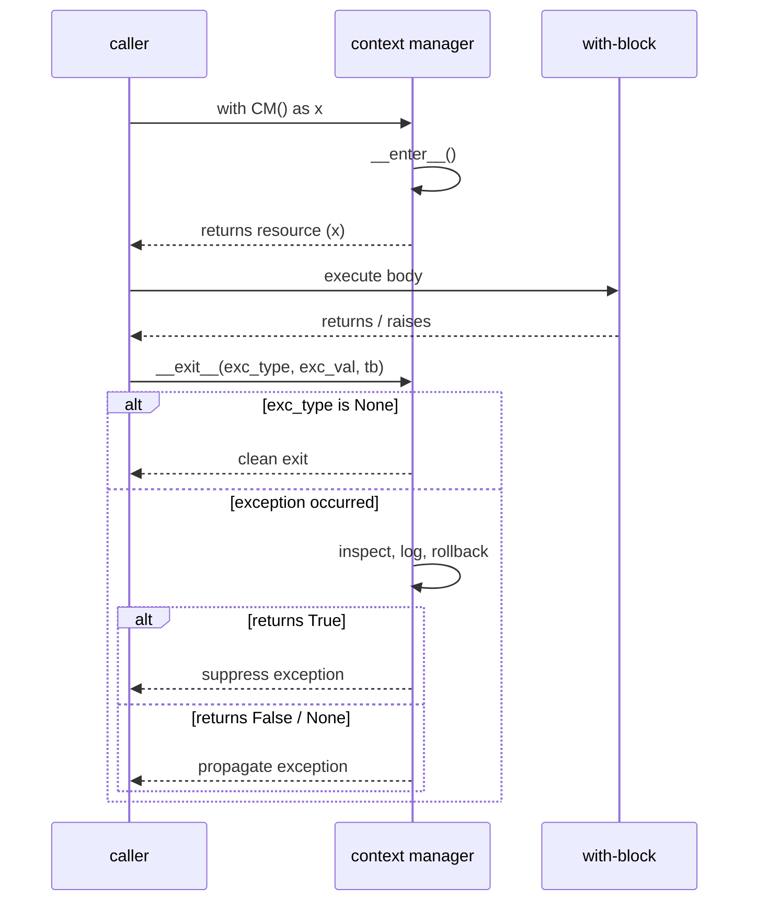
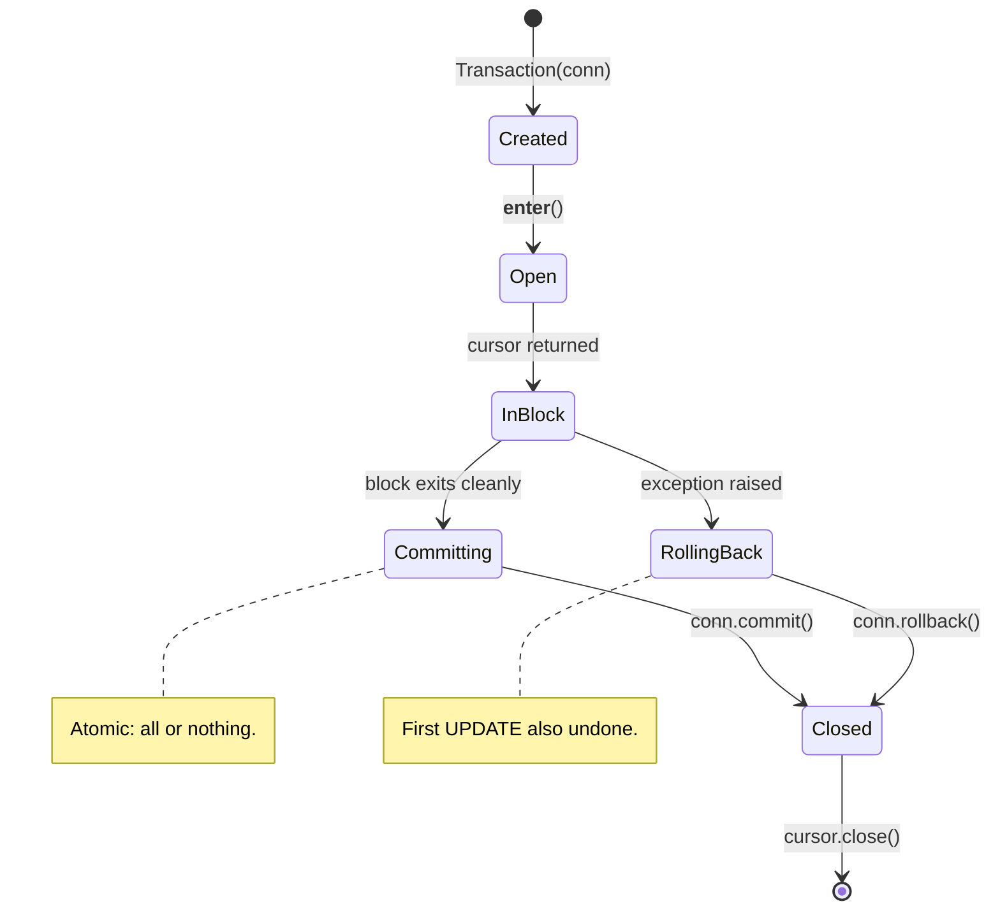
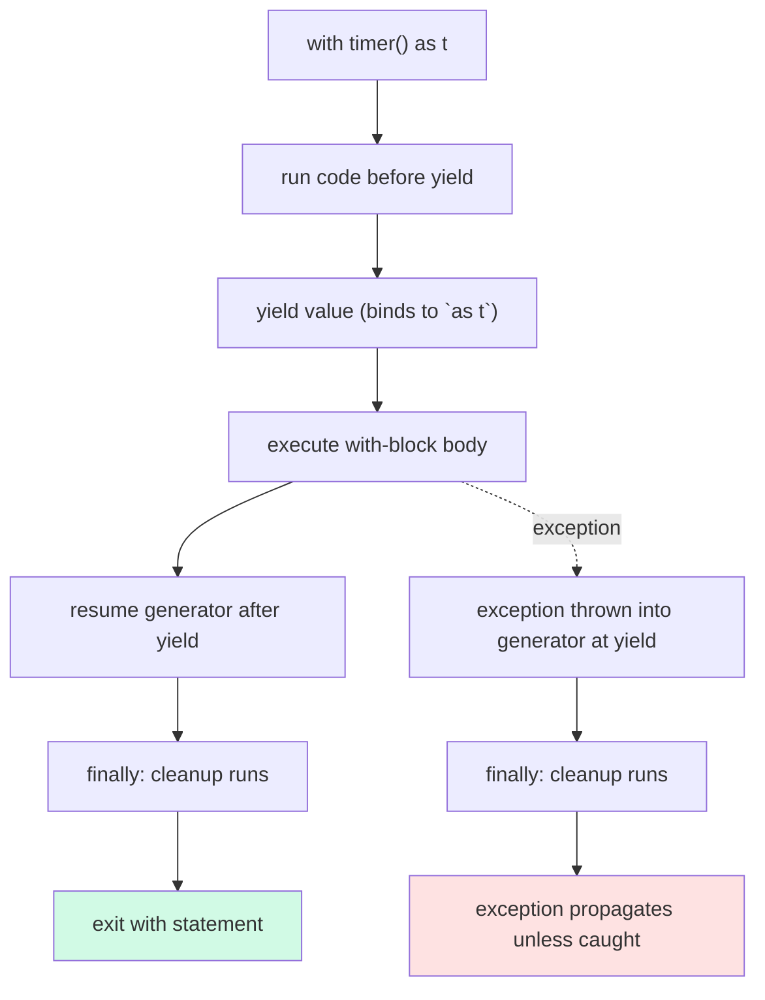
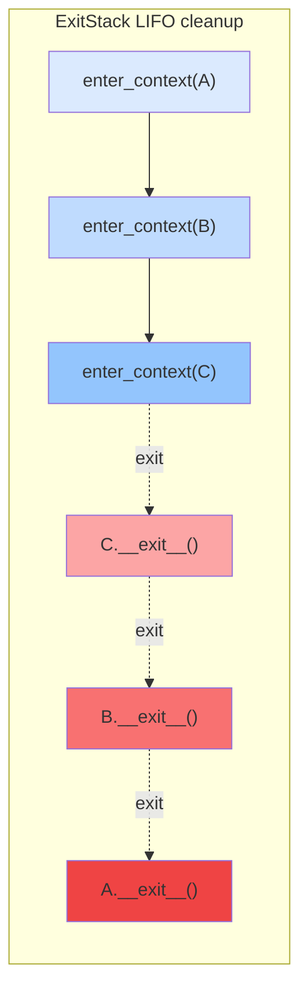
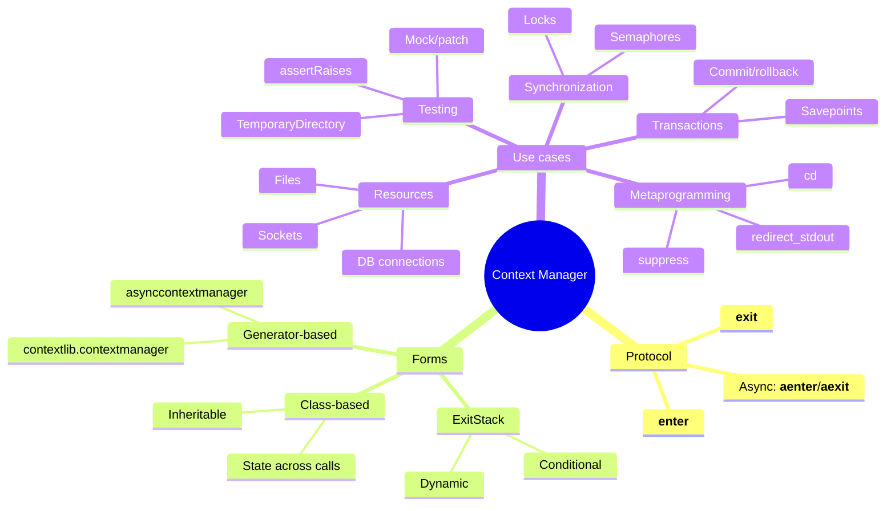
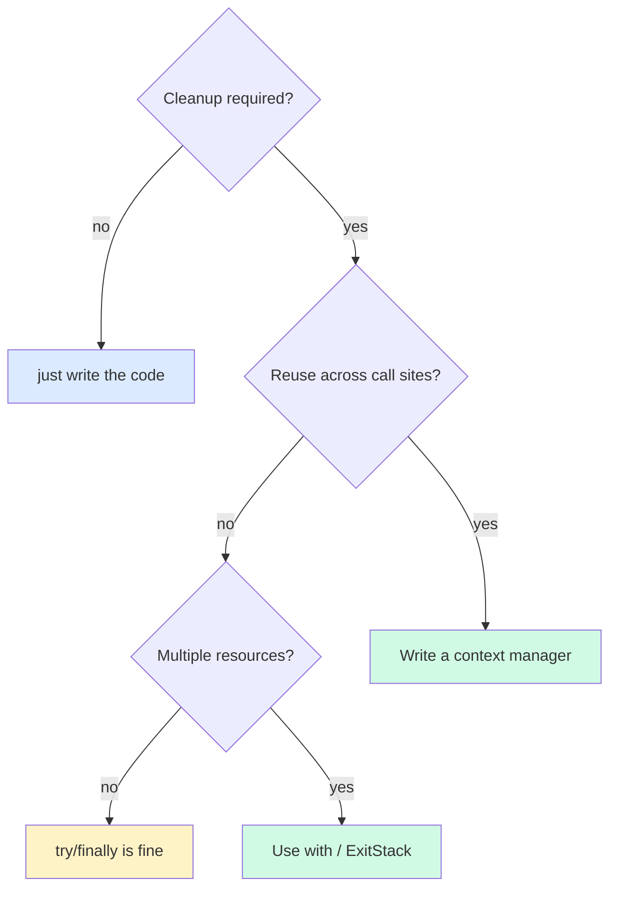

# Context Managers — Resource Lifecycle as an Object

#python #context-managers #with-statement #resources #cleanup #contextlib #teaching #deep-dive

> [!quote] Raymond Hettinger
> "The `with` statement is one of the most under-appreciated features of Python. It's not just for files."

Every program juggles resources: files, sockets, database connections, locks, transactions, temporary directories, mock patches. Every resource has a lifecycle: acquire → use → release. The release step is where bugs live. Forget to close a file, and you leak a file descriptor. Forget to release a lock, and your program deadlocks. Forget to roll back a transaction, and you corrupt data.

A **context manager** is an object that owns a resource and guarantees its cleanup, no matter what happens inside the `with` block — even if an exception is raised, even if `return` is called, even if `sys.exit()` runs. The protocol is two methods: `__enter__` and `__exit__`. Mastering it transforms resource handling from "I hope I remembered every code path" into "the language enforces it."

Prerequisites: [[Magic-Methods]], [[Decorators-As-OOP]], [[Iterators-And-Generators]] (for `contextlib.contextmanager`).

---

## 1. Why Context Managers Exist

Before `with` (Python 2.5), the idiom for safely closing a file was:

```python
f = open("data.txt")
try:
    process(f)
finally:
    f.close()
```

This is six lines of boilerplate for every resource. People skipped the `try/finally`, especially in scripts — and lost data when exceptions fired mid-write. The `with` statement packages the `try/finally` pattern into the language:

```python
with open("data.txt") as f:
    process(f)
# f.close() is guaranteed to have run by here.
```

| Without `with` | With `with` |
|---|---|
| Manual `try/finally` everywhere | Cleanup is automatic |
| Easy to forget a path | Guaranteed by protocol |
| Nesting is verbose (`try: try: ... finally: ... finally:`) | Nesting is linear (`with a, b, c:`) |
| Hard to refactor | Trivial to extract a helper |
| Resource leakage on early `return` | Cleanup runs on `return` too |

The `with` statement isn't a shortcut; it's a **structural guarantee**. When you see `with`, you know *cleanup happens*. When you don't, you have to audit.

---

## 2. The Protocol — `__enter__` and `__exit__`

A context manager is any object that implements two methods:

| Method | Signature | Called when |
|---|---|---|
| `__enter__` | `def __enter__(self)` | Entering the `with` block; return value is bound to the `as` variable |
| `__exit__` | `def __exit__(self, exc_type, exc_val, exc_tb)` | Leaving the `with` block — normally *or* via exception |

The `__exit__` method's three arguments describe any exception that's propagating out of the block. They're all `None` on a clean exit. This lets `__exit__` decide whether to suppress the exception.

```python
class MyContext:
    def __enter__(self):
        print("entering")
        return self               # bound to `as x`

    def __exit__(self, exc_type, exc_val, exc_tb):
        print(f"exiting; exc_type={exc_type}")
        # Returning True suppresses the exception; False/None propagates it.
        return False
```

```python
with MyContext() as x:
    print("inside")
# entering
# inside
# exiting; exc_type=None
```



> [!warning] Common Student Misconception
> "The `as x` variable is the context manager object." — Not always. It's whatever `__enter__` returns. `open("f")` returns the file object, but the context manager *is* also the file object (files implement both protocols). For other managers — like `contextlib.suppress(ValueError)` — the `as` variable is `None` because `__enter__` returns `None`. Read the docs of each manager.

---

## 3. Building a Context Manager Class

Let's build a `Timer` context manager that measures elapsed time around a block:

```python
import time

class Timer:
    def __init__(self, label="block"):
        self.label = label

    def __enter__(self):
        self.start = time.perf_counter()
        return self

    def __exit__(self, exc_type, exc_val, exc_tb):
        elapsed = time.perf_counter() - self.start
        status = "OK" if exc_type is None else f"FAILED ({exc_type.__name__})"
        print(f"[{self.label}] {elapsed:.3f}s — {status}")
        return False    # don't suppress exceptions
```

```python
with Timer("compute"):
    sum(range(10_000_000))
# [compute] 0.412s — OK

with Timer("broken"):
    1 / 0
# [broken] 0.000s — FAILED (ZeroDivisionError)
# ZeroDivisionError still propagates
```

The block always reports, even on failure. That's the contract: cleanup runs *unconditionally*.

### 3.1 Database Transaction Context Manager

A realistic example — wrapping a DB transaction so it commits on success and rolls back on exception:

```python
class Transaction:
    """Commits on clean exit; rolls back on exception."""
    def __init__(self, connection):
        self.conn = connection

    def __enter__(self):
        self.cursor = self.conn.cursor()
        return self.cursor

    def __exit__(self, exc_type, exc_val, exc_tb):
        try:
            if exc_type is None:
                self.conn.commit()
            else:
                self.conn.rollback()
        finally:
            self.cursor.close()
        return False    # let exceptions propagate
```

```python
import sqlite3
conn = sqlite3.connect("bank.db")

with Transaction(conn) as cur:
    cur.execute("UPDATE accounts SET balance = balance - 100 WHERE id = 1")
    cur.execute("UPDATE accounts SET balance = balance + 100 WHERE id = 2")
# commit only if both UPDATEs succeed
```

If the second `UPDATE` raises, the first is rolled back — exactly what you want for atomic transfers.



---

## 4. Suppressing Exceptions — The Return Value of `__exit__`

If `__exit__` returns a truthy value, Python suppresses the exception that was being raised. This is rarely what you want for *general* exceptions, but it's exactly right for **expected** exceptions:

```python
class SuppressExceptions:
    def __init__(self, *exceptions):
        self.exceptions = exceptions

    def __enter__(self):
        return self

    def __exit__(self, exc_type, exc_val, exc_tb):
        if exc_type is not None and issubclass(exc_type, self.exceptions):
            print(f"Suppressed {exc_type.__name__}: {exc_val}")
            return True     # swallow it
        return False        # propagate anything else
```

```python
with SuppressExceptions(ValueError, TypeError):
    int("not a number")
# Suppressed ValueError: invalid literal for int() with base 10: 'not a number'
# No exception propagates
```

This is exactly what `contextlib.suppress(ValueError, TypeError)` does in the standard library. Reach for the built-in; just remember the mechanism.

> [!danger] Don't Suppress Broadly
> Suppressing `Exception` or `BaseException` is almost always a bug. You'll swallow `KeyboardInterrupt` (so Ctrl-C stops working) and hide programming errors. Suppress specific, expected exceptions only — the same rule as `except` clauses.

---

## 5. `contextlib.contextmanager` — Generators as Context Managers

Writing a class for every context manager is heavy. `contextlib.contextmanager` turns a generator function into a context manager: everything before `yield` is `__enter__`; the `yield` value is what `as` binds; everything after `yield` is `__exit__`.

```python
from contextlib import contextmanager
import time

@contextmanager
def timer(label="block"):
    start = time.perf_counter()
    try:
        yield            # __enter__ returns None here
    finally:
        elapsed = time.perf_counter() - start
        print(f"[{label}] {elapsed:.3f}s")
```

```python
with timer("compute"):
    sum(range(1_000_000))
# [compute] 0.045s
```



### 5.1 Yielding a Value

To make `as t` bind to something useful, `yield` it:

```python
@contextmanager
def open_db(path):
    conn = sqlite3.connect(path)
    try:
        yield conn
    finally:
        conn.close()

with open_db("bank.db") as conn:
    conn.execute("SELECT 1")
```

### 5.2 Handling Exceptions in Generator-Based Managers

If the `with` block raises, the exception is *thrown into the generator at the `yield` point*. To run cleanup unconditionally, use `try/finally`. To suppress specific exceptions, catch them:

```python
@contextmanager
def suppress_value_error():
    try:
        yield
    except ValueError:
        pass    # swallow
```

> [!warning] Don't Catch Everything
> A bare `except:` inside a generator-based context manager will swallow `KeyboardInterrupt` and `SystemExit`. Catch `Exception` at most, and re-raise anything you don't explicitly intend to suppress.

### 5.3 Class vs Decorator — When to Use Which

| Approach | Pros | Cons | Use when… |
|---|---|---|---|
| Class | State across calls, multiple methods, inheritance | Verbose; boilerplate | Complex lifecycle, reusable instances, subclassing |
| `@contextmanager` | Concise, linear, easy to read | No methods, harder to share state | Linear setup/teardown, one-off managers |

Most one-shot managers (timers, locks-with-logging, temp files) are clearer as generator functions. Anything with rich behavior — connection pools, transactions with `.savepoint()`, mock frameworks — earns a class.

---

## 6. `contextlib.ExitStack` — Dynamic Composition

Sometimes you don't know at write-time how many context managers you'll need. You're processing a list of files; you're acquiring a dynamic set of locks. `ExitStack` lets you push context managers at runtime and guarantees they all exit in LIFO order.

```python
from contextlib import ExitStack

files = ["a.txt", "b.txt", "c.txt"]
with ExitStack() as stack:
    handles = [stack.enter_context(open(f)) for f in files]
    for h in handles:
        print(h.read(50))
# All three files guaranteed closed, in reverse order.
```

### 6.1 Conditional Cleanup

`ExitStack.callback(fn, *args)` registers a plain function to run on exit — handy for cleanup that isn't a context manager:

```python
from contextlib import ExitStack
import os, tempfile

with ExitStack() as stack:
    tmpdir = tempfile.mkdtemp()
    stack.callback(os.rmdir, tmpdir)        # always removed
    path = os.path.join(tmpdir, "data.txt")
    with open(path, "w") as f:
        f.write("hello")
    # ... do work ...
# tmpdir removed no matter what
```

### 6.2 Replacing Deep Nesting

Before:

```python
with open("a") as a, open("b") as b, open("c") as c:
    ...
```

After (more flexible):

```python
with ExitStack() as stack:
    a = stack.enter_context(open("a"))
    b = stack.enter_context(open("b"))
    c = stack.enter_context(open("c"))
    ...
```

The `ExitStack` version scales: the list of files can be dynamic, you can interleave setup with logic, and the cleanup order is always correct.



---

## 7. Nested Context Managers

Multiple `with` statements can be written on one line:

```python
with open("in.txt") as src, open("out.txt", "w") as dst:
    dst.write(src.read())
```

This is equivalent to:

```python
with open("in.txt") as src:
    with open("out.txt", "w") as dst:
        dst.write(src.read())
```

> [!warning] Common Bug — Nested Acquisition
> ```python
> # BUG: if open("out.txt","w") fails, "in.txt" is NEVER closed!
> f1 = open("in.txt")
> f2 = open("out.txt", "w")
# with f1, f2:        # not a context manager form; this is the bug
> try:
>     ...
> finally:
>     f1.close()
>     f2.close()
> ```
> If `open("out.txt")` raises, `f1` is leaked. The fix: use `with` directly, or `ExitStack` so each acquisition is paired with its cleanup at acquisition time.

---

## 8. Async Context Managers

Python 3.5 introduced `async with`, backed by `__aenter__` and `__aexit__` (the async counterparts). They're `async def` methods that the event loop awaits.

```python
class AsyncDBConnection:
    async def __aenter__(self):
        self.conn = await connect_async()
        return self.conn

    async def __aexit__(self, exc_type, exc_val, exc_tb):
        await self.conn.close()
        return False
```

```python
async def main():
    async with AsyncDBConnection() as conn:
        await conn.execute("SELECT 1")
```

`contextlib.asynccontextmanager` is the generator-based equivalent:

```python
from contextlib import asynccontextmanager

@asynccontextmanager
async def async_db(path):
    conn = await connect_async(path)
    try:
        yield conn
    finally:
        await conn.close()
```

See [[Async-OOP]] for the full async story. The mental model is identical: setup, yield/enter, body, teardown — just with `await` sprinkled in.

---

## 9. Common Patterns Catalog

| Pattern | Use case | Sketch |
|---|---|---|
| **File handling** | Auto-close files | `with open(p) as f: ...` |
| **DB transactions** | Commit/rollback atomically | `with Transaction(conn) as cur: ...` |
| **Lock acquisition** | Always release, even on exception | `with lock: ...` |
| **Temp directory** | Create on enter, remove on exit | `with TemporaryDirectory() as d: ...` |
| **Change directory** | `cd` somewhere, restore on exit | `with cd("build"): ...` |
| **Patch/mock** | Replace object, restore on exit | `with patch("m.f"): ...` |
| **Redirect stdout** | Capture prints | `with redirect_stdout(buf): ...` |
| **Timer** | Measure block runtime | `with Timer() as t: ...; print(t.elapsed)` |
| **Suppress** | Swallow expected exception | `with suppress(ValueError): int(s)` |
| **Resource pool** | Check out, return on exit | `with pool.acquire() as r: ...` |

### 9.1 Resource Pool Context Manager

A pool of N database connections. The context manager checks one out and returns it on exit, even if the user code raises:

```python
import queue

class ConnectionPool:
    def __init__(self, factory, size=5):
        self._pool = queue.Queue(maxsize=size)
        for _ in range(size):
            self._pool.put(factory())

    @contextmanager
    def acquire(self):
        conn = self._pool.get()       # blocks if empty
        try:
            yield conn
        finally:
            self._pool.put(conn)      # always return it

# Usage
pool = ConnectionPool(lambda: sqlite3.connect("bank.db"), size=3)
with pool.acquire() as conn:
    conn.execute("UPDATE accounts SET balance = balance + 1")
```

This pattern gives you a tiny object pool with deterministic return — no `__del__`, no GC surprises.

### 9.2 Suppressing Exceptions (Built-in)

```python
from contextlib import suppress
import os

with suppress(FileNotFoundError):
    os.remove("temp.txt")     # no error if missing
```

Equivalent to:

```python
try:
    os.remove("temp.txt")
except FileNotFoundError:
    pass
```

But composable, and it nests cleanly inside other `with` blocks.

### 9.3 Built-in Managers You Should Know

The `contextlib` module ships with several ready-to-use context managers. Memorize them — they cover the 80% of cleanup patterns you'll ever need.

| Manager | Purpose | Example |
|---|---|---|
| `closing(thing)` | Calls `.close()` on exit (for objects that aren't context managers) | `with closing(urlopen(url)) as r: ...` |
| `suppress(*Exc)` | Swallow specified exceptions | `with suppress(FileNotFoundError): os.remove(p)` |
| `redirect_stdout(target)` / `redirect_stderr` | Replace `sys.stdout` for the block | Capture prints into a `StringIO` |
| `ExitStack()` | Dynamic / conditional context managers | See §6 |
| `chdir(path)` (3.11+) | Temporarily change working directory | `with chdir("build"): subprocess.run(["make"])` |
| `redirect_stdout(buf)` | Capture `print()` output | Test-friendly logging assertions |
| `nullcontext(enter_result=None)` | A no-op manager — handy when a function *might* need a lock | `with (lock or nullcontext()): ...` |

The `nullcontext` trick is worth a closer look:

```python
from contextlib import nullcontext

def process(data, lock=None):
    # If lock is None, use a no-op manager; else acquire the lock.
    with (lock or nullcontext()):
        return compute(data)
```

This lets the caller decide whether synchronization is needed, while your code always uses the `with` form. No `if lock:` branching.

### 9.4 Reentrant Pattern — `contextlib.suppress` + `ExitStack`

Combine `ExitStack` with `suppress` to retry-able sections that ignore transient errors:

```python
from contextlib import ExitStack, suppress

def safe_remove_all(paths):
    """Remove every path; ignore missing ones; collect other errors."""
    errors = []
    with ExitStack() as stack:
        for p in paths:
            stack.enter_context(suppress(FileNotFoundError))
            try:
                os.remove(p)
            except OSError as e:
                errors.append((p, e))
    return errors
```

The `ExitStack` here ensures every `suppress` is properly closed, even if a later operation raises an unexpected error.

---

## 10. The `__exit__` Truth Table

| Situation | `exc_type` | `exc_val` | `exc_tb` | Return True? | Return False? |
|---|---|---|---|---|---|
| Block exits cleanly | `None` | `None` | `None` | No effect (nothing to suppress) | Normal |
| Block raises `ValueError` | `ValueError` | instance | traceback | Suppresses the `ValueError` | Propagates it |
| Block raises unrelated `KeyError` | `KeyError` | instance | traceback | Suppresses the `KeyError` (probably wrong!) | Propagates it |
| `KeyboardInterrupt` mid-block | `KeyboardInterrupt` | instance | traceback | Suppresses Ctrl-C (dangerous!) | Propagates it |

> [!tip] Teaching Tip
> Have students trace what happens if `__exit__` returns `True` unconditionally: the `with` block can never raise. That includes `KeyboardInterrupt`. Demo it: a `with` block with an infinite loop becomes impossible to interrupt. This drives home *why* the return value matters.

---

## 11. Pitfalls and Anti-Patterns

> [!danger] Returning `True` Always
> ```python
> def __exit__(self, *exc):
>     return True       # swallows EVERY exception
> ```
> Now no exception, including `KeyboardInterrupt` and `SystemExit`, ever escapes the block. Bugs become invisible. Only return `True` when you've checked `exc_type` is one you specifically intend to swallow.

> [!danger] Re-raising in `__exit__`
> ```python
> def __exit__(self, *exc):
>     raise RuntimeError("cleanup failed")   # masks the original exception!
> ```
> If the block already raised, raising again inside `__exit__` replaces the original. Either chain with `raise ... from exc_val` or use `contextlib.suppress` semantics deliberately.

> [!danger] Yielding in Generator Manager Without try/finally
> ```python
> @contextmanager
> def bad():
>     setup()
>     yield
>     teardown()      # NEVER runs if block raises!
> ```
> Always wrap `yield` in `try/finally` so teardown runs unconditionally. The `@contextmanager` decorator *does* forward exceptions through the generator, but only if you let them propagate through a `try` block.

> [!warning] Side Effects in `__enter__` That Can Fail
> If `__enter__` raises, `__exit__` is **not** called — the protocol assumes the resource wasn't acquired. So if `__enter__` partially acquires (open file, then open socket), you must clean up the partial state inside `__enter__` itself before re-raising. The pattern is `try/except` inside `__enter__` that rolls back what it can.

> [!note] Order Matters in `with a, b:`
> `__enter__` is called left-to-right; `__exit__` is called right-to-left. So `with a, b:` is `enter a → enter b → body → exit b → exit a`. This mirrors `try/finally` nesting.

---

## 12. Context Managers as a Design Pattern

Context managers are an instance of the **Execute-Around Method** pattern (also called "around advice" in AOP). You factor out setup and teardown from the actual work, and the language guarantees both run.



Compare to other languages:

| Language | Equivalent |
|---|---|
| Java | `try-with-resources` (Java 7+) — `AutoCloseable` |
| C# | `using` statement — `IDisposable` |
| C++ | RAII (destructor runs at scope exit) |
| Go | `defer` statement (cleanup runs at function exit) |
| Rust | RAII + `Drop` trait |
| Python | `with` statement — `__enter__`/`__exit__` |

Python's version is distinctive in that the cleanup object is explicit (you can pass it around, store it, decorate it) and in that `__exit__` can suppress exceptions — most other languages don't allow that.

---

## 13. Complete Example — Saveable Block

A reusable context manager that snapshots an object's state on enter and restores it on exit. Useful for testing.

```python
from contextlib import contextmanager
import copy

@contextmanager
def snapshot(obj):
    """Snapshot obj.__dict__ on enter; restore on exit (even on exception)."""
    saved = copy.deepcopy(obj.__dict__)
    try:
        yield obj
    finally:
        obj.__dict__.clear()
        obj.__dict__.update(saved)

class Settings:
    def __init__(self, **kw):
        self.__dict__.update(kw)

s = Settings(debug=False, level=1)
with snapshot(s):
    s.debug = True
    s.level = 99
    print(s.debug, s.level)   # True 99
print(s.debug, s.level)       # False 1 — restored
```

Notice the `try/finally` — without it, an exception in the block would leak the mutated state.

### 13.1 A Second Example — Savepoint Inside a Transaction

Real database transactions support **savepoints**: you can roll back to a named point without abandoning the whole transaction. We can model that with a nested context manager:

```python
class Transaction:
    """Outer transaction: commit/rollback. Inner savepoint: rollback only to here."""
    def __init__(self, conn):
        self.conn = conn
        self._savepoint_counter = 0

    def __enter__(self):
        self.cursor = self.conn.cursor()
        return self

    def __exit__(self, exc_type, exc_val, exc_tb):
        try:
            if exc_type is None:
                self.conn.commit()
            else:
                self.conn.rollback()
        finally:
            self.cursor.close()
        return False

    @contextmanager
    def savepoint(self):
        name = f"sp_{self._savepoint_counter}"
        self._savepoint_counter += 1
        self.cursor.execute(f"SAVEPOINT {name}")
        try:
            yield
        except Exception:
            self.cursor.execute(f"ROLLBACK TO SAVEPOINT {name}")
            raise      # let outer transaction see it
        else:
            self.cursor.execute(f"RELEASE SAVEPOINT {name}")

# Usage
with Transaction(conn) as tx:
    tx.cursor.execute("INSERT INTO accounts(id, balance) VALUES (1, 100)")
    try:
        with tx.savepoint():
            tx.cursor.execute("INSERT INTO accounts(id, balance) VALUES (2, 50)")
            raise RuntimeError("oops")            # rolled back to savepoint
    except RuntimeError:
        print("inner failed, outer continues")
    # account 1 inserted, account 2 NOT — outer commits cleanly
```

This is the canonical pattern for partial-failure handling in transactions. The inner `savepoint` swallows nothing — it just rolls back its own work and re-raises, letting the outer transaction decide.

---

## 14. Context Managers vs `try/finally`

When should you reach for `with` versus a plain `try/finally`?



The rule of thumb: **if you write the same `try/finally` twice, factor it into a context manager.** The third use is free.

---

## 14.5 Testing Context Managers

Context managers need their own test discipline — you want to verify (a) cleanup runs on success, (b) cleanup runs on exception, (c) the right value is yielded, and (d) exceptions are suppressed only when intended. A small helper makes this systematic:

```python
import pytest
from contextlib import contextmanager

@contextmanager
def maybe_suppress(exc_type):
    try:
        yield
    except exc_type:
        pass

def test_cleanup_runs_on_success():
    cleaned = []
    @contextmanager
    def cm():
        try:
            yield
        finally:
            cleaned.append(True)
    with cm():
        pass
    assert cleaned == [True]

def test_cleanup_runs_on_exception():
    cleaned = []
    @contextmanager
    def cm():
        try:
            yield
        finally:
            cleaned.append(True)
    with pytest.raises(ValueError):
        with cm():
            raise ValueError("boom")
    assert cleaned == [True]

def test_suppresses_specified_exception():
    with maybe_suppress(ValueError):
        raise ValueError("ignored")
    # No exception propagated — test passes.

def test_does_not_suppress_other_exceptions():
    with pytest.raises(KeyError):
        with maybe_suppress(ValueError):
            raise KeyError("not ignored")
```

> [!tip] Teaching Tip
> Have students write all four tests for their custom context manager. The "doesn't suppress other exceptions" test is the one most teams forget — and it's the one that catches the bug where someone returned `True` from `__exit__` unconditionally.

### 14.5.1 Using `contextlib`'s Test Helpers

For class-based managers, you can directly exercise `__enter__` and `__exit__` without a `with` block:

```python
def test_exit_gets_exception_info():
    cm = MyManager()
    cm.__enter__()
    try:
        raise ValueError("x")
    except ValueError as e:
        result = cm.__exit__(type(e), e, e.__traceback__)
    assert result is False   # propagated
```

This is verbose but exposes the protocol cleanly — useful for white-box testing of complex managers.

### 14.5.2 Testing Order of Cleanup

For nested or `ExitStack`-based managers, the cleanup order matters. A simple way to test it is to instrument each `__exit__`:

```python
events = []

class Tracked:
    def __init__(self, name):
        self.name = name
    def __enter__(self):
        events.append(f"enter {self.name}")
        return self
    def __exit__(self, *exc):
        events.append(f"exit {self.name}")
        return False

with Tracked("A"), Tracked("B"), Tracked("C"):
    events.append("body")

assert events == [
    "enter A", "enter B", "enter C",
    "body",
    "exit C", "exit B", "exit A",   # LIFO!
]
```

This kind of test is invaluable when you're refactoring an `ExitStack`-based design and want to be sure the cleanup order hasn't shifted.

---

## 15. Summary

- A **context manager** is any object with `__enter__` and `__exit__`.
- `with x as y:` binds `y` to whatever `x.__enter__()` returns; `__exit__` is guaranteed to run, even on exception.
- `__exit__`'s three arguments describe any propagating exception; returning `True` suppresses it (use sparingly).
- `contextlib.contextmanager` turns a generator into a context manager — everything before `yield` is setup, after `yield` is teardown.
- Always wrap `yield` in `try/finally` so teardown runs unconditionally.
- `contextlib.ExitStack` handles dynamic numbers of managers and conditional cleanup.
- `async with` and `__aenter__`/`__aexit__` are the async counterparts; use `@asynccontextmanager` for the generator form.
- Context managers are the **Execute-Around Method** pattern: setup and teardown become structural, not accidental.
- They compose: nest `with` statements (or use `with a, b, c:`) for ordered acquisition and LIFO cleanup.

> [!success] You Understand Context Managers When…
> You never write `f = open(...)` without a `with`, you can explain why `__exit__`'s return value matters, and you reach for `ExitStack` the moment the number of resources becomes dynamic.

## See Also

- [[Magic-Methods]] — `__enter__`/`__exit__` live here
- [[Decorators-As-OOP]] — `@contextmanager` is itself a decorator
- [[Iterators-And-Generators]] — `@contextmanager` is built on generator semantics
- [[Async-OOP]] — `async with`, `__aenter__`/`__aexit__`
- [[Concurrency-In-OOP]] — `with lock:` is the standard pattern for thread-safe code
- [[Composition-Over-Inheritance]] — context managers compose via nesting
