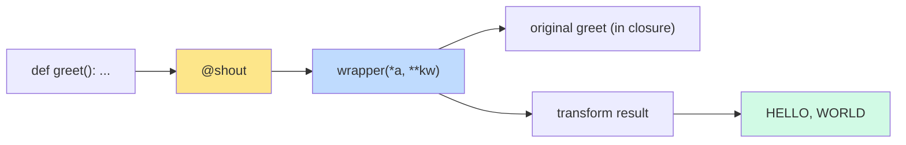
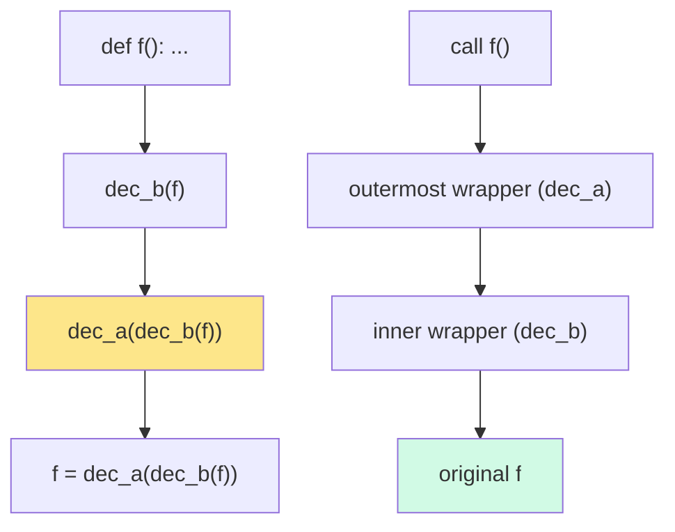
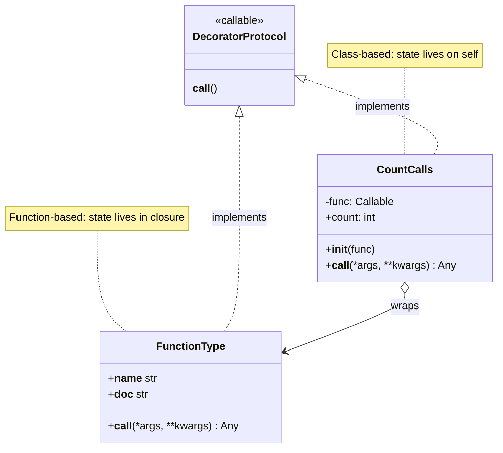
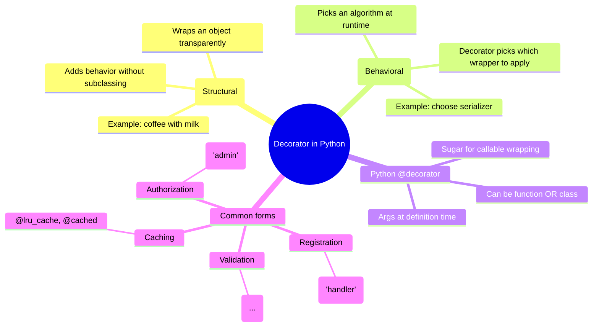

# Decorators as OOP — Functions, Classes, and the Wrapping Protocol

#python #decorators #functools #metaprogramming #strategy-pattern #decorator-pattern #teaching #deep-dive

> [!quote] Jack Diederich
> "Decorators are how you tell the next function what to do — at definition time."

A **decorator** is a callable that takes a callable and returns a (usually enhanced) callable. The `@decorator` syntax is just sugar for `name = decorator(name)` after the function or class definition. Under that tiny piece of sugar lies one of Python's most powerful metaprogramming features — and one that maps directly onto two classic OOP patterns: the **Decorator** (structural) and **Strategy** (behavioral).

This note covers the syntax, the function-based form, the class-based form (which uses `__call__`), decorators with arguments, stacking order, `functools.wraps`, the built-in OOP decorators (`@property`, `@staticmethod`, `@classmethod`, `@abstractmethod`), and four custom decorators you'll write again and again (`@cached`, `@logged`, `@validated`, `@retry`).

Prerequisites: [[Magic-Methods]] (especially `__call__`), [[Descriptors]] (for `property`/`classmethod`/`staticmethod`), [[Composition-Over-Inheritance]].

---

## 1. What Is a Decorator?

A decorator is a higher-order function (or callable object) that transforms a callable:

```python
def shout(func):
    def wrapper(*args, **kwargs):
        result = func(*args, **kwargs)
        return result.upper()
    return wrapper

@shout
def greet(name):
    return f"hello, {name}"

print(greet("world"))   # HELLO, WORLD
```

`@shout` *is* `greet = shout(greet)`. After decoration, the name `greet` is bound to `wrapper`, which calls the original `greet` (now stored in `wrapper`'s closure) and transforms the result.



The decorator doesn't run at call time — it runs at **definition time**. That's important: side effects in a decorator (registration, validation, monkey-patching) happen when the module loads, not when the function is called.

---

## 2. The `@decorator` Syntax

The `@` syntax was introduced in PEP 318 to clean up patterns that were already common but ugly:

```python
# Before PEP 318
def greet(name): return f"hello, {name}"
greet = shout(greet)

# After PEP 318
@shout
def greet(name): return f"hello, {name}"
```

Both are exactly equivalent. The `@` form is just visually attached to the definition. You can stack decorators — but **order matters**:

```python
@dec_a
@dec_b
def f(): ...
# Equivalent to: f = dec_a(dec_b(f))
```

The decorator *closest* to the function (`dec_b`) wraps first; `dec_a` wraps the result. Think of it as nested function calls — the innermost decorator is applied first.



> [!warning] Common Student Misconception
> "Top decorator runs first." — *At decoration time*, yes: `dec_a` is called last. But *at call time*, `dec_a`'s wrapper runs first because it's the outermost. The two senses of "first" confuse everyone. Be precise: **outermost-at-call, last-at-decoration.**

---

## 3. Function-Based Decorators

The simplest form: a function that takes a function and returns a wrapper. Use `*args, **kwargs` to be signature-agnostic.

```python
import functools

def log_calls(func):
    @functools.wraps(func)
    def wrapper(*args, **kwargs):
        print(f"calling {func.__name__}({args}, {kwargs})")
        result = func(*args, **kwargs)
        print(f"  -> {result!r}")
        return result
    return wrapper

@log_calls
def add(a, b):
    return a + b

add(2, 3)
# calling add((2, 3), {})
#   -> 5
```

### 3.1 `functools.wraps` — Preserve Metadata

Without `@functools.wraps(func)`, the wrapper takes over the name, docstring, and signature of the original:

```python
def log_calls(func):
    def wrapper(*args, **kwargs):
        return func(*args, **kwargs)
    return wrapper

@log_calls
def add(a, b):
    """Add two numbers."""
    return a + b

print(add.__name__)    # "wrapper" — wrong!
print(add.__doc__)     # None — lost!
```

`@functools.wraps(func)` copies `__name__`, `__doc__`, `__module__`, `__qualname__`, `__annotations__`, and `__dict__` from `func` to `wrapper`, and sets `__wrapped__` so `inspect.signature` can find the original. **Always use it.** This is one of the few "always" rules in Python.

> [!tip] Teaching Tip
> Show students `help(add)` with and without `@wraps`. The difference is the entire docstring disappearing from `help()`. That visceral loss makes the rule stick.

---

## 4. Class-Based Decorators

A decorator is *any callable*. Classes with `__call__` are callable. So a class *is* a decorator — and class-based decorators get something function-based decorators don't: **state in instance attributes**, which is easier to inspect, test, and reset.

```python
import functools

class CountCalls:
    def __init__(self, func):
        functools.update_wrapper(self, func)
        self.func = func
        self.count = 0

    def __call__(self, *args, **kwargs):
        self.count += 1
        print(f"call #{self.count} to {self.func.__name__}")
        return self.func(*args, **kwargs)

@CountCalls
def say_hi():
    print("hi!")

say_hi()   # call #1 to say_hi → hi!
say_hi()   # call #2 to say_hi → hi!
say_hi()   # call #3 to say_hi → hi!
print(say_hi.count)   # 3
```

`functools.update_wrapper(self, func)` is the class-based equivalent of `@functools.wraps(func)`. It copies the metadata onto `self`.



| Form | State lives in | Inspection | When to use |
|---|---|---|---|
| Function-based | Closure variables | Hard — closure is opaque | Simple wrappers, no shared state |
| Class-based | Instance attributes | Easy — `decorated.count`, `decorated.reset()` | Stateful decorators, configurable instances |

---

## 5. Decorators with Arguments

A decorator that takes arguments is a *three-level* callable: the outer level takes the args and returns the actual decorator, which takes the function and returns the wrapper.

```python
def repeat(times):
    def decorator(func):
        @functools.wraps(func)
        def wrapper(*args, **kwargs):
            result = None
            for _ in range(times):
                result = func(*args, **kwargs)
            return result
        return wrapper
    return decorator

@repeat(times=3)
def greet(name):
    print(f"hi, {name}")

greet("world")
# hi, world
# hi, world
# hi, world
```

The call chain: `repeat(3)` → `decorator` → `wrapper`. The `@repeat(times=3)` syntax first calls `repeat(3)`, then uses the result to decorate `greet`.

### 5.1 Class-Based Parameterized Decorator

```python
class Repeat:
    def __init__(self, times):
        self.times = times

    def __call__(self, func):
        @functools.wraps(func)
        def wrapper(*args, **kwargs):
            result = None
            for _ in range(self.times):
                result = func(*args, **kwargs)
            return result
        return wrapper

@Repeat(times=3)
def greet(name): print(f"hi, {name}")
```

Notice the difference from §4: here `__init__` takes the *parameters*, and `__call__` takes the *function*. The class instance is the decorator; `__call__` produces the wrapper.

> [!warning] Two Meanings of `__init__`
> - **Stateless decorator (§4):** `__init__(self, func)` — the function is the constructor argument.
> - **Parameterized decorator (§5.1):** `__init__(self, times)` — parameters go to the constructor; the function goes to `__call__`.
> Don't mix them. The tell-tale sign is whether the `@decorator` line has parentheses.

---

## 6. Method Decorators

Decorators work on methods too — but be careful about `self`. If you decorate a method, the wrapper must accept `self` as the first positional arg (or use `*args`).

```python
def validate_positive(method):
    @functools.wraps(method)
    def wrapper(self, value, *args, **kwargs):
        if value < 0:
            raise ValueError(f"{method.__name__} got negative: {value}")
        return method(self, value, *args, **kwargs)
    return wrapper

class BankAccount:
    def __init__(self, balance=0):
        self.balance = balance

    @validate_positive
    def deposit(self, amount):
        self.balance += amount

    @validate_positive
    def withdraw(self, amount):
        if amount > self.balance:
            raise ValueError("insufficient funds")
        self.balance -= amount
```

For decorating methods, consider `inspect.signature` introspection or a small library like `wrapt` if you need to handle classmethods, staticmethods, and properties uniformly.

---

## 7. Built-in OOP Decorators

Python ships with four decorators that are essential to OOP. They're all implemented as descriptors (see [[Descriptors]]).

| Decorator | Purpose | Applied to | Effect |
|---|---|---|---|
| `@property` | Define a getter as an attribute | Method | Becomes a data descriptor |
| `@<prop>.setter` | Define a setter | Method | Adds `__set__` to the property |
| `@<prop>.deleter` | Define a deleter | Method | Adds `__delete__` |
| `@staticmethod` | Method without `self`/`cls` | Method | No implicit first arg |
| `@classmethod` | Method receiving the class | Method | First arg is the class |
| `@abstractmethod` | Force subclasses to override | Method | Marks as abstract; can't instantiate |

```python
from abc import ABC, abstractmethod

class Shape(ABC):
    @property
    @abstractmethod
    def area(self) -> float:
        ...

    @classmethod
    @abstractmethod
    def from_dict(cls, data):
        ...

    @staticmethod
    def is_valid_side(s):
        return s > 0

class Square(Shape):
    def __init__(self, side):
        self.side = side

    @property
    def area(self):
        return self.side ** 2

    @classmethod
    def from_dict(cls, data):
        return cls(data["side"])
```

### 7.1 Stacking Order for `@property` + `@abstractmethod`

Note the order in `Shape`:

```python
@property
@abstractmethod
def area(self): ...
```

The `@abstractmethod` is *innermost* — it marks the function first, then `@property` wraps it. Reversing them (`@abstractmethod` on top of `@property`) is a subtle bug: `abstractmethod` doesn't know how to wrap a `property` correctly, and you lose the abstract-ness check. **`@abstractmethod` should always be the innermost decorator** when stacked with `@property`, `@staticmethod`, or `@classmethod`.

> [!danger] Common Bug
> ```python
> @abstractmethod        # WRONG ORDER
> @property
> def area(self): ...
> ```
> This compiles, but the abstractness check doesn't fire — you can instantiate the subclass. Always put `@abstractmethod` closest to the function.

---

## 8. Four Custom Decorators You'll Write Again and Again

### 8.1 `@cached` — Memoize Results

```python
import functools

def cached(func):
    cache = {}
    @functools.wraps(func)
    def wrapper(*args):
        if args not in cache:
            cache[args] = func(*args)
        return cache[args]
    wrapper.cache_clear = cache.clear
    wrapper.cache_info = lambda: {"size": len(cache), "hits": getattr(wrapper, "_hits", 0)}
    return wrapper

@cached
def fib(n):
    return n if n < 2 else fib(n - 1) + fib(n - 2)

print(fib(50))   # fast — O(n) calls
fib.cache_clear() # reset
```

The standard library's `functools.lru_cache(maxsize=128)` does this better (with LRU eviction and C-level speed) — use that in production. But the hand-rolled version teaches the pattern.

### 8.2 `@logged` — Wrap Every Call with Logging

```python
import functools, logging, time
log = logging.getLogger(__name__)

def logged(level=logging.INFO):
    def decorator(func):
        @functools.wraps(func)
        def wrapper(*args, **kwargs):
            log.log(level, f"→ {func.__name__}({args}, {kwargs})")
            start = time.perf_counter()
            try:
                result = func(*args, **kwargs)
            except Exception as e:
                log.error(f"✗ {func.__name__}: {e!r}")
                raise
            elapsed = (time.perf_counter() - start) * 1000
            log.log(level, f"← {func.__name__} → {result!r} ({elapsed:.1f} ms)")
            return result
        return wrapper
    return decorator

@logged(level=logging.DEBUG)
def process(order):
    ...
```

### 8.3 `@validated` — Enforce Argument Contracts

```python
import functools

def validated(*validators):
    """validators: callables returning True/False for each positional arg."""
    def decorator(func):
        @functools.wraps(func)
        def wrapper(*args, **kwargs):
            for value, validator in zip(args, validators):
                if not validator(value):
                    raise ValueError(f"{func.__name__}: bad arg {value!r}")
            return func(*args, **kwargs)
        return wrapper
    return decorator

@validated(lambda x: x > 0, lambda y: isinstance(y, str))
def ship(quantity, address):
    print(f"shipping {quantity} to {address}")

ship(3, "123 Main")          # OK
ship(-1, "123 Main")         # ValueError
```

### 8.4 `@retry` — Transient Failure Recovery

```python
import functools, time

def retry(times=3, delay=0.5, exceptions=(Exception,)):
    def decorator(func):
        @functools.wraps(func)
        def wrapper(*args, **kwargs):
            last_exc = None
            for attempt in range(times):
                try:
                    return func(*args, **kwargs)
                except exceptions as e:
                    last_exc = e
                    print(f"  attempt {attempt + 1}/{times} failed: {e!r}")
                    time.sleep(delay)
            raise last_exc
        return wrapper
    return decorator

@retry(times=5, delay=1.0, exceptions=(ConnectionError, TimeoutError))
def fetch(url):
    ...
```

Each of these is small (10–20 lines), but they pay back across an entire codebase. A team that builds a `decorators.py` module with these four — and a few project-specific ones — writes safer, more declarative code than one without.

---

## 9. Decorators as Design Patterns

Decorators are not just "Python sugar." They're instances of two classic GoF patterns:



### 9.1 Decorator Pattern (Structural)

The classic Decorator pattern wraps an object to add behavior without subclassing. `@logged`, `@retry`, and `@cached` are exactly this: they wrap a callable and add cross-cutting behavior transparently.

```python
# Coffee example — classic Decorator pattern
class Coffee:
    def cost(self): return 5
    def describe(self): return "coffee"

class MilkDecorator:
    def __init__(self, inner): self.inner = inner
    def cost(self): return self.inner.cost() + 1
    def describe(self): return self.inner.describe() + " + milk"

class SugarDecorator:
    def __init__(self, inner): self.inner = inner
    def cost(self): return self.inner.cost() + 0.5
    def describe(self): return self.inner.describe() + " + sugar"

drink = SugarDecorator(MilkDecorator(Coffee()))
print(drink.cost())      # 6.5
print(drink.describe())  # coffee + milk + sugar
```

The Python `@decorator` form is the same idea applied to callables. The wrapper *is* a decorator instance, and the wrapped function *is* the inner component.

### 9.2 Strategy Pattern (Behavioral)

A parameterized decorator *selects a strategy* at definition time:

```python
def serialize_with(strategy):
    def decorator(cls):
        cls.serialize = strategy
        return cls
    return decorator

def to_json(self):
    import json
    return json.dumps(self.__dict__)

def to_xml(self):
    ...

@serialize_with(to_json)
class User:
    def __init__(self, name): self.name = name

u = User("ada")
print(u.serialize())   # {"name": "ada"}
```

The choice of `to_json` vs `to_xml` is the Strategy pattern — picked by the decorator argument. You could also pick at runtime by re-decorating, but for class-level decisions, definition-time is clearer.

---

## 10. Class Decorators

Since Python 3.9, you can decorate classes too. A class decorator takes a class and returns a (possibly modified) class. Common uses: registering subclasses, adding methods, enforcing invariants, auto-generating `__init__` (see [[Dataclasses]] — `@dataclass` is itself a class decorator).

```python
def cached_property_method(name):
    """Class decorator: cache the result of a method as an attribute."""
    def decorator(cls):
        original = getattr(cls, name)
        @functools.wraps(original)
        def wrapper(self):
            if name not in self.__dict__:
                self.__dict__[name] = original(self)
            return self.__dict__[name]
        setattr(cls, name, wrapper)
        return cls
    return decorator

@cached_property_method("expensive_computation")
class Calculator:
    def expensive_computation(self):
        print("computing...")
        return 42
```

### 10.1 Auto-Registration with a Class Decorator

```python
_REGISTRY = {}

def register(kind):
    def decorator(cls):
        _REGISTRY[kind] = cls
        return cls
    return decorator

@register("circle")
class Circle: ...

@register("square")
class Square: ...

print(_REGISTRY)   # {'circle': <class 'Circle'>, 'square': <class 'Square'>}
```

This is the pattern Flask uses for `@app.route`, pytest for test discovery, and many plugin systems. The decorator's side effect (registration) happens at import time; the function/class is returned unchanged.

> [!warning] Import-Time Side Effects
> Decorators that mutate global state (like `_REGISTRY`) at import time are powerful but subtle. If a module is imported but never used, its classes still register. If you reload the module, you may double-register. Be deliberate about which decorators have side effects.

---

## 11. `functools` Essentials for Decorator Authors

| Tool | What it does |
|---|---|
| `@functools.wraps(func)` | Copy metadata from `func` to wrapper |
| `functools.update_wrapper(wrapper, func)` | Same, callable form (use in class decorators) |
| `@functools.lru_cache(maxsize=128)` | Memoizing decorator with LRU eviction |
| `@functools.cache` | Unbounded memoization (3.9+) |
| `@functools.singledispatch` | Dispatch on first arg's type |
| `@functools.singledispatchmethod` | Same, for methods (3.8+) |
| `functools.partial(func, *args, **kwargs)` | Pre-fill arguments |
| `functools.reduce(func, iterable)` | Fold (not a decorator, but related) |

`@functools.singledispatch` is especially interesting for OOP: it lets you write polymorphic functions *without* subclassing. It's an alternative to virtual methods, useful when you can't modify the classes being dispatched on.

```python
from functools import singledispatch

@singledispatch
def to_json(obj):
    raise TypeError(f"can't serialize {type(obj)}")

@to_json.register
def _(obj: int): return str(obj)
@to_json.register
def _(obj: str): return f'"{obj}"'
@to_json.register
def _(obj: list): return "[" + ",".join(to_json(x) for x in obj) + "]"

print(to_json([1, "two", [3]]))   # [1,"two",[3]]
```

This is the **Visitor pattern** done right — without awkward double-dispatch.

### 11.1 `@singledispatchmethod` for Methods

For methods, `@singledispatch` doesn't work directly because the first argument is `self`. Python 3.8 added `@singledispatchmethod`, which dispatches on the *second* argument:

```python
from functools import singledispatchmethod

class Serializer:
    @singledispatchmethod
    def serialize(self, obj):
        raise TypeError(f"can't serialize {type(obj)}")

    @serialize.register
    def _(self, obj: int): return str(obj)
    @serialize.register
    def _(self, obj: str): return f'"{obj}"'
    @serialize.register
    def _(self, obj: list):
        return "[" + ",".join(self.serialize(x) for x in obj) + "]"

s = Serializer()
print(s.serialize([1, "two", [3]]))   # [1,"two",[3]]
```

This is a beautiful alternative to a polymorphic `to_json()` method: the dispatch lives in one class, not scattered across the data classes. New types can be added by registering against `Serializer.serialize`, without modifying the data classes themselves.

### 11.2 Building a Mini `@dataclass`

To show how class decorators can transform a class, here's a tiny `@auto_init` that generates `__init__` from class-level type annotations:

```python
import functools

def auto_init(cls):
    """Generate __init__ from class-level annotations with defaults."""
    annotations = getattr(cls, "__annotations__", {})
    # Defaults: anything set as a class attribute is a default.
    defaults = {k: getattr(cls, k) for k in annotations if hasattr(cls, k)}
    arg_list = list(annotations.keys())

    def __init__(self, *args, **kwargs):
        if len(args) > len(arg_list):
            raise TypeError(f"{cls.__name__} takes {len(arg_list)} args")
        for name, value in zip(arg_list, args):
            setattr(self, name, value)
        for name in arg_list[len(args):]:
            if name in kwargs:
                setattr(self, name, kwargs.pop(name))
            elif name in defaults:
                setattr(self, name, defaults[name])
            else:
                raise TypeError(f"{cls.__name__} missing {name!r}")
        if kwargs:
            raise TypeError(f"unexpected: {list(kwargs)}")

    cls.__init__ = __init__
    return cls

@auto_init
class Point:
    x: int
    y: int
    label: str = "origin"

p = Point(1, 2)
print(p.x, p.y, p.label)   # 1 2 origin

p2 = Point(3, 4, label="hello")
print(p2.label)            # hello
```

This is the essence of `@dataclass` — read annotations, generate `__init__`. The real `@dataclass` is much more sophisticated (it handles `frozen`, `eq`, `order`, `slots`, etc.), but the core mechanism is exactly this: a class decorator that inspects `__annotations__` and adds methods.

> [!tip] Teaching Tip
> Have students write `@auto_init` themselves before showing them `@dataclass`. The "aha" moment — "wait, `__annotations__` exists at class creation?!" — is what unlocks an entire class of metaprogramming.

---

## 12. Pitfalls and Anti-Patterns

> [!danger] Forgetting `@functools.wraps`
> Every wrapper loses the original's `__name__`, `__doc__`, `__module__`, and signature. Tests that introspect (like `inspect.signature`) break. Documentation tools show the wrapper, not the function. **Always use `@wraps`.**

> [!danger] Decorators That Swallow `return`
> ```python
> def bad(func):
>     def wrapper(*a, **kw):
>         func(*a, **kw)        # forgot `return`!
>     return wrapper
> ```
> The wrapped function's return value is silently dropped. Always `return func(*a, **kw)`.

> [!danger] Stateful Decorator Without `wraps`
> ```python
> def counter(func):
>     def wrapper(*a, **kw):
>         wrapper.count += 1
>         return func(*a, **kw)
>     wrapper.count = 0
>     return wrapper
> ```
> This *works*, but `wrapper.__name__` is "wrapper" and `help()` is broken. Combine with `@wraps` or move to a class-based decorator where state is on `self`.

> [!warning] Decorator Order Surprises
> ```python
> @retry(times=3)
> @cached
> def fetch(url): ...
> ```
> The `cached` wraps `fetch` first, then `retry` wraps `cached`. But `cached` returns the *first* result forever — so `retry` never sees a failure after the first success. Almost certainly not what you wanted. Swap them: `@cached` outside, `@retry` inside.

> [!warning] Class Decorators That Return Non-Classes
> A class decorator *can* return a function, but then `isinstance(obj, MyClass)` stops working and type checkers get confused. If you must replace a class with something else, prefer a callable that fakes enough of the class protocol, or rethink the design.

> [!note] `@decorator` vs `@decorator()`
> A common confusion: does `@deco` work or do you need `@deco()`? It depends on the decorator. `deco(func)` works without parens if `deco`'s first arg is the function (stateless form). It needs parens if `deco`'s first arg is the config (parameterized form). Some decorators support both — `functools.lru_cache` lets you write `@lru_cache` (default `maxsize=128`) or `@lru_cache(maxsize=32)`. Supporting both is non-trivial; see the pattern in the `wrapt` library.

---

## 13. Summary

- A **decorator** is a callable that wraps a callable. `@deco` is sugar for `name = deco(name)`.
- **Stacking order**: outermost decorator wraps last at decoration, runs first at call.
- **Function-based** decorators are concise; **class-based** decorators hold state on `self`.
- **Parameterized** decorators are three-level: outer takes args, middle takes the function, inner is the wrapper.
- **Always use `@functools.wraps`** to preserve metadata.
- Built-in OOP decorators — `@property`, `@staticmethod`, `@classmethod`, `@abstractmethod` — are implemented as descriptors.
- When stacking `@abstractmethod` with `@property`/`@classmethod`/`@staticmethod`, `@abstractmethod` must be **innermost**.
- Decorators implement the **Decorator pattern** (structural) and can be used to apply the **Strategy pattern** (behavioral).
- `@functools.singledispatch` is the modern Visitor pattern — polymorphism without subclassing.
- Class decorators (Python 3.9+) let you transform classes at definition time; `@dataclass` is the canonical example.

> [!success] You Understand Decorators When…
> You can explain why `@dec_a @dec_b def f()` calls `dec_a` last but its wrapper runs first, why `@functools.wraps` is mandatory, why parameterized decorators need three levels, and why `@abstractmethod` must be innermost.

## See Also

- [[Magic-Methods]] — `__call__` is what makes a class a decorator
- [[Descriptors]] — `@property`, `@classmethod`, `@staticmethod` are all descriptors
- [[Context-Managers]] — `@contextlib.contextmanager` is itself a decorator
- [[Iterators-And-Generators]] — `@coroutine` priming decorator
- [[Abstract-Base-Classes]] — `@abstractmethod` in depth
- [[Composition-Over-Inheritance]] — decorators are pure composition
- [[Design-Patterns/Structural-Patterns|Structural Patterns]] — Decorator pattern
- [[Design-Patterns/Behavioral-Patterns|Behavioral Patterns]] — Strategy pattern
