# Functional vs OOP — Two Paradigms, One Language

#oop #functional #paradigms #teaching #deep-dive

> [!quote] John Hughes — *Why Functional Programming Matters*
> "Functional programming is so called because a program consists entirely of functions… The program works through the controlled application of functions to arguments."

Object-Oriented Programming (OOP) and Functional Programming (FP) are the two dominant paradigms in modern software. They aren't enemies — they're **complementary lenses** for thinking about code. OOP models the world as **objects with state and behavior**. FP models the world as **pure transformations of immutable data**.

Python is firmly **multi-paradigm**: you can write idiomatic OOP, idiomatic FP, or (most often) a blend. This note compares the two paradigms head-to-head, shows the same problem solved in both styles, explains Python's FP toolkit, and outlines the modern "functional core, imperative shell" architecture that combines the best of both.

Prerequisites: [[What-Is-OOP]], [[Encapsulation]], [[OOP-Paradigms]], [[Composition-Over-Inheritance]].

---

## 1. The Two Paradigms at a Glance

| Aspect | Object-Oriented | Functional |
|---|---|---|
| Core unit | Object (state + behavior) | Pure function (input → output) |
| State | Mutable, encapsulated | Avoided; immutability preferred |
| Side effects | Common (methods mutate object) | Forbidden in pure code |
| Code reuse | Inheritance, composition, polymorphism | Higher-order functions, composition |
| Data | Bundled with behavior | Separate from behavior |
| Control flow | Method dispatch, conditionals | Recursion, function application |
| Concurrency | Hard (shared mutable state) | Easy (no shared state) |
| Mental model | "Who does what?" | "What transforms into what?" |

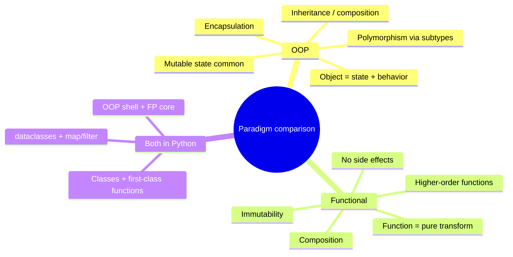

---

## 2. Core Ideas of Functional Programming

### 2.1 Pure Functions

A function is **pure** if:

1. Given the same inputs, it always returns the same output (no hidden state).
2. It has no **side effects** (no I/O, no mutation, no global changes).

```python
# Pure
def add(a: int, b: int) -> int:
    return a + b

# Impure — depends on hidden state
import time
def current_greeting(name: str) -> str:
    return f"Hello {name}, it's {time.time()}"   # different each call

# Impure — mutates argument
def add_to(cart: list, item) -> None:
    cart.append(item)   # side effect
```

Pure functions are **trivially testable** (call them, check the result), **memoizable** (cache by inputs), and **parallelizable** (no shared state).

### 2.2 Immutability

FP prefers data that **cannot change** after creation. Instead of mutating, you produce a *new* value:

```python
from dataclasses import dataclass, replace

@dataclass(frozen=True)
class Point:
    x: float
    y: float

p = Point(1, 2)
# p.x = 5   # ❌ frozen dataclass raises
p2 = replace(p, x=5)   # ✅ new Point(5, 2)
```

Immutability eliminates an entire class of bugs: aliasing surprises, race conditions, "spooky action at a distance." It also enables cheap copies and structural sharing.

### 2.3 First-Class and Higher-Order Functions

In FP, **functions are values**. You can pass them as arguments, return them, store them in collections. A **higher-order function** is one that takes or returns functions.

```python
numbers = [1, 2, 3, 4, 5]

# map: apply function to each element
doubled = list(map(lambda x: x * 2, numbers))   # [2, 4, 6, 8, 10]

# filter: keep elements satisfying a predicate
evens = list(filter(lambda x: x % 2 == 0, numbers))  # [2, 4]

# reduce: collapse sequence to single value
from functools import reduce
total = reduce(lambda a, b: a + b, numbers)   # 15
```

### 2.4 Recursion Over Loops

FP tends to favor recursion over `for`/`while`. A loop *mutates* an index; recursion *reapplies a function*:

```python
# Imperative loop
def factorial_imperative(n: int) -> int:
    result = 1
    for i in range(2, n + 1):
        result *= i
    return result

# Recursive
def factorial_recursive(n: int) -> int:
    if n <= 1: return 1
    return n * factorial_recursive(n - 1)
```

### 2.5 Function Composition

FP builds complex behavior by **composing** small functions:

```python
def compose(f, g):
    return lambda x: f(g(x))

add_one = lambda x: x + 1
double  = lambda x: x * 2
add_one_then_double = compose(double, add_one)

print(add_one_then_double(3))   # (3 + 1) * 2 = 8
```

Python 3.10+ doesn't have a built-in `compose`, but `toolz` and `functools` (with some helpers) provide one.

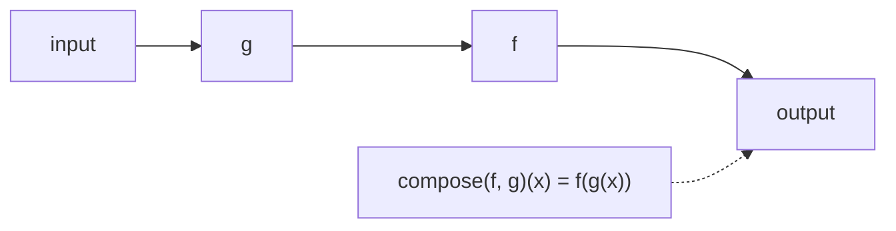

---

## 3. Where Each Paradigm Shines

### 3.1 OOP Shines When…

- **Stateful domains**: GUIs, games, simulations, business entities. A `BankAccount` *naturally* has balance and methods that change it.
- **Long-lived objects**: entities with identity and lifecycle (a `User` is the same user after their email changes).
- **Polymorphic families**: when you have many variants of a thing (`Circle`, `Square`, `Triangle`) with shared interface but different behavior.
- **Encapsulation matters**: when invariants must be protected (a `BankAccount` shouldn't go negative).

### 3.2 FP Shines When…

- **Data pipelines**: ETL, log processing, analytics — transform immutable records through stages.
- **Concurrent systems**: pure functions parallelize trivially; no locks needed.
- **Parsers and compilers**: tree transformations are naturally functional.
- **Caching and memoization**: pure functions can be cached by argument.
- **Mathematical correctness**: when you want provable behavior, pure functions are your friend.

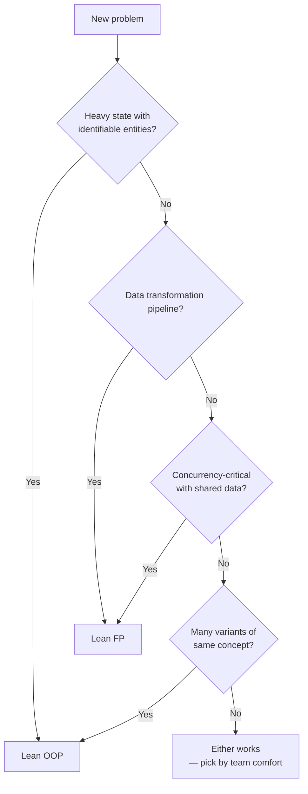

---

## 4. The Same Problem, Both Ways

Let's build a **word frequency counter** that reads text and returns the top-N most common words. We'll do it twice — once in OOP style, once in FP style — and compare.

### 4.1 OOP Version

```python
import re
from collections import Counter
from dataclasses import dataclass, field

@dataclass
class WordCounter:
    """Stateful word-frequency counter."""
    text: str
    _counts: Counter = field(default_factory=Counter)

    def clean(self) -> None:
        """Normalize the text (mutates internal state)."""
        self.text = self.text.lower()

    def tokenize(self) -> list[str]:
        return re.findall(r"\b\w+\b", self.text)

    def count(self) -> None:
        for word in self.tokenize():
            self._counts[word] += 1

    def top(self, n: int) -> list[tuple[str, int]]:
        return self._counts.most_common(n)

    def run(self, n: int = 5) -> list[tuple[str, int]]:
        self.clean()
        self.count()
        return self.top(n)

text = "the cat sat on the mat the cat ate the rat"
wc = WordCounter(text)
print(wc.run(3))
# [('the', 4), ('cat', 2), ('sat', 1)]
```

The OOP version **bundles state** (`text`, `_counts`) with **behavior** (`clean`, `tokenize`, `count`, `top`). Methods mutate the object. The pipeline is a sequence of method calls.

### 4.2 Functional Version

```python
import re
from collections import Counter
from functools import pipe  # if available — else compose manually

def clean(text: str) -> str:
    return text.lower()

def tokenize(text: str) -> list[str]:
    return re.findall(r"\b\w+\b", text)

def count(words: list[str]) -> Counter:
    return Counter(words)

def top(n: int):
    def _top(counts: Counter) -> list[tuple[str, int]]:
        return counts.most_common(n)
    return _top

def word_frequencies(text: str, n: int = 5) -> list[tuple[str, int]]:
    # Pipeline of pure transformations
    return top(n)(count(tokenize(clean(text))))

text = "the cat sat on the mat the cat ate the rat"
print(word_frequencies(text, 3))
# [('the', 4), ('cat', 2), ('sat', 1)]
```

Each function is pure: same input → same output, no mutation. The pipeline `clean → tokenize → count → top(n)` reads top-to-bottom. There's no shared state to test or mock.

### 4.3 Comparison

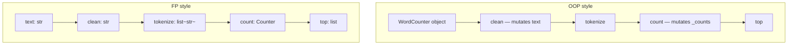

| Aspect | OOP version | FP version |
|---|---|---|
| State | Encapsulated in instance | None — flows through pipes |
| Testability | Need to instantiate, set up state | Call function, check result |
| Reuse | Subclass or compose objects | Compose functions |
| Refactoring | Move methods between classes | Reorder pipeline |
| Concurrency | Must lock shared state | Trivially parallel |
| Reads as | "Counter, do these steps" | "Text becomes counts" |

> [!tip] Teaching Tip
> Have students implement the counter in *both* styles. Then ask: "Add a 'remove stopwords' step." In OOP, they add a method (and think about where it fits in the lifecycle). In FP, they add a function and slot it into the pipeline. Both work — but the FP change is *localized* and the OOP change *requires rethinking state flow*.

---

## 5. Python's Functional Toolkit

Python isn't Haskell, but it has solid FP support:

### 5.1 `map`, `filter`, `reduce`

```python
from functools import reduce

nums = [1, 2, 3, 4, 5]

squares = list(map(lambda x: x ** 2, nums))
evens  = list(filter(lambda x: x % 2 == 0, nums))
total  = reduce(lambda a, b: a + b, nums, 0)
```

### 5.2 Comprehensions (the Pythonic alternative)

```python
squares = [x ** 2 for x in nums]
evens   = [x for x in nums if x % 2 == 0]
squares_evens = {x: x ** 2 for x in nums if x % 2 == 0}
```

Comprehensions are often preferred over `map`/`filter` in Python — they read more naturally and are equally pure.

### 5.3 `lambda` — Inline Functions

```python
sorted_users = sorted(users, key=lambda u: u.name)
```

Use `lambda` for short, throwaway functions. For anything with a name or reused logic, `def` is clearer.

### 5.4 `itertools` — Lazy Functional Goodness

```python
from itertools import chain, groupby, takewhile, cycle, islice

# Chain multiple iterables
list(chain([1, 2], [3, 4]))                # [1, 2, 3, 4]

# Group consecutive equal elements
for key, group in groupby("AAABBC"):
    print(key, list(group))
# A ['A','A','A']  B ['B','B']  C ['C']

# Take while predicate holds
list(takewhile(lambda x: x < 3, [1, 2, 3, 4, 1]))   # [1, 2]

# Cycle infinitely (lazy)
list(islice(cycle("AB"), 5))               # ['A','B','A','B','A']
```

`itertools` is functional programming's gift to Python: lazy, composable, memory-efficient.

### 5.5 `functools` — Higher-Order Utilities

```python
from functools import lru_cache, partial, reduce

@lru_cache(maxsize=None)
def fib(n: int) -> int:
    if n < 2: return n
    return fib(n - 1) + fib(n - 2)

# partial — fix some arguments
def power(base, exp): return base ** exp
square = partial(power, exp=2)
print(square(5))   # 25
```

`lru_cache` is *the* demonstration of why purity matters: pure functions can be cached automatically. Impure functions can't.

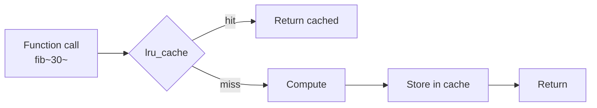

---

## 6. Where Python's FP Falls Short

Python is multi-paradigm, not a pure FP language. Honest limits:

### 6.1 No Tail-Call Optimization

Python doesn't eliminate tail calls. Deep recursion blows the stack:

```python
def factorial(n):
    return 1 if n <= 1 else n * factorial(n - 1)

# factorial(2000)   # RecursionError
```

Use iteration or `functools.reduce` for deep problems.

### 6.2 Recursion Is Slow

Each Python function call has overhead. A recursive `sum` is slower than `sum(items)`. For tight loops, prefer built-ins or comprehensions.

### 6.3 No Built-In `compose`

You can write one, but it's not in the stdlib. (The `toolz` library fills this gap.)

### 6.4 Mutation Is the Default

Lists, dicts, and sets are mutable by default. To be immutable, you reach for `tuple`, `frozenset`, or `@dataclass(frozen=True)`. The language nudges you toward mutation; FP requires conscious effort.

### 6.5 No Pattern Matching (Until 3.10)

Python 3.10's `match` statement brings structural pattern matching — a staple of FP — but earlier versions had nothing comparable.

```python
# Python 3.10+
def describe(point):
    match point:
        case (0, 0):          return "origin"
        case (0, y):          return f"y-axis at {y}"
        case (x, 0):          return f"x-axis at {x}"
        case (x, y):          return f"point ({x}, {y})"
```

---

## 7. The Hybrid — Functional Core, Imperative Shell

The most powerful modern pattern combines both paradigms:

- **Functional core**: business logic as pure functions on immutable data. Easy to test, parallelize, reason about.
- **Imperative shell**: OOP/IO layer that reads inputs, calls the functional core, persists results, talks to the outside world.

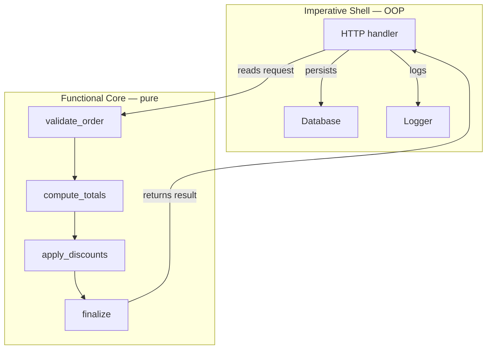

### 7.1 Example — Order Processing

```python
from dataclasses import dataclass, replace
from typing import Callable

# --- Functional core (pure, no I/O) ---

@dataclass(frozen=True)
class OrderLine:
    sku: str
    qty: int
    unit_price: float

@dataclass(frozen=True)
class Order:
    lines: tuple[OrderLine, ...]
    discount: float = 0.0

def compute_subtotal(order: Order) -> float:
    return sum(line.qty * line.unit_price for line in order.lines)

def apply_discount(order: Order) -> Order:
    if order.discount < 0 or order.discount > 1:
        raise ValueError("discount must be in [0, 1]")
    return order   # we keep discount as a fraction; total computation applies it

def compute_total(order: Order) -> float:
    subtotal = compute_subtotal(order)
    return subtotal * (1 - order.discount)

def validate(order: Order) -> Order:
    if not order.lines:
        raise ValueError("order has no lines")
    if any(line.qty <= 0 for line in order.lines):
        raise ValueError("qty must be positive")
    return order

def finalize(order: Order) -> dict:
    """Pure transformation: Order → summary dict."""
    order = validate(order)
    order = apply_discount(order)
    return {
        "lines": len(order.lines),
        "subtotal": compute_subtotal(order),
        "discount": order.discount,
        "total": compute_total(order),
    }

# --- Imperative shell (OOP, I/O, side effects) ---

class OrderService:
    def __init__(self, db, logger):
        self.db = db
        self.logger = logger

    def place_order(self, raw_order_data: dict) -> dict:
        # Translate external data into domain object
        lines = tuple(
            OrderLine(sku=l["sku"], qty=l["qty"], unit_price=l["unit_price"])
            for l in raw_order_data["lines"]
        )
        order = Order(lines=lines, discount=raw_order_data.get("discount", 0.0))

        # Delegate to pure core
        try:
            summary = finalize(order)
        except ValueError as e:
            self.logger.log(f"validation failed: {e}")
            raise

        # Side effects: persist + log
        self.db.save(summary)
        self.logger.log(f"order placed: {summary}")
        return summary

# Usage
class FakeDB:
    def save(self, x): print(f"[db] saved {x}")

class FakeLogger:
    def log(self, m): print(f"[log] {m}")

svc = OrderService(FakeDB(), FakeLogger())
result = svc.place_order({
    "lines": [
        {"sku": "A", "qty": 2, "unit_price": 10.0},
        {"sku": "B", "qty": 1, "unit_price": 25.0},
    ],
    "discount": 0.1,
})
print(result)
# {'lines': 2, 'subtotal': 45.0, 'discount': 0.1, 'total': 40.5}
```

The **core** (`finalize`, `validate`, `compute_total`, etc.) is pure and trivially unit-testable — pass in an `Order`, assert the dict that comes out. The **shell** (`OrderService`) handles I/O and depends on the core. This is the modern sweet spot for Python business applications.

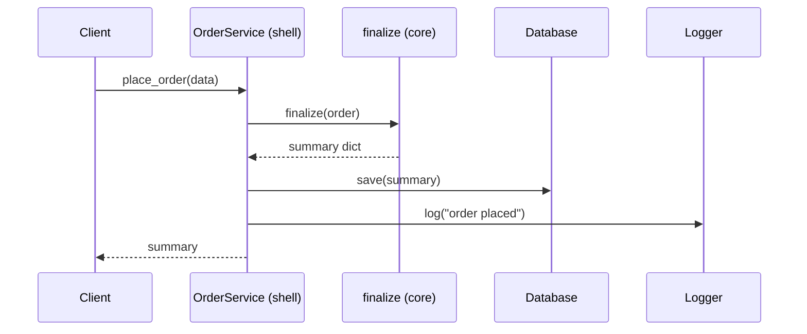

---

## 8. When to Combine Them

You don't have to pick a side. Use both, by intent:

- **OOP for the shell**: HTTP handlers, services, repositories, controllers. They organize I/O, dependencies, and lifecycle.
- **FP for the core**: business rules, calculations, validations, transformations. Make them pure functions on immutable data.
- **Functional features inside OOP**: use `@dataclass(frozen=True)` for value objects; use comprehensions and `itertools` inside methods; mark expensive pure methods with `@lru_cache`.
- **OOP features inside FP**: use classes as **namespaces** for related functions; use Protocols to type the data flowing through your pipeline.

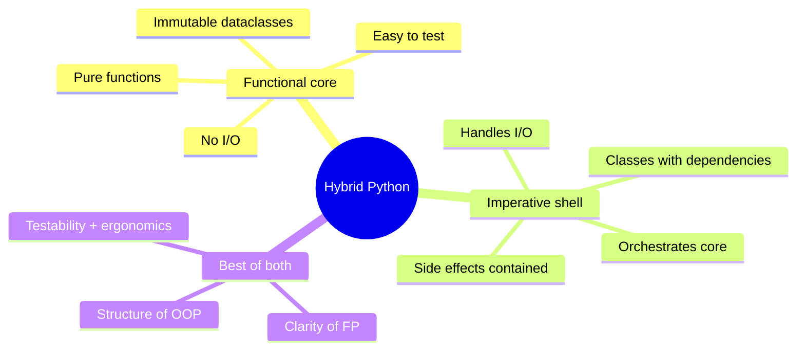

---

## 9. The Modern Trend — FP Ideas in OOP Codebases

Even in traditionally OOP codebases, FP ideas are creeping in:

- **Immutability**: more `frozen=True`, more `tuple` over `list` where mutation isn't needed.
- **Pure functions**: extracting logic out of methods into module-level functions.
- **First-class functions**: passing strategies, callbacks, predicates instead of subclassing.
- **Lazy evaluation**: generators, `itertools`, streaming pipelines.
- **Pattern matching** (3.10+): replacing long `if/elif` chains over types.

This isn't a defeat of OOP — it's a recognition that **not every problem is an object**. Some problems are *transformations*, and forcing them into class hierarchies adds friction.

> [!warning] Common Student Misconception
> "FP means no classes." It doesn't. FP is about *pure functions* and *immutability*. You can use classes to organize pure functions (a `Calculator` class with only pure methods is fine). The FP-vs-OOP divide is about *state and side effects*, not syntax.

---

## 10. A Real Refactor — From OOP-Heavy to Hybrid

### 10.1 Before — God Method With State

```python
# ❌ Bad: stateful method doing everything
class ReportGenerator:
    def __init__(self, db):
        self.db = db
        self.rows = []
        self.totals = {}

    def generate(self, date_range):
        raw = self.db.query("SELECT * FROM sales WHERE date IN ?", date_range)
        for row in raw:
            if row["amount"] > 0:
                self.rows.append({
                    "date": row["date"],
                    "amount": row["amount"],
                    "category": row["cat"],
                })
        for r in self.rows:
            self.totals[r["category"]] = self.totals.get(r["category"], 0) + r["amount"]
        return self.totals
```

Problems: state on the instance is mutated across method calls, hard to test (must mock DB), logic is tangled with I/O.

### 10.2 After — Functional Core + Shell

```python
# ✅ Good: pure core, thin shell
from dataclasses import dataclass

@dataclass(frozen=True)
class Sale:
    date: str
    amount: float
    category: str

def to_sales(raw_rows: list[dict]) -> list[Sale]:
    """Pure: raw rows → domain objects."""
    return [
        Sale(date=r["date"], amount=r["amount"], category=r["cat"])
        for r in raw_rows
        if r["amount"] > 0
    ]

def totals_by_category(sales: list[Sale]) -> dict[str, float]:
    """Pure: sales → category totals."""
    out: dict[str, float] = {}
    for s in sales:
        out[s.category] = out.get(s.category, 0.0) + s.amount
    return out

# Shell
class ReportService:
    def __init__(self, db):
        self.db = db

    def generate(self, date_range) -> dict[str, float]:
        raw = self.db.query("SELECT * FROM sales WHERE date IN ?", date_range)
        sales = to_sales(raw)              # pure
        return totals_by_category(sales)   # pure
```

Now `to_sales` and `totals_by_category` are independently testable with plain dicts — no DB mock needed. The shell is thin: read, transform, write.

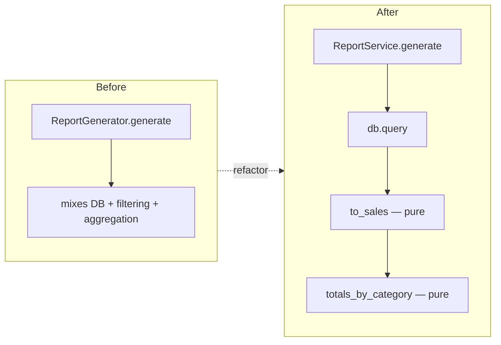

---

## 11. Comparison Summary

| Dimension | OOP | FP | Hybrid |
|---|---|---|---|
| State | Mutable, encapsulated | Avoided | Pure core, side-effect shell |
| Testing | Mock dependencies | Call function, assert | Test pure core easily |
| Concurrency | Lock carefully | Free | Confine mutation to shell |
| Reuse | Inheritance/composition | Function composition | Both |
| Best for | Stateful domains | Data pipelines | Most real apps |
| Python flavor | Classes everywhere | `map`/`filter`/comprehensions | OOP shell + pure functions |

---

## 12. Common Pitfalls

### 12.1 Forcing Everything Into Classes

Not every problem needs a class. A `validate_email` function is fine — wrapping it in `EmailValidator` adds ceremony without value.

### 12.2 Forcing Everything Into Functions

Some domains *are* stateful. A `BankAccount` is not a function; it has identity, lifecycle, and invariants. Make it a class.

### 12.3 Mixing Side Effects Into Pure Code

```python
# ❌ Looks pure, but logs
def compute_total(order: Order) -> float:
    total = sum(l.qty * l.unit_price for l in order.lines)
    print(f"computed total: {total}")   # side effect!
    return total
```

The `print` breaks purity. Move it to the shell.

### 12.4 Overusing `lambda`

Long `lambda` chains are unreadable. Use `def` for anything non-trivial.

### 12.5 Pretending Python Is Haskell

Python has no TCO, no immutability by default, no Monad sugar. Don't write Haskell in Python — use what Python gives you (comprehensions, `itertools`, generators, `dataclass(frozen=True)`).

> [!warning] Common Student Misconception
> "Functional is always safer / better." Pure functions are easier to reason about, but real programs *must* have side effects (read input, write output, persist state). The art is confining side effects to a thin shell, not eliminating them.

---

## 13. Decision Guide — Which Paradigm for This Code?

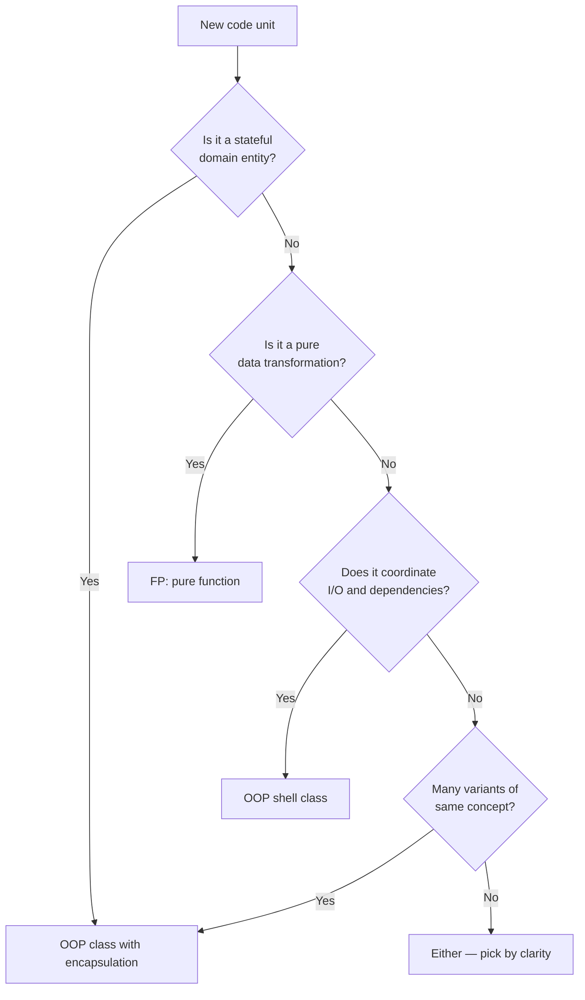

---

## 14. A Deeper Look — Immutability in Practice

Immutability is FP's most underused idea in Python codebases. Let's look at it more concretely.

### 14.1 Frozen Dataclasses for Value Objects

```python
from dataclasses import dataclass, replace
from typing import Iterable

@dataclass(frozen=True)
class Money:
    amount: float
    currency: str

    def add(self, other: "Money") -> "Money":
        if other.currency != self.currency:
            raise ValueError("currency mismatch")
        return Money(self.amount + other.amount, self.currency)

@dataclass(frozen=True)
class Cart:
    items: tuple["LineItem", ...] = ()

    def add(self, item: "LineItem") -> "Cart":
        return Cart(self.items + (item,))

    def total(self) -> Money:
        if not self.items:
            return Money(0, "USD")
        return Money(
            sum(i.subtotal().amount for i in self.items),
            self.items[0].subtotal().currency,
        )

@dataclass(frozen=True)
class LineItem:
    name: str
    price: Money
    qty: int = 1

    def subtotal(self) -> Money:
        return Money(self.price.amount * self.qty, self.price.currency)

# Usage — every "change" returns a new immutable value
cart = Cart()
cart = cart.add(LineItem("Book", Money(12, "USD"), 2))
cart = cart.add(LineItem("Pen", Money(1.5, "USD"), 5))
print(cart.total())   # Money(amount=31.5, currency='USD')
```

Each operation (`add`, `subtotal`, `total`) returns a *new* value. The original `cart` is never mutated. This means:

- You can pass `cart` to any function without worrying it'll be modified.
- You can cache, memoize, or share carts freely.
- Concurrency is trivial — multiple threads reading the same cart never conflict.

### 14.2 The Hidden Cost — Be Honest About It

Immutability in Python isn't free:

- `tuple` is slower to construct than `list` for large collections.
- Frozen dataclasses use `object.__setattr__` blocking, which has a small per-attribute cost.
- "Updating" requires copying; for very large structures, this is expensive (unless you use structural sharing — which Python doesn't provide out of the box).

For most business apps, these costs are invisible. For high-throughput data pipelines, profile before assuming immutability is the bottleneck — usually it's I/O.

> [!tip] Teaching Tip
> Have students convert a mutable `Order` class into a frozen dataclass. They'll discover that "modifying the order" becomes "producing a new order via `replace`". This shift in thinking — from *mutating in place* to *producing a transformed copy* — is the gateway drug to FP.

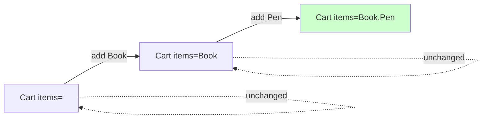

The original carts remain unchanged; each `add` produces a new one. Old values can be safely cached, logged, or compared.

---

## 15. Concurrency — Where FP Wins Decisively

Consider a parallel computation. In OOP-with-mutation style:

```python
# ❌ Mutation + threads = pain
class Accumulator:
    def __init__(self): self.total = 0
    def add(self, n):
        # Race condition! Need a lock.
        with self._lock:
            self.total += n
```

In FP style, no locks needed:

```python
# ✅ Pure functions parallelize trivially
from concurrent.futures import ThreadPoolExecutor

def process(item: int) -> int:
    return item * 2

items = list(range(1_000_000))
with ThreadPoolExecutor() as ex:
    results = list(ex.map(process, items))

total = sum(results)   # reduction at the end, after parallel map
```

`process` is pure — it doesn't read or write shared state. The thread pool can dispatch freely. The only mutation is the final `sum`, which runs on the main thread.

This is why FP has surged in the multi-core era: pure functions are *embarrassingly parallel*.

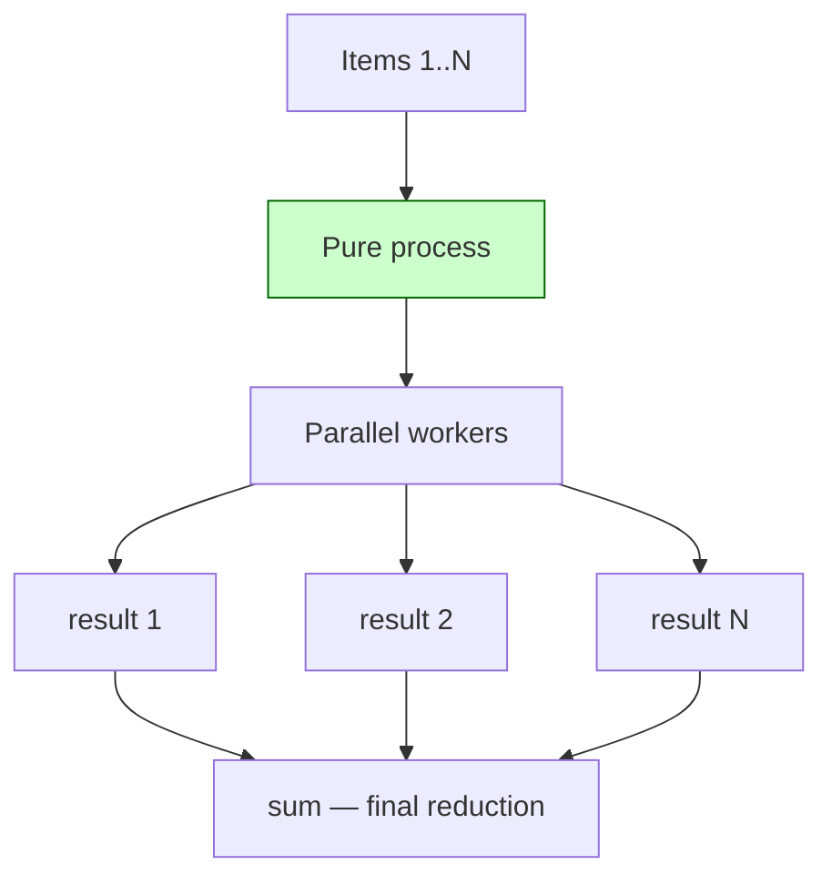

---

## 16. Recap

OOP and FP are two ways of structuring code, each with strengths:

- **OOP** excels at modeling stateful, long-lived entities with protected invariants.
- **FP** excels at pure data transformation, concurrency, and testability.
- **Python supports both** — and the most maintainable codebases use a hybrid: a thin OOP shell that handles I/O and dependencies, wrapping a functional core of pure functions on immutable data.

The skill isn't choosing a paradigm; it's choosing **the right tool for each piece of the system**.

### What to Read Next

- [[OOP-Paradigms]] — broader paradigm landscape.
- [[What-Is-OOP]] — what OOP brings to the table.
- [[Encapsulation]] — the OOP mechanism for protecting state.
- [[Composition-Over-Inheritance]] — a place where FP ideas (small composable units) meet OOP.
- [[Interfaces-And-Protocols]] — declaring the contracts your functional core expects.

### Exercises

1. Implement the word-frequency counter in both styles. Add a "remove stopwords" step in each. Compare the change footprint.
2. Refactor a stateful method in your codebase into a pure function plus a thin shell method. Write unit tests for the pure function — no mocks needed.
3. Use `itertools.groupby` to group a list of `Order` objects by customer. Then write the same grouping in OOP style (a `CustomerGrouper` class). Discuss trade-offs.
4. Implement `compose(f, g, h)` and apply it to a pipeline: `parse → validate → transform → serialize`. Each step should be a pure function.
5. Take a class with three methods that mutate state. Convert it to a frozen dataclass plus three pure functions. What changes about testability?

> [!success] You've Got It When…
> You can look at any function in your codebase and say, with confidence: "This belongs in the core (it's pure)" or "This belongs in the shell (it does I/O)." And your codebase visibly reflects that decision — pure functions don't take `db` or `logger` arguments; shell methods do.
