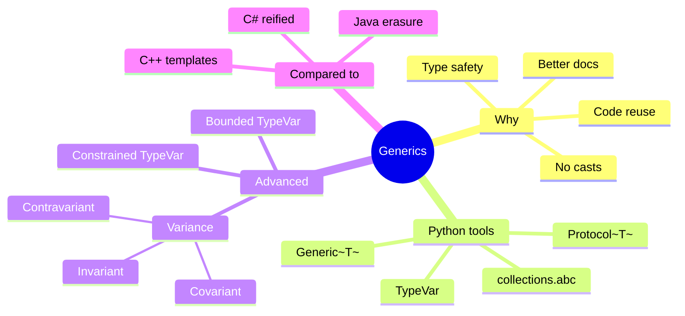
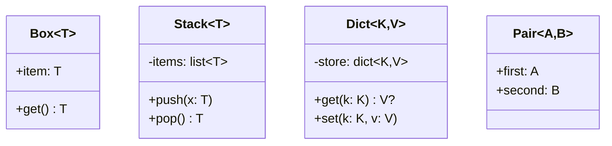
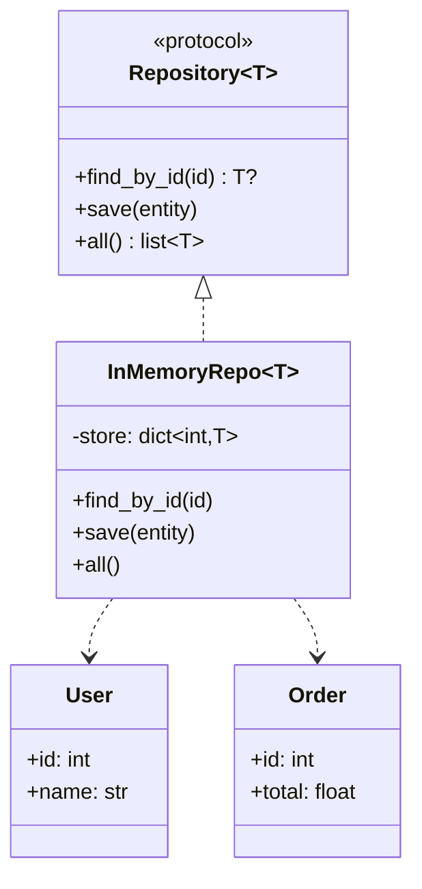
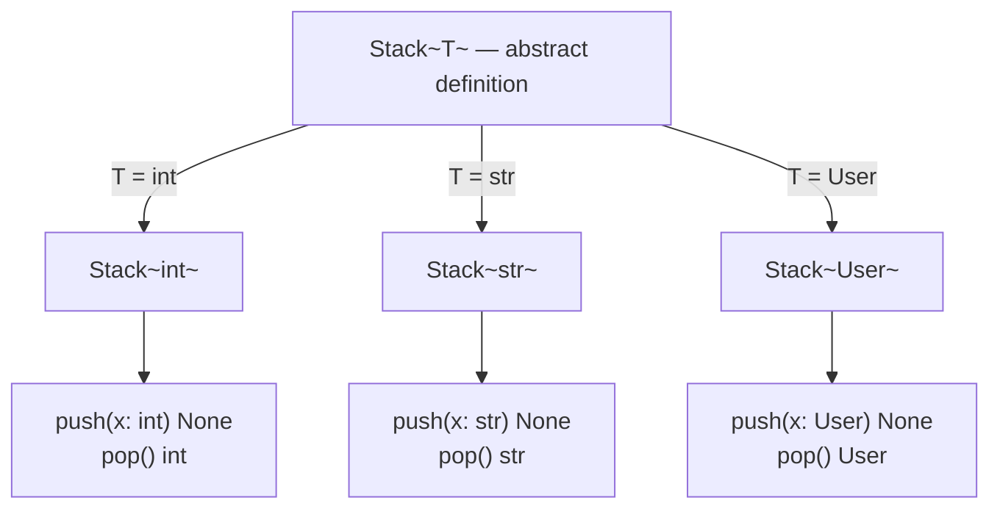
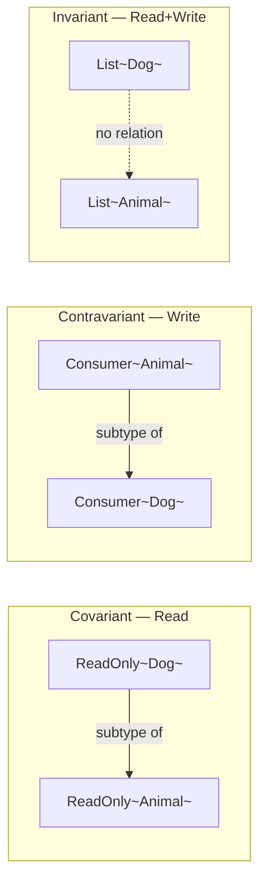
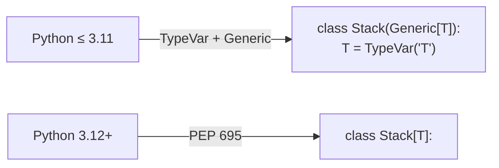

# Generics in OOP — Parameterized Types for Safe, Reusable Code

#oop #generics #typing #teaching #deep-dive

> [!quote] PEP 484
> "By using type variables… a function or class can be parameterized over types, allowing for the creation of reusable, type-safe abstractions."

A **generic** is a type parameterized over another type. `list[int]` is "a list of ints." `dict[str, User]` is "a dict mapping strings to Users." `Stack[T]` is "a stack of some type T." Generics let you write **one** container or algorithm that works for any element type, *and* have the type checker guarantee you don't put a `User` into a `Stack[Order]`.

This note explains what generics are, why they matter, Python's syntax (`TypeVar`, `Generic[T]`), bounded and constrained type variables, variance, generic protocols, and how Python compares to Java, C#, and C++.

Prerequisites: [[Type-Hints-And-OOP]], [[Interfaces-And-Protocols]], [[Abstract-Base-Classes]].

---

## 1. The Problem Generics Solve

Without generics, you face an ugly trade-off:

```python
# Option A: type-specific — duplicated code
class IntStack:
    def push(self, x: int) -> None: ...
    def pop(self) -> int: ...

class StrStack:
    def push(self, x: str) -> None: ...
    def pop(self) -> str: ...

# Option B: generic — but no type safety
class AnyStack:
    def push(self, x) -> None: ...
    def pop(self): ...
```

Option A duplicates code for every type. Option B lets you push an `int` and accidentally pop a `str` — the compiler can't help you.

Generics give you both reuse *and* safety:

```python
from typing import Generic, TypeVar

T = TypeVar("T")

class Stack(Generic[T]):
    def __init__(self) -> None:
        self._items: list[T] = []
    def push(self, x: T) -> None:
        self._items.append(x)
    def pop(self) -> T:
        return self._items.pop()

int_stack: Stack[int] = Stack()
int_stack.push(5)
# int_stack.push("oops")   # ❌ type-checker error
n: int = int_stack.pop()    # OK — n is int

user_stack: Stack[User] = Stack()
user_stack.push(User("Alice"))
```

One `Stack` class, infinite safe instantiations.



---

## 2. Python's Generic Syntax

### 2.1 `TypeVar` — Naming a Type Parameter

```python
from typing import TypeVar

T = TypeVar("T")          # unbounded — can be anything
K = TypeVar("K")
V = TypeVar("V")
```

A `TypeVar` is a placeholder for "some type." You can name it anything, but by convention `T`, `K`, `V`, `U`, `R` are common. The string passed to `TypeVar` must match the variable name (this is how mypy tracks it).

### 2.2 `Generic[T]` — A Generic Class

```python
from typing import Generic, TypeVar

T = TypeVar("T")

class Box(Generic[T]):
    def __init__(self, item: T) -> None:
        self.item = item
    def get(self) -> T:
        return self.item

box: Box[str] = Box("hello")
s: str = box.get()
```

Subclassing `Generic[T]` makes `Box` a generic class. When you write `Box[str]`, the type checker substitutes `T = str` throughout.

### 2.3 Generic Functions

Functions can use `TypeVar` directly without `Generic`:

```python
T = TypeVar("T")

def first(items: list[T]) -> T:
    return items[0]

numbers = first([1, 2, 3])        # T is inferred as int → numbers: int
names = first(["a", "b"])         # T is inferred as str → names: str
```

The type checker infers `T` from the argument. The return type tracks the element type.

### 2.4 Multiple Type Parameters

```python
K = TypeVar("K")
V = TypeVar("V")

class Dict(Generic[K, V]):
    def __init__(self) -> None:
        self._store: dict[K, V] = {}
    def get(self, k: K) -> V | None:
        return self._store.get(k)
    def set(self, k: K, v: V) -> None:
        self._store[k] = v
```

`Dict[str, User]` — keys are strings, values are `User`s.



---

## 3. Bounded Type Variables

Sometimes you don't want "any type T" — you want "any type T that has a certain capability." Use a **bound**:

```python
from typing import TypeVar

class Comparable:
    def __lt__(self, other: "Comparable") -> bool: ...

T = TypeVar("T", bound=Comparable)

def sort(items: list[T]) -> list[T]:
    # We can use items[i] < items[j] because T is bound to Comparable.
    return sorted(items, key=lambda x: x)
```

`bound=Comparable` means `T` must be `Comparable` or a subclass. Inside the function, you can call any `Comparable` method on items of type `T`.

### A more concrete bound: numeric types

```python
from typing import TypeVar
from numbers import Real

N = TypeVar("N", bound=Real)

def average(xs: list[N]) -> float:
    return sum(xs) / len(xs)

print(average([1, 2, 3]))           # 2.0
print(average([1.5, 2.5, 3.5]))     # 2.5
# average(["a", "b"])               # ❌ type error: str is not Real
```

---

## 4. Constrained Type Variables

A **constrained** `TypeVar` accepts only specific types:

```python
from typing import TypeVar

N = TypeVar("N", int, float)

def double(x: N) -> N:
    return x * 2

print(double(5))       # 5 → int
print(double(2.5))     # 2.5 → float
# double("a")          # ❌ type error
```

The return type follows the argument: pass an `int`, get an `int`; pass a `float`, get a `float`. Without constraints, you'd need overloads or lose precision.

> [!warning] Common Student Misconception
> `TypeVar("T", bound=X)` and `TypeVar("T", X)` look almost identical but mean different things. `bound=X` allows `T` to be `X` *or any subclass*. `TypeVar("T", X)` restricts `T` to *exactly* one of the listed types (e.g., `int` or `float`), not their subclasses. Pick the right one — bounded is usually what you want.

---

## 5. Variance — The Subtle Part

Variance answers: *if `Dog` is a subtype of `Animal`, is `List[Dog]` a subtype of `List[Animal]`?* The answer depends on whether the container is read-only, write-only, or read-write.

### 5.1 Invariance (default)

By default, Python's generics are **invariant**: `List[Dog]` is **not** a `List[Animal]`.

```python
class Animal: ...
class Dog(Animal): ...

def feed_all(animals: list[Animal]) -> None:
    animals.append(Animal())   # adding an Animal

dogs: list[Dog] = [Dog()]
# feed_all(dogs)   # ❌ type error — would let us put a Cat in dogs!
```

If `list[Dog]` were a `list[Animal]`, the function could append a `Cat` to your `dogs` list — bad. Invariance prevents this.

### 5.2 Covariance — read-only containers

If a container is **read-only** (you only ever take items out, never put them in), it's safe to be covariant: `ReadOnly[Dog]` *is* a `ReadOnly[Animal]`.

```python
from typing import TypeVar, Generic, Sequence

T_co = TypeVar("T_co", covariant=True)

class ReadOnly(Generic[T_co]):
    def __init__(self, items: list[T_co]) -> None:
        self._items = items
    def first(self) -> T_co:
        return self._items[0]
    # NO method that takes T_co as a parameter!

class Animal: ...
class Dog(Animal): ...

dogs: ReadOnly[Dog] = ReadOnly([Dog()])
animals: ReadOnly[Animal] = dogs   # OK — covariant
```

Python's `Sequence[T]` is covariant for exactly this reason — sequences are read-only.

### 5.3 Contravariance — write-only callbacks

If a thing only **accepts** items of type T (never returns them), it's contravariant: a callback that can handle any `Animal` *can be used where* a callback handling only `Dog` is expected.

```python
from typing import TypeVar, Generic

T_contra = TypeVar("T_contra", contravariant=True)

class Consumer(Generic[T_contra]):
    def consume(self, item: T_contra) -> None:
        print(f"consumed {item}")
    # NO method that returns T_contra!

class Animal: ...
class Dog(Animal): ...

def feed_dogs(dogs: list[Dog], feeder: Consumer[Dog]) -> None:
    for d in dogs: feeder.consume(d)

animal_feeder: Consumer[Animal] = Consumer()
feed_dogs([Dog()], animal_feeder)   # OK — contravariant
```

Why is this safe? A `Consumer[Animal]` can consume *any* animal, so it can certainly consume a `Dog` (which is an animal). The direction is reversed: `Consumer[Animal]` is a subtype of `Consumer[Dog]`.

### 5.4 Summary Table

| Variance | Rule | Safe when… | Example |
|---|---|---|---|
| Invariant | `C[T]` ≠ `C[S]` even if `T <: S` | Container is read-write | `list[T]`, `dict[K, V]` |
| Covariant | `C[T] <: C[S]` if `T <: S` | Read-only / producer | `Sequence[T]`, `Iterator[T]` |
| Contravariant | `C[S] <: C[T]` if `T <: S` (reversed) | Write-only / consumer | `Callable[[T], None]`, `Consumer[T]` |

```mermaid
flowchart TB
    A[Generic C~T~] --> B{How is T used?}
    B -->|Read and write| C[Invariant<br/>default]
    B -->|Only read<br/>producer| D[Covariant<br/>covariant=True]
    B -->|Only write<br/>consumer| E[Contravariant<br/>contravariant=True]
    C --> C1[list~T~<br/>dict~K,V~]
    D --> D1[Sequence~T~<br/>Iterator~T~]
    E --> E1[Callable~[[T],R]~<br/>Consumer~T~]
```

> [!info] Mnemonic
> **PECS** (from Java's Effective Java): **P**roducer **E**xtends, **C**onsumer **S**uper. If your generic produces `T` values (you read them), use covariant. If it consumes `T` values (you pass them in), use contravariant.

---

## 6. Variance in Practice — A Subtle Bug

Watch what happens if you mark something covariant *and* allow writes:

```python
from typing import TypeVar, Generic

T_co = TypeVar("T_co", covariant=True)

class BadList(Generic[T_co]):
    def __init__(self): self._items: list[T_co] = []
    def add(self, x: T_co) -> None:        # ❌ T_co as a parameter!
        self._items.append(x)
```

mypy will complain: "Cannot use a covariant type variable as a parameter." That's the type checker saving you from the bug where someone could add a `Cat` to your `BadList[Dog]`.

---

## 7. Generic Protocols

[[Interfaces-And-Protocols|Protocols]] can be generic too — perfect for declaring capabilities like "iterable of T" or "comparable to T":

```python
from typing import Protocol, TypeVar

T = TypeVar("T")

class Iterable(Protocol[T]):
    def __iter__(self): ...

class Comparable(Protocol[T]):
    def __lt__(self, other: T) -> bool: ...

def max_of(items: Iterable[T]) -> T: ...
def sort(items: list[T]) -> list[T] where T: Comparable[T]: ...  # pseudo
```

In real Python:

```python
from typing import Protocol, TypeVar

T = TypeVar("T")

class Repository(Protocol[T]):
    def find_by_id(self, id_: int) -> T | None: ...
    def save(self, entity: T) -> None: ...

# Any class with the right methods conforms — for any concrete T.
class UserRepo:
    def find_by_id(self, id_: int) -> User | None: ...
    def save(self, entity: User) -> None: ...

# UserRepo satisfies Repository[User] structurally — no inheritance needed.
```

---

## 8. Generic ABCs in `collections.abc`

Python ships with generic ABCs in `collections.abc`:

- `Iterable[T]` — has `__iter__` yielding `T`.
- `Iterator[T]` — has `__next__` returning `T`.
- `Sequence[T]` — indexable, sized, iterable.
- `Mapping[K, V]` — dict-like.
- `Container[T]` — supports `in` for `T`.
- `Callable[[A, B], R]` — function from `A, B` to `R`.

```python
from collections.abc import Sequence, Mapping

def total(xs: Sequence[int]) -> int:
    return sum(xs)

def lookup(m: Mapping[str, int], key: str) -> int:
    return m[key]

print(total([1, 2, 3]))             # list works
print(total((1, 2, 3)))             # tuple works
print(lookup({"a": 1}, "a"))        # 1
```

`Sequence[int]` accepts `list[int]`, `tuple[int, ...]`, `range`, and any custom sequence — *covariantly*, because `Sequence` only reads.

---

## 9. A Full Example — Generic `Repository[T]`

Putting it all together: a generic repository interface plus two implementations.

```python
from typing import Protocol, TypeVar, Generic
from dataclasses import dataclass, field

T = TypeVar("T")

@dataclass
class User:
    id: int
    name: str

@dataclass
class Order:
    id: int
    total: float

class Repository(Protocol[T]):
    def find_by_id(self, id_: int) -> T | None: ...
    def save(self, entity: T) -> None: ...
    def all(self) -> list[T]: ...

class InMemoryRepo(Generic[T]):
    """Generic in-memory repository — works for any entity with an `id`."""
    def __init__(self) -> None:
        self._store: dict[int, T] = {}
    def find_by_id(self, id_: int) -> T | None:
        return self._store.get(id_)
    def save(self, entity: T) -> None:
        # We rely on duck typing for `id`. In real code, constrain with a Protocol.
        self._store[getattr(entity, "id")] = entity
    def all(self) -> list[T]:
        return list(self._store.values())

# Usage — type-safe repositories for different entities
user_repo: Repository[User] = InMemoryRepo[User]()
order_repo: Repository[Order] = InMemoryRepo[Order]()

user_repo.save(User(1, "Alice"))
order_repo.save(Order(1, 99.5))

u: User | None = user_repo.find_by_id(1)
o: Order | None = order_repo.find_by_id(1)
print(u, o)
```



---

## 10. Bounded Generic — Sorting Only Comparable Types

A function that only sorts comparable types:

```python
from typing import TypeVar, Protocol

class Comparable(Protocol):
    def __lt__(self, other: "Comparable") -> bool: ...

T = TypeVar("T", bound=Comparable)

def top_n(items: list[T], n: int) -> list[T]:
    return sorted(items)[:n]

class Score:
    def __init__(self, value: int): self.value = value
    def __lt__(self, other: "Score") -> bool:
        return self.value < other.value
    def __repr__(self): return f"Score({self.value})"

scores = [Score(3), Score(1), Score(2)]
print(top_n(scores, 2))   # [Score(1), Score(2)]

# top_n([{"a": 1}, {"b": 2}], 1)   # ❌ type error: dict isn't Comparable
```

---

## 11. Generic Instantiation Diagram

How a generic class unfolds into concrete types:



Each instantiation produces a virtual "type" with methods specialized to the element type. (Note: in Python this is purely a static-checking concept; at runtime `Stack[int]` and `Stack[str]` are the same class.)

---

## 12. TypeVar Mindmap — Choosing the Right Tool

```mermaid
mindmap
  root((TypeVar choices))
    Plain TypeVar
      T = TypeVar~'T'~
      No constraint
      Any type allowed
      Use when truly anything works
    Bounded TypeVar
      T = TypeVar~'T'~, bound=X
      T must be X or subclass
      Use when you need X's methods
    Constrained TypeVar
      T = TypeVar~'T'~, int, float
      T must be exactly int or float
      Use for overloading-like precision
    Variance
      covariant=True
        Read-only producer
      contravariant=True
        Write-only consumer
      (default) invariant
        Read-write container
```

---

## 13. Comparison With Other Languages

| Language | Mechanism | Reified? | Notes |
|---|---|---|---|
| **Java** | `<T>` syntax, type erasure | No — erased at runtime | `List<Integer>` becomes `List` at runtime; can't `new T()` |
| **C#** | `<T>` syntax | Yes — reified | `List<int>` is a distinct runtime type |
| **C++** | `template<typename T>` | Yes — each instantiation is separate code | "Template metaprogramming" — Turing-complete at compile time |
| **Python** | `TypeVar` + `Generic[T]` | No — purely static | Type info exists in annotations only; runtime is plain class |

### Java's Type Erasure

```java
// Java
List<String> xs = new ArrayList<>();
xs.add("a");
// xs.add(1);   // compile error
// At runtime: ArrayList<String> and ArrayList<Integer> are the same class.
```

### C# Reified Generics

```csharp
// C#
List<int> nums = new List<int>();
nums.Add(1);
Type t = nums.GetType();   // List`1[Int] — known at runtime
```

### C++ Templates

```cpp
// C++
template<typename T>
class Stack {
    std::vector<T> items;
public:
    void push(T x) { items.push_back(x); }
    T pop() { T x = items.back(); items.pop_back(); return x; }
};

Stack<int> si; si.push(5);
Stack<std::string> ss; ss.push("a");
// Compiler generates two separate Stack classes.
```

### Python's Approach

Python's generics live entirely in the type annotation layer. At runtime, `Stack[int]` and `Stack[str]` are the same `Stack` class. The benefit is no runtime cost; the cost is you can't `isinstance(x, Stack[int])` (you can `isinstance(x, Stack)` and check `__orig_bases__`, but it's awkward).

> [!info] Why No Runtime Generics in Python?
> Python's type system is **gradual** — annotations are optional and erasure is the rule. This keeps the runtime simple and fast, and lets untyped code interoperate seamlessly with typed code. The trade-off: parametric type info is for the type checker, not the runtime.

---

## 14. Variance Comparison Diagram



---

## 15. A Common Mistake — Using `Any` Instead of `TypeVar`

```python
# ❌ Loses type info
def first(items: list[Any]) -> Any:
    return items[0]

x = first([1, 2, 3])    # x: Any — type checker can't help
x.upper()                # no error, but crashes at runtime

# ✅ Preserves type info
T = TypeVar("T")
def first(items: list[T]) -> T:
    return items[0]

y = first([1, 2, 3])    # y: int
# y.upper()             # type error
```

`Any` says "I don't know." `T` says "some specific type, and the same type on the way out." The latter is *always* preferable when you can express it.

> [!warning] Common Student Misconception
> "`list[T]` and `list[Any]` are the same thing." They are not. `list[T]` preserves the relationship between inputs and outputs; `list[Any]` discards it. Use `TypeVar` whenever you mean "the same type appears in two places."

---

## 16. Generic Methods Inside a Generic Class

Methods inside a generic class can use the class's type parameter directly:

```python
T = TypeVar("T")

class Stack(Generic[T]):
    def __init__(self): self._items: list[T] = []
    def push(self, x: T) -> None: self._items.append(x)
    def pop(self) -> T: return self._items.pop()
    def map(self, f) -> "Stack": ...   # see below

# A method that introduces its own type parameter:
U = TypeVar("U")
class Stack(Generic[T]):
    def __init__(self): self._items: list[T] = []
    def map(self, f: Callable[[T], U]) -> "Stack[U]":
        result: Stack[U] = Stack()
        for item in self._items:
            result.push(f(item))
        return result

s: Stack[int] = Stack()
s.push(1); s.push(2)
strings = s.map(lambda x: str(x))   # Stack[str]
```

`map` introduces its own `U` while using the class's `T`. The result is `Stack[U]` — fully type-safe.

---

## 17. Performance Note

Generic type annotations in Python have **zero runtime cost** (when not evaluated, e.g., using `from __future__ import annotations` or running under standard Python). The `TypeVar` and `Generic` machinery is just metadata for type checkers. Don't worry about performance — worry about clarity and correctness.

---

## 18. PEP 695 — Python 3.12+ Native Generic Syntax

Python 3.12 introduced a cleaner, native syntax for generics (PEP 695). The old style still works, but the new syntax is more concise:

```python
# Old (works on 3.9+)
from typing import Generic, TypeVar
T = TypeVar("T")
class Stack(Generic[T]):
    def push(self, x: T) -> None: ...

# New (3.12+)
class Stack[T]:
    def push(self, x: T) -> None: ...

# Generic functions
def first[T](items: list[T]) -> T:
    return items[0]

# Bounded TypeVar
class SortedList[T: Comparable]:
    ...

# Generic Protocol
class Repository[T](Protocol):
    def find_by_id(self, id_: int) -> T | None: ...
```

The new syntax declares type parameters inline, like Java/C#/TypeScript. No `TypeVar()` call, no `Generic[T]` base. The bound/constraint goes after a colon: `[T: Comparable]` or `[T: (int, float)]`.



> [!info] Which to Use?
> If your project supports Python 3.12+, prefer PEP 695 syntax. If you support older versions, stick with `TypeVar`/`Generic`. Both are valid; type checkers understand both.

---

## 19. Type Variables vs `TypeAlias` vs `NewType`

Three concepts that students often conflate:

| Tool | Purpose | Example |
|---|---|---|
| `TypeVar("T")` | Generic type parameter | `class Stack(Generic[T])` |
| `TypeAlias` | Give a name to a complex type | `Users = list[User]` |
| `NewType("UserId", int)` | Create a distinct subtype for type-checking | `UserId = NewType("UserId", int)` |

```python
from typing import TypeAlias, NewType, TypeVar, Generic

# TypeAlias: just a nickname
Users: TypeAlias = list[User]
def all_users() -> Users: ...

# NewType: phantom type for safety
UserId = NewType("UserId", int)
OrderId = NewType("OrderId", int)
def get_user(id: UserId) -> User: ...

get_user(UserId(5))    # OK
# get_user(OrderId(5))  # ❌ type error — different phantom type
# get_user(5)            # ❌ type error — plain int
```

`NewType` is a *zero-cost* marker: at runtime `UserId(5)` is just `5`. But the type checker refuses to mix `UserId` and `OrderId`, catching a whole class of "wrong ID" bugs.

---

## 20. Summary

Generics let you write **one** implementation that's **type-safe** for **many** types. Python's generics live in the type-annotation layer; the runtime is unchanged, but tools like mypy and pyright enforce correctness.

Key takeaways:

- `TypeVar("T")` declares a type parameter.
- `class Box(Generic[T])` makes a class generic.
- `def f(items: list[T]) -> T` makes a function generic.
- `TypeVar("T", bound=X)` constrains `T` to `X` or subclasses.
- `TypeVar("T", int, float)` constrains `T` to exactly the listed types.
- **Variance** matters for subtyping: covariant for producers, contravariant for consumers, invariant for read-write.
- Use generic ABCs (`Sequence[T]`, `Mapping[K, V]`) and generic Protocols (`Repository[T]`) for flexible, type-safe interfaces.
- Prefer `TypeVar` over `Any` whenever the same type appears in multiple places.

### What to Read Next

- [[Type-Hints-And-OOP]] — the broader typing system.
- [[Interfaces-And-Protocols]] — generic Protocols combine naturally.
- [[Abstract-Base-Classes]] — `collections.abc` generics.
- [[Composition-Over-Inheritance]] — generic components compose cleanly.

### Exercises

1. Implement a generic `Pair[A, B]` class with `first` and `second` accessors.
2. Write a generic `filter` function that takes `Iterable[T]` and a predicate `Callable[[T], bool]` and returns `list[T]`.
3. Build `Repository[T]` as a Protocol. Implement `InMemoryRepo[T]`. Show that `InMemoryRepo[User]` satisfies `Repository[User]` structurally.
4. Define a `Comparable` Protocol and a bounded `TypeVar`. Write `max_of(items: list[T]) -> T` that works for any comparable type.
5. Demonstrate the variance bug: declare a `BadList[T_co]` (covariant) with an `add` method and watch mypy reject it. Fix by making it invariant.

> [!success] You've Got It When…
> You can explain variance to a teammate using one read-only and one write-only example, *and* you no longer reach for `Any` when `TypeVar` would preserve type information.
