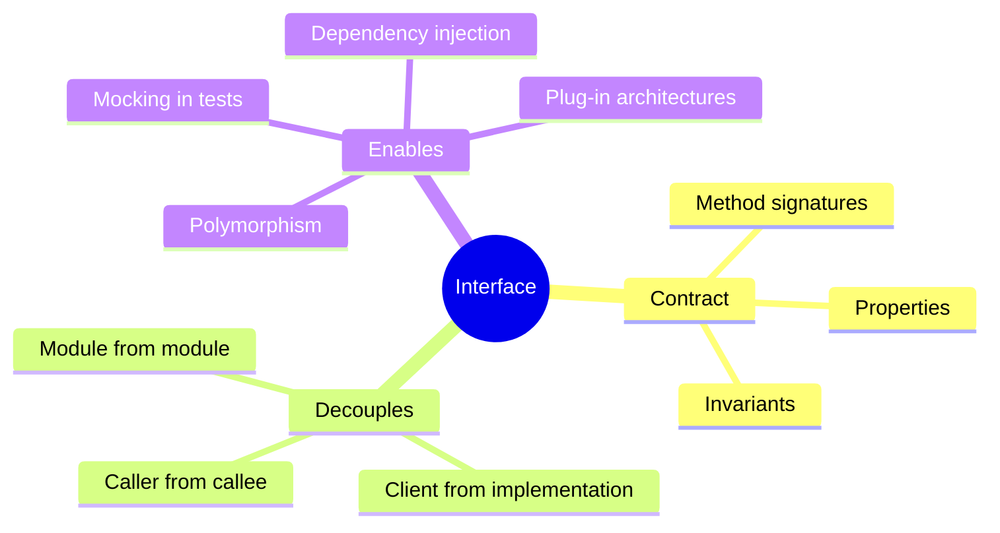
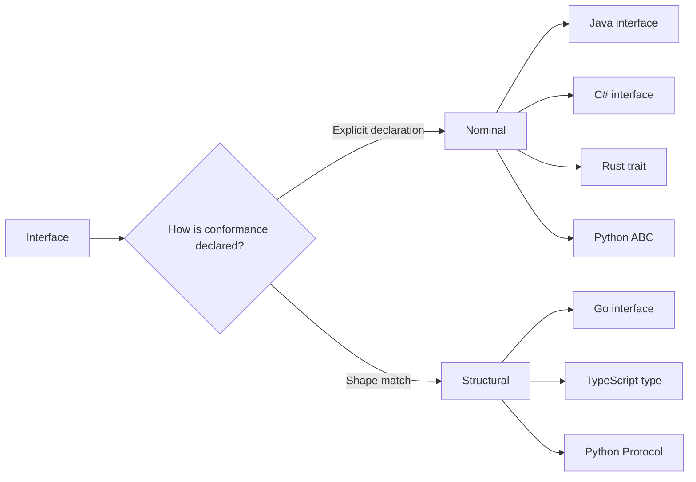
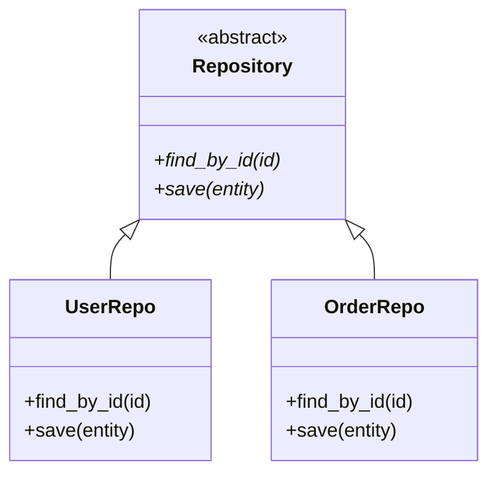
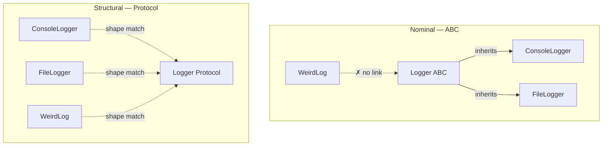
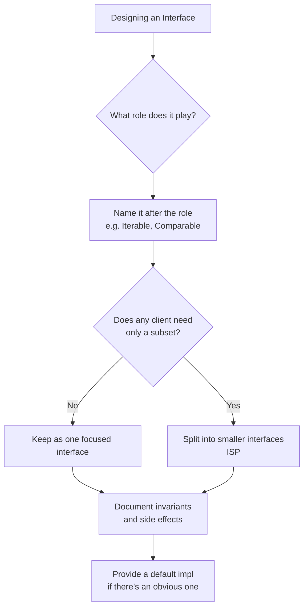
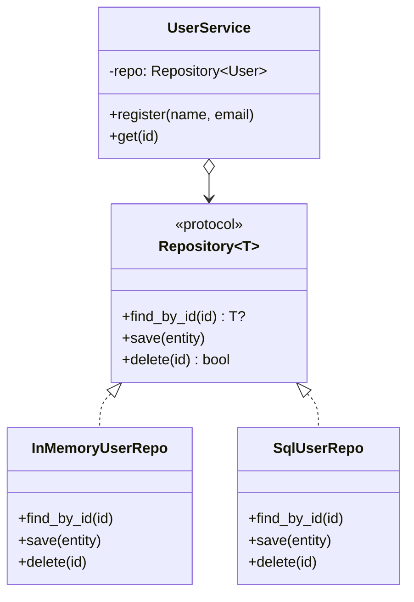
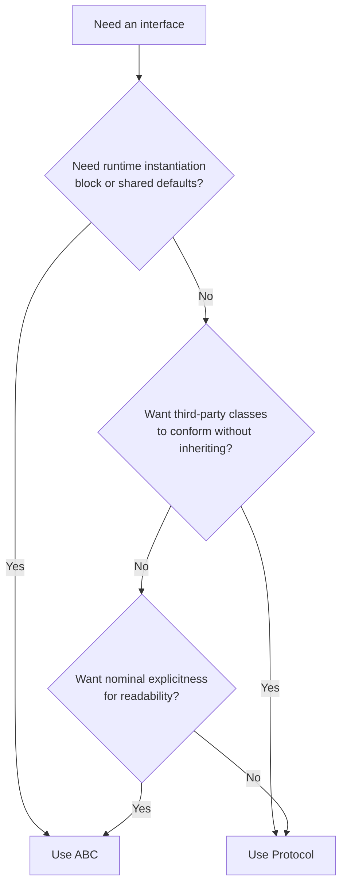
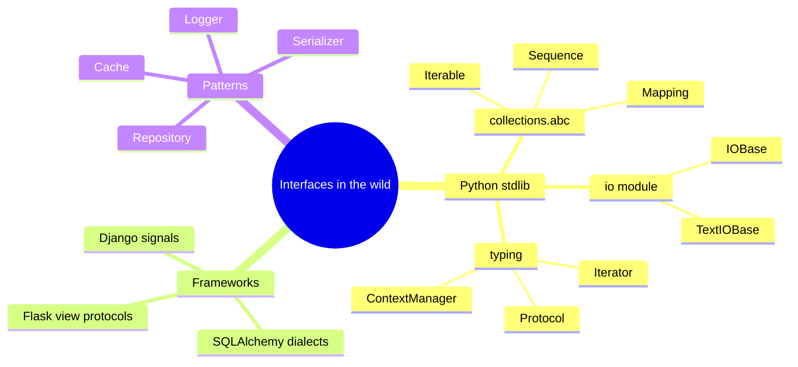
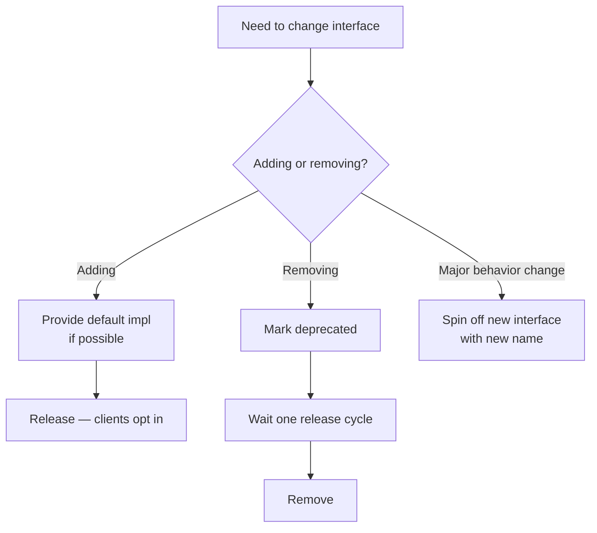
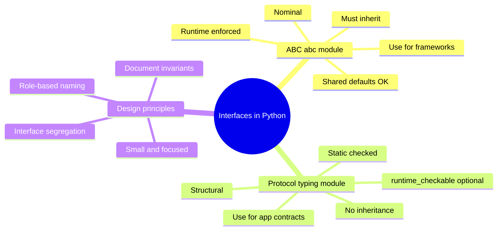

# Interfaces and Protocols — Contracts in Python and Beyond

#oop #interfaces #protocols #abc #teaching #deep-dive

> [!quote] Bertrand Meyer — *Object-Oriented Software Construction*
> "An interface is a contract. The client promises to call only what the interface advertises; the supplier promises to deliver what the interface specifies."

An **interface** is a *specification of behavior* — a list of method signatures, properties, and invariants that any implementer must provide. Interfaces let you write code against **what** an object can do, without caring **how** it does it or **what class** it is. They are the engine behind [[Polymorphism]] and the foundation of [[Dependency-Inversion]].

Python is unusual: it has *two* ways to express interfaces — the long-standing **Abstract Base Class (ABC)** from `abc` and the newer **Protocol** from `typing` (PEP 544, Python 3.8+). They look similar but embody very different philosophies. This note explains both, when to use each, and how Python's design compares to Java, C++, and Go.

Prerequisites: [[Abstraction]], [[Polymorphism]], [[Abstract-Base-Classes]], [[Type-Hints-And-OOP]].

---

## 1. What Is an Interface, Really?

At its core, an interface says: "Any object that wants to be treated as an `X` must provide these methods." Consider:

```python
def render(widget):
    widget.draw(screen)
    widget.handle_click(0, 0)
```

For `render` to work, `widget` only needs `draw` and `handle_click`. We don't care if `widget` is a `Button`, a `Slider`, or a `FlyingPig` — as long as it has those two methods. That's the *contract*.

An interface lets us **name** that contract:

```python
class Widget(Protocol):
    def draw(self, surface) -> None: ...
    def handle_click(self, x: int, y: int) -> None: ...
```

Now `render(widget: Widget)` documents intent, type-checks statically, and reads naturally.



---

## 2. Interfaces Across Languages

Different languages formalize interfaces differently. Knowing the spectrum clarifies Python's design.

| Language | Mechanism | Style |
|---|---|---|
| **Java** | `interface` keyword + `implements` | Explicit, nominal |
| **C#** | `interface` keyword + `:` | Explicit, nominal |
| **C++** | Pure virtual abstract class | Nominal (via inheritance) |
| **Go** | Implicit — implement the methods, done | Structural |
| **Rust** | `trait` + `impl Trait for Type` | Explicit, nominal |
| **TypeScript** | `interface`/`type`, structurally checked | Structural |
| **Python (ABC)** | `abc.ABC` + `@abstractmethod` | Nominal — must inherit |
| **Python (Protocol)** | `typing.Protocol` | Structural — no inheritance |

Two philosophies emerge:

- **Nominal**: the type explicitly *declares* "I implement interface X." The compiler checks the declaration.
- **Structural**: the type just *has the right methods*. The compiler matches by shape.



### 2.1 Java Interfaces

```java
public interface Repository<T> {
    T findById(int id);
    void save(T entity);
}

public class UserRepo implements Repository<User> {
    public User findById(int id) { /* ... */ }
    public void save(User entity) { /* ... */ }
}
```

The `implements` keyword is mandatory. If you forget it, even a structurally identical class is *not* a `Repository`.

### 2.2 Go Interfaces (Structural)

```go
type Stringer interface {
    String() string
}

type User struct { Name string }
func (u User) String() string { return u.Name }
```

No `implements` keyword. `User` automatically satisfies `Stringer` because it has the right method. This is "duck typing at compile time."

### 2.3 Python: Both Styles

Python gives you a choice. Use ABCs when you want nominal, explicit, runtime-enforced interfaces. Use Protocols when you want structural, opt-in static checking. Both have their place.

---

## 3. Python ABCs — The Nominal Way

Python's `abc` module (see [[Abstract-Base-Classes]]) provides the classic interface mechanism:

```python
from abc import ABC, abstractmethod

class Repository(ABC):
    @abstractmethod
    def find_by_id(self, id_: int): ...
    @abstractmethod
    def save(self, entity) -> None: ...

class UserRepo(Repository):
    def find_by_id(self, id_):
        return {"id": id_, "name": "Alice"}
    def save(self, entity) -> None:
        print(f"Saving {entity}")

# Repository()           # TypeError: can't instantiate abstract class
repo = UserRepo()
print(isinstance(repo, Repository))   # True
```

Key properties:

- **Must inherit** explicitly from `Repository` to be considered a subtype.
- Cannot instantiate until all abstract methods are implemented.
- `isinstance` works because the class is registered in the type hierarchy.
- Methods can have default implementations (an ABC is more than Java's interface).



---

## 4. Python Protocols — The Structural Way

PEP 544 (Python 3.8+) introduced `typing.Protocol`. A Protocol describes a **shape** — any class with matching attributes/methods conforms, *whether or not it inherits from the Protocol*.

```python
from typing import Protocol

class Drawable(Protocol):
    def draw(self, surface) -> None: ...

class Button:
    def draw(self, surface) -> None:
        surface.write("a button")

class FlyingPig:
    def draw(self, surface) -> None:
        surface.write("a flying pig")

def render(widget: Drawable) -> None:
    widget.draw(surface)

render(Button())       # OK — static checker sees draw()
render(FlyingPig())    # OK — shape matches, no inheritance needed
```

Notice: neither `Button` nor `FlyingPig` inherits from `Drawable`. They satisfy it *structurally*. A static type checker (mypy, pyright) verifies conformance without any runtime cost.

### 4.1 Why Protocols?

- **No coupling.** Third-party classes can satisfy your interface without inheriting from your code.
- **Cleaner libraries.** A library can publish Protocols that callers' existing classes already satisfy.
- **Better type-checking** for duck-typed code. You get static guarantees where before you had nothing.

### 4.2 `runtime_checkable` — Runtime `isinstance`

By default, Protocols are static-only — `isinstance(x, Drawable)` raises `TypeError` at runtime. Add `@runtime_checkable` to allow it:

```python
from typing import Protocol, runtime_checkable

@runtime_checkable
class JSONSerializable(Protocol):
    def to_json(self) -> str: ...

class User:
    def to_json(self) -> str:
        return '{"name": "Alice"}'

print(isinstance(User(), JSONSerializable))   # True
```

> [!warning] Common Student Misconception
> `@runtime_checkable` only checks **method/attribute presence**, not signatures. `isinstance(x, JSONSerializable)` returns `True` if `x` has *any* attribute named `to_json`, even if it's an integer, not a callable. Use it for presence checks; rely on static type-checkers (mypy/pyright) for signature checks.

---

## 5. Nominal vs Structural — A Concrete Comparison

Let's see the same interface expressed both ways.

### 5.1 Nominal (ABC)

```python
from abc import ABC, abstractmethod

class Logger(ABC):
    @abstractmethod
    def log(self, message: str) -> None: ...

class ConsoleLogger(Logger):       # MUST inherit
    def log(self, message: str) -> None:
        print(message)

class FileLogger(Logger):          # MUST inherit
    def log(self, message: str) -> None:
        with open("app.log", "a") as f:
            f.write(message + "\n")

def do_work(logger: Logger) -> None:
    logger.log("starting")

do_work(ConsoleLogger())           # OK
do_work(FileLogger())              # OK
```

If you write `class WeirdLog: def log(self, m): print(m)`, it is **not** a `Logger` to mypy or to `isinstance`. It must explicitly inherit.

### 5.2 Structural (Protocol)

```python
from typing import Protocol

class Logger(Protocol):
    def log(self, message: str) -> None: ...

class ConsoleLogger:                # no inheritance
    def log(self, message: str) -> None:
        print(message)

class WeirdLog:                     # some third-party class
    def log(self, m: str) -> None:
        print(m)

def do_work(logger: Logger) -> None:
    logger.log("starting")

do_work(ConsoleLogger())            # OK
do_work(WeirdLog())                 # OK — shape matches
```



---

## 6. Duck Typing vs Protocol — What's the Difference?

Duck typing and Protocols both rely on **structural** matching. The difference is *when* matching happens:

| Aspect | Duck typing | Protocol |
|---|---|---|
| Checked when? | Runtime | Static (mypy/pyright) + optional runtime |
| Failure mode | `AttributeError` deep in execution | Compile/type-check error before running |
| Documentation | Implicit — read the code | Explicit — declared Protocol class |
| Refactor safety | Weak — rename a method, find out at runtime | Strong — type-checker flags every call site |

```python
# Duck typing — no annotation
def process(item):
    item.prepare()
    item.execute()
    item.cleanup()

# Protocol — annotated, statically checked
class Task(Protocol):
    def prepare(self) -> None: ...
    def execute(self) -> None: ...
    def cleanup(self) -> None: ...

def process(item: Task) -> None:
    item.prepare()
    item.execute()
    item.cleanup()
```

In the second version, if you rename `prepare` to `setup` in `Task` but forget to update a caller's class, mypy tells you before you ship. That's the practical difference.

> [!tip] Teaching Tip
> Have students call `.prepare()` on a fresh `dict` and watch the `AttributeError` surface from deep in a stack trace. Then rewrite the function with a Protocol and show how mypy catches the same error *at the call site*. The "find out before you ship" lesson lands instantly.

---

## 7. Designing Good Interfaces

A good interface is **small, focused, and role-based**. This is the heart of [[Interface-Segregation]]: don't force clients to depend on methods they don't use.

### 7.1 Small and Focused

```python
# ❌ Bad: fat interface
class Worker(ABC):
    @abstractmethod
    def work(self) -> None: ...
    @abstractmethod
    def eat(self) -> None: ...
    @abstractmethod
    def sleep(self) -> None: ...

class Robot(Worker):
    def work(self): ...
    def eat(self):  raise NotImplementedError   # robots don't eat
    def sleep(self): raise NotImplementedError
```

```python
# ✅ Good: segregated interfaces
class Workable(Protocol):
    def work(self) -> None: ...

class Eatable(Protocol):
    def eat(self) -> None: ...

class Sleepable(Protocol):
    def sleep(self) -> None: ...

class Robot:    # only implements what it can do
    def work(self) -> None: ...

class Human:
    def work(self) -> None: ...
    def eat(self) -> None: ...
    def sleep(self) -> None: ...
```

### 7.2 Role-Based Naming

Name interfaces after **roles**, not implementations: `Comparable`, `Iterable`, `Serializable`, `Renderable`, `Playable`. Avoid `Manager`/`Helper`/`Handler` — they're too vague.

### 7.3 Invariants, Not Just Signatures

A real interface includes **behavioral contracts**: preconditions, postconditions, invariants. Document them:

```python
class Stack(Protocol):
    """A LIFO stack. Calling pop() on an empty stack raises IndexError."""
    def push(self, item) -> None: ...
    def pop(self): ...
    def peek(self): ...
    def is_empty(self) -> bool: ...
```

The docstring is part of the contract — subclasses must preserve it.



---

## 8. A Real Example — Repository with Protocol

Let's build a complete Repository pattern using Protocols. The goal: let business code depend on an interface, not on a concrete SQL or in-memory implementation.

```python
from typing import Protocol, TypeVar, Generic
from dataclasses import dataclass

T = TypeVar("T")

@dataclass
class User:
    id: int
    name: str
    email: str

class Repository(Protocol[T]):
    """Generic repository: stores and retrieves entities of type T."""
    def find_by_id(self, id_: int) -> T | None: ...
    def save(self, entity: T) -> None: ...
    def delete(self, id_: int) -> bool: ...

# In-memory implementation (for tests)
class InMemoryUserRepo:
    def __init__(self):
        self._store: dict[int, User] = {}
        self._next_id = 1
    def find_by_id(self, id_: int) -> User | None:
        return self._store.get(id_)
    def save(self, entity: User) -> None:
        if entity.id == 0:
            entity.id = self._next_id
            self._next_id += 1
        self._store[entity.id] = entity
    def delete(self, id_: int) -> bool:
        return self._store.pop(id_, None) is not None

# SQL implementation (sketched)
class SqlUserRepo:
    def __init__(self, conn):
        self.conn = conn
    def find_by_id(self, id_: int) -> User | None:
        row = self.conn.execute("SELECT * FROM users WHERE id=?", (id_,)).fetchone()
        return User(*row) if row else None
    def save(self, entity: User) -> None:
        self.conn.execute("INSERT OR REPLACE INTO users VALUES (?,?,?)",
                          (entity.id, entity.name, entity.email))
    def delete(self, id_: int) -> bool:
        cur = self.conn.execute("DELETE FROM users WHERE id=?", (id_,))
        return cur.rowcount > 0

# Business code depends on the Protocol, not the implementations
class UserService:
    def __init__(self, repo: Repository[User]):
        self.repo = repo
    def register(self, name: str, email: str) -> User:
        u = User(0, name, email)
        self.repo.save(u)
        return u
    def get(self, id_: int) -> User:
        u = self.repo.find_by_id(id_)
        if u is None: raise ValueError("not found")
        return u

# Usage
repo = InMemoryUserRepo()
svc = UserService(repo)
alice = svc.register("Alice", "a@x.io")
print(svc.get(alice.id))   # User(id=1, name='Alice', email='a@x.io')
```

Both `InMemoryUserRepo` and `SqlUserRepo` satisfy `Repository[User]` *without inheriting*. Switch implementations by changing one line at the composition root (see [[Composition-Over-Inheritance]]).



---

## 9. ABC vs Protocol — Choosing

| Question | Choose ABC if… | Choose Protocol if… |
|---|---|---|
| Need runtime instantiation check? | Yes — block abstract instantiation | No — only need static checks |
| Want `isinstance` to work natively? | Yes — built-in | Only with `@runtime_checkable`, shallow |
| Want to share default implementations? | Yes — ABCs are great for this | Less natural — Protocol can have defaults but it's odd |
| Third-party classes need to conform? | No — must inherit from your code | Yes — they conform structurally |
| Domain hierarchy matters? | Yes — nominal relationships | No — duck-typed shapes |

> [!info] Rule of Thumb
> Use **ABCs** for *frameworks* and *base classes* you expect to be subclassed (`collections.abc.Mapping`, `numbers.Number`). Use **Protocols** for *application contracts* between modules (`Logger`, `Repository`, `PaymentGateway`) where you want loose coupling.



---

## 10. Interface Segregation in Practice

A common mistake: one giant interface that tries to cover everything. Split by **client need**. Each client should depend only on the methods it actually calls.

```python
# ❌ Bad: one interface, many unrelated methods
class Device(Protocol):
    def print(self, doc) -> None: ...
    def scan(self) -> bytes: ...
    def fax(self, doc) -> None: ...

class MultiFunctionPrinter:
    def print(self, doc): ...
    def scan(self): ...
    def fax(self, doc): ...

class SimplePrinter:
    def print(self, doc): ...
    # forced to implement scan() and fax() it can't perform
```

```python
# ✅ Good: segregated interfaces
class Printer(Protocol):
    def print(self, doc) -> None: ...

class Scanner(Protocol):
    def scan(self) -> bytes: ...

class Fax(Protocol):
    def fax(self, doc) -> None: ...

class MultiFunctionPrinter:
    def print(self, doc): ...
    def scan(self): ...
    def fax(self, doc): ...

class SimplePrinter:    # only implements Printer
    def print(self, doc): ...

# Function depends only on what it needs
def send_to_printer(p: Printer, doc):
    p.print(doc)
```

Now `send_to_printer` will accept either `SimplePrinter` or `MultiFunctionPrinter`, and refuses anything that can't print. That's the ISP payoff.

---

## 11. Protocols with Default Implementations

Protocols can contain default method bodies (Python 3.8+), though it's somewhat unusual:

```python
from typing import Protocol

class Comparable(Protocol):
    def __lt__(self, other) -> bool: ...
    def __eq__(self, other) -> bool: ...

    # Default derivations:
    def __le__(self, other) -> bool:
        return self < other or self == other
    def __gt__(self, other) -> bool:
        return not (self < other or self == other)
```

Classes that implement `__lt__` and `__eq__` get `__le__` and `__gt__` for free *if they inherit from `Comparable`*. Without inheritance, Protocol's defaults don't apply — that's where ABCs shine (`functools.total_ordering`, for example, is a decorator that achieves this).

---

## 12. Variance and Protocols (Briefly)

Protocols, like generics, are subject to **variance** rules. A `Repository[User]` is not necessarily a `Repository[Admin]` even if `Admin` is a `User`. This gets subtle — see [[Generics-In-OOP]] for the full treatment. For now, know:

- Use `Protocol[T]` (invariant by default) when you both read and write `T`.
- Use `Protocol[T_co, covariant=True]` if you only read `T` (producer).
- Use `Protocol[T_contra, contravariant=True]` if you only write `T` (consumer).

---

## 13. Common Pitfalls

### 13.1 Mixing ABC and Protocol

```python
class Foo(ABC, Protocol):  # ❌ confusing
    ...
```

Pick one. Mixing them conveys unclear intent.

### 13.2 Using `isinstance` on a non-runtime-checkable Protocol

```python
class Logger(Protocol):    # no @runtime_checkable
    def log(self, m: str) -> None: ...

isinstance(obj, Logger)    # TypeError at runtime
```

Add `@runtime_checkable` if you need this — and remember it's a shallow check.

### 13.3 Treating Protocols as Base Classes

```python
class ConsoleLogger(Logger):    # works syntactically, but unnecessary
    def log(self, m): ...
```

You don't have to inherit. Doing so defeats the structural-typing benefit and confuses readers.

### 13.4 Fat Protocols

A 20-method Protocol is a code smell — it's probably violating ISP. Split it.

> [!warning] Common Student Misconception
> "Protocols are just ABCs with a different name." They are not. ABCs are *nominal* (must inherit) and *runtime-enforced* (abstract instantiation blocked). Protocols are *structural* (no inheritance needed) and primarily *static* (type-checker enforced). Choosing the wrong one leads to brittle, hard-to-refactor code.

---

## 14. Interfaces in the Wild — Famous Examples

To internalize the patterns, look at how the standard library and major frameworks use interfaces.

### 14.1 The `collections.abc` Hierarchy

Python ships a whole taxonomy of ABCs for container behaviors:

- `Iterable[T]` — anything with `__iter__`
- `Sequence[T]` — indexable + sized + iterable
- `Mapping[K, V]` — dict-like
- `Set[T]` — supports `in`, `&`, `|`, `-`
- `Hashable` — has `__hash__`

These are ABCs (nominal), but they also support **virtual subclassing** via `register()`, so built-in types like `list` and `dict` satisfy them without inheriting. See [[Abstract-Base-Classes]] for the deep dive.

### 14.2 The `io` Module's Abstract Streams

`io.IOBase` and its subclasses (`TextIOBase`, `RawIOBase`, `BufferedIOBase`) form an ABC hierarchy. Any class implementing the right methods can be a "file-like object" — `sys.stdout`, `BytesIO`, and a real file on disk all conform.

### 14.3 The Context Manager Protocol

`__enter__` / `__exit__` is a duck-typed protocol so common it has language syntax (`with`). `typing.ContextManager[T]` formalizes it. Any class with those two methods is a context manager — no inheritance required.

### 14.4 The Iterator Protocol

`__iter__` returning `self` plus `__next__` is the iterator protocol. `typing.Iterator[T]` formalizes it. Generators automatically satisfy it.

```python
from typing import Iterator

def count_up(n: int) -> Iterator[int]:
    i = 0
    while i < n:
        yield i
        i += 1

# count_up returns an Iterator[int] — satisfies the protocol structurally.
```

### 14.5 Django's Signal Receivers

Django doesn't enforce receiver interfaces with ABCs or Protocols — it relies on duck typing. Any callable accepting `(sender, **kwargs)` works. This is *pure* duck typing: no static check, just runtime `AttributeError` if you get it wrong. A modern Django codebase could benefit from a `SignalReceiver` Protocol — the migration is straightforward.

### 14.6 SQLAlchemy's Dialect System

SQLAlchemy defines a `Dialect` interface that any database driver implements. Different drivers (psycopg2, mysqlclient, sqlite3) all conform. SQLAlchemy can swap dialects because it depends on the interface, not the concrete driver.



---

## 15. Testing With Interfaces — Why Contracts Make Mocks Trivial

When your code depends on a Protocol (or ABC), testing becomes almost trivial. You write a tiny fake that satisfies the Protocol — no `unittest.mock` needed.

```python
from typing import Protocol

class Notifier(Protocol):
    def send(self, to: str, body: str) -> None: ...

class FakeNotifier:
    def __init__(self):
        self.sent: list[tuple[str, str]] = []
    def send(self, to: str, body: str) -> None:
        self.sent.append((to, body))

class WelcomeService:
    def __init__(self, notifier: Notifier):
        self.notifier = notifier
    def welcome(self, email: str):
        self.notifier.send(email, "Welcome aboard!")

# Test
def test_welcome_sends_email():
    fake = FakeNotifier()
    WelcomeService(fake).welcome("a@x.io")
    assert fake.sent == [("a@x.io", "Welcome aboard!")]
```

No mocking library. No setUp/teardown. Just a 4-line fake. That's the testability payoff of depending on interfaces.

> [!tip] Teaching Tip
> Have students replace every `MagicMock` in their test suite with a hand-rolled fake. Where the fake is hard to write, the interface is too fat — split it (ISP). Where the fake is trivial, the interface is well-designed.

---

## 16. Evolving Interfaces Safely

Once an interface is published and used by clients, changing it is dangerous. Strategies:

1. **Add, don't remove.** New methods are fine; old consumers ignore them.
2. **Provide defaults.** New methods on a Protocol can have default implementations (since 3.8); new abstract methods on an ABC *should* have default impls to avoid breaking subclasses.
3. **Deprecate, then remove.** Mark old methods deprecated, give consumers a release cycle to migrate, then remove.
4. **Spin off new interfaces.** If `Repository` needs `bulk_save`, don't add it everywhere. Define `BulkRepository(Protocol)` and let capable implementations satisfy both.



> [!warning] Common Student Misconception
> "I'll just add `cache_key` to the `Repository` interface — all my repos will need to implement it." *All* your repos means *all* clients of `Repository` now depend on `cache_key`. If any one of them is a third-party implementation, you've broken them. Prefer a new `CacheableRepository` Protocol.

---

## 17. Summary

Interfaces are the **contracts** that make OOP scale beyond toy examples. They let you write code that depends on *capabilities*, not *classes*.

In Python, you have two powerful tools:

- **ABCs** (`abc.ABC`, `@abstractmethod`): nominal, runtime-enforced, great for frameworks and base classes with shared implementations.
- **Protocols** (`typing.Protocol`, PEP 544): structural, static-checked, great for application contracts between modules and third-party integration.

Choose based on whether you need nominal explicitness or structural flexibility. Either way, design interfaces **small, role-based, and segregated** — and your code will become testable, mockable, and refactor-safe.

### The Deeper Principle

Beyond the syntax, the lesson is this: **depend on abstractions, not concretions** (see [[Dependency-Inversion]]). When you write `def f(repo: UserRepo)`, every caller is bound to `UserRepo`. When you write `def f(repo: Repository[User])`, callers can supply any conforming implementation. That single change unlocks:

- Test doubles (fakes, stubs) without mocking libraries.
- Future implementations (SQL, NoSQL, in-memory, mocked) without touching call sites.
- Plug-in architectures where third-party code conforms to your Protocol without inheriting from your code.

Every interface you declare is a *seam* in your codebase — a place where you can substitute one implementation for another. The more seams, the more flexible the system. But don't go overboard: declare interfaces only where you genuinely need the indirection. A 3-line function called once doesn't need a Protocol.

The craft is knowing *which* boundaries deserve an interface. The answer is almost always: **boundaries across which you'll want to substitute one implementation for another** — whether for testing, for swapping infrastructure, or for plugging in new behavior.



### What to Read Next

- [[Abstract-Base-Classes]] — the deep dive on `abc`, virtual subclasses, `collections.abc`.
- [[Composition-Over-Inheritance]] — how interfaces enable loose-coupling composition.
- [[Dependency-Inversion]] — depend on abstractions, not concretions.
- [[Interface-Segregation]] — the SOLID "I", expanded.
- [[Generics-In-OOP]] — parameterize your interfaces: `Repository[T]`.
- [[Type-Hints-And-OOP]] — how mypy/pyright understand your types.

### Exercises

1. Write a `Serializer` Protocol that any class can implement. Make three classes (`User`, `Order`, `Product`) conform *without inheriting from `Serializer`*.
2. Refactor an existing fat interface in your codebase into three small Protocols. Show a client that benefits from depending on just one.
3. Build a `Cache` ABC with a default `get_or_set` method that calls abstract `get` and `set`. Subclass it with `InMemoryCache` and `RedisCache` (use a fake Redis client).
4. Add `@runtime_checkable` to a Protocol, then write a test that asserts whether various objects conform. Discuss what `isinstance` does and does *not* verify.

> [!success] You've Got It When…
> You can explain to a junior dev, in one sentence each, *what* an ABC is, *what* a Protocol is, *when* to use each, and *why* a 15-method interface is almost always wrong.
