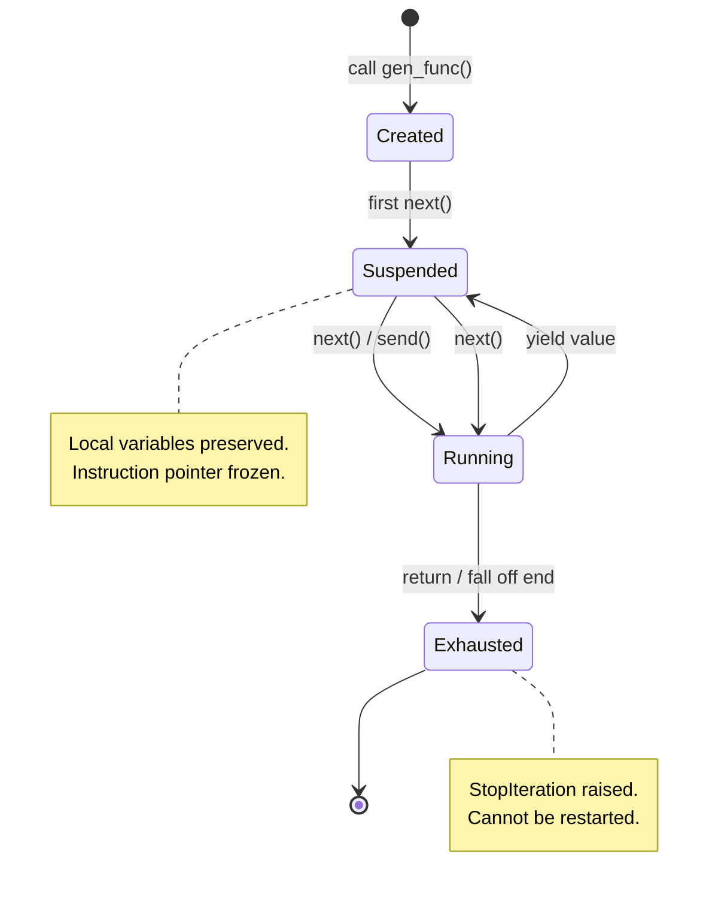
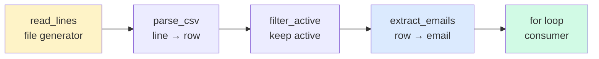
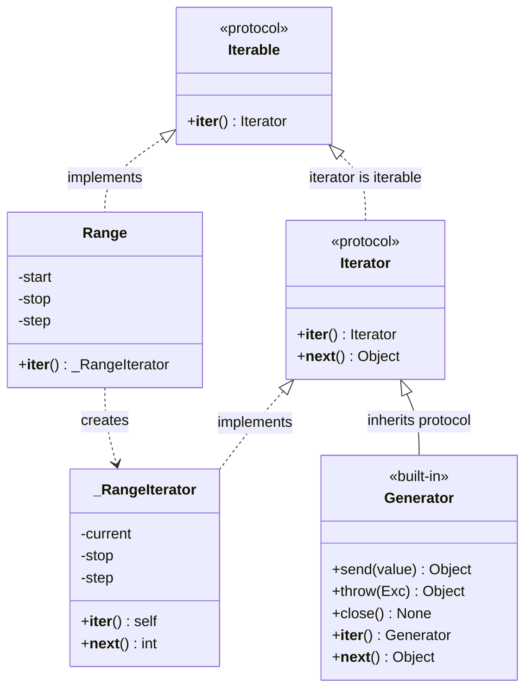
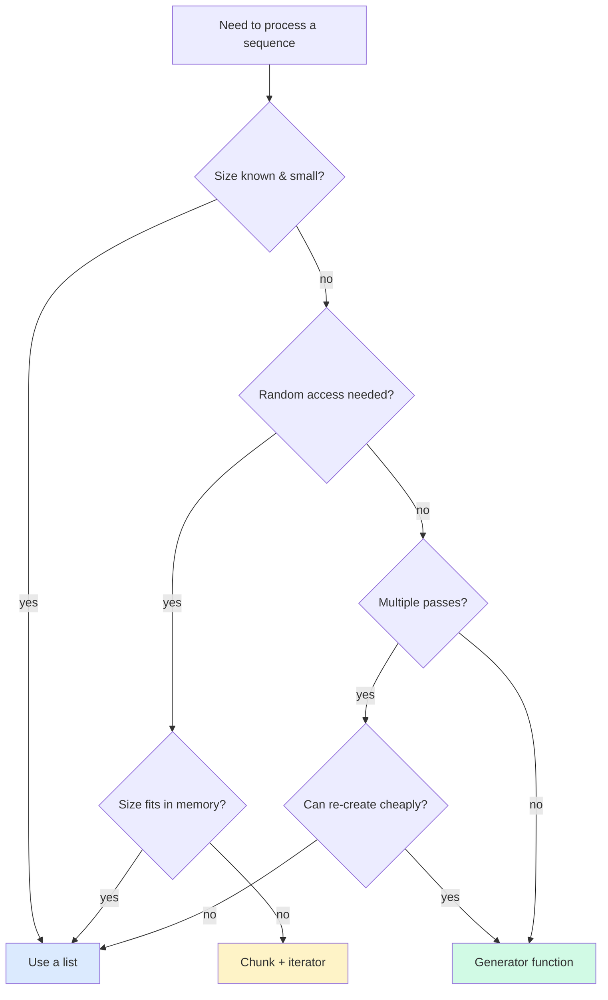

# Iterators and Generators — Lazy Sequences as Objects

#python #iterators #generators #lazy-evaluation #coroutines #itertools #teaching #deep-dive

> [!quote] Brandon Rhodes
> "An iterator is just an object that knows how to pretend it's a list — without ever building one."

Iteration is the most common control-flow pattern in Python. Every `for` loop, every comprehension, every `sum()`, `max()`, `list()` call ultimately relies on a small, well-defined protocol: the **iterator protocol**. Understanding that protocol transforms your view of Python from "loops are magic" to "loops are objects talking to each other."

This note covers the protocol itself, how to build iterators from scratch, how generators let the compiler write iterators for you, how to chain generators into lazy pipelines, and how generators double as coroutines. Iterators are the cleanest example of *encapsulated, stateful behavior* in the standard library — perfect OOP citizens.

Prerequisites: [[Magic-Methods]], [[Classes-And-Objects]], [[Methods-And-Functions]].

---

## 1. The Iterator Protocol

An **iterable** is any object you can pass to `for`. An **iterator** is the object that actually produces the items. The distinction matters: a list is iterable, but the thing doing the iterating is a separate iterator object created from it.

| Concept | Protocol | Returns | Example |
|---|---|---|---|
| Iterable | `__iter__()` | an iterator | `list`, `dict`, `set`, `str`, files, generators |
| Iterator | `__iter__()` *and* `__next__()` | next item or raises `StopIteration` | `iter([1,2,3])`, `map(...)`, generator objects |

```python
nums = [10, 20, 30]
it = iter(nums)              # calls list.__iter__ → returns a list_iterator
print(type(it))              # <class 'list_iterator'>
print(next(it))              # 10  → calls list_iterator.__next__
print(next(it))              # 20
print(next(it))              # 30
print(next(it))              # raises StopIteration
```

The protocol is symmetric: an iterator's `__iter__` returns `self`. That means an iterator *is* iterable, which is why you can pass iterators to functions that expect iterables.

```mermaid
sequenceDiagram
    participant Loop as for loop
    participant It as Iterable (list)
    participant Iter as Iterator
    participant Code as __next__

    Loop->>It: iter(obj)
    It->>Iter: returns new iterator
    Loop->>Iter: next()
    Iter->>Code: __next__()
    Code-->>Iter: value
    Iter-->>Loop: value
    Loop->>Iter: next()
    Iter->>Code: __next__()
    Code-->>Loop: StopIteration
    Loop-->>Loop: loop exits
```

### 1.1 The Two Dunder Methods

| Method | Signature | Purpose |
|---|---|---|
| `__iter__` | `def __iter__(self)` | Return an iterator (often `self`) |
| `__next__` | `def __next__(self)` | Return the next value or raise `StopIteration` |

`StopIteration` is the **only** correct way for an iterator to signal "I'm done." Returning `None`, raising `IndexError`, or any other convention breaks the protocol and surprises the `for` loop.

> [!warning] Common Student Misconception
> "If I just make `__getitem__` work with integer indices, the object is iterable." — Yes, that's the *fallback* iteration protocol (Python will synthesize an iterator that calls `obj[0]`, `obj[1]`, ... until `IndexError`), but it's slower, can't handle non-integer keys, and won't give you reverse iteration or `in` checks the way `__iter__` will. Always prefer defining `__iter__`.

---

## 2. Building a Custom Iterator

Let's reimplement `range` from scratch. The class needs `__iter__` (returns `self`), `__next__` (produces the next value), and an internal counter for state.

```python
class Range:
    """A minimal reimplementation of built-in range()."""
    def __init__(self, start, stop, step=1):
        self.current = start
        self.stop = stop
        self.step = step

    def __iter__(self):
        return self   # an iterator is its own iterator

    def __next__(self):
        if self.current >= self.stop:
            raise StopIteration
        value = self.current
        self.current += self.step
        return value
```

```python
for n in Range(1, 6):
    print(n, end=" ")   # 1 2 3 4 5

print(list(Range(10, 0, -2)))   # [10, 8, 6, 4, 2]
```

This works, but it has one flaw: **once exhausted, the iterator stays exhausted.** Calling `iter(r)` again returns the same `self` object, which is already past `stop`.

```python
r = Range(1, 4)
print(list(r))   # [1, 2, 3]
print(list(r))   # [] — exhausted!
```

The built-in `range` doesn't have this problem because `range.__iter__` returns a *fresh* iterator each time. To fix our class, we split responsibilities: an *iterable* that creates iterators, and an *iterator* that holds state.

```python
class Range:
    """Iterable that produces a fresh iterator each call."""
    def __init__(self, start, stop, step=1):
        self.start, self.stop, self.step = start, stop, step

    def __iter__(self):
        return _RangeIterator(self.start, self.stop, self.step)

class _RangeIterator:
    def __init__(self, start, stop, step):
        self.current, self.stop, self.step = start, stop, step

    def __iter__(self):
        return self

    def __next__(self):
        if self.current >= self.stop:
            raise StopIteration
        value = self.current
        self.current += self.step
        return value
```

> [!tip] Teaching Tip
> Walk students through the bug first ("why is `list(r)` empty the second time?") and let them propose the fix. The "iterable vs iterator" split lands much harder after they've felt the pain.

---

## 3. Generators — Iterators for Free

Writing `__iter__`/`__next__` boilerplate is tedious. A **generator function** uses the `yield` keyword to suspend execution between calls. When you call a generator function, you don't run the body — you get back a **generator object** that runs the body lazily.

```python
def range_gen(start, stop, step=1):
    current = start
    while current < stop:
        yield current
        current += step
```

Three lines of generator replace fifteen lines of iterator class. The compiler does the heavy lifting:

- It creates a frame object holding local variables (`current`, `stop`, `step`).
- It returns a generator object whose `__next__` resumes the frame.
- When the function returns (or falls off the end), the generator raises `StopIteration`.

```python
g = range_gen(1, 4)
print(next(g))   # 1
print(next(g))   # 2
print(next(g))   # 3
print(next(g))   # StopIteration
```



### 3.1 Generator Expressions vs List Comprehensions

A **generator expression** is the lazy cousin of a list comprehension. Replace the brackets with parentheses.

```python
squares_list = [x * x for x in range(1_000_000)]          # ~33 MB
squares_gen  = (x * x for x in range(1_000_000))          # ~120 bytes
```

| Feature | List comprehension `[...]` | Generator expression `(...)` |
|---|---|---|
| Memory | Allocates full list upfront | One item at a time |
| Reusability | Iterable as many times as you want | One-shot — exhausted after iteration |
| Indexing | `seq[i]` works | Not supported |
| `len()` | Works | Not supported |
| Speed (single pass) | Slightly faster | Slightly slower (per-item overhead) |
| Best for | Random access, repeated iteration | Streaming, huge or infinite sequences |

> [!example] Example: Sum of Squares
> ```python
> total = sum(x * x for x in range(1_000_000))   # generator expr — 120 bytes peak
> ```
> Pass the generator directly to `sum`. No intermediate list, no memory blow-up.

---

## 4. Lazy Pipelines

The real power of generators emerges when you chain them. Each stage consumes from the previous and produces for the next, pulling one item at a time. This is the **lazy pipeline** pattern — the basis of Unix pipes, Spark, and most stream-processing frameworks.

```python
def read_lines(path):
    with open(path) as f:
        yield from f

def parse_csv(lines):
    for line in lines:
        yield line.strip().split(",")

def filter_active(rows):
    for row in rows:
        if row[3] == "active":
            yield row

def extract_emails(rows):
    for row in rows:
        yield row[2]
```

```python
pipeline = extract_emails(filter_active(parse_csv(read_lines("users.csv"))))
for email in pipeline:
    print(email)
```



Each box yields one item at a time. A 10-GB CSV processes with constant memory. The pipeline can be infinite — a single `break` in the consumer stops everything cleanly.

### 4.1 `yield from` — Delegating to Sub-generators

`yield from` makes one generator delegate to another. It's a one-liner for "yield every item from this iterable." More importantly, it forwards `send()`, `throw()`, and `close()` to the sub-generator — essential for coroutine composition.

```python
def flatten(nested):
    for item in nested:
        if isinstance(item, (list, tuple)):
            yield from flatten(item)    # recursive delegation
        else:
            yield item

list(flatten([1, [2, [3, 4], 5], 6]))   # [1, 2, 3, 4, 5, 6]
```

`yield from` is also the precursor of `await`: in PEP 492, `await` was specified as roughly equivalent to `yield from` over an awaitable.

---

## 5. Infinite Generators

Because generators are lazy, "infinite" sequences are perfectly fine — they only consume what you ask for.

```python
def fibonacci():
    a, b = 0, 1
    while True:
        yield a
        a, b = b, a + b

# Take the first 10
from itertools import islice
print(list(islice(fibonacci(), 10)))
# [0, 1, 1, 2, 3, 5, 8, 13, 21, 34]
```

```python
def natural_numbers(start=1):
    n = start
    while True:
        yield n
        n += 1

# Zip an infinite generator with a finite list
for i, name in zip(natural_numbers(), ["alice", "bob", "carol"]):
    print(f"{i}: {name}")
```

> [!danger] Common Bug
> `list(fibonacci())` will hang forever — `list()` tries to consume the whole generator. Always pair infinite generators with `islice`, `zip`, or an explicit `break`.

---

## 6. Generators as Coroutines

Generators gained `send()`, `throw()`, and `close()` in PEP 342, turning them into **single-threaded coroutines**. The key trick: `yield` is an expression, not just a statement. It both produces a value *and* receives one.

```python
def accumulator():
    total = 0
    while True:
        value = yield total
        if value is None:
            break
        total += value
        yield total       # second yield for confirmation
```

Actually, the cleaner idiom uses a single `yield`:

```python
def running_average():
    """Coroutine: send values, get the running average back."""
    total = 0
    count = 0
    average = None
    while True:
        value = yield average
        total += value
        count += 1
        average = total / count
```

```python
ra = running_average()
next(ra)            # "prime" the coroutine — run up to the first yield
print(ra.send(10))  # 10.0
print(ra.send(20))  # 15.0
print(ra.send(30))  # 20.0
ra.close()          # shut it down (raises GeneratorExit inside)
```

| Method | What it does |
|---|---|
| `gen.send(value)` | Resumes the generator, with `value` becoming the result of the `yield` expression |
| `gen.throw(Exc)` | Resumes the generator but raises `Exc` at the `yield` point |
| `gen.close()` | Raises `GeneratorExit` inside the generator; if caught, clean up resources |
| `next(gen)` | Equivalent to `gen.send(None)` |

> [!warning] Priming Required
> A freshly created generator can't receive a `send(value)` with a non-`None` value — there's no `yield` expression waiting for input yet. Always call `next(gen)` first, or use the `@coroutine` decorator (see [[Decorators-As-OOP]]).

For new code, **prefer `async def` coroutines** (see [[Async-OOP]]) over generator-based coroutines — they're clearer, composable with `await`, and integrate with the broader async ecosystem.

---

## 7. The OOP Connection

Iterators are object-oriented to the bone:

- **State is encapsulated** in instance attributes (`current`, `stop`, `step`).
- **Behavior is dispatched** through dunder methods (`__iter__`, `__next__`).
- **Polymorphism is pervasive**: `for`, `sum`, `max`, `list`, `tuple`, `set`, `dict`, `Counter`, `deque` — all accept any iterator. Write a new iterator, and it works with every consumer.
- **Composition** is the natural shape: pipelines are generators feeding generators.



A generator object is, in fact, an instance of `types.GeneratorType`, which inherits from `Iterator`. The `yield` keyword doesn't bypass OOP — it asks Python to write a subclass of `Iterator` for you.

---

## 7.5 The `collections.abc` Iterator ABC

Python's `collections.abc` module provides abstract base classes that document (and partially enforce) the iterator protocol. Subclassing `Iterator` documents intent and lets `isinstance` checks succeed — without forcing you to write a metaclass.

```python
from collections.abc import Iterator

class Countdown(Iterator):
    def __init__(self, start):
        self.n = start

    def __next__(self):
        if self.n <= 0:
            raise StopIteration
        self.n -= 1
        return self.n + 1

# isinstance check passes — even though we didn't define __iter__!
c = Countdown(3)
print(isinstance(c, Iterator))   # True
print(list(c))                   # [3, 2, 1]
```

`Iterator` inherits from `Iterable`, and its `__iter__` is implemented as `return self`. The ABC takes care of the boilerplate. The same trick works for `Iterable` (where you only need `__iter__`), `Generator` (which gives you `send`, `throw`, `close` defaults), and many others.

| ABC | Required methods | Provides for free |
|---|---|---|
| `Iterable` | `__iter__` | — |
| `Iterator` | `__next__` | `__iter__` (returns `self`) |
| `Generator` | `__iter__`, `__next__`, `send` | `throw`, `close`, `__await__` |
| `Reversible` | `__iter__`, `__reversed__` | — |
| `Container` | `__contains__` | — |

> [!tip] Teaching Tip
> Show students the source of `collections.abc.Iterator`. It's about 15 lines and reveals the entire protocol. "This is what `for` actually expects of you."

### 7.6 The Two-Argument Form of `iter()`

`iter(callable, sentinel)` produces an iterator that calls `callable()` until it returns `sentinel`. It's perfect for "read until end-of-stream" loops.

```python
# Read lines until empty string
for line in iter(input, ""):
    print(f"You said: {line}")

# Read fixed-size chunks from a socket until b""
def read_chunk():
    return sock.recv(4096)
for chunk in iter(read_chunk, b""):
    process(chunk)
```

This pattern replaces the classic `while True / x = f() / if x == sentinel: break` idiom with one line, and keeps everything in iterator form so it composes with the rest of `itertools`.

---

## 8. `itertools` — The Iterator Standard Library

The `itertools` module is the most underused gem in Python. It's a box of small, composable iterator-building functions that follow three families:

### 8.1 Infinite iterators

| Function | Behavior |
|---|---|
| `count(start=0, step=1)` | `start, start+step, start+2*step, ...` forever |
| `cycle(iterable)` | Repeats the iterable forever |
| `repeat(obj, times=None)` | Yields `obj` forever (or `times` times) |

### 8.2 Finite iterators

| Function | Behavior |
|---|---|
| `chain(*iterables)` | Concatenates iterables |
| `islice(iter, stop)` / `islice(iter, start, stop, step)` | Lazy slice |
| `takewhile(pred, iter)` | Yields until `pred` becomes false |
| `dropwhile(pred, iter)` | Skips until `pred` becomes false, then yields the rest |
| `filterfalse(pred, iter)` | Inverse of `filter` |
| `compress(iter, selectors)` | Picks items where selectors are truthy |
| `starmap(func, iter)` | Like `map` but unpacks tuples as args |
| `accumulate(iter, func=operator.add)` | Running totals (or any binary op) |

### 8.3 Combinatoric iterators

| Function | Behavior |
|---|---|
| `product(*iterables, repeat=1)` | Cartesian product |
| `permutations(iter, r)` | All length-`r` permutations |
| `combinations(iter, r)` | All length-`r` combinations (no repeats) |
| `combinations_with_replacement(iter, r)` | Combinations allowing repeated picks |

### 8.4 A Worked Example

Top 3 active users by spend, streamed from a CSV:

```python
import itertools as it
import operator as op

def read_csv_lazy(path):
    with open(path) as f:
        # skip header
        next(f)
        for line in f:
            name, status, spend = line.strip().split(",")
            yield name, status, int(spend)

rows = read_csv_lazy("users.csv")
active = (r for r in rows if r[1] == "active")
sorted_active = sorted(active, key=op.itemgetter(2), reverse=True)
top3 = it.islice(sorted_active, 3)

for name, status, spend in top3:
    print(f"{name}: ${spend}")
```

> [!note] Why `sorted` Breaks Laziness
> `sorted()` must consume the entire iterable to produce a sorted list — there's no way around it. If you only need the *top k*, use `heapq.nlargest(k, iterable, key=...)` which keeps a bounded heap and stays close to O(n log k).

### 8.5 `groupby` and `tee` — Two Surprising Tools

`itertools.groupby(iterable, key=None)` groups **consecutive** items sharing the same key. It does *not* sort first — most newcomers expect SQL-style grouping and are confused when their data isn't grouped. Sort by the key first, then `groupby`.

```python
from itertools import groupby

rows = [
    {"dept": "eng",    "name": "ada"},
    {"dept": "eng",    "name": "linus"},
    {"dept": "sales",  "name": "zig"},
    {"dept": "eng",    "name": "grace"},
]
rows.sort(key=lambda r: r["dept"])    # CRITICAL: groupby only groups runs

for dept, members in groupby(rows, key=lambda r: r["dept"]):
    names = [m["name"] for m in members]
    print(f"{dept}: {names}")
# eng: ['ada', 'linus', 'grace']
# sales: ['zig']
```

`itertools.tee(iterable, n=2)` produces `n` independent iterators from one source. It works by internally buffering items as one of the tees advances faster than the others. **Use sparingly:** if one tee is fully consumed before the other starts, `tee` effectively materializes the whole iterable in memory.

```python
from itertools import tee

a, b = tee(range(5))
print(list(a))   # [0, 1, 2, 3, 4]
print(list(b))   # [0, 1, 2, 3, 4] — independent
```

> [!warning] Common Student Misconception
> "`tee` lets me iterate the same generator twice for free." — Only if the two tees stay close together. If one races ahead, `tee` buffers everything in between. For most "reuse the iterable" cases, prefer rebuilding the source (a generator function or a list).

### 8.6 `accumulate` for Running Aggregations

```python
from itertools import accumulate
import operator as op

list(accumulate([1, 2, 3, 4]))                          # [1, 3, 6, 10] — running sum
list(accumulate([1, 2, 3, 4], op.mul))                   # [1, 2, 6, 24] — running product
list(accumulate([100, -30, +50, -20], min))              # [100, 100, 50, 50]
list(accumulate([1, 2, 3, 4], lambda a, b: a * 10 + b))  # [1, 12, 123, 1234]
```

The last form is a beautiful one-liner for parsing digit streams into a number.

---

## 8.7 Fibonacci Generator — Three Flavors

To cement the difference between iterator classes, generator functions, and generator expressions, here are three implementations of the Fibonacci sequence:

```python
# Flavor 1: Iterator class
class FibIterator:
    def __init__(self):
        self.a, self.b = 0, 1
    def __iter__(self):
        return self
    def __next__(self):
        value = self.a
        self.a, self.b = self.b, self.a + self.b
        return value

# Flavor 2: Generator function (recommended)
def fib_gen():
    a, b = 0, 1
    while True:
        yield a
        a, b = b, a + b

# Flavor 3: Generator expression — CAN'T do Fibonacci directly,
# because each value depends on the previous two, not just on a counter.
# You can fake it with accumulate, but the readability suffers:
from itertools import accumulate, count
fib_expr = (
    a for a, b in
    accumulate(count(), lambda acc, _: (acc[1], acc[0] + acc[1]), initial=(0, 1))
)
```

| Flavor | Lines | State | Reusability | Readability |
|---|---|---|---|---|
| Iterator class | ~10 | Instance attributes | Fresh iterator per instance | Clear but verbose |
| Generator function | ~5 | Local variables | Fresh generator per call | Excellent |
| Generator expression | ~3 | Hidden | One-shot | Poor for stateful recurrences |

The lesson: **generator expressions are great for one-liner transforms**, but the moment you need stateful recurrences, branching, or `yield from`, graduate to a generator function. Don't force everything into an expression.

---

## 9. Iterator vs List — A Decision Matrix

| Question | Prefer list | Prefer iterator |
|---|---|---|
| Need random access (`seq[i]`)? | ✅ | ❌ |
| Need `len()` upfront? | ✅ | ❌ |
| Iterating multiple times? | ✅ | ❌ |
| Streaming a huge file? | ❌ | ✅ |
| Infinite sequence? | ❌ | ✅ |
| Memory-constrained environment? | ❌ | ✅ |
| Need to compose pipelines? | ❌ | ✅ |
| Pipeline output is small but input is huge? | Either | ✅ |



---

## 10. Complete Example — A Data Pipeline

A reusable class that wraps a generator pipeline and lets you inspect it.

```python
from itertools import islice

class Pipeline:
    """A composable lazy pipeline of transformations."""
    def __init__(self, source):
        self._source = source

    def map(self, fn):
        return Pipeline(fn(x) for x in self._source)

    def filter(self, pred):
        return Pipeline(x for x in self._source if pred(x))

    def take(self, n):
        return Pipeline(islice(self._source, n))

    def __iter__(self):
        # Each Pipeline call creates a new generator, so multiple
        # iterations re-run the source — works if the source is repeatable.
        return (x for x in self._source)

    def consume(self):
        """Drain the pipeline, returning a list."""
        return list(self._source)


# Usage
def numbers():
    n = 1
    while True:
        yield n
        n += 1

result = (
    Pipeline(numbers())
        .filter(lambda x: x % 2 == 0)
        .map(lambda x: x * x)
        .take(5)
        .consume()
)
print(result)   # [4, 16, 36, 64, 100]
```

The `Pipeline` class is just sugar over generator expressions — but it makes the chain readable and gives you a place to hang debugging, logging, or metrics.

---

## 11. Common Pitfalls

> [!danger] One-Shot Iterators
> A generator can only be iterated **once**. If you pass it to two `for` loops, the second gets nothing.
> ```python
> g = (x for x in range(3))
> print(list(g))   # [0, 1, 2]
> print(list(g))   # []
> ```

> [!danger] Hidden Exhaustion in Function Args
> ```python
> def process(items):
>     first = next(iter(items))   # consumes one item
>     for x in items:             # if items is an iterator, this skips the first!
>         ...
> ```
> If callers might pass iterators, store `items = list(items)` first, or document the contract.

> [!warning] Early `return` Inside a Generator
> A `return value` inside a generator (Python 3.3+) attaches the value to `StopIteration.value`. Most code ignores it. Use sparingly.

> [!warning] Mixing `next` and `for` on the Same Iterator
> ```python
> it = iter([1, 2, 3])
> print(next(it))   # 1
> for x in it:      # only iterates 2, 3 — not 1, 2, 3!
>     print(x)
> ```

> [!danger] Generator State Across Threads
> A generator object holds mutable local state and is **not thread-safe**. Sharing one generator across threads without a lock leads to torn reads, missed values, or a `RuntimeError: generator ignored GeneratorExit`. If you need concurrent consumption, give each thread its own generator instance, or wrap access in a `queue.Queue` (see [[Concurrency-In-OOP]]).

> [!note] StopIteration Inside Generators
> If a `StopIteration` is raised *inside* a generator body (say, you call `next()` on a sub-iterator that's empty), Python's `for` machinery historically mistook it for the *outer* generator finishing. PEP 479 (Python 3.7+) converts this into a `RuntimeError` so you can't accidentally end the wrong generator. Inside generators, catch `StopIteration` explicitly or use `yield from`.

---

## 12. Summary

- An **iterable** implements `__iter__`; an **iterator** implements `__iter__` and `__next__`.
- `StopIteration` is the only end-of-iteration signal.
- A **generator function** (uses `yield`) is the shortest path to an iterator.
- A **generator expression** is a lazy one-liner; use it in function calls (`sum(x for x in ...)`).
- `yield from` delegates to sub-generators and is the spiritual ancestor of `await`.
- Lazy pipelines let you process gigabytes with kilobytes of memory.
- `send()` / `throw()` / `close()` turn generators into coroutines — but new code should prefer `async def`.
- `itertools` is the standard library for iterator combinators; reach for it before writing loops.
- Iterators are first-class OOP citizens: encapsulated state, dispatched behavior, polymorphic consumption.

> [!success] You Understand Iterators When…
> You can explain why `zip([1,2,3], infinite_gen())` terminates, why `list(my_generator)` twice yields an empty list the second time, and why a `for` loop never calls `len()` on the iterable.

## See Also

- [[Magic-Methods]] — the full dunder protocol
- [[Decorators-As-OOP]] — `@contextlib.contextmanager` and the `@coroutine` priming decorator
- [[Context-Managers]] — `contextlib.contextmanager` is built on generators
- [[Async-OOP]] — `async def` and `async for` are the async descendants of generators
- [[Composition-Over-Inheritance]] — pipelines are pure composition
- [[Design-Patterns/Behavioral-Patterns|Behavioral Patterns]] — Iterator is a GoF pattern
