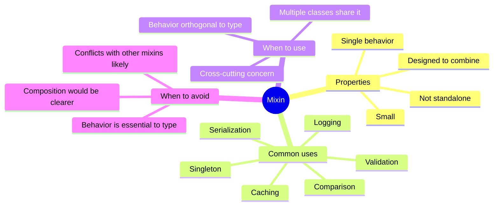
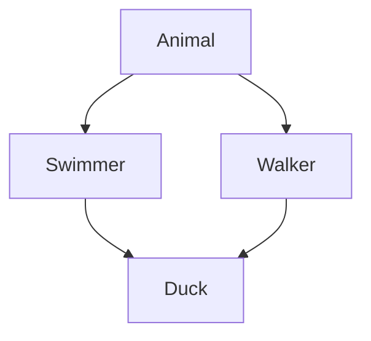
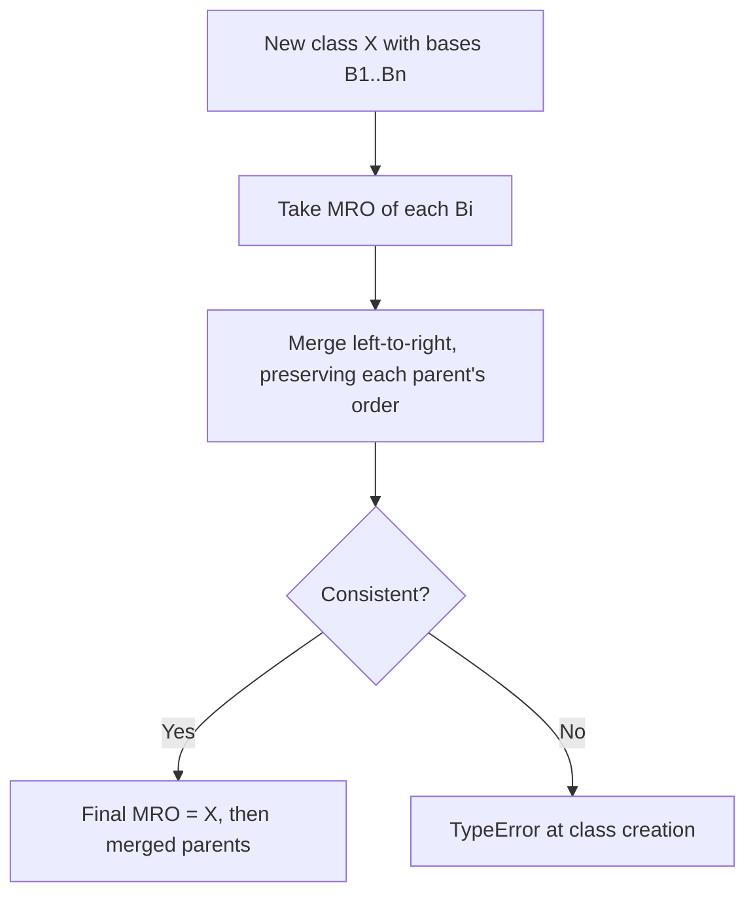
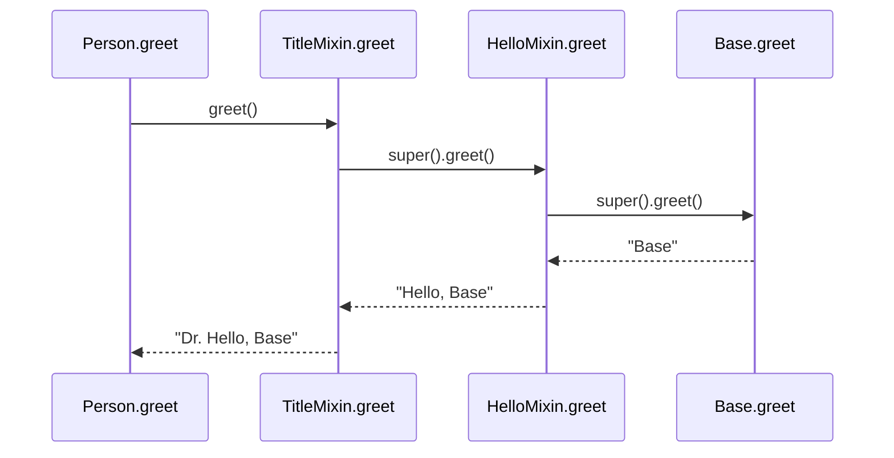
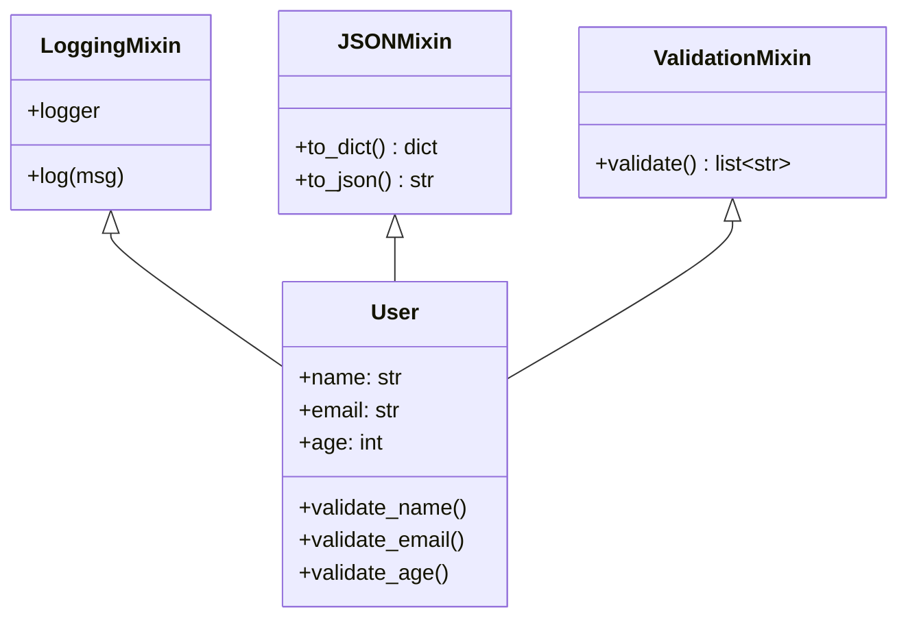
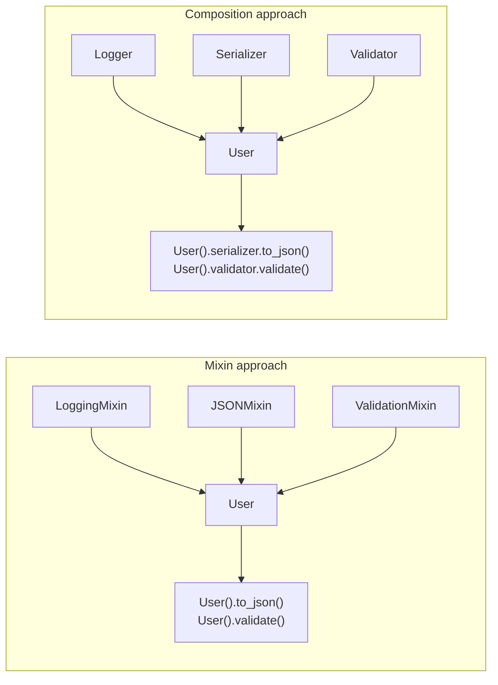
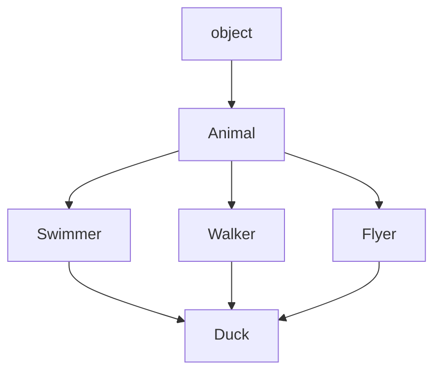
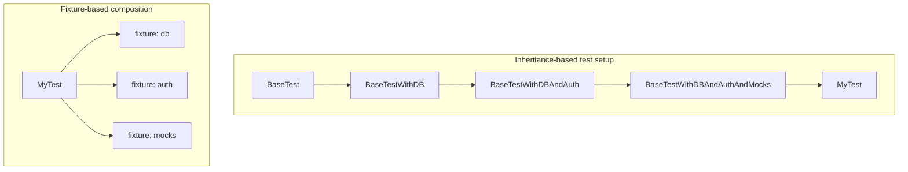
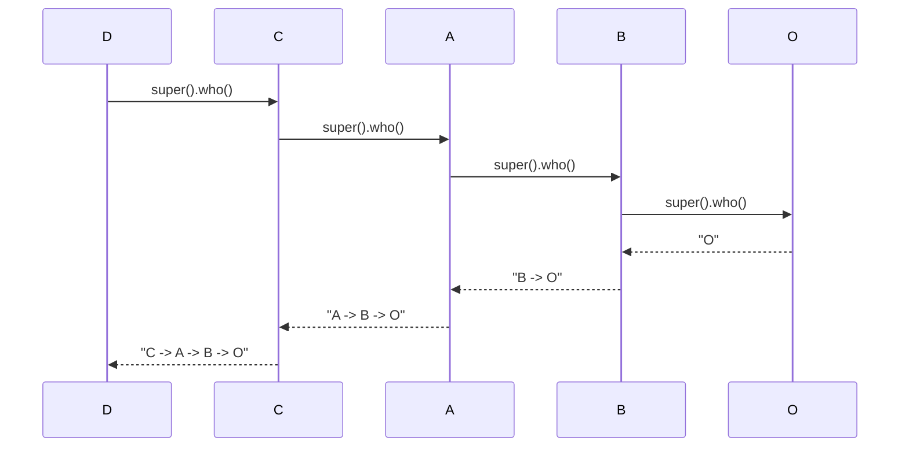
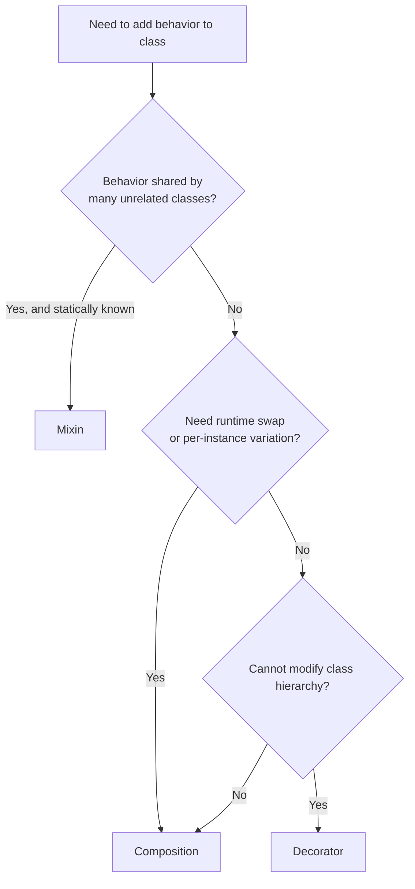

# Mixins and Multiple Inheritance — Power Tools With Sharp Edges

#oop #mixins #multiple-inheritance #mro #teaching #deep-dive

> [!quote] Brandon Rhodes — *Growing Object-Oriented Software, Guided by Tests*
> "Multiple inheritance is not evil, but it is dangerous. Use it when the alternatives are worse — and they sometimes are."

Python is one of the few mainstream languages that fully embraces **multiple inheritance** — a class can have more than one parent. With that power comes the famous **diamond problem**: if two parents define the same method, which one wins? Python solves this with the **C3 linearization** algorithm, which produces a deterministic **Method Resolution Order (MRO)**. On top of that mechanism, Pythonic code uses **mixins** — small classes that add a single behavior, designed to be combined.

This note covers mixins, MRO, the diamond problem, cooperative `super()`, common mixin patterns, when mixins help, when they hurt, and how they compare with composition.

Prerequisites: [[Inheritance]], [[Magic-Methods]], [[Composition-Over-Inheritance]].

---

## 1. What Is a Mixin?

A **mixin** is a small class that:

- Adds **one specific behavior** to whatever class combines it.
- Is **not meant to be instantiated standalone** — it's incomplete on purpose.
- Is **designed to be combined** with other classes (often multiple mixins together).
- Typically **does not declare `__init__`** (or cooperatively forwards via `super()`).

Examples of mixin behavior: logging, JSON serialization, validation, equality based on a single attribute, singleton enforcement.

```python
# A typical mixin
class ReprMixin:
    def __repr__(self) -> str:
        return f"{type(self).__name__}({vars(self)!r})"

class User(ReprMixin):
    def __init__(self, name, email):
        self.name = name
        self.email = email

print(User("Alice", "a@x.io"))
# User({'name': 'Alice', 'email': 'a@x.io'})
```

`ReprMixin` adds a `__repr__`. It doesn't make sense to instantiate `ReprMixin()` alone — it has nothing to repr.



---

## 2. Multiple Inheritance in Python — The Basic Mechanism

Python lets a class list multiple bases:

```python
class A:
    def hello(self): return "A"

class B:
    def hello(self): return "B"

class C(A, B):
    pass

print(C().hello())          # A
print(C.__mro__)
# (<class 'C'>, <class 'A'>, <class 'B'>, <class 'object'>)
```

The `__mro__` attribute tells you the order Python searches bases when looking up an attribute. Here it's `C → A → B → object`. So `C().hello()` finds `A.hello` first.

The order isn't arbitrary — it's computed by the **C3 linearization** algorithm.

---

## 3. The Diamond Problem

The diamond arises when a class inherits from two classes that share a common ancestor:



If `Animal` defines `breathe()` and both `Swimmer` and `Walker` override it, what does `Duck().breathe()` call? Without a deterministic rule, the answer is ambiguous — the *diamond problem*.

In Python:

```python
class Animal:
    def breathe(self): return "Animal.breathe"

class Swimmer(Animal):
    def breathe(self): return "Swimmer.breathe"

class Walker(Animal):
    def breathe(self): return "Walker.breathe"

class Duck(Swimmer, Walker):
    pass

print(Duck().breathe())   # Swimmer.breathe
print(Duck.__mro__)
# (<class 'Duck'>, <class 'Swimmer'>, <class 'Walker'>, <class 'Animal'>, <class 'object'>)
```

`Swimmer` wins because it's listed first in `class Duck(Swimmer, Walker)`. The MRO visits `Swimmer` before `Walker` — and notably, `Animal` appears only **once**, *after* both.

---

## 4. C3 Linearization — How the MRO Is Computed

The C3 algorithm computes a linear order of base classes that:

1. Preserves the order in which bases are listed.
2. Preserves the order of each base's own MRO.
3. Visits each class exactly once.

In simplified terms, C3 merges the MROs of all the parents left-to-right, then appends the new class at the front. If the merge is impossible (the constraints conflict), Python raises `TypeError` at class-creation time.

```python
class X(A, B): pass   # OK if A and B's MROs are consistent
```

If you construct an inheritance graph that C3 can't linearize:

```python
class X(A, B): pass
class Y(B, A): pass
class Z(X, Y): pass   # TypeError: Cannot create a consistent MRO
```

This is a *good* thing — Python refuses to silently pick a winner in an inconsistent hierarchy.



You can always inspect a class's MRO with `Cls.__mro__` or `Cls.mro()`.

> [!tip] Teaching Tip
> Show students an MRO conflict `TypeError` live. It's a powerful demonstration that Python doesn't guess — and it pushes them to design *cooperative* hierarchies instead of tangled ones.

---

## 5. Cooperative `super()` — Making Mixins Compose

The real power of mixins emerges when each one calls `super()`. This is **cooperative multiple inheritance**: every class in the chain participates, and `super()` figures out the next class in the MRO.

```python
class Base:
    def greet(self):
        return "Base"

class HelloMixin:
    def greet(self):
        return "Hello, " + super().greet()

class TitleMixin:
    def greet(self):
        return "Dr. " + super().greet()

class Person(TitleMixin, HelloMixin, Base):
    pass

print(Person().greet())
# Dr. Hello, Base
```

What happens? Python walks the MRO of `Person`:

```
Person → TitleMixin → HelloMixin → Base → object
```

When `Person().greet()` is called:
1. `TitleMixin.greet` runs, calls `super().greet()`.
2. `super()` looks up the next class in the MRO after `TitleMixin` → `HelloMixin`.
3. `HelloMixin.greet` runs, calls `super().greet()`.
4. `super()` finds `Base.greet`.
5. Returns `"Base"` → propagated back as `"Hello, Base"` → `"Dr. Hello, Base"`.



This works because *every* mixin cooperatively calls `super()`. If `HelloMixin` had omitted the `super()` call, the chain would have broken and `Base.greet` would never run.

### 5.1 Cooperative `__init__`

The same pattern applies to `__init__`. Mixins that need initialization should accept `*args, **kwargs` and forward them:

```python
class LoggingMixin:
    def __init__(self, *args, **kwargs):
        print(f"Initializing {type(self).__name__}")
        super().__init__(*args, **kwargs)

class ValidatingMixin:
    def __init__(self, *args, **kwargs):
        super().__init__(*args, **kwargs)
        self._validate()

    def _validate(self):
        # subclass hook
        pass

class User(LoggingMixin, ValidatingMixin):
    def __init__(self, name):
        super().__init__(name=name)
        self.name = name

    def _validate(self):
        if not self.name:
            raise ValueError("name required")

User("Alice")
# Initializing User
```

Each `__init__` does its work and forwards. Without `*args, **kwargs` and `super()`, this fails — one parent would swallow arguments needed by another.

---

## 6. Common Mixin Patterns

### 6.1 `LoggingMixin`

Adds a `log` method that prepends the class name:

```python
import logging

class LoggingMixin:
    @property
    def logger(self):
        name = f"{type(self).__module__}.{type(self).__name__}"
        return logging.getLogger(name)

    def log(self, msg, level=logging.INFO):
        self.logger.log(level, f"[{type(self).__name__}] {msg}")
```

### 6.2 `SerializationMixin` (JSON / dict)

```python
import json
from dataclasses import asdict, is_dataclass

class JSONMixin:
    def to_dict(self) -> dict:
        if is_dataclass(self):
            return asdict(self)
        return {k: v for k, v in vars(self).items() if not k.startswith("_")}

    def to_json(self) -> str:
        return json.dumps(self.to_dict(), default=str)
```

### 6.3 `ValidationMixin`

```python
class ValidationMixin:
    def validate(self) -> list[str]:
        """Return list of validation errors (empty if valid)."""
        errors = []
        for name in dir(self):
            if name.startswith("validate_"):
                method = getattr(self, name)
                if callable(method):
                    err = method()
                    if err:
                        errors.extend(err if isinstance(err, list) else [err])
        return errors
```

### 6.4 `ComparableMixin` (with `functools.total_ordering`)

```python
import functools

@functools.total_ordering
class ComparableMixin:
    def _compare_key(self):
        raise NotImplementedError

    def __eq__(self, other):
        if not isinstance(other, ComparableMixin): return NotImplemented
        return self._compare_key() == other._compare_key()

    def __lt__(self, other):
        if not isinstance(other, ComparableMixin): return NotImplemented
        return self._compare_key() < other._compare_key()

class Student(ComparableMixin):
    def __init__(self, name, gpa):
        self.name, self.gpa = name, gpa
    def _compare_key(self):
        return self.gpa

students = [Student("A", 3.5), Student("B", 3.9), Student("C", 3.1)]
print([s.name for s in sorted(students, reverse=True)])
# ['B', 'A', 'C']
```

### 6.5 `SingletonMixin`

```python
class SingletonMixin:
    _instance = None

    def __new__(cls, *args, **kwargs):
        if cls._instance is None:
            cls._instance = super().__new__(cls)
        return cls._instance

class Config(SingletonMixin):
    def __init__(self):
        if not hasattr(self, "_loaded"):
            self.settings = {}
            self._loaded = True
```

> [!warning] Common Student Misconception
> "Singleton via mixin is great!" It's *convenient*, but singletons are global state and make testing hard. Prefer dependency injection (see [[Composition-Over-Inheritance]]) — pass the config object in.

---

## 7. Building a Class With Multiple Mixins

Let's compose all of these into a real example: a `User` class that logs, serializes to JSON, and validates itself.

```python
import json, logging
from dataclasses import dataclass, field

# --- Mixins ---

class LoggingMixin:
    @property
    def logger(self):
        return logging.getLogger(f"{type(self).__module__}.{type(self).__name__}")

    def log(self, msg, level=logging.INFO):
        self.logger.log(level, msg)

class JSONMixin:
    def to_dict(self) -> dict:
        return {k: v for k, v in vars(self).items() if not k.startswith("_")}
    def to_json(self) -> str:
        return json.dumps(self.to_dict(), default=str)

class ValidationMixin:
    def validate(self) -> list[str]:
        errors = []
        for attr in dir(self):
            if attr.startswith("validate_"):
                errs = getattr(self, attr)()
                if errs:
                    errors.extend(errs if isinstance(errs, list) else [errs])
        return errors

# --- The composed class ---

@dataclass
class User(LoggingMixin, JSONMixin, ValidationMixin):
    name: str
    email: str
    age: int = 0

    def validate_name(self) -> list[str]:
        errs = []
        if not self.name: errs.append("name required")
        if len(self.name) > 50: errs.append("name too long")
        return errs

    def validate_email(self) -> list[str]:
        errs = []
        if "@" not in self.email: errs.append("invalid email")
        return errs

    def validate_age(self) -> list[str]:
        return [] if self.age >= 0 else ["age must be non-negative"]

# Usage
logging.basicConfig(level=logging.INFO)
u = User("Alice", "alice@x.io", 30)
u.log("created")
print(u.to_json())
print(u.validate())   # []
bad = User("", "bad-email", -1)
print(bad.validate()) # ['name required', 'invalid email', 'age must be non-negative']
```



---

## 8. When Mixins Help

Mixins shine for **cross-cutting concerns**: behavior that's orthogonal to a class's primary responsibility and shared across unrelated classes.

- **Logging** — every service class can mix in `LoggingMixin` without re-implementing it.
- **Serialization** — domain models can gain `to_json`/`to_dict` uniformly.
- **Validation** — `validate()` returning errors is reusable.
- **Comparison** — `@functools.total_ordering` plus a `_compare_key` hook.
- **Caching** — `CachedMixin` adds memoization transparently.
- **Framework integration** — Django's `LoginRequiredMixin`, Flask's `MethodView` patterns.

Mixins also work well when classes share a **cooperative protocol**: every mixin calls `super()`, the MRO is linear and consistent, and the class composition reads top-to-bottom.

---

## 9. When Mixins Hurt

### 9.1 Diamond Complexity

When two mixins define the same method and don't cooperatively chain, behavior depends on MRO ordering — which is fragile:

```python
class A:
    def hello(self): return "A"

class B(A):
    def hello(self): return "B"   # forgot super()

class C(A):
    def hello(self): return "C"   # forgot super()

class D(B, C):
    pass

print(D().hello())   # "B" — C's hello never runs
```

### 9.2 Attribute Collisions

```python
class CacheMixin:
    def __init__(self, *a, **k):
        super().__init__(*a, **k)
        self._cache = {}        # COLLISION

class StatsMixin:
    def __init__(self, *a, **k):
        super().__init__(*a, **k)
        self._cache = {}        # COLLISION

class Service(CacheMixin, StatsMixin):
    pass
```

Both mixins write `self._cache`. The later `__init__` clobbers the earlier one. Solution: prefix with the mixin name (`self._cache_cache`, `self._stats_cache`) — ugly but safe.

### 9.3 Initialization Order Surprises

Because `super().__init__` follows the MRO, the *order* mixins initialize depends on inheritance order, not the order they're listed in the class body. Bugs from this are notoriously hard to find.

### 9.4 Hidden Coupling

A mixin that calls `self.some_method()` assumes the host class (or another mixin) provides `some_method`. That assumption is invisible until you use the mixin in a class that doesn't have it.

> [!warning] Common Student Misconception
> "Mixins are a clean way to share code." They're a *convenient* way to share code; "clean" depends entirely on whether the mixins cooperate and avoid collisions. Five mixins with overlapping method names is worse than a single well-factored base class.

---

## 10. Mixins vs Composition

Mixins and composition solve overlapping problems. The trade-off:

| Aspect | Mixin | Composition |
|---|---|---|
| Mechanism | Class inherits behavior | Object holds a component |
| Runtime swap | No — baked into class | Yes — replace the component |
| Coupling | Tight — host class sees mixin methods | Loose — host sees only the component's interface |
| Testing | Hard — must instantiate full host | Easy — inject fake component |
| Method dispatch | Magic via MRO | Explicit delegation |
| Reuse | Share across many classes | Share via component instances |
| When better | Cross-cutting, "every X has behavior Y" | Behavioral flexibility, runtime decisions |



### Refactor Example — From Mixin to Composition

```python
# ❌ Mixin version
class LoggingMixin:
    def log(self, msg): print(f"[log] {msg}")

class UserService(LoggingMixin):
    def register(self, name):
        self.log(f"registering {name}")
        return User(name)

# ✅ Composition version
class Logger:
    def log(self, msg): print(f"[log] {msg}")

class UserService:
    def __init__(self, logger: Logger):
        self.logger = logger
    def register(self, name):
        self.logger.log(f"registering {name}")
        return User(name)

svc = UserService(Logger())
```

The composition version lets you swap loggers (file, syslog, silent-for-tests) without touching `UserService`'s class hierarchy. See [[Composition-Over-Inheritance]] and [[Dependency-Inversion]] for the full argument.

---

## 11. The "Mixin as Decorator" Alternative

Python decorators can sometimes replace mixins when you want to add behavior to a class without changing its inheritance:

```python
def with_logging(cls):
    orig_init = cls.__init__
    def __init__(self, *args, **kwargs):
        print(f"Initializing {cls.__name__}")
        orig_init(self, *args, **kwargs)
    cls.__init__ = __init__
    return cls

@with_logging
class User:
    def __init__(self, name): self.name = name

User("Alice")   # Initializing User
```

Decorators are useful when you can't or don't want to modify the inheritance chain — but they're more obscure than mixins and harder to type-check statically. Use sparingly.

---

## 12. A Common Mistake — Mixin as God Class

A frequent abuse: a giant mixin that adds 30 methods, used by 5 different classes that each need only 4 of them. This is just multiple inheritance in disguise — and it violates [[Interface-Segregation]]. Prefer several small mixins, each adding one capability, so hosts pick only what they need.

```python
# ❌ Bad
class GodMixin:
    def to_json(self): ...
    def to_xml(self): ...
    def to_yaml(self): ...
    def from_dict(self): ...
    def validate(self): ...
    def log(self): ...
    def cache_get(self): ...
    # ... 30 methods total

# ✅ Good — split by capability
class JSONMixin: ...      # 3 methods
class XMLMixin: ...       # 3 methods
class ValidationMixin: ... # 1 method
class LoggingMixin: ...   # 2 methods
```

---

## 13. Mixins With ABCs

Mixins can themselves be ABCs — useful when a mixin provides some methods and requires others:

```python
from abc import ABC, abstractmethod

class CacheMixin(ABC):
    @abstractmethod
    def _key(self, *args) -> str: ...

    def __init__(self, *a, **k):
        super().__init__(*a, **k)
        self._cache_store = {}

    def cached(self, *args, fn):
        key = self._key(*args)
        if key not in self._cache_store:
            self._cache_store[key] = fn(*args)
        return self._cache_store[key]

class ExpensiveService(CacheMixin):
    def _key(self, *args):
        return "|".join(str(a) for a in args)
    def compute(self, n):
        return self.cached(n, fn=self._expensive_op)
    def _expensive_op(self, n):
        print("computing...")
        return n * 2

svc = ExpensiveService()
print(svc.compute(5))   # computing... 10
print(svc.compute(5))   # 10 (cached)
```

`CacheMixin` provides the caching behavior; `_key` is the hook the host must implement.

---

## 14. MRO Visualization — Reading the Order

A quick reference for visualizing how Python walks the MRO in a complex diamond:



```python
class Duck(Swimmer, Walker, Flyer):
    pass

print([c.__name__ for c in Duck.__mro__])
# ['Duck', 'Swimmer', 'Walker', 'Flyer', 'Animal', 'object']
```

The MRO visits `Duck` first, then `Swimmer`, `Walker`, `Flyer` (in listed order), then the common ancestor `Animal` (only once, after all its descendants), then `object`.

---

## 15. Decision Guide — Mixin or Composition?

```mermaid
flowchart TD
    A[Adding cross-cutting behavior] --> B{Need runtime swap?}
    B -->|Yes| C[Use Composition]
    B -->|No| D{Need different behavior per instance?}
    D -->|Yes| C
    D -->|No| E{Is behavior truly<br/>shared by many unrelated classes?}
    E -->|Yes| F[Mixin is reasonable]
    E -->|No| G{Class hierarchy already exists?}
    G -->|Yes| F
    G -->|No| C
    F --> H{Will mixins cooperate<br/>via super() and avoid collisions?}
    H -->|Yes| I[Use Mixin]
    H -->|No| C
```

---

## 16. Real-World Framework Examples

Mixins are everywhere in mature Python frameworks. Studying them sharpens your intuition for the pattern.

### 16.1 Django Class-Based Views

Django's `View` hierarchy uses mixins extensively. A typical view combines several:

```python
from django.views.generic import TemplateView
from django.contrib.auth.mixins import LoginRequiredMixin

class DashboardView(LoginRequiredMixin, TemplateView):
    template_name = "dashboard.html"
    login_url = "/login/"
```

`LoginRequiredMixin` adds redirect-to-login behavior. `TemplateView` adds template rendering. The MRO weaves them together — each mixin cooperates via `super()` in `dispatch()`.

The lesson: Django *could* have made a giant `SecuredTemplateDashboardView` class. Instead, it composes capabilities. Adding `PermissionRequiredMixin` is one more base — no class explosion.

### 16.2 Django Models via Mixins

```python
class TimestampedMixin(models.Model):
    created_at = models.DateTimeField(auto_now_add=True)
    updated_at = models.DateTimeField(auto_now=True)

    class Meta:
        abstract = True

class SoftDeleteMixin(models.Model):
    is_deleted = models.BooleanField(default=False)

    def delete(self, *args, **kwargs):
        self.is_deleted = True
        self.save()

    class Meta:
        abstract = True

class Document(TimestampedMixin, SoftDeleteMixin):
    title = models.CharField(max_length=200)
    body = models.TextField()
```

Two orthogonal concerns — timestamping and soft-deletion — are mixed in independently. Adding a third behavior (e.g., `AuditedMixin`) is one more base.

### 16.3 pytest's Plugin Model

pytest itself doesn't expose mixins directly, but its fixture system is the spiritual cousin: small, focused behaviors composed into a test. Compare a fixture-based test with a hypothetical "BaseTestWithDBAndAuthAndMocks" class — the fixture approach scales; the inheritance approach combinatorially explodes.



### 16.4 What to Steal

When you see a framework using mixins well, notice:

- Each mixin adds **one** capability.
- Mixins cooperate via `super()` — they don't silently override.
- Mixin names describe the **capability**, not the type (`LoginRequiredMixin`, not `LoggedInView`).
- Concrete classes compose multiple mixins rather than inheriting from a god-class.

---

## 17. A Subtle MRO Pitfall — `super()` in `__new__`

A common gotcha: when mixins override `__new__` (e.g., for singletons), the MRO walk must reach `object.__new__`. Forgetting to forward `super().__new__(cls)` breaks instantiation:

```python
class TracingMixin:
    def __new__(cls, *args, **kwargs):
        print(f"creating {cls.__name__}")
        return super().__new__(cls)   # must forward!

class Thing(TracingMixin):
    def __init__(self, x): self.x = x

Thing(5)
# creating Thing
```

Without `super().__new__(cls)`, `Thing(5)` returns `None` — silent breakage.

---

## 18. Mixin Naming Conventions

A consistent naming convention prevents confusion:

- Suffix capability mixins with `Mixin`: `LoggingMixin`, `JSONMixin`, `ValidationMixin`.
- Suffix role mixins with `able`: `Comparable`, `Serializable`, `Renderable` (these are often better as Protocols — see [[Interfaces-And-Protocols]]).
- Prefix framework-required mixins with their concern: `LoginRequiredMixin`, `PermissionRequiredMixin`.
- Avoid generic names like `Helper`, `Base`, `Utils` — they hide intent.

Good naming makes the class header read like a sentence: `class User(LoggingMixin, JSONMixin, ValidationMixin)` reads as "a User that logs, serializes to JSON, and validates itself."

---

## 19. Summary

Mixins and multiple inheritance are **power tools**. Used well, they make small, focused behaviors reusable across many classes. Used poorly, they create tangled hierarchies, hidden couplings, and impossible-to-debug MRO surprises.

Key takeaways:

- Python's **MRO** (C3 linearization) makes multiple inheritance deterministic. Inspect it with `__mro__`.
- **Cooperative `super()`** is the secret to composable mixins — every link in the chain participates.
- Use mixins for **truly cross-cutting** concerns shared by many classes.
- Avoid mixins when behavior is essential to the type, varies per instance, or needs runtime swapping — **composition** is clearer (see [[Composition-Over-Inheritance]]).
- Keep mixins **small and focused** — one capability each, never a god-mixin.

---

## 20. A Worked MRO Walkthrough

Let's trace a non-trivial example end-to-end so the algorithm becomes intuitive.

```python
class O:                   # stands for "object"-ish base
    def who(self): return "O"

class A(O):
    def who(self): return "A -> " + super().who()

class B(O):
    def who(self): return "B -> " + super().who()

class C(A, B):
    def who(self): return "C -> " + super().who()

class D(C):
    def who(self): return "D -> " + super().who()

print(D().who())
# D -> C -> A -> B -> O
print([c.__name__ for c in D.__mro__])
# ['D', 'C', 'A', 'B', 'O', 'object']
```

What happens:

1. `D().who()` calls `D.who`, which calls `super().who()`.
2. After `D` in the MRO comes `C`. So `C.who` runs, calls `super().who()`.
3. After `C` comes `A`. `A.who` runs, calls `super().who()`.
4. After `A` comes `B` (not `O`!), because C3 places `B` before the common ancestor `O`. `B.who` runs.
5. After `B` comes `O`. `O.who` runs, returns `"O"`.
6. Each call unwinds: `B -> "B -> O"`, then `A -> "A -> B -> O"`, then `C -> "C -> A -> B -> O"`, then `D -> "D -> C -> A -> B -> O"`.



The crucial insight: even though `A` doesn't *know* about `B`, `super()` from inside `A.who` lands on `B`, not on `O`. That's the magic of cooperative multiple inheritance — `super()` is *not* "call my parent"; it's "call the next class in *this instance's* MRO."

### 20.1 Why This Matters for Mixin Design

A mixin written to be composed *must* call `super()`, even if it doesn't appear to have a parent that implements the method. Otherwise, the chain breaks:

```python
class GreetingMixin:
    def greet(self):
        return "Hello"   # ❌ no super() — chain dies here

class NameMixin:
    def greet(self):
        return super().greet() + ", Alice"

class FormalGreeter(NameMixin, GreetingMixin):
    pass

# What does FormalGreeter().greet() return?
# NameMixin.greet -> super().greet() -> GreetingMixin.greet -> "Hello"
# Then "Hello" + ", Alice" = "Hello, Alice"

# But if NameMixin came second in MRO:
class FormalGreeter2(GreetingMixin, NameMixin):
    pass
# MRO: FormalGreeter2, GreetingMixin, NameMixin, object
# GreetingMixin.greet returns "Hello" — NameMixin never runs.
print(FormalGreeter2().greet())   # "Hello"  (surprising!)
```

This is the gotcha: mixins must cooperate, AND the order in the class header matters. The most-specific mixin should come first; the most-general (or "base" behavior) should come last.

> [!warning] Common Student Misconception
> "`super()` calls the parent class." It doesn't — it calls the **next class in the MRO**. In single inheritance, that's the parent. In multiple inheritance, it can be a sibling. This distinction is the whole reason cooperative mixins work.

---

## 21. Mixin vs Decorator vs Composition — Quick Decision

Three ways to add behavior to a class, with different trade-offs:

| Approach | Pros | Cons | When to choose |
|---|---|---|---|
| **Mixin** | Composable, MRO-driven, easy to combine | Tight coupling, attribute collision risk | Cross-cutting concern shared by many classes |
| **Decorator** | No inheritance change, applies post-hoc | Obscure, harder to type-check | Framework-style class transformation |
| **Composition** | Loose coupling, runtime swap, testable | More verbose (delegation methods) | Behavior varies per instance or needs swapping |



When in doubt, default to composition — it's the most flexible and the easiest to test.

### What to Read Next
- [[Composition-Over-Inheritance]] — the modern default, often clearer than mixins.
- [[Inheritance]] — the foundation mixins build on.
- [[Interfaces-And-Protocols]] — a cleaner way to declare capabilities.
- [[Magic-Methods]] — many dunder behaviors are best implemented as mixins (`__eq__`, `__hash__`, `__repr__`).
- [[Abstract-Base-Classes]] — mixins can be ABCs too.

### Exercises

1. Build `LoggingMixin`, `JSONMixin`, and `ValidationMixin`. Apply all three to a `Product` class. Verify that reordering the bases in the class header doesn't change behavior (because each mixin cooperates via `super()`).
2. Construct a diamond-shaped hierarchy and inspect `__mro__`. Force a `TypeError` by creating an inconsistent MRO. Fix it.
3. Refactor the multi-mixin `User` example to use composition. Compare: which version is easier to test? To add a new serialization format (YAML)?
4. Write a `CacheMixin` (ABC) with an abstract `_key` hook. Apply it to a service that performs an expensive computation. Verify caching works.
5. Demonstrate attribute collision: two mixins both setting `self._cache`. Then fix it by namespacing the attribute per-mixin.

> [!success] You've Got It When…
> You can explain to a teammate what `super()` does *in the presence of multiple inheritance*, why MRO exists, and three concrete signals that tell you "this should be composition, not a mixin."
