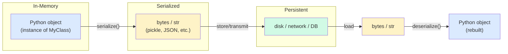
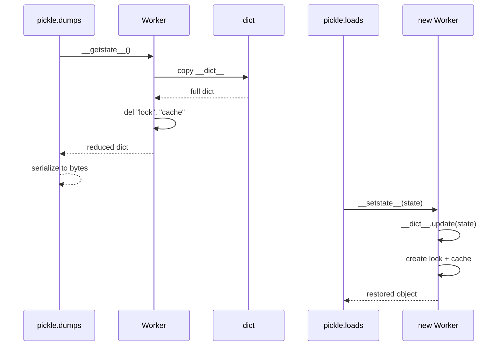
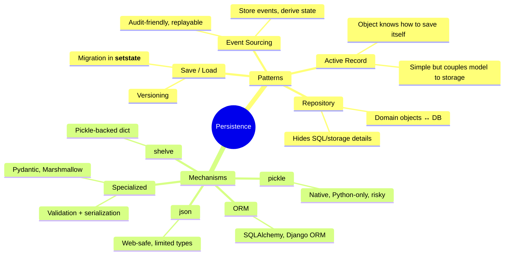
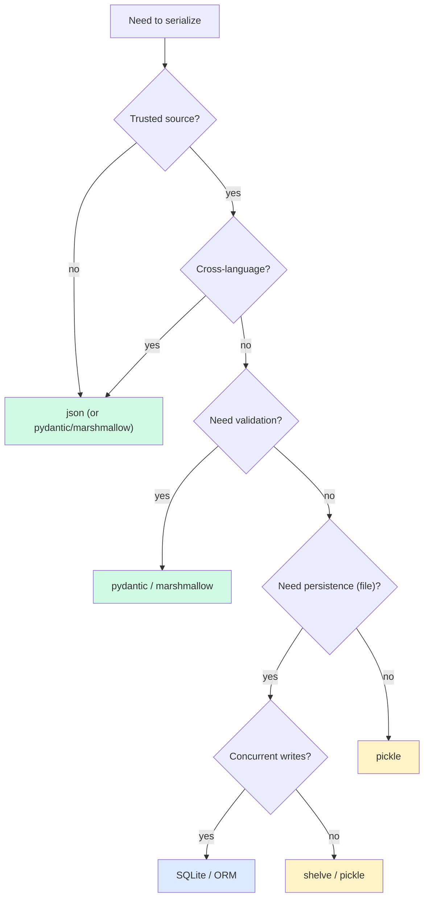

# Serialization and Persistence — Saving Objects to Disk and Back

#python #serialization #pickle #json #shelve #pydantic #persistence #teaching #deep-dive

> [!quote] Josh Bloch (paraphrased)
> "Serialization is the bridge between the in-memory world of objects and the on-disk world of bytes. It's also where most security bugs live."

**Serialization** is the process of turning an in-memory object into a stream of bytes (or a string) that can be stored, transmitted, or reconstructed later. **Deserialization** is the reverse: bytes → object. Together they're the foundation of caching, persistence, IPC, RPC, and any system where objects must outlive a single process.

Python's standard library offers four serialization mechanisms — `pickle`, `json`, `shelve`, and `copyreg` — plus a dunder protocol (`__getstate__`/`__setstate__`) for fine control. Beyond the stdlib, the data-validation ecosystem (`marshmallow`, `pydantic`, `cattrs`) has grown into a near-essential toolset for OOP code that talks to JSON APIs.

This note covers each mechanism, the security implications, the dunder protocol, the third-party landscape, and a worked save/load game-state pattern.

Prerequisites: [[Magic-Methods]] (especially `__init__`, `__dict__`), [[Dataclasses]], [[Attributes-And-Properties]].

---

## 1. Why Serialize?

| Use case | Example |
|---|---|
| Persistence | Save game state, store user sessions in Redis |
| Caching | Memoize expensive results to disk |
| IPC | Send objects between processes via `multiprocessing` |
| RPC / APIs | Return Python objects as JSON over HTTP |
| Configuration | Load YAML/JSON config into typed objects |
| Testing | Fixture snapshots, golden files |
| Async messaging | Queue payloads in Celery, RQ, Dramatiq |

Every one of these requires turning an object into bytes or text — and turning it back, ideally without losing information or types.



---

## 2. `pickle` — Serialize Anything (with Caveats)

`pickle` is Python's native binary serializer. It can handle almost any Python object: classes, instances, functions (by reference), nested containers, cyclic references, dataclasses. The trade-off: pickle is **Python-only**, the format is **not human-readable**, and unpickling untrusted data is a **security hazard**.

```python
import pickle

class Point:
    def __init__(self, x, y):
        self.x = x
        self.y = y
    def __repr__(self):
        return f"Point({self.x}, {self.y})"

p = Point(3, 4)
data = pickle.dumps(p)         # bytes
print(data[:20])               # b'\x80\x04\x95...\x00Point'

p2 = pickle.loads(data)        # Point(3, 4)
print(p2)                      # Point(3, 4)
print(p is p2)                 # False — new object
print(type(p2) is Point)       # True — same class
```

### 2.1 The Pickle Protocol Versions

| Version | Python | Notes |
|---|---|---|
| 0 | All | Human-readable ASCII; slowest |
| 1 | All | Old binary format |
| 2 | 2.3+ | New-style classes |
| 3 | 3.0+ | Bytes support |
| 4 | 3.4+ | Large objects, `__reduce_ex__` |
| 5 | 3.8+ | Out-of-band data (PEP 574) |

`pickle.DEFAULT_PROTOCOL` tracks the latest stable version. For long-lived archives, pick a protocol explicitly so a future Python doesn't break compatibility: `pickle.dumps(obj, protocol=4)`.

### 2.2 What Pickle Stores

Pickle stores:
- The **module path** and **class name** of each object (so it can be reconstructed).
- The **instance `__dict__`** (or the result of `__getstate__`).
- The **structure** of containers (lists, dicts, tuples, sets).

Pickle does **not** store:
- The class definition itself (the class must be importable at unpickle time).
- Class-level attributes (methods, defaults, descriptors).
- Anything you exclude in `__getstate__`.

> [!danger] Never Unpickle Untrusted Data
> `pickle.loads(untrusted_bytes)` is **arbitrary code execution**. The pickle format can include instructions like "import this module and call this function with these args." A malicious pickle can `os.system("rm -rf /")` or worse.
>
> If you need to receive objects from untrusted sources, use `json` (or another safe format). If you must use pickle, restrict what can be loaded with `pickle.Unpickler` and a custom `find_class` method, or use `hmac` to sign the payload.

### 2.3 Restricting Unpickling

```python
import pickle
import builtins

class SafeUnpickler(pickle.Unpickler):
    ALLOWED = {("builtins", "range"), ("builtins", "list"), ("builtins", "dict")}

    def find_class(self, module, name):
        if (module, name) not in self.ALLOWED:
            raise pickle.UnpicklingError(f"forbidden: {module}.{name}")
        return super().find_class(module, name)

# Usage
obj = SafeUnpickler(io.BytesIO(untrusted_bytes)).load()
```

Even with this, you should be cautious — bugs in `find_class` restrictions have led to real CVEs. Prefer JSON for untrusted input.

---

## 3. `__getstate__` and `__setstate__` — Controlling Pickle

Pickle's default behavior is to dump and restore `__dict__`. That works for most objects, but breaks down when:

- The object has non-pickleable attributes (open file handles, locks, sockets).
- You want to exclude cached or derived state.
- You need to migrate the format between versions.
- The class requires constructor arguments (so a bare `__dict__` update isn't enough).

The dunder protocol gives you full control:

| Method | When it's called | What to return / do |
|---|---|---|
| `__getstate__(self)` | During pickling | A picklable representation of state (often a `dict`) |
| `__setstate__(self, state)` | During unpickling | Restore state from the saved representation |
| `__reduce__(self)` | Lower-level: defines how to reconstruct | Tuple of `(callable, args, state, ...)` |
| `__reduce_ex__(self, protocol)` | Per-protocol version of `__reduce__` | Same |

### 3.1 Excluding Non-Pickleable Attributes

```python
import pickle
import threading

class Worker:
    def __init__(self, name):
        self.name = name
        self.lock = threading.Lock()    # not picklable!
        self.cache = {}                  # transient, skip

    def __getstate__(self):
        state = self.__dict__.copy()
        del state["lock"]                # don't pickle the lock
        del state["cache"]               # don't pickle the cache
        return state

    def __setstate__(self, state):
        self.__dict__.update(state)
        self.lock = threading.Lock()     # recreate the lock
        self.cache = {}                  # recreate the cache
```

```python
w = Worker("alice")
data = pickle.dumps(w)          # works — no lock, no cache
w2 = pickle.loads(data)
print(w2.name, w2.lock, w2.cache)   # alice <Lock object> {}
```



### 3.2 State Migration Across Versions

`__setstate__` is also where you migrate old saved state to a new schema. If version 1 saved `{"x": 1, "y": 2}` and version 2 adds `z`, you can default it:

```python
def __setstate__(self, state):
    # Backward compatibility: old pickles don't have "z"
    state.setdefault("z", 0)
    self.__dict__.update(state)
```

For complex migrations, use `copyreg.__newobj__` or a version field:

```python
def __getstate__(self):
    return {"_version": 2, "x": self.x, "y": self.y, "z": getattr(self, "z", 0)}

def __setstate__(self, state):
    version = state.pop("_version", 1)
    if version < 2:
        state["z"] = state.get("z", 0)
    self.__dict__.update(state)
```

### 3.3 The `__reduce__` Escape Hatch

For objects that can't be reconstructed from `__dict__` alone (e.g., they require constructor args), implement `__reduce__`:

```python
class Color:
    def __init__(self, r, g, b):
        self.r, self.g, self.b = r, g, b
    def __reduce__(self):
        # (callable, args_tuple, state_dict)
        return (Color, (self.r, self.g, self.b), self.__dict__)
```

On unpickling, pickle does `Color(r, g, b)` and then `obj.__dict__.update(state_dict)`. This is how `datetime.datetime`, `pathlib.Path`, and many other built-ins are pickled.

---

## 4. `copyreg` — Registering Custom Reducers

`copyreg` lets you register a `__reduce__`-style function for a class *without modifying the class*. Useful for third-party classes you can't edit, or for separating serialization concerns from the class.

```python
import copyreg

class Point:
    def __init__(self, x, y):
        self.x, self.y = x, y

def pickle_point(p):
    return Point, (p.x, p.y)        # (callable, args)

copyreg.pickle(Point, pickle_point)

# Now pickle uses pickle_point automatically:
import pickle
data = pickle.dumps(Point(3, 4))
```

`copyreg.pickle` and `copyreg.constructor` are the two main functions. They affect `pickle`, `copy.deepcopy`, and `copy.copy` — all of which use the same reduce protocol.

---

## 5. `json` — The Web-Safe Format

JSON is the lingua franca of web APIs. It's:
- **Human-readable** (text, not binary)
- **Safe** (no code execution; just data)
- **Cross-language** (every language has a JSON parser)
- **Limited** (only strings, numbers, booleans, `null`, lists, dicts)

```python
import json

data = {"name": "ada", "age": 36, "active": True, "tags": ["x", "y"]}
text = json.dumps(data)             # '{"name": "ada", ...}'
back = json.loads(text)             # original dict
```

| Python type | JSON type | Notes |
|---|---|---|
| `dict` | object | keys must be strings |
| `list`, `tuple` | array | tuples become lists on round-trip |
| `str` | string | |
| `int`, `float` | number | large ints may lose precision in some parsers |
| `True` / `False` | true / false | |
| `None` | null | |
| `set`, `bytes`, `datetime`, custom classes | **not supported** | need custom encoder |

### 5.1 Custom JSON Encoders

Subclass `json.JSONEncoder` and override `default()`:

```python
import json
from datetime import datetime

class CustomEncoder(json.JSONEncoder):
    def default(self, obj):
        if isinstance(obj, datetime):
            return obj.isoformat()
        if isinstance(obj, set):
            return sorted(obj)               # encode as sorted list
        if isinstance(obj, bytes):
            return obj.decode("utf-8", errors="replace")
        return super().default(obj)          # raises TypeError

data = {"ts": datetime(2024, 1, 15), "tags": {"a", "b"}}
print(json.dumps(data, cls=CustomEncoder, indent=2))
# {"ts": "2024-01-15T00:00:00", "tags": ["a", "b"]}
```

### 5.2 The Asymmetry: Decoding Is Harder

`json.dumps` is one-directional: Python → JSON. The reverse — JSON → Python objects of your custom classes — has no built-in mechanism, because JSON doesn't carry type information. You have two options:

1. **Manual decoding**: write a `from_dict` classmethod.
2. **Object hook**: pass `object_hook=` to `json.loads`.

```python
def decode_point(d):
    if "x" in d and "y" in d:
        return Point(d["x"], d["y"])
    return d

text = '{"x": 3, "y": 4}'
obj = json.loads(text, object_hook=decode_point)
print(type(obj), obj.x, obj.y)   # <class 'Point'> 3 4
```

The `object_hook` is called for every JSON object decoded (from innermost out), giving you a chance to convert dicts into typed objects. This is brittle for non-trivial schemas — that's where `pydantic` and `marshmallow` come in (§8).

```mermaid
flowchart LR
    subgraph Py["Python Object"]
        P["Point(3, 4)"]
    end
    subgraph En["JSONEncoder"]
        E["default()"]
    end
    subgraph JS["JSON string"]
        J['{"x": 3, "y": 4}']
    end
    subgraph De["JSONDecoder"]
        D["object_hook()"]
    end
    P --> E --> J --> D --> P2["Point(3, 4)"]
    style E fill:#fef3c7
    style D fill:#fef3c7
    style J fill:#d1fae5
```

### 5.3 `pickle` vs `json` — Comparison

| Feature | `pickle` | `json` |
|---|---|---|
| Format | Binary | Text |
| Human-readable | No | Yes |
| Cross-language | No (Python only) | Yes (universal) |
| Custom classes | Yes (with `__getstate__`) | No (manual encoders) |
| Security | ❌ Arbitrary code execution | ✅ Safe |
| Speed | Fast | Slightly slower |
| File size | Compact | Larger |
| Schema validation | No | No (use pydantic/marshmallow) |
| Best for | Python-to-Python IPC, caching | APIs, config, interop |

> [!tip] Teaching Tip
> Have students round-trip a `set` through JSON. They'll discover sets aren't serializable — and have to think about what to encode them as (sorted list? array with a type tag?). That conversation is the entire motivation for schema libraries.

---

## 6. `shelve` — A Persistent Dict of Pickled Objects

`shelve` is a thin wrapper over `dbm` (a simple key-value store) and `pickle`. It gives you a dict-like object that's backed by a file:

```python
import shelve

class User:
    def __init__(self, name, email):
        self.name = name
        self.email = email

with shelve.open("users.db") as db:
    db["ada"] = User("Ada", "ada@example.com")
    db["linus"] = User("Linus", "linus@example.com")

with shelve.open("users.db") as db:
    print(db["ada"].email)        # ada@example.com
    print("ada" in db)            # True
    for key in db:
        print(key, db[key].name)
```

`shelve` is convenient for prototyping, scripts, and small datasets. It does **not** scale — the underlying `dbm` implementations (gdbm, ndbm, etc.) are not designed for concurrent writes or large data. For real persistence, use SQLite (with `sqlite3`), an ORM (SQLAlchemy), or a key-value store (Redis).

> [!warning] `shelve` Cache Surprise
> By default, `shelve.open(writeback=False)` does **not** cache mutations. If you do `db["ada"].email = "new"` and then close, the change is lost — because `db["ada"]` returned a *copy* (a deserialized object), and you mutated the copy. Either use `writeback=True` (slower, all values cached in memory) or do `obj = db["ada"]; obj.email = "new"; db["ada"] = obj`.

---

## 7. Dataclasses + JSON

The cleanest stdlib-only pattern for JSON serialization is a `@dataclass` plus `dataclasses.asdict` and a classmethod:

```python
from dataclasses import dataclass, asdict
import json

@dataclass
class Address:
    street: str
    city: str
    zip_code: str

@dataclass
class Person:
    name: str
    age: int
    address: Address

    @classmethod
    def from_dict(cls, d):
        return cls(
            name=d["name"],
            age=d["age"],
            address=Address(**d["address"]),
        )

p = Person("Ada", 36, Address("1 Main", "London", "EC1"))
text = json.dumps(asdict(p))
print(text)
# {"name": "Ada", "age": 36, "address": {"street": "1 Main", ...}}

p2 = Person.from_dict(json.loads(text))
print(p2 == p)   # True (dataclass __eq__ is structural)
```

This is good for simple cases but gets verbose for nested types, optional fields, enums, and dates. That's where third-party libraries shine.

---

## 8. The Third-Party Landscape

| Library | Strength | When to use |
|---|---|---|
| **`marshmallow`** | Mature, framework-agnostic, validation + serialization | APIs with complex schemas |
| **`pydantic`** | Type-annotated data classes with runtime validation | FastAPI, modern API servers, config |
| **`cattrs`** | Separates data (dataclasses) from serialization strategy | When you don't want validation baked into the class |
| **`attrs`** | Predecessor of dataclasses; pairs well with `cattrs` | When dataclasses aren't flexible enough |
| **`msgpack`** | Binary, fast, cross-language | High-throughput IPC |
| **`tomli` / `tomllib`** | TOML config (3.11+ stdlib) | Configuration files |
| **`yaml`** | YAML config (PyYAML) | Rich config with comments |

### 8.1 Pydantic — The Modern Default

```python
from pydantic import BaseModel
from datetime import datetime

class Address(BaseModel):
    street: str
    city: str
    zip_code: str

class Person(BaseModel):
    name: str
    age: int
    address: Address
    created_at: datetime = datetime.now()

p = Person.model_validate({
    "name": "Ada",
    "age": 36,
    "address": {"street": "1 Main", "city": "London", "zip_code": "EC1"},
})
print(p.model_dump_json(indent=2))
```

Pydantic gives you:
- **Validation** (wrong types raise at parse time)
- **Nested models** (Address inside Person, automatically)
- **Type coercion** (string "36" → int 36 if you allow it)
- **JSON Schema generation** (for OpenAPI / Swagger)
- **`model_dump()` / `model_validate()`** for dict round-trips

For new code that talks JSON, pydantic is the de facto standard — especially paired with FastAPI.

### 8.2 Marshmallow — The Schema-First Alternative

Marshmallow separates the schema from the class. Useful when you have existing data classes you can't or don't want to modify:

```python
from marshmallow import Schema, fields, post_load

class Address:
    def __init__(self, street, city, zip_code):
        self.street, self.city, self.zip_code = street, city, zip_code

class AddressSchema(Schema):
    street = fields.Str(required=True)
    city = fields.Str(required=True)
    zip_code = fields.Str(required=True)

    @post_load
    def make_address(self, data, **kwargs):
        return Address(**data)

schema = AddressSchema()
addr = schema.loads('{"street": "1 Main", "city": "London", "zip_code": "EC1"}')
print(addr.city)   # London
```

### 8.3 cattrs — Strategy-Based Serialization

`cattrs` lets you keep plain dataclasses and inject serialization logic separately:

```python
from dataclasses import dataclass
from datetime import datetime
import cattrs

@dataclass
class Event:
    name: str
    ts: datetime

converter = cattrs.Converter()
converter.register_unstructure_hook(datetime, lambda d: d.isoformat())
converter.register_structure_hook(datetime, lambda v, _: datetime.fromisoformat(v))

e = Event("click", datetime(2024, 1, 15, 10, 30))
text = converter.unstructure(e)
print(text)   # {'name': 'click', 'ts': '2024-01-15T10:30:00'}

e2 = converter.structure(text, Event)
print(e2 == e)   # True
```

This is the cleanest separation of concerns: data classes don't know about serialization; the converter owns the rules. Excellent for large codebases with many types.

---

## 9. Persistence Patterns

### 9.1 Save / Load Game State

A classic example combining `pickle`, `__getstate__`, and versioned state:

```python
import pickle
from pathlib import Path

class GameState:
    VERSION = 2

    def __init__(self, level, score, inventory=None):
        self.level = level
        self.score = score
        self.inventory = inventory or []
        self._temp_cache = {}     # transient, don't save

    def __getstate__(self):
        return {
            "_version": self.VERSION,
            "level": self.level,
            "score": self.score,
            "inventory": self.inventory,
        }

    def __setstate__(self, state):
        version = state.pop("_version", 1)
        if version < 2:
            # v1 didn't have inventory
            state.setdefault("inventory", [])
        self.__dict__.update(state)
        self._temp_cache = {}     # recreate transient state

def save_game(state: GameState, path: Path):
    with open(path, "wb") as f:
        pickle.dump(state, f, protocol=4)

def load_game(path: Path) -> GameState:
    with open(path, "rb") as f:
        return pickle.load(f)
```

```python
state = GameState(level=5, score=1200, inventory=["sword", "potion"])
save_game(state, Path("save.pkl"))

loaded = load_game(Path("save.pkl"))
print(loaded.level, loaded.score, loaded.inventory)
# 5 1200 ['sword', 'potion']
```



### 9.2 The Repository Pattern

For serious persistence (anything beyond prototypes), use the **Repository pattern** (see [[Repository-Pattern]]). Domain objects stay storage-agnostic; a `Repository` class translates between them and the storage layer.

```python
class UserRepository:
    def __init__(self, db):
        self.db = db

    def get(self, user_id: int) -> User:
        row = self.db.execute("SELECT * FROM users WHERE id = ?", (user_id,)).fetchone()
        return User.from_row(row) if row else None

    def save(self, user: User) -> int:
        if user.id is None:
            cur = self.db.execute(
                "INSERT INTO users(name, email) VALUES (?, ?)",
                (user.name, user.email),
            )
            return cur.lastrowid
        else:
            self.db.execute(
                "UPDATE users SET name=?, email=? WHERE id=?",
                (user.name, user.email, user.id),
            )
            return user.id

    def delete(self, user_id: int):
        self.db.execute("DELETE FROM users WHERE id = ?", (user_id,))
```

The `User` class is a plain dataclass; the `UserRepository` knows about SQL. This separation is the heart of clean persistence in OOP — see [[Repository-Pattern]] and [[Hexagonal-Architecture]].

### 9.3 Object-Relational Mapping (ORM)

ORMs automate the translation between objects and database rows. SQLAlchemy and Django ORM are the two big Python ORMs. They use descriptors (see [[Descriptors]]) and metaclasses (see [[Metaclasses]]) to make table-backed classes look like ordinary Python classes.

```python
# SQLAlchemy declarative style
from sqlalchemy import Column, Integer, String
from sqlalchemy.orm import declarative_base

Base = declarative_base()

class User(Base):
    __tablename__ = "users"
    id = Column(Integer, primary_key=True)
    name = Column(String)
    email = Column(String, unique=True)

# Use like a normal class:
user = User(name="Ada", email="ada@example.com")
session.add(user)
session.commit()
```

The `Column` calls are descriptors — `user.name` doesn't return the Column object, it returns the value (or hits the DB lazily). That's metaprogramming in service of persistence.

### 9.4 `copy` and `deepcopy` — The Other Serialization

Python's `copy` module uses the same `__reduce__` machinery as pickle to perform shallow and deep copies. A **shallow copy** duplicates the container but shares the items; a **deep copy** recursively duplicates everything.

```python
import copy

original = [[1, 2], [3, 4]]
shallow = copy.copy(original)
deep = copy.deepcopy(original)

original[0].append(99)
print(shallow)   # [[1, 2, 99], [3, 4]]  — shared inner list
print(deep)      # [[1, 2], [3, 4]]      — independent
```

Customize with `__copy__` and `__deepcopy__`:

```python
class Cached:
    def __init__(self, data, cache=None):
        self.data = data
        self.cache = cache if cache is not None else {}

    def __copy__(self):
        # Share the data, but new cache.
        return Cached(self.data, cache={})

    def __deepcopy__(self, memo):
        # Deep copy data, new cache.
        return Cached(copy.deepcopy(self.data, memo), cache={})
```

`memo` is a dict tracking already-copied objects, used to preserve shared references and break cycles. Always pass it through when recursing.

> [!tip] Teaching Tip
> Have students check `copy.deepcopy` on a cyclic structure (`a = []; a.append(a)`). The `memo` dict is what prevents infinite recursion. Tracing it in a debugger makes the protocol click.

### 9.5 Testing Serialization Round-Trips

A useful pytest helper:

```python
import pickle, json
from dataclasses import asdict

def assert_pickle_roundtrip(obj):
    """Assert that obj survives a pickle round-trip with equal state."""
    restored = pickle.loads(pickle.dumps(obj, protocol=4))
    assert type(restored) is type(obj)
    assert restored == obj, f"{restored!r} != {obj!r}"

def assert_json_roundtrip(obj, to_dict, from_dict):
    """Assert obj survives a JSON round-trip via to_dict/from_dict."""
    text = json.dumps(to_dict(obj))
    restored = from_dict(json.loads(text))
    assert restored == obj
```

Run these on every domain object as part of your test suite. They catch:
- Missing `__getstate__` (a non-pickleable attribute fails to pickle)
- `__eq__` not implemented (the equality check is meaningless)
- Drift between serialization and the class definition
- Mutable defaults shared across instances

---

## 10. Pitfalls and Anti-Patterns

> [!danger] Unpickling Untrusted Data
> As emphasized in §2.2 — pickle is **arbitrary code execution**. Treat any unpickled bytes as if someone had run them through `eval()`. Never accept pickled data over a network from untrusted sources.

> [!danger] Pickling Closures and Lambdas
> Pickle can't serialize lambdas or functions defined inside other functions — they have no importable module path. You'll get `PicklingError: Can't pickle <function ...>`. Refactor to a module-level `def`, or use `dill`/`cloudpickle` (third-party, with the same security caveats).

> [!warning] Class Definition Drift
> If you pickle an instance of `MyClass` and later rename the class, move it to another module, or change `__init__`'s signature, the unpickle will fail or produce a broken object. Pin classes with `__module__` and `__qualname__` in mind; use `copyreg` for renames.

> [!warning] `__init__` Doesn't Run on Unpickle
> When pickle reconstructs an object, it calls `__new__` (no `__init__`) and then `__setstate__`. Invariants enforced in `__init__` may be silently bypassed. If you need validation on load, put it in `__setstate__`.

> [!warning] Mutable Default Args + JSON
> `json.loads('{"x": 1}')` returns a plain dict. If your class expects typed fields, the dict silently passes any wrong-typed value through. Use pydantic or marshmallow to validate.

> [!note] `dataclasses.asdict` Is Recursive — and Slow
> `asdict` recursively converts nested dataclasses, lists, and dicts. For huge object graphs, this can be slow and create many intermediate dicts. Profile before assuming JSON is your bottleneck.

> [!note] JSON Number Precision
> `json.loads("18014398509481984")` returns the int `18014398509481984` (Python handles arbitrary-precision ints). But if the value passes through JavaScript or any language with float64-only numbers, it'll lose precision. For IDs and money, serialize as strings.

---

## 11. Choosing the Right Mechanism



---

## 12. Summary

- **Serialization** turns objects into bytes or text; **deserialization** is the reverse.
- `pickle` is Python-only, handles almost any object, but **unpickling untrusted data is RCE**.
- `__getstate__` / `__setstate__` give you fine control over what gets pickled and how state is restored.
- `__reduce__` is the lower-level escape hatch for objects that need constructor args.
- `copyreg` lets you register reducers for classes you don't own.
- `json` is safe and cross-language but limited to basic types. Subclass `JSONEncoder` for custom types; use `object_hook` for decoding.
- `shelve` is a thin pickle-backed dict; fine for prototyping, not for production.
- Dataclasses pair naturally with JSON via `asdict` + `from_dict` classmethods.
- **Pydantic** is the modern default for type-safe JSON serialization with validation.
- **Marshmallow** separates schema from class; **cattrs** separates strategy from data.
- For real persistence, use the Repository pattern (or an ORM) — domain objects shouldn't know about storage.

> [!success] You Understand Serialization When…
> You can explain why unpickling is dangerous, why `__init__` doesn't run on unpickle, why `json` round-trips a tuple as a list, and why pydantic is preferable to hand-rolled `from_dict` methods for non-trivial schemas.

## See Also

- [[Magic-Methods]] — `__getstate__`/`__setstate__`/`__reduce__` live here
- [[Dataclasses]] — the natural pairing for JSON serialization
- [[Repository-Pattern]] — clean persistence in OOP
- [[Hexagonal-Architecture]] — separating domain from infrastructure
- [[Descriptors]] — how ORMs turn `Column` into attribute access
- [[Metaclasses]] — how ORMs build table classes
- [[Attributes-And-Properties]] — what's in `__dict__` and what isn't
- [[Constructors-And-Destructors]] — `__init__` vs `__new__` and why the former doesn't run on unpickle
