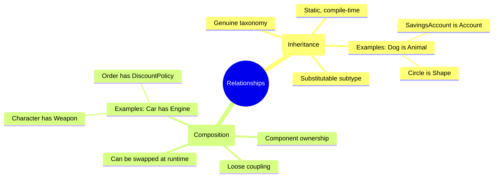
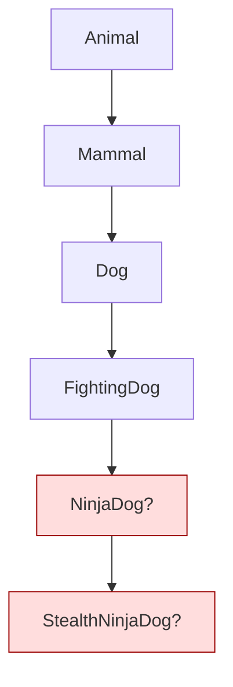
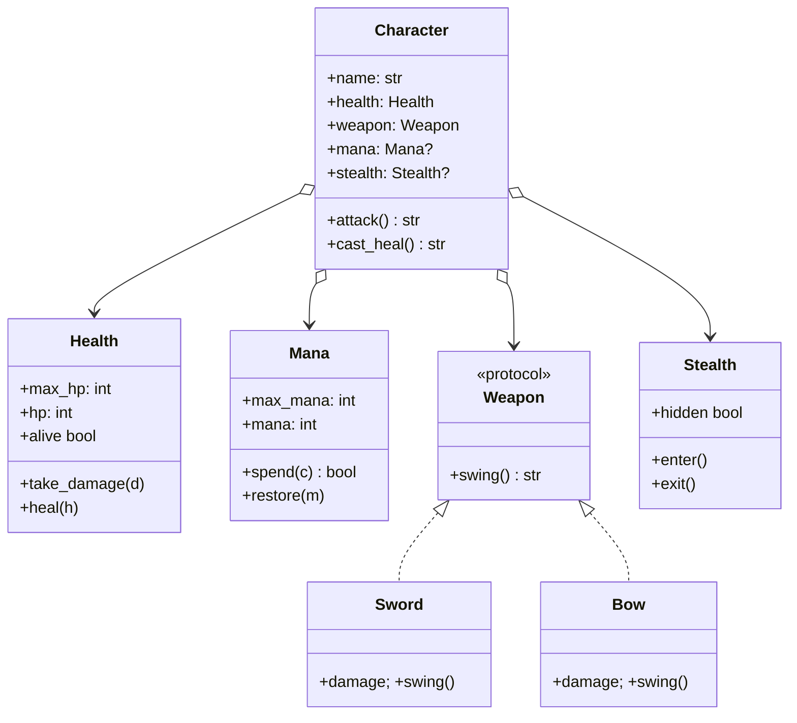
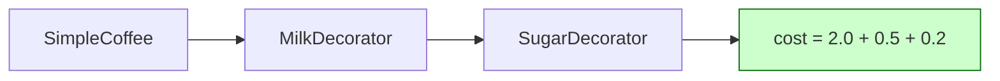
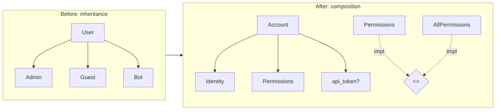
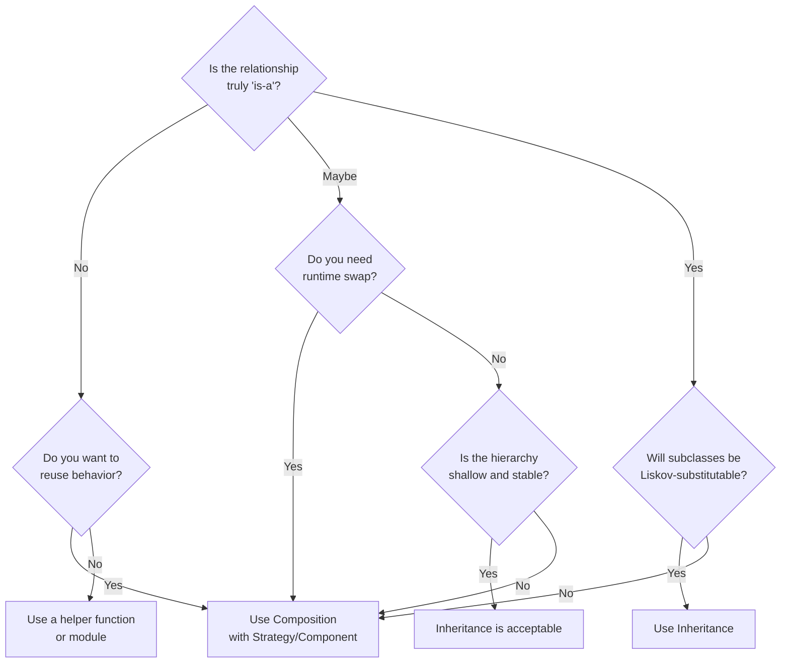
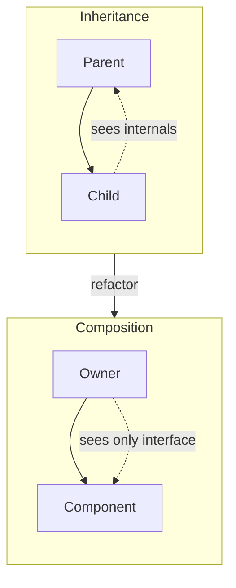
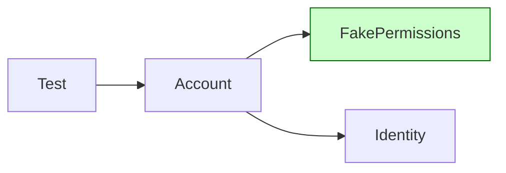

# Composition Over Inheritance — The Principle That Reframes OOP

#oop #composition #inheritance #design-principles #teaching #deep-dive

> [!quote] Gang of Four (1994)
> "Favor object composition over class inheritance."

That single sentence, buried on page 20 of *Design Patterns: Elements of Reusable Object-Oriented Software*, may be the most consequential advice in modern OOP. It tells us that the most famous feature of object-oriented programming — **inheritance** — is also the most overused and the most dangerous when applied casually. This note unpacks the principle in depth: why inheritance fails, why composition wins, when each is appropriate, and how to refactor from one to the other in real Python code.

Prerequisites: [[Inheritance]], [[Encapsulation]], [[Liskov-Substitution]], [[SOLID-Overview]].

---

## 1. What the Principle Actually Says

"Favor composition over inheritance" is **not** a ban on inheritance. It is a default ordering of preferences:

1. **Default to composition** when you need to reuse behavior.
2. **Reach for inheritance only when there is a genuine "is-a" relationship** — a true subtype, behaviorally substitutable, and statically known at compile time.

The trick is that almost every situation where developers *instinctively* write `class B(A):` is **not** a genuine is-a relationship. It is usually a "B wants to reuse some code that A happens to have." That is a **has-a** relationship in disguise — and that's where composition shines.

> [!info] Has-a vs Is-a
> - **Is-a**: a `Dog` *is an* `Animal`. Wherever an `Animal` is expected, a `Dog` works. The Dog-ness is essential.
> - **Has-a**: a `Car` *has an* `Engine`. The engine is a component — you can swap it for a different engine without the car ceasing to be a car.



---

## 2. Why Inheritance Is Overused

Inheritance is **seductive**. Beginners learn it as "the cool feature of OOP," and once they have a hammer, everything looks like a nail. Let's catalog the specific problems this causes.

### 2.1 Brittle Hierarchies

Inheritance locks you into a fixed taxonomy. Once `NinjaDog` extends `FightingDog` extends `Dog` extends `Mammal` extends `Animal`, **every change to `Animal` ripples** through the entire subtree. If you want `Mammal` to gain a new field, you must verify it doesn't break `Fish`, `Bird`, and `Reptile` siblings.

The classic warning sign is a **deep inheritance chain** — more than 2–3 levels usually means you've built a house of cards.



Every level adds rigidity. By the time you reach `StealthNinjaDog`, refactoring `Animal` is a multi-day task.

### 2.2 Tight Coupling

Subclasses know **way too much** about their parents. They can read protected fields, call protected methods, override half a method's behavior, rely on side effects of `super().__init__()`. The parent becomes impossible to refactor without auditing every descendant.

```python
class BaseReport:
    def __init__(self):
        self._rows = []         # "protected"
        self._title = "Report"  # "protected"

    def _validate_row(self, row):  # "protected" hook
        return True

class SalesReport(BaseReport):
    def add_sale(self, sale):
        # Coupled to parent internals:
        if self._validate_row(sale) and self._title.startswith("Sales"):
            self._rows.append(sale)
```

If `BaseReport` renames `_rows` to `_data`, `SalesReport` silently breaks.

### 2.3 Liskov Substitution Violations

Subclasses that "override but not quite" violate [[Liskov-Substitution]]. The textbook example:

```python
class Rectangle:
    def __init__(self, w, h): self._w, self._h = w, h
    @property
    def width(self):  return self._w
    @width.setter
    def width(self, v): self._w = v
    @property
    def height(self): return self._h
    @height.setter
    def height(self, v): self._h = v
    def area(self): return self._w * self._h

class Square(Rectangle):
    """A square is a rectangle, right?"""
    @property
    def width(self): return self._w
    @width.setter
    def width(self, v):
        self._w = self._h = v   # breaks Rectangle's contract
    @property
    def height(self): return self._h
    @height.setter
    def height(self, v):
        self._w = self._h = v
```

Now code that legitimately assumes rectangles can have independent width and height:

```python
def resize(r: Rectangle):
    r.width = 5
    r.height = 10
    assert r.area() == 50   # BOOM if r is a Square
```

This is **the** canonical LSP violation, and it arose from a "natural" inheritance decision (`Square extends Rectangle`).

### 2.4 Inheritance Is Static

Inheritance is decided at class-definition time. You cannot turn a `Dog` into a `Cat` at runtime. You cannot say "this object is sometimes sortable, sometimes not." If you find yourself needing **dynamic behavior**, inheritance fights you — you end up with state flags inside the parent that switch behaviors, which is just a hand-rolled, ugly version of composition.

```python
# The wrong way: flag-driven behavior in a hierarchy
class Animal:
    def __init__(self):
        self.can_fly = False
        self.can_swim = False
    def move(self):
        if self.can_fly:  return "flying"
        if self.can_swim: return "swimming"
        return "walking"

class Duck(Animal):
    def __init__(self):
        super().__init__()
        self.can_fly = True
        self.can_swim = True
    def move(self):
        # Now what? Fly AND swim? We're in trouble.
        ...
```

---

## 3. Why Composition Is Better

Composition means: **build objects out of smaller objects**. Don't derive — delegate.

### 3.1 Flexibility (Swap at Runtime)

With composition, an object's behavior is determined by the components it holds — and you can replace them while the program runs:

```python
class Character:
    def __init__(self, weapon):
        self.weapon = weapon        # component

    def attack(self):
        return self.weapon.swing()

class Sword:
    def swing(self): return "slash for 12 dmg"

class Bow:
    def swing(self): return "arrow for 8 dmg"

hero = Character(Sword())
print(hero.attack())   # slash for 12 dmg
hero.weapon = Bow()    # swap at runtime — impossible with inheritance
print(hero.attack())   # arrow for 8 dmg
```

Try doing that with `class Hero(Sword)`. You can't.

### 3.2 Loose Coupling

Components talk to each other through **narrow interfaces**. `Character` doesn't know `Bow` exists — it only knows "anything with a `.swing()` method." Refactor `Bow` to `Crossbow`? `Character` doesn't care.

### 3.3 Reuse Without "Is-a"

You can reuse code without claiming a relationship that isn't true. A `User` doesn't have to be a `Logger` to log — it can *have* a `Logger`.

### 3.4 Aligns With SOLID

| Principle | How composition supports it |
|---|---|
| **S** — [[Single-Responsibility]] | Each component has one job; the composing class orchestrates. |
| **O** — [[Open-Closed]] | Add behavior by adding components, not modifying hierarchies. |
| **L** — [[Liskov-Substitution]] | No fragile subtypes; substitutability is enforced by interface, not bloodline. |
| **I** — [[Interface-Segregation]] | Components expose only the methods they need; clients depend on narrow role interfaces. |
| **D** — [[Dependency-Inversion]] | Depend on abstract components (interfaces/protocols) injected from outside. |

> [!tip] Teaching Tip
> When students ask "how do I make a class do two things?", the instinct is multiple inheritance. The right answer is **composition with two fields**. Have them write both versions and watch which one survives a change in requirements.

---

## 4. The Bad Way — A Deep Inheritance Chain

Let's look at the classic mistake in full. We're modeling game characters, and a junior dev reaches for inheritance every time.

```python
# ❌ Bad: inheritance everywhere
class Entity:
    def __init__(self, name, hp=100):
        self.name = name
        self.hp = hp
    def take_damage(self, d):
        self.hp -= d

class Character(Entity):
    def __init__(self, name, hp=100, weapon="fist"):
        super().__init__(name, hp)
        self.weapon = weapon
    def attack(self):
        return f"{self.name} hits with {self.weapon}"

class Warrior(Character):
    def __init__(self, name):
        super().__init__(name, hp=150, weapon="sword")
    def bash(self):
        return f"{self.name} bashes for 20"

class Paladin(Warrior):
    def __init__(self, name):
        super().__init__(name)
        self.mana = 50
    def heal(self):
        self.hp += 10
        self.mana -= 5
        return f"{self.name} heals for 10"

class NinjaPaladin(Paladin):
    """Because why not?"""
    def __init__(self, name):
        super().__init__(name)
        self.stealth = True
    def attack(self):
        if self.stealth:
            return f"{self.name} backstabs silently"
        return super().attack()
```

Already the cracks show:

- A `Paladin` *must* be a `Warrior` — what if we want a *spellcasting* paladin?
- Adding "ranged" behavior means either duplicating it or piling on more base classes (see [[Mixins-And-Multiple-Inheritance]] for that rabbit hole).
- The `attack()` override in `NinjaPaladin` must remember to call `super().attack()` correctly.
- There is no way to give `Paladin` a *different* weapon at runtime.

---

## 5. The Good Way — Composition with Components

Here's the same problem, reframed with composition. Instead of "what *is* this character?", we ask "what *parts* does this character have?"

```python
# ✅ Good: composition with pluggable components
from dataclasses import dataclass, field
from typing import Protocol

# --- Components ---

class Health:
    def __init__(self, max_hp: int):
        self.max_hp = max_hp
        self.hp = max_hp
    def take_damage(self, d: int): self.hp = max(0, self.hp - d)
    def heal(self, h: int):        self.hp = min(self.max_hp, self.hp + h)
    @property
    def alive(self) -> bool:       return self.hp > 0

class Mana:
    def __init__(self, max_mana: int):
        self.max_mana = max_mana
        self.mana = max_mana
    def spend(self, c: int) -> bool:
        if self.mana < c: return False
        self.mana -= c
        return True
    def restore(self, m: int): self.mana = min(self.max_mana, self.mana + m)

class Weapon(Protocol):
    def swing(self) -> str: ...

@dataclass
class Sword:
    damage: int = 12
    def swing(self) -> str: return f"slash for {self.damage}"

@dataclass
class Bow:
    damage: int = 8
    def swing(self) -> str: return f"arrow for {self.damage}"

class Stealth:
    def __init__(self): self.hidden = False
    def enter(self):  self.hidden = True
    def exit(self):   self.hidden = False

# --- The composed entity ---

@dataclass
class Character:
    name: str
    health: Health
    weapon: Weapon
    mana: Mana | None = None
    stealth: Stealth | None = None

    def attack(self) -> str:
        if self.stealth and self.stealth.hidden:
            self.stealth.exit()
            return f"{self.name} backstabs for {self.weapon.damage * 2}"
        return f"{self.name} {self.weapon.swing()}"

    def cast_heal(self) -> str:
        if self.mana and self.mana.spend(5):
            self.health.heal(10)
            return f"{self.name} heals for 10"
        return f"{self.name} has no mana"

# --- Building different characters ---

hero = Character(
    name="Aria",
    health=Health(150),
    weapon=Sword(),
    mana=Mana(50),
    stealth=Stealth(),
)

scout = Character(
    name="Robin",
    health=Health(90),
    weapon=Bow(),
    stealth=Stealth(),
)

hero.stealth.enter()
print(hero.attack())      # Aria backstabs for 24
print(hero.attack())      # Aria slash for 12
print(hero.cast_heal())   # Aria heals for 10
print(scout.attack())     # Robin arrow for 8
```

Look at what we gained:

- A `Character` is built from independent, swappable parts.
- Adding a new weapon type means writing a tiny dataclass — no inheritance tree to extend.
- A character can have mana, or not, simply by setting the field to `None`.
- Each component is independently testable.
- We can construct characters from data (e.g., a save file) by mapping fields to components.



---

## 6. Two Famous Patterns Built on Composition

Composition isn't just a technique; it's the engine behind several [[Structural-Patterns]] and [[Behavioral-Patterns]].

### 6.1 The Strategy Pattern

[[Behavioral-Patterns|Strategy]] encapsulates an algorithm in an object and lets you swap it at runtime. It is composition in its purest form: "the context *has-a* strategy."

```python
from typing import Protocol

class DiscountStrategy(Protocol):
    def apply(self, total: float) -> float: ...

class NoDiscount:
    def apply(self, total): return total

class TenPercentOff:
    def apply(self, total): return total * 0.9

class BlackFriday:
    def apply(self, total): return total * 0.5

class Order:
    def __init__(self, total, discount: DiscountStrategy):
        self.total = total
        self.discount = discount
    def final_price(self) -> float:
        return self.discount.apply(self.total)

# Swap strategies per order:
o1 = Order(100, NoDiscount())
o2 = Order(100, TenPercentOff())
o3 = Order(100, BlackFriday())
print(o1.final_price(), o2.final_price(), o3.final_price())
# 100.0 90.0 50.0
```

Trying to do this with inheritance would mean `class NoDiscountOrder(Order)`, `class TenPercentOffOrder(Order)`, etc. — one class per strategy, no runtime swap, combinatorial explosion if multiple axes vary.

### 6.2 The Decorator Pattern

[[Structural-Patterns|Decorator]] wraps an object with another object that implements the same interface, adding behavior. Again, pure composition: the decorator *has-a* the decorated object.

```python
from typing import Protocol

class Coffee(Protocol):
    def cost(self) -> float: ...
    def description(self) -> str: ...

class SimpleCoffee:
    def cost(self): return 2.0
    def description(self): return "coffee"

class MilkDecorator:
    def __init__(self, inner: Coffee):
        self._inner = inner
    def cost(self): return self._inner.cost() + 0.5
    def description(self): return self._inner.description() + " + milk"

class SugarDecorator:
    def __init__(self, inner: Coffee):
        self._inner = inner
    def cost(self): return self._inner.cost() + 0.2
    def description(self): return self._inner.description() + " + sugar"

c = SugarDecorator(MilkDecorator(SimpleCoffee()))
print(c.cost(), c.description())
# 2.7 coffee + milk + sugar
```

Each decorator *has-a* `Coffee`. They never inherit from `SimpleCoffee`. They share only an interface.



---

## 7. The "Composition Root" — Where Inversion Happens

Composition raises a question: **who wires the components together?** If `Character` doesn't know which `Weapon` to use, something has to decide. That something is the **composition root** — the single place near the top of your application (usually `main()` or a DI container) where objects are constructed and wired.

```python
# config.py / main.py — the composition root
def build_game() -> Game:
    # All "new" calls live here, not scattered across the codebase.
    sword = Sword(damage=12)
    bow   = Bow(damage=8)

    hero = Character(
        name="Aria",
        health=Health(150),
        weapon=sword,
        mana=Mana(50),
        stealth=Stealth(),
    )
    scout = Character(
        name="Robin",
        health=Health(90),
        weapon=bow,
        stealth=Stealth(),
    )
    return Game(players=[hero, scout])
```

This pattern is the heart of [[Dependency-Inversion]]: high-level policy (`Game`) doesn't construct low-level details (`Sword`); it receives them. The composition root is the *only* place that knows about concrete classes; everywhere else depends on interfaces.

> [!tip] Teaching Tip
> Have students grep their codebase for `= SomeClass(` outside of `main()` or factory modules. Every match is a tiny composition-root leak. Fixing those is a 30-minute refactor with huge testability payoff.

---

## 8. Modern Python: dataclasses + Composition

Python's `@dataclass` (see [[Dataclasses]]) is a composition-friendly tool. It removes the boilerplate of `__init__`, `__repr__`, and `__eq__`, and lets you build value objects that *contain* other value objects naturally:

```python
from dataclasses import dataclass, field

@dataclass(frozen=True)
class Money:
    amount: float
    currency: str

    def add(self, other: "Money") -> "Money":
        assert other.currency == self.currency
        return Money(self.amount + other.amount, self.currency)

@dataclass(frozen=True)
class LineItem:
    name: str
    price: Money
    qty: int = 1

    def subtotal(self) -> Money:
        return Money(self.price.amount * self.qty, self.price.currency)

@dataclass(frozen=True)
class Invoice:
    items: list[LineItem] = field(default_factory=list)

    def total(self) -> Money:
        cur = self.items[0].price.currency if self.items else "USD"
        return Money(sum(i.subtotal().amount for i in self.items), cur)

inv = Invoice(items=[
    LineItem("Book",  Money(12.0, "USD"), 2),
    LineItem("Pen",   Money(1.5,  "USD"), 5),
])
print(inv.total())   # Money(amount=31.5, currency='USD')
```

`Invoice` *has-a* list of `LineItem`s, each of which *has-a* `Money`. No inheritance anywhere. Each class is small, immutable, and independently testable.

---

## 9. Before/After — A Realistic Refactor

Let's watch a typical inheritance-to-composition refactor. The starting point: an auth system where every "user-like" thing inherits from `User`.

### 9.1 Before — Inheritance

```python
# ❌ Bad: inheritance tangled with roles
class User:
    def __init__(self, username, email):
        self.username = username
        self.email = email
        self._permissions = set()
    def can(self, action): return action in self._permissions
    def add_permission(self, p): self._permissions.add(p)

class Admin(User):
    def __init__(self, username, email):
        super().__init__(username, email)
        self._permissions = {"read", "write", "delete"}
    def can(self, action): return True   # admins can do anything

class Guest(User):
    def __init__(self, username):
        super().__init__(username, "")
        self._permissions = {"read"}

class Bot(User):
    """A bot has no email but is still a User... wait, is it?"""
    def __init__(self, name):
        super().__init__(name, None)  # email=None? Schema-unclear.
```

Problems:
- `Bot` is forced to inherit `email` even though it has none — schema lie.
- `Admin.can()` overrides base, breaking LSP subtleties (e.g., what if a future audit logs `add_permission` calls? Admins bypass them silently).
- Adding "API token authentication" means either another subclass or a flag.

### 9.2 After — Composition

```python
# ✅ Good: roles as components
from dataclasses import dataclass, field

@dataclass(frozen=True)
class Identity:
    username: str
    email: str | None = None

class Permissions:
    """Role-based permissions, swappable at runtime."""
    def __init__(self, allowed: set[str] | None = None):
        self.allowed = set(allowed or [])
    def can(self, action: str) -> bool:
        return action in self.allowed
    def grant(self, action: str): self.allowed.add(action)

class AllPermissions:
    """Special strategy — admin-level access."""
    def can(self, action: str) -> bool: return True
    def grant(self, action: str): pass  # no-op

@dataclass
class Account:
    identity: Identity
    permissions: Permissions   # injected — could be Permissions or AllPermissions
    api_token: str | None = None  # only present for bots

# Building different account types:
alice = Account(
    identity=Identity("alice", "alice@x.io"),
    permissions=Permissions({"read", "write"}),
)
admin = Account(
    identity=Identity("root", "root@x.io"),
    permissions=AllPermissions(),
)
bot = Account(
    identity=Identity("deploy-bot", None),
    permissions=Permissions({"deploy"}),
    api_token="tok_12345",
)

for acct in (alice, admin, bot):
    print(acct.identity.username, "can delete?", acct.permissions.can("delete"))
# alice can delete? False
# root can delete? True
# deploy-bot can delete? False
```

The refactor wins:
- No inheritance lies — `Account` is just an account; what varies is *which permissions object it has*.
- `Bot` doesn't fake an email field — it just has `email=None`.
- Adding a new permission strategy (e.g., `RBAC`, `ABAC`) is a new class, no tree edit.
- Each component (`Identity`, `Permissions`, `AllPermissions`) is independently testable.



---

## 10. When You SHOULD Still Use Inheritance

Inheritance is not the enemy — **misuse** is. Genuine uses:

1. **Real taxonomies** where the subtype is-a relationship is meaningful and stable.
   - `class SavingsAccount(BankAccount)` — a savings account really is a bank account; the LSP holds.
   - `class Circle(Shape)` — a circle is a shape; substitutable everywhere `Shape` is expected.
2. **Polymorphism** through a shared abstract base, where subclasses genuinely vary behavior (Template Method, [[Abstract-Base-Classes]]).
3. **Framework integration** where the framework requires subclassing (`class MyView(FlaskView)`, `class UserAdmin(ModelAdmin)`).
4. **Exception hierarchies** — `class ValidationError(Exception)` is fine.
5. **Type hierarchies for domain models** where subtypes are conceptually distinct and closed (`class PaymentMethod` → `Card`, `BankTransfer`, `Cash`).

> [!warning] Common Student Misconception
> Students often conclude "inheritance is bad, never use it." **No.** The principle is *favor composition over inheritance* — favor, not *ban*. Inheritance is the right tool when you have a true subtype relationship that is statically known. The mistake is using it for *code reuse*.

---

## 11. Decision Tree — Inheritance or Composition?



---

## 12. Common Pitfalls When Adopting Composition

### 12.1 The "Bag of Components" Smell

If a class has 15 component fields, it's probably violating [[Single-Responsibility]]. Split the orchestrator into smaller orchestrators.

### 12.2 Forgetting to Forward Calls

A subtle composition bug: forgetting to delegate. If `Character` has a `health` component, but code outside the class calls `character.health.hp -= 5` directly, you've broken encapsulation. Add a forwarding method:

```python
def take_damage(self, d):
    self.health.take_damage(d)
```

### 12.3 Over-Abstracting

Don't introduce `WeaponFactoryBuilderProvider` for two weapon types. Start concrete. Refactor to interfaces when you have a *third* concrete type or a real test need.

### 12.4 Lifecycle Confusion

With composition, components often have their own lifecycle. Be explicit: does the `Character` *own* the `Weapon` (and should destroy it), or does it share it (and someone else manages it)? In Python this matters less than in C++, but conceptually it shapes how you design construction.

> [!warning] Common Student Misconception
> "Composition is just stuffing objects into a dict." It's not — the key is *delegation through narrow interfaces*. A class with a 20-field `__init__` and no methods is not composition; it's a data bag. Composition is meaningful when the composing class *orchestrates* its components behind a clean API.

---

## 13. Comparison Summary

| Aspect | Inheritance | Composition |
|---|---|---|
| Relationship | "is-a" | "has-a" |
| Decided at | Class definition (static) | Object construction (dynamic) |
| Coupling | Tight (subclass sees parent internals) | Loose (only interface shared) |
| Reuse mechanism | White-box (subclass reuses parent code) | Black-box (component reuses its own code) |
| Runtime flexibility | None | High — swap components |
| Testability | Hard (must mock whole hierarchy) | Easy (inject fakes) |
| Typical misuse | "B is kind of like A, let me extend A" | (rarely misused) |
| When to prefer | True subtype, stable, closed | Behavior reuse, runtime flexibility |



---

## 14. Testing Implications — Why Composition Makes Tests Easy

A subtle but powerful benefit of composition: it makes your code **testable by construction**. Every component is a small, focused object with a narrow interface — exactly the shape that's easy to fake in tests.

Consider the inheritance version of the auth system from section 9.1. To test `Admin.can("delete")`, you must instantiate a full `Admin`, which means a full `User`, which means a real `email` field, real `_permissions` set, etc. There's no seam to inject a fake.

With the composition version (9.2), you can test `Account` with a hand-written fake permissions object:

```python
class FakeAlwaysAllow:
    def can(self, action): return True
    def grant(self, action): pass

class FakeRecording:
    def __init__(self): self.granted = []
    def can(self, action): return False
    def grant(self, action): self.granted.append(action)

def test_admin_can_delete():
    acct = Account(
        identity=Identity("root", None),
        permissions=FakeAlwaysAllow(),
    )
    assert acct.permissions.can("delete") is True

def test_grant_records_action():
    fake = FakeRecording()
    acct = Account(identity=Identity("alice", "a@x.io"), permissions=fake)
    acct.permissions.grant("read")
    assert fake.granted == ["read"]
```

Notice: **no mocks library needed**. Hand-rolled fakes suffice because each component has a tiny interface (two methods). This is the [[Interface-Segregation]] payoff in practice.



Compare with the inheritance version: you'd have to subclass `User`, override `__init__`, monkeypatch internals, or pull in `unittest.mock.MagicMock`. Composition lets you test the system as a graph of small, replaceable parts.

> [!tip] Teaching Tip
> Ask students: "How would you test `Admin.can()` without hitting a database?" Watch them reach for `MagicMock`. Then show them the composition version with a hand-rolled fake — the "aha" moment is when they realize mocks are *a symptom* of poor seams, not a requirement of testing.

---

## 15. Composition in the Wild — Frameworks That Got It Right

Modern Python frameworks lean heavily on composition:

- **Django** uses class-based views with **mixins** (see [[Mixins-And-Multiple-Inheritance]]) — composition of behaviors like `LoginRequiredMixin`, `FormMixin`.
- **Flask-AppBuilder** models views as composed sets of properties (`list_columns`, `show_columns`) rather than deep inheritance.
- **SQLAlchemy** separates `Engine` (connection), `Session` (unit of work), and `Mapper` (object-relational mapping) as composed collaborators.
- **FastAPI** depends on **dependency injection** — every endpoint is a function whose dependencies are composed by the framework.
- **Pytest** uses fixtures (composed dependencies) instead of inheritance-heavy test base classes.

The pattern is industry-wide: frameworks that survived a decade have moved away from deep inheritance trees toward composition + dependency injection. Newer frameworks (FastAPI, Sanic, Starlette) start from composition day one.

---

## 16. A Word on Performance

Composition has a (usually negligible) runtime cost: each delegated call is one extra attribute lookup and one extra function call. In hot loops over millions of items, this can matter. Solutions:

- Cache the component reference locally: `weapon = self.weapon; for _ in range(N): weapon.swing()`.
- Use `__slots__` (see [[Slots-And-Memory]]) to speed up attribute access on the composed class.
- Profile before optimizing — 99% of the time, composition overhead is invisible.

The architectural benefits (testability, flexibility, clarity) almost always outweigh microsecond-level performance concerns. Reach for inheritance on performance grounds only after profiling confirms it's the bottleneck.

---

## 17. Recap and Next Steps

Composition over inheritance is a **default ordering of preferences**, not a ban. When in doubt, ask:

1. Is this a real *is-a* subtype, or am I just trying to reuse code?
2. Will I ever want to swap this behavior at runtime?
3. Will subclasses actually be substitutable for their parent?
4. Is the hierarchy shallow and stable, or is it growing deeper every sprint?

If any answer points away from inheritance, **compose**. Build small, focused, independently testable objects, and wire them together at a single composition root.

### The Cultural Shift

Adopting composition over inheritance is partly technical, partly cultural. Teams that "get it" share three habits:

- **Review every `class X(Y):`** in pull requests. The default question is: "Is X really a Y, or does it just want Y's behavior?" The latter triggers a refactor.
- **Build a composition root early.** Even a tiny app benefits from a single `build_app()` function that wires everything together. It's the seam that makes future changes localized.
- **Prefer injecting collaborators over creating them.** When a class needs a `Logger`, it shouldn't `logging.getLogger()` itself — it should accept one in `__init__`. That single rule unlocks most of the SOLID benefits automatically.

These habits compound. A codebase that consistently follows them becomes *soft* — easy to change, easy to test, easy to reason about. A codebase that doesn't becomes *brittle* — every change touches a dozen files, every test needs a forest of mocks, every refactor is a multi-day expedition.

The choice is yours, one `class` declaration at a time.

### What to read next

- [[Mixins-And-Multiple-Inheritance]] — when mixins help and when they're a disguised inheritance mess.
- [[Interfaces-And-Protocols]] — the contracts that make composition work in Python.
- [[Structural-Patterns]] — Decorator, Adapter, Facade, all built on composition.
- [[Behavioral-Patterns]] — Strategy, State, Command, all composition-based.
- [[Dependency-Inversion]] — the principle that pushes you toward a composition root.
- [[Liskov-Substitution]] — the rule that tells you when inheritance is actually safe.

### Exercises

1. Take the `Rectangle`/`Square` example and refactor it using composition. Hint: a `Shape` *has-a* `Width` and `Height`, and a `Square` is a `Shape` constructed with `width == height`.
2. Implement a text formatter that can be combined: `Trim | Lowercase | Capitalize`. Use the Decorator pattern. Then try it with inheritance and count the subclasses you'd need.
3. Refactor the auth example in your own codebase. Locate every `class X(User)` and decide: is `X` really a `User`, or does it just *have* permissions?
4. Build a game character with three independently swappable behaviors (movement, weapon, special ability) using composition. Add a new weapon type without touching `Character`.

> [!success] You've Got It When…
> You can name three real situations in your current codebase where you *would* still choose inheritance, and explain why each is a true is-a subtype. Everything else should look suspicious to you.
